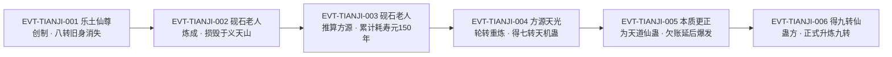

# 天机蛊

天道体系里唯一一只**"不用推就能拿到答案"的仙蛊**：原文给它的定义是「天机蛊是令蛊师直接询问天地」`E:V4-122248`，与常规智道蛊师"收集证据、证据越多越好"的推演路线正好相反。它的代价也写得极硬——十次催用至少八次失败，失败反噬不伤身体魂魄，**只扣寿元**，一次十年至七十年。

本页为 2026-09-28 A 线恢复批**新建页**。本页证据厚（「天机蛊」全书 70 次命中 / 67 行，另有「天机仙蛊」41 次 / 40 行），因此主题按该实体**自身的机制切分**：道属、机制、代价、转数、升炼、杀招接口六块，不套用通用题目。所有引文回根原文 `source/蛊真人-clean.txt` 逐行复核，行号即 `E:V{段}-{6位行号}`；正文按"原著事实／合理推导／《问真》设计意义"三层组织。

**本页的一个特殊口径**：天机蛊是"道属被原文自己改口"的实体——前中期叙述把它放在智道里讲，后期由方源亲手推翻（`E:V6-435684`）。本页把两套口径**原样并列**，不做统一。

## 主题档案

### 一、身份与道属：本质是天道仙蛊，"智道蛊"是原文自己推翻的旧口径

#### 原著事实

- **道属的最终口径**：「天机蛊本质上乃是天道蛊虫，但方源曾经一度时间误以为是智道蛊虫。」`E:V6-435684`；「天机蛊是天道仙蛊，修行天道的蛊修拥有足够的天道道痕，才能正常使用。」`E:V6-435700`。
- **旧口径（智道）**：「不过，智道当中。也有直接能令蛊仙直接得到答案的仙蛊。那便是天机蛊。」`E:V4-122240`；该段以"智道当中"起句，把天机蛊列进智道的例外项。
- **创制者与创制目的**：「历史记载，此蛊乃是乐土仙尊开创，他曾经拥有过八转的天机仙蛊，死后天机仙蛊就消失无踪了」`E:V4-122240`；「这只仙蛊原本是乐土仙尊所创，那个时候的乐土仙尊就有天道造诣了。」`E:V6-435686`；「天机蛊，便是他为了感应天地而创，也是他一直企图再次师法自然的尝试成果。」`E:V4-122246`。
- **传承链（三段）**：创制于乐土仙尊 `E:V6-435686` → 「之后天机仙蛊被幽魂魔尊的分魂之一的砚石老人炼成，损毁在义天山一战中。」`E:V6-435688` → 「最终，天机仙蛊再次被方源炼成。」`E:V6-435690`。
- **归因于"误解"的自我说明**：「这个弊端，其实正是世人对天机蛊本质误解的表现。」`E:V6-435698`；「回头来看，砚石老人当初并没有认清天机蛊的本质。」`E:V6-435712`。
- **与智慧蛊的比较（原文用"效果"区分，不用道属区分）**：「蛊虫效用单一，就算是九转智慧蛊也不例外。」`E:V4-122244`；同段判语「但就算再强，也达不到天机蛊的效果。」`E:V4-122244`。
- **同一体系内的位置（旁证）**：「寿蛊隶属天道，蛊修的寿元其实就是天道道痕。」`E:V6-435710`——原文把"扣寿元"与"天道道痕"挂钩，正落在这条道属上。

#### 合理推导

- **依据**：`E:V6-435700`（天道仙蛊，需足够天道道痕才能正常使用）＋`E:V6-435710`（寿元即天道道痕）；**结论**：天机蛊的"失败即扣寿元"不是随机惩罚，而是**同一体系内的资源结算**——使用者缺的是天道道痕／天道仙材，扣的正是天道侧的东西；**不确定性或可能反例**：原文用「弊端表象」`E:V6-435708` 一词，暗示"扣寿元"是**表象**而非本相；是否存在其他同样"表象化"的副作用，原文未列。
- **依据**：`E:V4-122240`（智道口径）对 `E:V6-435684`（天道口径）；**结论**：两口径不是矛盾而是**认识递进**——原文自述「流派是不断向前发展的，蛊虫的本质也是在使用的时候，逐渐探究清楚的」`E:V6-435714`；**不确定性或可能反例**：早期智道口径也非全错，原文用「智道杀招石洞天机」`E:V5-277566` 作杀招归属，说明"按智道用法使用天机蛊"在实操层面长期存在。

#### 《问真》设计意义

- "道属被后文改口"是**知识型道具**的天然设定：同一只蛊，按旧口径（智道）使用会踩坑（失败率高），按新口径（天道）使用才顺。设计上适合把"识破本质"做成一条独立进度线，而不是把新旧口径简单判对错。
- 原文把"效力"和"道属"分开比较（`E:V4-122244`）：智慧蛊再强也达不到天机蛊的效果，**但天机蛊又不是纯上位替代**（它的失败率极高）。这给了一个"上限极高、方差极大"的道具模板。

### 二、机制：直接询问天地，抓一缕天机即得答案，且无须推导

#### 原著事实

- **核心机制**：「那便是天机蛊。蛊师无须念头碰撞，不用推导，就能够抓住一缕天机，直接得到答案。」`E:V4-122240`；「天机蛊是令蛊师直接询问天地。」`E:V4-122248`。
- **可询问的范围（三条同源表述）**：「只要是在天地中发生的事情，就没有天地不知道的。」`E:V4-122250`；「催动天机仙蛊，可以侦测天意的想法，刺探出灾劫内容，可以令蛊仙直接询问天地答案。」`E:V6-435692`；「能将天地的机密都泄露出来，哪怕蛊仙没有任何证据，也能直指真相。」`E:V6-435692`。
- **与常规智道推演的反差**：「没有天机蛊，智道蛊师按部就班地去推算，就要收集证据，且证据越多越好。」`E:V4-122256`。
- **杀招接口（本页唯一写明的外化用法）**：「练习的所有杀招当中，智道杀招石洞天机是重中之重。」`E:V5-277566`；「这个杀招以天机蛊为核心，能够洞察出蛊仙的下一次灾劫内容。」`E:V5-277568`。
- **同一杀招的明写上限**：「当然，它也有能力上的极限，比如现在，方源就不能推算出他的下一场浩劫具体是什么。他需要再等一段时间，才能够推算出来。」`E:V5-277568`。
- **实战层面的自信来源**：「什么地灾天劫，他都已经无视。至于浩劫，有天机蛊在手，又掌握了石洞天机，他怕什么？」`E:V5-277626`。

#### 合理推导

- **依据**：`E:V4-122240`、`E:V4-122248`、`E:V6-435692`；**结论**：天机蛊提供的是**免证据的直答**，因此它的价值与"目标是否留下了证据"**无关**（原文另举反例：大同风把方源在王庭福地的痕迹抹净，只能让**没有天机蛊**的智道蛊师无从下手，`E:V4-122254` 邻域）；**不确定性或可能反例**：`E:V4-122250` 的"天地不知道的事就不存在"是一条**本体论式**断言，原文没有给出任何"问不到"的实测反例，本页不把它当作可验证规则。
- **依据**：`E:V5-277568`；**结论**：以天机蛊为核心的杀招**有明确的能力上限**（推不出"具体的下一场浩劫"，只能等时间），因此"直答"不等于"全知"；**不确定性或可能反例**：该上限是杀招的局限还是天机蛊的局限，原文未拆分（`E:V5-277568` 的主语是"它"＝该杀招）。

#### 《问真》设计意义

- "免证据直答 + 有等待窗口"是一组可直接落地的**情报玩法参数**：玩家拿到的是**必然为真但可能滞后**的答案，天然带"要不要现在就问"的抉择，比"消耗资源换线索"更贴原文。
- 天机蛊被做成"杀招核心"而非"直接点击使用"，说明原著把它定位为**组件**：单蛊只是能力源，真正的玩法在杀招与配合（`E:V5-277568`、`E:V5-277626`）。

### 三、代价与弊端：十次催用至少八次失败，反噬不伤身魂、只扣寿元

#### 原著事实

- **比率（明文）**：「砚石老人并不是每次催动它，都能获得成功。十次催用天机蛊，至少有八次会失败。一旦失败，砚石老人就会受到仙蛊的反噬。」`E:V3-090594`；总述同义：「天机蛊虽然能力强大，却也有着弊端。」`E:V3-090592`；「天机蛊虽然强大，但也是个坑。使用它的成功率太低」`E:V3-090616`。
- **反噬的落点（明文）**：「砚石老人的身体、魂魄毫无损伤，天机蛊的反噬只针对他的寿元。」`E:V3-090598`；「一旦反噬，砚石老人就会失去，十年至七十年不等的寿命！」`E:V3-090600`。
- **典型值（明文）**：「而且这等小事，一般反噬的结果也不严重，正常是十三四年的寿命。」`E:V3-090608`。
- **累计个案（同一使用者）**：先「浪费了七十年的寿元」`E:V3-090618`，再「又耗费了八十年寿命」`E:V3-090628`，结果是「为了这只定仙游，砚石老人整整耗去了一百五十年的寿元。」`E:V3-090632`；另一次「这一次用了天机蛊，损耗了上百载的寿元。」`E:V4-187026`。
- **使用前的成本核算（原文写出的决策过程）**：「我为此而动用天机蛊，值不值得呢？」`E:V3-090610`。
- **后期揭示的真实机制**：「催动天机蛊，不仅需要仙元，还需要一定量的天道仙材。」`E:V6-435702`；「没有天道仙材消耗，天机蛊也可以勉强催动成功，代价就是所需的天道仙材消耗会加大，拖延到下一次使用的时候爆发。」`E:V6-435706`；「这就有了失败反噬后，蛊修损失寿元的弊端表象了。」`E:V6-435708`。
- **文本异文（须登记）**：`E:V6-435696` 写作「十次催用天机蛊，至少有旦失败就会受到反噬，损失十年至七十年不等的寿元。」——该行"至少有几"处的字面为"旦"，与 `E:V3-090594` 的"八次"不符，本页按原文逐字保留该行原貌，不代改。

#### 代价与收益（支付方／受益方／支付时点）

- **支付方**：**使用者本人**（砚石老人以寿元支付，`E:V3-090598`、`E:V3-090632`；亦可视为以天道仙材支付，`E:V6-435702`）。
- **受益方**：**使用者本人**（换到的是所需的答案：定仙游去向 `E:V3-090618`、春秋蝉状态 `E:V4-187026`）。本实体**不适用"受益方另有其人"的情形**——原文的每一次使用记录，追问的都是使用者自己要解决的问题。
- **支付时点／生效条件**：失败**当场**扣寿元（`E:V3-090594`、`E:V3-090600`）；若用"免天道仙材"的勉强催动，则欠下的消耗**不在当次结算，而是拖延到下一次使用爆发**`E:V6-435706`。

#### 合理推导

- **依据**：`E:V6-435702`、`E:V6-435706`、`E:V6-435708`；**结论**：所谓"失败反噬扣寿元"其实是**天道仙材欠账的延后结算**，"失败率"由此获得一个统一的物理解释（欠账越多、到期越痛）；**不确定性或可能反例**：原文只说"拖延到下一次使用的时候爆发"，**没有**给出欠账与扣寿年数的换算；"十次至少八次失败"是否也随使用者天道造诣变化，原文未写。
- **依据**：`E:V3-090600`（十年至七十年）＋`E:V3-090608`（正常十三四年）；**结论**：反噬的**方差极大**（同一机制下 10 至 70 年，常见值 13–14 年），因此使用者在决策时只能按期望值估算，无法保证单次成本；**不确定性或可能反例**：`E:V3-090600` 的"十年"与 `E:V3-090608` 的"十三四年"是**两个独立窗口**的表述，原文未说明哪个是下限、"正常"的统计口径是什么。

#### 《问真》设计意义

- "高失败率 + 高方差扣血上限（寿元）"是可用的**豪赌型道具**：期望成本可算、单次结果不可控，天然产生"要不要用"的戏剧张力。
- `E:V6-435706` 的"欠账延后爆发"是比"当场扣血"更狠的设计：它允许玩家**透支催用**，把惩罚延后到下一次，形成一条自我强化的债务曲线。

### 四、转数：本实体的转数随时点变化，四段口径并存

#### 原著事实

- **【口径A】乐土仙尊时期＝八转**：「他曾经拥有过八转的天机仙蛊，死后天机仙蛊就消失无踪了」`E:V4-122240`。
- **【口径B】方源重炼＝七转**：「七转天机蛊，啪嗒一声，落到方源的头顶上。」`E:V5-276396`（**本页登记锚即此行；该行是正文独立成句行，非章节题名**）。
- **【口径C】后至八转**：「方源原本就有天道积累：八转层次的天机蛊、天妒蛊」`E:V6-425508`。
- **【口径D】九转仙蛊方**：「最关键的是，他还得到天机蛊的九转仙蛊方！」`E:V6-434980`；「方源当即决定，升炼他的第三只九转仙蛊——天机蛊！」`E:V6-434996`；来源与限制——「原先的天机蛊九转仙蛊方来源于事实浮冰，乃是无极魔尊自身底蕴，消化了天外混沌的成果。」`E:V6-435668`、**「也就是说，按照当下的天道，并没有九转的天机蛊。」**`E:V6-435670`。
- **题名行（只作存在性证据，不作转数证据）**：「章节目录 第四百五十六节：天机蛊成！」`E:V5-276222`——该行为章节目录题名，只能证明该名在全书出现；**本页的转数证据另取正文 `E:V5-276396` 等**。
- **易混的"七转"字形**：`E:V5-276396` 的"七转"直接修饰天机蛊本体，无歧义；但同段出现的"第一转／第二转……第七转"`E:V5-276368`–`E:V5-276384` 指的是**炼道杀招天光轮转的转数**，不是蛊的品阶，本页不引用。

#### 合理推导

- **依据**：`E:V4-122240`、`E:V5-276396`、`E:V6-425508`、`E:V6-434980`；**结论**：天机蛊**不是"某一只蛊的固定品阶"**，而是"同一只手法的多次重炼"——每一次重炼都可以给出不同转数，故本页对它的转数按**时点**登记，而不是给一个唯一值；**不确定性或可能反例**：`E:V6-435670` 明说"按照当下的天道没有九转的天机蛊"，那么 `E:V6-434996` 的"升炼第三只九转仙蛊"是否**最终成功**，本批取证窗口内未见结果；本页不预设成功。
- **依据**：`roster-3.md` 将本实体登记为"game 转 5／原文转 7"、锚点 `E:V5-276396`；**结论**：该"原文转 7"取自**方源重炼那一次的时点**（口径B），与口径A（八转）、口径C（八转）、口径D（九转方案）**并列而不互斥**；**不确定性或可能反例**：roster-3 的"原文转"列只能容纳一个值，因此它无法表达本实体的多时点性——这不是数据错误，是列位限制。

#### 《问真》设计意义

- 这类"多时点品阶"实体，如果游戏侧只存一个 rank，就会丢掉最核心的**成长叙事**（八转→七转→八转→九转方案）。落地时宜把"转数"做成**实例属性**而非物种属性。

### 五、升炼与形态：毛六起炼、天光轮转七转，形如柳枝的"蜻蜓"

#### 原著事实

- **炼制场合**：「现在，他再次将天机蛊炼至最后的阶段。」`E:V5-276346`。
- **关键杀招**：「炼道杀招天光轮转！」`E:V5-276366`；后期回溯亦同：「方源还记得当时动用的是天光轮转炼道杀招。」`E:V6-435690`。
- **成蛊**：「七转天机蛊，啪嗒一声，落到方源的头顶上。」`E:V5-276396`。
- **成功率的一次个案（研发风险）**：「他第一次炼制失败，没想到第二次就成功了。」`E:V5-276400`。
- **外形（本页唯一形态描写）**：「乍一看这只仙蛊，和蜻蜓非常类似，但细看的话，又觉得像是一段柳枝。」`E:V5-276408`；「整个天机仙蛊非常修长，有着成年半个胳膊的长短。」`E:V5-276410`。
- **在炼蛊计划中的位置**：「第一期炼蛊，方源炼成了净魂、自爱以及小吃。第二期炼蛊，方源则炼成了春秋蝉和天机蛊。」`E:V5-277426`。
- **旧身结局**：「之后天机仙蛊被幽魂魔尊的分魂之一的砚石老人炼成，损毁在义天山一战中。」`E:V6-435688`。

#### 合理推导

- **依据**：`E:V5-276400`＋`E:V5-277428`（「有的蛊仙甚至八百十次，都没有成功一次」邻近句）；**结论**：天机蛊的升炼属于**低成功率、可重复尝试**的炼道行为，"第二次就成功"在原文语境里是**运气好**（同段把原因部分归于运道手段，`E:V5-277430`）；**不确定性或可能反例**：原文未给天机蛊单次升炼的成功率数值。
- **依据**：`E:V6-435688`（损毁于义天山）；**结论**：天机蛊是**会损毁的实物**，不是永久概念——旧身毁于义天山一战，方源所炼是**重炼版**；**不确定性或可能反例**：砚石老人所炼那只的具体转数，原文在 `E:V6-435688` 未写。

#### 《问真》设计意义

- "同一只传奇蛊可以毁掉、再由后人重炼"给了一条**跨代传承**的叙事线：器物有历史，历史可中断。做成长期运营内容时，这是天然的资料片接口。

### 六、第二轮升炼：第三只九转仙蛊，"三尊对峙的转折点"

#### 原著事实

- **升炼启动**：「方源开始正式升炼天机蛊！」`E:V6-435944`；定位「这是他的第三只九转仙蛊」`E:V6-435946`。
- **前两只九转仙蛊（同段点名）**：「那么之后，升炼九转天元宝皇莲蛊成功，是方源大大缩短了他和其他尊者之间的差距。」`E:V6-436560`；「九转升炼蛊则是再次缩短差距，并且更加深方源在炼道方面的特长。」`E:V6-436562`。
- **仙蛊方被改良**：「幸好他耗费很大心力，改良了天机蛊的仙蛊方。」`E:V6-436524`。
- **借助的条件**：「再借助四元方悔血炼池，以及其他毛民炼道蛊仙辅助之下，天机蛊的升炼一直在有条不紊地继续着。」`E:V6-436526`。
- **过程难度**：「天机蛊升炼到了最难的关口，牵扯了巨量的念头和心神。」（原文第 436726 行）；「天机蛊升炼牵扯了他绝大多数的念头，而眼前的战况也着实紧张。」（原文第 436772 行）。
- **最难处通过**：「升炼天机蛊最难的步骤顺利通过了，接下来的升炼难度，简直是瀑布般暴降，一马平川。」（原文第 436834 行）。
- **价值判断**：「九转天机蛊对方源而言，价值远比光蛊高得多。」`E:V6-436532`；「只要炼成九转的天机蛊，天机混淆杀招威能暴涨，双尊将会被我继续隐瞒下去。」`E:V6-435728`。
- **气运层面的定位**：「而现在，升炼九转天机蛊，完全可以说是三尊对峙的转折点了！」`E:V6-436564`；「三尊不知情的情况下，一旦我渡过这个难关，拥有九转天机蛊后，气运将高于三尊总和。」`E:V6-436554`。

#### 合理推导

- **依据**：`E:V6-436524`、`E:V6-436526`＋（原文第 436726 行）；**结论**：九转级升炼的**瓶颈在"念头"这一资源**（而非仙材或时间），原文把它写成"牵扯绝大多数念头"以致无法同时出手——即**升炼与战斗争抢同一资源**；**不确定性或可能反例**：这一段所在的原文区块（**原文第 436726–436846 行**）与（**原文第 436938–437058 行**）为**重复段落**，原文在结尾处重出了一遍，故同一句会以两个行号并存；两区块**均落在原文尾部无节区**（行号 > 436638），按本批契约不挂 E-ID、以裸行号登记。引用时须写明所据行号（见《原著明确内容》）。
- **依据**：`E:V6-435670`＋`E:V6-434996`；**结论**：本次升炼是在"当今天道本无九转天机蛊"的前提下**逆天道而上**，其难度机制有文本内解释；**不确定性或可能反例**：是否成功，本批窗口内无结论（见主题四推导）。

#### 《问真》设计意义

- "升炼占用战斗资源"是一条可直接复用的**多线程压力机制**：把长线养成与短线战斗绑在同一个稀缺资源（念头/心神）上，天然产生"要不要现在炼"的取舍，比独立的读条更贴原文。

### 七、杀招接口：石洞天机与天机混淆

#### 原著事实

- **石洞天机**（智道杀招，以天机蛊为核心）：「练习的所有杀招当中，智道杀招石洞天机是重中之重。」`E:V5-277566`；功能与上限见 `E:V5-277568`（主题二已引）。
- **天机混淆**（后期战力核心）：「尤其是乐土的天道成果当中，有一招天机混淆，可以用天道之法遮掩自身，对我有着大用！」`E:V6-425512`；消耗口径「就像方源的天机混淆杀招，消耗天道仙材一样。」`E:V6-435704`；与天机蛊升炼的联动见 `E:V6-435728`（主题六已引）。
- **两只杀招的分工**：石洞天机是**侦测型**（洞察下一次灾劫，`E:V5-277568`），天机混淆是**遮蔽型**（遮掩自身，`E:V6-425512`）。

#### 合理推导

- **依据**：`E:V5-277568`（侦测）＋`E:V6-425512`（遮蔽）＋`E:V6-435704`（同耗天道仙材）；**结论**：原著把天机蛊当成**天道侧信息战的双向接口**：既能问出别人不知道的事，也能藏住别人想问的事；**不确定性或可能反例**：两只杀招是否共用同一批天道仙材额度，原文未写（只说"都消耗天道仙材"）。

#### 《问真》设计意义

- "一只蛊同时供给侦察与反侦察"是信息战玩法里的经典结构；把它与"稀有的天道仙材"绑定，等于给信息战加了一条资源约束线。

## 状态时间线

| 状态 ID | 阶段 | 状态 | 证据 |
|---|---|---|---|
| ST-TIANJI-01 | 创制 | 乐土仙尊为感应天地而创天机蛊，曾拥有八转的天机仙蛊，死后此蛊消失无踪 | E:V4-122240、E:V4-122246、E:V6-435686 |
| ST-TIANJI-02 | 道属旧口径 | 叙述把天机蛊列入"智道当中直接得答案的仙蛊"，与九转智慧蛊比较效果 | E:V4-122240、E:V4-122244 |
| ST-TIANJI-03 | 机制 | 无须念头碰撞与推导，抓一缕天机即得答案；可侦测天意想法、刺探灾劫内容，直指真相 | E:V4-122248、E:V4-122250、E:V6-435692 |
| ST-TIANJI-04 | 代价 | 十次催用至少八次失败；反噬不伤身体魂魄，只扣寿元，一次十年至七十年，正常十三四年 | E:V3-090592、E:V3-090594、E:V3-090598、E:V3-090600、E:V3-090608 |
| ST-TIANJI-05 | 使用个案 | 砚石老人以天机蛊推算方源去向，累计耗去一百五十年寿元；另一次损耗上百载寿元 | E:V3-090618、E:V3-090628、E:V3-090632、E:V4-187026 |
| ST-TIANJI-06 | 重炼 | 天机仙蛊被砚石老人炼成、损毁于义天山一战；方源以天光轮转炼道杀招重炼出七转天机蛊 | E:V6-435688、E:V5-276366、E:V5-276396 |
| ST-TIANJI-07 | 本质更正 | 方源确证天机蛊为天道蛊虫（一度误以为智道）；催动需仙元与天道仙材，欠账延后爆发即"扣寿元"的表象 | E:V6-435684、E:V6-435698、E:V6-435702、E:V6-435706 |
| ST-TIANJI-08 | 升炼九转 | 方源得九转仙蛊方（源自事实浮冰、无极魔尊底蕴），宣布"按照当下的天道并没有九转的天机蛊"，随即正式升炼第三只九转仙蛊 | E:V6-434980、E:V6-435668、E:V6-435670、E:V6-434996、E:V6-435944 |
| ST-TIANJI-09 | 进程 | 升炼占用巨量念头，最难的关口与三尊对峙同时发生；最难步骤顺利通过 | 原文第 436726 行、原文第 436772 行、原文第 436834 行、E:V6-436564 |

## 原著明确内容（本批取证窗口登记）

本批对「天机蛊」在根原文全书扫描：**70 次命中 / 67 行**（含重复块与题名行，未去重）；另以变体「天机仙蛊」扫描得 41 次 / 40 行（与本名所指为同一实体，见主题一）。下表登记本批实际读取的窗口。

| 窗口 | 内容要点 | 用途 |
|---|---|---|
| 90584–90634 | 天机蛊的弊端总述；十次催用至少八次失败；反噬只针对寿元、十年至七十年；正常十三四年；砚石老人的成本核算与两次累计消耗 | 主题三 |
| 122236–122258 | 智道口径；创制者与八转旧身；无须推导直接得答案；令蛊师直接询问天地；与智慧蛊的效果比较；无天机蛊者的常规推演路线 | 主题一、二、四 |
| 186984–187030 | 砚石老人手执天机蛊咳血推算出春秋蝉；"损耗了上百载的寿元" | 主题三 |
| 189794–189800 | 影宗砚石老人动用天机蛊等手段推算方源 | 主题三（旁证） |
| 276218–276240 | 章节目录题名「第四百五十六节：天机蛊成！」`E:V5-276222`（仅定位，不作转数／机制证据） | 主题四（题名口径） |
| 276340–276412 | 毛六起炼至最后阶段；炼道杀招天光轮转；七转天机蛊成；首次失败第二次成功；形如柳枝的蜻蜓状外形 | 主题五 |
| 277420–277432 | 第二期炼蛊成果（春秋蝉、天机蛊）；运道与琅琊派的作用 | 主题五 |
| 277564–277572 | 石洞天机以天机蛊为核心；杀招的能力上限 | 主题二、七 |
| 277618–277626 | 浩劫无视：有天机蛊在手又掌握石洞天机 | 主题二 |
| 425505–425512 | 天道积累清单（八转层次的天机蛊、天妒蛊）；天机混淆可用天道之法遮掩自身 | 主题四、七 |
| 434976–434998 | 得九转仙蛊方；九转天机蛊；决定升炼第三只九转仙蛊；（末行为目录题名，仅定位） | 主题四、六 |
| 435660–435736 | 仙蛊方来源与限制；天道本质更正；传承三段链；弊端真相（仙元＋天道仙材、欠账延后本质）；正式升炼宣言 | 主题一、三、四 |
| 435940–435950 | 正式开始升炼；第三只九转仙蛊 | 主题六 |
| 436420–436430 | 升炼到关键时刻 | 主题六 |
| 436518–436572 | 改良仙蛊方；借四元方悔血炼池与毛民蛊仙；九转天机蛊价值高于光蛊；气运与三尊对峙 | 主题六 |
| 436596–436606 | 升炼与维持防御、移动杀招同时进行 | 主题六 |
| 436720–436780 | 升炼牵扯巨量念头；全神贯注升炼 | 主题六 |
| 436826–436852 | 最难步骤通过；升炼难度骤降 | 主题六 |
| 436930–436990 | **与 436720–436780 内容重复的段落**（原文后段重出） | 主题六（重复块口径） |
| 437040–437060 | **与 436826–436852 内容重复的段落**（原文后段重出） | 主题六（重复块口径） |

## 事件链

| 事件 ID | 事件 | 参与者 | 证据 | 因果 |
|---|---|---|---|---|
| EVT-TIANJI-001 | 乐土仙尊为感应天地而创天机蛊，曾持有八转的天机仙蛊，死后此蛊消失无踪 | 乐土仙尊 | E:V4-122240、E:V4-122246、E:V6-435686 | evidences ST-TIANJI-01 |
| EVT-TIANJI-002 | 天机仙蛊被幽魂魔尊分魂之一的砚石老人炼成，后损毁于义天山一战 | 砚石老人 | E:V6-435688 | evidences ST-TIANJI-06 |
| EVT-TIANJI-003 | 砚石老人以天机蛊推算方源去向（定仙游、春秋蝉），累计耗去一百五十年寿元，另一次损耗上百载 | 砚石老人、方源 | E:V3-090618、E:V3-090628、E:V3-090632、E:V4-186988、E:V4-187026 | evidences ST-TIANJI-05 |
| EVT-TIANJI-004 | 方源以炼道杀招天光轮转重炼天机蛊，第一次失败、第二次成功，得七转天机蛊 | 方源、毛六 | E:V5-276346、E:V5-276366、E:V5-276396、E:V5-276400 | evidences ST-TIANJI-06 |
| EVT-TIANJI-005 | 方源确证天机蛊本质为天道蛊虫（旧口径为智道），并阐明催动需仙元与天道仙材、欠账延后爆发 | 方源 | E:V6-435684、E:V6-435698、E:V6-435702、E:V6-435706 | evidences ST-TIANJI-07 |
| EVT-TIANJI-006 | 方源得九转仙蛊方，宣布当今天道本无九转天机蛊，随即正式升炼第三只九转仙蛊；最难步骤通过 | 方源、毛民炼道蛊仙、星宿仙尊、巨阳仙尊 | E:V6-434980、E:V6-435670、E:V6-434996、E:V6-435944、原文第 436834 行 | evidences ST-TIANJI-08、ST-TIANJI-09 |

事件口径：本页沿用实体簇号 `EVT-TIANJI-*`（与 `ST-TIANJI-*` 同簇）。事件节点 6 个，已达"≥3 节点应配图"的阈值，故配 mermaid 主干。两次升炼（EVT-TIANJI-004、EVT-TIANJI-006）分处段5与段6，其间方源对天机蛊的认知发生了本页主题一记录的改口。

## 资料整理

本页为**新建页**，没有旧版；本批来源只有根原文，没有 `notes:`／`memory:` 层转述进入本页事实区。相关派生记录的处置登记如下（**本段内容不得当作原著事实**）：

- `roster-3.md` 的"品阶上限压缩"节记：`| heaven_atk_5_06_gu | 天机蛊 | 5 | 7 | E:V5-276396 |  |`。本页复核：锚点行 `E:V5-276396` 为正文行且逐字为「七转天机蛊，啪嗒一声，落到方源的头顶上。」，**"原文转 7"成立**；但该值只覆盖"方源重炼"这一时点，需与八转（`E:V4-122240`、`E:V6-425508`）与九转方案（`E:V6-434980`）并读（见主题四）。本页只登记，不改该页。
- `game/data/gu_lore.json` 的 `heaven_atk_5_06_gu` 现为 `game_rank=5`、`status=rank_cap`、`lore_rank=7`、`anchor=E:V5-276396`——投影与本页一致。`game/**` 只读，不在本批改动范围。
- 本页**不声明桥接层 canon 来源**（`sources:` 只声明根原文）——按本批口径，Canon 权威在已在本 Wiki，桥接层文件只作消费面。
- **id 归类张力（派生层）**：本实体 id 为 `heaven_atk_5_06_gu`。前缀 `heaven_*` 与原文明文道属（天道）一致（`E:V6-435700`），无冲突；但细目 `atk`（攻击）与原文明文不符——天机蛊在原文里是**侦测／推算型**仙蛊（`E:V4-122248`、`E:V5-277568`），本页未找到任何"天机蛊用于直接攻伐"的记载。同一 `heaven_atk_*` 桶内既有攻伐型条目（如雷电蛊 `heaven_atk_5_08_gu`），也有非攻伐型条目（如宿命蛊 `heaven_atk_5_01_gu`），故 `atk` 更像分组桶名而非类别精确定义；本页只登记这处不一致，不推断前缀在桥接层的确切语义，也不提出改名方案。
- 原文在此处存在**重复段落**：**原文第 436726–436846 行**区块与**原文第 436938–437058 行**区块内容重复（同一批句子出现两次）；两个区块**均不在合法段域内**（段6 权威上界 436638，见 `lore/wiki/source/section-index.md` 段级摘要表），一律以**裸行号**登记。本页引用时以**先出的行号**为准，并在《原著明确内容》中把后出区块单列，供校验组核对。

## 分析与解读

以下为归纳，不是原文（须与上文"原著事实"区分）：

1. **本页最反直觉的一条是"天机蛊的道属被原文自己改了"**。前中期把它放在智道里讲（`E:V4-122240`），后期由方源亲手推翻（`E:V6-435684`）。处理这类改口，本页采取的不是"取后废前"，而是**把改口本身当成一条事实**登记——因为旧口径在实操层面一直有效（智道杀招石洞天机 `E:V5-277566`）。
2. **"扣寿元"有现象口径与机制口径两层**。现象层：失败即扣十年至七十年寿元（`E:V3-090600`）；机制层：欠下的天道仙材消耗"拖延到下一次使用的时候爆发"（`E:V6-435706`），寿元只是表象（`E:V6-435708`）。两层都挂 E-ID，不互相覆盖。
3. **转数不能给唯一值**。八转（`E:V4-122240`）→七转（`E:V5-276396`）→八转（`E:V6-425508`）→九转方案（`E:V6-434980`）四段并存；其中"九转"还有一层限制：按当下的天道**并不存在**九转天机蛊（`E:V6-435670`）。任何单值转数登记都会丢掉这条线索。
4. **题名行与正文行必须分开**。`E:V5-276222`（章节目录「第四百五十六节：天机蛊成！」）含本名，但它只能证明该名在全书出现；本页的转数证据全部取自正文（`E:V5-276396` 等）。
5. **"升炼占用念头"是本实体最有设计价值的一条**：它把长线养成与即时战斗绑在同一个稀缺资源上（原文第 436726 行、原文第 436772 行），且原文明确写"最难的步骤通过后难度瀑布般暴降"（原文第 436834 行）——这是一条**非线性的难度曲线**。

## 待核对

- `[原著未明确]` **九转天机蛊是否最终炼成**：`E:V6-434996`、`E:V6-435944` 只写"决定升炼／开始正式升炼"；另（原文第 436834 行）写"最难的步骤顺利通过了"，但本批取证窗口内**未见"炼成"的结论句**；`E:V6-435670` 另写"按照当下的天道，并没有九转的天机蛊"。**不得**据"最难步骤通过"推断已成功。
- `[原著未明确]` **数值类缺口（机制已确认、数值未知 → 拆条）**：机制 **[已确认]** ＝免证据直答、失败扣寿元、需仙元与天道仙材、欠账延后爆发（`E:V4-122240`、`E:V3-090594`、`E:V6-435702`、`E:V6-435706`）；具体数值 **[待取证]** ＝单次催用的真元量、单次所需天道仙材量、欠账与扣寿年数的换算、"十次至少八次失败"是否随天道造诣变化。
- `[原著未明确]` **`E:V6-435696` 的"至少有旦失败"**：该行字面为"旦"（`E:V3-090594` 同义句作"八次"）。**口径A**：`E:V3-090594` 的"十次至少八次"为准确表述；**口径B**：`E:V6-435696` 的字面"旦"疑为文本讹误。**当前状态**：两行并存，本页逐字保留原貌、不代改，也不据其中一行改写另一行。
- `[待取证]` **天机蛊是否有除"石洞天机／天机混淆"以外的杀招接口**：本批窗口内只找到这两只（`E:V5-277566`、`E:V6-425512`），未穷举全书杀招名录。
- `[待取证]` **方源重炼后的天机蛊与砚石老人旧身的能力差异**：`E:V6-435688` 只说旧身损毁，未写其转数与形态；`E:V5-276408` 的形态描写属**方源版**，不得外推。
- `[存在冲突]` **桥接层：单值 `lore_rank=7` 对本实体的多时点转数**。当前状态：`roster-3.md` 与 `game/data/gu_lore.json` 都只存一个"原文转 7"（锚 `E:V5-276396`）；本页按"多时点口径"并列登记四段转数（`E:V4-122240`、`E:V5-276396`、`E:V6-425508`、`E:V6-434980`）。本页只登记、不改桥接层文件，也不据桥接层压缩本页口径。
- `[存在冲突]` **id 细目 `atk` 与原文明文不符**：天机蛊在原文中为侦测／推算型（`E:V4-122248`），本批未见其直接攻伐的任何记载。本轮不改 id（禁另造／越批改 roster），按"改编／张力"登记。
- 2026-09-28：本页引文一律按根原文逐行复核；因原文结尾存在重复段落（见《资料整理》），同一句可能有两个行号，本页以先出者为准并列登记后出者。
- **尾部无节区登记（返修 2026-09-28）**：本页所据的原文尾部句子落在**无节区**——段6 的权威上界是 **436638**（`lore/wiki/source/section-index.md` 段级摘要表；`compile_runtime.py` 的 `load_segment_ranges()` 读的即这张表），原文总行数 437060 与段域上界**不是一回事**，故 436639–437060 没有合法 E-ID 空间。本页涉及的无节区行号：**436726、436772、436834、436846、436938、437058**（全部为 strip 后非空的有字行）；这些句子与引文**逐字保留、一字未删**，只把引用形式从 `E:V6-…` 改为**裸行号** `（原文第 NNNNNN 行）`。**检索口径**：`py -3`＋`open(p, encoding='utf-8', newline='').read().split('\r\n')` 逐行扫描根原文（437,060 行），再按段域表机械重算段号；实测本页 `E:V6-` 后行号 > 436638 的 token 计数 **= 0**。原越段挂锚（状态行 `ST-TIANJI-09`、事件行 `EVT-TIANJI-006`）已同步改正。

## 模板扩展建议（只登记，不改核心模板）

1. **"多时点转数"需要一个字段位**。天机蛊的转数在原文里至少四段（八转／七转／八转／九转方案），任何单值列位都会丢信息。建议实体页增设"转数时点表（时点／转数／证据）"，与状态时间线并列，而不是把多时点压进 description。
2. **"现象口径 vs 机制口径"需要分栏**。本页的"扣寿元"（现象，`E:V3-090600`）与"天道仙材欠账"（机制，`E:V6-435706`）是同一件事的两层，现有骨架只能靠主题内部小标题区分。建议给出"表象／本相"配对位，供后续页统一处理同类实体。
3. **"道属改口"需要显式标记位**。本页主题一记录了原文对道属的自我更正。建议模板允许在 frontmatter 或主题一注明"道属存在前后口径"，以免下游只取最新一句而丢掉旧口径的实操有效性。
4. **文本异文（疑讹字）目前无处置位**。`E:V6-435696` 的"旦"只能塞进《待核对》。建议增设"文本异文"小节，与《待核对》分开，避免疑似的校正被误读为事实修订。

## 关联页面

[智慧蛊](wisdom-gu.md)、[寿蛊](heaven-atk-5-07-gu.md)、[宿命蛊](fate-gu.md)、[雷翼蛊](heaven-atk-3-10-gu.md)、[炼蛊与杀招链](../world/gu-refine-killer-chain.md)、[炼道](../world/refinement-path.md)、[智道](../world/wisdom-path.md)、[流派总表](../world/path-roster.md)、[真元](../world/primeval-essence.md)、[蛊的饲养与炼化](../world/gu-care-and-refinement.md)、[方源](../characters/fang-yuan.md)、[义天山](../events/yitian-mountain.md)、[蛊虫关系](gu-relations.md)、[蛊虫总表](roster.md)、[蛊虫总表三期](roster-3.md)、[蛊虫总表二期](roster-2.md)。
