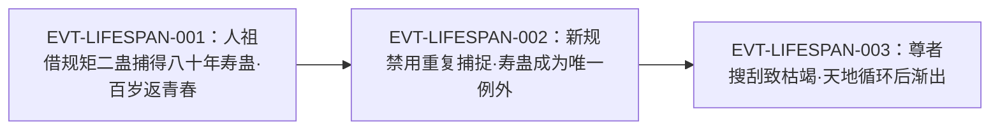

# 寿蛊

全书**泛称类**蛊虫的代表：它**增添阳寿**，是原文认定的**唯一"根本上、毫无后遗症"**的延寿手段，其余延寿法门（转化僵尸、树人、阴阳延寿法、夺舍、久眠）一律被判为"旁门左道"。同时它又极特殊——**原文多次明写它"只是凡蛊"，却是蛊仙交易中最强劲的硬通货**，甚至出现"二十只寿蛊换仙蛊"级别的记录。

本页为 2026-09-28 A 线恢复批**新建页**。本页与同批其余三页的最大差别在于**证据体量与实体性质**：全书命中 285 行，且它是**泛称＋分档**的实体（`roster-3.md` 的「原文有据·转数未言」节 `heaven_atk_5_07_gu` 条目，2026-09-28 由「命名碰撞待核」移入，原文转＝—）。因此本页前两个主题专门处理**泛称口径**与**分档失真**，并登记本批发现的**原文重复文本块**。所有引文回根原文 `source/蛊真人-clean.txt`，行号即 `E:V{段}-{6位行号}`；正文按“原著事实 → 合理推导 →《问真》设计意义”三层组织。

## 主题档案

### 一、核心机制：增添阳寿，且"并不意味不死"

#### 原著事实

- 功用的最初交代（《人祖传》）：希望蛊对人祖说「只要你抓住寿蛊，你就能增添新的寿命」`E:V1-005854`。
- 一般机制：「但是若用了寿蛊，就能增长寿命」`E:V1-021020`；人类寿命基线为「这个世界上，人类若无灾无病，最多只能活到一百岁。一百年，是人类寿命的极限」`E:V1-021018`。
- **上限的明文否定**：「寿蛊代表着“长生”，能让人活得更久。但不意味“不死”」`E:V1-021028`。
- **正统性判定**：「唯有用寿蛊，才能在根本上，毫无后遗症地增加寿元」`E:V4-140260`；同一句把其余途径列为「除此之外，类似转化僵尸，树人，阴阳延寿法，夺舍法，或者整日沉眠减少消耗之举，都是旁门左道的延寿法门」`E:V4-140260`。
- 同判的另一处：「这世间唯有一种方法，增加寿命。就是方源前世那样，消耗寿蛊，从根本上增加自身的寿命，这才是正道」`E:V1-033200`；反向表述见 `E:V1-032180`（「除去用最正统的寿蛊增添寿命之外，一些歪门邪道，亦能让人长存于天地」）。
- **量的个案**：「方源前世活了五百多年，就是先后使用了五只百年寿蛊。共增加了五百年的阳寿」`E:V1-021026`；另：「这只寿蛊可以给你增寿六十年，让你回复人身之后，不至于成为垂垂老朽」`E:V4-173064`。
- **返老的外在效果**：「青年蛊仙戚灾年纪已经数百，七转修为，只是用了寿蛊。才显得如此年轻」`E:V5-190594`。
- 作为标杆的对照：「当然，还是有着缺陷，不如寿蛊完美无缺」`E:V5-330216`（讲偷生仙蛊盗取寿元之法）。

#### 合理推导

- **依据**：`E:V4-140260`、`E:V1-033200`（"唯一／正道"）＋`E:V1-021020`、`E:V1-021026`（增寿的量）；**结论**：寿蛊的效果应拆成**两段**——①把寿命上限往上推（可累计，`E:V1-021026` 的"五只共增五百年"支持可加性）；②使人显得年轻（`E:V5-190594`）。两者在原文中同时出现，但**从未被写成同一句话**；**不确定性**：原文没有说明"显得年轻"是上限被推高的副作用，还是独立效果。
- **依据**：`E:V1-021028`（"不意味不死"）＋`E:V1-021030`（木魅蛊仍会让人化物而死）；**结论**：寿蛊**只延长寿命这一项**，不影响其它致死路径（伤重、蛊的反噬、灾劫）；**不确定性**：原文未写"寿尽"与"横死"之间的边界判定细节。

#### 《问真》设计意义

- 这是一条**"只解一个约束"**的清晰设计：它不提供免伤、不免灾劫，只把"寿命"这一项往上推。采用它时，最贴原文的做法是把它做成**可累加的上限提升**，而不是回复或无敌。

### 二、泛称口径与分档失真（含"四千年寿蛊"的题名之辨）

#### 原著事实

- **分档名的原文实例**（正文内出现者）：八十年寿蛊 `E:V1-005926`、六十年寿蛊 `E:V4-173074`、百年寿蛊 `E:V1-021022`、三百年寿蛊 `E:V2-072384`、五百年寿蛊 `E:V2-072384`、千年寿蛊 `E:V1-021022`、十五年寿蛊 `E:V3-108698`。
- **档名与效果的对应**：「百年寿蛊，就是增长百年阳寿。千年寿蛊，就意味着能多活一千年」`E:V1-021022`；另一处按形体分述：「小的那枚，是三百年寿蛊，如青蛇盘成一圈，可增蛊师三百年阳寿，无有任何遗毒。」`E:V2-072384`；「大的那只，则如虬龙飞天，张牙舞爪，可涨五百年寿命，同样没有副作用」`E:V2-072384`。
- **无前缀的用法即泛称**：绝大多数命中不带年数（如「寿蛊珍稀无比，为世人所共求」`E:V1-021024`、`E:V1-005856`、`E:V4-142074`），说明"寿蛊"本身是**类名**。
- **"四千年寿蛊"只出现在章节标题**：该串仅命中 4 行（288976、289108、289268、289398），**全部是章节标题行**（形如「章节目录 第五百三十三节：四千年寿蛊！」`E:V5-288976`、`E:V5-289268`，两者均已定位到同一 canon 章标题 `EPUB:chapter_1571:heading`；另两行 289108、289398 是同一标题的带尾冒号重复行，按本页约定不作 E-ID 锚点，只留旧行号回查）；正文中对应的是**累计效果**而非单只档位——「自己手中的寿蛊若全部用在他自己的身上，就能够让他延寿到四千多岁」`E:V5-289070`。
- **本批发现的原文重复块**：同一段叙述在原文中出现两次（约 `E:V5-288976`–`E:V5-289110` 与 `E:V5-289268`–`E:V5-289400`）。本批以固定偏移复算（定义：固定偏移 k，配对 (i, i+k)，i 取 288976–289110 且 i+k ≤ 289400，逐字相等）：偏移 290 时 **133 行**逐字相同——133 为含空行计等，两条文本块按非空行逐行对齐为 **66/66 全同**；偏移 288 时 67 行、偏移 292 时 68 行。两处都含形如「章节目录 第五百三十三节：四千年寿蛊！」的目录标记行 `E:V5-288976`、`E:V5-289268`（另有带尾冒号的章节提示行，旧行号 289108、289398）——这类行不应用作 E-ID 锚点。例如「寿蛊只是凡蛊而已，但史书上有很多例子，记录着寿蛊交换仙蛊的笔笔交易」在两处各出现一次 `E:V5-289088`、`E:V5-289378`。

#### 合理推导

- **依据**：`E:V1-021022`、`E:V2-072384`、`E:V4-173074`、`E:V3-108698`；**结论**：寿蛊是**按年数分档的类名**，"每档＝对应年数的阳寿增量"是原文的稳定口径；**不确定性**：原文未写档位是**连续可分**（任意年数）还是**离散档位**——已见档位至少跨越 15／60／80／100／300／500／1000 年，跨度很大却不连续，故无法判定。
- **依据**：`E:V5-288976`、`E:V5-289268`（皆章节标题，同一 canon 章标题）＋`E:V5-289070`（正文为"延寿到四千多岁"）；**结论**：**"四千年寿蛊"不是一只寿蛊的档位**，而是"方源手上这批寿蛊累计可延寿到四千多岁"的题名概括。把它当成一个档位即为**蒸馏失真**；**不确定性**：无（题名与正文的对应关系是逐字可核的）。
- **依据**：`E:V5-289088`、`E:V5-289378` 的两处重复；**结论**：本页"命中 285 行"的计数**包含重复文本块**，去重后有效行低于 285；**不确定性**：重复块的成因（原书排版或电子文本叠页）不属于原著事实，本页只登记现象。

#### 《问真》设计意义

- 泛称实体的数据建模有两条路：①**建一个"寿蛊"类 + 年数参数**；②**为每个档位建独立条目**。原文支持前者（`E:V1-021022` 的句式是"N年寿蛊＝增N年阳寿"，同构可参数化），而"四千年寿蛊"的题名恰好是把它误做成独立条目的现成陷阱。

### 三、存在形式与获取难度：参须老树根状、静不可察、快过光

#### 原著事实

- **外观**：「这寿蛊一大一小，仿佛是参须，犹如老树根，摸在手中，一片粗糙沧桑」`E:V2-072382`；复现描述「这只三百年寿蛊，仿佛是参须，如蛇般盘成一圈，粗糙沧桑」`E:V2-074622`。
- **静止与飞行（《人祖传》）**：「寿蛊静止时，谁都察觉不了它。当它飞行时，比光还快」`E:V1-005856`——正因此，人祖自认无法捕捉 `E:V1-005856`。
- **捕捉的特例**：规矩二蛊「一方一圆，合力之下，能捕捉天下万蛊」`E:V1-008996`；实际捕获到的是「一只八十年的寿蛊」`E:V1-005926`。
- **来源**：「寿蛊的产生，就源于生命」`E:V5-198384`；「但凡是有生命的地方，都可能天然孕育出野生的寿蛊」`E:V5-198386`。
- **产出不定**：「寿蛊只是凡蛊，但产出条件不定，蛊仙搜索寿蛊，几乎完全是撞运气。因此很多情况下，寿蛊往往被凡人蛊师所得，蛊仙无法掌控」`E:V4-142076`。
- **只有天地能产**：「寿蛊难寻，位置不定，产量有限，且只有天地才能产生」`E:V3-110696`；「九转尊者搜刮天下，寿蛊渐渐用光，又寻不到新的寿蛊，只好想方设法来延寿」`E:V3-110698`。
- **传闻中的例外**：「甚至传闻中，他还能炼寿蛊」`E:V3-110490`（长毛老祖，属"传闻"而非已证事实）。
- **福地里的存量机制**：琅琊福地「空间广阔，人口无数，历史悠久」＋地灵的彻底掌控，使「一旦有什么寿蛊产生，便能立即知晓，迅速采摘」`E:V5-198388`。

#### 合理推导

- **依据**：`E:V1-005856`（静止不可察／飞行快过光）＋`E:V4-142076`（"几乎完全是撞运气"）＋`E:V5-198386`（有生命处皆可能孕育）；**结论**：寿蛊是**不可定向搜索**的资源，唯一稳定提高期望的方式是**占据大面积、长历史、人口多的产地并即时采摘**（`E:V5-198388` 的琅琊福地是现成范例）；**不确定性**：原文未给单位面积的产出率。
- **依据**：`E:V3-110490`（"传闻中"）；**结论**：**人工炼制寿蛊未被原文确认为事实**，只能写作传闻；**不确定性**：该传闻是否为真，原文未作裁决。

#### 《问真》设计意义

- "只有天地能产 + 有生命处皆可能 + 无法定向搜索"三者合起来，说明寿蛊在设定上**天然是一个地缘/领地型资源**，而不是掉落物。做经济时它更适合绑定"领地年限与人**口**"这类长期变量。

### 四、经济属性：只是凡蛊，却是最强劲的硬通货

#### 原著事实

- **品阶明文（多处）**：「寿蛊只是凡蛊」`E:V5-198348`；「寿蛊只是凡蛊，但产出条件不定」`E:V4-142076`；「寿蛊虽然只是凡蛊，但非常难得」`E:V5-242408`；「寿蛊只是凡蛊而已，但史书上有很多例子，记录着寿蛊交换仙蛊的笔笔交易」`E:V5-289088`。
- **硬通货地位**：「然而寿蛊是蛊仙交易中，最强劲的硬通货，几乎没有任何一个能与之媲美」`E:V5-198350`；「蛊仙之间的交易，仙元石只是基本货币，寿蛊的价值，要远远大于仙元石。」`E:V5-209394`；「没有蛊仙不需要寿蛊的！很多高端的交易，仙元石已经不顶用了，蛊仙之间只认可寿蛊」`E:V5-209394`。
- **凡蛊却贵过仙蛊**：「前一个是凡蛊，也就算了，因为是寿蛊，在很多蛊仙的眼中，价值比仙蛊还要大些」`E:V5-209460`。
- **实际换价记录**：方源「只有一只六转仙蛊，就换走了庙明神的七转仙蛊」，靠的是「直接用了一百年的寿蛊弥补了其中的差额」`E:V5-242404`、`E:V5-242406`；另一处开价「我愿意付给你三只七转仙蛊」换一只寿蛊，被拒 `E:V5-288080`、`E:V5-288082`。
- **持有者的惜售**：「通常蛊仙得到手中，从不拿出交易。即便是不久前结束的北原拍卖大会，也没有一只寿蛊抛出来卖」`E:V4-142074`；同判「秦百胜举办的拍卖大会，几乎囊括了北原蛊仙界的英豪强者」`E:V4-140264`；「就算如此，也没有一只寿蛊流出拍卖」`E:V4-140264`；对照「反倒是凡人蛊师的交易中，偶尔会有寿蛊拍卖」`E:V4-140266`。
- **制度性封锁**：正道蛊仙私下联合「禁止对东方长凡出售寿蛊」`E:V3-095490`、`E:V4-122778`。
- **升值预期**：「只是现在五域乱战就要来临，大时代要开幕，这种时代，寿蛊会越来越少」`E:V5-289082`；「尤其是当大梦仙尊成就了九转，寿蛊将极其稀少，天地不在出产，直至寿蛊存量全无」`E:V5-289082`；方源据此判断「自己手上的这批寿蛊，价值极大，并且还会随着时代的前行，而不断升值」`E:V5-289084`。

#### 合理推导

- **依据**：`E:V5-198348`、`E:V5-242408`（凡蛊）＋`E:V5-198350`、`E:V5-209394`（最强劲硬通货）；**结论**：寿蛊是原文构造的一处**刻意的品阶与价值背离**——"凡蛊"是**品阶**（可被凡人蛊师持有、可在凡人交易中拍卖 `E:V4-140266`），"硬通货"是**稀缺性溢价**；**不确定性**：原文未给任何具体价格（几枚仙元石／多少元石）。
- **依据**：`E:V5-288080`、`E:V5-288082`（三只七转仙蛊仍被拒）；**注意口径**：`E:V5-288080` 位于梦境叙事段落之内（`E:V5-287980` 明确"梦境之中的第二世，方源成为了一位少爷"），故它是**叙事内的表态**，本页把它与梦境外的三条证据并列引用，不单独作为事实依据；**结论**：这条拒绝对话与 `E:V4-142074`、`E:V5-209394` 的口径一致（"没命要仙蛊何用"），可相互印证；**不确定性**：梦境叙事是否完全代表原著世界观，原文未说明。
- **代价三要素（交易场景）**：**支付方**＝求购方（付出仙蛊／仙元石等）；**受益方**＝出售方（获得等价物）**但通常拒绝成交**，因为「我的寿命也不多了，就算是你出再多的仙蛊，我没有命，又有什么用呢？」`E:V5-288082`；**支付时点／生效条件**＝持有者寿元尚足时才可能出**售**，因此稀缺性随时代加剧（`E:V5-289082`）。

#### 《问真》设计意义

- "凡蛊品阶 + 顶级价值"这个组合非常难得：它让寿蛊既能出现在凡人层级的交易里（`E:V4-140266`），又是终局经济的主角。做经济系统时，**不需要给它高品阶**，只需把稀缺性与需求拉满——原文已经示范了这条路线。

### 五、作为材料与食料：木魅晋升、智慧蛊的口粮、仙蛊的仙材

#### 原著事实

- **木魅蛊的晋升材料**：木魅蛊「需要和百年寿蛊合炼，晋升为四转百年木魅。再和千年寿蛊合炼，成为五转千年木魅」`E:V1-021016`；如此冷门的原因即「皆因寿蛊更加珍贵，寻到了寿蛊，通常蛊师都是直接用了，增长自身的寿命」`E:V1-021016`。
- **智慧蛊的食料**：「智慧蛊的食料是寿蛊」`E:V5-200062`；「驱使智慧蛊，需要耗费蛊仙本身的寿命。而豢养智慧蛊，则要消耗寿蛊」`E:V5-198394`。
- **仙蛊的仙材**：「第二空窍仙蛊，是动用了许多珍稀仙材炼制而成的。其中就包含寿蛊！」`E:V4-153192`；同段「寿蛊极其难寻，就算寻到了寿蛊，按照方源如今的情势，恐怕也是直接用了，增长自身的寿元」`E:V4-153196`。
- **被消耗的量级**：琅琊地灵「一直担负着喂养它的责任，消耗了大量的寿蛊」`E:V5-287386`；其图谋即「利用寿蛊不断喂养智慧蛊，企图控制智慧蛊」`E:V5-289006`。
- **搜刮规模**：巨阳仙尊布置八十八角真阳楼，「其中最重要的每一个目的，就是在整个北原搜刮寿蛊，助他延寿」`E:V5-198356`；地灵本身「对寿蛊的需求为零」`E:V5-289348`，因此手上"有一笔寿蛊的积累，数量还相当可观"`E:V5-198374`。

#### 合理推导

- **依据**：`E:V1-021016`（木魅晋升）＋`E:V5-200062`、`E:V5-198394`（智慧蛊食料）＋`E:V4-153192`（仙材）；**结论**：寿蛊在原文中同时充当**晋升材料／日常食料／仙蛊仙材**三种消耗位，而这**恰好与它"量身续命"的用途直接冲突**——这正是本实体最大的结构性张力；**不确定性**：三种消耗各自的数量（一次晋升要几只、喂养一只智慧蛊多久耗一只）原文均未给。
- **依据**：`E:V1-021016`（"通常蛊师都是直接用了"）＋`E:V5-198394`（豢养要消耗寿蛊）；**结论**：在原著的经济里，**"用在自己身上"是默认选择**，所有把寿蛊投入生产的方案都要额外交代其机会成本；**不确定性**：无。

#### 《问真》设计意义

- 这是天然的**"同一个稀缺资源被四个系统争抢"**设计：延寿（玩家刚需）、晋阶（木魅线）、召唤/维持（智慧蛊）、炼蛊仙材。不需要发明冲突，冲突由原文给定；玩家每用一只都要在四种用途间取舍。

### 六、天意／天道对寿蛊的控制："灾劫、寿蛊，就是天意的两大杀手锏"

#### 原著事实

- **两大杀手锏**：「所以，历代尊者，任何传奇，都是天意的打压对象。灾劫、寿蛊，就是天意的两大杀手锏」`E:V5-198626`。
- **天道掌控**：「天道掌控灾劫，控制寿蛊，尊者强势一个大时代，但和天道相比，也只是一根灼灼燃烧的火炬而已」`E:V6-405586`。
- **与时代的枯荣同步**：幽魂魔尊陨落后「盛极而衰，天地间又重新开始陆续出现寿蛊」`E:V5-198360`；乐土仙尊「也在晚年搜寻寿蛊，寿蛊数量入不敷出。又渐渐稀少，最终绝迹」`E:V5-198362`；其后「乐土死后，天地循环，休养生息，寿蛊渐出」`E:V5-198364`。
- **枯竭的终局**：`E:V5-289082`（大时代寿蛊越来越少、大梦仙尊成九转后"天地不在出产，直至寿蛊存量全无"）。
- **被攀比的最长寿者**：方源手中的寿蛊「若全部用在他自己的身上，就能够让他延寿到四千多岁」`E:V5-289070`，并可"活得比红莲魔尊更久"`E:V5-289074`。

#### 合理推导

- **依据**：`E:V5-198626`、`E:V6-405586`；**结论**：寿蛊在设定上不是普通道具，而是**天意制约强者的工具**——它的产出节奏与"时代"绑定；**不确定性**：原文未给可计算的产出规则（何时枯、何时丰），只给了文学化的描述。
- **依据**：`E:V5-198360`、`E:V5-198362`、`E:V5-198364`、`E:V5-289082`；**结论**：寿蛊存量随**大时代**波动（尊者大量消耗→枯竭；乱世前后→渐出）；**不确定性**：周期长度与振幅原文未定义。

#### 《问真》设计意义

- 这给出了一条**随时间衰减／回升的资源曲线**：寿蛊不该是一成不变的通货，而应随"时代阶段"改变产量与存量。做成长期经济时，这条曲线比固定掉落率更能解释"为什么后期寿蛊越来越贵"。

## 状态时间线

| 状态 ID | 阶段 | 状态 | 证据 |
|---|---|---|---|
| ST-LIFESPAN-01 | 机制确认 | 增添阳寿；原文明确它"不意味不死"，且是人类延寿诸法中唯一"根本上、毫无后遗症"的正道 | E:V1-021020、E:V1-021028、E:V4-140260 |
| ST-LIFESPAN-02 | 分档口径 | 泛称类实体，按年数分档（十五／六十／八十／一百／三百／五百／一千年），每档＝对应年数的阳寿增量 | E:V1-005926、E:V1-021022、E:V2-072384、E:V3-108698、E:V4-173074 |
| ST-LIFESPAN-03 | 题名之辨 | "四千年寿蛊"仅见于章节标题，正文对应的是"累计延寿到四千多岁"，非单只档位 | E:V5-288976、E:V5-289268、E:V5-289070 |
| ST-LIFESPAN-04 | 存在形式与产出 | 形如参须老树根；静止时不可察、飞行快过光；源于生命、有生命处皆可能孕育，但产出条件不定 | E:V2-072382、E:V1-005856、E:V5-198384、E:V4-142076 |
| ST-LIFESPAN-05 | 经济属性 | 只是凡蛊，却是蛊仙交易中最强劲的硬通货；拍卖会上几乎不流出，凡人交易中偶有拍卖 | E:V5-198348、E:V5-198350、E:V4-142074、E:V4-140266 |
| ST-LIFESPAN-06 | 材料与食料 | 与木魅蛊合炼晋四／五转；为智慧蛊的唯一食料；为第二空窍仙蛊的仙材 | E:V1-021016、E:V5-200062、E:V5-198394、E:V4-153192 |
| ST-LIFESPAN-07 | 天道控制 | 灾劫与寿蛊并列为"天意的两大杀手锏"；天地出产随大时代枯荣，终局可至存量全无 | E:V5-198626、E:V6-405586、E:V5-289082 |
| ST-LIFESPAN-08 | 转数未明 | 全书 285 行命中（含重复文本块）均未给转数；品阶口径原文只用"凡蛊"一词；roster-3／game 的 rank=5 属游戏侧数值、非原著事实（已落地 L0 裁定 2026-09-28） | E:V5-198348、E:V4-142076、E:V5-242408 |

## 原著明确内容（本批取证窗口登记）

本批对「寿蛊」在根原文全书扫描：**命中 285 行**；按行距切分为 109 个窗口簇（最大连续簇 8 行）。注意：**该计数包含一处重复出现的文本块**（288976–289110 与 289268–289400，固定偏移 290 时 133 行逐字相同，详见主题二），去重后有效行低于 285。下表登记本批实际读取的代表窗口。

| 窗口 | 内容要点 | 用途 |
|---|---|---|
| 5840–5930 | 《人祖传》：希望蛊告知寿蛊能增添寿命；静止不可察、飞行快过光；规矩二蛊捕来八十年寿蛊；人祖百岁食后返青春 | 主题一、二、三 |
| 8988–9020 | 规矩二蛊"能捕捉天下万蛊"；人祖用寿蛊回到二十岁；新规矩＝不再捕捉重复蛊虫，故第二次命令"除了寿蛊之外" | 主题一、三（事件链） |
| 21010–21034 | 木魅蛊与百年／千年寿蛊的晋升；人类寿命极限一百岁；百年寿蛊＝增百年阳寿；方源前世用五只百年寿蛊共增五百年；"不意味不死" | 主题一、二、五 |
| 32170–32200、33185–33205 | 寿蛊是"最正统"的延寿法；其余（游僵蛊、存息玉葬蛊）皆旁门左道；"这世间唯有一种方法，增加寿命" | 主题一 |
| 36735–36750 | 仙鹤门中倒是有几只寿蛊，却牢牢掌管在掌门与太上长老手中 | 主题四（旁证） |
| 72370–72460、74610–74740 | 三百年／五百年寿蛊的形貌（参须／老树根）与效果（增三百年／五百年阳寿，无遗毒）；作为炼蛊材料被投入 | 主题二、三、五 |
| 95488–95492、122774–122782 | 蛊仙私下联合禁止对东方长凡出售寿蛊 | 主题四 |
| 108214–108222、108690–108712、109350–109358、114036–114048 | 百年寿蛊被当作求援筹码；真阳楼第五十五层奖励十五年寿蛊；太白云生为寿蛊牺牲同伴；方源把十五年寿蛊给太白云生用 | 主题二、四 |
| 110490、110692–110700 | 传闻长毛老祖能炼寿蛊；"只有天地才能产生"；九转尊者搜刮天下致寿蛊用光 | 主题三、四 |
| 140260–140268、142060–142080 | 唯一"无后遗症"的延寿法；北原拍卖大会无一只寿蛊流出；凡人交易中偶有拍卖；产出条件不定、常被凡人蛊师所得 | 主题一、三、四 |
| 173060–173080 | 焚天魔女赠予"六十年寿蛊"；"这只寿蛊可以给你增寿六十年" | 主题一、二 |
| 190588–190596 | 戚灾数百岁却显得年轻，原因是用了寿蛊 | 主题一 |
| 198325–198400 | 智慧蛊以寿蛊为食；琅琊地灵以寿蛊喂养图谋控制；巨阳仙尊搜刮北原；乐土仙尊耗尽、天地循环后寿蛊渐出；"寿蛊只是凡蛊"＋"最强劲的硬通货" | 主题二、三、四、五、六 |
| 209360–209460 | 黑凡洞天的寿蛊积累；"只认可寿蛊"；"寿蛊是绝对的硬通货"；凡蛊却贵过仙蛊 | 主题四 |
| 242400–242424 | 方源以一百年寿蛊补差额换走七转仙蛊；蛊仙惜售、"非到万不得已绝不拿出来交易" | 主题四 |
| 288976–289400 | （**含重复块**：288976–289110 与 289268–289400 同文重复）四千年寿蛊题名与"延寿到四千多岁"；寿蛊只是凡蛊但史书多有换仙蛊之例；大时代寿蛊越来越少 | 主题二、四、六 |
| 330210–330220、405582–405590 | 偷生仙蛊盗取寿元"不如寿蛊完美无缺"；天道掌控灾劫、控制寿蛊 | 主题一、六 |

## 事件链

| 事件 ID | 事件 | 参与者 | 证据 | 因果 |
|---|---|---|---|---|
| EVT-LIFESPAN-001 | 人祖依希望蛊指引找到山洞、说出规矩二蛊的名字，令其捕来一只八十年寿蛊；百岁之身食后返青春 | 人祖、希望蛊、规蛊、矩蛊 | E:V1-005854、E:V1-005858、E:V1-005924、E:V1-005926、E:V1-005928 | evidences ST-LIFESPAN-01 |
| EVT-LIFESPAN-002 | 规矩二蛊立新规"不会再为你捕捉重复的蛊虫"，故人祖第二次命令只能"除了寿蛊之外"尽捕天下万蛊 | 人祖、规蛊、矩蛊 | E:V1-009002、E:V1-009004、E:V1-009008、E:V1-009014 | evidences ST-LIFESPAN-03（寿蛊不可重复获得的制度根源） |
| EVT-LIFESPAN-003 | 历代尊者（巨阳仙尊、乐土仙尊）搜刮寿蛊延寿致其枯竭，天地循环休养生息后寿蛊渐出 | 巨阳仙尊、乐土仙尊、琅琊地灵 | E:V5-198356、E:V5-198360、E:V5-198362、E:V5-198364 | evidences ST-LIFESPAN-07 |

事件口径：本页沿用实体簇号 `EVT-LIFESPAN-*`。事件节点 3 个，已达"≥3 节点配 mermaid"的阈值，故上图按因果链绘制。注意 EVT-LIFESPAN-001/002 出自《人祖传》，属**传说层**，与 EVT-LIFESPAN-003 的**正史／世界史层**不同层（详见[人祖传](../themes/ren-zu-zhuan.md)）。

## 资料整理

本页为**新建页**，没有旧版；本批来源只有根原文，没有 `notes:`／`memory:` 层转述进入本页事实区。相关派生记录的处置登记如下（本段内容不得当作原著事实）：

- `roster-3.md` 的「原文有据·转数未言」节 `heaven_atk_5_07_gu` 条目（2026-09-28 由「命名碰撞待核」移入，原文转＝—）登记：`heaven_atk_5_07_gu | 寿蛊 | 5 | 「寿蛊」泛称（百年寿蛊/千年寿蛊分档）`，原状态为**命名碰撞待核**。本页复核：**"泛称"这一判断正确**（主题二），但**"5"这个转数在原文中找不到依据**（主题八：原文只用"凡蛊"一词，从未给转数），因此该 rank 属**游戏侧数值**，不是原著事实。**2026-09-28 已落地为 L0 裁定**：原文无转数依据，品阶只用「凡蛊」一词（`E:V5-198348`）；`roster-3`／`game` 的 rank=5 属**游戏侧数值、非原著事实**。
- `game/data/gu_lore.json` 的 `heaven_atk_5_07_gu` 为 `game_rank=5`、`status=collision`、`anchor=E:V1-021016`、`note=「寿蛊」泛称（百年寿蛊/千年寿蛊分档）`——与本页"泛称"结论一致；`game/**` 只读，不在本批改动范围。
- **id 归类张力（派生层）**：id 为 `heaven_atk_5_07_gu`（天道·攻击），而原文中寿蛊**不是攻击手段**（主题一：它只增添阳寿），其与"天道"的关联是"天道控制寿蛊"（`E:V6-405586`），属于**被控制方**而非天道系攻击蛊。本轮不改 id，仅登记。
- **既有页交叉**：[木魅蛊](wood-atk-3-01-gu.md) 主题五与 [智慧蛊](wisdom-gu.md) 的食料口径都指向本页同一处原文（`E:V1-021016`、`E:V5-200062`），本页不复制其结论，只作互链。
- **原文文本块重复（本批新发现）**：288976–289110 与 289268–289400 两段同文重复（固定偏移 290 时 133 行逐字相同，含目录标记行），导致本页与相关页面的"命中行数"统计偏高。本页已在《原著明确内容》表与主题二登记；**去重后的准确计数需主持人统一处理**，本页不自改。

## 分析与解读

1. **本实体最重要的一条是"上限否定"**：`E:V1-021028` 明说寿蛊「不意味“不死”」。这句话把寿蛊从"万能保命符"上摘下来，是后续所有系统设计的前提。
2. **"凡蛊"与"最强劲硬通货"并存是有意的反差**：四处独立的"只是凡蛊"（`E:V5-198348`、`E:V4-142076`、`E:V5-242408`、`E:V5-289088`）加上一处"价值比仙蛊还要大些"`E:V5-209460`，说明品阶与价值在原著中是**两条独立的轴**。把寿蛊按品阶定价会直接丢掉这个设定。
3. **分档口径必须写成参数而非枚举**：已见档位跨度 15–1000 年且不连续，句式却是稳定的"N年寿蛊＝增N年阳寿"`E:V1-021022`。而"四千年寿蛊"这个题名（`E:V5-288976`）是**最容易踩的坑**——它是累计效果的概括（`E:V5-289070`），不是档位。
4. **寿蛊与木魅蛊共享同一处原文**：`E:V1-021016` 同时定义了木魅蛊的两级晋升与寿蛊的机会成本。两页（[木魅蛊](wood-atk-3-01-gu.md)／本页）必须互链，否则任一侧都看不到全貌。
5. **它的稀缺性是被"用法"制造出来的**：延寿刚需（`E:V5-198346`、`E:V5-209392`）＋四种消耗位（主题五）＋天道控制的产出节奏（主题六），三者叠加，使它在原著后期"越来越贵"（`E:V5-289084`）成为逻辑必然，而不是作者随意加价。
6. **本批同时对原文自身的质量问题留了痕**：重复文本块（288976／289268）会让任何"命中 N 行"的结论虚高，凡引用本实体的页面都应知其存在。

## 待核对

- **已落地 2026-09-28**：本页转数／品阶裁定已落地——原文**无转数依据**，品阶只用「凡蛊」一词（`E:V5-198348`）；`roster-3`／`game` 的 rank=5 属**游戏侧数值、非原著事实**；「四千年寿蛊」是章节题名（`E:V5-288976`）、正文为累计延寿（`E:V5-289070`），非独立档位。
- `[原著未明确]` **转数／品阶**：全书命中（含重复块）均无转数明文；原文只用"凡蛊"一词描述其品阶 `E:V5-198348`。**不得**把 `roster-3.md` 的 rank=5 当作原著事实。**已落地 2026-09-28**（本项 L0 裁定：原文无转数依据，品阶只用「凡蛊」一词 `E:V5-198348`；rank=5 属游戏侧数值、非原著事实）。
- `[原著未明确]` **档位是否连续**：已见档位为 15／60／80／100／300／500／1000 年，跨度大且不连续，原文未说明是离散档位还是任意年数皆可。
- `[原著未明确]` **返老与延寿的关系**：`E:V1-005928`（百岁食后返青春）、`E:V1-008998`（回到二十岁）、`E:V5-190594`（数百岁显得年轻）三处都是"显年轻"，而 `E:V1-021022` 讲的是"增长阳寿"。两者是否同一效果的两个侧面，原文未说明。
- `[原著未明确]` **外形与档位的关系**：`E:V2-072384` 显示同一批的两只寿蛊形貌不同（"如青蛇盘成一圈"／"如虬龙飞天"），但未说明形态是否由档位决定。
- `[原著未明确]` **消耗量**：以寿蛊为食料／仙材／晋升材料时各需几只、能用多久，原文全未量化。
- `[原著未明确]` **能否人工炼制**：`E:V3-110490` 明写是"传闻中"，原文未裁决真假。
- `[待取证]` **价格**：原文只给相对地位（`E:V5-209394`、`E:V5-209460`）与个案换价（`E:V5-242404`），未给绝对价格。
- `[存在冲突]` **原文内部：寿蛊产出的丰枯节奏**——`E:V5-198386`（"但凡是有生命的地方，都可能天然孕育出野生的寿蛊"）读起来像稳定产出；而 `E:V5-289082`（"天地不在出产，直至寿蛊存量全无"）与 `E:V3-110698`（"九转尊者搜刮天下，寿蛊渐渐用光"）说产出会枯竭。当前状态：**本页不裁定**；两者可读作"局部可孕育／全局随时代枯荣"，但原文没有把它们统一起来。
- `[存在冲突]` **桥接层：游戏 rank=5 vs 原文"凡蛊"**：`roster-3.md` 的「原文有据·转数未言」节 `heaven_atk_5_07_gu` 条目（2026-09-28 由「命名碰撞待核」移入，原文转＝—）与 `game/data/gu_lore.json` 记 `game_rank=5`，原文只有"凡蛊"。**2026-09-28 已落地为 L0 裁定**：该 rank 属**游戏侧数值、非原著事实**；本轮不改 `game/**`，原按"改编／张力"登记，现升级为已落地裁定。
- `[存在冲突]` **桥接层：id `heaven_atk_*` 与原文定位不符**：原文中寿蛊是被天道**控制**的资源（`E:V6-405586`），不是天道系攻击蛊。本轮不改 id，仅登记。
- `[待取证]` **原文重复文本块的成因与去重后计数**：288976–289110 与 289268–289400 同文重复（固定偏移 290 时 133 行逐字相同，含目录标记行），成因不明，去重后的准确命中数待主持人统一核定。
- 2026-09-28：本页原按 roster-3 行号引用，因 L0 落地使该文件行号位移，已改为按 id 引用（id 为稳定键，行号不再作为定位依据）。

## 模板扩展建议（只登记，不改核心模板）

1. **泛称类实体需要"分档口径"固定字段**。寿蛊这类实体若无"分档＋泛称"的声明位，读者会把某个具体档位（乃至章节题名）误当实体本体。建议在 frontmatter 或主题一增设"分档口径"与"命名性质（泛称／专名）"两项。
2. **需要"题名 ≠ 事实"的登记位**。"四千年寿蛊"只出现在章节标题，而现有骨架没有"标题与正文不一致"的位置，本页只能把它写进主题二。
3. **"命中行数"应携带去重说明**。原文存在逐行重复的文本块时，"命中 N 行"会虚高；建议取证窗口登记表允许附"含重复块，去重后 N′"。
4. **"同一资源多用途"需要互链位**。寿蛊同时是延寿品、晋升材料、食料、仙材，四类页面各自只看到一面；建议在簇内页统一登记"共用材料的其它用途页"。

## 关联页面

[木魅蛊](wood-atk-3-01-gu.md)、[智慧蛊](wisdom-gu.md)、[邀月蛊](light-atk-3-02-gu.md)、[月影蛊](moon-shadow-gu.md)、[月光蛊](moonlight-gu.md)、[春秋蝉](spring-autumn-cicada-gu.md)、[蛊的饲养与炼化](../world/gu-care-and-refinement.md)、[炼蛊与杀招链](../world/gu-refine-killer-chain.md)、[修行体系](../world/cultivation-system.md)、[资质与空窍](../world/aptitude-and-aperture.md)、[真元](../world/primeval-essence.md)、[蛊虫关系](gu-relations.md)、[蛊虫总表](roster.md)、[蛊虫总表二期](roster-2.md)、[蛊虫总表三期](roster-3.md)、[方源](../characters/fang-yuan.md)、[人祖传](../themes/ren-zu-zhuan.md)、[青茅山](../events/qing-mao-mountain.md)。
