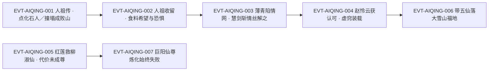

# 爱情蛊

灵缘斋的镇派仙蛊、全书**效果最不像蛊的一只蛊**：原文给它的定位是「通常的仙蛊，功效单一，耗用单一。但爱情蛊却大异常类，它可以迸发出各种各样的威能，而消耗的也不仅是仙元。」`E:V5-230238`。它的取得方式也与众不同——不是炼化，而是**"认可"**：六转修为的赵怜云能掌握九转的爱情蛊 `E:V5-304388`，而八转层次的巨阳仙尊炼化九转爱情蛊「始终都是失败」`E:V6-436490`。

本页为 2026-09-28 A 线恢复批**新建页**。全书穷举扫描「爱情蛊」：**51 次命中 / 48 行**（未去重）；另以变体「爱情仙蛊」复核。本页主题按该实体自身的机制切分：道属与身份、机制（不单一）、"认可"制、与[宿命蛊](fate-gu.md)的因果、《人祖传》叙事、食料、使用个案、身份边界。**身份边界为本页必写专节**——因本实体与杀招「慧剑斩情丝」`E:V5-200006` 的联动、以及与"情蛊"的登记歧义，都只能在这一节里说清。

**本页最短的一句提醒**："爱情蛊"与"情蛊"**不是**一回事，见《身份边界》。

## 主题档案

### 一、身份与道属：灵缘斋镇派仙蛊，九转仙蛊中"奇特无比"的一只

#### 原著事实

- **归属**：「青之所以陷入情网，乃是灵缘斋镇派仙蛊爱情所致。」`E:V4-186800`；「爱情蛊乃是灵缘斋所有」`E:V6-398524`。
- **转数（明文九转）**：「此蛊高达九转，威力难以匹敌」`E:V4-186800`；「即便只有六转修为，但却掌握着九转的爱情蛊。」`E:V5-304388`；「单凭你掌控的九转爱情蛊，就不会被忽视。」`E:V6-425648`。
- **道属语境（原文只把它挂在"情"这条衍生线里说）**：「随着智道的发展，一代代的蛊师们持续不断的探索」`E:V3-104890` 起讲智道衍生出"情"；「发情蛊、柔情蛊、诗情蛊等，都隶属此道。魅道就是从中衍生而出。」`E:V3-104892`；「当中最出名的，同样来自《人祖传》——爱情蛊。」`E:V3-104894`。
- **原文未给它一句"××道蛊虫"的定义式表述**：本批全部命中中，未见"爱情蛊是（某道）蛊"的直陈；它出现在"情"的叙事段落里（`E:V3-104890`–`E:V3-104894`），并被归为《人祖传》系谱中最出名的一只。
- **独特性（原文原话）**：「爱情仙蛊非常独特，即便是在所有的九转仙蛊当中，也是奇特无比的。」`E:V5-230238`。

#### 合理推导

- **依据**：`E:V3-104890`（情由"意"纠缠而成）＋`E:V3-104892`（发情蛊、柔情蛊、诗情蛊隶属此道、魅道从中衍生）＋`E:V3-104894`（爱情蛊为其中最出名者）；**结论**：爱情蛊在原文里的道属语境是**智道的衍生物"情"**（并进一步牵出魅道），不是独立的"爱情道"；**不确定性或可能反例**：原文没有出现"情道"这个名的明文归类句，也未把爱情蛊写成魅道蛊；若下游需要道属字段，只能记"原文未定义，语境为情／魅衍生线"，不得据 `E:V3-104892` 把它划进魅道（魅道是**从情衍生的另一支**，不是爱情蛊所属）。
- **依据**：`E:V4-186800`、`E:V5-304388`、`E:V6-425648`；**结论**：爱情蛊＝**九转**，三处互证；**不确定性或可能反例**：无（三处同为九转，无相反表述）。

#### 《问真》设计意义

- 一只"效果不像蛊"的九转仙蛊，天然适合做**体系外的例外件**：它不吃常规的"转数→固定效果"换算（`E:V5-230238`），因此落地时它更适合走"事件道具/剧情钥匙"路线，而不是普通蛊的数值模板。
- 原文把它放在**智道→情→魅**的衍生链上（`E:V3-104890`、`E:V3-104892`），给了一条"情感类蛊虫"的可扩展谱系：同链上已点名发情蛊、柔情蛊、诗情蛊 `E:V3-104892`。

### 二、机制：功效与耗用均不单一，可迸发各种威能，力量可抗衡命与运

#### 原著事实

- **机制总述**：「爱情仙蛊非常独特，即便是在所有的九转仙蛊当中，也是奇特无比的。通常的仙蛊，功效单一，耗用单一。但爱情蛊却大异常类，它可以迸发出各种各样的威能，而消耗的也不仅是仙元。」`E:V5-230238`。
- **可抗衡命与运**：「更关键的是，爱****的力量，是可以抗衡命和运的。」`E:V5-230238`（原文该处"爱"字后有掩码字符，本页按原貌登记、不代补）；同段口径：「爱情可以在某种程度上抗衡命运。」`E:V5-230242`。
- **实战表现（跨场景三例）**：使人陷入情网（「青之所以陷入情网，乃是灵缘斋镇派仙蛊爱情所致。」`E:V4-186800`）；作群体位移（「凭借着爱情蛊的力量，在赵怜云的执念之下，五位蛊仙直接落到了大雪山福地之中。」`E:V5-233110`）；作护身凭仗（「我有爱情蛊护身」`E:V5-322774`）。
- **被观察到的效果**：「这就是刚刚爱情蛊的作用吗？」`E:V5-233426`；「大家其实都清楚，我们来到这里，是因为爱情蛊的威能。」`E:V5-233806`。
- **伤情属性**（第三方的判语）：「偏偏他们身上的这层仙人手段，非同寻常，乃是传说中的爱情蛊所为。」`E:V6-398524`。

#### 合理推导

- **依据**：`E:V5-230238`（可迸发各种威能、消耗的不只是仙元）＋`E:V4-186800`（使人陷情）＋`E:V5-233110`（群体位移）＋`E:V6-398524`（留下第三者难治的伤）；**结论**：爱情蛊**没有单一功能条目**，原文是以"效果各异、可被观察但不可穷举"的方式写它的；因此本页不给它一份"技能清单"，只登记已写出的用例；**不确定性或可能反例**：原文未说明这些不同威能是同一机制的不同表现，还是"爱情"这一概念的多种具现——本页不合并解释。
- **依据**：`E:V5-230238`、`E:V5-230242`；**结论**：它被认为能**对抗命与运**，且这是它最"关键"的一点（原文用"更关键的是"标记）；**不确定性或可能反例**：`E:V5-230242` 的措辞是"在某种程度上"，即**有限度**的对抗，不等于免疫或绝对压制。

#### 《问真》设计意义

- "功效不单一 + 消耗不单一"是一条可以直接落地的**开放型道具**设定：它允许设计者为不同场景各写一条效果，而不必先立一套统一规则——这与它"奇特无比"的原文定位一致（`E:V5-230238`）。
- 把"抗衡命与运"限定为"在某种程度上"（`E:V5-230242`），等于给出了**反命运系统的强度上限**，适合用来做"关键节点可翻盘、常态不可依赖"的稀有资源。

### 三、"认可"制：取蛊靠认可而非炼化，六转修为可掌九转蛊而八转炼不动

#### 原著事实

- **取得方式是"认可"**：「赵怜云意外地得到了爱情蛊的认可，而后又得到天庭的承认，正式成为了灵缘斋的仙子。」`E:V5-230850`。
- **未被认可者的直接解释**：「为什么我就没有得到爱情蛊的认可呢？」`E:V5-230856`；回答是「那是因为你没有爱情啊。」`E:V5-230858`。
- **认可后的装载方式**：「赵怜云接纳虚窍，将爱情蛊装载其中」`E:V5-231556`。
- **被认可者的评价**：「难怪她能夺取仙子之位，绝非只是获得爱情蛊承认的幸运儿。」`E:V6-396986`。
- **反例（炼化路线）**：「巨阳仙尊尝试炼化九转爱情蛊，始终都是失败。」`E:V6-436490`；同段给出的一般性判语：「就算他清醒，以他八转层次的修为，也难以炼化一只九转野生仙蛊。」`E:V6-436486`。

#### 合理推导

- **依据**：`E:V5-230850`（认可）＋`E:V5-230858`（"没有爱情"故不获认可）＋`E:V5-304388`（六转修为掌握九转蛊）＋`E:V6-436490`（八转层次炼化九转爱情蛊始终失败）；**结论**：本实体存在**两条互不相同的取得路径**——"炼化"（失败）与"认可"（成功），且认可路径**不受持有者转数限制**（六转可掌九转）；**不确定性或可能反例**：原文未说明"认可"的判定主体是谁（蛊自身的意志？《人祖传》中的爱情蛊确有人格，见主题五）、也未写清"有爱情"是否是唯一条件——`E:V5-230858` 是一句口语化的当面对答，未必是穷举的规则句。
- **依据**：`E:V6-436486`、`E:V6-436490`；**结论**：巨阳仙尊所尝试炼化的"九转爱情蛊"与灵缘斋镇派的那一只**是否同一只，原文未写**（`E:V6-436490` 只以"九转爱情蛊"称之，前句语境是"九转野生仙蛊"）；**不确定性或可能反例**：若为同一只，则"灵缘斋所有"`E:V6-398524` 与"巨阳仙尊尝试炼化"之间存在**持有时序缺口**，本页**不补时序**，按缺口登记。

#### 《问真》设计意义

- "低修为 + 高转数宝物"靠**认可**而非**炼化**成立，是一条很好用的设计豁免：它让剧情不必先把角色战力拉满，就能把顶级道具交到新人手上（`E:V5-304388`、`E:V5-231556`）。
- 同时保留"炼化路线始终失败"（`E:V6-436490`）作为**硬性反例**，避免玩家把"认可"当成普遍可复制的捷径。

#### 代价与收益（支付方／受益方／支付时点）

- **支付方**：本实体在"认可"路径上**未见明文代价**——原文没有写赵怜云为获得认可付出了什么（`E:V5-230850` 只写"意外地得到"）；"装载"是操作，不是代价（`E:V5-231556`）。
- **受益方**：获得认可者本人（赵怜云由此成为灵缘斋仙子 `E:V5-230850`）。
- **支付时点／生效条件**：生效条件＝**获得爱情蛊的认可**（`E:V5-230850`）；**未写明**代价的支付时点。
- **另有代价的用例**：红莲一线确有明确代价，见主题四（支付方＝红莲，代价＝未能成尊）。

### 四、与宿命蛊：爱情是宿命的一部分，故爱情可以损坏宿命

#### 原著事实

- **《人祖传》记载**：「书中记载：爱情也是宿命的一部分。既然如此，爱情也便能改变宿命！」`E:V5-313144`。
- **红莲的实做**：「当他体悟到爱情蛊这个关键，他便利用爱情蛊成功地拯救了柳淑仙的性命！」`E:V5-366802`；「利用爱情蛊，他终于改变了过去的事实！那就是柳淑仙的死，现在的柳淑仙终于存活了下来。」`E:V5-366812`。
- **代价（两处并写）**：「当然，代价是红莲虽然渡劫成功，但却没有成为尊者。」`E:V5-366804`；「当然，后遗症是红莲没有成尊。这也是事实。」`E:V5-366814`。
- **损坏宿命的宣示**：「利用爱情蛊，可以损坏宿命。」`E:V5-366966`。
- **第三方的因果解释**：「爱情可以在某种程度上抗衡命运。若非如此，当年的红莲魔尊，又怎么能破坏得了宿命仙蛊呢？」`E:V5-230242`；「红莲并非天外之魔，如何能破坏得了宿命。正是因为爱情仙蛊栖息在他的身上，所以他才最终伤得了宿命仙蛊。」`E:V5-230246`。
- **跨代次的应用**：后世评价亦以爱情蛊论其分量——「她身怀盗天真传之一的神不知，掌握爱情蛊，呼风唤雨只是等闲」`E:V6-397054`。

#### 合理推导

- **依据**：`E:V5-313144`（爱情是宿命的一部分）＋`E:V5-366966`（可损坏宿命）＋`E:V5-230246`（红莲能伤宿命仙蛊正因爱情蛊栖息其身）；**结论**：原文给爱情蛊的**最高杠杆**不是战力，而是**对宿命体系的破坏权**——理由是同属一个系统（"一部分"），内部件才动得了系统本身；**不确定性或可能反例**：该推理是原文借角色之口给出的（`E:V5-313144` 是洪亭的推论，"书中记载"指向《人祖传》），属**角色认知**而非叙述者定论；`E:V5-230242` 又把它限定为"在某种程度上"。
- **依据**：`E:V5-366802`、`E:V5-366804`、`E:V5-366814`；**结论**：拯救柳淑仙与"红莲未成尊"是**两个并列被原文认定为事实**的结果（`E:V5-366816` 邻域写作"两个事实都改变了"），即代价与收益同源、同时成立；**不确定性或可能反例**：原文未说明"未成尊"是**机制的必然代价**还是**宿命的反噬/交换条件**，本页不判定。

#### 代价与收益（支付方／受益方／支付时点）

- **支付方**：**红莲**（支付的是"成尊"这一结果本身：`E:V5-366804`、`E:V5-366814`）。
- **受益方**：**柳淑仙**（复活存活：`E:V5-366812`）；红莲同时取得"改变过去事实"的收益 `E:V5-366812`。
- **支付时点／生效条件**：与结果**同时成立**（原文以"当然"并列两句，`E:V5-366804`、`E:V5-366814`），不是先救后罚的时序；生效条件＝利用爱情蛊改变过去的事实。

#### 《问真》设计意义

- "救人＝放弃成尊"是一次干净的**等价交换**设计：代价不是数值损失，而是**另一条成长路径的永久关闭**。这比扣血更能撑起叙事重量。
- 把"能损坏宿命"写成**系统内部件**（爱情属于宿命的一部分，`E:V5-313144`），给了反宿命系统一条自洽的解释，避免"天降外挂"感。

### 五、《人祖传》中的爱情蛊：点化石人、撞塌成败山、蛊格"蛮不讲理"

#### 原著事实

- **食料自述与人格**：「人啊，我在你这里闻到了希望和恐惧，我爱情的食物便是它们。」`E:V5-219012`（原文该句主语处有掩码字符）；「只有希望和恐惧同时滋养我，我才能存活下去。」`E:V5-219016`。
- **能唤来勇气蛊**：人祖不愿收留，爱情蛊遂道「你别忙赶我走，有我在，你就能唤来勇气蛊。」`E:V5-219018`；随后「人祖呼唤几声，一会儿，勇气蛊重新飞到了他的身边。」`E:V5-219020`。人祖的初始态度是「人祖对爱情蛊没有多少好感」`E:V5-219018`。
- **点化石人**：「爱情蛊被扰了美梦，十分愤怒，便想报复古月阴荒。它用它独特的力量，点化了一块石头。」`E:V3-080522`；「石头因为爱情有了生命，变成了石人。」`E:V3-080524`。
- **撞塌成败山**：「现在我就将整个成败山撞塌，你在亿万个石头中，好好去找寻那唯一的成功蛊吧。哈哈哈。」`E:V3-100436`（该行前段为爱情蛊当面对古月阴荒所说的话，本页不复述含引导引号的整句）；「被爱情蛊一撞，成败山轰然倒塌。」`E:V3-100442`。
- **蛊格（他者的评价）**：「爱情蛊向来都是这样的蛮不讲理，唉，就算是我，或者我的孩子智慧蛊，也不愿面对它。」`E:V3-100450`；「在狂热顽皮的爱情面前，思想和智慧都只能退避三舍。」`E:V3-100464`。
- **结伴与戏弄**：「随之一同的，还有爱情蛊、伪装蛊。」`E:V3-104388`；「它和伪装蛊是铁杆哥们，当即借助它的力量，伪装成思想蛊。」`E:V3-104400`；爱情蛊哄骗术法之语见 `E:V3-104406`；「这个世界上，哪有什么意义蛊？」`E:V3-104412`（被哄骗者的最终判断）；「爱情蛊的提议，得到了其他两蛊的认同。」`E:V3-104418`。
- **自我描述**：「别跟我讲道理，我就是蛮不讲理的。」`E:V3-104394`。
- **被提及的蛊际关系**：「它居然和恐惧蛊是好朋友，两只蛊在人祖的心中盘旋飞舞。」`E:V5-219024`。

#### 合理推导

- **依据**：`E:V5-219012`、`E:V5-219016`、`E:V3-104394`、`E:V3-100436`；**结论**：《人祖传》里的爱情蛊是**有意志、能开口、有情绪**的角色型存在，其行为逻辑是"顽皮/蛮不讲理"而非可预测的规则；**不确定性或可能反例**：这只"人格化的爱情蛊"与灵缘斋所藏的九转爱情蛊**是否同一实体，原文未在任何一处明确区分或等同**；本页按"同名、食料一致"处理（见下条推导），但把它登记为 `[原著未明确]`。
- **依据**：`E:V5-219016`（《人祖传》中爱情蛊需希望与恐惧才能存活）＋`E:V5-240996`（"爱意蛊的食物，和爱情蛊一样，都是希望和恐惧"）；**结论**：《人祖传》叙事与人物理世界的**食料口径一致**，支持二者为同一蛊；**不确定性或可能反例**：食料一致只能证"同类同源"，不能严格证"同一只"；`E:V5-240996` 的主语是爱意蛊，对爱情蛊只作比较项。
- **依据**：`E:V3-100450`、`E:V3-100464`；**结论**：原文借"思想蛊"之口给了爱情蛊一个**体系位阶**：思想与智慧（含智慧蛊）都"退避三舍"，即爱情蛊在叙事中的地位高于纯理性类仙蛊；**不确定性或可能反例**：这是《人祖传》寓言语境中的修辞性判断，不宜直接当作战力排序。

#### 《问真》设计意义

- "蛊有人格、会闹脾气、会哄骗人"是**叙事型道具**的范本：它的行为不必可预测，只要**动机一致**（`E:V3-104394` 的"蛮不讲理"）。
- 用"思想与智慧退避三舍"（`E:V3-100464`）来定调，成本极低而信息量大：一句寓言就确立了它在世界观里的位置。

### 六、食料与喂养：希望与恐惧

#### 原著事实

- **直接自述**：「人啊，我在你这里闻到了希望和恐惧，我爱情的食物便是它们。」`E:V5-219012`；「只有希望和恐惧同时滋养我，我才能存活下去。」`E:V5-219016`。
- **人物理世界的对照句**：「爱意蛊的食物，和爱情蛊一样，都是希望和恐惧，方源也好解决，从宝黄天中收购大量希望蛊、恐惧蛊即可。」`E:V5-240996`。
- **术语提示**：原文语境中"希望蛊、恐惧蛊"本身就是可交易的蛊（`E:V5-240996` 明写"收购"）。

#### 合理推导

- **依据**：`E:V5-240996`（收购希望蛊、恐惧蛊即可解决）；**结论**：喂养爱情蛊的**可操作路径**是交易获取希望蛊与恐惧蛊，而不是（如悔蛊那般）自建产地；**不确定性或可能反例**：`E:V5-240996` 说的是**爱意蛊**可如此解决，爱情蛊只作比较项，故"爱情蛊也可用收购解决"是**外推**，非明文。

#### 《问真》设计意义

- 食料为"希望/恐惧"这一对**情绪资源**，天然把喂养系统与剧情情绪绑定；同时也给了"用经济手段解决"的口子（`E:V5-240996`），便于做成可运营的日常消耗。

### 七、使用个案：赵怜云的装载、护身与救人

#### 原著事实

- **装载**：「赵怜云接纳虚窍，将爱情蛊装载其中，又历经特训苦练，刚刚步入蛊仙界的圈子。」`E:V5-231556`。
- **护身与群体位移**：「凭借着爱情蛊的力量，在赵怜云的执念之下，五位蛊仙直接落到了大雪山福地之中。」`E:V5-233110`；她对外的解释是「我们来到这里，是因为爱情蛊的威能」`E:V5-233806`。
- **战前态度**：「我有爱情蛊护身，而眼下正是敌方胆寒逃窜，我辈建功立业之时，此时不出击更待何时呢？」`E:V5-322774`。
- **被对比者**：「我这边已经脱离险境，灵威仰那边却是没有爱情蛊的。」`E:V5-232352`。
- **当代持有状态**：第三方判语「看来出手的恐怕是当代的灵缘斋仙子了」`E:V6-398524`；评价「她身怀盗天真传之一的神不知，掌握爱情蛊」`E:V6-397054`。

#### 合理推导

- **依据**：`E:V5-233110`、`E:V5-233806`、`E:V5-232352`；**结论**：赵怜云手里的爱情蛊在实战中被当作**保命与转移手段**使用（带人离场、脱险），与"使人陷情"`E:V4-186800` 属完全不同的用法面，支持主题二"无单一功能"的结论；**不确定性或可能反例**：`E:V5-233110` 的位移**是否由爱情蛊单因致成**，原文只写"凭借着爱情蛊的力量，在赵怜云的执念之下"（两个条件并列），本页不归因于单一因素。
- **依据**：`E:V5-304388`、`E:V5-231556`；**结论**：六转修为的持有者以"装载"方式掌握九转蛊，是"认可制"的落地形态；**不确定性或可能反例**："虚窍"的具体机制本批未取证，不展开。

#### 《问真》设计意义

- 同一个道具有"带人撤离"与"令敌陷情"两副面孔，说明它适合做**情境道具**：由使用者的执念/处境决定当下能出哪一张牌（`E:V5-233110` 的"执念"是关键限定词）。

### 八、身份边界（本页必写）

本节只处理**同名异物、近名同族、泛称与子串误切**，不处理本体机制。

#### 8.1 与杀招慧剑斩情丝／慧剑仙蛊的联动与边界

- **原著事实**：「所谓慧剑斩情丝，此蛊纵然不敌九转爱情蛊，但实际上，我们只需要斩去青身上的爱情道痕而已。」`E:V4-186806`；「当初剑仙薄青就是用此仙蛊，斩去了爱情蛊种在他身上的智道道痕，挣脱束缚，重获自由。」`E:V5-200008`；慧剑仙蛊的转数与道属：「这只仙蛊，和态度蛊一样，同样是八转仙蛊。隶属于剑道，也可算是智道。」`E:V5-200004`；对应的杀招名：「慧剑斩情丝！」`E:V5-200006`。
- **关系**：**克制关系、非同一实体**——爱情蛊（九转，`E:V4-186800`）对慧剑"纵然不敌"其力，但慧剑的作用点是**斩去它留下的道痕**（`E:V4-186806`、`E:V5-200008`），即"解耦"而不是"对轰取胜"。
- **【口径A】被斩的是"爱情道痕"**：`E:V4-186806` 的原文逐字。
- **【口径B】被斩的是"智道道痕"**：`E:V5-200008` 的原文逐字。
- **当前状态**：两口径并存、同一事件两种称谓，**本页不强行统一**，两行均逐字登记。可注意的旁证：慧剑仙蛊本身「隶属于剑道，也可算是智道」`E:V5-200004`，与"智道道痕"口径相容，但这不构成裁定。
- **身份边界结论**：「慧剑斩情丝」是**杀招名**（`E:V5-200006`），慧剑仙蛊是**另一只仙蛊**（八转，剑道/智道，`E:V5-200004`），二者都不是爱情蛊的别名，也不是爱情蛊的同一实体。

#### 8.2 与仇恨蛊：形似而非同名

- **原著事实**：「这不是爱情蛊吗？我曾经听父亲讲过它的样子。」`E:V6-376550`（该句为万金妙华对这只蛊虫所说的话）；该蛊自答「不，我是仇恨蛊。」并说明「虽然我在表面上，和爱情蛊很相像。」`E:V6-376552`。
- **关系**：**同形异体**。原文明确写出"表面相像"，即存在**被误认的风险**；二者在道具层面可构成"以假乱真"的玩法素材。
- **旁证（派生层）**：`roster-3.md` 另将 `human_atk_5_41_gu`「恨蛊」判为**疑似非实体**，理由是其全书 87 次命中全为「仇恨蛊」子串、登记锚 `E:V6-376116` 实为章节目录题名「八转仇恨蛊」。本页仅登记该派生结论与出处，不对"恨蛊"另作裁定。

#### 8.3 与爱意蛊：食料相同、实体不同

- **原著事实**：「爱意蛊的食物，和爱情蛊一样，都是希望和恐惧」`E:V5-240996`。
- **关系**：**近名同族**。原文把爱意蛊与爱情蛊**并列比较**（"和爱情蛊一样"），这一句式本身就预设二者是**两只蛊**；不得因食料相同而合并，也不得把"爱意蛊"写成爱情蛊的别名。

#### 8.4 与情道近族（发情蛊、柔情蛊、诗情蛊、亲情蛊）

- **原著事实**：「发情蛊、柔情蛊、诗情蛊等，都隶属此道。魅道就是从中衍生而出。」`E:V3-104892`；「当中最出名的，同样来自《人祖传》——爱情蛊。」`E:V3-104894`。
- **关系**：**同族不同实体**。原文用"等"字列举，把爱情蛊作为同一叙事段落中"最出名"的一只，属**族内并列**，不是别名关系。

#### 8.5 「情蛊」＝非实体（子串误切）——全部命中的分类账

`roster-3.md` 将 `human_atk_4_40_gu`「情蛊」登记为**【疑似非实体·待 L1 核】**。本页独立复核认同该结论，并给出**全部命中**的分类账（遍历全书每一处"情蛊"字面并逐条看上下文）：

| 类别（按前一字切分） | 命中次数 | 对应的独立实体 | 证据示例 |
|---|---|---|---|
| 爱＋情蛊 | 51 | 爱情蛊（本页实体） | E:V4-186806、E:V5-230238 等 |
| 发＋情蛊 | 6 | 发情蛊 | E:V3-104892 |
| 诗＋情蛊 | 6 | 诗情蛊 | E:V3-104892、E:V3-106818 |
| 亲＋情蛊 | 4 | 亲情蛊 | 同族列举句 |
| 柔＋情蛊 | 2 | 柔情蛊 | E:V3-104892 |
| 类别泛称（无独立实体） | 3 | 无 | E:V3-110734、E:V3-110736、E:V4-141572 |
| **独立命中（"情蛊"单独成名的实体）** | **0** | **无** | — |
| **合计** | **72** | — | — |

- **三处"类别泛称"逐条交代**：`E:V3-110734` 原文为「尤其在情蛊方面」（讲巨阳仙尊在"情"这一类上的发明）；`E:V3-110736` 原文为「这些情蛊」（复数类指）；`E:V4-141572` 原文为「向萧家借来了七转情蛊」（一只**借用的具体蛊**，但全书仅此一处、未给独立机制与归属，无法据以立为独立实体）。
- **登记锚复核**：`E:V3-106818` 的原文逐字为「诸如之前的四转诗情蛊、金龙蛊、金风送爽蛊」——即 `roster-3.md` 所说"实为『四转诗情蛊』"**成立**，该锚指向的是**诗情蛊**，不是"情蛊"。
- **本页结论**：「情蛊」**不是独立实体**，也**不是**爱情蛊的同实体别名。**不得**把"情蛊"写进本页 `aliases`；如需引用该类，请写"情"这一族（发情蛊、柔情蛊、诗情蛊、亲情蛊、爱情蛊）。

#### 8.6 《人祖传》的爱情蛊与灵缘斋的爱情蛊

- **原著事实**：`E:V5-219012`、`E:V5-219016`（《人祖传》语境）对 `E:V4-186800`、`E:V6-398524`（人物理世界）。
- **当前状态**：**[原著未明确]** 原文未在任何一处声明二者同一、也未声明二者不同；本页按"同名、同食料"作同一实体处理（推导见主题五），并在此登记该处理是**本页的口径**，不是原文的明文。

## 状态时间线

| 状态 ID | 阶段 | 状态 | 证据 |
|---|---|---|---|
| ST-AIQING-01 | 体系定位 | 灵缘斋镇派仙蛊，明文九转、威力难以匹敌；三处互证九转 | E:V4-186800、E:V5-304388、E:V6-425648 |
| ST-AIQING-02 | 机制 | 功效与耗用均不单一，可迸发各种威能，消耗的不仅是仙元；其力量可抗衡命和运 | E:V5-230238、E:V5-230242 |
| ST-AIQING-03 | 叙事源流 | 出自《人祖传》系谱，为"情"这一支中最出名者；同支尚有发情蛊、柔情蛊、诗情蛊等，魅道由此衍生 | E:V3-104890、E:V3-104892、E:V3-104894 |
| ST-AIQING-04 | 人祖传记事 | 点化石人为石人；撞塌成败山；与伪装蛊结伴戏弄；思想蛊与智慧蛊对之退避三舍 | E:V3-080522、E:V3-080524、E:V3-100436、E:V3-100442、E:V3-100450、E:V3-100464 |
| ST-AIQING-05 | 食料 | 食料为希望与恐惧，二者需同时滋养方可存活；人物理世界可用交易希望蛊、恐惧蛊解决 | E:V5-219012、E:V5-219016、E:V5-240996 |
| ST-AIQING-06 | 取得方式 | 赵怜云意外得到爱情蛊的认可后成为灵缘斋仙子；未获得者被解释为"没有爱情" | E:V5-230850、E:V5-230856、E:V5-230858 |
| ST-AIQING-07 | 与宿命蛊 | 以"爱情也是宿命的一部分"为据，红莲利用爱情蛊救活柳淑仙、改变过去的事实，代价是未能成尊 | E:V5-313144、E:V5-366802、E:V5-366812、E:V5-366804、E:V5-366814 |
| ST-AIQING-08 | 实战使用 | 赵怜云以虚窍装载爱情蛊，凭其力量带五位蛊仙落到大雪山福地、并作护身凭仗 | E:V5-231556、E:V5-233110、E:V5-233806、E:V5-322774 |
| ST-AIQING-09 | 反例 | 巨阳仙尊尝试炼化九转爱情蛊始终失败；八转层次难以炼化九转野生仙蛊 | E:V6-436486、E:V6-436490 |

## 原著明确内容（本批取证窗口登记）

本批对「爱情蛊」在根原文全书扫描：**51 次命中 / 48 行**（未去重）；变体「爱情仙蛊」另计。**题名行 0 处**（全书无含"爱情蛊"的章节目录行）。

| 窗口 | 内容要点 | 用途 |
|---|---|---|
| 80516–80526 | 爱情蛊被扰美梦、点化石头成石人 | 主题五 |
| 100426–100468 | 撞塌成败山；思想蛊"不愿面对它"；"思想和智慧都只能退避三舍" | 主题五 |
| 104384–104428 | 与伪装蛊结伴、伪装成思想蛊、哄骗寻"意义蛊" | 主题五 |
| 104890–104894 | 智道衍生"情"；发情蛊、柔情蛊、诗情蛊隶属此道、魅道从中衍生；爱情蛊为最出名者 | 主题一、八 |
| 110730–110740 | "尤其在情蛊方面""这些情蛊"（类别泛称） | 主题八（分类账） |
| 141570–141574 | "向萧家借来了七转情蛊"（借用个案） | 主题八（分类账） |
| 186800–186810 | 灵缘斋镇派仙蛊"爱情"致人陷情；九转、威力难以匹敌；慧剑斩情丝与"爱情道痕" | 主题一、四、八 |
| 200004–200012 | 慧剑仙蛊八转、剑道/智道；斩去"智道道痕" | 主题八（口径冲突） |
| 219010–219026 | 爱情蛊自述食料为希望与恐惧；能唤来勇气蛊；与恐惧蛊为友 | 主题五、六 |
| 230234–230248 | 爱情仙蛊"奇特无比"；功效与耗用均不单一；可抗衡命和运；红莲因它伤得宿命仙蛊 | 主题一、二、四 |
| 230846–230860 | 赵怜云得到认可成为灵缘斋仙子；凤金煌之问与"那是因为你没有爱情啊" | 主题三 |
| 231552–231562 | 赵怜云以虚窍装载爱情蛊 | 主题三、七 |
| 232348–232356 | 灵威仰没有爱情蛊（对照） | 主题七 |
| 233106–233114 | 凭爱情蛊力量带五位蛊仙落于大雪山福地 | 主题二、七 |
| 233422–233430 | "这就是刚刚爱情蛊的作用吗？" | 主题二 |
| 233802–233812 | "我们来到这里，是因为爱情蛊的威能" | 主题二、七 |
| 240992–241000 | 爱意蛊的食物与爱情蛊一样，都是希望和恐惧 | 主题六、八 |
| 299898–299930 | 《人祖传》中自己蛊咬过爱情蛊一口；人祖只有自己的力量和爱情 | 主题五（旁证） |
| 304384–304392 | 六转修为掌握九转的爱情蛊 | 主题一、三 |
| 313140–313148 | "爱情也是宿命的一部分……爱情也便能改变宿命" | 主题四 |
| 322770–322778 | "我有爱情蛊护身" | 主题七 |
| 366798–366828 | 用爱情蛊救活柳淑仙、改变过去事实；代价是未成尊 | 主题四 |
| 366962–366970 | "利用爱情蛊，可以损坏宿命" | 主题四 |
| 376546–376556 | 万金妙华误认仇恨蛊为爱情蛊；"我在表面上，和爱情蛊很相像" | 主题八 |
| 396982–396990 | "绝非只是获得爱情蛊承认的幸运儿" | 主题三 |
| 397050–397058 | "掌握爱情蛊，呼风唤雨只是等闲" | 主题四、七 |
| 398520–398528 | 爱情蛊乃灵缘斋所有；当代出手者当是灵缘斋仙子 | 主题一、七 |
| 425644–425652 | "单凭你掌控的九转爱情蛊，就不会被忽视" | 主题一 |
| 436486–436494 | 八转修为难以炼化九转野生仙蛊；巨阳仙尊炼化九转爱情蛊始终失败 | 主题三 |

## 事件链

| 事件 ID | 事件 | 参与者 | 证据 | 因果 |
|---|---|---|---|---|
| EVT-AIQING-001 | 《人祖传》时期：爱情蛊点化石头为石人，并因被扰美梦而撞塌成败山 | 爱情蛊、古月阴荒 | E:V3-080522、E:V3-080524、E:V3-100436、E:V3-100442 | evidences ST-AIQING-04 |
| EVT-AIQING-002 | 人祖收留爱情蛊，遂能唤来勇气蛊；爱情蛊自陈食料为希望与恐惧 | 爱情蛊、人祖、勇气蛊 | E:V5-219012、E:V5-219016、E:V5-219018、E:V5-219020 | evidences ST-AIQING-05 |
| EVT-AIQING-003 | 薄青被爱情蛊种下道痕而陷情网，灵缘斋以"慧剑斩情丝"路线解之 | 薄青、紫、灵缘斋 | E:V4-186800、E:V4-186806、E:V5-200004、E:V5-200008 | evidences ST-AIQING-09 邻域（主题八） |
| EVT-AIQING-004 | 赵怜云意外得到爱情蛊认可，成为灵缘斋仙子，并以虚窍装载此蛊 | 赵怜云、凤金煌、白晴仙子 | E:V5-230850、E:V5-230856、E:V5-230858、E:V5-231556 | evidences ST-AIQING-06、ST-AIQING-08 |
| EVT-AIQING-005 | 红莲（洪亭）以爱情蛊救活柳淑仙、改变过去的事实，代价是未能成尊 | 红莲、柳淑仙 | E:V5-313144、E:V5-366802、E:V5-366812、E:V5-366804、E:V5-366814 | evidences ST-AIQING-07 |
| EVT-AIQING-006 | 赵怜云凭爱情蛊之力带五位蛊仙落到大雪山福地 | 赵怜云、沐凌澜、五位蛊仙 | E:V5-233110、E:V5-233426、E:V5-233806 | evidences ST-AIQING-08 |
| EVT-AIQING-007 | 巨阳仙尊尝试炼化九转爱情蛊，始终失败 | 巨阳仙尊 | E:V6-436486、E:V6-436490 | evidences ST-AIQING-09 |

事件口径：本页沿用实体簇号 `EVT-AIQING-*`（与 `ST-AIQING-*` 同簇）。节点 7 个，已达阈值，故配 mermaid 主干；图中 EVT-AIQING-005（红莲救柳淑仙）与主线无因果前驱，故单独起头，只与"炼化失败"并列，**不臆造因果连线**。

## 资料整理

本页为**新建页**，没有旧版；本批来源只有根原文，没有 `notes:`／`memory:` 层转述进入本页事实区。相关派生记录的处置登记如下（**本段内容不得当作原著事实**）：

- `roster-3.md` 的"品阶上限压缩"节记：`| human_atk_5_02_gu | 爱情蛊 | 5 | 9 | E:V4-186806 |  |`。本页复核：锚点行 `E:V4-186806` 为正文行，其中逐字含「所谓慧剑斩情丝，此蛊纵然不敌九转爱情蛊，但实际上，我们只需要斩去青身上的爱情道痕而已。」（该行前有"紫颔首道："与引导引号，本页不复述含引导引号的整句），**"原文转 9"成立**（另有两处九转互证 `E:V5-304388`、`E:V6-425648`）。本页只登记，不改该页。
- `game/data/gu_lore.json` 的 `human_atk_5_02_gu` 现为 `game_rank=5`、`status=rank_cap`、`lore_rank=9`、`anchor=E:V4-186806`——投影与本页一致。`game/**` 只读，不在本批改动范围。
- `roster-3.md` 另记 `human_atk_4_40_gu | 情蛊 | 4 | 4 | E:V3-106818 | 【疑似非实体·待 L1 核】…`。本页独立复核**认同**，分类账见主题八（8.5）；**本批不由本页改 roster-3**。
- 本页**不声明桥接层 canon 来源**（`sources:` 只声明根原文）。
- **id 归类张力（派生层）**：本实体 id 为 `human_atk_5_02_gu`。原文明文只把它挂在**智道衍生的"情"**这条线上（`E:V3-104890`、`E:V3-104892`、`E:V3-104894`），本批未找到任何"爱情蛊属人道"或"爱情蛊属攻击类"的原文依据；同一 `human_atk_*` 桶内亦含非攻伐型条目。本页只登记"前缀语义在原文中无据"，不推断其确切含义，也不提出改名方案。
- 原文此处存在**掩码字符**：`E:V5-219012`、`E:V5-219016` 的主语处与 `E:V5-230238` 的"爱****的力量"处均有占位符。本页一律按原貌引用**不含掩码的片段**，并在正文注明该处存在掩码，**不代补、不猜词**。

## 分析与解读

以下为归纳，不是原文（须与上文"原著事实"区分）：

1. **本页最强的结构是"两条取得路径"**：炼化（`E:V6-436490` 始终失败）与认可（`E:V5-230850` 成功）。原文没有把两者写成同一机制的两档难度，而是写成**互不相通的两件事**——所以"六转修为掌握九转蛊"（`E:V5-304388`）不是矛盾，是另一条路径的结果。
2. **它的最高杠杆不是战斗，是"对宿命的编辑权"**（`E:V5-313144`、`E:V5-366966`）。原文特意补了一句理由："爱情也是宿命的一部分"——同系统内部件才能改动系统，这让红莲的行为在设定上自洽。
3. **代价的写法值得注意**：红莲救活柳淑仙的代价是"未成尊"（`E:V5-366804`、`E:V5-366814`），而原文在 `E:V5-366816` 邻域称"两个事实都改变了"——即原文把收益与代价**并列称为事实**，而不是"得"与"失"。这与"机制已确认、数值未知就拆两条"的纪律同构：两件事都成立，不合成一句。
4. **"情蛊"是一条典型的子串误切**：72 次命中里 0 次独立成名（分类账见 8.5）。这类结论必须给出全量分类账，否则"非实体"只是印象；本页给出前一字切分的六类分布与三处泛称的逐条交代。
5. **题名行口径**：本实体全书**题名命中 0 处**（与天机蛊、悔蛊不同）。因此本页的转数证据**只能**来自正文（`E:V4-186800`、`E:V5-304388`、`E:V6-425648`），不存在"以题名充转数"的风险。

## 待核对

- `[原著未明确]` **《人祖传》的爱情蛊与灵缘斋所藏九转爱情蛊是否同一实体**：**口径A（同一）**——同名、且食料口径一致（`E:V5-219016`《人祖传》需希望与恐惧存活；`E:V5-240996`"和爱情蛊一样，都是希望和恐惧"）；**口径B（未明确）**——原文从未声明二者同一或不同，`E:V5-240996` 的主语是爱意蛊，对爱情蛊只作比较项。**当前状态**：本页按口径A处理并在 8.6 登记，**不当作原文明文**。
- `[存在冲突]` **被"慧剑斩情丝"斩去的是"爱情道痕"还是"智道道痕"**：**口径A**＝`E:V4-186806`「斩去青身上的爱情道痕」；**口径B**＝`E:V5-200008`「斩去了爱情蛊种在他身上的智道道痕」。**当前状态**：两口径并存，均为逐字原文，本页不统一。旁证（不构成裁定）：慧剑仙蛊自身"隶属于剑道，也可算是智道"（`E:V5-200004`）。
- `[待取证]` **"认可"的判定主体与条件**：`E:V5-230850`、`E:V5-230858` 只写"得到认可"与"你没有爱情"，未写由谁判定、是否只需"有爱情"、是否可多人同时获认可。
- `[待取证]` **巨阳仙尊炼化失败的那只九转爱情蛊与灵缘斋的是否同一只**：`E:V6-436490` 只称"九转爱情蛊"，上句语境为"九转野生仙蛊"（`E:V6-436486`）；与「爱情蛊乃是灵缘斋所有」`E:V6-398524` 之间**是否存在持有转移，原文未写**。本页按缺口登记。
- `[原著未明确]` **数值类缺口（机制已确认、数值未知 → 拆条）**：机制 **[已确认]** ＝功效与耗用不单一、可迸发各种威能、可抗衡命和运（有限度）、需希望与恐惧供养（`E:V5-230238`、`E:V5-230242`、`E:V5-219016`）；具体数值 **[待取证]** ＝每次催动的仙元消耗量、"消耗的不只是仙元"所指的其他资源、带人位移的距离与人数上限、致人陷情的有效范围与抵抗门槛。
- `[原著未明确]` **爱情蛊经过"认可"后的持有者是否需要（或能够）炼化**：`E:V5-231556` 只写"装载"，未写炼化与否。
- `[待取证]` **爱情蛊的道属归类**：原文只在"情"的段落中把它列为最出名者（`E:V3-104894`），**无一句"爱情蛊是××道蛊"的直陈**。**不得**据 `E:V3-104892` 把它划入魅道（原文说魅道是**从情衍生**的另一支）。
- `[待取证]` **爱情蛊是否有"本命/野生态"之分**：`E:V6-436486` 出现的"九转野生仙蛊"是通用表述，是否适用于爱情蛊，本批未取证。

- **体积例外登记（本页自身）**：本页落盘 42489 字节（UTF-8 无 BOM、CRLF），已超 40 KB；按 GOVERNANCE 登记例外，**未为压体积删除任何有效知识**（如需分开装载，建议按主题节拆分，勿删证据行）。
## 模板扩展建议（只登记，不改核心模板）

1. **"多条取得路径"需要一个字段位**。本页的"炼化失败／认可成功"（`E:V6-436490`、`E:V5-230850`）是两条互不相通的路径，现有骨架只能靠主题三的内部小标题区分。建议模板增设"取得方式（路径／结果／证据）"结构性小节。
2. **"同名跨叙事层"需要一个显式标记**。《人祖传》语境与人物理语境使用同一名称（8.6），现有骨架无处置位。建议允许在主题一登记"叙事层指称"，供下游决定是否合并。
3. **"子串误切"的分类账建议模板化**。本页 8.5 的六类分布表可复用于同批的"恨蛊""命蛊""雷蛊"等同型条目，建议把该表做成模板片段，避免各页自拟口径。
4. **掩码字符的处置需要统一约定**。本批原文存在占位符（`E:V5-219012`、`E:V5-230238`）。建议明确"只引不含掩码的连续片段 + 另行注明该处有掩码"，禁止代补。

## 关联页面

[宿命蛊](fate-gu.md)、[智慧蛊](wisdom-gu.md)、[山盟蛊](human-def-1-32-gu.md)、[寿蛊](heaven-atk-5-07-gu.md)、[情道](../world/emotion-path.md)、[魅道](../world/charm-path.md)、[智道](../world/wisdom-path.md)、[毒道](../world/poison-path.md)、[人祖传](../themes/ren-zu-zhuan.md)、[宿命](../themes/fate.md)、[杀招实例名录](../world/kill-move-roster.md)、[炼蛊与杀招链](../world/gu-refine-killer-chain.md)、[蛊的饲养与炼化](../world/gu-care-and-refinement.md)、[真元](../world/primeval-essence.md)、[红莲](../characters/red-lotus.md)、[蛊虫关系](gu-relations.md)、[蛊虫总表](roster.md)、[蛊虫总表三期](roster-3.md)、[蛊虫总表二期](roster-2.md)。
