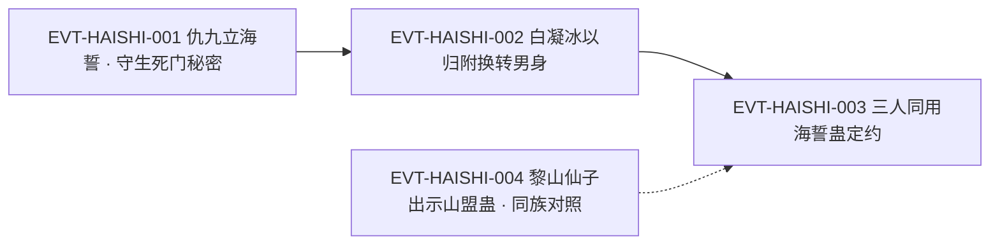

# 海誓蛊

信道盟誓类里"最出名的一对"之一：明代式的对偶命名——**海誓配山盟**。原文对它的定义句是「海誓蛊是一只六转的仙蛊，在上古时期十分出名，和山盟蛊并称。」`E:V2-071240`（**本页登记锚即此行**）。它的机制写得非常"工程化"：立誓者须面对一片大海，而只要把这片海摧毁，誓言就失效 `E:V2-071262`——**发誓这件事被绑定在一处地理实体上**。

本页为 2026-09-28 A 线恢复批**新建页**。全书穷举扫描「海誓蛊」：**10 次命中 / 10 行**（另有「海誓」（不含"蛊"字）2 行，见《资料整理》口径）。本页主题按该实体自身机制切分：道属、机制与生效条件、违约后果、与毒誓蛊的对照、身份边界、使用个案、代价分源。

**本页最要紧的一句提醒**：**并称不是别名**。「山盟蛊」是另一个实体（`human_def_1_32_gu`），本页与它共用一个登记锚（因为那句"并称"句同时是两者的登记依据），但两者**不是同一只蛊**，见《身份边界》。

## 主题档案

### 一、身份与道属：六转信道仙蛊、盟誓类，"上古时期十分出名"

#### 原著事实

- **本体转数与身份**：「海誓蛊是一只六转的仙蛊，在上古时期十分出名，和山盟蛊并称。」`E:V2-071240`。
- **信道归属（同族句）**：同一行 `E:V6-376870` 先界定诗心蛊的信道归属、再列举信道中的主要法门：「诗心蛊隶属信道，在整个信道的修行法门中，属于偏门。信道修行中最多的是盟誓，比如海誓蛊、山盟蛊、诺言蛊、白纸黑字蛊。」
- **同族的信道仙蛊（同段并列）**：「仙蛊诺言，亦是信道蛊虫，和山盟蛊、海誓蛊效用类似。」`E:V4-130064`。
- **"六转信道仙蛊"的另一处同义表述（用于山盟蛊，同段落明确描述）**：「此乃六转信道仙蛊，和海誓蛊齐名。只要选取一座高山发誓，只要这座高山健存，所发的誓言便不可违背。」`E:V4-122710`。
- **方源对它的认知起点**：「海誓蛊，方源听说过，也有所了解。」`E:V2-071242`。

#### 合理推导

- **依据**：`E:V6-376870`（信道修行中最多的是盟誓，海誓蛊列名）＋`E:V4-130064`（诺言亦为信道蛊虫，与海誓蛊效用类似）＋`E:V4-122710`（山盟蛊被称"六转信道仙蛊"）；**结论**：海誓蛊的定位是**六转、信道、盟誓支**；三处口径互相支持，无相反表述；**不确定性或可能反例**：`E:V4-122710` 的"六转信道仙蛊"原文是**在说山盟蛊**（未点名，只以"和海誓蛊齐名"指代），本页不把该句直接当海誓蛊的定义句，只作同族旁证。
- **依据**：`E:V2-071240`；**结论**：本体转数＝**六转**，单句明文，无第二口径；**不确定性或可能反例**：无（全书「海誓蛊」命中中未出现其他转数）。

#### 《问真》设计意义

- **"盟誓"是一条独立的功能支线**，且原文已给出四只同类蛊的完整名单（`E:V6-376870`）：海誓蛊、山盟蛊、诺言蛊、白纸黑字蛊。落地时可以按"约束强度／解除条件"做成一条谱系，而不是四只孤立的道具。

### 二、机制与生效条件：面对一片大海立誓，摧毁对应海洋则誓言失效

#### 原著事实

- **立誓动作（明文）**：「立誓时，人需要面对一片大海或者一座高山。只要将对应的海洋或者高山摧毁，那么誓言就会失效了。」`E:V2-071262`。
- **可解除性（同段）**：「你就算发下海誓，那也不是不可以解除。」`E:V2-071262`。
- **对偶的另一半（山盟蛊口径）**：「只要选取一座高山发誓，只要这座高山健存，所发的誓言便不可违背。」`E:V4-122710`。
- **功效与可重复运用**：「山盟、海誓两蛊的功效，类似毒誓蛊，但毒誓蛊只是消耗品，而这两个仙蛊，却是可以重复运用。」`E:V2-071240`。
- **一次实际立誓（个案）**：「并和砚石老人、仇九一起用仙蛊海誓蛊，定下约定」`E:V3-086370`；「白凝冰，只要你诚心诚意归附我影宗，再次发下新的海誓。我便出手，将你转为男身。」`E:V3-086336`。

#### 合理推导

- **依据**：`E:V2-071262`（立誓面对大海、摧毁海洋则失效）＋`E:V4-122710`（山盟蛊口径：高山健存则誓不可违）；**结论**：本实体的**约束载体是地理实体**——誓言的有效性系于某一片具体的海洋是否健存，因此它的**解除条件是空间性的**（摧毁那片海），而不是时间性或仪式性的；**不确定性或可能反例**：原文没有写"海"的尺度要求（须海洋？湖泊算不算？）、也没有写摧毁者必须是立誓者本人——`E:V2-071262` 只写"只要将对应的海洋或者高山摧毁"。
- **依据**：`E:V2-071240`（可重复运用）；**结论**：同一只海誓蛊可**被反复用于不同誓约**，这是它与消耗型盟誓道具的分水岭；**不确定性或可能反例**：原文未写"重复运用"是否有次数上限或冷却。

#### 代价与收益（支付方／受益方／支付时点）

- **支付方**：**立誓者本人**（承担"不可违背"的约束；白凝冰一线则由立誓者以归附为代价换取转男身 `E:V3-086336`）。
- **受益方**：**缔约的相对方**（影宗获得白凝冰的归附与誓约 `E:V3-086336`、`E:V3-086370`）。
- **支付时点／生效条件**：生效条件＝**面对大海立誓**（`E:V2-071262`）；约束存续条件＝**对应的海洋健存**；失效时点＝**该海洋被摧毁时**（`E:V2-071262`）。

#### 《问真》设计意义

- "把誓言锚在一处地理实体上"是一套极好用的**世界互动机制**：它让"发誓"从 UI 弹窗变成**地图上的一个坐标**，玩家可以围绕那片海做文章（守卫、破坏、迁移）。这比单纯倒计时更有戏剧性。
- "可重复运用"（`E:V2-071240`）意味着它适合做**阵营间的基础设施**，而不是一次性剧情道具——原文里山盟蛊的实际用法正是如此（见主题六）。

### 三、违约后果：一旦说出去，就会化为灰灰、彻底灭绝

#### 原著事实

- **后果（明文、由立誓者口述）**：「我当初在海誓蛊的面前，发过誓言，不能对外人吐露。一旦说出来，就会化为灰灰，彻底灭绝。」`E:V2-071236`。
- **未说出誓约内容的旁证（第三方观察）**：「仇九接连提出毒誓蛊、奴隶蛊的建议，已显慌乱，但始终不敢说出福地位置。看来真的是发下了海誓。」`E:V2-071314`。
- **解除通道（同一场景，由其自述给出）**：同段解释"若你也加入影宗，那就是自己人，我就可以说给你听了"`E:V2-071236`——即**改变身份可解除保密义务**，而没有去拆海。

#### 合理推导

- **依据**：`E:V2-071236`（说出去即化为灰灰、彻底灭绝）＋`E:V2-071314`（第三方据其行为反推"真的发下海誓"）；**结论**：违约后果是**即死级**且**可被外部观察推断**（因为立誓者的行为会明显受限，足以让旁人看出端倪）；**不确定性或可能反例**：原文没有写"化为灰灰"是蛊的直接作用、还是誓约本身的规则后果；也没有给出违约后被豁免（如复活）的个案。
- **依据**：`E:V2-071236`（"如果你也加入影宗，那就是自己人"）；**结论**：保密类誓约存在**不靠摧毁大海的合规出口**——把解除对象纳入同一阵营；**不确定性或可能反例**：原文只写了这一条替代出口，且是角色提出的理由，未必是蛊的机制。

#### 《问真》设计意义

- "即死级 + 行为可观察"的组合，把誓约变成了**可被识破的社会装置**：旁观者能通过"他不敢说"判断出誓约存在（`E:V2-071314`）。这给谍报/阵营玩法留了空间，比"系统弹窗警告"高明得多。

### 四、与毒誓蛊的对照：类似、但一为消耗品、一可重复运用

#### 原著事实

- **功效类似的明文**：「山盟、海誓两蛊的功效，类似毒誓蛊，但毒誓蛊只是消耗品，而这两个仙蛊，却是可以重复运用。」`E:V2-071240`。
- **替代关系的明文**：「毒誓蛊乃是山盟海誓蛊的替代品，陈九没有能力解掉毒誓。」`E:V2-074310`。
- **毒誓蛊自身的定性**：「毒誓蛊是一种紫红色的小虫，不过手指头大小，口器狰狞，属于三转消耗蛊。」`E:V2-048384`。
- **毒誓蛊的失败表现（对照用）**：「如果双方阅读的内容，不符合真实的心意，毒誓蛊自爆后，就会化为一滩脓血。」`E:V2-048412`；「毒誓蛊的约束力，很强。」`E:V2-048484`。
- **摆脱毒誓的一条实际路径（对照用）**：`E:V2-074310` 同段讲陈九"让毒誓发作杀死自己……没有了宿主，毒誓的力量自然便消失"，再借治疗手段复活。

#### 合理推导

- **依据**：`E:V2-071240`（类似、消耗品 vs 可重复）＋`E:V2-048384`（毒誓蛊为三转消耗蛊）＋`E:V2-074310`（替代品）；**结论**：三者构成一组**成本—耐久**的光谱——毒誓蛊＝三转、一次性、约束力强且"违反心意即自爆"；海誓／山盟蛊＝六转、可重复、但"摧毁对应山海"即可解除。**替代关系**的方向是：当没有／用不起仙蛊时，用毒誓蛊顶上；**不确定性或可能反例**：`E:V2-071240` 用"类似"而非"相同"，两者的违约后果并不一致（毒誓蛊的自爆是对**立誓时的真心**起作用 `E:V2-048412`，海誓蛊的后果是对**守约行为**起作用 `E:V2-071236`），本页不把二者等同。
- **依据**：`E:V2-074310`（毒誓依赖宿主，"没有了宿主……力量自然便消失"）；**结论**：毒誓蛊的解除路径是**拿到宿主这个点**（杀死再复活即可摆脱），而海誓蛊的解除路径是**地理点**（摧毁那片海）——两种"命门"形态不同，这正是"替代品"仍不能被替代的原因；**不确定性或可能反例**：该对照由本页归纳，原文未把两种解除路径并列讨论过。

#### 《问真》设计意义

- 同一功能（立誓）给出**两档实现**（廉价一次性的毒誓蛊 / 昂贵可复用的海誓·山盟蛊），且两档的**破解方式不同**（杀宿主 vs 毁地理），这是一组现成的**难度分层设计**：低阶内容用毒誓蛊，高阶内容用仙蛊，玩家对"破解"的预期也随之升级。

### 五、身份边界（本页必写）

#### 5.1 与山盟蛊：并称，不是别名，也不是同一实体

- **并称句（两页共用登记锚）**：「海誓蛊是一只六转的仙蛊，在上古时期十分出名，和山盟蛊并称。」`E:V2-071240`——`roster-3.md` 中 `human_atk_5_31_gu`（海誓蛊）与 `human_def_1_32_gu`（山盟蛊）的登记锚**同为 `E:V2-071240`**，就是因为这一句同时是两者的存在性依据。
- **对偶分工（机制上互斥）**：「立誓时，人需要面对一片大海或者一座高山。只要将对应的海洋或者高山摧毁，那么誓言就会失效了。」`E:V2-071262`——**海＝海誓蛊，山＝山盟蛊**，原文以"或者"分开列举。
- **山盟蛊是独立命名、独立持有的实体**：「东方长凡和各大正道势力商讨建盟，需要山盟蛊。」`E:V4-123358`；「此乃攻伐杀招，黎山仙子自己拥有的，只有一只山盟蛊，没办法正面抵御。」`E:V4-127404`；「但方源出乎意料地，拿出了山盟蛊。」`E:V4-130570`。
- **身份边界结论**：**并称 ≠ 别名**。海誓蛊与山盟蛊是**两只不同的仙蛊**（各有编号、各有持有者、解除条件互为镜像），原文从未把"海誓蛊"用作"山盟蛊"的别称，也从未把两者合并称指。**唯一的合称写法**是「山盟海誓蛊」（`E:V2-074310`），该写法仅出现在"毒誓蛊是它的替代品"这一句里，属**合称**，不是任一单只蛊的名字——本页不把「山盟海誓蛊」登记为海誓蛊的别名。
- **本页 `aliases` 为空的理由**：全书「海誓蛊」命中中未出现任何同一实体的其他称名（既无"海誓仙蛊"，也无简称形式的稳定用法）；`E:V2-074310` 的「山盟海誓蛊」是**两实体的合称**，按上条不得入 `aliases`。

#### 5.2 与毒誓蛊：替代关系

- **原著事实**：「毒誓蛊乃是山盟海誓蛊的替代品」`E:V2-074310`；「山盟、海誓两蛊的功效，类似毒誓蛊」`E:V2-071240`。
- **关系**：**替代／同功能不同档**。毒誓蛊有独立的 roster 条目（`human_atk_3_33_gu`，三转），本页只做对照，不代其立页。

#### 5.3 与诺言蛊、诗心蛊：同支不同实体

- **原著事实**：「信道修行中最多的是盟誓，比如海誓蛊、山盟蛊、诺言蛊、白纸黑字蛊。」`E:V6-376870`；「仙蛊诺言，亦是信道蛊虫，和山盟蛊、海誓蛊效用类似。」`E:V4-130064`；「诗心蛊隶属信道，在整个信道的修行法门中，属于偏门。」`E:V6-376870`（与上引盟誓句同行）。
- **关系**：**同族并列**。原文用"比如……"列举（`E:V6-376870`），属**族内列举**，不构成别名。尤其注意：诗心蛊在原文中**明确被划为信道的"偏门"**（`E:V6-376870`），与海誓蛊同属信道但不是同类功能。

#### 5.4 与「海誓」（不含"蛊"字）的用词分层

- **原著事实**：「看来真的是发下了海誓。」`E:V2-071314`；「再次发下新的海誓。」`E:V3-086336`。
- **关系**：这两处的「海誓」指**所发之誓**（行为/誓约），不是蛊名。全书「海誓」共 12 行，其中 10 行为「海誓蛊」、2 行为本条的"誓约"用法——**检索时必须区分**。

### 六、使用个案：影宗两例，与山盟蛊一侧的对照

#### 原著事实

- **个案一（仇九守生死门秘密）**：「我当初在海誓蛊的面前，发过誓言，不能对外人吐露。一旦说出来，就会化为灰灰，彻底灭绝。」`E:V2-071236`；旁证「看来真的是发下了海誓。」`E:V2-071314`。
- **个案二（白凝冰入影宗）**：「白凝冰，只要你诚心诚意归附我影宗，再次发下新的海誓。我便出手，将你转为男身。」`E:V3-086336`；「所以她便答应了仇九，暂时成为影宗门人。并和砚石老人、仇九一起用仙蛊海誓蛊，定下约定」`E:V3-086370`。
- **对照（山盟蛊一侧的实际用法）**：「由山盟蛊建立起不可违背的守望盟约。是魔道蛊仙们相互信任的主要基石。」`E:V4-123360`；「希望利用我的山盟蛊，达成某个暂时的图谋智道传承的联盟。」`E:V4-127666`；「你可别忘了我们都是用山盟蛊发过誓的。」`E:V4-130504`。
- **对照落点（同一场景中，海誓蛊与山盟蛊同时在场）**：`E:V2-071236`（仇九以海誓蛊立誓）与 `E:V2-071262`（方源点评"海誓蛊、山盟蛊，都有明显的缺陷"）相邻出现。

#### 合理推导

- **依据**：`E:V3-086336`（以转男身为对价要求"再次发下新的海誓"）＋`E:V3-086370`（三方共同用海誓蛊定约）；**结论**：海誓蛊在原文中的实际角色是**入会／缔约的门槛装置**——组织用它把"忠诚"变成可执行的约束；**不确定性或可能反例**：`E:V3-086336` 的"再次"表明白凝冰此前已有海誓，故"可重复运用"（`E:V2-071240`）不仅指同一只蛊可用于不同誓约，也指**同一人可多次立誓**——不过后者是"人重复立誓"，与本实体"可重复运用"不是同一命题，本页分开表述。
- **依据**：`E:V4-123360`（山盟蛊为魔道互信基石）＋`E:V4-127404`（黎山仙子只拥有一只山盟蛊）；**结论**：同族的山盟蛊被写成**稀缺基础设施**（"只有一只"却支撑起一个魔道组织），海誓蛊一侧未见同等规模的描写；**不确定性或可能反例**：原文未写海誓蛊的存量与持有者分布，"稀缺"不宜从山盟蛊外推到海誓蛊。

#### 《问真》设计意义

- 原文把"入会条件"做成一件**实物道具**（`E:V3-086336`、`E:V3-086370`），而不是职位权限——这给阵营系统提供了一个"可以被夺取、被破坏"的抓手（对照主题二：摧毁那片海）。

### 七、代价与收益总表（分源）

| 项 | 支付方 | 受益方 | 支付时点／生效条件 | 证据 |
|---|---|---|---|---|
| 立誓以取得对方信任 | 立誓者（承担约束） | 缔约相对方 | 面对一片大海立誓时生效 | E:V2-071236、E:V2-071262 |
| 违约（吐露誓约内容） | 立誓者（化为灰灰、彻底灭绝） | 无（纯损失） | 一说出口即触发 | E:V2-071236 |
| 解除誓约（合规路径） | 立誓者（须改变身份归属） | 立誓者 | 被相对方接纳为"自己人"后 | E:V2-071236 |
| 解除誓约（破坏性路径） | 破坏者 | 立誓者 | 摧毁对应海洋时 | E:V2-071262 |
| 以归附换取转化（白凝冰个案） | 立誓者（归附影宗） | 立誓者（转为男身） | 以"再次发下新的海誓"为前提 | E:V3-086336 |

## 状态时间线

| 状态 ID | 阶段 | 状态 | 证据 |
|---|---|---|---|
| ST-HAISHI-01 | 体系定位 | 六转仙蛊、上古时期十分出名，与山盟蛊并称；属信道盟誓类 | E:V2-071240、E:V6-376870 |
| ST-HAISHI-02 | 机制 | 立誓须面对一片大海；只要把对应的海洋摧毁，誓言即失效 | E:V2-071262 |
| ST-HAISHI-03 | 约束后果 | 誓约不可对外人吐露，一旦说出来即化为灰灰、彻底灭绝 | E:V2-071236 |
| ST-HAISHI-04 | 复用性 | 功效类似毒誓蛊，但毒誓蛊只是消耗品，山盟、海誓两蛊可以重复运用 | E:V2-071240 |
| ST-HAISHI-05 | 与替代品的对照 | 毒誓蛊乃山盟海誓蛊的替代品；毒誓蛊本身为三转消耗蛊、紫红色小虫 | E:V2-074310、E:V2-048384 |
| ST-HAISHI-06 | 使用个案一 | 仇九在海誓蛊面前立誓，不得吐露生死门秘密，第三方据其行为反推其已立誓 | E:V2-071236、E:V2-071314 |
| ST-HAISHI-07 | 使用个案二 | 白凝冰以归附影宗、再发新海誓为条件，换砚石老人出手将其转为男身；并与砚石老人、仇九一同用海誓蛊定约 | E:V3-086336、E:V3-086370 |
| ST-HAISHI-08 | 同族对照 | 山盟蛊为魔道蛊仙互信的基石、被称六转信道仙蛊；黎山仙子仅持一只 | E:V4-123360、E:V4-122710、E:V4-127404 |

## 原著明确内容（本批取证窗口登记）

本批对`海誓蛊`在根原文全书扫描：**10 次命中 / 10 行**（未去重）；**题名行 0 处**（全书无含"海誓蛊"的章节目录行）。另以变体「海誓」扫描得 12 行，多出的 2 行为"发下海誓"的誓约用法（`E:V2-071314`、`E:V3-086336`），不计入本名命中。

| 窗口 | 内容要点 | 用途 |
|---|---|---|
| 71232–71268 | 仇九自述在海誓蛊面前立誓、吐露即化为灰灰；并称句与六转定性；方源的认知；"海誓蛊、山盟蛊都有明显缺陷"与摧毁山海即失效 | 主题一、二、三、五 |
| 71308–71318 | 仇九不敢说出福地位置，第三方反推其已立誓 | 主题三、六 |
| 74306–74314 | 毒誓蛊乃山盟海誓蛊的替代品；毒誓如何被摆脱 | 主题四 |
| 86330–86344 | 以"再次发下新的海誓"为条件换取转男身 | 主题二、六 |
| 86366–86374 | 与砚石老人、仇九一起用仙蛊海誓蛊定下约定 | 主题六 |
| 122706–122714 | 山盟蛊为六转信道仙蛊、和海誓蛊齐名；以高山起誓 | 主题一、二、五（对照） |
| 130062–130066 | 仙蛊诺言亦为信道蛊虫，与山盟蛊、海誓蛊效用类似 | 主题一、五 |
| 376868–376872 | 信道修行中最多的是盟誓，列名海誓蛊、山盟蛊、诺言蛊、白纸黑字蛊；诗心蛊为信道偏门 | 主题一、五 |
| 123356–123362 | 山盟蛊为建盟／守望盟约所必需（对照） | 主题六（对照） |
| 127402–127408 | 黎山仙子仅有一只山盟蛊（对照） | 主题六（对照） |

## 事件链

| 事件 ID | 事件 | 参与者 | 证据 | 因果 |
|---|---|---|---|---|
| EVT-HAISHI-001 | 仇九在海誓蛊面前立誓，不得吐露生死门秘密，否则化为灰灰、彻底灭绝 | 仇九、影宗 | E:V2-071236、E:V2-071314 | evidences ST-HAISHI-03、ST-HAISHI-06 |
| EVT-HAISHI-002 | 白凝冰以归附影宗、再发新海誓为条件，换砚石老人出手将其转为男身 | 白凝冰、砚石老人 | E:V3-086336 | evidences ST-HAISHI-07 |
| EVT-HAISHI-003 | 白凝冰与砚石老人、仇九一同用仙蛊海誓蛊定下约定 | 白凝冰、砚石老人、仇九 | E:V3-086370 | evidences ST-HAISHI-07 |
| EVT-HAISHI-004 | 黎山仙子以山盟蛊与方源换取以高山起誓的约定（同族对照） | 黎山仙子、方源 | E:V4-122706、E:V4-122710 | evidences ST-HAISHI-08 |

事件口径：本页沿用实体簇号 `EVT-HAISHI-*`（与 `ST-HAISHI-*` 同簇）。节点 4 个，已达阈值，故配 mermaid 主干；EVT-HAISHI-004 与主线**无因果**，只作同族对照，故用虚线连接，**不写成因果边**。

## 资料整理

本页为**新建页**，没有旧版；本批来源只有根原文，没有 `notes:`／`memory:` 层转述进入本页事实区。相关派生记录的处置登记如下（**本段内容不得当作原著事实**）：

- `roster-3.md` 的"品阶上限压缩"节记：`| human_atk_5_31_gu | 海誓蛊 | 5 | 6 | E:V2-071240 |  |`。本页复核：锚点行 `E:V2-071240` 为正文行，逐字为「海誓蛊是一只六转的仙蛊，在上古时期十分出名，和山盟蛊并称。山盟、海誓两蛊的功效，类似毒誓蛊，但毒誓蛊只是消耗品，而这两个仙蛊，却是可以重复运用。」，**六转成立**（全书无第二口径）。本页只登记，不改该页。
- **同一锚点被两个 id 共用**：`human_def_1_32_gu`（山盟蛊）的登记锚亦为 `E:V2-071240`（`roster-3.md` 该行备注："山盟、海誓两蛊……这两个仙蛊"明文为仙蛊（并称六转海誓蛊），具体转数未言；游戏 rank1 重用）。本页确认该备注与原文相符：`E:V2-071240` **没有给出山盟蛊自身转数**，山盟蛊的"六转"来自 `E:V4-122710`（"此乃六转信道仙蛊，和海誓蛊齐名"）这一句。**这不是锚点错误，是两实体确有共用证据行**。
- `game/data/gu_lore.json` 的 `human_atk_5_31_gu` 现为 `game_rank=5`、`status=rank_cap`、`lore_rank=6`、`anchor=E:V2-071240`——投影与本页一致。`game/**` 只读，不在本批改动范围。
- 本页**不声明桥接层 canon 来源**（`sources:` 只声明根原文）。
- **id 归类张力（派生层）**：本实体 id 为 `human_atk_5_31_gu`，而原文明文把它归入**信道**（`E:V6-376870`、`E:V4-130064`）。同一 `human_*` 桶内另含信道条目（如 `human_def_1_32_gu` 山盟蛊）、情类条目（如 `human_atk_5_02_gu` 爱情蛊）等，前缀与道属**不一一对应**；本页只登记该不对应，不推断前缀语义，也不提出改名方案。
- **一处文本瑕疵**：`E:V3-086370` 含掩码占位符（"恢复"与"身"之间的字符被替换为占位符）。本页**只引该行不含掩码的片段**，不代补、不猜词。
- **本名命中的独立性（分类账）**：全书「海誓蛊」**10 次命中 / 10 行**，其中 `E:V2-074310` 那一处的「海誓蛊」是**合称「山盟海誓蛊」的内含子串**（该合称全书仅此 1 处），其余 **9 行**为独立使用本名。即**字面命中 10 行、独立命中 9 行**，两数分开登记、不混用。
- **近名干扰账**：本名 10 行命中中，没有一行是"更长蛊名"的误切（全书不存在"海誓仙蛊"等写法）；与本名易混的只有合称「山盟海誓蛊」（1 处，已按内含子串单列）与"发下海誓"的誓约用法（另见本表"海誓"口径条）。

## 分析与解读

以下为归纳，不是原文（须与上文"原著事实"区分）：

1. **本实体的机制核心是"誓言锚在地理上"**：`E:V2-071262` 把解除条件写成"将对应的海洋或者高山摧毁"。这条设定的价值在于把抽象承诺**落到地图坐标**，与山盟蛊恰成镜像（山／海）。
2. **"并称"必须当作边界来处理**。原文那句「和山盟蛊并称」`E:V2-071240` 同时是两个实体的登记锚，最容易被误读成"别名"或"同一只"；本页在《身份边界》5.1 用三条原文（对偶分工 `E:V2-071262`、山盟蛊独立持有 `E:V4-127404`、山盟蛊独立命名使用 `E:V4-123358`）把它钉死为**两只不同的蛊**。
3. **"可重复运用"是它相对毒誓蛊的关键差异**（`E:V2-071240`），但两者**破解方式完全不同**：毒誓蛊的命门是宿主（`E:V2-074310`），海誓蛊的命门是那片海（`E:V2-071262`）。本页把这一对照写进主题四，而不是简单写"毒誓蛊更弱"。
4. **税名行口径**：本实体全书**题名命中 0 处**，转数证据全部来自正文（`E:V2-071240`），不存在"以题名充转数"的风险。
5. **用词分层需登记**：「海誓」（2 行）与「海誓蛊」（10 行）指向不同对象（誓约 vs 蛊），检索时若不区分会把命中数从 10 读到 12。本页在《原著明确内容》中写明该口径。

## 待核对

- `[原著未明确]` **"海"的尺度与可摧毁性**：`E:V2-071262` 只说"一片大海"，未写须为海洋／湖泊可否、是否须无人或须有特定范围；也未写摧毁者是否为立誓者本人、是否可由第三方代为摧毁。**不得**据"立誓时面对一片大海"推断其类型为海类灵地。
- `[原著未明确]` **海誓蛊的持有者与存量**：全书 10 行命中中，`E:V3-086370` 是唯一写明实际使用的场合（砚石老人、仇九所用），但未写该蛊由谁所有、是否是影宗之物；对照山盟蛊有明确持有者（黎山仙子 `E:V4-127404`），**不得**把山盟蛊的持有信息外推到海誓蛊。
- `[待取证]` **"可重复运用"的次数与消耗**：`E:V2-071240` 只写"可以重复运用"（对比毒誓蛊是消耗品），未写是否存在次数上限、冷却、或每次立誓的仙元消耗。按纪律拆条——机制 **[已确认]** ＝同一只仙蛊可被重复用于立誓；具体数值 **[待取证]** ＝复用上限、单次消耗。
- `[待取证]` **违约后果的执行方式**：`E:V2-071236` 的"化为灰灰、彻底灭绝"是海誓蛊本身的机制，还是誓约的规则后果，原文未拆；也未写"说给同阵营的人听"是否完全不触发（`E:V2-071236` 的"自己人"之说出自立誓者之口，属**角色认知**）。
- `[存在冲突]` **`E:V2-071240` 的"类似"与 `E:V2-074310` 的"替代品"两处口径**：**口径A**＝两蛊功效与毒誓蛊"类似"（同功能不同档）；**口径B**＝毒誓蛊是"山盟海誓蛊的替代品"（暗示层级更低、可代用）。**当前状态**：两者相容但侧重不同（一谈功效、一谈替代关系），本页并列登记、不强行统一；`E:V2-048384`（毒誓蛊为三转消耗蛊）可作为"低阶替代品"的旁证，但不构成对口径A的否定。
- `[待取证]` **「山盟海誓蛊」是否为正式名称**：全书仅 `E:V2-074310` 一处出现该写法，且是**两实体的合称**。本页按合称处理、不入 `aliases`；若后续分片有相反证据（例如某处把它当作独立蛊名），需回改。
- `[原著未明确]` **海誓蛊与山盟蛊是否同源（同一炼方／同一创制者）**：原文只写"并称"（`E:V2-071240`）与功能镜像（`E:V2-071262`），**未写同源**。本页不推断。
- `[待取证]` **题名口径的复核**：本页已确认全书**无**含"海誓蛊"的章节目录行；若后续校订版出现题名，须按"题名只作存在性证据、转数另据正文"重核。

## 模板扩展建议（只登记，不改核心模板）

1. **"两实体共用登记锚"需要一个显式字段**。本页与山盟蛊共用 `E:V2-071240`（`roster-3.md` 两行同锚）。这不是错误，但批次校验时极易被当成重复登记。建议在 roster 侧增设"共用锚点说明"列，或在页内固定一格写明缘由（本页已写在《资料整理》）。
2. **"并称／合称／别名"三分需要模板位**。本批出现的形态有：并称（海誓＋山盟 `E:V2-071240`）、合称（山盟海誓蛊 `E:V2-074310`）、泛称（情蛊 `E:V3-110734`）、子串（海誓 `E:V2-071314`）。建议模板把《身份边界》下的子节名标准化为这四类，避免各页自拟。
3. **"功能对照表"建议做成可复用组件**。本页主题四（海誓蛊 vs 毒誓蛊）与《代价与收益总表》结构稳定，可直接复用于诺言蛊、白纸黑字蛊等同支实体。
4. **地理锚定型道具建议单列一类**。本实体的解除条件系于地图实体（`E:V2-071262`），与"宿主型"（毒誓蛊 `E:V2-074310`）并列时信息量最大；建议模板预留"约束载体"一格（地理／宿主／物件／时间）。

## 关联页面

[山盟蛊](human-def-1-32-gu.md)、[爱情蛊](human-atk-5-02-gu.md)、[宿命蛊](fate-gu.md)、[信道](../world/information-path.md)、[影宗](../world/shadow-sect.md)、[十大古派](../world/ten-ancient-sects.md)、[北原](../world/north-plain.md)、[流派总表](../world/path-roster.md)、[杀招实例名录](../world/kill-move-roster.md)、[炼蛊与杀招链](../world/gu-refine-killer-chain.md)、[真元](../world/primeval-essence.md)、[方源](../characters/fang-yuan.md)、[白凝冰](../characters/bai-ning-bing.md)、[黑楼兰](../characters/he-lou-lan.md)、[蛊虫关系](gu-relations.md)、[蛊虫总表](roster.md)、[蛊虫总表三期](roster-3.md)、[蛊虫总表二期](roster-2.md)。
