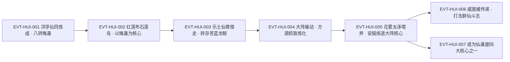

# 悔蛊

**八转仙蛊**，本页登记锚为正文独立成句行「八转悔蛊！」`E:V5-309674`。它的出身写着红莲魔尊的一生：在柳淑仙死后、红莲成尊之际，于其仙窍中「依照他此刻的心境，炼成一只八转的仙蛊」`E:V5-309670`——**这只蛊就是那场后悔的实体化**。它同时也是炼道体系里最特殊的一件工具：有了它，"悔棋"从比喻变成了机制（`E:V5-309996`）。

本页为 2026-09-28 A 线恢复批**新建页**。全书穷举扫描「悔蛊」：**96 次命中 / 91 行**（未去重，含重复段落与题名行）。本页主题按该实体自身机制切分：转数与题名口径、诞生、外形与最大弊端、食料、炼道用途、镇压与阵法用途、传承与"尊者手段"、身份边界。

**本页的转数口径（照纪律先行写明）**：登记锚 `E:V5-309674` 是**正文独立成句行**，不是题名行；全书另有两处**章节题名**含本名（`E:V5-306004`「第六百四十节：悔蛊线索」、`E:V5-308986`「第六百五十七节：悔蛊异变」），题名**只作"该名在全书出现"的存在性证据**，转数与机制**一律回正文取证**（`E:V5-309670`、`E:V5-309674` 等）。

## 主题档案

### 一、转数与身份：八转仙蛊、红莲魔尊的"悔"之结晶

#### 原著事实

- **转数（正文多处互证）**：「八转悔蛊！」`E:V5-309674`（登记锚，独立成句行）；「在他的仙窍中，残余的天地二气不断汇聚，依照他此刻的心境，炼成一只八转的仙蛊。」`E:V5-309670`；「红莲魔尊在这里留下了八转悔蛊」`E:V5-309744`；「不提这只蛊虫的传奇性质，单凭它本身转数高达八转，就已经价值非凡。」`E:V5-309854`；「八转悔蛊食量很大」`E:V5-310168`；「这只八转仙蛊还留在龙鲸洞天之中」`E:V5-324424`。
- **仙蛊屋口径的一致证据**：「这座仙蛊屋仍旧是四大核心仙蛊，升炼仙蛊、水炼仙蛊、仙级悔蛊，以及血本仙蛊。」`E:V6-433558`；「升炼仙蛊已是九转，其余的三只仙蛊都是八转。」`E:V6-433560`（即"仙级悔蛊"为八转）。
- **章节题名（只作存在性证据）**：`E:V5-306004`「章节目录 第六百四十节：悔蛊线索」；`E:V5-308986`「章节目录 第六百五十七节：悔蛊异变」。两行**均不作转数或机制证据**。
- **创制者与"传奇性质"**：「悔蛊在红莲的仙窍中产生，他决定改变这一切的现实。为此他不惜和龙公，和天庭决裂。」`E:V5-366572`；`E:V5-309854` 称其有"传奇性质"。
- **道属**：本批全部命中中，**未见任何一句把悔蛊定义为"××道蛊"**；它出现的语境集中在炼道（`E:V5-309858`、`E:V5-356126`）与镇压（`E:V5-309126`）。

#### 合理推导

- **依据**：`E:V5-309674`、`E:V5-309670`、`E:V5-309854`、`E:V6-433560`；**结论**：悔蛊＝**八转**，五处（含仙蛊屋名录）互证，无相反表述；**不确定性或可能反例**：无（全书未出现悔蛊的其他转数）。
- **依据**：`E:V5-309126`（用于镇压海底巨魔）、`E:V5-309858`（搭悔池）、`E:V5-356126`（以悔蛊为核心的炼道大阵）、`E:V6-433558`（仙蛊屋四大核心之一）；**结论**：悔蛊在原文里被当作**炼道与镇压两类工程的核心件**使用，而非直接攻伐件；**不确定性或可能反例**：`E:V5-354754` 显示其威能可被传递出去影响群仙（见主题六），故"非攻伐件"只是就**原文的具名用途**而言，不等于它不能被用于影响对手。

#### 《问真》设计意义

- 一只"由情绪凝结而成、又能制造情绪"的八转仙蛊，是**叙事—机制同构**的范本：它的诞生理由（后悔）与它的功能（勾动后悔）是同一件事，不需要额外解释。落地时适合做成"剧情解锁 + 工程核心"的双身份道具。

### 二、诞生：洪亭在自己的仙窍中，"依照他此刻的心境"炼成

#### 原著事实

- **诞生过程**：「在他的仙窍中，残余的天地二气不断汇聚，依照他此刻的心境，炼成一只八转的仙蛊。」`E:V5-309670`。
- **诞生的情境**：同段紧接龙公之语「柳淑仙死得其所，所以收起你的悲伤吧，徒儿。」`E:V5-309678`，而洪亭「他没有看向龙公，目光仍旧停留在柳淑仙冰冷的面庞上。」`E:V5-309680`。
- **红莲自己的因果叙述**：「悔蛊在红莲的仙窍中产生，他决定改变这一切的现实。为此他不惜和龙公，和天庭决裂。」`E:V5-366572`。
- **此时的身份**：龙公称其「如今的你已经成为仙尊了，九转尊者」`E:V5-309678`；名号亦在旁白中切换——「他的脸上依稀有着曾经的洪亭的影子，但神态早已发生了彻底的转变。」`E:V5-309736`；「红莲魔尊望着滔滔不绝的光阴长河，幽幽叹息一声」`E:V5-309738`（后接"是时候留下传承了"）。

#### 合理推导

- **依据**：`E:V5-309670`（"依照他此刻的心境"）＋`E:V5-309678`、`E:V5-309680`（柳淑仙之死与洪亭的注视）＋`E:V5-366572`（悔蛊在红莲仙窍中产生）；**结论**：悔蛊的诞生**不是常规炼蛊**（原文未写蛊方、蛊材、炉火），而是**由持有者心境直接凝结**——它的"配方"就是那场后悔；**不确定性或可能反例**："残余的天地二气"仍是必要材料（`E:V5-309670` 明写），故不能完全归于情绪；天地二气的来源与量，原文未写。
- **依据**：`E:V5-309678`（已成仙尊）＋`E:V5-309670`（炼成八转仙蛊）；**结论**：悔蛊诞生于红莲**成尊的同一时段**；**不确定性或可能反例**：原文未给出精确先后（"成尊"与"炼成悔蛊"在文本中相邻，未标时序），本页只登记"同时段"，不排先后。

#### 《问真》设计意义

- "心境即配方"是一条极省笔墨的**传奇道具来历**写法：不必编造稀有材料清单，只要把获得条件绑定在某个不可复制的叙事节点上（此处是柳淑仙之死 + 成尊）。
- 这类道具天然**不可量产**，适合做全服唯一件的设定基础。

### 三、外形与最大弊端：苍白蜈蚣、百须撩动后悔；无一丝后悔者方可免疫

#### 原著事实

- **外形与作用（原文原话）**：「这只蛊形如蜈蚣，浑身苍白，仿佛纸质，蜈蚣有百足，但它的百足却被百须取代。每一根足须，都是半透明，悠悠飘荡，挠着人心，不断地撩起人内心最深处的后悔之情。」`E:V5-309672`。
- **最大弊端与免疫条件**：「不愧是悔蛊，能时刻传播、勾动出无穷无尽的后悔之情。唯有心中没有一丁点后悔的人，才能免疫这项最大弊端。除此之外，任何蛊仙靠近它，都会感受到无以伦比的悔痛！」`E:V5-309776`。
- **连尊者也需修为才能镇住**：同句续写「若非我此时已有九转修为，恐怕还真镇压不住。」`E:V5-309776`。
- **不可直接接触**：「小心，悔蛊不可直接接触，否则哪怕你炼化了此蛊，也会被无穷无尽的后悔之情淹没！」`E:V5-309798`。
- **方源的反例（直接接触且炼化成功）**：「没有这个必要。」`E:V5-309800`；随后「方源面色淡然，一把抓住悔蛊，顷刻炼化。」`E:V5-309800`。
- **副产物（乐土仙尊的自我返照）**：「看来你心中也有悔痛。」`E:V5-309778`；「谁的一生没有一件令其后悔的事？」`E:V5-309780`。

#### 合理推导

- **依据**：`E:V5-309776`（唯心中无一丝后悔者可免疫）＋`E:V5-309800`（方源直接抓取、顷刻炼化）＋`E:V5-309798`（红莲真意警告不可直接接触）；**结论**：方源能**无视警告直接炼化**，与"免疫条件"这一设定**互相支持**——他在此刻的"无悔"是解；**不确定性或可能反例**：原文**没有**在 `E:V5-309800` 处明写"因为方源心中没有后悔，所以他能直接抓取"，因此这条因果是**本页的推导**，不是原文直陈；另一种可能是 `E:V5-309798` 所述"我已为你准备了手段"另有他用。
- **依据**：`E:V5-309776`；**结论**：悔蛊的作用方式是**被动、持续、无差别**的（"时刻传播""任何蛊仙靠近它"），不需要使用者催动即可生效；**不确定性或可能反例**：`E:V5-354754`、`E:V5-354756` 显示其威能可被**主动传递**（见主题六），故"被动生效"是默认态、不是唯一态。

#### 《问真》设计意义

- "持续、无差别、按使用者心境判定免疫"的负面光环，是一套**自带平衡**的设计：稀有度高但会伤害持有方与队友，天然限制它被无条件携带。
- `E:V5-309798`（不可直接接触）与 `E:V5-309800`（有人直接接触并成功）构成一组**"警告 vs 例外"**的叙事张力，适合做成"是否相信警告"的玩家抉择。

### 四、食料与喂养：须保持新鲜的太泽花雾，难以囤积

#### 原著事实

- **食料与麻烦**：「八转悔蛊食量很大，食物就是太泽花产生的雾气，麻烦的一点在于这些雾气必须要时刻保持新鲜。」`E:V5-310168`。
- **同义复述**：「这些太泽雾气便是悔蛊的食料。」`E:V5-335638`；「悔蛊喂养比较麻烦的一点，就是食材难以囤积。」`E:V5-335640`。
- **可操作方案**：「最好的方法就是直接在仙窍中营造出一个相应的资源点。」`E:V5-335640`；方源的实际做法是自建产地——「当初为了喂养悔蛊，方源可是直接打造了一个庞大的花雾太泽！」`E:V6-394862`，并命名「就将这片沼泽命名为花雾太泽吧，第一步已经完成了。」`E:V5-310164`。
- **喂食节奏**：「有了这样规模的太泽花雾，喂养悔蛊不成问题。」`E:V5-310166`；「然后就是继续扩大太泽花的规模，陆续增添数量。等到悔蛊饥饿的时候，仙窍中积蓄出来的太泽花雾，足够它饱餐一顿了。」`E:V5-310172`。

#### 合理推导

- **依据**：`E:V5-310168`、`E:V5-335640`；**结论**：本实体的喂养难点**不在量而在保鲜**（"必须要时刻保持新鲜"），因此最优解是**产地与宿主同居**（仙窍内营造资源点）；**不确定性或可能反例**：原文未给"新鲜"的时间阈值，也未给单位食量。

#### 《问真》设计意义

- "食材不可囤积、必须现采"是一条好用的**后勤约束**：它把"养好一只顶级蛊"变成一项需要长期经营的基建任务（`E:V6-394862` 的"庞大的花雾太泽"），而非一次采购。
- 这也天然解释了为什么这类蛊**只可能长期持有、不可能临时借用**。

### 五、用途一：炼道——悔池与炼道大阵，"可以反悔炼蛊当中的小过程"

#### 原著事实

- **搭悔池**：「有了悔蛊，方源搭建悔池就毫无关卡可言了。」`E:V5-309858`；「有悔蛊、还有宙道仙材，方源只需要按部就班，耗费时间，就能建设出悔池。甚至，更优异于悔池的仙蛊屋来。」`E:V5-309862`；对照句「除非将来他获得悔蛊，构建出悔池来。」`E:V5-329108`。
- **核心功能（炼道仙阵）**：「这还多亏了方源得到了悔蛊，布置出了炼道仙阵，可以反悔炼蛊当中的小过程，重新来过。」`E:V5-309996`。
- **降低风险**：「悔蛊在手，能减损他无数的损失，将炼蛊的风险降至最低！」`E:V5-333350`。
- **并入既有大阵（两条历史线）**：「上一世，他依照悔池的方案，以悔蛊为核心，构建了炼道大阵。」`E:V5-356126`；这一世则「方源吞并了整个琅琊福地，拥有了极端优异的长毛炼道大阵，他现在要做的只是将悔蛊增添到这个大阵中去。」`E:V5-356128`；「此刻只是需要他亲自坐镇，将悔蛊安插在空余的核心位置上即可。」`E:V5-356132`；「等到群仙汇合到方源身边，方源已经将悔蛊安置妥当了。」`E:V5-356160`。
- **实际效果（一次可见的"回滚"）**：「悔蛊发挥作用，阵内火焰的颜色旋即又变了回来，不仅如此，七转仙蛊雏形也恢复如初。」`E:V5-356210`；「所有的损失的只是最后那一份仙材而已。」`E:V5-356212`。
- **整体评价**：「原本他们的炼道实力，便傲视天下。现在有了悔蛊，简直是蛟龙飞空，优势扩大得一发不可收拾。」`E:V5-356222`；「琅琊地灵、毛民蛊仙、长毛炼道大阵、悔蛊，以及丰富的仙材，都让他炼蛊时游刃有余。」`E:V5-356246`。

#### 合理推导

- **依据**：`E:V5-309996`（反悔小过程、重新来过）＋`E:V5-356210`（七转仙蛊雏形恢复如初）＋`E:V5-356212`（只损失最后一份仙材）；**结论**：悔蛊在炼道中的作用是**局部回滚**，粒度是"炼蛊当中的小过程"（不是整炉重来）；**不确定性或可能反例**：原文未写回滚的次数限制、是否可回滚到任意检查点；"回滚不能恢复已消耗的仙材"是**本页从 `E:V5-356212` 推出的**，原文只陈述了结果。
- **依据**：`E:V5-356126` 与 `E:V5-356128`（上一世以悔蛊为核心新建大阵，这一世把它并入现成长毛炼道大阵）；**结论**：悔蛊是**可插拔的核心件**——它不绑定某一座特定大阵，而是"安插在空余的核心位置上"（`E:V5-356132`）；**不确定性或可能反例**：并非所有大阵都能直接安插，`E:V5-356130` 明写"大阵当然需要调整"。

#### 《问真》设计意义

- **"回滚"是炼道系统里最有价值的机制之一**：它把"高失败率 + 高损耗"的炼蛊过程（见 `E:V5-356212` 的仙材损耗）从赌博变成可管理的工程，成本从"承受失败"改为"维护一件顶级道具"。
- "可插拔核心件"（`E:V5-356132`）则给了工程玩法一条自由度：玩家可以把同一核心在不同阵体间迁移。

### 六、用途二：镇压与阵法——镇魔悔哭海，及可被传递的威能

#### 原著事实

- **镇压用途**：「悔蛊事关重大，用于镇压海底巨魔，显然不会是乐土真传中的内容。」`E:V5-309126`；方源的推测同段：「我现在几乎可以肯定，悔蛊就在这里啊！只是我要取走悔蛊，会不会破坏了乐土的布置，引发他的后手？」`E:V5-309124`。
- **存放地表层**：方源据此把搜索范围收拢到一处海域——「这片海市最靠近镇魔悔哭海」`E:V5-306252`；「经过方源的推算，这里面藏有悔蛊的可能性相当的大。」`E:V5-306940`；「方源要获取悔蛊，只要进入悔哭海即可。」`E:V5-352218`。
- **异变与出手**：「整个大阵蓦地催动起来，悔蛊飞射而出，竟直接射向方源。」`E:V5-309154`。
- **威能被传递、双向影响战场**：「群仙接连住手，气势、斗志暴跌，均遭受到悔蛊的影响。」`E:V5-354754`；「这阵中的魔仙将悔蛊的威能，传递出来，大大降低了自身的影响」`E:V5-354756`。
- **被毁的风险**：「若是悔蛊因此被摧毁，那方源的计划将会严重受挫。」`E:V5-355732`。

#### 合理推导

- **依据**：`E:V5-309126`（用于镇压海底巨魔）＋`E:V5-309124`（取走会否破坏乐土布置）；**结论**：悔蛊在龙鲸乐土中承担的是**镇压件**角色，且"取走它"存在**未知后手风险**（方源自己也只是疑虑，未证实）；**不确定性或可能反例**：原文**没有**交代所谓"后手"是否真的存在、是否触发；本页按"疑虑"登记，不写成"事实上的机关"。
- **依据**：`E:V5-354754`＋`E:V5-354756`；**结论**：悔蛊的威能可以被**第三方转递**（阵中的魔仙把它的威能传递出来，反而降低了自己受影响的程度）——即它是**可路由**的效果源；**不确定性或可能反例**：原文只写"传递出来"，未写传递的介质与代价，也未写被传递的效果是否会衰减。

#### 《问真》设计意义

- **"威能可传递"**（`E:V5-354756`）提供了"负光环武器化"的玩法出口：既能用来压制对手，也能被对手利用来卸掉自身压力——这天然是一场围绕**位置**的博弈。
- **"镇压件"**身份则给了"取宝"一个代价：拿走它可能放出别的东西（`E:V5-309126`）。这类"守则还是取"的抉择，比单纯的宝箱更有张力。

### 七、传承链与"尊者手段"：从石莲岛到苍蓝龙鲸，再到方源

#### 原著事实

- **布置意图**：「这第一座石莲岛，也是最重要的石莲岛，必以悔蛊为核心，留给天外之魔，在未来最有希望摧毁宿命的人！」`E:V5-309740`。
- **留下的东西**：「红莲魔尊在这里留下了八转悔蛊，还留下大量的宙道仙材、仙道杀招，一股真意，包含了自己的一段最真实的记忆，还有一记威能奇绝的仙道杀招。」`E:V5-309744`。
- **借出的许可**：「悔蛊可以借你一用，至于你想抢夺我的继承人，那就得看你自己的本事了。」`E:V5-309768`；「这是悔蛊，你可接好。」`E:V5-309772`；「将悔蛊收入仙窍」`E:V5-309782`。
- **乐土仙尊借走（后世的追述）**：「按照方源在石莲岛上得到的历史记忆，乐土仙尊曾经进入石莲岛，借走悔蛊。」`E:V5-354234`；「红莲意志妥协，乐土仙尊便成功借走悔蛊，还想要和红莲魔尊抢夺继承人。」`E:V5-354238`；「又比如乐土仙尊进入红莲石岛中，取走悔蛊，就十分容易。」`E:V6-396030`。
- **转入苍蓝龙鲸**：「为此，乐土仙尊将悔蛊夺走，安排到了苍蓝龙鲸之中。」`E:V6-384068`；「正因如此，才有了后来，方源闯荡苍蓝龙鲸洞天乐土，取走悔蛊，释放沈伤的后续。」`E:V6-384070`；「这只八转仙蛊还留在龙鲸洞天之中，是被乐土仙尊带走的。」`E:V5-324424`。
- **"尊者手段"的载体作用（上一世）**：「悔蛊一飞到他的手中，尊者手段便瞬间发动，将方源带回到光阴长河的石莲岛上。」`E:V5-352086`；「尊者手段绝妙浩大，方源上一世被悔蛊送上石莲岛，根本没有反抗之力。」`E:V5-354246`。
- **这一世的反向操作**：「为了留在龙鲸乐土中，方源提前损毁了石莲岛。没有了石莲岛，悔蛊上的仙尊手段也就没有了目的地，如何发动？」`E:V5-354232`；「没有石莲岛，悔蛊上的尊者手段就无从发动。」`E:V5-352094`；「作为代价，那座石莲岛也跟着毁了。」`E:V5-352092`；「上一世悔蛊异变，直接飞出来将我带走。这一世它毫无动静，看来需要我亲自动手了。」`E:V5-354244`；「悔蛊没有发动，事实上是方源乐于见到的情况。」`E:V5-354248`。
- **方源取走后的状态**：「方源得了这只蛊虫，手中掌握的八转蛊虫已经多达五只。分别是态度蛊、慧剑蛊、似水流年蛊、魂兽令、悔蛊。」`E:V5-309856`；「难道他还要告诉琅琊地灵，在未来他还要获得春、夏、大气、悔蛊这些八转仙蛊吗？」`E:V5-323860`；后期名录中亦见其名「态度蛊、变异蛊、慧剑蛊、似水流年蛊、魂兽令、悔蛊」`E:V6-377176`。
- **最终成为仙蛊屋核心**：「这座仙蛊屋仍旧是四大核心仙蛊，升炼仙蛊、水炼仙蛊、仙级悔蛊，以及血本仙蛊。」`E:V6-433558`；「升炼仙蛊已是九转，其余的三只仙蛊都是八转。」`E:V6-433560`。
- **计划中的位置**：「方源接下来的计划，就是取得悔蛊，然后大规模升炼自家的仙蛊。」`E:V5-351122`；「这一次，我不仅要谋夺悔蛊，更要全力尝试，看看能否收拢了那座功德碑，甚至将整个乐土真传、苍蓝龙鲸都纳入手里！」`E:V5-351130`；「他决定在这里耗费一段时间，为了悔蛊，以及大阵中的其他仙蛊，这点投资是完全值得的。」`E:V5-354528`。

#### 合理推导

- **依据**：`E:V5-352086`、`E:V5-352094`、`E:V5-354232`；**结论**：悔蛊同时是**传承信物**与**传送触发件**（"尊者手段"须以石莲岛为目的地才可发动）——即它的某项功能依赖一个**配套目标点**；摧毁目标点即可让触发件失效；**不确定性或可能反例**：原文未说明该手段是**刻在悔蛊上**还是**由石莲岛引发**；`E:V5-354232` 的措辞"悔蛊上的仙尊手段也就没有了目的地"支持"手段在蛊上、目的地是岛"的读法，但这仍是措辞推断。
- **依据**：`E:V6-384068`、`E:V6-384070`、`E:V5-324424`；**结论**：悔蛊的完整流转链是**红莲（造）→ 石莲岛（存）→ 乐土仙尊（借走／夺走）→ 苍蓝龙鲸（存放）→ 方源（取走）**；**不确定性或可能反例**：`E:V6-384068` 用"夺走"、`E:V5-354234` 与 `E:V5-354238` 用"借走"，**两种动词并存**（见《待核对》口径冲突）。

#### 代价与收益（支付方／受益方／支付时点）

| 项 | 支付方 | 受益方 | 支付时点／生效条件 | 证据 |
|---|---|---|---|---|
| 悔蛊的诞生 | 洪亭／红莲（以柳淑仙之死为情境、以心境为配方） | 红莲本人及后世继承者 | 成尊同期的仙窍凝结 | E:V5-309670、E:V5-309678、E:V5-366572 |
| 靠近／持有悔蛊 | 任意蛊仙（承受悔痛；心中无后悔者除外） | 无 | 靠近即持续生效 | E:V5-309776、E:V5-309798 |
| 喂养 | 持有者（须维持新鲜花雾产地） | 持有者 | 长期持续 | E:V5-310168、E:V5-335640 |
| 取得回滚能力 | 持有者（建设悔池／大阵的仙材与时间） | 持有者（炼道风险降至最低） | 核心件安插到位后 | E:V5-309862、E:V5-333350、E:V5-356132 |
| 取走镇压件 | 取走者（承担破坏乐土布置的风险） | 取走者 | 取走时 | E:V5-309124、E:V5-309126 |
| 摧毁石莲岛（阻断尊者手段） | 方源（放弃石莲岛为其代价） | 方源（留在龙鲸乐土） | 提前损毁石莲岛时 | E:V5-352092、E:V5-354232 |

## 状态时间线

| 状态 ID | 阶段 | 状态 | 证据 |
|---|---|---|---|
| ST-HUI-01 | 诞生 | 洪亭在仙窍中以残余天地二气、依此刻心境炼成一只八转仙蛊，即悔蛊；时为柳淑仙死后、其已成尊之际 | E:V5-309670、E:V5-309674、E:V5-309678、E:V5-366572 |
| ST-HUI-02 | 形态与弊端 | 形如苍白蜈蚣、百足代以半透明百须，能勾动无穷后悔之情；唯心中无一丝后悔者可免疫，任何蛊仙靠近即感受悔痛 | E:V5-309672、E:V5-309776 |
| ST-HUI-03 | 留传 | 红莲魔尊以悔蛊为核心留下第一座石莲岛，留给天外之魔；随蛊留下八转悔蛊、大量宙道仙材、仙道杀招与一股真意 | E:V5-309740、E:V5-309744 |
| ST-HUI-04 | 借出 | 乐土仙尊进入石莲岛借走悔蛊；红莲真意许可"可以借你一用" | E:V5-309768、E:V5-309772、E:V5-354234、E:V5-354238 |
| ST-HUI-05 | 转移与存放 | 乐土仙尊将悔蛊带走，安排进苍蓝龙鲸（龙鲸洞天）；其亦用于镇压海底巨魔 | E:V6-384068、E:V5-324424、E:V5-309126 |
| ST-HUI-06 | 取得 | 大阵催动、悔蛊飞射而出；方源无视"不可直接接触"的警告，一把抓住并顷刻炼化；自此手中八转蛊虫达五只 | E:V5-309154、E:V5-309798、E:V5-309800、E:V5-309856 |
| ST-HUI-07 | 喂养 | 以自建的花雾太泽供给太泽花雾为食；食材须新鲜、难以囤积，故在仙窍中营造资源点 | E:V5-310164、E:V5-310168、E:V5-335638、E:V5-335640、E:V6-394862 |
| ST-HUI-08 | 炼道应用 | 以悔蛊搭悔池、安插为炼道大阵核心件；可反悔炼蛊当中的小过程重新来过，把炼蛊风险降至最低；实际回滚过一次七转仙蛊雏形的失败 | E:V5-309858、E:V5-309996、E:V5-356132、E:V5-356210、E:V5-333350 |
| ST-HUI-09 | 阵法与仙蛊屋 | 其威能可被阵中魔仙传递出来影响群仙；最终成为仙蛊屋四大核心仙蛊之一（仙级悔蛊），为八转 | E:V5-354754、E:V5-354756、E:V6-433558、E:V6-433560 |

## 原著明确内容（本批取证窗口登记）

本批对「悔蛊」在根原文全书扫描：**96 次命中 / 91 行**（未去重），其中**题名行 2 处**（`E:V5-306004`、`E:V5-308986`），**重复段落 2 行**（成对：`E:V6-391032`≡`E:V6-384068`、`E:V6-391034`≡`E:V6-384070`，文字完全相同，见下表）。

| 窗口 | 内容要点 | 用途 |
|---|---|---|
| 306002–306006 | 章节目录题名「第六百四十节：悔蛊线索」`E:V5-306004`（仅定位，不作转数／机制证据） | 题名口径 |
| 306168–306176 | 方源见情报后心中浮现悔蛊；紧邻为另一处章节目录题名（"海市赌石坊"，不含本名） | 主题六（线索起点） |
| 306250–306256 | 海市靠近镇魔悔哭海，探听悔蛊消息 | 主题六 |
| 306924–306942 | 目标是悔蛊；功德碑奖励中无悔蛊；据智道推算判定镇魔悔哭海藏悔蛊的可能性很大 | 主题六 |
| 308984–308990 | 章节目录题名「第六百五十七节：悔蛊异变」`E:V5-308986`（仅定位，不作转数／机制证据） | 题名口径 |
| 309124–309156 | 方源确信悔蛊在此；悔蛊用于镇压海底巨魔；异变陡生，悔蛊飞射而出直射方源 | 主题六 |
| 309670–309682 | 依当下心境在仙窍中炼成八转仙蛊；形如蜈蚣的形态描写；「八转悔蛊！」`E:V5-309674`；龙公之言与洪亭的注视 | 主题一、二、三 |
| 309736–309746 | 洪亭→红莲魔尊的转变；"是时候留下传承了"；以悔蛊为核心的第一座石莲岛；留下八转悔蛊等 | 主题七 |
| 309768–309786 | "悔蛊可以借你一用"；乐土仙尊接过悔蛊；"不愧是悔蛊"与最大弊端；收入仙窍 | 主题三、七 |
| 309796–309802 | 警告不可直接接触；方源无视警告、抓取炼化 | 主题三 |
| 309854–309862 | 转数高达八转；方源手中八转蛊达五只；有悔蛊则搭悔池毫无关卡；可建更优异于悔池的仙蛊屋 | 主题一、五 |
| 309994–310000 | 以悔蛊布置炼道仙阵，可反悔炼蛊当中的小过程、重新来过 | 主题五 |
| 310162–310174 | 命名花雾太泽；喂养食料为太泽花雾、须时刻新鲜；扩大规模的喂食节奏 | 主题四 |
| 323856–323864 | "在未来他还要获得春、夏、大气、悔蛊这些八转仙蛊" | 主题七 |
| 324420–324428 | 缺少的是悔蛊；该八转仙蛊留在龙鲸洞天、被乐土仙尊带走；上一世借其被传送到石莲岛 | 主题七 |
| 329104–329112 | "除非将来他获得悔蛊，构建出悔池来" | 主题五 |
| 333346–333352 | 掌握悔蛊是美妙的事；悔蛊在手可将炼蛊风险降至最低 | 主题五 |
| 335634–335642 | 太泽雾气即悔蛊食料；食材难以囤积，宜在仙窍中营造资源点 | 主题四 |
| 351120–351132 | 下一步计划即取得悔蛊并大规模升炼；这一世还要谋夺功德碑与整个乐土传承 | 主题七 |
| 352082–352098 | 上一世得悔蛊后被送回石莲岛；石莲岛被毁则尊者手段无从发动 | 主题七 |
| 352216–352222 | 进入悔哭海即可取得悔蛊 | 主题六 |
| 354186–354192 | 借任务提前收取悔蛊 | 主题七 |
| 354226–354250 | 悔蛊毫无动静；石莲岛被毁导致手段失去目的地；乐土借走悔蛊的历史记忆；这一世需方源自行动手 | 主题七 |
| 354354–354360 | 悔蛊就在眼前，升炼仙材尚有缺口 | 主题七 |
| 354526–354532 | 为悔蛊与大阵其他仙蛊投入时间值得 | 主题七 |
| 354752–354758 | 群仙气势斗志暴跌均受悔蛊影响；阵中魔仙将威能传递出来以降低自身影响 | 主题六 |
| 355730–355736 | 若悔蛊被摧毁，方源计划严重受挫 | 主题六 |
| 356122–356134 | 此番最大收获是悔蛊；这一世把悔蛊并入长毛炼道大阵、安插在空余核心位 | 主题五 |
| 356156–356164 | 悔蛊安置妥当；毛民蛊仙待命 | 主题五 |
| 356206–356214 | 悔蛊发挥作用，七转仙蛊雏形恢复如初；只损失最后一份仙材 | 主题五 |
| 356220–356226 | 有悔蛊后炼道优势"蛟龙飞空" | 主题五 |
| 356242–356248 | 琅琊地灵、毛民、长毛炼道大阵、悔蛊、仙材齐备 | 主题五 |
| 366570–366574 | 悔蛊在红莲仙窍中产生；他为改变现实与龙公、天庭决裂 | 主题二 |
| 377174–377178 | 方源手中八转仙蛊名录（含悔蛊） | 主题七 |
| 384066–384072 | 乐土仙尊将悔蛊夺走、安排到苍蓝龙鲸；方源取走悔蛊、释放沈伤 | 主题七 |
| 391030–391036 | **与 384066–384072 文字完全相同的重复段落** | 重复块口径 |
| 394860–394864 | 为喂养悔蛊打造庞大的花雾太泽 | 主题四 |
| 396028–396032 | 乐土仙尊进入红莲石岛取走悔蛊十分容易 | 主题七 |
| 433556–433562 | 仙蛊屋四大核心仙蛊，含仙级悔蛊；除升炼仙蛊为九转外其余三只皆八转 | 主题一、七 |

## 事件链

| 事件 ID | 事件 | 参与者 | 证据 | 因果 |
|---|---|---|---|---|
| EVT-HUI-001 | 柳淑仙死后，洪亭在仙窍中依此刻心境炼成八转仙蛊，即悔蛊；此时其已成为仙尊 | 洪亭、龙公、柳淑仙 | E:V5-309670、E:V5-309674、E:V5-309678 | evidences ST-HUI-01 |
| EVT-HUI-002 | 红莲魔尊以悔蛊为核心布下第一座石莲岛，留给天外之魔，并留下八转悔蛊、宙道仙材、杀招与一股真意 | 红莲魔尊 | E:V5-309740、E:V5-309744 | evidences ST-HUI-03 |
| EVT-HUI-003 | 乐土仙尊进入石莲岛借走悔蛊，随后将其安排进苍蓝龙鲸 | 乐土仙尊、红莲意志 | E:V5-309768、E:V5-309772、E:V5-354234、E:V5-354238、E:V6-384068 | evidences ST-HUI-04、ST-HUI-05 |
| EVT-HUI-004 | 大阵催动、悔蛊飞射而出；方源无视"不可直接接触"的警告，抓取并顷刻炼化 | 方源、悔蛊 | E:V5-309154、E:V5-309798、E:V5-309800 | evidences ST-HUI-06 |
| EVT-HUI-005 | 方源自建花雾太泽喂养悔蛊，并将其安插为炼道大阵核心件，实现"反悔炼蛊小过程" | 方源、毛民蛊仙、琅琊地灵 | E:V5-310164、E:V5-335640、E:V5-356132、E:V5-356210、E:V5-309996 | evidences ST-HUI-07、ST-HUI-08 |
| EVT-HUI-006 | 阵中魔仙将悔蛊威能传递出来，使群仙气势斗志暴跌而自身影响降低 | 方源、阵中魔仙、群仙 | E:V5-354754、E:V5-354756 | evidences ST-HUI-09 |
| EVT-HUI-007 | 悔蛊最终成为仙蛊屋四大核心仙蛊之一（仙级悔蛊、八转） | 方源 | E:V6-433558、E:V6-433560 | evidences ST-HUI-09 |

事件口径：本页沿用实体簇号 `EVT-HUI-*`（与 `ST-HUI-*` 同簇）。节点 7 个，已达阈值，故配 mermaid 主干。EVT-HUI-006（威能传递）与 EVT-HUI-007（仙蛊屋定型）同源于 EVT-HUI-005 的"入阵"，故并列分支，**不写成先后**。

## 资料整理

本页为**新建页**，没有旧版；本批来源只有根原文，没有 `notes:`／`memory:` 层转述进入本页事实区。相关派生记录的处置登记如下（**本段内容不得当作原著事实**）：

- `roster-3.md` 的"品阶上限压缩"节记：`| human_atk_5_34_gu | 悔蛊 | 5 | 8 | E:V5-309674 |  |`。本页复核：锚点行 `E:V5-309674` 逐字为「八转悔蛊！」——是**正文独立成句行**（不是章节题名），故"原文转 8"成立；另有多处正文互证（`E:V5-309670`、`E:V5-309854`、`E:V6-433560`）。本页只登记，不改该页。
- **题名与正文的分工（本页口径）**：全书含「悔蛊」的**章节目录行**共 2 处（`E:V5-306004`、`E:V5-308986`）。二者**只证明"悔蛊"这一名在全书出现**，**不作**转数、机制或代价的证据；本页所有转数与机制证据均取自正文（`E:V5-309670`、`E:V5-309674`、`E:V5-309744`、`E:V5-309854`、`E:V6-433560` 等）。
- **重复段落**：`E:V6-384068`、`E:V6-384070` 与 `E:V6-391032`、`E:V6-391034` 文字**完全相同**。本页引用时以**先出者**（384068／384070）为准，并在《原著明确内容》单列后出区块，供校验组核对。
- `game/data/gu_lore.json` 的 `human_atk_5_34_gu` 现为 `game_rank=5`、`status=rank_cap`、`lore_rank=8`、`anchor=E:V5-309674`——投影与本页一致。`game/**` 只读，不在本批改动范围。
- 本页**不声明桥接层 canon 来源**（`sources:` 只声明根原文）。
- **id 归类张力（派生层）**：本实体 id 为 `human_atk_5_34_gu`，而原文明文将悔蛊用于**炼道与镇压**（`E:V5-309858`、`E:V5-309126`），本批未找到"悔蛊属人道"或"悔蛊为攻伐类"的原文依据；同一 `human_atk_*` 桶内另含信道条目（如 `human_atk_5_31_gu` 海誓蛊）、情类条目（如 `human_atk_5_02_gu` 爱情蛊）。本页只登记前缀语义在原文中无据，不推断、不改 id。
- **本页未取的路径**：原文中另有关"悔哭海""功德碑""乐土真传攻略路线"的段落（如 `E:V5-352218`、`E:V5-354188`），属**剧情流程**而非本实体机制，本页只在需要交代"如何取得"时择要引用，未逐条穷举。

## 分析与解读

以下为归纳，不是原文（须与上文"原著事实"区分）：

1. **转数证据链在本页特别干净**：登记锚 `E:V5-309674` 本身就是一句独立成句的判语「八转悔蛊！」，另有 `E:V5-309670`（"炼成一只八转的仙蛊"）、`E:V5-309854`（"转数高达八转"）、`E:V6-433560`（仙蛊屋口径）互证。四路同向，无第二口径。
2. **诞生机制是"心境即配方"**：`E:V5-309670` 明写"依照他此刻的心境"，且同段未出现蛊方、蛊材、炉火等常规炼蛊要素；唯一写出的材料是"残余的天地二气"。这让悔蛊的**不可复制性**有文本依据。
3. **它最强的功能是"回滚"而不是"攻击"**：`E:V5-309996`（反悔炼蛊当中的小过程）＋`E:V5-356210`（雏形恢复如初）＋`E:V5-356212`（只损失最后一份仙材）。三句连读才看出它在炼道体系里是**容错装置**：改变的不是成功率，而是**失败的可撤销性**。
4. **"最大弊端"是一次漂亮的平衡设计**：`E:V5-309776` 的免疫条件是"心中没有一丁点后悔"，这既是限制（几乎所有人都不合格），也是**人物刻画工具**——`E:V5-309778`、`E:V5-309780` 的对话直接用它反照乐土仙尊的内心。
5. **它的威能可被第三方路由**（`E:V5-354756`），这意味着它不是"单体负面光环"，而是**可被用作阵列要素的效果源**；这一条在本批证据里相当稀有，落地价值高。
6. **两种措辞的并存必须登记**：乐土仙尊对悔蛊的取得，原文分别写作"借走"（`E:V5-354234`、`E:V5-354238`）与"夺走"（`E:V6-384068`）。本页并列保留，不统一（见《待核对》）。

## 待核对

- `[存在冲突]` **乐土仙尊是"借走"还是"夺走"悔蛊**：**口径A（借）**＝`E:V5-354234`「乐土仙尊曾经进入石莲岛，借走悔蛊」、`E:V5-354238`「红莲意志妥协，乐土仙尊便成功借走悔蛊」、`E:V5-309768`（红莲真意许可"悔蛊可以借你一用"）；**口径B（夺）**＝`E:V6-384068`「乐土仙尊将悔蛊夺走，安排到了苍蓝龙鲸之中」。**当前状态**：两口径并存、均为逐字原文，本页不统一；`E:V5-354236`（"石莲岛上虽有红莲意志，也有红莲手段，但如何能比一位活生生的尊者？"）提供"借"之名下实为压力取得的**可能解释**，但这属诠释，不构成裁定。
- `[原著未明确]` **转数以外的品阶／起源口径**：`E:V5-309670` 只说"残余的天地二气"＋"心境"，未写蛊方、未写是否可用常规炼蛊手段复制；`E:V5-309854` 的"传奇性质"亦未展开。"悔蛊能否被第二个人炼出"原文未写。
- `[原著未明确]` **道属归类**：本批全部命中中**无一句**把悔蛊定义为"某道蛊"；`E:V5-309126`（镇压）、`E:V5-309858`（悔池）、`E:V5-356126`（炼道大阵）、`E:V6-433558`（仙蛊屋核心）只给用途，不给道属。**不得**据"常用于炼道"反推其道属为炼道。
- `[待取证]` **"反悔"的粒度与限制**：`E:V5-309996` 明写可反悔"炼蛊当中的小过程"、可"重新来过"；`E:V5-356210` 给出一次实例（七转仙蛊雏形恢复如初）。**未写**：回滚次数上限、是否有冷却、能否回滚他人的炼蛊、能否回滚非炼蛊事件。按纪律拆条——机制 **[已确认]** ＝可回滚炼蛊中的小过程；具体数值与边界 **[待取证]**。
- `[待取证]` **"免疫"是否只有"心中无后悔"一条路**：`E:V5-309800` 显示方源直接抓取炼化成功，但原文**未写明原因**。**口径A**：方源心中无悔，符合 `E:V5-309776` 的免疫条件；**口径B**：方源另凭手段（`E:V5-309798` 提到红莲真意"已为你准备了手段"）。**当前状态**：两读并存，本页**不判定**；只登记"方源确实直接接触并炼化成功"这一事实。
- `[待取证]` **"镇压海底巨魔"的具体对象与机制**：`E:V5-309126` 只有一句（且是方源的判断），未写镇压的是何物、如何镇压、取走后是否真的出事（`E:V5-309124` 的疑虑未被回应）。**不得**写成"悔蛊被证实为镇压件"以外的任何结论。
- `[待取证]` **"尊者手段"刻在哪一方**：`E:V5-352094`、`E:V5-354232` 的措辞指向"手段在悔蛊上、目的地是石莲岛"，但这是**措辞推断**；原文未直陈。
- `[原著未明确]` **数值类缺口（机制已确认、数值未知 → 拆条）**：机制 **[已确认]** ＝勾动后悔之情、威能可被传递（`E:V5-309672`、`E:V5-354754`、`E:V5-354756`）、以悔蛊安插大阵核心实现回滚（`E:V5-356132`）；具体数值 **[待取证]** ＝悔痛的作用半径与强度、免疫判定的精度（"一丁点"是修辞还是标准）、每日食量与"新鲜"的时间阈值、回滚的资源代价（`E:V5-356212` 只提"最后那一份仙材"）。
- `[待取证]` **题名口径的复核**：本页已确认含本名的章节目录行共 2 处（`E:V5-306004`、`E:V5-308986`）。若后续校订版增删题名，需按"题名只作存在性证据、转数另据正文"重核。

- **体积例外登记（本页自身）**：本页落盘 42635 字节（UTF-8 无 BOM、CRLF），已超 40 KB；按 GOVERNANCE 登记例外，**未为压体积删除任何有效知识**（如需分开装载，建议按主题节拆分，勿删证据行）。
- **尾部无节区登记（返修 2026-09-28）**：段6 的权威上界是 **436638**（`lore/wiki/source/section-index.md` 段级摘要表；原文总行数 437060 与段域上界不是一回事），436639–437060 无合法 E-ID 空间。本页《模板扩展建议》提到天机蛊页的重复块时（原文第 436726–436846 行与第 436938–437058 行），已改用**裸行号**。**检索口径**：`py -3` 逐行扫描根原文（`newline=''` + `split('\r\n')`）后按段域表机械重算段号；实测本页 `E:V6-` 后行号 > 436638 的 token 计数 **= 0**。

## 模板扩展建议（只登记，不改核心模板）

1. **"题名命中"建议在模板中单列一格**。本页 91 行命中中含 2 行题名（`E:V5-306004`、`E:V5-308986`）；本批的天机蛊亦有 1 行题名（`E:V5-276222`）。建议模板固定一格"题名命中 n 处"，并把"题名只作存在性证据"的声明标准化，避免每页自拟措辞。
2. **"重复段落"需要统一的登记位置**。本页与天机蛊页都遇到原文后段重出（`E:V6-384068`／`E:V6-391032`；天机蛊页的两个重复区块即原文第 436726–436846 行与第 436938–437058 行，二者均落在无节区、已按裸行号登记）。建议在《原著明确内容》下固定一个"重复块"子表，供批次级去重统计。
3. **"手段载体 vs 目标点"值得单列一类**。本实体同时是"触发件"与"信物"，其功能依赖一个配套目标点（石莲岛 `E:V5-352094`）。建议模板预留"功能依赖"一格，表达"该道具须与某物配套才生效"。
4. **"警告 vs 例外"建议做成固定小节**。`E:V5-309798`（不可直接接触）与 `E:V5-309800`（有人直接接触成功）是本批少见的高张力证据对，建议在《待核对》中把此类"规则 + 反例"固定为一类条目。

## 关联页面

[宿命蛊](fate-gu.md)、[爱情蛊](human-atk-5-02-gu.md)、[春秋蝉](spring-autumn-cicada-gu.md)、[智慧蛊](wisdom-gu.md)、[炼道](../world/refinement-path.md)、[宙道](../world/time-path.md)、[宿命](../themes/fate.md)、[人祖传](../themes/ren-zu-zhuan.md)、[杀招实例名录](../world/kill-move-roster.md)、[炼蛊与杀招链](../world/gu-refine-killer-chain.md)、[蛊的饲养与炼化](../world/gu-care-and-refinement.md)、[真元](../world/primeval-essence.md)、[红莲](../characters/red-lotus.md)、[石莲岛之争](../events/stone-lotus-island-contest.md)、[方源](../characters/fang-yuan.md)、[蛊虫关系](gu-relations.md)、[蛊虫总表](roster.md)、[蛊虫总表三期](roster-3.md)、[蛊虫总表二期](roster-2.md)。
