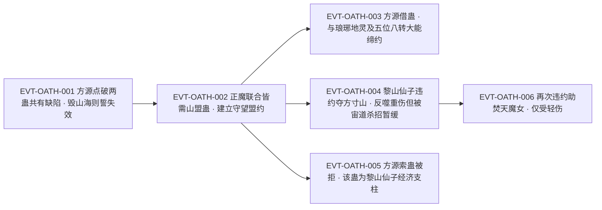

# 山盟蛊

信道盟誓类**仙蛊**，也是全书里最典型的"非战斗资产"：它本身打不出伤害，原文对它下的判语是「山盟蛊，既不是攻伐仙蛊，也不能提供防御，更不能帮助蛊仙转移」`E:V4-139894`——紧接着的半句是「但不论哪个蛊仙得到它，都会具有巨大的优势」`E:V4-139894`。它的价值全在**让别人敢相信别人**：由它建立「不可违背的守望盟约」`E:V4-123360`，而这条盟约「是魔道蛊仙们相互信任的主要基石」`E:V4-123360`。

本页为 2026-09-28 A 线正式 20 页恢复批**新建页**。所有引文回根原文 `source/蛊真人-clean.txt` 逐行复核，行号即 `E:V{段}-{6位行号}`；正文按"原著事实／合理推导／《问真》设计意义"三层组织。本页登记了两处口径并存：**转数原文未明言**（与六转海誓蛊并称）、**违约后果有条款口径与执行口径两说**。

## 主题档案

### 一、身份与道属：信道盟誓类仙蛊；转数原文未明言

#### 原著事实

- **并称与明文**：「海誓蛊是一只六转的仙蛊，在上古时期十分出名，和山盟蛊并称。」「山盟、海誓两蛊的功效，类似毒誓蛊，但毒誓蛊只是消耗品，」「而这两个仙蛊，却是可以重复运用」`E:V2-071240`。
- **道属（信道·盟誓类）**：「信道修行中最多的是盟誓，比如海誓蛊、山盟蛊、诺言蛊、白纸黑字蛊」`E:V6-376870`；同族旁证「仙蛊诺言，亦是信道蛊虫，和山盟蛊、海誓蛊效用类似」`E:V4-130064`。
- **合称**：「毒誓蛊乃是山盟海誓蛊的替代品」`E:V2-074310`。
- **持有者**：「黎山仙子拥有山盟仙蛊，此蛊就是她广受欢迎的关键原因」`E:V4-123356`；「黎山仙子虽然本命仙蛊是山盟蛊」`E:V4-146096`；另一处作「后来因为得到山盟仙蛊，已然将其换成核心仙蛊，成为半道出家的信道蛊仙」`E:V4-148250`；她「早年修行土道。而后主修信道，兼修木道」`E:V4-171386`。
- **稀有度**：「黎山仙子自己拥有的，只有一只山盟蛊」`E:V4-127404`。
- **穷举口径**：全书「山盟蛊」命中 37 行，**37 行均无转数表述**；故山盟蛊的转数 `[原著未明确]`（旁证见下）。（穷举口径，无单行可挂 E-ID：该结论由全书扫描得出，取样窗口见《原著明确内容》；锚点旁证见本主题推导与《状态时间线》ST-OATH-02）

#### 合理推导

- **依据**：`E:V2-071240`（"'海誓蛊是一只六转的仙蛊'…'和山盟蛊并称'"与"这两个仙蛊"）＋全书 37 处无转数明文；**结论**：山盟蛊**明文为仙蛊**（仙蛊即六转及以上），但**具体转数 `[原著未明确]`**；以"与六转海誓蛊并称"作旁证只能推知它在同一层级，属 `[合理推导]`，**不得写成"六转 `[已确认]`"**；**不确定性**：并称句只描述名气与效用类别，没有说两者同转数。
- **依据**：`E:V4-146096`（"本命仙蛊"）与 `E:V4-148250`（"换成核心仙蛊"）；**结论**：两处措辞不同但指向同一事实（山盟蛊是黎山仙子最要紧的那一枚），本页按"同一状态两种措辞"理解，不并成一条规则；**不确定性**：原文未定义"本命仙蛊"与"核心仙蛊"是否严格同义。

#### 《问真》设计意义

- **可采规则（社会性资产）**：一件不参与战斗的资产可以靠"让别人互信"产生收益，其强度应以**交易量与关系网规模**衡量，而不是伤害数值。
- **可采规则（未明转数的仙蛊）**：数据层应保留"已知为仙蛊、转数待定"的占位，而不是看到"并称"就自动填同转数——本页正是要避免这类填充。

### 二、核心机制与明文缺陷：立誓面对一座高山，山毁则誓失效

#### 原著事实

- **立誓条件**（说话人：方源）：「海誓蛊、山盟蛊，都有明显的缺陷。立誓时，人需要面对一片大海或者一座高山。只要将对应的海洋或者高山摧毁，那么誓言就会失效了」`E:V2-071262`。
- **实例兑现**：「雪山盟约是用山盟蛊签订的，要想违反盟约。就得毁掉大雪山」`E:V4-139880`（方源内心）。
- **誓约落在具名的山上**：「当初，黎山仙子和东方长凡盟誓，动用了山盟蛊，誓约正是应在方寸山上」`E:V4-148584`；同源信息在另一处复述为「这个盟约也是利用了山盟蛊，应在方寸山上」`E:V4-148868`。
- **山毁即免责**：「若是方寸山毁灭，誓约无疑就失效了，这样一来自然就没有反噬伤害了」`E:V4-148586`。
- **机制 [已确认] / 具体数值 [待取证]（拆条）**：机制＝以具名高山为誓约载体、载体毁灭则誓言失效，`[已确认]`（`E:V2-071262`、`E:V4-148584`、`E:V4-148586`）；具体数值＝立誓与催动的仙元消耗、誓约生效范围、时限的计量方式，原文均未给，另列 `[待取证]`（见《待核对》）。

#### 合理推导

- **依据**：`E:V2-071262`；**结论**：山盟蛊的"誓言"**不是纯概念约束，而是绑定在物理对象上的**——这既是它的效力来源，也是它的**明文可破解点**；破解代价等于"毁掉一座山"（`E:V4-139880`），因此反制难度与山本身的体量挂钩；**不确定性**：原文未说明"对应的海洋或高山"如何与持有者对应、誓约是否只能绑一座山、能否换绑。
- **依据**：`E:V2-071262` 的措辞是"一片大海或者一座高山"，**没有把两蛊与两种地形一一对应**；**结论**：把"山盟蛊↔高山、海誓蛊↔大海"当作原文规则属**过度推导**，本页只记"任选其一（原文未区分）"；**不确定性**：这一分工很可能存在，但本批未检得明文，故列为《待核对》。

#### 《问真》设计意义

- **可采规则（誓约绑定地标）**：把"契约效力"绑到地图上的具体地标，天然给出两条玩法线——立约者要护山，破约者要毁山；比抽象的可解除状态更有戏。
- **可采规则（明文缺陷＋缺陷可被知情者利用）**：`E:V2-071262` 是角色当着对手的面说出的，说明这条缺陷**在蛊仙圈是常识**；设计上把它做成公开知识，能让"以为签了就安全"成为可被反制的错觉。

### 三、盟约的效力与条款：不可违背的守望盟约，条款可定制

#### 原著事实

- **效力定性**：「由山盟蛊建立起不可违背的守望盟约。是魔道蛊仙们相互信任的主要基石」`E:V4-123360`。
- **必要性**：「东方长凡和各大正道势力商讨建盟，需要山盟蛊。」「魔道蛊仙相互之间更加猜忌怀疑，能建立起大雪山福地这样的庞大组织，就更需要山盟蛊」`E:V4-123358`；正魔联合时「必然需要小姨妈的山盟蛊」`E:V4-125624`。
- **条款一·说真话**：「雪山盟约中就有协议——盟友之间可以保留，但不可欺骗。不想说，你可以不说。但说了的一定得是真话，否则就会应誓而死」`E:V4-125614`。
- **条款二·不得加害**：「雪山盟约中有详细条约：不能恶意加害盟友」`E:V4-125742`。
- **条款三·分配**：「同时战利品，按照方源六成、黑楼兰四成这个样子分配」`E:V4-131352`。
- **条款四·时限**：「和黑楼兰一方的雪山盟约，有时间期限」`E:V4-130674`；「再说，雪山盟约也有时限」`E:V4-148866`；「大雪山盟约可是有时限的」`E:V4-150282`。
- **盟约的实践形态（多例）**：「用山盟蛊，和琅琊地灵达成了协约之后」`E:V4-136378`；「五位八转大能，我们已经先后拜访，并且都用山盟蛊签订了契约，成功邀请到了」`E:V4-136280`；魔道蛊仙「希望利用我的山盟蛊，达成某个暂时的图谋智道传承的联盟」`E:V4-127666`。

#### 合理推导

- **依据**：`E:V4-125614`、`E:V4-125742`、`E:V4-131352`、`E:V4-130674`；**结论**：山盟蛊**只提供强制力，不提供条款内容**——说真话、不得加害、分成比例、时限都是**立约方自己谈的**，蛊只是让谈成的条件无法反悔；**不确定性**：原文未给"一份盟约最多能写几条""违约判定由谁执行"这类元规则。
- **依据**：`E:V4-123358`、`E:V4-123360`；**结论**：它的社会位置是**跨阵营的信任基础设施**——越缺信任的群体（魔道、多势力联合）越依赖它，因此持有者天然成为各方都需要接近的节点；**可能反例**：正道势力亦用它建盟（`E:V4-123358`），故"专属于魔道"不成立。

#### 《问真》设计意义

- **可采规则（条款与强制力分离）**：把"契约模板"交给玩家谈、"强制生效"交给道具，可以复现原著里同一枚蛊服务完全不同的盟约（合作、分赃、停战）；道具本身无需为每种盟约改写。
- **可采规则（信任基础设施）**：持有它可以获得跨阵营的通行与议价能力，这类"社交货币"是战斗数值体系外的第二条成长线。

### 四、违约的代价：条款口径「应誓而死」× 执行口径的反噬伤害

#### 原著事实

- **口径一·条款层（死）**：雪山盟约条款作「否则就会应誓而死」`E:V4-125614`；方源以盟约施压时作「谁要是反悔，可得赔上性命的」`E:V4-130504`。
- **口径二·执行层（可暂缓／可重伤而不死）**：「这宙道杀招的效果，是令黎山仙子万一违反了山盟蛊签订的盟约，那么盟约反噬的伤害将暂缓一段时间之后，才会爆发」`E:V4-148578`；她本人「违约的反噬还是相当恐怖，黎山仙子本身就受了重伤，要抵抗这股反噬，信心十分不足」`E:V4-148580`。
- **违约与后果的实录**：黎山仙子「为了抢夺方寸山，在这个过程中却是违背了这个誓言」`E:V4-148574`，此后「之前她主动对付东方一族，算是违背了当初的契约，但她至今仍旧活得很好」`E:V4-171386`；再犯一次「违约帮助焚天魔女，也只是身受轻伤」`E:V4-173560`。
- **反噬的来源解释**：「黎山仙子的信道虽然半路出家，但为防备无意间或者不得不违背誓言的情况，早年前就请人下过一道宙道仙级杀招」`E:V4-148576`。

#### 合理推导

- **依据**：`E:V4-125614`（口径一）对 `E:V4-148578`、`E:V4-148580`、`E:V4-171386`、`E:V4-173560`（口径二）；**结论**：两说**并存**，且不是同一份盟约的同一句话——口径一是**雪山盟约的具体条款表述**，口径二是**实际违约后的伤害形态**（可被宙道杀招延后、表现为重伤或轻伤）；**不确定性**：原文未给统一规则，无法判定"什么情况下应誓而死、什么情况下只是重伤"，可能的解释（反噬强度取决于誓约所在之山的体量／条款措辞宽严）均无明文。
- **依据**：`E:V4-171386`（"违约方面，也十分擅长"）；**结论**：在原著的实际运行里，**违约是可控的成本而非绝对禁令**；这使"不可违背的守望盟约"（`E:V4-123360`）在措辞上强、在执行上有缝；**可能反例**：黎山仙子是信道准大宗师且提前布了反制，其他立约者的承受力未必相同（`E:V4-173560` 的"玩的很溜"是评价而非规则）。

#### 《问真》设计意义

- **可采规则（违约＝可计算的代价而不是禁止）**：让违约产生"延后爆发、强度可被抵抗"的伤害，玩家就能像原著那样主动选择违约并预先布置反制——这比硬性禁止更能生成策略。
- **可采规则（反制的正当路径）**：宙道杀招"暂缓反噬"（`E:V4-148578`）与"毁灭誓约之山"（`E:V4-148586`）各给出了合法绕过路径，可做成两条互相竞争的解法。

### 五、代价与收益三要素：非战斗仙蛊的价值在人脉与报酬

#### 原著事实

- **定位**：「它只是辅助仙蛊。但蛊仙也绝然不是一味的打打杀杀」`E:V4-139896`。
- **收益一·报酬**：「帮助其他蛊仙签订盟约，这可是一个大买卖，收益方面完全超越胆识蛊的贸易」`E:V4-139888`。
- **收益二·人脉**：「利用山盟蛊帮助他人设定盟约。不仅可以获得丰厚的报酬，而且还能交友广泛」`E:V4-139890`；旁人视角「黎山仙子能在正魔两道，都混的风生水起，很大程度上都是凭借此蛊之能」`E:V4-139892`。
- **它是持有者的经济支柱**：「山盟仙蛊，极其重要，乃是黎山仙子的经济支柱」`E:V4-140230`；「只要一失山盟蛊，黎山仙子的大半优势就荡然无存了」`E:V4-140234`；她「原本她靠着山盟蛊，有许多积蓄，身家富有」`E:V4-148630`。
- **对照件**：以时运仙蛊为核心的仙道杀招「若运作得好，是一个不输给山盟蛊的经济支柱」`E:V4-148670`；江山如故「基本上，可以和黎山仙子的山盟蛊相比了」`E:V4-157068`。
- **使用代价是暴露立场**：方源拿出山盟蛊「彻底解除怀疑」`E:V4-130634`；但借蛊本身「也是冒风险的」`E:V4-136374`。
- **催动实例**：「但方源出乎意料地，拿出了山盟蛊」`E:V4-130570`；黎山仙子「山盟蛊大放异彩，令秦百胜合纵连横，消弭敌意」`E:V4-131340`；方源说动她「利用山盟蛊，勾连左右，硬生生团结了一大批散修」`E:V4-130560`。

#### 合理推导

- **三要素（支付方／受益方／支付时点）**：**支付方＝借用者／委托人**（付报酬，见 `E:V4-136370`）；**受益方＝同时包含委托方与持有者**——委托方获得"可信的盟约"，持有者获得报酬与人脉（`E:V4-139890`）；**支付时点＝每次缔约（按次计费）**，且持有者的收益随**缔约次数**累积，而非随催动次数累积；**不确定性**：原文未给单次收费的定价表，仅有"三块仙元石"一例（`E:V4-136370`）属借用而非缔约。
- **依据**：`E:V4-140230`、`E:V4-140234`；**结论**：山盟蛊是**单点依赖型资产**——持有者的社会优势几乎全部挂在这一枚蛊上，失去即断崖式下跌；**可能反例**：黎山仙子另有信道造诣（`E:V4-171386` 作"信道准大宗师"）与时运仙蛊（`E:V4-148670`），故"大半优势"不等于全部。

#### 《问真》设计意义

- **可采规则（按次计费的社交资产）**：把收益挂在"替别人缔约"的次数上，可以做出不依赖战斗的高价值玩法循环。
- **可采规则（单点依赖的双刃）**：让持有者的社会优势集中在一枚可被夺取的蛊上，天然生成"护蛊"与"夺蛊"的长期目标，也解释了为什么黎山仙子对索要反应激烈（`E:V4-140228`）。

### 六、借用经济与出借风险：三块仙元石的友情价

#### 原著事实

- **借出与价格**：「当然借仙蛊，也不是白借的」`E:V4-136368`；「方源为此支付给黎山仙子三块仙元石」`E:V4-136370`；「三块已经是极优惠的友情价，若是换做旁人，哪怕十块仙元石，黎山仙子也不会随便去借」`E:V4-136372`。
- **借出的风险**：「借仙蛊，也是冒风险的」`E:V4-136374`；随即举出先例——「北原僵盟的首领焚天魔女，借给袁家一只仙蛊。焚天魔女外出东海，袁家一直扣着这只仙蛊，僵盟每年都索要一次，却是有借难还」`E:V4-136376`。
- **借出的用途与回报**：方源借来是为了让「五位八转大能，我们已经先后拜访，并且都用山盟蛊签订了契约」（`E:V4-136280`）与「和琅琊地灵达成了协约」`E:V4-136378`；琅琊地灵「因为签订了山盟，琅琊地灵不仅没有阻挠，而且还主动附赠了方源八个凡道杀招」`E:V4-136438`。
- **出借的余地也被写明**：「这次我出来，还有一个使命，就是要借仙子的山盟蛊一用」`E:V4-135256`；忠诚风险的反面是「当然不能结拜，一结拜，在山盟蛊面前发誓，就是授人以柄」`E:V4-135248`。

#### 合理推导

- **依据**：`E:V4-136370`、`E:V4-136372`、`E:V4-136374`、`E:V4-136376`；**结论**：山盟蛊的借用构成**一整套可复现的经济制度**：明码（三块／十块）＋关系折扣＋出借风险（有借难还的先例）；**不确定性**：三块与十块都是个案报价，原文未给统一市价，也未说明借期。
- **依据**：`E:V4-135248`；**结论**：山盟蛊的**双刃性**在结拜场景里体现得最清楚——它既是信任工具，也是"授人以柄"的手段：谁提议发誓，谁就在索取约束对手的权力；**可能反例**：该句是方源的内心判断，非世界规则。

#### 《问真》设计意义

- **可采规则（可借出＋有借难还）**：让关键道具可以出借并承担归还风险，能凭空长出一整类社交与纠纷玩法（原著的"焚天魔女扣蛊"就是现成剧本）。
- **可采规则（提议发誓＝索取权力）**：把"提议缔约"本身做成有立场含义的动作，比无成本的组队邀请更有戏。

### 七、命名边界：并称的「山盟海誓蛊」与游戏同名 rank=1

#### 原著事实

- **合称明文**：「毒誓蛊乃是山盟海誓蛊的替代品」`E:V2-074310`——"山盟海誓蛊"是两蛊的合称，不是第三只蛊。
- **并称关系**：「海誓蛊是一只六转的仙蛊，在上古时期十分出名，和山盟蛊并称」`E:V2-071240`。
- **「山盟蛊」独立成词**：全书 37 行命中，均为独立指称本蛊（并称句除外），**未检得**该名称被更长词包含的用例。（穷举口径，无单行可挂 E-ID）
- **游戏侧同锚**：`roster-3.md` 的「命名重用异常（传奇蛊名 × 游戏 rank1）」节把 `human_def_1_32_gu`（山盟蛊）列入，记 game 转 1／原文转 `—`、锚点 `E:V2-071240`，备注为"明文为仙蛊（并称六转海誓蛊），具体转数未言；游戏 rank1 重用"。

#### 合理推导

- **依据**：`E:V2-074310`、`E:V2-071240`；**结论**：「山盟海誓蛊」是**两蛊的合称而非本页别名**——该合称覆盖 `山盟蛊`（本页 `human_def_1_32_gu`）与 `海誓蛊` **两个独立实体**，`海誓蛊` 在 `gu/roster-3.md` 中另有自己的 id `human_atk_5_31_gu`（原文转 6、锚点 `E:V2-071240`）。按本轮 L0 口径（`aliases` 只承载同一实体的别名，合称与具体实体必须保持独立身份），合称**不列 `aliases`**，已从 frontmatter 移出，只在本节作为可检索的合称声明；**不确定性**：原文未明确定义该合称是否包含"毒誓蛊"的替代范围。
- **依据**：游戏 rank=1 × 原著仙蛊级；**结论**：按本轮 L0 口径，**原著本尊与《问真》同名实体视为不同实体**，本页只登记"命名重用异常"，不写第二份游戏数值、不做 1:1 合并；**不确定性**：该 id 的产品命名方案由 L0 裁定。
- **判定记录**：`roster-3.md` 中 `human_def_1_32_gu` 条目记"原文转 `—`"，与本页穷举结论（37 处无转数明文）**一致**，本页无需修正该行。

#### 《问真》设计意义

- 合称与别名的区分要在数据层落地：把"山盟海誓蛊"当作可检索的合称，而把"山盟蛊／海誓蛊"保留为两个独立实体，能避免把一对蛊做成一枚蛊。
- "并称"不是"同参数"：同名气、同效用类别的两件道具，仍应各自持有自己的字段。

## 状态时间线

| 状态 ID | 阶段 | 状态 | 证据 |
|---|---|---|---|
| ST-OATH-01 | 身份·道属 | 信道盟誓类蛊虫，与海誓蛊、诺言蛊、白纸黑字蛊同列；黎山仙子的本命／核心仙蛊 | E:V6-376870、E:V4-130064、E:V4-146096、E:V4-148250 |
| ST-OATH-02 | 转数 | 明文为仙蛊；具体转数原文未明言（并称的海誓蛊明写六转，两蛊合称"这两个仙蛊"） | E:V2-071240 |
| ST-OATH-03 | 立誓条件 | 立誓时人需面对一片大海或者一座高山 | E:V2-071262 |
| ST-OATH-04 | 明文缺陷 | 摧毁对应的海洋或高山，誓言即失效 | E:V2-071262 |
| ST-OATH-05 | 盟约效力 | 建立不可违背的守望盟约，是魔道蛊仙相互信任的主要基石 | E:V4-123360 |
| ST-OATH-06 | 条款可定制 | 说真话／不得恶意加害盟友／战利品六四分配／带有时间期限 | E:V4-125614、E:V4-125742、E:V4-131352、E:V4-130674 |
| ST-OATH-07 | 违约后果·条款口径 | 违约者应誓而死；施压表述作"可得赔上性命" | E:V4-125614、E:V4-130504 |
| ST-OATH-08 | 违约后果·执行口径 | 宙道仙级杀招令反噬暂缓；黎山仙子违约两次分别受重伤与轻伤，仍活得很好 | E:V4-148578、E:V4-148580、E:V4-171386、E:V4-173560 |
| ST-OATH-09 | 誓约载体 | 誓约应在具名之山（大雪山／方寸山）；山毁则誓约失效、反噬随之消失 | E:V4-139880、E:V4-148584、E:V4-148868、E:V4-148586 |
| ST-OATH-10 | 定位 | 既非攻伐仙蛊，也不提供防御、不助转移；但得之者有巨大优势 | E:V4-139894、E:V4-139896 |
| ST-OATH-11 | 收益 | 替他人缔约可得丰厚报酬并交友广泛；为黎山仙子的经济支柱 | E:V4-139888、E:V4-139890、E:V4-140230 |
| ST-OATH-12 | 借用制度 | 方源付三块仙元石借用；旁人十块亦不借；借出冒风险（焚天魔女借蛊袁家有借难还） | E:V4-136368、E:V4-136370、E:V4-136372、E:V4-136376 |
| ST-OATH-13 | 命名边界 | "山盟海誓蛊"为两蛊合称；游戏 id `human_def_1_32_gu` 为 rank=1 同名重用 | E:V2-074310、E:V2-071240 |

## 原著明确内容（本批取证窗口登记）

本批对「山盟蛊」在根原文全书扫描命中 37 行；对「山盟」扫描命中 82 行，差集 45 行多为「雪山盟约」等短语中的子串，故本页一律以「山盟蛊」为取证词。37 行中**无一处给出转数**。全书最早出现于 `E:V2-071240`，与 `roster-3.md` 中 `human_def_1_32_gu` 条目登记的锚点一致。下表登记本批实际读取并用于本页的窗口。

| 窗口 | 内容要点 | 用途 |
|---|---|---|
| 71238–71242 | 海誓蛊为六转仙蛊、与山盟蛊并称；两蛊效用类似毒誓蛊但可重复运用 | 主题一、七 |
| 71260–71264 | 方源当面点破两蛊共有的缺陷：立誓须面对大海或高山，摧毁对应山海则誓言失效 | 主题二 |
| 74308–74312 | "山盟海誓蛊"合称：毒誓蛊是其替代品 | 主题七 |
| 123352–123362 | 黎山仙子持有山盟仙蛊是其广受欢迎的原因；正魔建盟都需要山盟蛊；由它建立不可违背的守望盟约 | 主题一、三 |
| 124626–124630 | 太白云生以江山如故自比黎山仙子山盟蛊的经济来源 | 主题五 |
| 125610–125626 | 雪山盟约条款（可保留不可欺骗、说假话应誓而死）；正魔联合必然需要山盟蛊 | 主题三、四 |
| 125740–125744 | 雪山盟约详细条约：不得恶意加害盟友 | 主题三 |
| 127402–127406 | 攻伐杀招面前只有一只山盟蛊无法正面抵御 | 主题一 |
| 127664–127668 | 魔道蛊仙主动请用其山盟蛊结成临时联盟 | 主题三 |
| 130062–130066、130502–130508 | 诺言蛊与两蛊效用类似；方源以盟约施压"可得赔上性命" | 主题一、四 |
| 130558–130574 | 方源说动黎山仙子以山盟蛊团结散修；方源拿出山盟蛊 | 主题三、五 |
| 130632–130636、130672–130676 | 以山盟蛊彻底解除怀疑；雪山盟约带时间期限 | 主题三、五 |
| 131338–131342 | 山盟蛊大放异彩，助秦百胜合纵连横 | 主题五 |
| 131350–131354 | 按大雪山盟约分配战利品（方源六成、黑楼兰四成） | 主题三 |
| 135230–135258 | 秦百胜提议结拜（有山盟蛊在此）；方源判断"一结拜在山盟蛊面前发誓就是授人以柄"；黎山仙子收到借蛊请求 | 主题六 |
| 136278–136282 | 已用山盟蛊与五位八转大能签订契约 | 主题三、六 |
| 136366–136380 | 借仙蛊明码与友情价（三块／旁人十块）；借出的风险（焚天魔女借蛊袁家有借难还）；与琅琊地灵达成协约 | 主题六 |
| 136436–136440 | 因签订山盟，琅琊地灵附赠八个凡道杀招 | 主题六 |
| 139876–139896 | 雪山盟约须毁掉大雪山才能违反；山盟蛊是"大买卖"（报酬＋交友）；既非攻伐也不提供防御；只是辅助仙蛊 | 主题二、五 |
| 140220–140240 | 方源求蛊；黎山仙子震怒；山盟仙蛊是其经济支柱，一失则大半优势荡然无存 | 主题五 |
| 140306–140310 | 仙蛊唯一视角下的大雪山盟约时限与续约两说 | 主题三 |
| 146094–146098 | 黎山仙子本命仙蛊是山盟蛊、为信道蛊仙（另兼修木道） | 主题一 |
| 147620–147624 | 东方长凡提出以山盟蛊担保的契约交易 | 主题三 |
| 148244–148252 | 黎山仙子早年土道、得山盟仙蛊后换成核心仙蛊 | 主题一 |
| 148572–148588 | 黎山仙子违约抢方寸山；早前请下的宙道仙级杀招令反噬暂缓；反噬恐怖致其重伤；誓约应在方寸山，山毁则免责 | 主题二、四 |
| 148628–148634、148668–148672 | 山盟蛊为其积蓄来源（资助黑楼兰后消耗）；时运仙蛊为核心的杀招是不输给山盟蛊的经济支柱 | 主题五 |
| 148864–148870 | 雪山盟约有期限；方源得知东方长凡的盟约亦用山盟蛊、应在方寸山 | 主题三 |
| 150280–150284、156572–156576 | 大雪山盟约有时限的两处复述 | 主题三 |
| 157066–157070 | 江山如故被视为可与山盟蛊相比的经济来源 | 主题五 |
| 157408–157412 | 信道仙级杀招相当于山盟蛊的作用，用于订协议作约束 | 主题三 |
| 171384–171388 | 黎山仙子违约对付东方一族却仍活得很好，擅长违约 | 主题四 |
| 173558–173562 | 违约帮助焚天魔女仅身受轻伤 | 主题四 |
| 182676–182680 | 黎山仙子为大雪山福地三把手，拥山盟蛊、人脉宽广 | 主题五 |
| 376866–376872 | 信道修行中最多的是盟誓：海誓蛊、山盟蛊、诺言蛊、白纸黑字蛊 | 主题一 |

## 事件链

| 事件 ID | 事件 | 参与者 | 证据 | 因果 |
|---|---|---|---|---|
| EVT-OATH-001 | 方源当面点破山盟蛊／海誓蛊共有的缺陷：立誓面对山海，摧毁对应山海则誓言失效 | 方源、仇九 | E:V2-071240、E:V2-071262 | evidences ST-OATH-03、ST-OATH-04 |
| EVT-OATH-002 | 正魔联合在即，各方都需要黎山仙子的山盟蛊；她以此建立不可违背的守望盟约 | 黎山仙子、东方长凡、黑楼兰 | E:V4-123358、E:V4-123360、E:V4-125624 | evidences ST-OATH-05 |
| EVT-OATH-003 | 方源付三块仙元石借得山盟蛊，先后用于与琅琊地灵协约、与五位八转大能签约 | 方源、黎山仙子、琅琊地灵 | E:V4-136370、E:V4-136378、E:V4-136280 | evidences ST-OATH-12 |
| EVT-OATH-004 | 黎山仙子违约为夺方寸山，触发盟约反噬而重伤；早前请下的宙道仙级杀招使反噬暂缓爆发 | 黎山仙子、东方长凡 | E:V4-148574、E:V4-148578、E:V4-148580 | evidences ST-OATH-08 |
| EVT-OATH-005 | 方源索要山盟蛊，黎山仙子震怒拒绝——该蛊是其经济支柱，失之则大半优势荡然无存 | 方源、黎山仙子 | E:V4-140222、E:V4-140228、E:V4-140234 | evidences ST-OATH-11 |
| EVT-OATH-006 | 黎山仙子再次违约帮助焚天魔女，结果仅身受轻伤，被评价为"违约方面也十分擅长" | 黎山仙子、焚天魔女 | E:V4-173560、E:V4-171386 | evidences ST-OATH-08 |

事件口径：本页沿用实体簇号 `EVT-OATH-*`（与分配前缀 `ST-OATH-` 同簇，未与既有 EVT 前缀冲突）。事件节点 6 个，已达"≥3 节点应配图"的阈值，故配 mermaid 主干。

## 资料整理

本页为**新建页**，没有旧版；本批来源只有根原文，没有 `notes:`／`memory:` 层转述进入本页事实区。相关既有派生记录的处置登记如下（**本段内容不得当作原著事实**）：

- `roster-3.md` 中 `human_def_1_32_gu` 条目登记：山盟蛊，game 转 1／原文转 `—`、锚点 `E:V2-071240`，备注大意"山盟、海誓两蛊明文为仙蛊（并称六转海誓蛊），具体转数未言；游戏 rank1 重用"。**本页复核：该行与穷举结论一致**（37 行无转数明文），无需修正；本页只登记、不改该页。
- `roster-3.md` 中 `heaven_atk_1_12_gu`（灾蛊）与 `luck_atk_1_03_gu`（招灾蛊）两条目共用 `E:V3-104130` 的双 id 问题，与本页同批同段，但**与本页无证据交集**；详见 [招灾蛊](luck-atk-1-03-gu.md)，本页不越界处理。
- [信道](../world/information-path.md) 已登记信道为修行法门大类；本页主题一（盟誓类枚举 `E:V6-376870`）可作为该页"信道四类（盟誓／传讯／看听读写／兽语）"的样本；本页不重复其内容。
- `game/data/gu_lore.json`、`game/data/gu.json` 等游戏实现不在本批读取范围；《问真》数值以游戏仓库为唯一真相源，本页不写第二份游戏数据，也不据游戏数据反推 Canon。
- 游戏侧 Canon 索引文件（位于 `game/docs/lore/`）属消费／桥接层；本页不新建、不引用 CAN ID，缺口登记于《待核对》。

## 分析与解读

1. **本页最大增量是"誓约绑在地标上"**。`E:V2-071262` 与 `E:V4-148584`、`E:V4-148586` 合起来给出完整链路：立誓要面对一座山 → 誓约应在具名之山 → 山毁则誓约失效、反噬消失。这让"契约"从抽象状态变成**地图上的可争夺对象**，也解释了方源为何遗憾"难以毁灭大雪山"`E:V4-139880`。
2. **转数是本页必须留白的字段**：37 处提及全是使用与功能，**没有一处写转数**；可确定的只有"它是仙蛊"（`E:V2-071240` 的"这两个仙蛊"）。按本轮纪律，`[原著未明确]` 不写成"六转"，也不因"并称"自动填数。
3. **两处违约口径必须分列**：条款层写"应誓而死"`E:V4-125614`，执行层却是"反噬可被宙道杀招暂缓"`E:V4-148578`、违约者"受了重伤"`E:V4-148580` 甚至"只身受轻伤"`E:V4-173560`。这不是笔误，而是**规则层与个案层的分源**；本页照登不统一。
4. **它的价值与战力无关，与"关系网"有关**：`E:V4-139888`–`E:V4-139892` 把收益写得很直白（报酬＋交友广泛），`E:V4-140230`、`E:V4-140234` 再点明它是黎山仙子的经济支柱。设计上这是**第二条成长轴**的原著依据。
5. **借用制度是完整的**：明码（三块）、关系折扣（旁人十块亦不借，`E:V4-136372`）、出借风险（焚天魔女有借难还，`E:V4-136376`）三者齐备，可直接作为"可借出关键道具"的系统蓝本。
6. **与《问真》的边界**：本页只写原著事实与推导。游戏侧 `human_def_1_32_gu`（rank 1）与原著仙蛊属同名不同实体，按本轮口径只登记"命名重用异常"，不合并、不写第二份数值。

## 待核对

- `[原著未明确]` **转数**：全书 37 处「山盟蛊」均无转数明文；可确定的是它属仙蛊（`E:V2-071240` 作"这两个仙蛊"）。旁证"与六转海誓蛊并称"只属 `[合理推导]`，**不得写作"六转 `[已确认]`"**。
- `[待取证]` **山与海的对应分工**：`E:V2-071262` 只说"人需要面对一片大海或者一座高山"，**未指明哪一蛊对应哪一地形**；"山盟蛊↔山、海誓蛊↔海"是可能的解释但本批未检得明文，登记为待取证。
- `[待取证]` **具体数值**（同条机制 `[已确认]` 见 `E:V2-071262`）：立誓与催动的仙元消耗、誓约作用范围、时限的计量方式（"有时间期限"`E:V4-130674` 但未给尺度）、单次缔约的收费标准（只有"借用"的三块一例 `E:V4-136370`）。
- `[待取证]` **解除与换绑**：除"摧毁对应山海"外是否还有解约方式、誓约能否换绑另一座山，原文未给。
- `[存在冲突]` **违约后果的条款口径与执行口径**：口径 A（条款层）＝"否则就会应誓而死"`E:V4-125614`、施压表述"可得赔上性命"`E:V4-130504`；口径 B（执行层）＝反噬可被宙道仙级杀招暂缓`E:V4-148578`，黎山仙子违约后"受了重伤"`E:V4-148580`、"至今仍旧活得很好"`E:V4-171386`、"也只是身受轻伤"`E:V4-173560`。**当前状态：两说并存**，本页分别登记；可能的解释（反噬强度取决于誓约所在之山的体量、条款宽严，或违约者的抗性）原文均无明文，不代为补设。
- `[原著未明确]` **"本命仙蛊"与"核心仙蛊"是否同义**：`E:V4-146096` 作"本命仙蛊是山盟蛊"，`E:V4-148250` 作"将其换成核心仙蛊"；原文未定义两者关系，本页按同一状态理解并在此登记歧义。
- `[原著未明确]` **变身／转移方向的边界**：`E:V4-139894` 明写它"不能帮助蛊仙转移"，但山盟蛊是否还有未展开的辅助功能，原文未给。
- `[存在冲突]` **游戏口径 × 原著口径（登记为改编／张力）**：`roster-3.md` 的「命名重用异常」节把 `human_def_1_32_gu` 列入，记 game 转 1／原文转 `—`。按本轮 L0 口径，原著本尊与《问真》同名实体**视为不同实体**，本页只登记，不做 1:1 合并，不写第二份游戏数值。
- `[原著未明确]` **CAN 覆盖**：本页无对应 Canon 索引条目（本轮不新建 CAN ID）。若后续需要桥接，缺口登记于此。
- `[存在冲突]` **别名位审计（2026-09-28 L0 口径）**：原 frontmatter `aliases` 为 `山盟蛊`、`山盟仙蛊`、`山盟海誓蛊` 三项。`山盟海誓蛊` 是**两蛊合称**（「毒誓蛊乃是山盟海誓蛊的替代品」`E:V2-074310`），覆盖本页 `human_def_1_32_gu` 与独立实体 `海誓蛊`（「海誓蛊是一只六转的仙蛊，在上古时期十分出名，和山盟蛊并称」`E:V2-071240`；`gu/roster-3.md` 的 `human_atk_5_31_gu` 行），列入 `aliases` 即等于断言二者同一，故已移出；`山盟仙蛊` 经核为**同一实体**（全书 9 行均指本蛊的仙蛊称谓，保留）。`aliases` 现为 `山盟蛊`、`山盟仙蛊`；合称与两个实体的边界见主题七。
- 2026-09-28：本页原按 roster-3 行号引用，因 L0 落地使该文件行号位移，已改为按 id 引用（id 为稳定键，行号不再作为定位依据）。

## 模板扩展建议（只登记，不改核心模板）

1. **需要"社会性资产"的字段位**。山盟蛊的全部价值（报酬、人脉、议价）都不属于现有"形态／催动／消耗"三件套；建议实体页允许一类"非战斗价值"独立成节，否则只能像本页这样塞进一个主题。
2. **需要"条款与强制力分离"的表达**。同一枚蛊签过多份内容完全不同的盟约（说真话／不得加害／分成／时限），条款属于**使用场景**而非蛊本体；现模板没有地方安放"可承载的条款类型"。
3. **需要"地标绑定"字段**。誓约应在具名之山（`E:V4-148584`）这一事实同时关系蛊、地图、事件三方，单页无处索引。

## 关联页面

[信道](../world/information-path.md)、[运道](../world/luck-path.md)、[流派总表](../world/path-roster.md)、[蛊的饲养与炼化](../world/gu-care-and-refinement.md)、[炼蛊与杀招链](../world/gu-refine-killer-chain.md)、[杀招与组合](../rules/killer-moves.md)、[招灾蛊](luck-atk-1-03-gu.md)、[宿命蛊](fate-gu.md)、[坚持仙蛊](persistence-gu.md)、[蛊虫关系](gu-relations.md)、[蛊虫总表](roster.md)、[蛊虫总表三期](roster-3.md)、[方源](../characters/fang-yuan.md)。
