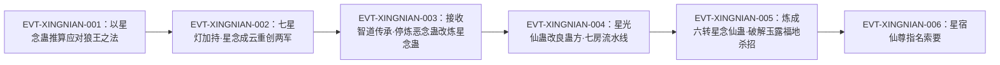

# 星念蛊

东方长凡智道传承的**基石蛊**：由一位星道蛊仙揣摩智道而成，机制上「由星入智」——上游材料是星道的星光蛊，输出却是可用来推算推演的**念头**。它分凡蛊（五转）与仙蛊（六转）两级，凡蛊是烧库存的一次性消耗品，仙蛊一颗青提仙元即产出至少十万星念，把这条流派从“精打细算”变成“敞着用”；同一实体在段三与段六分别扮演消耗品与尊者指名战略件两种角色。

本页为 2026-09-28 第二批 A 线恢复批**新建页**，实体 id 复用 `roster-3.md` 的 `light_rec_5_12_gu`。全书出现「星念蛊」的行有 51 行／字面命中 57 次；以词根「星念」检索则为 227 行／262 次——除这 51 行蛊名行外，`星念仙蛊` 称谓占 77 行、`星念凡蛊` 称谓占 5 行（两者交集 2 行），其余 96 行才是单独成词的产物义星念；本页按蛊名、仙／凡蛊称谓、产物义三层分开计数。所有引文回根原文 `source/蛊真人-clean.txt`，行号即 `E:V{段}-{6位行号}`；正文按“原著事实 → 合理推导 →《问真》设计意义”三层组织。

**登记锚性质（必读）**：分片表标注“登记锚 E:V3-093044 为章节题名”，经回原文打印**已证伪**——`E:V3-093044` 是**含转数旁证明文的正文行**（「他心神投入到自己空窍当中，调动五转真元，灌注到星念蛊中。」）；真正的题名行是 `E:V3-092960`（「第一百节：星念蛊」），两者相差 84 行。本页的转数与机制证据全部取自正文行。

## 主题档案

### 一、由星入智：来源落在星道，道属落在智道

#### 原著事实

- 传承来源与基石定位：留下这道传承的是「古代中洲天庭的一位八转星道蛊仙」`E:V4-147756`；他「本是星道蛊仙，但揣摩的却是智道。因而这道智道传承，基石就是星念蛊，由星入智。」`E:V4-147758`——同句还给出炼制主材：「甚至就连星念蛊的炼制，都是以星光蛊为主材。」`E:V4-147758`
- 炼制必须蛊材：「因为星光蛊是炼制智道星念蛊的必须蛊材啊。」`E:V4-154718`
- 道属明文（同族归类）：「战念蛊，和星念蛊、空念蛊一样，亦是智道蛊虫之一。」`E:V3-094598`——这一句把星念蛊与战念蛊、空念蛊一并划入智道。
- 念蛊族的通用描述：「蛊师们根据这些念头，创造出无数的相关蛊虫，诸如东方余亮曾经使用过的星念蛊，方源如今正用的空念蛊，以及蛊仙们常用的神念蛊。」`E:V3-104876`
- 穷举计数口径（本条为全书穷举所得的计数结论，无单行可挂 E-ID；下列 E-ID 即本结论的枚举集合）：全书「星念」227 行／262 次，其中 `星念蛊` 51 行／57 次，逐行枚举为 `E:V3-092960`、`E:V3-093044`、`E:V3-093050`、`E:V3-094476`、`E:V3-094598`、`E:V3-104876`、`E:V4-147758`、`E:V4-147820`、`E:V4-147902`、`E:V4-148538`、`E:V4-148552`、`E:V4-148554`、`E:V4-148974`、`E:V4-148976`、`E:V4-149028`、`E:V4-149044`、`E:V4-149046`、`E:V4-149048`、`E:V4-149050`、`E:V4-149052`、`E:V4-149054`、`E:V4-149382`、`E:V4-150254`、`E:V4-151960`、`E:V4-151976`、`E:V4-153732`、`E:V4-153738`、`E:V4-154718`、`E:V4-154720`、`E:V4-154724`、`E:V4-154728`、`E:V4-154732`、`E:V4-154736`、`E:V4-156470`、`E:V4-156472`、`E:V4-156476`、`E:V4-156480`、`E:V4-156486`、`E:V4-156488`、`E:V4-156494`、`E:V4-156528`、`E:V4-166586`、`E:V4-166588`、`E:V4-178184`、`E:V4-178194`、`E:V4-179370`、`E:V4-182524`、`E:V6-426120`、`E:V6-426306`、`E:V6-427510`、`E:V6-427532`（共 51 行）；其余 176 行＝`星念仙蛊` 称谓 77 行＋`星念凡蛊` 称谓 5 行（两者交集 2 行）＋单独成词的产物义星念 96 行，产物义落点如 `E:V3-093054`、`E:V3-093076`。

#### 合理推导

- **依据：**`E:V4-147758`（由星入智＋星光蛊为主材）＋`E:V3-094598`（与战念蛊、空念蛊并列为智道）；**结论：**本实体的道属是**同族家族断言**给出的（三者并列），星道成分则来自**炼制来源**，两条在原文里同时成立、并不互斥；**不确定性：**原文未写星念蛊自身携带何种道痕，也未说明“由星道材料炼成”是否会影响道属判定。
- **依据：**`E:V4-147758` 与 `E:V4-154718` 两处都把星光蛊写成主材／必须蛊材；**结论：**星光蛊是本实体的**上游材料实体**，两者是两种不同的蛊（本页因此不把星光蛊写入 `aliases`）；**不确定性：**原文未给配方比例，也未写星光蛊自身的道属与转数。

#### 《问真》设计意义

- 「由星入智」是一条现成的**跨道炼材规则**：材料锁在星道、产物效果锁在智道，玩家要为一条智道线去经营星道资源。这比“同系材料炼同系蛊”的单轴配方多出一个轴，而这个轴由原文自己给出。

### 二、凡蛊机制：灌注五转真元，把念头凝成可离体的星念

#### 原著事实

- 锚点行（转数旁证＋动作）：「他心神投入到自己空窍当中，调动五转真元，灌注到星念蛊中。」`E:V3-093044`
- 凝结动作：「这个问题在他脑海中刚刚产生，就在星念蛊的作用下，凝结成一个念头。」`E:V3-093050`
- 产物形态（可见＋可离体）：「但这个念头，散发着湛蓝星光，不仅可以用肉眼瞧见，而且还能脱离脑海，探出头颅，直接飞到东方余亮的头顶上去。」`E:V3-093054`
- 规模生成：「瞬间，数以千百计的星念同时产生，然后涌出脑海，飞到东方余亮的头顶上空去。」`E:V3-093068`
- 单体形态（尺寸分档）：「一颗颗星念，有大有小，大的不超过大脚趾，小的也不小于小拇指。」`E:V3-093076`
- 真元代价：「东方余亮的脸色却是骤然一白，空窍中的真元海面也跟着下降一大截。」`E:V3-093072`
- 推算收敛：「足足持续了两个时辰之后，原本成百上千的星念，只剩下八颗。」`E:V3-093088`；「但这八颗星念，每一颗都有拳头大小，星光烁烁，包含着复杂的念头。」`E:V3-093090`
- 催动者身份（载体）：本章使用者为东方余亮，见 `E:V3-093044` 的叙述视角与 `E:V3-094476`。

#### 合理推导

- **依据：**`E:V3-093050`＋`E:V3-093054`；**结论：**「星念」是**蛊的产物而非蛊本身**——蛊把无形的思考转成有形、可离体、可再飞回识海的实体念头，计量单位是「念头」而不是“次”；**不确定性：**原文未写单颗星念能离主人多远、离体后是否有时效，也未写被他人击溃的后果。
- **依据：**`E:V3-093076` 的尺寸分档＋`E:V3-093088`＋`E:V3-093090`；**结论：**碰撞／融合／分化是推算的运算过程，收敛形态是“总量变少、单体变大、包含复杂念头”；**不确定性：**原文未给“合并几次出答案”的规则，`E:V3-093090` 的「拳头大小」只是本章一次的形态描述，不能当固定档位。
- **代价／收益三方**：**依据：** `E:V3-093072`；**支付方**＝使用者本人；**受益方**＝使用者本人（换来推算结果）；**支付时点**＝催动即扣，「空窍中的真元海面也跟着下降一大截」是叙述性描述、非数值，故单颗星念的真元单价 `[待取证]`；**结论：** 本实体的代价是自付型的真元消耗，支付方与受益方同为使用者；**不确定性：** 原文未给单颗星念的真元单价，本批尚未找到。

#### 《问真》设计意义

- 把「思考」做成可消耗的实体，是这个蛊最值得搬的一层：推演从免费动作变成要付真元、要烧库存的资源开销，产物自体可被拦截、可被反向利用（主题六）。这给“智道＝辅助位”的刻板印象补上了成本视角。

### 三、两级形态：五转凡蛊（一次性消耗）与六转星念仙蛊

#### 原著事实

- 凡蛊是一次性消耗：「星念蛊是一次性的消耗蛊，伴随着一只只星念蛊的损耗，方源的脑海中念头此起彼伏，源源不断地产生。」`E:V4-148976`
- 凡蛊的存量与消耗节奏：狐仙福地的一座石巢「长年累月的都在炼制星念凡蛊。」`E:V4-164312`；黎山仙子交付的清单含「以及普通的星念凡蛊。」`E:V4-148548`；「待看到星念蛊居然如此之多，多达五万只时，心中的喜悦再也遮掩不住，从眼中流露出来。」`E:V4-148552`；一次推算之后「仙窍中的星念蛊，还剩下近四万只。」`E:V4-149046`、「星念蛊原有五万多只，也就是说，这一次思考推算，只耗费了一万多只星念蛊。」`E:V4-149048`
- 仙蛊转数（正文三处）：「只有一种情况，才能得到稳固的结果，那就是六转星念仙蛊。」`E:V4-173518`；追述「六转星念蛊，八转慧剑蛊，还有九转智慧蛊」`E:V4-182524`；六转仙蛊名录亦列「星念」`E:V5-273794`
- 仙蛊产出：「按照传承中的记载：一颗青提仙元消耗下去，经过星念仙蛊的作用，至少有十万星念产出。」`E:V4-149438`
- 产出受道痕增幅：「当然，方源要是催用星念仙蛊，得到的星念数目一定会少于十万。」`E:V4-149440`；原因「因为，历代的智道蛊仙继承者们，身上都有智道道痕，增幅着星念仙蛊的效果呢。」`E:V4-149442`
- 仙蛊方在传承之内：「这份智道传承中，包含了仙蛊方十多张，其中就有星念仙蛊的蛊方」`E:V4-149434`
- 实战催动与结果：「这一次，他催动星念仙蛊，耗费多日，帮助鲨魔破解了冰雨冻土杀招。」`E:V4-180000`；「有着星念仙蛊，他早已经不缺星念了。」`E:V4-180698`

#### 合理推导

- **依据：**`E:V4-173518`＋`E:V4-182524`＋`E:V5-273794`；**结论：**本实体在原著里确有**两级形态**——凡蛊与仙蛊，`roster-3.md` 的 `原文转＝5` 对应的是**凡蛊**那一级；仙蛊侧有三处明文六转；**不确定性：**原文没有一句写“五转星念蛊”，五转是由 `E:V3-093044`「调动五转真元，灌注到星念蛊中」推得的**强旁证**而非明文。
- **依据：**`E:V4-149438`＋`E:V4-149440`＋`E:V4-149442`；**结论：**仙蛊产出是“基数＋道痕增幅”的乘法结构，方源缺智道道痕所以拿不到十万；**不确定性：**原文只给「至少有十万星念产出」的下限与「少于十万」的方向，未给方源的实际值，也未给十万与道痕条数的换算公式。
- **代价／收益三方（凡蛊侧）**：**依据：** `E:V4-148976`、`E:V4-149048`；**支付方**＝使用者（每只星念蛊本身即不可回收的消耗品，真元另计）；**受益方**＝使用者（换来念头与推算结果）；**支付时点**＝催动即消耗，且消耗可被计数（一次推演烧掉一万多只）；**结论：** 凡蛊侧的代价＝不可回收的消耗品＋真元，支付方与受益方同为使用者；**不确定性：** 原文未给凡蛊的单位真元消耗，本批尚未找到。
- **代价／收益三方（仙蛊侧）**：**依据：** `E:V4-149438`；**支付方**＝催动者（每次扣一颗青提仙元）；**受益方**＝催动者；**支付时点**＝每次催动结算，产出至少十万星念。附带一条方向性结论：**相对凡蛊，仙蛊的单位成本更优**——依据 `E:V4-149436`「一旦有了星念仙蛊，方源就无需大废功夫。」；**不确定性：**原文未给两者的成本比。

#### 《问真》设计意义

- “同一实体、两个品阶、两种结算方式”是可以直接落地的分档结构：凡蛊按只烧，仙蛊按仙元结算且带高阶加成。设计上要保证两级之间的跨度足够大（从“烧库存”到「不缺」），否则仙蛊会被玩家当成“更大的凡蛊”而不是换了一层玩法。

### 四、推算效率：一个星念约抵三四个恶念／忆念，但只在推算位强

#### 原著事实

- 耐用性判词：「星念耐用极了，初步估算的话，一个星念能抵三四个的恶念、忆念。」`E:V4-148992`
- 分工对照：「星念不擅长算计别人，也不精通在记忆里挖掘内容，但用来推算，却分外好使！」`E:V4-149000`
- 硬币的另一面：「用星念来算计他人，思考阴谋，还是恶念效果好。在回忆方面，星念蛊也不如忆念蛊耐用了。」`E:V4-149052`
- 规模化语境：「一个星念能抵其他念头三四个，这个比例似乎还有点不起眼。」`E:V4-149002`；同章随后说明基数放大后的差距 `E:V4-149004`

#### 合理推导

- **依据：**`E:V4-148992`＋`E:V4-149000`＋`E:V4-149052`；**结论：**星念是**专精型念头**（只强在推算），而不是恶念／忆念的全能替代；它的优势与劣势都是原文点名写出的；**不确定性：**原文未给恶念／忆念的绝对效率值，也没有三方横向表，因此「三四个」是同章给出的一次初步估算，不能当精确系数。
- **依据：**`E:V4-149002`＋`E:V4-149004`；**结论：**作者自己提示这个倍率的**意义在基数放大之后**——它是为大规模推演而设计的；**不确定性：**原文未给“起眼／不起眼”的阈值，也未给替代比例随境界变化的关系。

#### 《问真》设计意义

- “专精而非全能”是可直接做成构筑轴的机制：星念在推算位优于恶念／忆念，在算计与回忆位反而更差。把念头做成可换装资源后，这条对位差异就能直接变成配装取舍，不需要新造参数。

### 五、生产制度：星光蛊为主材的石巢流水线，与改良后的风险下降

#### 原著事实

- 七房流水线：「一共经过七个房间之后，一只只的星念蛊终于炼成。」`E:V4-156470`
- 改良后的人力损失：「现在的星念蛊方。已经被他改良过了，炼蛊时毛民的损失比之前大为减少。」`E:V4-156486`；「改良后的星念蛊蛊方，也较为安全。」`E:V4-156480`
- 与气囊蛊的风险对照：「炼制气囊蛊的风险，比炼制星念蛊还要高出很多。」`E:V4-156528`
- 方源对外的说法：「而星念蛊炼制起来，却是比较温和的，毛民损失较少。」`E:V4-150254`
- 上限与瓶颈：「但是改良已经到了极限，除非我今后星道境界提升，或者遇到更好的星念蛊蛊方。」`E:V4-156488`；「若是毛民充足的话，星念蛊的产量还能再提升一倍有余！」`E:V4-156494`
- 自上而下的炼法：「同时以仙蛊为基点，炼制凡蛊星念蛊，就是从上而下，失败概率比之前的炼蛊方法要小很多。」`E:V4-154724`
- 上游成本随之下降：「用了星光仙蛊之后，星光就很巨量，方源已经不需要再像之前那样，先收购星光蛊，再以星光蛊为主材，炼出星念蛊。」`E:V4-156476`

#### 合理推导

- **依据：**`E:V4-156486`＋`E:V4-156480`＋`E:V4-156528`＋`E:V4-150254`；**结论：**星念蛊在原文并列的几种蛊方里属于**低风险炼方**（毛民损失较少），代价是把产能天花板压在毛民数量与炼蛊者星道境界上；**不确定性：**原文只给「大为减少」「毛民损失较少」这样的比较级，未给伤亡率或产量数值。
- **代价／收益三方（血账）**：**依据：** `E:V4-156480`（「很多毛民因为炼蛊而受伤，甚至丧失生命。」）；**支付方**＝被驱使炼蛊的**毛民**（人身代价）＋出资采购原料的蛊仙（资源代价）；**受益方**＝蛊仙（获得星念蛊存量与推算能力）；**支付时点**＝炼蛊过程中即时发生；改良蛊方后损失下降但**未归零**；**结论：** 血账的代价落在毛民（人身）与蛊仙（资源）两侧，支付方并非单一主体；**不确定性：** 原文未给伤亡率或产量数值，本批尚未找到。
- **依据：**`E:V4-154724`＋`E:V4-154718`；**结论：**上游从「收购星光蛊」升级成“持有星光仙蛊”后，炼法由下而上改为自上而下，失败率与危险性一起下降；**不确定性：**原文只说“失败概率要小很多”「成本也略微降低了一些」`E:V4-156476`，未给比例。

#### 《问真》设计意义

- 这条产线把“上游资源层级”直接映射成下游良率：同一张凡蛊方，材料来源由野生蛊换成仙蛊，失败率与危险性同时下降。做生产系统时，它比“科技树解锁”更贴原文，也让“上游那一步”本身具备可感知的收益。

### 六、战力转化与反噬：万星飞萤、星雾掩，以及「星念代替思考」

#### 原著事实

- 万星飞萤的根基：「原来这招根基，仍旧在于星念蛊。每一只星光飞萤，都是包裹着一颗星念。」`E:V4-149382`
- 战场化：「道痕镶嵌空中，形成特殊战场，还很难被破坏。蛊仙进入其中，一思一绪，都会变成星念，从而形成万星飞萤。」`E:V4-149410`
- 反噬（被夺舍思考）：「星念代替思考，蛊仙会暂时成为东方余亮的傀儡，受其操控！」`E:V4-144918`
- 直攻脑海：「星念速度惊人，直接攻击敌人的脑海，另辟蹊径，难以防范。」`E:V3-094498`
- 星雾掩：「另一方面，星念仙蛊也是仙道杀招星雾掩的两大核心之一。」`E:V4-164314`；改良后仍为核心之一，「星念仙蛊仍在其中，还有一只则被方源替换为解谜仙蛊。」`E:V4-180916`
- 另一条杀招链：「此招名为星魂战场，以净魂、星痕、星芽、星光、星念为核心。」`E:V4-180362`
- 招牌战例的规模：「这是东方余亮的招牌杀招，七盏灯火功效各异，在它们的加持下，东方余亮催动星念蛊。」`E:V3-094476`；「海量的星念升腾上空，短短几个呼吸，东方余亮至少产生了数万的星念。」`E:V3-094482`

#### 合理推导

- **依据：**`E:V4-149410`＋`E:V4-144918`；**结论：**万星飞萤把“敌人的思考”也变成星念，因此对敌方构成**负反馈**——越想反制越被喂养；**不确定性：**原文用“轻则……重则……更甚者……”分级描述侵蚀后果，未给成功判定的条件或概率。
- **代价／收益三方**：**依据：** `E:V3-094482` 与 `E:V3-094500`；**支付方**＝使用者本人（真元与寿命）；**受益方**＝使用者（换来数万星念的战场压制力）；**支付时点／生效条件**＝常规催动只记真元；折寿出现在「这样毫无节制地制造星念」的超量输出场景（`E:V3-094500` 记「东方余亮至少要损失两年的寿命。」），因此寿命不是每次催动的固定开销；**结论：** 代价的主体是使用者本人，常规催动只计真元，折寿只在超量输出场景触发；**不确定性：** 原文未给折寿的触发阈值与单次折寿量，本批尚未找到。
- **依据：**`E:V4-164314`＋`E:V4-180362`＋`E:V4-180916`；**结论：**本实体是**多个杀招的共享核心件**，价值应按“解锁多少条杀招”而非单只蛊的伤害来结算；**不确定性：**原文未给各杀招对本实体的依赖是必备还是可替代，`E:V4-180916` 只说明星雾掩改良后另一核心**可被替换**，本实体那一格未动。

#### 《问真》设计意义

- “敌人的思考也是燃料”是这一族最锋利的设计点：战斗节奏与对手的决策频率挂钩。落成运行时机制时要注意它天然偏向长线消耗战，**必须**配总量或时长上限，否则战局会一边倒。

### 七、星宿仙尊指名索要：它同时是智道与星道尊者的关键件

#### 原著事实

- 索要本身：「星宿仙尊答道：“我需要星念蛊、星眸蛊，以及恒蛊。”」`E:V6-426120`
- 交付：「还是挑选了星念蛊优先送给星宿仙尊。」`E:V6-426306`
- 用途：「在改良的计划中，星眸蛊、星念蛊、恒蛊都要发挥关键作用。」`E:V6-427532`
- 该段另有清单式点名：「“星眸蛊、星念蛊、恒蛊……”」`E:V6-427510`

#### 合理推导

- **依据：**`E:V6-426120`＋`E:V6-427532`；**结论：**到段六，本实体已从段三的“凡蛊消耗品”升格为**尊者级指名战略件**，其价值判定不再依赖单场战斗，而依赖持有者的智道／星道体系；**不确定性：**原文未写星宿仙尊要用它具体做什么杀招，也未写这一段里的「星念蛊」是凡蛊形态还是仙蛊形态（`E:V6-426120` 只写「星念蛊」）。

#### 《问真》设计意义

- 同一实体在叙事两端承担了完全不同的角色：一端是烧库存的消耗品，一端是尊者战略件。做数值分层时，这提示“同实体两品阶”的跨度应当足够大，而不是仙蛊只做凡蛊的小幅倍增。

## 状态时间线

| 状态 ID | 阶段 | 状态 | 证据 |
|---|---|---|---|
| ST-XINGNIAN-01 | 体系定线 | 智道念蛊系：与战念蛊、空念蛊并列的智道蛊虫；智道传承基石，由星入智，以星光蛊为主材 | E:V3-094598、E:V4-147756、E:V4-147758、E:V4-154718 |
| ST-XINGNIAN-02 | 机制在案 | 灌注五转真元把念头凝成肉眼可见、可离体的星念；碰撞／融合／分化用于推算；催动即扣真元 | E:V3-093044、E:V3-093050、E:V3-093054、E:V3-093072 |
| ST-XINGNIAN-03 | 战场使用 | 东方余亮以七星灯加持大规模催动，星念成云直攻敌人脑海并席卷战场 | E:V3-094476、E:V3-094482、E:V3-094498 |
| ST-XINGNIAN-04 | 代价上限 | 常规催动只记真元；「毫无节制地制造星念」时使用者至少折损两年寿命 | E:V3-093072、E:V3-094500 |
| ST-XINGNIAN-05 | 效率判词 | 用来推算约抵三四个恶念／忆念；用来算计与回忆反不如二者 | E:V4-148992、E:V4-149000、E:V4-149052 |
| ST-XINGNIAN-06 | 传承接收 | 方源取得东方长凡智道传承，停炼恶念蛊改炼星念蛊，后获五万只存量 | E:V4-147758、E:V4-147820、E:V4-148552 |
| ST-XINGNIAN-07 | 生产改良 | 以星光仙蛊自上而下炼制凡蛊星念蛊，七房流水线，毛民损失下降而产量不降 | E:V4-154724、E:V4-156470、E:V4-156486 |
| ST-XINGNIAN-08 | 仙蛊量产 | 六转星念仙蛊炼成，一颗青提仙元至少产出十万星念，从此不缺星念 | E:V4-173518、E:V4-149438、E:V4-180698 |
| ST-XINGNIAN-09 | 尊者指名 | 星宿仙尊索要星念蛊、星眸蛊、恒蛊，用于改良其智道／星道战斗体系 | E:V6-426120、E:V6-426306、E:V6-427532 |

## 原著明确内容（本批取证窗口登记）

本批对「星念蛊」在根原文全书扫描：命中 51 行／57 次；另以词根「星念」扫描得 227 行／262 次。下表登记本批实际读取的区间窗口；`星念蛊` 的 51 行命中已在《主题档案·一》逐行枚举，本页正文另对其中机制行与制度行逐字引用。

| 窗口 | 内容要点 | 用途 |
|---|---|---|
| 92950–93110 | 「第一百节：星念蛊」题名行（92960）；东方余亮以星念蛊推算对付狼王常山阴之法（锚点 93044）；星念可见／可离体；真元代价；两时辰收敛为八颗 | 主题一、二 |
| 94280–94640 | 星念之云战场；七星灯加持；数万星念；直攻脑海；寿命代价；战念蛊与空念蛊同族对照；被战念遏制 | 主题一、三、六 |
| 104860–104880 | 念／意／情与智道；星念蛊、空念蛊、神念蛊并列 | 主题一 |
| 144900–145060 | 万星飞萤：星光内裹星念；侵蚀脑海致蛊仙成傀儡 | 主题六 |
| 147750–147830 | 东方长凡智道传承与八转星道蛊仙；基石＝星念蛊、由星入智、星光蛊为主材；方源下令改炼 | 主题一、五 |
| 148530–148560 | 黎山仙子交付“大量的星念蛊”与「普通的星念凡蛊」；五万只存量 | 主题三 |
| 148960–149010 | 一次性消耗蛊；一个星念抵三四个恶念／忆念；专精于推算 | 主题三、四 |
| 149370–149480 | 万星飞萤根基＝星念蛊；星念仙蛊蛊方；一颗青提仙元至少十万星念；道痕增幅；星雾掩 | 主题三、六 |
| 154700–154740 | 星光仙蛊＝炼制星念蛊的必须蛊材；自上而下炼法；失败率与危险性双降 | 主题五 |
| 156450–156530 | 七房流水线；改良蛊方；毛民损失减少；产量再提一倍的瓶颈 | 主题五 |
| 163480–164340 | 星念仙蛊为星雾掩两大核心之一；炼制困难（资金／仙材／道痕／成功率） | 主题三、六 |
| 173490–173530 | 「六转星念仙蛊」明文；炼制末段靠运气 | 主题三 |
| 179995–180025 | 星念仙蛊炼成并实战催动破冰雨冻土；从此不缺星念 | 主题三、六 |
| 182515–182530 | 「六转星念蛊」追述明文 | 主题三 |
| 199800–199815、273788–273800、310000–310010 | 六转仙蛊名录（含星念） | 主题三 |
| 426100–426140、426300–426315、427505–427540 | 星宿仙尊索要星念蛊、星眸蛊、恒蛊并用于改良体系 | 主题七 |

## 事件链

| 事件 ID | 事件 | 参与者 | 证据 | 因果 |
|---|---|---|---|---|
| EVT-XINGNIAN-001 | 东方余亮以星念蛊推算应对狼王常山阴之法（两个时辰收敛为八颗星念） | 东方余亮 | E:V3-093044、E:V3-093068、E:V3-093088 | evidences ST-XINGNIAN-02 |
| EVT-XINGNIAN-002 | 东方余亮以七星灯加持大规模催动星念蛊，重创黑旗军与葛家部族，最终被战念蛊遏制 | 东方余亮、黑楼兰、黑旗军众首领 | E:V3-094476、E:V3-094482、E:V3-094598、E:V3-094610 | evidences ST-XINGNIAN-03 |
| EVT-XINGNIAN-003 | 方源接收东方长凡智道传承，停炼恶念蛊改炼星念蛊，后经黎山仙子取得五万只 | 方源、地灵小狐仙、黎山仙子 | E:V4-147758、E:V4-147820、E:V4-148552 | evidences ST-XINGNIAN-06 |
| EVT-XINGNIAN-004 | 方源以星光仙蛊改良蛊方、经七房流水线炼星念蛊，毛民损失下降而产量不降 | 方源、毛民 | E:V4-154724、E:V4-156470、E:V4-156486 | evidences ST-XINGNIAN-07 |
| EVT-XINGNIAN-005 | 方源屡炼星念仙蛊失败后炼成，催动它以破解玉露福地多道杀招 | 方源、鲨魔、焚天魔女 | E:V4-173518、E:V4-180000、E:V4-180698 | evidences ST-XINGNIAN-08 |
| EVT-XINGNIAN-006 | 星宿仙尊主动索要星念蛊等三只仙蛊，用于改良其智道／星道体系 | 星宿仙尊、方源 | E:V6-426120、E:V6-426306、E:V6-427532 | evidences ST-XINGNIAN-09 |

事件口径：本页沿用实体簇号 `EVT-XINGNIAN-*`。事件节点 6 个，已达“≥3 节点配 mermaid”的阈值，故上图按因果链绘制。六个节点跨度从段三第 100 章区段到段六末段；事件表只摘取可定事件边界的 6 处，其余命中行进入《主题档案·一》的逐行枚举与《资料整理》的穷举口径。

## 资料整理

本页为**新建页**，没有旧版；本批来源只有根原文，没有 `notes:`／`memory:` 层转述进入本页事实区。相关派生记录的处置登记如下（本段内容不得当作原著事实）：

- `roster-3.md` 的 `一致` 节 `light_rec_5_12_gu` 条目登记：`light_rec_5_12_gu | 星念蛊 | 5 | 5 | E:V3-093044`，状态为**一致**。本页复核：`E:V3-093044` 是**正文行**（非题名行），其「调动五转真元，灌注到星念蛊中」支持凡蛊五转的判定；仙蛊侧另有六转明文三处。两说并列登记于《待核对》。
- `game/data/gu_lore.json` 的 `light_rec_5_12_gu` 为 `game_rank=5`、`status=match`、`lore_rank=5`、`anchor=E:V3-093044`——投影与原文凡蛊侧一致。`game/**` 只读，不在本批改动范围。
- **别名口径**：本页 `aliases` 收 `星念仙蛊`、`星念凡蛊`，二者都是**同一实体的同级称谓**（前者见 `E:V4-149432`、`E:V4-164314`，后者见 `E:V4-148548`、`E:V4-164312`）。同族的**战念蛊**（`E:V3-094598`）、**空念蛊**（`E:V3-094598`、`E:V3-104876`）、**神念蛊**（`E:V3-104876`）、**恶念蛊／忆念蛊**（`E:V4-149000`、`E:V4-149052`）都是**别的实体**，一律不进 `aliases`，只在正文《身份边界》与本节说明。**身份边界（近名分流）**：`game/data/gu.json`、`game/data/gu_names.json` 另有 id `wisdom_rec_5_16_gu` 名 `智星念蛊`；原文 `智星念蛊` 命中 0 行，`roster-3.md` 亦无该条目。它与本实体是两个不同实体，不进 `aliases`，也不构成实际子串碰撞（原文 0 命中）。
- **上游材料口径**：**星光蛊**是本实体的炼制必须蛊材（`E:V4-154718`），属**另一种实体**，不进 `aliases`。
- **id 归类张力（派生层）**：本实体 id 为 `light_rec_5_12_gu`（光系·恢复），但原文明文把星念蛊与战念蛊、空念蛊并列为**智道蛊虫**（`E:V3-094598`）。本轮不改 id（id 由 roster-3 核定，禁另造），只按“改编／张力”登记于《待核对》。
- **穷举口径**：本页的 `51 行／57 次` 与 `227 行／262 次` 均为**含重复块、未去重**的字面命中计数（纯字符串计数，非分词）；`51 行` 是出现该词的**行数**，`57 次` 是**总出现次数**，两者不等是因为有 6 行同句内出现两次以上。
- **登记锚复核**：分片表把登记锚标为“章节题名”，经回原文打印，`E:V3-093044` 是含转数旁证明文的正文行；题名行是 `E:V3-092960`。该标注**已证伪**，本页不采用。

## 分析与解读

1. **本页最重要的结构是“一实体两品阶”**：凡蛊五转是烧库存的一次性消耗品（`E:V4-148976`、`E:V4-149048`），仙蛊六转是「至少有十万星念产出」的产能件（`E:V4-149438`、`E:V4-173518`）。任何只写一级的页面，都会在段三与段六之间自相矛盾。
2. **道属与来源必须分开陈述**：智道来自同族并列断言（`E:V3-094598`），星道来自炼制来源（`E:V4-147758`）。把两者混成一句“星道蛊虫”，会与明文冲突。
3. **“专精”是本实体唯一被原文写出优劣的地方**：`E:V4-148992` 给倍率，`E:V4-149000` 与 `E:V4-149052` 给两个劣势。只抄倍率而不抄劣势，会把一个对位设计压成纯增益。
4. **代价的分层容易被写错**：真元是每次催动的固定开销（`E:V3-093072`），寿命只在「毫无节制」的超量输出下出现（`E:V3-094500`）。把折寿写成常规代价，与原文不符。
5. **生产段的价值在于“上游决定良率”**：`E:V4-154724`、`E:V4-156476` 把“持有星光仙蛊”直接兑换成失败率、危险性与成本的下降，这是本实体与星光蛊一页的天然接口。
6. **段六的角色切换是本页与其它智道页的分界**：`E:V6-426120`、`E:V6-427532` 把星念蛊放进尊者级改良计划，说明它的天花板由持有者体系决定，而不是由蛊本身决定。

## 待核对

- `[存在冲突]` **本实体转数的两种口径**：口径 A（凡蛊）——`E:V3-093044`「调动五转真元，灌注到星念蛊中」推得五转，`roster-3.md` 与 `gu_lore.json` 取 5；口径 B（仙蛊）——`E:V4-173518`「那就是六转星念仙蛊」、`E:V4-182524`「六转星念蛊」、`E:V5-273794` 六转名录三处明文为六转。当前状态：**不裁定**（两说分属凡蛊与仙蛊两级形态，并存）。设计选项：口径 A 对应“烧库存的消耗品”，口径 B 对应“按仙元结算的产能件”。
- `[原著未明确]` **五转的明文**：全书尚未找到“五转星念蛊”或“五转的星念蛊”这样的直接句；五转是由真元等级推得的强旁证。不得写成“原文明文五转”。
- `[原著未明确]` **食料、外形、寿命**：本批读到的全部命中行均未提及。**食料与外形**在原文中尚未找到，不得据同类念蛊外推。
- `[原著未明确]` **单颗星念的真元单价、离体距离与时效**：`E:V3-093072` 只有「下降一大截」这种叙述性描述；离体后的活动范围与存续时间未写。
- `[原著未明确]` **万星飞萤另外两只智道仙蛊的身份**：`E:V4-149426` 只写「那就是这个万星飞萤杀招，需要三只智道仙蛊为核心。」，除星念仙蛊外的两只未在本批读到的窗口内点名。
- `[待取证]` **段三、段四各行的逐条解读仍不完整**：本页已把 51 行全部枚举并计数（逐行枚举见《主题档案·一》），但仅对其中的机制行与制度行逐条回读；其余为存量清点行（如 `E:V4-149044`、`E:V4-149046`、`E:V4-149054`），只登记位置、未逐行解读。
- `[待取证]` **段六的「星念蛊」是凡蛊还是仙蛊**：`E:V6-426120`、`E:V6-426306`、`E:V6-427510`、`E:V6-427532` 四处均只写「星念蛊」，未标形态；若要断定，需回读该段上下文。
- `[存在冲突]` **桥接层：id 前缀 `light_rec_*` 与原文明文道属「智道」不一致**：id 把本实体归入“光系·恢复”，原文无据（主题一）。本轮不改 id（禁另造／越批改 roster），按“改编／张力”登记；`game/**` 只读。
- `[不裁定]` **登记锚性质**：分片表标注“登记锚为章节题名”，本页回原文打印后证伪（锚点是正文行），仅登记该标注错误，不改 `roster-3.md`。
- 2026-09-28：本页按 id 引用 roster-3（id 为稳定键），不引其行号，避免其它分片落地造成行号位移。

## 模板扩展建议（只登记，不改核心模板）

1. **“一实体两品阶”需要状态位**。本实体的凡蛊与仙蛊在转数、消耗方式、产能上完全不同，现有 9 个 H2 骨架没有一个专门承载“品阶切换”。建议将来允许在 frontmatter 增设 `rank_forms:` 之类的多形态位（只登记，本批不改 schema）。
2. **“同一名字两级形态”会造成转数字段歧义**。`roster-3.md` 的 `原文转` 是单值字段，遇到本类实体只能记一级（本例记凡蛊 5），另一级（六转仙蛊）只能写进备注。建议为该字段补一条“多形态时以基础形态为准”的成文口径。
3. **上游材料实体建议单列一行**。星光蛊既是必须蛊材（`E:V4-154718`），又在叙事上与本实体强绑定，但它属另一实体。现有模板只能写在正文，建议增设“上游材料”位。

## 关联页面

[蛊虫关系](gu-relations.md)、[智慧蛊](wisdom-gu.md)、[慧剑蛊](wisdom-atk-5-05-gu.md)、[净魂仙蛊](soul-atk-1-02-gu.md)、[小光蛊](small-light-gu.md)、[邀月蛊](light-atk-3-02-gu.md)、[蛊虫总表](roster.md)、[蛊虫总表三期](roster-3.md)、[星道](../world/star-path.md)、[智道](../world/wisdom-path.md)、[光道](../world/light-path.md)、[道痕](../rules/dao-marks.md)、[杀招](../rules/killer-moves.md)、[炼蛊](../rules/refinement.md)、[蛊的饲养与炼化](../world/gu-care-and-refinement.md)、[炼蛊与杀招链](../world/gu-refine-killer-chain.md)、[真元](../world/primeval-essence.md)、[方源](../characters/fang-yuan.md)、[星宿仙尊](../characters/star-constellation.md)、[黑楼兰](../characters/he-lou-lan.md)。
