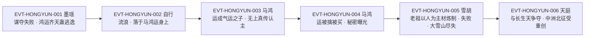

# 鸿运齐天蛊

运道流派的**八转仙蛊**，也是全书极少数**没有实体形态**的蛊：它不是虫，是「一团恢弘气运」`E:V3-114422`。它的名字在书里有**两个层级**——作为蛊，它是一次性消耗蛊；作为气运，它是刻在宿主肉身上、持续生效的运道道痕。两者常被同一句话混用，是本页最需要分清的地方。

它的行踪本身就是一段故事：墨瑶谋夺失败、放跑了它（`E:V3-114402`），数万年后它落在马鸿运身上（`E:V3-114390`、`E:V4-139256`），最后由雪胡老祖倾尽家产以马鸿运为主材重炼（`E:V4-141146`、`E:V5-309984`），炼制失败、大雪山福地尽失（`E:V6-395802`）。

本页为 2026-09-28 A 线正式 20 页恢复批**新建页**（分片 S1-4）。全书字面命中“鸿运齐天蛊”**78 处 / 去重 73 行**；以词根“鸿运齐天”扫描为 **166 处 / 152 行**，其中第 22 行与第 144 行两处同文重复段落**落在段域之外**（正文之前的作者自述），不可挂 E-ID，只作口径登记。所有引文回根原文 `source/蛊真人-clean.txt` 逐行复核，行号即 `E:V{段}-{6位行号}`。

## 主题档案

### 一、身份与品阶：八转仙蛊、巨阳仙尊运道真传的最高成就

#### 原著事实

- **品级明文八转**：「鸿运齐天蛊，高达八转，乃是一次性的消耗蛊」`E:V3-114422`；「鸿运齐天蛊乃是八转仙蛊，你的察运蛊不过是五转的凡蛊」`E:V3-114502`；「八转鸿运齐天蛊的威能，这下方源算是真正体会到了」`E:V3-114946`。
- **最高成就定位**：「鸿运齐天蛊，乃是巨阳仙尊运道真传的最高成就，价值极其巨大」`E:V3-114426`；「那就是巨阳仙尊的运道最高成就——鸿运齐天蛊！」`E:V3-114460`。
- **真传归属（口径 A：众生运）**：「巨阳仙尊一生修行，有三个阶段，分别是己运、众生运、天地运。鸿运齐天仙蛊，乃是众生运的巅峰精髓」`E:V5-230260`（说话人：龙公）。
- **真传归属（口径 B：晚年运道精髓）**：「根据琅琊地灵的透露，巨阳仙尊的晚年运道精髓，便是这只仙蛊了」`E:V5-210122`。两说分指"三大真传之一"与"晚年所作"，本页并列登记、不强行统一（见《待核对》）。
- **与「无上真传」的层级关系**：「鸿运齐天蛊乃是巨阳仙尊的运道真髓，是精华中的结晶。对剩下的无上真传来说，就是领头大哥，是王者帝皇」`E:V3-115162`。
- **被真传主动认可**：「无上真传主动对马鸿运认主，而不是其他人。这是因为，马鸿运的身上有鸿运齐天蛊的威能」`E:V3-115160`。

#### 合理推导

- **依据**：`E:V3-114422`、`E:V3-114502`、`E:V3-114946` 三处互不相同的行均写八转；**结论**：八转是**逐字明文**，可按 `[已确认]` 记，不需要旁证链；**不确定性**：原文未说明同为八转的不同仙蛊之间是否仍有强弱差（雪胡老祖同为八转却在 `E:V5-232442` 被点出不受其尽克）。
- **依据**：`E:V5-230260`（众生运巅峰精髓）＋`E:V5-210122`（晚年运道精髓）；**结论**：两条口径并不互斥——“众生运”是巨阳仙尊三大真传的**分类轴**，（释义）"晚年"是**时间轴**，同一枚蛊可以同时落在两个轴上；**可能反例**：`E:V3-111120` 说墨瑶当年闯入的是「运道无上真传」，未指明哪一层，故不能据这两条反推该蛊在真传体系中的唯一位置。

#### 《问真》设计意义

- （释义）"八转却具准九转威能"一说见 `E:V5-230264`；同书另处则写明「也不能尽克八转蛊仙雪胡老祖」`E:V5-232442`。两条同时存在，说明**威能不能单向等于转数**：同一枚蛊的强度取决于宿主的关系网密度与时间积累，而不是面板转数。设计上宜把这类蛊的强度做成"随时间与关系网络增长的函数"，而非固定值。
- 品阶在原著里是**公开可读**的信息（对话里随口引用），支持把转数做成世界内可查资料，而不是隐藏面板。

### 二、本体形态：无形无质的一团恢弘气运，真阳楼也困不住

#### 原著事实

- **无形无质、万难捕捉**：「它无形无质，本就是一团恢弘气运，用寻常手段万难捕捉」`E:V3-114422`。
- **两度逃逸的实录**：「当年我本体就是没有捉住它，令其鸿飞冥冥，消失无踪。就算是真阳楼，也没有困住它」`E:V3-114422`；「但鸿运齐天蛊，却是顺着这道裂缝飞走了，消失无踪」`E:V3-114402`。
- **自主流亡并择主**：「想来它一定是逃到北原，不断流浪，最终落在那个小子的身上了！」`E:V3-114422`。
- **能被"气息"识别**：「没有错，绝对没有错！这是鸿运齐天蛊的气息啊！」`E:V3-114390`；「鸿运齐天蛊的气息，我是绝对不会忘了的！」`E:V3-114420`。
- **层级差的侦察限制**：「五转的侦察蛊，怎么能侦察到八转仙蛊的气运呢？」`E:V3-114502`；「除非是八转的察运仙蛊，才能观察得到齐天鸿运的全貌」`E:V4-139270`。
- **凡人不可接近**：「方源只是个凡人，当初在真传秘境当中，连七转的人气仙蛊都不能接近。何况八转的鸿运齐天蛊？」`E:V3-114474`。
- **落于宿主身上**：「他的身上，已经被种上八转的鸿运齐天蛊」`E:V4-139256`。

#### 合理推导

- **依据**：`E:V3-114422`（两度逃脱、真阳楼困不住）＋`E:V3-114402`（顺裂缝飞走）；**结论**：鸿运齐天蛊是**有行动能力的自主物**，不是被动的道具；"捕捉失败"在原文中不是意外而是常态；**不确定性**：原文未说明它选择宿主的判据（血脉？气运？还是随机），也未说明能否主动离开宿主。
- **依据**：`E:V3-114502`、`E:V4-139270`；**结论**：**观测权限与转数挂钩**——五转侦察蛊看不见八转，八转察运仙蛊也只能看到"全貌"罢了；这条规则天然给"看见气运"设了一个修为门槛；**不确定性**：`E:V4-139270` 另提到「这还是因为，对方没有用手段遮掩伪装的缘故」，说明还存在反向的"伪装"手段，但原文未展开。

#### 《问真》设计意义

- **可采规则（可摆脱的持有关系）**：这枚蛊能自己飞走（`E:V3-114402`），这为"高价值物自己会跑"提供了原著依据——比"绑定即永久"更能生成博弈（谁放跑的、谁捡到的）。
- **可采规则（观测门槛）**：把"看运气"做成需要特定转数侦察蛊的能力（`E:V3-114502`、`E:V4-139270`），可以让"运气"这一隐形属性在低转玩家视角里保持不可见，从而保留信息差。

### 三、核心机制：吞吸与宿主相关者的运道，集于一身

#### 原著事实

- **真正效用（机制主句）**：「它的真正效用，就是能让拥有者，不断地吞吸周围和他（她）相关的生命的运道」`E:V5-230260`。
- **作用对象是"相关的人"**：「比如眼下的马鸿运，鸿运齐天蛊的威能就作用于和他相关的人物身上。他们的运气不断地被马鸿运吞吸，集于马鸿运一身」`E:V5-230262`。
- **随时间与关系强度放大**：「因为只要时间够久，关系的人物运势越强，鸿运齐天蛊就能吸收到更多的运气，集中在一个人的身上」`E:V5-230264`。
- **命名即机制自述**：「正因如此，巨阳仙尊才将这只仙蛊，命名为鸿运齐天。就是意喻：只要不断地吞吸众生的运气，集于自己一身，就能有和天地媲美的无上运道！」`E:V5-230264`。
- **威能上限**：「鸿运齐天仙蛊虽然只是八转，但实际上，却有准九转的威能」`E:V5-230264`；反面：「就算鸿运齐天仙蛊，有准九转的威能，也不能尽克八转蛊仙雪胡老祖」`E:V5-232442`。
- **机制 [已确认] / 具体数值 [待取证]（拆条）**：机制＝持续吞吸与宿主相关者的运道并集中于宿主一身，`[已确认]`（`E:V5-230260`、`E:V5-230262`）；具体数值＝吞吸速率、可关联对象数上限、作用半径、单位时间的增幅量，原文均未给出，另列 `[待取证]`（见《待核对》），**不得据机制成立反推数值**。

#### 合理推导

- **依据**：`E:V5-230260` 的"周围和他（她）相关"＋`E:V5-230262` 的"和他相关的人物"；**结论**：这是一件**关系网络型蛊**——它的产出量正比于宿主社会网络的规模与强度，**孤立的宿主收益近零**；**不确定性**：原文未定义"相关"的边界（血缘？利益？情感？），只说"相关"。
- **依据**：`E:V5-230264`（越久越强、关系人物运势越强越强）＋`E:V5-230262`（雪胡、万寿娘子因此一直炼蛊失败）；**结论**：机制存在**外部性**——被吞吸者的损失可观测（表现为"炼蛊一直失败"），因此宿主的关系网会持续付出代价；**不确定性**：被吞吸者是否知情、能否反抗，原文只在 `E:V4-141138` 处以雪胡老祖的自述涉及其"反击"，未给被吞吸方的应对手段。

#### 《问真》设计意义

- **可采规则（关系即资源）**：这枚蛊把"人际关系"直接换算成战力，是目前原著里最干净的一条"关系网络增幅"机制。做成系统时，收益应绑定**关系网规模×持续时长**，而非一次性加成。
- **可采规则（负外部性）**：被吞吸者会以"做正事一直失败"的形式承受代价（`E:V5-230262`），这天然生成"同阵营却受损"的摩擦，比单纯的敌人机制更有叙事张力。

### 四、代价与生效条件：一次性消耗蛊，效果延续至肉身死亡，全程不耗仙元

#### 原著事实

- **一次性消耗**：「乃是一次性的消耗蛊」`E:V3-114422`；「但可惜的是，鸿运齐天蛊是一次性的蛊，用了就消失了」`E:V3-114430`。
- **运用后的效果**：名在第 427964 行（「方源又想到了鸿运齐天蛊。」），紧接的 427966 行以“这只仙蛊”回指本蛊——「这只仙蛊乃是一次性的消耗蛊，运用之后，就能让蛊仙鸿运齐天，再不消耗仙元」`E:V6-427964`、`E:V6-427966`。
- **效果存续到肉身死亡**：「比如，巨阳仙尊他开创出来的八转仙蛊鸿运齐天。马鸿运用了，鸿运效果一直都存在着，直至他肉身死亡」`E:V5-264508`；「现在人都死了，鸿运齐天的效果消散」`E:V5-239944`。
- **本质是运道道痕**：「鸿运效果究其本质，就是运道道痕」`E:V5-264510`；「马鸿运的肉身上刻印下运道道痕，并且吞吐与他息息相关的周围人的气运，让自己的运道道痕越来越多。并且在整个过程中，他都不需要耗费任何的仙元、真元」`E:V5-264512`。
- **同型对照（不耗仙元）**：「神不知、鬼不觉是顶级的防御杀招，居然不耗损仙元。就好像是鸿运齐天蛊一样」`E:V4-174430`；「这不算类似于鸿运齐天、黑豕蛊这类往蛊师身上刻印道痕的蛊虫」`E:V5-232574`。
- **炼制端的代价实录**：「雪胡老祖为了炼出八转程度的鸿运齐天蛊，几乎把底蕴都耗尽了，搞得大雪山福地上上下下都怨声载道的」`E:V5-309984`；「雪胡老祖为了炼制一只八转鸿运齐天蛊，可谓倾家荡产」`E:V5-350358`；失败后「一身财富积累几乎完全耗光」`E:V5-348070`。
- **协炼者的反噬**：「电炼马鸿运是由她主持的，是炼制鸿运齐天仙蛊的关键步骤之一。如今失败，万寿娘子自然要受到反噬，承受伤害」`E:V5-217710`。
- **蛊材也需代价**：「大雪山中蛊仙反叛，将其中一份关键蛊材偷走」`E:V5-194022`。
- **代价三方（本页结论，依据上述各行）**：支付方＝**炼制者与协炼者**（雪胡老祖付资源与势力，万寿娘子付反噬伤害）；受益方＝**宿主／使用者**（马鸿运，或雪胡老祖意欲的自身「鸿运齐天蛊就是我破局的希望」`E:V4-141156`）；支付时点或生效条件＝**炼制阶段一次性付出**，效果**在"运用之后"生效并持续至宿主肉身死亡**（`E:V6-427966`、`E:V5-264508`）。

#### 合理推导

- **依据**：`E:V3-114422`（一次性）＋`E:V6-427966`（运用之后）＋`E:V5-264508`（延续至肉身死亡）＋`E:V5-239944`（人死效果消散）；**结论**：**被消耗的是蛊体，持续的是效果**——三者并不矛盾，而是同一机制的两段：蛊在"用之"的一刻消失，效果以道痕形式留在宿主身上；**不确定性**：原文未说明效果能否被剥离/转移（`E:V4-139274` 的"回收齐天鸿运"是**逆炼回蛊**，不等于转移道痕）。
- **依据**：`E:V5-309984`、`E:V5-348070`、`E:V5-217710`；**结论**：这是一件**支付方与受益方系统性分离**的资产：付出资源的人（雪胡老祖、万寿娘子）**可能什么都得不到**（炼制失败，`E:V6-395802`）；**可能反例**：马鸿运本人未付炼制成本却得到全部效果（`E:V3-114432`），说明"获取"与"炼制"可以完全脱钩，本页不据此归纳为通则。

#### 《问真》设计意义

- **可采规则（一次性 + 永久道痕）**：把"消耗品"与"永久增益"叠在一起，是原著给出的少见组合。它让强力道具**无法囤积**（用了就没了），却留下**永久后果**，天然抑制通胀。
- **可采规则（代付制）**：`E:V5-217710` 的"主持者吃反噬"是一条可直接落地的规则——把炼制失败的成本放到**协助者**身上，能让高风险炼制作业自带社交压力。

### 五、反击与反噬：对宿主怀有敌意者，运气急速下滑

#### 原著事实

- **敌意即触发**：「只要你对他抱有敌意，你的运气就会急速下滑」`E:V3-116266`（说话人：长河巨阳意志）。
- **一切不利举动皆触发**：「任何对其宿主不利的举动，都会引来鸿运的反击。镇压我等的运气」`E:V4-141138`。
- **运中帝皇的压制力**：「但鸿运齐天蛊乃是运中帝皇，因此我们也会被影响。时间拖得越久，就越会生出无数变故」`E:V4-141142`。
- **反噬亦见于行动方**：「这不可能！就算方源受到鸿运齐天蛊的反噬，运气多么差，也不可能差到如此地步啊！」`E:V3-117158`。
- **即时体感**：「八转鸿运齐天蛊的威能，这下方源算是真正体会到了」`E:V3-114946`；「我才刚刚想要动手，就爆发出这么一个意外！」`E:V3-114746`。
- **受益面延伸到宿主本人**：「马鸿运用了鸿运齐天蛊，就是货真价实的气运之子！身上运气，堪称五域第一！！」`E:V3-114432`。

#### 合理推导

- **依据**：`E:V3-116266`、`E:V4-141138`；**结论**：触发条件是**主观敌意**而非实际伤害——原文两处都用"抱有敌意／不利的举动"这类**意图性**表述，说明这道反击更接近"立场的代价"；**不确定性**：原文未说明"敌意"由谁判定、判定粒度多细（一念？一次行动？长期立场？），也未给出反击的量级上限。
- **依据**：`E:V4-141142` 的"时间拖得越久，就越会生出无数变故"；**结论**：反击是**随时间累积**的，而不是单次反弹——这让"围攻宿主"在策略上反而更危险；**可能反例**：`E:V5-232442` 的南荒仙人对"长生天早已出手"抱有信心，暗示存在能长期对抗的手段（如组织级实力优势），但原文未给成功案例。

#### 《问真》设计意义

- **可采规则（意图触发）**：把触发条件写成"意图"而不是"已造成伤害"，可以做出**事前惩罚**型机制——玩家连"想打"都要算账，这是很罕见的资源，值得单独建一条触发规则。
- **可采规则（越拖越糟）**：`E:V4-141142` 天然规定了"速攻 or 放弃"的策略分叉，避免围攻成为无脑最优解。

### 六、炼制、获取与逆炼：仙蛊方、以马鸿运为主材、可逆炼还原

#### 原著事实

- **主材明文**：「按照雪胡老祖的计划，就是让她最后操刀，以马鸿运为主材。炼出鸿运齐天蛊」`E:V4-141146`；「好在有马鸿运这个主材，比之无中生有地炼出鸿运齐天蛊，节省了不知多少的仙材了」`E:V4-141148`。
- **仙蛊方**：「真传内容中，已经损失了鸿运齐天仙蛊的仙蛊方」`E:V4-139274`；「这部分残缺的真传内容中，最具有价值的就是鸿运齐天仙蛊方！」`E:V5-243276`；「正是因为马鸿运得知这个仙蛊方，导致了雪胡老祖在买下他之后，也获知了这记仙蛊方」`E:V5-243284`。
- **逆炼手段**：「那便是真传内容中，却有一个手段，可以回收齐天鸿运。能将用掉的鸿运齐天仙蛊，重新逆炼，还原成仙蛊虫。当然，炼蛊的过程中，必不可少的主材就是这位马鸿运少年了」`E:V4-139274`。
- **炼蛊大阵**：「北原长生天的七极子之一的孙名录模仿悔池，搭建出超绝蛊阵子母逆命祭炼大阵，为雪胡老祖炼制八转鸿运齐天蛊」`E:V6-394326`。
- **炼制结局**：「雪胡老祖不仅没有炼出鸿运齐天蛊，更连自家经营的势力大雪山福地都丢了」`E:V6-395802`；「雪胡老祖则因为炼制八转仙蛊鸿运齐天蛊失败，一身财富积累几乎完全耗光」`E:V5-348070`。
- **通行规律对照**：「盖因仙蛊转数越高，越难炼制」`E:V5-196708`。
- **方源的资源缺口**：「比如八转鸿运齐天仙蛊，方源就缺少充分的八转运道仙材」`E:V6-407180`。
- **被多方觊觎**：「天庭来抢夺我们的鸿运齐天蛊，为什么我们就不可以抢夺他们的宿命蛊？」`E:V5-315956`；「这也就是天庭之前，进犯北原，出手抢夺鸿运齐天蛊的原因了」`E:V5-316322`；「曾经中洲进攻北原，夺取鸿运齐天蛊一役，在行军半途中就遭受了重创」`E:V6-435014`。

#### 合理推导

- **依据**：`E:V4-139274`＋`E:V5-243284`；**结论**：这枚蛊的**可复制性来自"仙蛊方 + 主材"两条**：方子存在（可由真传残缺内容推出）、主材存在（马鸿运这类宿主）；一旦两者齐备，即使损失了成品也能"逆炼还原"；**不确定性**：原文未说明逆炼的成品与原蛊是否等同（是否仍是同一枚"唯一"仙蛊），也未说明"回收齐天鸿运"是否需要宿主存活。
- **依据**：`E:V5-309984`、`E:V5-350358`、`E:V6-395802`；**结论**：炼制八转仙蛊的代价**足以摧毁一个超级势力**（大雪山福地成建制损失）；**不确定性**：原文另称天庭"别说炼制一只八转仙蛊，就算炼上十只，也丝毫不会损坏根基"`E:V5-350358`，说明cost存在量级差异，本页不把"倾家荡产"当作通则。

#### 《问真》设计意义

- **可采规则（逆炼闭环）**：一次性消耗蛊本应"用完即止"，但 `E:V4-139274` 给了它一条**逆炼回路**——这让"消耗品"具备了可回收性，玩家有动力去找回已耗的资源，而不是单纯损耗。
- **可采规则（以人为材）**：主材是"活人"（`E:V4-141146`），使这条炼制链天然携带道德冲突与救援叙事，是本页最有价值的叙事接口。

### 七、身份边界：不是狗屎运蛊、不是成语“鸿运齐天”、不是宿命蛊

#### 原著事实

- **与狗屎运蛊的分期关系（逐字）**：「鸿运齐天那是他晚年所炼。早年的时候，就是狗屎运」`E:V5-189556`（说话人：琅琊地灵，自述"我生前和他合作过"）。
- **真传归属亦不同**：「狗屎运就是己运真传的精髓之一，掌握我手。而众生运埋藏在王庭福地，连运、招灾、鸿运齐天就是源自于此」`E:V5-202118` 对照 `E:V5-230260`「鸿运齐天仙蛊，乃是众生运的巅峰精髓」。
- **成语用法（段域之外，无 E-ID）**：全书另有以"鸿运齐天"作成语的用例，见“皆因看到的主角大多都是鸿运齐天、光明正大、品德高尚”，落在第 22 行与第 144 行两处同文重复段落，均位于正文段域之外（第 1 段起于第 426 行），**不可挂 E-ID，仅作口径登记**。
- **「齐天鸿运」是效果名**：「除非是八转的察运仙蛊，才能观察得到齐天鸿运的全貌」`E:V4-139270`；「可以回收齐天鸿运」`E:V4-139274`。
- **与宿命蛊的对举**：「天庭来抢夺我们的鸿运齐天蛊，为什么我们就不可以抢夺他们的宿命蛊？」`E:V5-315956`。
- **“鸿运齐天仙蛊”是同实体的书写变体**（非异常）：全书该写法实测 **61 处 / 去重 59 行**，与主名"鸿运齐天蛊"（78 处 / 73 行）**仅在第 230264 行同行**，并集 131 行；示例 `E:V5-230264`、`E:V4-139274`、`E:V5-232574` 均用该写法。另有第 230272 行作「鸿运齐天仙等运道仙蛊」（E:V5-230272），未写全名，逐字见《资料整理》。

#### 合理推导

- **依据**：`E:V5-189556`（早年狗屎运／晚年鸿运齐天）＋`E:V5-202118`（狗屎运属己运真传）＋`E:V5-230260`（鸿运齐天属众生运）；**结论**：**狗屎运蛊与鸿运齐天蛊是两个不同实体**，二者同属巨阳仙尊但分属不同真传、不同时期，**不得互相写入 aliases**；**不确定性**：原文未说明巨阳仙尊弃用前者改用后者的原因。
- **依据**：上述成语用例的定位（第 22、144 行）＋`E:V3-114422` 的实体用法；**结论**：**同名异构**是本实体的主要命名风险——泛称"运气极好"与专名"运道仙蛊"共用四字，检索时必须区分；**不确定性**：本页只登记两处成语用例（两行同文重复），不排除还有未检得的其他用例。

#### 《问真》设计意义

- **命名层需要"专名／泛称"判别位**：“鸿运齐天”既是蛊名又是成语，若不做判别，检索与引用都会被污染。建议在实体页固定一个"同名异构"小节，并把判别口径写进资料层（本页已执行）。
- **同源分期实体应建"分期锚"**：狗屎运蛊（早年本命蛊）与鸿运齐天蛊（晚年所炼）构成一条**同一尊者的器物分期线**，两页应互指而不合并——这比强行归一更能承载"他是怎么变强的"这条叙事。

## 状态时间线

| 状态 ID | 阶段 | 状态 | 证据 |
|---|---|---|---|
| ST-HONGYUN-01 | 品阶 | 八转仙蛊；另有「准九转的威能」之说，但被指明不能尽克八转蛊仙 | E:V3-114422、E:V3-114502、E:V5-230264、E:V5-232442 |
| ST-HONGYUN-02 | 形态 | 无形无质，本体是一团恢弘气运；用寻常手段万难捕捉 | E:V3-114422 |
| ST-HONGYUN-03 | 逃逸实录 | 墨瑶本体两次未捉住，顺真阳楼裂缝飞走、消失无踪；真阳楼也未能困住它 | E:V3-114402、E:V3-114422 |
| ST-HONGYUN-04 | 定位 | 巨阳仙尊运道真传的最高成就／运道最高成就；众生运的巅峰精髓 | E:V3-114426、E:V3-114460、E:V5-230260 |
| ST-HONGYUN-05 | 核心效用 | 持续吞吸与宿主相关者的运道，集于宿主一身；越久、关系人物运势越强则越强 | E:V5-230260、E:V5-230262、E:V5-230264 |
| ST-HONGYUN-06 | 消耗属性 | 一次性消耗蛊，用了就消失；运用之后让蛊仙鸿运齐天、再不消耗仙元 | E:V3-114422、E:V3-114430、E:V6-427964、E:V6-427966 |
| ST-HONGYUN-07 | 效果存续 | 运道道痕刻在宿主肉身，全程不耗仙元真元；效果持续至宿主肉身死亡 | E:V5-264508、E:V5-264510、E:V5-264512、E:V5-239944 |
| ST-HONGYUN-08 | 反击机制 | 任何对宿主不利的举动或敌意都会引来鸿运反击，镇压对方运气；越拖越糟 | E:V3-116266、E:V4-141138、E:V4-141142 |
| ST-HONGYUN-09 | 宿主 | 落于马鸿运身上并被种上；被运道无上真传主动认主为"领头大哥" | E:V4-139256、E:V3-115160、E:V3-115162 |
| ST-HONGYUN-10 | 炼制 | 雪胡老祖以马鸿运为主材、借孙名录所建子母逆命祭炼大阵炼制，耗尽底蕴并失败 | E:V4-141146、E:V6-394326、E:V5-309984、E:V6-395802 |
| ST-HONGYUN-11 | 逆炼 | 残缺真传中留有回收齐天鸿运、将用掉的蛊逆炼还原成仙蛊虫的手段，主材仍是马鸿运 | E:V4-139274、E:V4-139298 |
| ST-HONGYUN-12 | 争夺 | 天庭／中洲十大古派远伐北原抢夺；长生天亦出手阻挠 | E:V5-315956、E:V5-316322、E:V6-435014 |

## 原著明确内容（本批取证窗口登记）

本批对“鸿运齐天蛊”在根原文全书扫描：**字面命中 78 处 / 去重 73 行**；以词根“鸿运齐天”扫描为 **166 处 / 152 行**。另有 2 行（第 22、144 行，同文重复的作者自述段）落在段域之外，只能作口径登记、不可挂 E-ID。所有窗口均回原文逐行读取。`roster-3.md` 登记的锚点为 `E:V3-114422`（本页复核：该行逐字含"高达八转…乃是一次性的消耗蛊"，锚点有效）。

| 窗口 | 内容要点 | 用途 |
|---|---|---|
| 111114–111124 | 墨瑶自述：拼死打破裂缝想取鸿运齐天蛊，结果让它飞走，退而炼出招灾蛊 | 主题二、七 |
| 114386–114434 | 首度集中登场：气息辨认、无形无质、高达八转、一次性消耗蛊、真阳楼困不住、五域第一气运 | 主题一、二、三、四 |
| 114456–114510 | 运道最高成就；凡人无法接近八转；察运蛊五转凡蛊的侦察层级差 | 主题一、二 |
| 114910–114950 | 巨阳意志与鸿运齐天蛊的关系；方源首次体会八转威能 | 主题五 |
| 115156–115166 | 无上真传主动认主；运道真髓、领头大哥 | 主题一、七 |
| 116260–116270 | 敌意即触发反击，运气急速下滑 | 主题五 |
| 117136–117162 | 反噬可波及行动方；巨阳意志的难以置信 | 主题五 |
| 139252–139302 | 马鸿运被种上八转鸿运齐天蛊；八转察运仙蛊的观测限制；真传残缺与逆炼手段 | 主题三、六、七 |
| 141134–141158 | 雪胡老祖自述威能可畏；以马鸿运为主材；倾尽积蓄；"破局的希望" | 主题三、四、六 |
| 148112–148156 | 大雪山坐镇炼制；资源争夺与摩擦 | 主题六 |
| 149466–149474 | 孤注一掷、几乎耗尽全部家底 | 主题四 |
| 174426–174432 | 与"不耗损仙元"的顶级防御杀招同型对照 | 主题四 |
| 194018–194024 | 大雪山蛊仙反叛、关键蛊材被偷 | 主题四、六 |
| 210118–210124 | 珍贵仙蛊；巨阳仙尊晚年运道精髓 | 主题一 |
| 213028–213038 | 北原格局因本蛊而变的方源自述 | 主题六 |
| 217706–217740 | 主炼者失败受反噬 | 主题四 |
| 230254–230272 | 龙公详解：己运／众生运／天地运三分；真正效用；准九转；命名由来 | 主题一、三 |
| 232438–232444 | 准九转亦不能尽克八转蛊仙 | 主题一、三、五 |
| 239940–239948 | 宿主死亡后鸿运效果消散 | 主题四 |
| 264504–264514 | 道痕本质、刻印于肉身、不耗仙元真元、持续至肉身死亡 | 主题四 |
| 309980–309988 | 耗尽底蕴、上下怨声载道 | 主题四、六 |
| 315952–315960、316318–316324 | 天庭抢夺鸿运齐天蛊与宿命蛊的对举 | 主题六、七 |
| 348066–348072、350354–350360 | 炼制失败、财富耗光；天庭量级差异 | 主题四、六 |
| 394322–394330 | 孙名录搭建子母逆命祭炼大阵 | 主题六 |
| 395798–395804 | 炼制大败亏输、大雪山福地尽失 | 主题六 |
| 413086–413092 | 马鸿运是长生天的棋子、巨阳仙尊的布置 | 主题六 |
| 427962–427970 | 方源自省：名见 427964，427966 以“这只仙蛊”回指本蛊，述其一次性消耗与不耗仙元 | 主题四 |
| 435010–435016 | 中洲进攻北原夺取鸿运齐天蛊一役受重创 | 主题六 |

## 事件链

| 事件 ID | 事件 | 参与者 | 证据 | 因果 |
|---|---|---|---|---|
| EVT-HONGYUN-001 | 墨瑶谋夺运道无上真传、打破裂缝欲取鸿运齐天蛊，反令其逃逸消失 | 墨瑶 | E:V3-111192、E:V3-114402、E:V3-115140 | causes EVT-HONGYUN-002 |
| EVT-HONGYUN-002 | 鸿运齐天蛊在真阳楼裂缝飞出后自行流浪，最终落于马鸿运身上 | 鸿运齐天蛊、马鸿运 | E:V3-114390、E:V3-114422、E:V4-139256 | causes EVT-HONGYUN-003 |
| EVT-HONGYUN-003 | 马鸿运运用本蛊成为「气运之子」，运道无上真传主动对其认主 | 马鸿运、无上真传 | E:V3-114432、E:V3-115160、E:V3-117158 | evidences ST-HONGYUN-05、ST-HONGYUN-09 |
| EVT-HONGYUN-004 | 马鸿运被生擒、被雪胡老祖买走，鸿运齐天之秘提前曝光 | 马鸿运、雪胡老祖 | E:V5-213032、E:V5-243284 | causes EVT-HONGYUN-005 |
| EVT-HONGYUN-005 | 雪胡老祖以马鸿运为主材、借孙名录所建子母逆命祭炼大阵炼制八转鸿运齐天蛊，耗尽底蕴而失败，大雪山福地尽失 | 雪胡老祖、万寿娘子、孙名录 | E:V4-141146、E:V6-394326、E:V5-309984、E:V6-395802 | evidences ST-HONGYUN-10 |
| EVT-HONGYUN-006 | 天庭／中洲十大古派远伐北原抢夺鸿运齐天蛊，长生天亦出手阻挠，战事重创 | 天庭、中洲十大古派、长生天、龙公 | E:V5-230258、E:V5-315956、E:V6-435014 | evidences ST-HONGYUN-12 |

事件口径：本页新建实体簇号 `EVT-HONGYUN-*`（与状态前缀 `ST-HONGYUN-` 同簇）。事件节点 6 个，达"≥3 节点应配图"的阈值，故配 mermaid 主干。

## 资料整理

本页为**新建页**，没有旧版；本批来源只有根原文，没有 `notes:`／`memory:` 层转述进入本页事实区。相关派生记录的处置登记如下（**本段内容不得当作原著事实**）：

- `roster-3.md` 中 `luck_atk_5_01_gu` 条目逐字为 `| luck_atk_5_01_gu | 鸿运齐天蛊 | 5 | 8 | E:V3-114422 |  |`（备注列为空）。本页复核：**原文转 8 成立**（`E:V3-114422`、`E:V3-114502`、`E:V3-114946` 三处互异行均为八转）；该条目未填备注，本页补齐机制要点。本页只登记、不改该页。
- `game/data/gu_lore.json` 的 `luck_atk_5_01_gu` 实测逐字为 `{"id": "luck_atk_5_01_gu", "name": "鸿运齐天蛊", "game_rank": 5, "status": "rank_cap", "lore_rank": 8, "anchor": "E:V3-114422"}`（只读核对，不在本批改动范围）。`status=rank_cap` 与 roster 分类"品阶上限压缩"一致：**游戏 rank 5 低于原文八转**，属**改编／张力**，登记于《待核对》，**不用游戏反向修正 Canon**。
- **登记锚性质（纪律项）**：`E:V3-114422` 是**正文行**（琅琊地灵的对话），**不是题名行**。本页另需声明一条纪律：**章节题名只能证明“该名在全书出现”，不能作为转数／机制／代价的证据**；本实体在全书 73 行命中中未见被用作章节题名者，因此转数一律**另据正文** `E:V3-114422`、`E:V3-114502`、`E:V3-114946` 三处核定。
- `game/data/gu_names.json` 的 `luck_atk_5_01_gu` → `"鸿运齐天蛊"`，与原文名一致。
- **命名层（实测计数，逐条可复算）**：主名“鸿运齐天蛊”**78 处 / 73 行**；变体“鸿运齐天仙蛊”**61 处 / 59 行**；两者**仅在第 230264 行同行**（该行同时写了两种写法），并集去重 **131 行**。词根“鸿运齐天”**166 处 / 152 行**，扣除并集后余 **27 处 / 21 行**，即简称与成语用法——其中第 22、144 行为成语（同文重复、段域之外），第 230272 行逐字为“将鸿运齐天仙等运道仙蛊，掌握手中”，**未写全名**。本页以 roster 名为主名、仙蛊写法入 aliases；成语“鸿运齐天”不入 aliases，边界见主题七。
- 本轮不新建 CAN ID；桥接层（`game/docs/lore/`）只作消费面，缺口登记于《待核对》。

## 分析与解读

1. **本页最容易写错的是"一次性"**。`E:V3-114430` 说"用了就消失了"，`E:V5-264508` 却说效果"一直都存在着，直至他肉身死亡"。把两条合起来读才是完整机制：**消失的是蛊，留下的是道痕**（`E:V5-264510`、`E:V5-264512`）。若只引前一条，会误把它做成一次性爆发道具；只引后一条，会误把它做成永久持有物。
2. **它是一件"关系网络型资产"，不是一个伤害数字**。`E:V5-230260` 的"吞吸周围和他（她）相关的生命的运道"与 `E:V5-230262` 的"作用于和他相关的人物身上"，合起来说明产出量取决于宿主的社交半径；`E:V5-230264` 补上"时间越久越强"，构成一条完整的成长曲线。
3. **代价被写在了"别人"身上**。炼制端是雪胡老祖倾家荡产（`E:V5-309984`）、万寿娘子承受反噬（`E:V5-217710`）；使用端是被吞吸的相关者持续倒霉（`E:V5-230262`）；而真正的受益者可能既不是炼制者也不是被吞吸者。这是全书里"支付方≠受益方"最清晰的一个样本。
4. **反击是意图触发的，且随时间累积**。`E:V3-116266` 用"抱有敌意"、`E:V4-141138` 用"不利的举动"，`E:V4-141142` 用"时间拖得越久"，三条合起来是一条**事前 + 累积**的惩罚规则，而不是常见的"受击反弹"。
5. **它与狗屎运蛊的分期线是本页第二个可审计发现**。`E:V5-189556` 明确把两者排成"早年／晚年"，且真传归属不同（`E:V5-202118` 对 `E:V5-230260`）。两页应互指而**不合并**：合并会同时丢掉"早年本命蛊"与"晚年最高成就"这两段时间信息。
6. **与《问真》的边界**：本页只写原著事实与推导。《问真》把 game rank 压到 5 是桥接层选择（`status=rank_cap`），本页不复制该实现，也不用它反向修正八转的原文事实。

## 待核对

- `[待取证]` **具体数值：吞吸的量化参数**（同条机制 `[已确认]` 见 `E:V5-230260`）。原文只说"不断地吞吸""吸收到更多的运气"（`E:V5-230260`、`E:V5-230264`），未给吞吸速率、作用半径、可关联人数上限、单位时间增幅量。
- `[待取证]` **「准九转的威能」的判定依据**：`E:V5-230264` 由龙公口述，`E:V5-232442` 南荒仙人复述同一说法；原文未给出该"威能"的可测定义，也未说明 `E:V5-232442` 中"不能尽克八转蛊仙"的具体机制。
- `[原著未明确]` **「相关」的判定边界**：`E:V5-230260`、`E:V5-230262` 只说"周围和他（她）相关的生命／人物"，未定义相关性的种类（血缘、利益、情感）与距离。
- `[原著未明确]` **效果的剥离与转移**：`E:V5-264508` 说效果持续至肉身死亡、`E:V5-239944` 说人死效果消散；原文未说明效果能否被主动剥离、转移给他人，或与 `E:V4-139274` 的"回收齐天鸿运"是否相关。
- `[待取证]` **（释义）回收齐天鸿运与逆炼的成品性质**：`E:V4-139274` 只说可"重新逆炼，还原成仙蛊虫"，未说明逆炼产物与原蛊是否同一、是否需要宿主存活、成功率几何。
- `[存在冲突]` **真传归属的两条口径**：口径 A＝`E:V5-230260`「鸿运齐天仙蛊，乃是众生运的巅峰精髓」（龙公）；口径 B＝`E:V5-210122`「巨阳仙尊的晚年运道精髓，便是这只仙蛊了」（转述琅琊地灵）。**当前状态：并列登记，不强行统一**——两者分属分类轴（三大真传）与时间轴（晚年所作），但原文从未把两轴合并陈述，故本页不代原文下结论。
- `[存在冲突]` **桥接层：游戏 rank 5 × 原文八转（登记为改编／张力）**：`roster-3.md` 与 `game/data/gu_lore.json` 同时记 game 5 / 原文 8（`status=rank_cap`）。两者不是原文内部矛盾，而是**跨层改编**；本页只登记、不改 `game/**`，也不据此修正原文八转。
- `[原著未明确]` **成语用例的完整清点**：本页只登记第 22、144 行两处同文重复的作者自述用例（段域之外，无 E-ID）。是否还有其它成语用例，本轮未逐条穷举，**不得写成"原著仅有这两处"**。
- `[原著未明确]` **CAN 覆盖**：本页无对应 Canon 索引条目（本轮不新建 CAN ID）。若后续需要桥接，缺口登记于此。

## 模板扩展建议（只登记，不改核心模板）

1. **需要"段域外命中"登记位**。本实体有 2 行命中落在正文段域之外（第 22、144 行），既不能挂 E-ID，也不该被忽略。建议模板允许一个"不可挂锚命中"的登记位，避免各页各自用正文段落夹带。
2. **需要"消耗品／永久效果"双轴字段**。`E:V3-114430` 与 `E:V5-264508` 分属"蛊体"与"效果"两轴，现有状态表只能塞进同一行。建议状态表允许同一实体按"蛊体生命周期"与"效果生命周期"分列。
3. **需要"同名异构（专名／泛称）"固定小节**。本实体与成语“鸿运齐天”四字全同，检索必然互相污染。建议把"专名／泛称判别口径"做成模板默认项。
4. **需要"同源分期实体"互指位**。狗屎运蛊（早年）与本蛊（晚年）属同一尊者的器物分期线，宜有一个成对字段承载，而不是只靠《关联页面》一条链接。

## 关联页面

[运道](../world/luck-path.md)、[狗屎运蛊](luck-atk-5-04-gu.md)、[招灾蛊](luck-atk-1-03-gu.md)、[宿命蛊](fate-gu.md)、[坚持仙蛊](persistence-gu.md)、[蛊虫关系](gu-relations.md)、[蛊虫总表三期](roster-3.md)、[道痕体系](../rules/dao-marks.md)、[灾劫体系](../rules/tribulation.md)、[炼蛊术语体系](../rules/refinement.md)、[蛊的饲养与炼化](../world/gu-care-and-refinement.md)、[真元](../world/primeval-essence.md)、[长生天](../world/longevity-heaven.md)、[北原](../world/north-plain.md)、[王庭福地](../events/royal-court.md)、[真阳楼崩塌](../events/true-yang-collapse.md)、[命运之战](../events/fate-war.md)、[方源](../characters/fang-yuan.md)、[黑楼兰](../characters/he-lou-lan.md)、[龙公](../characters/dragon-duke.md)。
