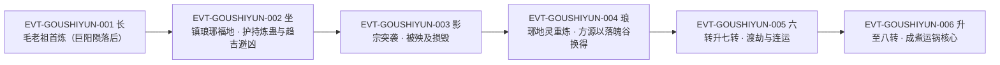

# 狗屎运蛊

运道仙蛊，**巨阳仙尊早年的本命蛊**（`E:V5-189556`），己运真传的精髓之一（`E:V5-202118`）。它是一只蜣螂（屎壳郎）模样的仙蛊（`E:V6-394638`），靠**六头不同荒犬的粪便**喂养（`E:V5-202094`），效用是增幅气运、削减地灾威能（`E:V5-194896`），对攻防腾挪**没有任何帮助**（`E:V5-202116`）——它的强，全在"看不见的地方"（`E:V5-202116`、`E:V5-202114`）。

本页为 2026-09-28 A 线正式 20 页恢复批**新建页**（分片 S1-4）。

**检索口径（必读：字面命中 1 次，变体命中 67 次）**

**本实体是"长尾必须遍历"的典型反例**，任何只做字面检索的流程都会把它判成非实体，因此本页先把口径写死：

- **字面“狗屎运蛊”全书仅 1 次，落在 1 行**：`E:V5-199800`（六转仙蛊名录行）。逐字为「六转仙蛊解谜蛊、妇人心蛊、血本蛊、暗渡蛊、狗屎运蛊、变形蛊、力气蛊、我力蛊、飞熊之力蛊、拔山蛊、挽澜蛊、江山如故蛊、人如故蛊、星眸蛊。」——**这 1 次也是 roster-3 登记的锚点**。
- **变体“狗屎运”（去掉末字"蛊"）全书 67 次，落于 63 行**。原文绝大多数场合以“狗屎运”“狗屎运仙蛊”指称本实体，**不以全名书写**。
- **因此：不得据"字面命中 1 次"把本实体写成"疑似非实体 / 子串误切"。** 本页全部事实由变体检索取证。
- 67 次 / 63 行的**逐条分类账见《资料整理》**（含"裸用 45 次、仙蛊后缀 21 次、蛊后缀 1 次"与"泛称成语 16 行"的完整清单）。

## 主题档案

### 一、身份与品阶：巨阳仙尊早年本命蛊、己运真传精髓之一

#### 原著事实

- **六转明文（名录）**：「六转仙蛊解谜蛊、妇人心蛊、血本蛊、暗渡蛊、狗屎运蛊、变形蛊、力气蛊、我力蛊、飞熊之力蛊、拔山蛊、挽澜蛊、江山如故蛊、人如故蛊、星眸蛊。」`E:V5-199800`。
- **六转明文（交易行）**：「方源将落魄谷正式卖给琅琊地灵，而得到狗屎运仙蛊、血本仙蛊、暗渡仙蛊这三只六转仙蛊」`E:V5-196410`。
- **早年本命蛊（琅琊地灵生前合作语）**：「原来巨阳仙尊的本命仙蛊，竟然是狗屎运？不是鸿运齐天仙蛊吗？」`E:V5-189554`；「鸿运齐天那是他晚年所炼。早年的时候，就是狗屎运。我生前和他合作过，怎么会不知道？」`E:V5-189556`。方源当时的第一反应：「他还是首次听到狗屎运这种奇葩的仙蛊」`E:V5-189564`。
- **真传归属**：「狗屎运就是己运真传的精髓之一，掌握我手」`E:V5-202118`；「煮运锅便是己运真传中精华凝聚的巅峰造物」`E:V6-394648`，而「狗屎运仙蛊乃是煮运锅的核心仙蛊」`E:V6-394646`。
- **辅助定位（非战力）**：「刚刚升炼成功的狗屎运仙蛊，更曾是巨阳仙尊的本命仙蛊，有着极其厉害的辅助能力」`E:V5-356252`。

#### 合理推导

- **依据**：`E:V5-199800`（名录列于"六转仙蛊…"句首）＋`E:V5-196410`（与他蛊并列称"这三只六转仙蛊"）＋`E:V5-356216`（「原本的六转仙蛊成功升炼成了七转」）＋`E:V5-356254`（「只是之前一直都是六转层次」）；**结论**：六转是**逐字 + 旁证双重成立**，`[已确认]`；**不确定性**：名录行本身只给"六转仙蛊"这一句首限定，单看它不足以定级，必须靠 `E:V5-196410`、`E:V5-356254` 两处独立行补足——**这也是本页把登记锚（`E:V5-199800`）与转数证据（另据正文）分开写的原因**。
- **依据**：`E:V5-189556`（早年狗屎运／晚年鸿运齐天）＋`E:V5-202118`（狗屎运属己运真传）；**结论**：本实体与鸿运齐天蛊是**两个不同实体**，分属不同时期与不同真传；**可能反例**：`E:V5-189554` 记录方源当时的错愕（"竟然是狗屎运？不是鸿运齐天仙蛊吗？"），说明连书内人物都会把两者混淆，命名层需显式区分。

#### 《问真》设计意义

- “原书只写过 1 次全名”这件事本身就是资料层最有价值的资产：它证明**实体存在性与书写频次无关**。设计上应把"长尾实体"作为一等公民登记，而不是按命中数筛。
- （释义）早年本命蛊到晚年另炼最高成就，是一条**同一尊者的器物升级线**（`E:V5-189556`）。设计上宜作为成对关系承载，而不是把后者当成前者的上位替代。

### 二、本体形态：蜣螂（屎壳郎）模样，黄金作色

#### 原著事实

- **物种与俗称**：「这只仙蛊乃是蜣螂模样，俗称屎壳郎。」`E:V6-394638`。
- **体色与分节**：「它全体都是黄金作色，身躯分为头、胸腹、尾三段。头部如半月铲，两侧有船桨一般的触角。胸腹部有横行的隆脊，尾部椭圆。」`E:V6-394640`。
- **足肢与毛刺**：「在胸腹部有两对足肢，尾部有一对。每一个触脚都十分粗壮，触脚的最末端还有黑色的坚硬毛刺。」`E:V6-394642`。
- **形制归属确认**：上述三行之后紧接「正是狗屎运仙蛊，经过方源的一番炼制之后，已然上升到了八转层次。」`E:V6-394644`——即以「正是」回指前文，确认形制描述属于本实体。

#### 合理推导

- **依据**：`E:V6-394638`（蜣螂／屎壳郎）＋`E:V5-202094`（以荒犬粪便喂养）；**结论**：形制与喂养方式**互相咬合**——因为原型是食粪的蜣螂，所以饲料是粪便；这是原著里少见的"形态即功能说明书"设计；**不确定性**：`E:V6-394640`、`E:V6-394642` 是**升炼到八转后**的样貌（`E:V6-394644` 紧随其后），六转时形态是否相同，原文未写。
- **依据**：`E:V6-394638`–`E:V6-394644` 的紧邻关系；**结论**：形制三行属于本实体，而非邻近的其他仙蛊；**不确定性**：原文以（释义）“正是”回指而非重复命名，若只按单行截取，容易把形制误挂到别蛊——本页因此把四行一并列出。

#### 《问真》设计意义

- **可采规则（形态即说明）**：把外形做成机制的"说明书"（蜣螂 → 食粪喂养），玩家不必读数值就能推断喂养需求，降低认知成本。
- **可采规则（升炼改形）**：`E:V6-394644` 提示"升炼后形体有描述"，为转数提升提供可视化的表现层变化依据。

### 三、核心效用：增幅气运、削减地灾威能、护持本体

#### 原著事实

- **主效用**：「渡劫以来，也一直催动狗屎运仙蛊，毫不停歇。如此气运，应当减少了地灾的不少威能。就算这样，这次地灾仍旧如此艰巨！」`E:V5-194896`；「渡劫前，他必定要用狗屎运，增幅运气，减弱地灾威能」`E:V5-195876`；「第二个是狗屎运，用运道来虚弱灾劫」`E:V5-203292`。
- **护持本体、遮掩真身**：「随着时间推移，狗屎运护持本体的效果越来越弱了，使得天意发现真身的概率大大增强」`E:V5-202988`；「一旦这股护持力量彻底消失，比失去狗屎运还要严重」`E:V5-202994`；「狗屎运、暗渡的护持效果锐减」`E:V5-203000`。
- **增添炼蛊成功率**：「你现在是狗屎运仙蛊之主，利用自身强悍的运气，也能增添炼蛊的成功可能」`E:V5-196730`。
- **护持他人仙蛊**：「你的狗屎运道可护持仙蛊」`E:V5-197186`。
- **护持一地（趋吉避凶）**：「而后，狗屎运仙蛊一直坐镇琅琊福地，给上一任琅琊地灵炼蛊带来巨大帮助。同时，也护持琅琊福地，多次趋吉避凶，有惊无险。」`E:V5-196392`。
- **机制层定位（道痕）**：「比如狗屎运、鸿运齐天。这些便是运道道痕参与天道道痕演变灾劫，从而发生对蛊仙有利的变化，让灾劫威能下降」`E:V6-380722`（同文另见第 387688 行重复块）。
- **能力边界（重要反例）**：「这只仙蛊虽然对攻防腾挪没有任何帮助，但隐形的助益，似乎很大」`E:V5-202116`；「恐怕狗屎运是其中的功臣」`E:V5-202114`。
- **机制 [已确认] / 具体数值 [待取证]（拆条）**：机制＝以运道增幅气运、削弱灾劫威能并护持本体，`[已确认]`（`E:V5-194896`、`E:V5-195876`、`E:V5-202988`、`E:V6-380722`）；具体数值＝威能削减的百分比、护持衰减曲线、生效半径与持续时长，原文均未给出，另列 `[待取证]`（见《待核对》），**不得据机制成立反推数值**。

#### 合理推导

- **依据**：`E:V5-202116`（对攻防腾挪没有任何帮助）＋`E:V5-194896`（削减地灾威能）＋`E:V5-202988`（护持本体、遮掩真身）；**结论**：它是**纯防御／纯规避型**仙蛊，产出的是"少受伤、少被发现、少失败"这类**负向事件的减少**，而不是正向输出；**不确定性**：原文未给出可比较的量化刻度，因此"隐形助益很大"（`E:V5-202116`）只能作定性判断。
- **依据**：`E:V5-202988`、`E:V5-202994`、`E:V5-203000`；**结论**：护持是**衰减型**资源，随时间递减、会失效，且失效后果被明确写成"比失去狗屎运还要严重"；**不确定性**：原文未说明衰减的驱动因素（时间？泄漏？被天意察觉？），也未给衰减周期。
- **依据**：`E:V5-196392`（护持一整片福地）＋`E:V5-197186`（护持他人仙蛊）；**结论**：受益方**不限于持有者本人**，可以外溢到"所在地"与"他人之蛊"；**可能反例**：原文未说明外溢是否有代价或上限，故不能反推"护持范围无限"。

#### 《问真》设计意义

- **可采规则（负向事件减免）**：把仙蛊做成"降低坏事发生率"而不是"提高输出"，可以给玩家一套不同于数值对拼的 build 方向；`E:V5-202116` 的"对攻防腾挪没有任何帮助"是关键平衡句。
- **可采规则（衰减护持）**：`E:V5-202988` 的"效果越来越弱"天然避免了永久免疫，建议直接采用为持续时间型 buff，而不是常驻光环。
- **可采规则（护持外溢）**：`E:V5-196392` 支持"坐镇某地即护持该地"，很适合做成据点型收益。

### 四、代价与受益方：以荒犬粪便喂养；受益方常不是持有者

#### 原著事实

- **饲料明文**：「你可别忘了你的狗屎运仙蛊。你要喂养它，就得寻找到六头不同的荒犬。用它们的粪便来喂养这只运道蛊虫呢。」`E:V5-202094`。
- **采购与自养**：「在以往，我上一任喂养狗屎运，都是借助宝黄天，从那里采购。但现在宝黄天关闭。就算将来开启，我也建议你在仙窍中豢养犬兽。」`E:V5-202096`。
- **持有代价（交易）**：「方源将落魄谷正式卖给琅琊地灵，而得到狗屎运仙蛊、血本仙蛊、暗渡仙蛊这三只六转仙蛊」`E:V5-196410`；另见「琅琊地灵招收方源为客卿太上长老，和方源交易，卖出又炼成的狗屎运仙蛊，还有己运真传等等」`E:V5-287388`。
- **受益方外溢（连运导致分润）**：「他在那边动用狗屎运仙蛊。增强自身运气。但增幅的运气，好像水从高处流下，灌给叶凡、洪易、韩立、黑楼兰四人。这四人又和我这具肉身运气相连，所以让我讨了个便宜。」`E:V5-195870`（说话人：影无邪）。
- **持有者自陈的反常结果**：「狗屎运仙蛊庇护，自身运道应当不差。难道说是因为我地灾太过猛烈，增添的狗屎运都用于削减地灾了？」`E:V5-196338`；「别忘了，我连运多人。狗屎运或许平均分配了许多出去，才效果不佳。」`E:V5-196354`。
- **代价三方（本页结论，依据上述各行）**：支付方＝**持有者**（喂养成本：六头不同荒犬的粪便，旧时另需经宝黄天采购，`E:V5-202094`、`E:V5-202096`；获得成本：以落魄谷等资产交换，`E:V5-196410`）；受益方＝**持有者本人 + 与其连运者**（`E:V5-195870` 明确的四人分润）；支付时点或生效条件＝**喂养为持续成本**（须常备荒犬或采购），**增益在催动时生效、随连运人数被摊薄、并随时间衰减**（`E:V5-194896`、`E:V5-196354`、`E:V5-202988`）。

#### 合理推导

- **依据**：`E:V5-195870`（运气"如水从高处流下"灌给四人）＋`E:V5-196354`（"平均分配了许多出去"）；**结论**：气运**不是无限资源**，而是被**连运关系均分**的存量——持有者启用"连运"越多，自己单位获益越少；**不确定性**：原文"平均分配"是方源的**推测**（"或许"），不是叙述者确认，故本页标为**持有者自陈的推测**而非机制定论。
- **依据**：`E:V5-202094`＋`E:V5-202096`；**结论**：饲料是**稀缺且物流依赖型**资源（须寻六头不同荒犬；宝黄天关闭后须自养）；**不确定性**：原文未说明"六头不同"是否要求荒犬转数、品种或地域差异，也未给消耗速率。

#### 《问真》设计意义

- **可采规则（饲料即限制）**：以"六头不同荒犬的粪便"限制持有，是一条很独特的经济型门槛——不是花钱，而是**养一条供应链**。建议直接落为可持续但需经营的资源需求。
- **可采规则（气运被摊薄）**：`E:V5-195870`、`E:V5-196354` 给出的"连运即摊薄"是**团队增益 vs 自身强度的权衡**，天然抑制"一人带全队再无敌"。
- **可采规则（资产交换获取）**：`E:V5-196410` 说明仙蛊可通过出售重资产（落魄谷）换取，为高阶道具提供非战斗获取路径。

### 五、沿革：从巨阳仙尊本命蛊到煮运锅核心

#### 原著事实

- **首炼**：「就比如狗屎运仙蛊，早在很多年前，巨阳仙尊陨落之后，长毛老祖就第一时间将其炼制出来。」`E:V5-196390`。
- **坐镇琅琊福地**：「而后，狗屎运仙蛊一直坐镇琅琊福地，给上一任琅琊地灵炼蛊带来巨大帮助。同时，也护持琅琊福地，多次趋吉避凶，有惊无险。」`E:V5-196392`。
- **第一次损毁**：「上一次，我影宗突袭琅琊福地。抢夺了部分炼炉，还殃及了狗屎运仙蛊，无意间毁掉了它。琅琊地灵就一直准备重炼狗屎运仙蛊。最近正好炼成了。恐怕他是将狗屎运借给了方源。」`E:V5-195858`；方源回顾版：「此役中白毛地灵转变成了黑毛地灵，狗屎运仙蛊也在此战中损毁」`E:V5-287378`。
- **重炼后卖出／借出**：`E:V5-287388`（见上一节）；`E:V5-196410`（以落魄谷换得）。
- **升炼至七转**：「三炷香的时间后，阵内的火焰徐徐消散，原本的六转仙蛊成功升炼成了七转。」`E:V5-356216`；紧接「七转——狗屎运！」`E:V5-356218`；「哦？狗屎运仙蛊也升炼成功了。进展不错。」`E:V5-356236`；升炼后评价：「只是之前一直都是六转层次，登不上层面。如今升到七转，终于可以勉强一用。」`E:V5-356254`。
- **并列七转群**：「人如故、江山如故、我力、拔山、挽澜、狗屎运、时运等等，都已经被他提升到了七转程度。」`E:V5-310474`。
- **升炼至八转、成煮运锅核心**：「正是狗屎运仙蛊，经过方源的一番炼制之后，已然上升到了八转层次。」`E:V6-394644`；「狗屎运仙蛊乃是煮运锅的核心仙蛊。」`E:V6-394646`；「狗屎运仙蛊是首要选择，方源只是第一次尝试升炼，就成功了。」`E:V6-394654`；「有了八转狗屎运，煮运锅的转数就已经提升到了八转层次。」`E:V6-394658`。
- **与升炼蛊的对照**：「不是春秋蝉、狗屎运，也不是态度蛊、如梦令蛊，而是升炼蛊。」`E:V6-429516`。
- **题名行（只证名之存在，不作转数证据）**：「章节目录 第八节：本命仙蛊狗屎运」`E:V5-189406`；「章节目录 第一百一十三节：八转狗屎运」`E:V6-394558`。

#### 合理推导

- **依据**：`E:V5-195858`、`E:V5-287378`（同一役召致损毁）＋`E:V5-287388`、`E:V5-196410`（重炼后再交易）；**结论**：本实体是**可反复重炼、可转移持有**的仙蛊，其"唯一性"弱于鸿运齐天蛊（后者两次自行逃逸）；**不确定性**：原文未说明重炼出的个体与前一只是否等同，也未说明重炼是否需要原主材料。
- **依据**：`E:V5-356216`、`E:V5-356218`、`E:V6-394644`；**结论**：转数可被**升炼**推进（六 → 七 → 八），且升炼"只是第一次尝试就成功"（`E:V6-394654`）；**不确定性**：原文未给升炼的成功率、所需仙材量级或失败后果，故只登记"可升炼"这一机制，不给概率。
- **依据**：`E:V5-189406`、`E:V6-394558` 均为「章节目录」行；**结论**：题名只证明"该名在全书出现"（本页的 189406 号题名与变体口径一致，均用简称"狗屎运"），**不能作为转数或机制证据**——八转的转数证据另据正文 `E:V6-394644`；**不确定性**：两处题名行只给出节名，未附带任何机制或转数说明，故题名既不能证明“八转”是成书时期的唯一转数口径，也不能排除作者在题名中使用的是已升炼后的转数——转数仍以正文为准（`E:V6-394644` 升炼后八转；`E:V5-356254` 此前一直是六转层次）。

#### 《问真》设计意义

- **可采规则（可重炼、可易主）**：`E:V5-195858`、`E:V5-287388` 说明"损毁不等于消失"，为高价值道具提供回收/重铸玩法，避免一次失误永久损失。
- **可采规则（转数可成长）**：六 → 七 → 八的升炼链（`E:V5-356216`、`E:V6-394644`）可作为"同一件道具的纵向成长"模板，比"掉落更高级版本"更省叙事成本。

### 六、身份边界：不是鸿运齐天蛊，不是泛称成语“狗屎运”

#### 原著事实

- **与鸿运齐天蛊的分期关系**：`E:V5-189554`、`E:V5-189556`（见主题一）。
- **屏蔽名行（不可作字面命中）**：「****运仙蛊，不愧是巨阳仙尊的本命蛊啊。只是不知道，如果将它提升到八转，和鸿运齐天仙蛊相比较会如何？」`E:V5-226958`——该行蛊名被**原文以「****」屏蔽**，未逐字写出；`roster-3.md` 把它登记为"方源自语屏蔽名互证"，本页只作**旁证**处理，**不列入字面命中**。
- **泛称成语用法（16 行，非本实体）**：如「上次让你走了狗屎运」`E:V1-004130`、「马鸿运不知道走了什么狗屎运，居然也能进去」`E:V3-091342`、「庙明神这伙人真的走了狗屎运，怎么就攀上了楚瀛？」`E:V5-354130`——这些是"运气好"的俗语，**不指本实体**。逐条清单见《资料整理》。
- **裸用亦可指本实体**：`E:V5-189552` 同一行内先作成语（「你小子到底走了什么狗屎运？」）后作专名（「巨阳仙尊的本命仙蛊狗屎运」）——**同一行两义并存**，是本实体最典型的检索陷阱。
- **“狗屎运道”指其运道属性**：「你的狗屎运道可护持仙蛊」`E:V5-197186`。
- **与态度蛊、暗渡蛊、变形蛊等为不同实体**：`E:V5-203000`（与暗渡并列比较护持效果）、`E:V5-356252`（升炼同批）、`E:V6-429516`（与春秋蝉、态度蛊、如梦令蛊并列对照）。

#### 合理推导

- **依据**：`E:V5-189552`（同一行两义并存）＋16 行泛称用例；**结论**：本实体的主名"狗屎运"**本身就是一个汉语俗语**，因此**任何基于全名匹配的检索都会在字面命中处漏掉它、在俗语处误收它**——即"一边漏、一边错"；**不确定性**：本页的 16 行泛称清单是按"去掉末字后不以蛊称"的标准人工分出的，标准边界（如"狗屎运道"是否算泛称）存在解释空间，故清单方法一并写明（见《资料整理》）。
- **依据**：`E:V5-226958` 的屏蔽写法；**结论**：原文存在"刻意不写全名"的用例，**不能据屏蔽行反推所屏蔽之名就是本实体**，只能作为强度较弱的旁证；**不确定性**：屏蔽符号「****」对应的准确字数未知（"狗屎运"为三字，若按此则应为「***运仙蛊」，但原文写的是“****运仙蛊”四星），**故本页不据该行做任何计数或定名**。

#### 《问真》设计意义

- **必须建"专名／俗语"判别位**：本实体的名字天然与俗语同形，需要在检索层固定一条判别规则（本页采用："去掉末字后是否以蛊称"＋上下文）。否则资料层会同时出现漏检与误收。
- **必须建"屏蔽名"登记位**：`E:V5-226958` 这类被原文遮蔽的名字，既不能计入字面命中，也不该被丢弃。建议模板提供一个"不可计数的旁证"字段。

## 状态时间线

| 状态 ID | 阶段 | 状态 | 证据 |
|---|---|---|---|
| ST-GOUSHIYUN-01 | 品阶（六转） | 列入六转仙蛊名录；与他蛊并列称"这三只六转仙蛊" | E:V5-199800、E:V5-196410 |
| ST-GOUSHIYUN-02 | 身份 | 巨阳仙尊早年本命蛊；己运真传的精髓之一 | E:V5-189556、E:V5-202118 |
| ST-GOUSHIYUN-03 | 形制 | 蜣螂（屎壳郎）模样，黄金作色，头如半月铲、两侧船桨状触角，胸腹有横行隆脊，双对足肢加尾部一对，触脚末端有黑色坚硬毛刺 | E:V6-394638、E:V6-394640、E:V6-394642、E:V6-394644 |
| ST-GOUSHIYUN-04 | 饲料 | 须寻找六头不同的荒犬，以其粪便喂养；旧时经宝黄天采购，宝黄天关闭后建议自养犬兽 | E:V5-202094、E:V5-202096 |
| ST-GOUSHIYUN-05 | 效用 | 催动后增幅气运、减少地灾威能；亦用于增添炼蛊成功可能、护持他人仙蛊 | E:V5-194896、E:V5-195876、E:V5-203292、E:V5-196730、E:V5-197186 |
| ST-GOUSHIYUN-06 | 效用边界 | 对攻防腾挪没有任何帮助，只提供"隐形的助益" | E:V5-202116 |
| ST-GOUSHIYUN-07 | 护持衰减 | 护持本体效果随时间越来越弱，弱点是被天意发现真身的概率大增；最终锐减失效 | E:V5-202988、E:V5-202994、E:V5-203000 |
| ST-GOUSHIYUN-08 | 收益外溢 | 增幅的运气可"如水从高处流下"灌给连运的他人，持有者自陈被平均分配 | E:V5-195870、E:V5-196354、E:V5-196338 |
| ST-GOUSHIYUN-09 | 首炼 | 巨阳仙尊陨落后，长毛老祖第一时间炼制出来 | E:V5-196390 |
| ST-GOUSHIYUN-10 | 坐镇期 | 长期坐镇琅琊福地，助上一任地灵炼蛊并护持福地趋吉避凶 | E:V5-196392 |
| ST-GOUSHIYUN-11 | 第一次损毁 | 影宗突袭琅琊福地时被殃及、无意毁掉；其役白毛地灵转为黑毛地灵 | E:V5-195858、E:V5-287378 |
| ST-GOUSHIYUN-12 | 重炼与易主 | 琅琊地灵重炼；方源以出售落魄谷换得（连同血本仙蛊、暗渡仙蛊） | E:V5-195858、E:V5-287388、E:V5-196410 |
| ST-GOUSHIYUN-13 | 升炼七转 | 六转升炼为七转；此前"登不上层面"，升后"终于可以勉强一用" | E:V5-356216、E:V5-356218、E:V5-356236、E:V5-356254 |
| ST-GOUSHIYUN-14 | 升炼八转 | 经方源炼制升至八转，成为煮运锅核心仙蛊，并以它把煮运锅提升到八转层次 | E:V6-394644、E:V6-394646、E:V6-394654、E:V6-394658 |
| ST-GOUSHIYUN-15 | 检索风险 | 全书字面全名仅 1 次；变体 67 次/63 行；另有 16 行为同名俗语、1 行为原文屏蔽名 | E:V5-199800、E:V5-226958、E:V1-004130、E:V3-091342、E:V5-354130 |

## 原著明确内容（本批取证窗口登记）

本批对根原文全书扫描（`open(p, encoding='utf-8', newline='').read().split('\r\n')`，437,060 行）：“狗屎运蛊”**1 处 / 1 行**；“狗屎运”**67 处 / 63 行**；“狗屎运仙蛊”**21 处 / 20 行**。`roster-3.md` 登记的锚点为 `E:V5-199800`（本页复核：该行逐字含「六转仙蛊解谜蛊、妇人心蛊、血本蛊、暗渡蛊、狗屎运蛊」等列名，锚点有效）。**登记锚为题名／名录性质的行，转数另据正文** `E:V5-196410`、`E:V5-356254` 核定。

| 窗口 | 内容要点 | 用途 |
|---|---|---|
| 189402–189410 | 章节目录题名“本命仙蛊狗屎运”（`E:V5-189406`） | 题名登记 |
| 189548–189568 | 琅琊地灵点明巨阳仙尊早年本命蛊；方源首闻此蛊 | 主题一、六 |
| 194892–194900 | 渡劫期持续催动，气运减少地灾威能 | 主题三 |
| 195854–195878 | 影宗突袭致其损毁、琅琊地灵重炼并借出；渡劫前必用 | 主题三、五 |
| 196330–196356 | 护身却仍遭算计；连运导致气运被平均分配 | 主题三、四 |
| 196380–196414 | 运道真传中的狗屎运；长毛老祖首炼；坐镇琅琊福地；以落魄谷换得三只六转仙蛊 | 主题一、四、五 |
| 196726–196734 | 持有者气运可增添炼蛊成功可能 | 主题三 |
| 197182–197190 | 狗屎运道可护持仙蛊 | 主题三 |
| 199796–199802 | 六转仙蛊名录，全名字面唯一命中 | 主题一、检索口径 |
| 202090–202120 | 喂养方式（六头不同荒犬粪便、宝黄天采购、自养犬兽建议）；效用定位与"己运真传精髓之一" | 主题一、三、四 |
| 202984–203004 | 护持本体效果递减、失效后果、与暗渡并列锐减 | 主题三 |
| 203288–203296 | 以运道虚弱灾劫的第二手段 | 主题三 |
| 226954–226960 | 方源自语，蛊名被原文屏蔽为“****运仙蛊” | 主题六 |
| 287374–287392 | 影宗进攻致损毁；琅琊地灵重炼后与方源交易 | 主题五 |
| 304192–304200 | 运道仙蛊群列举 | 主题五 |
| 310470–310478 | 已提升到七转程度的仙蛊群 | 主题五 |
| 338846–338854 | 方源将运道仙蛊融入煮运锅 | 主题五 |
| 338946–338954 | 煮运锅中的运道仙蛊群及其为"基本功用" | 主题五 |
| 356212–356258 | 六转升炼七转的全过程与评价 | 主题五 |
| 380718–380726 | 运道道痕参与天道道痕演变灾劫 | 主题三 |
| 394554–394562 | 章节目录题名“八转狗屎运”（`E:V6-394558`） | 题名登记 |
| 394634–394690 | 蜣螂形制四行；升至八转；成煮运锅核心仙蛊 | 主题二、五 |
| 429512–429520 | 与春秋蝉、态度蛊、如梦令蛊并列对照 | 主题五、六 |

## 事件链

| 事件 ID | 事件 | 参与者 | 证据 | 因果 |
|---|---|---|---|---|
| EVT-GOUSHIYUN-001 | 巨阳仙尊陨落后，长毛老祖第一时间炼出狗屎运仙蛊 | 长毛老祖 | E:V5-196390 | causes EVT-GOUSHIYUN-002 |
| EVT-GOUSHIYUN-002 | 长期坐镇琅琊福地，助地灵炼蛊并护持福地趋吉避凶 | 狗屎运仙蛊、上一任琅琊地灵 | E:V5-196392 | causes EVT-GOUSHIYUN-003 |
| EVT-GOUSHIYUN-003 | 影宗突袭琅琊福地，殃及并毁掉狗屎运仙蛊；白毛地灵转为黑毛地灵 | 影宗、琅琊地灵、狗屎运仙蛊 | E:V5-195858、E:V5-287378 | causes EVT-GOUSHIYUN-004 |
| EVT-GOUSHIYUN-004 | 琅琊地灵重炼；方源以出售落魄谷换得狗屎运仙蛊等三只六转仙蛊，欠款清零 | 琅琊地灵、方源 | E:V5-287388、E:V5-196410 | causes EVT-GOUSHIYUN-005 |
| EVT-GOUSHIYUN-005 | 方源将狗屎运仙蛊由六转升炼至七转，用于渡劫与连运 | 方源 | E:V5-356216、E:V5-356218、E:V5-356254 | causes EVT-GOUSHIYUN-006 |
| EVT-GOUSHIYUN-006 | 再升至八转，充当煮运锅核心仙蛊，把煮运锅提升到八转层次 | 方源 | E:V6-394644、E:V6-394646、E:V6-394658 | evidences ST-GOUSHIYUN-14 |

事件口径：本页新建实体簇号 `EVT-GOUSHIYUN-*`（与 `ST-GOUSHIYUN-` 同簇）。节点 6 个，超过"≥3 节点应配图"阈值，故配 mermaid 主干；与 `luck-atk-5-01-gu.md`（鸿运齐天蛊）共用同一尊者分期线但**事件互不合并**。

## 资料整理

本页为**新建页**，没有旧版；本批来源只有根原文，没有 `notes:`／`memory:` 层转述进入本页事实区。以下内容**不得当作原著事实**。

### 一、命名检索口径与逐条分类账（本页核心交付之一）

字面“狗屎运蛊”全书 **1 处 / 1 行**；变体“狗屎运”全书 **67 处 / 63 行**。按"命中后缀"逐条分类：

| 写法 | 处数 | 去重行数 | 行号清单 |
|---|---|---|---|
| 狗屎运蛊（全名） | 1 | 1 | 199800 |
| 狗屎运仙蛊 | 21 | 20 | 194896、195858（2 次）、195870、196334、196338、196384、196390、196392、196410、196730、202094、287378、287388、338950、356236、356252、394644、394646、394654、394686 |
| 裸用“狗屎运” | 45 | 44 | 4130、4252、4276、12850、42184、51412、52438、53268、64720、91342、114328、150062、150118、178700、189406、189552（2 次）、189554、189556、189564、195858、195876、196338、196354、197186、202096、202100、202114、202118、202988、202994、203000、203292、304196、306588、310008、310474、338850、354130、356218、380722、387688、394558、394658、429516 |

计数校验：1 + 21 + 45 = **67 处**；1 + 20 + 44 = 65 行，减去两类共现的 2 行（195858、196338）得 **63 行**。

按"指称对象"分类（**这是判断"是否本实体"的口径**）：

| 类别 | 行数 | 行号清单 |
|---|---|---|
| 指本实体（以仙蛊后缀，或以蛊称的裸用） | 45 | 189552、189554、189556、189564、194896、195858、195870、195876、196334、196338、196354、196384、196390、196392、196410、196730、197186、199800、202094、202096、202100、202114、202118、202988、202994、203000、203292、287378、287388、304196、310008、310474、338850、338950、356218、356236、356252、380722、387688、394644、394646、394654、394658、394686、429516（行数校验：20 行仙蛊后缀 ＋ 1 行蛊后缀 ＋ 26 行以蛊称的裸用 － 2 行共现（195858、196338）＝ 45） |
| 同名俗语（"运气好"，**非本实体**） | 16 | 4130、4252、4276、12850、42184、51412、52438、53268、64720、91342、114328、150062、150118、178700、306588、354130 |
| 章节题名（只证名之存在） | 2 | 189406、394558 |
| 原文屏蔽名（不列入字面命中，仅旁证） | 1 | 226958（逐字为“****运仙蛊”，非全名） |

分类方法（写明以便复核）：判定"指本实体"的依据是**上下文以蛊称或明确回指该蛊**；判定"同名俗语"的依据是**用于描述某人运气好、与蛊无关**。边界说明：**第 189552 行同一行内两义并存**（前半"走了什么狗屎运"为俗语、后半"本命仙蛊狗屎运"为专名），本页按"该行含专名用法"计入"指本实体"，同时在此标注其俗语半边；**第 197186 行的“狗屎运道”**按其运道属性计入"指本实体"。以上均为**本页的解释性口径**，不是原著陈述。

### 二、派生记录处置

- `roster-3.md` 的 `luck_atk_5_04_gu` 行逐字含其备注所引的列名片段（已回原文核对：「六转仙蛊」与“狗屎运蛊”均为 `E:V5-199800` 的子串）；运道真传组成、长毛老祖巨阳陨落后首炼、原坐镇琅琊福地，影宗毁损后琅琊地灵重炼、方源以落魄谷交易取得（196384/196390/195858/196410 已核）；**巨阳仙尊早年本命蛊（2026-09-26 双源坐实）**：琅琊地灵"早年的时候，就是狗屎运"（189554–189556，生前合作语）＋356252 旁证＋226958 方源自语屏蔽名互证，详见[长生天](../world/longevity-heaven.md)。本页复核：上述行号均可定位、引文均逐字成立；**E:V5-226958 已在原文核对为屏蔽写法“****运仙蛊”，本页据此把它降级为"旁证"，不计入字面命中**——这是本页与该条目口径的唯一差异，只登记、不改该页。
- `game/data/gu_lore.json` 的 `luck_atk_5_04_gu` 实测逐字为 `{"id": "luck_atk_5_04_gu", "name": "狗屎运蛊", "game_rank": 5, "status": "rank_cap", "lore_rank": 6, "anchor": "E:V5-199800", "note": "六转仙蛊…狗屎运蛊…列名明文"}`（只读核对，不在本批改动范围）。`lore_rank=6` 与本页核定的六转一致。
- `game/data/gu_names.json` 的 `luck_atk_5_04_gu` → `"狗屎运蛊"`，与原文名一致。
- 本轮不新建 CAN ID；桥接层只作消费面，缺口登记于《待核对》。

## 分析与解读

1. **本页最重要的结论是方法论的，而不是考据的**：一个字面命中仅 1 次的实体，实际有 67 次变体命中、45 行实体用法、6 个可考事件节点、一条完整的六→七→八升炼链。**若预筛把长尾判成非实体，这一页就不会存在。**因此"遍历全部命中并逐条看上下文"不是形式要求，而是决定这一页有无的分水岭。
2. **它的机制是"负向事件减免"，不是战力**。`E:V5-202116`（对攻防腾挪没有任何帮助）是关键句；`E:V5-194896`、`E:V5-195876`（削减地灾威能）、`E:V5-202988`（护持本体、降低被天意发现真身的概率）合起来构成一套"少出事"的能力谱。
3. **代价是一条供应链**。`E:V5-202094` 要求六头不同荒犬的粪便，`E:V5-202096` 记录了从"宝黄天采购"到"仙窍中豢养"的过渡——它把持有成本从"花钱"变成了"经营"，这在全书仙蛊里都很少见。
4. **受益方被明确写成可以不是持有者**。`E:V5-195870` 的"运气好像水从高处流下，灌给叶凡、洪易、韩立、黑楼兰四人"，以及 `E:V5-196354` 持有者自陈的"平均分配了许多出去"，共同给出**气运被连运摊薄**的图景。注意 `E:V5-196354` 的语气是"或许"，属**持有者推测**，本页未把它当定论。
5. **护持会衰减，且失效后果被写成"比失去狗屎运还要严重"**（`E:V5-202994`）。这让它成为一件**倒数计时型**资产，而不是常驻光环。
6. **与鸿运齐天蛊必须分开写**：`E:V5-189556` 明排"早年／晚年"，且真传归属不同（`E:V5-202118` 己运 vs `E:V5-230260` 众生运）。两页互指不合并——合并会同时丢掉"早年本命蛊"与"晚年最高成就"两段时间信息。

## 待核对

- `[待取证]` **具体数值：气运增幅与灾劫削减的量化刻度**（同条机制 `[已确认]` 见 `E:V5-194896`、`E:V5-195876`）。原文只有"减少了地灾的不少威能""增添的狗屎运都用于削减地灾"这类定性表述（`E:V5-194896`、`E:V5-196338`），未给百分比、上限或曲线。
- `[待取证]` **护持衰减的驱动因素与周期**：`E:V5-202988` 说"随着时间推移…越来越弱"，`E:V5-202994` 说会"彻底消失"，但原文未给衰减周期、是否可刷新、以及失效后能否重新催动。
- `[原著未明确]` **饲料的具体规格**：`E:V5-202094` 只要求"六头不同的荒犬"，未说明荒犬转数、是否须同一地域或同一品种、"不同"的判定标准，也未给消耗速率（多久喂一次）。
- `[原著未明确]` **连运摊薄是否为机制**：`E:V5-195870`（运气如水流下灌给四人）为**叙述**，`E:V5-196354`（"或许平均分配了许多出去"）为**持有者推测**。当前状态：**两条并列登记，本页不写成定量机制**；可能反例是 `E:V5-196338` 提出的另一种解释（气运被用于削减地灾），两者原文未裁定。
- `[平台]` **屏蔽名不计入字面命中**：`E:V5-226958` 逐字为“****运仙蛊”，四星的字数与"狗屎运"（三字）不符，原文亦未在别处点明该行所指。当前状态：**仅作旁证，不作计数、不据以定名**，与 `roster-3.md` 的"互证"口径存在差异，已在该页登记差异。
- `[待取证]` **重炼产物的同一性**：`E:V5-195858`、`E:V5-287388` 说明损毁后可重炼，但原文未说明重炼个体与原个体是否等同、是否需要原物残余、重炼成本几何。
- `[待取证]` **升炼的成功率与成本**：`E:V6-394654` 记"只是第一次尝试升炼，就成功了"，`E:V5-356216`、`E:V6-394644` 分别记七转与八转的成功，但原文未给成功率、仙材量级与失败后果。
- `[原著未明确]` **成语用例的完整清点**：本页列出 16 行同名俗语，判定标准已写明（见《资料整理》）。是否还有边界用例（如 `E:V5-197186` 的"狗屎运道"是否应计入俗语），本页按"运道属性"归入实体用法，**该归类属本页解释性口径**。
- `[桥接层]` **game rank 5 × 原文六转（登记为改编／张力）**：`roster-3.md` 与 `gu_lore.json` 同时记 game 5 / 原文 6（`status=rank_cap`）。非原文内部矛盾，属跨层改编；本页只登记、不改 `game/**`，也不据此修正原文六转。
- `[原著未明确]` **CAN 覆盖**：本页无对应 Canon 索引条目（本轮不新建 CAN ID）。

## 模板扩展建议（只登记，不改核心模板）

1. **需要"检索口径"固定小节**。本实体字面命中 1 次、变体 67 次，若模板不提供口径字段，页面既无法自证完整，也无法被复核。建议把"字面命中数／变体命中数／分类账"做成模板必填项。
2. **需要"同名俗语／专名"判别位**。本实体的主名是汉语俗语，且存在**同一行两义并存**（`E:V5-189552`）。建议模板提供一个"俗语用例清单"字段，与"实体用例清单"分离。
3. **需要"原文屏蔽名"登记位**。`E:V5-226958` 的“****运仙蛊”既不能计数也不能丢弃。建议区分"字面命中"与"旁证型命中"两类计数。
4. **需要"可重炼／可易主"标记**。与鸿运齐天蛊（自行逃逸、不可复制）相比，本实体可反复重炼与交易（`E:V5-195858`、`E:V5-287388`），建议模板提供"唯一性"字段。

## 关联页面

[运道](../world/luck-path.md)、[鸿运齐天蛊](luck-atk-5-01-gu.md)、[招灾蛊](luck-atk-1-03-gu.md)、[坚持仙蛊](persistence-gu.md)、[春秋蝉](spring-autumn-cicada-gu.md)、[蛊虫关系](gu-relations.md)、[蛊虫总表三期](roster-3.md)、[炼蛊术语体系](../rules/refinement.md)、[灾劫体系](../rules/tribulation.md)、[道痕体系](../rules/dao-marks.md)、[蛊的饲养与炼化](../world/gu-care-and-refinement.md)、[真元](../world/primeval-essence.md)、[琅琊福地之战](../events/langya-blessed-land-invasion.md)、[北原](../world/north-plain.md)、[王庭福地](../events/royal-court.md)、[长生天](../world/longevity-heaven.md)、[方源](../characters/fang-yuan.md)、[影无邪与影子教](../world/shadow-sect.md)。
