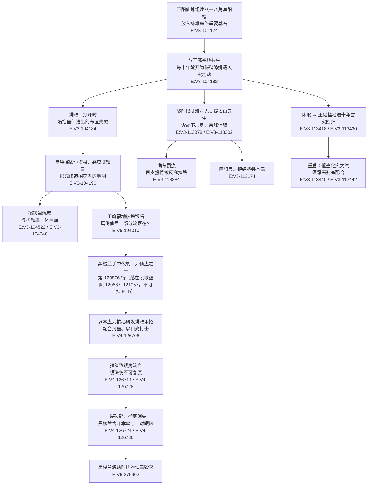

# 排难蛊

本页为 2026-09-28 A 线正式 20 页恢复批**新建页**（分片 S1-4）。全书字面命中“排难蛊”**25 处 / 去重 24 行**；`roster-3.md` 登记为 `luck_atk_5_05_gu`、`game_rank=5`、`status=rank_cap`、原文转 **7**、登记锚 `E:V4-128094`。**登记锚本身是一行正文**（方源评估黑楼兰家底），其原句写作“原本的**七转**排难蛊”；但同一场渡劫中另有第 126730 行写作「六转的排难仙蛊」`E:V4-126730`——**两处原文口径不一致，本页并列登记、不裁定**，详见《待核对》。所有引文回根原文 `source/蛊真人-clean.txt` 逐行复核，行号即 `E:V{段}-{6位行号}`。

**检索口径（必读）**

- 本批对根原文全书扫描（`open(p, encoding='utf-8', newline='').read().split('\r\n')`，437,060 行），逐条看上下文后分类如下：

| 检索串 | 处数 | 行数 | 说明 |
| --- | --- | --- | --- |
| 排难蛊 | 25 | 24 | 全名，**其中第 126706 行同一行出现 2 次**；本页主检索串 |
| 排难仙蛊 | 14 | 14 | 与全名同指的第二种写法，全部为本实体 |
| 排难之光 | 6 | 6 | 术法／光芒名，由本实体发出 |
| 排难光柱 | 2 | 2 | 同上 |
| 排难仙光 | 1 | 1 | 同上 |
| 裸用“排难”（排除以上各项） | 5 | 5 | 或为独立喊话（`E:V3-113076`“仙蛊——排难！”、`E:V4-126698`“黑楼兰动用了仙蛊排难！”），或为动作名“排难”（`E:V3-104184`“排难时”、`E:V3-104194`“利用福地排难的良机”、`E:V4-126728`“强行催动仙蛊排难”） |

- **“排难之光／光柱／仙光”虽不含“蛊”字，但均为本实体发出**，故不算同名异物；本页把它们计入同一实体的派生写法，并在分类账中单列，不计入“排难蛊／排难仙蛊”的字面命中。
- **未发现同名异物**：全书没有第二种叫“排难”的东西。这一点与同批的狗屎运蛊（专名与俗语同形）形成对照。
- 登记锚为**正文行**（非题名行）：`E:V4-128094` 逐字含“原本的七转排难蛊”。**转数另据正文** `E:V4-128094`（七转）与 `E:V4-126730`（六转）两处核定，二者冲突，见《待核对》。

## 主题档案

### 一、身份与品阶：八十八角真阳楼的主要基石之一

#### 原著事实

- **身份 = 基石**：「在组建八十八角真阳楼时，放进一只“排难蛊”，当做八十八角真阳楼的重要基石」`E:V3-104174`；「排难仙蛊，是构成八十八角真阳楼的基石之一。也是巨阳意志目前可以调动的，有限的手段之一」`E:V3-112588`；「它由无数的小塔楼组成，排难蛊是主要基石之一」`E:V3-104598`；「由成千上万的小塔楼组成，排难蛊是主要基石之一」`E:V3-109562`；「排难仙蛊乃是八十八角真阳楼基石之一，绝不容有失！」`E:V3-113286`。
- **流派 = 运道**：「排难蛊、招灾蛊，这就是运道流派的蛊虫」`E:V3-104524`；招灾蛊一方亦明文「乃是炼道宗师墨瑶，通过八十八角真阳楼中的排难蛊感应，炼制而成的仙蛊」`E:V3-104522`。
- **转数**：机制 [已确认] —— 本实体是**仙蛊**且是**真阳楼基石**（`E:V3-104598`、`E:V3-112588`、`E:V3-113286`）；具体数值 [待取证] —— 原文两处自相不一致：`E:V4-128094` 作「原本的七转排难蛊」，`E:V4-126730` 作「六转的排难仙蛊」`E:V4-126730`。
- **传说中的器物**：「这个！难道便是传说中的排难蛊不成？」`E:V3-112584`（耶律桑语），说明其名声在“传说”层级。

#### 合理推导

- **依据**：基石身份由五处独立行重复陈述（`E:V3-104174`、`E:V3-104598`、`E:V3-109562`、`E:V3-112588`、`E:V3-113286`）；**结论**：排难蛊不是一件可自由携带的装备，而是**建筑构件级**的存在——它被“放进”真阳楼，其功能与楼、与王庭福地绑定；**不确定性**：`E:V3-104174` 的引号（“排难蛊”）与后面数处直述的写法不同，无法据此判断是首次命名还是转述他人说法。
- **依据**：`E:V3-104522`、`E:V3-104524`；**结论**：招灾蛊是**对排难蛊的感应产物**，两者存在“原型→仿制”的炼制方向（墨瑶以排难蛊为感应源，炼出招灾蛊）；**可能反例**：`E:V3-104248` 又写“一体两面，一个招灾，一个排难”，把二者写成**对等**关系而非仿制关系——两种表述并存，本书未统一。

#### 《问真》设计意义

- 把“建筑基石”与“可拥有仙蛊”合并为同一实体，是**场景绑定型仙蛊**的样板：能力上限由所在地理／建筑决定，而不是由持有者决定。设计上宜给此类蛊一个“归位”状态——离开绑定地即能力衰减或失效。
- 与招灾蛊构成一组**可对照的运道双生**：设计上应保留“感应炼成”与“一体两面”两条路径都能成立的开放接口，而不是二选一钉死。

### 二、核心机制：与王庭福地共生，每十年敞开隐秘缝隙把灾劫排遣出去

#### 原著事实

- **共生周期与排遣动作**：「原来王庭福地与八十八角真阳楼共生，每隔十年，都会引来强大浩瀚的天灾地劫。这时就需要王庭福地敞开一丝缝隙，配合排难蛊，将灾劫排遣出去」`E:V3-104182`。
- **排难口的副作用**：「排难时，王庭福地打开一丝隐秘缝隙，洪水般的灾劫排放出去，仙尊隔绝蛊仙进出的布置就起不了作用」`E:V3-104184`；此漏洞被利用：「在其中，墨瑶将雏形彻底温养成形，便带着招灾蛊，利用福地排难的良机，偷偷潜回外界」`E:V3-104194`。
- **休眠的代价**：「排难蛊的休眠，令王庭福地也开始遭受雪灾的侵袭」`E:V3-113418`；「现在排难蛊休眠，王庭福地和北原外界沟通起来，自然就引起十年大雪灾的回归」`E:V3-113430`。
- **重启条件**：「那就是催动排难蛊，消除天劫地灾，化为天气地气。再叫王庭福地吸纳这些天地之气，稳固根本，重新关闭，和北原隔绝」`E:V3-113440`；「巨阳意志可以冒着风险，勉强催动排难蛊。但要让王庭福地主动吸纳天地之气，非得霜玉孔雀配合才行」`E:V3-113442`。

#### 合理推导

- **依据**：`E:V3-104182`（周期十年）＋`E:V3-104184`（隐秘缝隙）＋`E:V3-104194`（被墨瑶用作潜入窗口）＋`E:V3-113418`／`E:V3-113430`（休眠即雪灾回归）；**结论**：排难蛊的真正机制是**把王庭福地内部的灾劫“导出”到北原外界**，而不是消灭灾劫——它是一个排洪闸门，因此“打开闸门”与“保持隔绝”天然互斥，成为可被反复利用的结构性破绽；**不确定性**：原文明写“将灾劫排遣出去”，但是否**全部**排往外界、外界承受多少，未给数据。
- **依据**：`E:V3-113440`、`E:V3-113442`；**结论**：催动不是单一动作，而是**三段式**（催蛊→消灾化气→福地吸纳），第二段必须由霜玉孔雀配合；**可能反例**：`E:V3-113310` 写「巨阳意志不能叫排难蛊牺牲，也不能令太白云生死亡」，说明“牺牲排难蛊”曾被列为一种备选手段——即存在“以毁蛊换效果”的激进用法，与常规三段式并存。

#### 《问真》设计意义

- 这是**“代价外溢”型机制的教科书样本**：排遣灾劫的收益归王庭福地（内部），成本由北原外界承担。设计上宜做成“区域状态”而不是“单体 Buff”，且把区域状态计入世界模拟，让玩家能观测到“某地每隔十年遭灾”的长期规律。
- “休眠即灾劫回归”给了一个**无战斗力的长期压力源**：适合做成长线任务的时间轴——玩家必须按期回到某点维持系统运转，否则世界自行恶化。

### 三、战斗用途：排难之光／光柱，令天劫地灾威力骤降甚至泯灭

#### 原著事实

- **能力陈述**：「运道排难蛊，可以排遣天劫地灾，使其威力骤降，甚至直接泯灭于无形当中！如果我能得到这只仙蛊……」`E:V3-112586`（黑楼兰心动语）。
- **实战表现**：「排难之光，照在太白云生周围，消弭雷球，洞穿狼烟」`E:V3-113078`；「排难光柱绽放炫目光辉，也旋即爆发，笼罩太白云生」`E:V3-113188`；「见自己被排难之光笼罩，灾劫不加身」`E:V3-113302`；「排难之光陡然消失！」`E:V3-113304`；「幸亏有排难仙蛊的光柱，保住他肉身安全」`E:V3-113254`。
- **作为攻势**：「排难蛊爆发出道道光柱，四下闪射」`E:V3-118242`；「排难之光直射，上千只风刃成群结队呼啸而去」`E:V3-118304`；「灼热火焰、排难仙光、霜结冻气……」`E:V3-118388`。
- **被“借用”而非归属本人**：「几次冲击之下，令他能够强行抽取一丝黄杏仙元。催动了排难蛊之后，他又调动真传秘境中的人气仙蛊」`E:V3-112592`——催动者是**巨阳意志**（借耶律桑之手），不是排难蛊的“主人”。
- **以蛊为核心研发杀招**：「这样的威力，绝非排难仙蛊的简单运用，而是配合了凡蛊。通过目光打击，使得排难之光更加凝实，更加精准。换句话说，这是黑楼兰已经研发了以仙蛊排难蛊为核心的仙道杀招！」`E:V4-126706`；「黑楼兰天资卓绝，得到排难蛊没多久，就研发了仙道杀招？」`E:V4-126708`。

#### 合理推导

- **依据**：`E:V3-112586`（威力骤降／泯灭）＋`E:V3-113302`（灾劫不加身）＋`E:V3-118304`（排难之光直射可成攻势）；**结论**：排难之光对**灾劫类**效果极强（近乎免疫），但其“直射”形态也能当普通攻击手段用——也就是说它作用的是**灾劫／负面现象**这一类别，而非单纯防御；**不确定性**：原文没有给出它对“人为攻击”的效果描述，`E:V4-126706` 只说“配合了凡蛊……更加凝实”，仍指向打击性。
- **依据**：`E:V3-112592`（巨阳意志催动）＋`E:V4-126706`（黑楼兰以本蛊研发杀招）；**结论**：同一只排难蛊在不同使用者手里表现层级不同（预设运转 vs 自研杀招），说明**“蛊的能力”与“使用者的开发程度”是两条独立轴**；**可能反例**：`E:V4-126706` 的力量来源被判为“配合了凡蛊”，即威力提升部分可能来自凡蛊配合而非蛊本身。

#### 《问真》设计意义

- “灾劫不加身”是**类别免疫**而非数值护盾，设计上宜实现为“对指定标签（灾劫类）的效果减免／失效”，而不是加大防御面板——这样才能和“对攻防腾挪没有任何帮助”这类写法并存（后者见同批狗屎运蛊页）。
- 巨阳意志“借手催动”的写法，提供了**“器物意志代为操作已有仙蛊”**的合法接口：设计上可把“遗产／意志”做成能临时驱动建筑基石的 actor，而不必为其新造一套能力。

### 四、代价与反噬：满布裂痕将被反噬摧毁

#### 原著事实

- **支援的极限**：「而最关键的是，排难仙蛊已经满布裂痕，再对太白云生支援下去，恐怕就要被反噬之力摧毁了」`E:V3-113284`。
- **不能牺牲**：「巨阳意志不能叫排难蛊牺牲，也不能令太白云生死亡」`E:V3-113310`；「巨阳意志绝不会为了太白云生，而牺牲掉这只珍贵的仙蛊」`E:V3-113174`。
- **损耗的现实**：黑楼兰一侧的收束——「手掌中，紧紧捏住的排难蛊，更是出现裂痕，发出丝丝的哀鸣」`E:V4-126714`；「砰的一声，她手中的排难仙蛊也自爆破碎，碎片化作点点光辉，从她手指缝隙泄露出来，旋即彻底消失」`E:V4-126724`。
- **支付方／受益方／时点**（逐项写明）：支付方 = **排难蛊自身**（裂痕→自爆破碎→毁灭，`E:V4-126724`、`E:V4-126730`、`E:V6-375902`）＋黑楼兰本人的一对眼珠（`E:V4-126736`）；受益方 = 被排难之光笼罩者（太白云生，`E:V3-113302`、`E:V3-113254`）与施术者本人渡劫（`E:V4-126736` 语境）；支付时点 = **每次催动时即时累积**（`E:V3-113284` 明写“再支援下去……就要被摧毁”）。

#### 合理推导

- **依据**：`E:V3-113284`（满布裂痕→反噬摧毁）＋`E:V4-126714`（出现裂痕、哀鸣）＋`E:V4-126724`（自爆破碎）；**结论**：排难蛊是**消耗品性质的可逆损**——不是“用一次消耗一个”，而是**每次使用都在累积不可逆损伤**，直到某一刻断裂；**不确定性**：损伤是否有恢复手段（如重炼、修补），原文未写。
- **依据**：`E:V4-126736`＋`E:V4-126728`；**结论**：代价会**外溢到使用者肉体**（眼珠伤不能复原，因“运道道痕残留在眼窝上”）；**可能反例**：黑楼兰是大力真武体、“恢复力惊人”（`E:V4-126728`），若换作体质不同者，外溢程度可能不同，原文未给对照。

#### 《问真》设计意义

- 把“使用”实现为**耐久度累积消耗**而非一次性销毁，能产生“越到关键时刻越不敢用”的长期压力，比“一次性消耗蛊”更适合可反复出场的基石类器物。
- “反噬残留道痕致不可复原”给出了**不可逆伤残**的合法表述——设计上宜把这类伤残做成持久状态并占用一个状态位，从而让玩家在“救场”与“保己”之间真做取舍。

### 五、与招灾蛊的关系：一体两面（身份边界，不是别名）

#### 原著事实

- **对等表述**：「它和排难蛊可谓一体两面，一个招灾，一个排难」`E:V3-104248`。
- **同一流派**：「排难蛊、招灾蛊，这就是运道流派的蛊虫」`E:V3-104524`。
- **感应炼制**：「乃是炼道宗师墨瑶，通过八十八角真阳楼中的排难蛊感应，炼制而成的仙蛊」`E:V3-104522`；「随后，她冒着惊醒巨阳意志的危险，将小塔楼摧毁，利用伟力回流，感应排难蛊，形成酿造“招灾蛊”的地洞」`E:V3-104190`。
- **两者是不同的仙蛊实体**：招灾蛊被记为方源亲手掌握的一只独立仙蛊（“方源手握的招灾蛊”`E:V3-104522`），而排难蛊是**真阳楼基石**、且在别处独立于招灾蛊单独损毁（`E:V4-126730`、`E:V6-375902`）。

#### 合理推导

- **依据**：`E:V3-104248`（一体两面）＋`E:V3-104522`／`E:V3-104190`（招灾蛊由排难蛊感应炼成）；**结论**：二者是**两个实体、一对功能对偶**——“一体两面”是修辞，不是同一性声明；因此本页**不把“招灾蛊”写入 aliases**，只在此专节说明关系；**不确定性**：原文明写“一体两面”，若把它读作“同一实体的两种表现”，与“两只蛊分别被不同人持有、分别损毁”的记载冲突——本页以冲突事实为准，保留两种读法并标出。

#### 《问真》设计意义

- “对偶蛊对”可作为**模板默认结构**：一对蛊共享同一流派标签、在语义上互为反面（招灾／排难、增幅／削减），但各有独立 id、独立持有者与独立损毁记录。设计上宜在关系表里给“对偶”一种边类型，并明确它**不等于**“同一实体”。
- 建议在 runtime 层为对偶边附加“感应炼制”可选属性，使“A 可炼出 B”成为可被脚本消费的规则，而不是仅存在于页面的描述。

### 六、真传归属：众生运真传的一部分

#### 原著事实

- **明列入真传**：「连运仙蛊、断运仙蛊、排难仙蛊，就是众生运真传中的一部分。王庭福地被方源捣毁之后，这些仙蛊一部分流落在外。至于修行的具体内容，已成绝响」`E:V5-194010`。
- **方源的诉求**：「若我有排难仙蛊。那我便可直接学习王庭福地，将灾劫排到外界去了」`E:V5-194014`；「就算这份己运真传中。没有类似排难仙蛊的存在」`E:V5-194016`。
- **与鸿运齐天蛊分属不同真传**：鸿运齐天蛊被记为**众生运的巅峰精髓**（`E:V5-230260`），而排难蛊只在“众生运真传中的一部分”这一层被列出——**同属众生运，但层级不同**（一是精髓、一是组成部分）。

#### 合理推导

- **依据**：`E:V5-194010`（连运／断运／排难并列）＋`E:V5-194014`／`E:V5-194016`（己运真传中“没有类似排难仙蛊的存在”）；**结论**：排难蛊是**可被列出、但不可被完整复刻**的真传组件——“具体内容已成绝响”意味着它的修行法门已失传，后世（黑楼兰、方源）只能凭蛊本身反推用法；**不确定性**：`E:V5-194010` 说“一部分流落在外”，排难蛊是否属于流落那部分、以及黑楼兰如何得到，原文在本页取证窗口内未见明文。

#### 《问真》设计意义

- “真传组件”与“真传精髓”应做成**两级可继承资产**：组件可散落、可被个人捡到并自行开发（黑楼兰自研杀招即为范例），精髓则绑定传承人。这让知识流失（“已成绝响”）成为可玩的世界状态。
- 设计上宜给“失传组件”一个特殊标记：它仍可被使用（有蛊在），但**不能升级、不能教学**——直接对应原文“已成绝响”的表述。

### 七、身份边界：不是招灾蛊、不是“灾蛊”

#### 原著事实

- **与招灾蛊**：见主题五。关键行：`E:V3-104248`、`E:V3-104522`、`E:V3-104524`。
- **“灾蛊”不是独立实体**（本页实测）：全书含“灾蛊”的行与含“招灾蛊”的行**完全相同（差集为空）**，因此“灾蛊”是“招灾蛊”的**后缀子串**，不是第二只蛊。`roster-3.md` 中灾蛊没有独立登记行（其 id 疑为 `heaven_atk_1_12_gu`）——**本页不并入、不改写对方页面**，仅在此登记边界。
- **与定仙游**：第 120876 行（落在段域空隙 120867–121057，不可挂 E-ID） 把三者并列为黑楼兰手中仅剩的三只仙蛊（“凭你的奴隶蛊、排难蛊，还是定仙游？这可是你仅剩下的三只仙蛊”），是**并列**而非同一。
- **与凡蛊层级**：招灾蛊一侧有“配合了凡蛊”的记述（`E:V4-126706`），说明本实体是**仙蛊**，凡蛊是被它调用的辅具——与同批魂灯蛊（原文称“只是凡蛊而已”）恰好相反，二者不可互推。

#### 合理推导

- **依据**：`E:V3-104524`／`E:V3-104248`（对偶而非同一）＋本页对“灾蛊／招灾蛊”行集的差集实测为空；**结论**：命名预筛阶段最容易被误判为“两个实体”的，正是这类**后缀子串**关系（“灾蛊”⊂“招灾蛊”）与**修辞对偶**（“一体两面”）；**不确定性**：`heaven_atk_1_12_gu` 是否确实指灾蛊，本页未取得直接证据，只登记“疑为”。

#### 《问真》设计意义

- 建议把“前缀／后缀子串冲突”列为**命名校验器的必测项**：凡新实体名是既有实体名的子串，必须人工给出差集证据，否则拒绝登记——本页的“差集为空”即一份可直接复用的证据格式。
- “对偶”“仅剩三只”这类并列句式，设计上宜由关系表承载（对偶边、库存边），避免被误读成同一实体的别名。

### 八、沿革：从真阳楼基石到黑楼兰手中毁灭

#### 原著事实

- **入楼**：`E:V3-104174`（组建真阳楼时放入）、`E:V3-104598`、`E:V3-109562`（主要基石之一）。
- **被感应**：`E:V3-104190`（墨瑶摧毁小塔楼、感应排难蛊、形成酿造招灾蛊的地洞）。
- **被“传说”化**：`E:V3-112584`、`E:V3-112586`、`E:V3-112588`。
- **支援太白云生**：`E:V3-113078`、`E:V3-113188`、`E:V3-113254`、`E:V3-113302`、`E:V3-113304`；期间巨阳意志拒绝牺牲它（`E:V3-113174`、`E:V3-113310`）。
- **休眠与雪灾**：`E:V3-113418`、`E:V3-113430`；重启需霜玉孔雀配合（`E:V3-113440`、`E:V3-113442`）。
- **转手至黑楼兰**：第 120876 行（落在段域空隙 120867–121057，不可挂 E-ID）（她仅剩的三只仙蛊之一）。
- **自爆损毁**：`E:V4-126714`、`E:V4-126724`、`E:V4-126730`、`E:V4-126736`、`E:V6-375902`。
- **余响**：`E:V4-128094`（方源评估黑楼兰家底时点出“原本的七转排难蛊。已经在渡劫时毁掉”）。

#### 合理推导

- **依据**：沿革链上“入楼（基石）→被感应→被传说化→被借用支援→休眠→转手→自爆”共七段；**结论**：排难蛊的生命史**先绑定建筑、后脱离建筑进入个人持有**，这一转折发生在“王庭福地被捣毁／仙蛊流落在外”的语境（`E:V5-194010`）；**不确定性**：从“流落在外”到“黑楼兰手中”之间缺少明文环节，属取证空缺，按纪律记为“尚未找到”，不作“原著没有”。

#### 《问真》设计意义

- 这段沿革演示了**建筑绑定物如何转为个人藏品**：设计上宜允许基石类蛊在建筑被毁后进入“流落”状态池，再被个人事件拾取，从而自然产生“同一件国宝级的器物出现在私人手中”的叙事。

## 状态时间线

| 状态 ID | 阶段 | 状态 | 证据 |
| --- | --- | --- | --- |
| ST-PAINAN-01 | 入楼 | 被巨阳仙尊放进真阳楼，成为主要基石之一 | E:V3-104174、E:V3-104598、E:V3-109562 |
| ST-PAINAN-02 | 日常运转 | 与王庭福地共生，每十年配合福地敞开隐秘缝隙排遣天灾地劫 | E:V3-104182 |
| ST-PAINAN-03 | 结构性破绽 | 排难口打开时，隔绝蛊仙进出的布置失效 | E:V3-104184 |
| ST-PAINAN-04 | 被感应 | 墨瑶摧毁小塔楼、利用伟力回流感应排难蛊，形成酿造招灾蛊的地洞 | E:V3-104190 |
| ST-PAINAN-05 | 传说层 | 被耶律桑认作“传说中的排难蛊”，令黑楼兰怦然心动 | E:V3-112584、E:V3-112586 |
| ST-PAINAN-06 | 巨阳意志可调动 | 被列为巨阳意志目前可以调动的有限手段之一 | E:V3-112588 |
| ST-PAINAN-07 | 支援太白云生 | 排难之光、排难光柱笼罩太白云生，消弭雷球、洞穿狼烟，灾劫不加身 | E:V3-113078、E:V3-113188、E:V3-113302 |
| ST-PAINAN-08 | 拒绝牺牲 | 巨阳意志宁可放弃支援，也不牺牲这只珍贵仙蛊 | E:V3-113174、E:V3-113310 |
| ST-PAINAN-09 | 损耗 | 满布裂痕，继续支援恐被反噬之力摧毁 | E:V3-113284 |
| ST-PAINAN-10 | 休眠 | 休眠导致王庭福地遭受雪灾，十年大雪灾回归 | E:V3-113418、E:V3-113430 |
| ST-PAINAN-11 | 重启条件 | 需催动排难蛊化灾为气，并由霜玉孔雀配合福地吸纳 | E:V3-113440、E:V3-113442 |
| ST-PAINAN-12 | 转手 | 成为黑楼兰手中仅剩的三只仙蛊之一（奴隶蛊、排难蛊、定仙游） | 第 120876 行（落在段域空隙 120867–121057，不可挂 E-ID） |
| ST-PAINAN-13 | 黑楼兰改发 | 以本蛊为核心研发“排难”仙道杀招，配合凡蛊、以目光打击 | E:V4-126706、E:V4-126708 |
| ST-PAINAN-14 | 反噬外溢 | 强催致眼角流血，眼珠伤势因运道道痕残留眼窝而无法复原 | E:V4-126714、E:V4-126728 |
| ST-PAINAN-15 | 损毁 | 自爆破碎，彻底消失；渡劫前被主动舍弃 | E:V4-126724、E:V4-126730、E:V4-126736 |
| ST-PAINAN-16 | 事后核定 | 方源评估黑楼兰家底时确认“原本的七转排难蛊。已经在渡劫时毁掉” | E:V4-128094 |
| ST-PAINAN-17 | 归属登记 | 被列为众生运真传的一部分（连运、断运、排难）；具体内容已成绝响 | E:V5-194010 |
| ST-PAINAN-18 | 终局 | 黑楼兰渡劫时排难仙蛊毁灭 | E:V6-375902 |

## 原著明确内容（本批取证窗口登记）

| 窗口 | 内容 | 对应主题 |
| --- | --- | --- |
| 104170–104176 | 巨阳仙尊组建八十八角真阳楼时放入排难蛊，作为重要基石 | 主题一 |
| 104182–104186 | 与王庭福地共生，每十年敞开缝隙排遣天灾地劫；排难时隔绝布置失效 | 主题二 |
| 104188–104196 | 墨瑶摧毁小塔楼、感应排难蛊，形成酿造招灾蛊的地洞；并借福地排难之机潜回外界 | 主题一／主题五 |
| 104246–104250 | 招灾蛊成形借助排难蛊；“一体两面，一个招灾，一个排难” | 主题五 |
| 104520–104524 | 招灾蛊由墨瑶通过排难蛊感应炼成；二者同属运道流派 | 主题一／主题五 |
| 104596–104600 | 真阳楼由无数小塔楼组成，排难蛊是主要基石之一 | 主题一 |
| 109560–109564 | 同上（另一处复述） | 主题一 |
| 112584–112592 | 耶律桑震撼、黑楼兰心动；巨阳意志催动排难蛊，并调动人气仙蛊 | 主题一／主题三 |
| 113074–113080 | “仙蛊——排难！”；排难之光消弭雷球、洞穿狼烟 | 主题三 |
| 113136–113140 | 独立喊话行“排难蛊！” | 主题三 |
| 113166–113176 | 排难仙蛊也不例外；其为真阳楼基石、用来给王庭福地排难，巨阳意志绝不牺牲它 | 主题一／主题四 |
| 113186–113190 | 排难光柱爆发，笼罩太白云生 | 主题三 |
| 113252–113256 | 幸亏有排难仙蛊的光柱保住肉身 | 主题三 |
| 113284–113288 | 满布裂痕，再支援将被反噬摧毁；“绝不容有失” | 主题四 |
| 113300–113312 | 被排难之光笼罩则灾劫不加身；光陡然消失；巨阳意志不能叫排难蛊牺牲 | 主题三／主题四 |
| 113416–113444 | 休眠令王庭福地遭雪灾；重启需化灾为气、霜玉孔雀配合 | 主题二 |
| 118236–118244 | “排难蛊！”；排难蛊爆发道道光柱四下闪射 | 主题三 |
| 118302–118306 | 排难之光直射，风刃与火鸦随行 | 主题三 |
| 118386–118390 | 排难仙光与灼热火焰、霜结冻气并列 | 主题三 |
| 120874–120878 | 黑楼兰仅剩三只仙蛊：奴隶蛊、排难蛊、定仙游 | 主题七 |
| 126694–126710 | 排难之光；动用仙蛊排难；两道排难光柱；方源判为“以仙蛊排难蛊为核心的仙道杀招” | 主题三 |
| 126712–126738 | 强催致眼角流血、眼珠伤不可复原（运道道痕残留）、排难仙蛊自爆破碎、六转损毁、舍弃本蛊与一对眼珠 | 主题四 |
| 128092–128098 | 方源评估家底；“原本的七转排难蛊。已经在渡劫时毁掉” | 主题四／《待核对》 |
| 194008–194018 | 连运、断运、排难为众生运真传之一部分；己运真传中无类似存在 | 主题六 |
| 375900–375904 | 排难仙蛊在黑楼兰渡劫时毁灭 | 主题八 |

## 事件链

## 资料整理

### 一、命名检索口径与逐条分类账（本页核心交付之一）

字面“排难蛊”全书 **25 处 / 24 行**；“排难仙蛊”**14 处 / 14 行**。逐条分类（行号可直接按段域表换算为 `E:V{段}-{6位行号}`，如 104174 → `E:V3-104174`、128094 → `E:V4-128094`）：

| 分类 | 行数 | 行号清单 |
| --- | --- | --- |
| 全名“排难蛊”（含 126706 行 2 次） | 24 | 104174、104182、104190、104248、104522、104524、104598、109562、112584、112586、112592、113138、113310、113418、113430、113440、113442、118238、118242、120876、126706、126708、126714、128094 |
| “排难仙蛊”写法 | 14 | 112588、113168、113174、113254、113284、113286、126706、126724、126730、126736、194010、194014、194016、375902 |
| “排难之光” | 6 | 113078、113302、113304、118304、126696、126706 |
| “排难光柱” | 2 | 113188、126704 |
| “排难仙光” | 1 | 118388 |
| 裸用“排难”（不含以上各串） | 5 | 104184、104194、113076、126698、126728 |

**全部命中均为本实体**：无一条“排难”属于同名异物或无关词——这是本页与同批狗屎运蛊（专名与俗语同形，需剔除 16 行）的关键差异。

### 二、跨页与登记记录处置

- `roster-3.md` 的 `luck_atk_5_05_gu` 行逐字为：`| luck_atk_5_05_gu | 排难蛊 | 5 | 7 | E:V4-128094 |  |`。本页复核：登记锚**可定位且该行逐字含“排难蛊”**（`E:V4-128094` 为“原本的七转排难蛊。已经在渡劫时毁掉”），锚点有效；但同一场渡劫另有第 126730 行作「六转的排难仙蛊」`E:V4-126730`——**登记转数 7 与原文另一处 6 冲突**，本页并列登记，详见《待核对》。
- `game/data/gu_lore.json` 的对应条目实测逐字为 `{"id": "luck_atk_5_05_gu", "name": "排难蛊", "game_rank": 5, "status": "rank_cap", "lore_rank": 7, "anchor": "E:V4-128094"}`（只读核对，不在本批改动范围）。
- `luck-atk-1-03-gu.md`（招灾蛊，既有页）的排难相关引文位于第 126696–126736 行一段，该书页**只作页内出处、未挂 E-ID 行锚**；本页对该段各行给出了显式 E-ID。**本页不改动该页**，仅登记此观察。
- 灾蛊：`roster-3.md` 无独立登记行（其 id 疑为 `heaven_atk_1_12_gu`）。本页实测含“灾蛊”的行与含“招灾蛊”的行**差集为空**，即“灾蛊”是“招灾蛊”的后缀子串，**不并入本页 aliases、也不并入招灾蛊的 aliases**，只在主题七登记边界。

## 分析与解读

- **这是一只“基础设施型”仙蛊，而不是装备型仙蛊。** 五处独立行把它说成真阳楼的“基石”（`E:V3-104174`、`E:V3-104598`、`E:V3-109562`、`E:V3-112588`、`E:V3-113286`），同时它的核心动作（每十年排遣天灾地劫，`E:V3-104182`）纯粹是**系统维护**，与战斗无关。真正把它当武器用的，是后来的个人持有者（黑楼兰，`E:V4-126706`）——**同一实体的功能性在两个时期完全不同**，这是本页最值得记录的一点。
- **它把“代价”写在了三处不同对象上**：自身（裂痕→自爆，`E:V4-126724`）、绑定地（休眠即雪灾，`E:V3-113418`）、使用者（眼珠不可复原，`E:V4-126728`）。三者互相独立，构成一个**多点代价模型**，比“使用消耗真元”复杂得多。
- **它的“排难”本质是转移而非消除**：`E:V3-104184` 明写灾劫被“排放出去”到外界，这是**零和**而非净化。设计上如果做成“消除灾劫”，会直接与原文冲突。
- **代价会外溢到使用者肉体且不可逆**（`E:V4-126728`“运道道痕残留在眼窝上，让她无法复原”），这与同批鸿运齐天蛊“效果延续至肉身死亡”的长期性形成对照：**一个是长期增益，一个是永久损伤**。

## 待核对

- **原文口径冲突（须并列，不裁定）**：同一场渡劫中，排难蛊的转数出现两种写法。
  - 口径 A：**七转**。证据：`E:V4-128094`「原本的七转排难蛊。已经在渡劫时毁掉」；`roster-3.md` 登记原文转 7，登记锚亦为 `E:V4-128094`。
  - 口径 B：**六转**。证据：`E:V4-126730`「六转的排难仙蛊，也因此损毁。成为绝唱。」
  - 当前状态：**并列登记，本页不裁定**；妥善做法是由校验组回原文两处上下文复核（126724–126738 为同一自爆过程的连续描写，128094 为事后评估）。本批不修改 roster-3。
- **登记锚性质说明**：`E:V4-128094` 是**正文行**（方源评估黑楼兰家底），不是题名行；其转数表述“七转”来自该行正文自身，故**转数另据正文**而非据题名。
- **黑楼兰如何得到排难蛊**：`E:V5-194010` 只说真传仙蛊“一部分流落在外”，从流落到他手中的环节**尚未找到**明文——按纪律记为“尚未找到”，**不得写成“原著没有”**。
- **排难蛊损伤可否恢复**：`E:V3-113284`（满布裂痕）、`E:V4-126724`（自爆破碎）之外，未见修补／重炼的明文，**尚未找到**。
- **黑楼兰得到本蛊的时间点与 120876 行“仅剩三只”的时点先后**：第 120876 行（落在段域空隙 120867–121057，不可挂 E-ID） 与 `E:V4-126698` 之间的具体时间间隔无明文。
- **“灾蛊”与 `heaven_atk_1_12_gu` 的对应关系**：本页只验证到“灾蛊是招灾蛊的后缀子串、非独立实体”，**未取得** `heaven_atk_1_12_gu` 即灾蛊的直接证据（属他人负责范围，仅登记）。
- **段域空隙事实（供全批复用）**：本页引用的第 120876 行（黑楼兰仅剩三只仙蛊）**落在第 3 段与第 4 段之间的空隙**（120867–121057），模糊推导出“落隙即非法”的校验规则下**不得挂 E-ID**。本页因此改以行号口径登记该行（见主题七、主题八、状态表 ST-PAINAN-12、事件图）；**该行是本批已发现的空隙命中，请校验组重点复核其余页面是否存在同类情形**。
- 本页未超 40 KB；如后续增补导致超限，按 GOVERNANCE 在本节登记例外。

## 模板扩展建议（只登记，不改核心模板）

1. **建议新增“绑定关系”字段**：本实体的能力上限由绑定地（王庭福地／八十八角真阳楼）决定，而非由持有者决定。当前模板无专位，只能在主题节内文字描述。
2. **建议新增“对偶边”关系类型**：用于表达“一体两面”这类**成对但非同一**的实体关系，并明确该边**不得**被读物化为 aliases——本页主题五即为该边的写法样例。
3. **建议为“子串冲突”加一个固定小节**：凡本实体名是既有实体名的后缀／前缀子串（如“灾蛊”⊂“招灾蛊”），模板应留出位置登记“差集证据”，以免在命名预筛阶段被误判为独立实体。
4. **建议状态时间线支持同一阶段多口径**：本页 ST-PAINAN-16（七转）与 ST-PAINAN-15（六转损毁）在原文中并列，模板宜允许同一转数字段挂两条证据而由页面注明冲突。

## 关联页面

- [luck-atk-1-03-gu.md](luck-atk-1-03-gu.md)（招灾蛊，本页对偶实体，**不是别名**）
- [luck-atk-5-01-gu.md](luck-atk-5-01-gu.md)（鸿运齐天蛊，同为巨阳仙尊运道真传，层级不同）
- [luck-atk-5-04-gu.md](luck-atk-5-04-gu.md)（狗屎运蛊，同批运道仙蛊）
- [../world/luck-path.md](../world/luck-path.md)（运道）
- [../world/north-plain.md](../world/north-plain.md)（北原）
- [../events/royal-court.md](../events/royal-court.md)（王庭福地）
- [../events/true-yang-collapse.md](../events/true-yang-collapse.md)（真阳楼之变）
- [../characters/he-lou-lan.md](../characters/he-lou-lan.md)（黑楼兰）
- [../rules/tribulation.md](../rules/tribulation.md)（天劫地灾）
- [gu-relations.md](gu-relations.md)
- [roster-3.md](roster-3.md)
