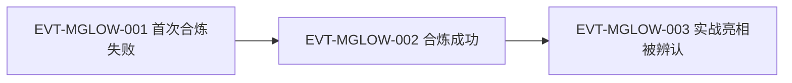

# 月芒蛊

月光蛊合炼晋升线上的二转进攻蛊：由一只月光蛊与两只小光蛊合炼而成，月刃攻击力达月光蛊三倍。本页按 schema v2 组织——合炼个案、增量规则与实战证据均以 ID 为骨架（ST-/EVT-/E:），可沿 Claim → Event/State → Evidence → Raw 追溯。P5 扩容批（2026-09-26）补齐 P4 判定时挂账的实体页缺口。

## 原著明确内容

- 合炼配方与定位（根原文 `蛊真人-clean.txt` 15710–15712 行）：月光蛊和两只小光蛊可以合炼成二转的月芒蛊；月芒蛊代表进攻能力的上涨（同段对照白豕蛊+玉皮蛊合练白玉蛊主防御）。
- 增量规则（17148 行）：一只小光蛊能增幅月刃一倍的攻击力，两只小光蛊仍旧是一倍，这种增幅不能叠加——与小光蛊协同页的单向结论互证。
- 合炼结果（17144–17150 行）：合炼成的二转月芒蛊，攻击力达到月光蛊的三倍。
- 方源战力盘点（17316、17342 行）：白玉蛊、月芒蛊都已合炼成功，攻守兼备；"进攻有月芒蛊，治疗有九叶生机草"，尚缺侦测与移动类蛊虫。
- 实战亮相（17470、17502 行）：方源发出月芒蛊的月刃，旁观者辨认"那绝不是月光蛊，而是月芒蛊"。
- 战术位（16766 行）：方正若下战术约方源斗蛊，按族规方源必须接受——在不能暴露白玉蛊的前提下，用月光蛊应战不足，除非是月芒蛊。

## 状态时间线

| 状态 ID | 阶段 | 状态 | 证据 |
|---|---|---|---|
| ST-MOONGLOW-01 | 动机/规划 | 方源盘点合炼路线：月光蛊+两只小光蛊→二转月芒蛊，进攻能力上涨 | E:V1-015710（15710–15712 行） |
| ST-MOONGLOW-02 | 合炼失败（个案） | 方源首次合炼月芒蛊失败 | E:V1-017052 |
| ST-MOONGLOW-03 | 合炼成功（方源个案） | 一只月光蛊+两只小光蛊合炼成二转月芒蛊；攻击力达月光蛊三倍，与白玉蛊攻守兼备 | E:V1-017144（17144–17150 行）、E:V1-017316 |
| ST-MOONGLOW-04 | 增量规则 | 一只小光蛊增幅月刃一倍攻击力；两只仍一倍，增幅不可叠加 | E:V1-017148 |
| ST-MOONGLOW-05 | 使用 | 月芒蛊月刃实战亮相，旁观者辨认为月芒蛊而非月光蛊 | E:V1-017470（17470–17502 行） |

## 事件链

| 事件 ID | 事件 | 参与者 | 证据 | 因果关系 |
|---|---|---|---|---|
| EVT-MGLOW-001 | 方源首次合炼月芒蛊失败 | 方源 | E:V1-017052 | 前置 ST-MOONGLOW-01；促使再次尝试 |
| EVT-MGLOW-002 | 合炼成功：月光蛊+双小光→二转月芒蛊 | 方源、月光蛊、小光蛊 | E:V1-017144、E:V1-017316 | causes ST-MOONGLOW-03；enables EVT-MGLOW-003 |
| EVT-MGLOW-003 | 月芒月刃实战亮相，被辨认为月芒蛊 | 方源、旁观蛊师 | E:V1-017470、E:V1-017502 | evidences ST-MOONGLOW-05 |

追溯示例："月芒蛊攻击力是月光蛊几倍？" → ST-MOONGLOW-03 → E:V1-017144 → 原文 17150 行（攻击力达到月光蛊的三倍）。

## 分析与解读

- 增量语义：小光蛊对月刃的增幅（一倍/只、不叠加）与"合炼后整体三倍"是两条不同口径——前者是小光蛊作为协同成分的增量，后者是合炼成蛊后的整体战力，见 ST-MOONGLOW-04 与 ST-MOONGLOW-03 分列。
- 战术位推断：16766 行表明月芒蛊在一转/二转对抗中具有"月光蛊不可替代"的破防位，但该处为方源的局势盘算，属于分析而非独立机制事实。
- 游戏映射（lore/runtime 侧）：月芒蛊以 roster-3 条目 + 本页承载 canon 身份；refinement relation（月光+双小光→月芒，output_rank 2）已入 Canon Runtime，游戏数据 gu.json `moon_glow_gu` 的 canon_refs=CAN-SMALL-LIGHT-002 与本页同源。

## 待核对

- 合炼失败的具体原因与损耗（17052 行前后文仅记结果）尚未穷举。
- 月芒蛊月刃的作用距离、消耗与外观细节（是否与月刃同形）未逐条核验。

关联页面：[月光蛊](moonlight-gu.md)、[小光蛊](small-light-gu.md)、[蛊的饲养与炼化](../world/gu-care-and-refinement.md)。
