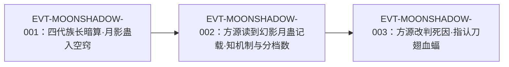

# 月影蛊

月系合炼线上的一条**非攻击分支**：由幻影月蛊为晋升基础，再上就是**四转月影蛊**。「月影蛊，能种入蛊师空窍，压制住蛊师真元的使用」，压制幅度**按目标修为分档**（四转三成／五转一成半／三转六成）。它最著名的一次使用是四代族长在战败后偷袭花酒行者，成为后者"身中月影蛊"的直接原因——但原文多次声明，这蛊**并不足以致命**。

本页为 2026-09-28 A 线恢复批**新建页**。旧版蒸馏（`roster-3.md`／`game/data/gu_lore.json`）把它的转数记为“单源明文，与 game=3 分叉待裁”，本批回原文把全部 17 处出现逐行复核，结论见主题二、主题五（**2026-09-28 复核：原记「单源明文」更正为双源 `E:V1-002648`、`E:V1-026792`，原记留档备核**）。所有引文回根原文 `source/蛊真人-clean.txt`，行号即 `E:V{段}-{6位行号}`；正文按“原著事实 → 合理推导 →《问真》设计意义”三层组织。

## 主题档案

### 一、机制：种入空窍、压制真元的使用（含分档数值）

#### 原著事实

- 作用对象与方式：「月影蛊，能种入蛊师空窍，压制住蛊师真元的使用」`E:V1-026794`。
- **分档压制幅度（原文明文数值）**：「月影蛊作用特殊，能压制四转蛊师三成真元，五转蛊师一成半，三转蛊师六成真元」`E:V1-026802`。
- 低资质者的后果：「类似方源的丙等资质，只有四五成真元的蛊师，若是中了这月影蛊，一点真元都动用不了，战斗力暴降，等若直接被废」`E:V1-026802`。
- 施放者视角的性质：「此蛊名月影，最擅隐藏」`E:V1-002648`；「虽然只有四转，却有限制元海真元之能」`E:V1-002648`。
- 受术者视角的体感：「他中了月影蛊，真元已经不能随意调动了，时间一长连元海都受到威胁」`E:V1-002668`。

#### 合理推导

- **依据**：`E:V1-026802` 的三档数值（四转三成／五转一成半／三转六成）；**结论**：压制率**随目标修为升高而下降**（三转六成 ＞ 四转三成 ＞ 五转一成半），是一条对**高修为目标更弱**的减益；同一蛊的效果由**目标**决定，而非由持有者决定；**不确定性**：原文未给二转及以下、六转及以上的档位，也未说明该数值是否与"修为差"挂钩。
- **依据**：`E:V1-002648`（「最擅隐藏」）＋`E:V1-026794`（「种入蛊师空窍」）；**结论**：这蛊的命中前提是**隐蔽性**——它能躲过久战之后的蛊师感知而进入空窍；**不确定性**：原文未写它是主动投送还是被动触发，也未写有否回避手段。
- **依据**：`E:V1-002668`（「时间一长连元海都受到威胁」）＋`E:V1-026802`（「等若直接被废」）；**结论**：压制是**持续型**而非一次性，且有**时间累积**的升级路径（真元→元海）；**不确定性**：原文未给具体的持续时间与解除方式。

#### 《问真》设计意义

- 这是原著少见的**分档数值型减益**：同一条效果对三种修为给出三个比率，且随目标变强而变弱。做系统时它天然是一条"按目标修为查表"的 `essence-suppression` 效果，而不是固定百分比——这个结构由原文自己给出，不需要设计者发明。

### 二、晋阶定位与转数明文

#### 原著事实

- **晋升关系**：「尤其是这幻影月蛊，若是合炼出来，以此为晋升基础，再往上就是四转的月影蛊」`E:V1-026792`。
- **转数明文（两处）**：「虽然只有四转」`E:V1-002648`；「四转的月影蛊」`E:V1-026792`。
- 上位形态的性质：幻影月蛊「这蛊比较特殊，不是用来进攻，一经催动，就能令蛊师化出一道幻影，起到分散火力，迷惑敌人的作用」`E:V1-026790`——即月影蛊的上位母体是**功能蛊**而非攻击蛊。
- 同窗并列的三转支线：黄金月「射程仍旧是十步不变，但是攻击威力再度增强」`E:V1-026786`；霜霖月蛊「月刃幽白冰冷，透着一股寒霜之气」`E:V1-026788`；幻影月蛊 `E:V1-026790`。三条都写在同一个"三转秘方"窗口内（`E:V1-026784`–`E:V1-026792`）。
- 方源对此蛊的既有认知：「他原先对月影蛊一知半解」`E:V1-026800`。
- 使用者指认：「月影蛊……不就是四转族长暗算了花酒行者，使用的蛊虫么？」`E:V1-026796`。

#### 合理推导

- **依据**：`E:V1-026792`（幻影月蛊为晋升基础）＋`E:V1-026790`（幻影月蛊不进攻）；**结论**：月影蛊继承了"非攻击"的路线取向——月系的三转分叉里，黄金月改威力、霜霖月改控制、幻影月改**迷惑**，而月影蛊把这条路继续推向**压制**；**不确定性**：原文未说月影蛊可否由其它蛊合炼得到，也未给其秘方。
- **依据**：`E:V1-026792`、`E:V1-002648`；**结论**：月影蛊的转数属**双源明文**（`E:V1-002648`、`E:V1-026792`；不是旁证推导），与同批[月旋蛊](light-atk-1-01-gu.md)、[月痕蛊](moon-ray-gu.md)（转数 `[原著未明确]`）形成对照；**不确定性**：无。

#### 《问真》设计意义

- “迷惑→压制”是一条**递进的控制线**：三转幻影月蛊只做假身（分散火力），四转月影蛊直接砍对手的真元池。做构筑分叉时，这条线给月系补上了"控制/削蓝"的位子，与月芒（输出）、月痕（射程）互不重叠。

### 三、战例：四代族长暗算花酒行者

#### 原著事实

- 暗算的场景：四代族长被踢中后「艰难地站起身来，脸上露出阴谋得逞的笑意」，随即报出蛊名与性质 `E:V1-002648`。
- 当时的形势：花酒行者「和我酣战良久，你身上的蛊虫也没剩几个」，故四代族长认为他「怎么能克制月影蛊」`E:V1-002648`。
- 战后推断（方源）：花酒行者「激战之后，又中了月影蛊，定然会利用元石疗伤」，因此遗藏只剩十五块元石 `E:V1-002736`。
- 结果陈述（口径 B，见主题四）：「但是最终却被月影蛊拖累死」`E:V1-002746`。
- 另一处复述：「不仅杀了四代，更铲除了大部分的家老，只是身中月影蛊」`E:V1-028052`；紧接着「月影蛊只是限制真元使用的蛊虫。并不足以致命」`E:V1-028054`。
- 结局的时间尺度：花酒行者的其余蛊在他死后「经过三百年的光阴」全部死去 `E:V1-002748`。

#### 合理推导

- **依据**：`E:V1-002648`（「最擅隐藏」＋"酣战良久"后出手）；**结论**：月影蛊在战例中的使用条件是**对手消耗之后**乘虚而入——这一条与主题一的"隐蔽性前提"互为印证；**不确定性**：原文未写四代族长是在何时把蛊送入的。
- **依据**：`E:V1-002736`、`E:V1-002746`；**结论**：月影蛊的实际后果是**切断受术者的续航**（不能用真元疗伤／调运），最终以"拖累"的形式参与致死，而非直接打击；**不确定性**：`E:V1-002746` 的"拖累死"与 `E:V1-028054` 的"并不足以致命"是同一事件的两处表述，本页按主题四分别登记、不强行统一。

#### 《问真》设计意义

- 这个战例给出了减益型蛊在叙事上的价值模型：**它不杀你，它让你不能自救**。对玩家而言，"不能调运真元疗伤"比"掉血"更改变决策，因此这条机制在玩法上比数值看起来更有分量。

### 四、死因辨正：月影蛊不是致命原因（跨段张力登记）

#### 原著事实

- **口径 B（归因于月影蛊）**：「但是最终却被月影蛊拖累死」`E:V1-002746`。
- **口径 A（明确排除）**：
  - 「月影蛊只是限制真元使用的蛊虫。并不足以致命」`E:V1-028054`；
  - 方源据影像生疑：「没有想到月影蛊的作用只是压制真元，令蛊师不能动用。那么花酒行者那严重伤势究竟是怎么来的？」`E:V1-026810`；
  - 「月影蛊不是致他死亡的主要原因，那么究竟是什么原因呢？」`E:V1-026814`；
  - 后文指认真正来源：「月影蛊是绝不可能造成那样的伤势，但这群刀翅血蝠，却非常吻合」`E:V1-031870`。
- 方源自陈这处遗藏因此"又在方源眼中，显得扑朔迷离起来"`E:V1-026816`。

#### 合理推导

- **当前状态（不强行统一）**：口径 B 出现在**剧情早期**的复述（`E:V1-002746`），口径 A 出现在**方源拿到幻影蛊记载后**的复核（`E:V1-026810`、`E:V1-026814`、`E:V1-028054`、`E:V1-031870`）。两条口径可以读作"叙述者先给通俗归因、后由主角修正"，也可以读作原文真的前后不一——**本页只登记，不裁定**。
- **依据**：`E:V1-026810`＋`E:V1-026814`＋`E:V1-031870`；**结论**：在原著的**最终结论层**，月影蛊是"拖累项"、刀翅血蝠是"致伤项"；**不确定性**：原文始终没有一句把死因完全钉死（`E:V1-026814` 用的是疑问句）。

#### 《问真》设计意义

- 这条张力本身就是一个可用的叙事资源：把减益蛊做成"看起来很像凶手"的假线索，是这个实体在数据层之外的价值。做剧情钩子时不需要另编——原文自己就构造了一次误导与反转。

### 五、反制边界：春秋蝉可将其反炼

#### 原著事实

- 「当然，若是方源本人，月影蛊对付他，就是肉包子打狗有去无回」`E:V1-026804`。
- 原因：「皆因月影蛊一旦进入他的空窍当中，春秋蝉就会发威，气势压迫之下，月影蛊反而被方源瞬间炼化，成为他手中之物」`E:V1-026806`。
- 该判断的表述方式：这一整段是**方源的内心推断**（"当然，若是方源本人"），不是已经发生的实测 `E:V1-026804`。

#### 合理推导

- **依据**：`E:V1-026806`（"一旦进入空窍"→"瞬间炼化"）；**结论**：月影蛊的生效前提是**进入空窍**，而这恰好也是它被反制的窗口——反制发生在**同一时点**；**不确定性**：原文未写春秋蝉对**其它**空窍侵入型蛊是否同样反制，也未写反制是否需要持有者主动，因此**不得**把它外推成通用的"空窍免疫"。
- **代价三要素（针对月影蛊的受害者）**：**支付方**＝中蛊的蛊师（付出真元调动能力）；**受益方**＝施蛊者（获得战力优势），但当目标持有春秋蝉时**受益方归零**（`E:V1-026804`）；**支付时点／生效条件**＝蛊进入空窍即生效，持续到解除。依据：`E:V1-026794`、`E:V1-002668`、`E:V1-026804`。

#### 《问真》设计意义

- 这条边界的价值在于它给减益设了**一个明确的克星**：不是"抗性百分比"，而是某个特定蛊的被动反制。做系统时，"特定持有者免疫特定侵入型减益"比"通用抗性"更贴原文，也更容易做成可玩的目标选择。

## 状态时间线

| 状态 ID | 阶段 | 状态 | 证据 |
|---|---|---|---|
| ST-MOONSHADOW-01 | 机制明文 | 月影蛊能种入空窍、压制真元使用；压制幅度按目标修为分档（四转三成／五转一成半／三转六成） | E:V1-026794、E:V1-026802 |
| ST-MOONSHADOW-02 | 晋阶与转数 | 幻影月蛊为晋升基础，再上为四转月影蛊；转数为**双源明文**（`E:V1-002648`、`E:V1-026792`） | E:V1-026792、E:V1-002648 |
| ST-MOONSHADOW-03 | 战例 | 四代族长战败后偷袭花酒行者，其"最擅隐藏"，乘对手消耗后种入 | E:V1-002648、E:V1-002668 |
| ST-MOONSHADOW-04 | 死因辨正 | 原文后段明确月影蛊只是限制真元、并不足以致命，真正致伤指向刀翅血蝠 | E:V1-026810、E:V1-028054、E:V1-031870 |
| ST-MOONSHADOW-05 | 反制边界 | 春秋蝉在其进入空窍时发威，可将月影蛊反炼（方源推断，非实测） | E:V1-026804、E:V1-026806 |
| ST-MOONSHADOW-06 | 死因口径未统一 | 同期原文另有"被月影蛊拖累死"的通俗归因，与后段"不足以致命"并存 | E:V1-002746、E:V1-028054 |

## 原著明确内容（本批取证窗口登记）

本批对「月影蛊」在根原文全书扫描：命中 17 行（2648、2668、2736、2746、26792、26794、26796、26800、26802、26804、26806、26808、26810、26814、28052、28054、31870）；另对别称「月影」并入同一词根复核，未发现额外实体。下表登记本批实际读取的窗口。

| 窗口 | 内容要点 | 用途 |
|---|---|---|
| 2644–2678 | 四代族长战败后偷袭：报出蛊名与性质（最擅隐藏、只有四转、限制元海真元）；家老旁白"真元不能随意调动" | 主题一、三 |
| 2732–2748 | 方源检视遗藏：元石只剩十五块（归因于中蛊后疗伤）；"被月影蛊拖累死"；三百年后其余蛊皆死 | 主题三、四 |
| 26784–26820 | 三条三转秘方（黄金月／霜霖月／幻影月）；幻影月为晋升基础→四转月影蛊；机制与分档压制数；春秋蝉反制；方源对死因生疑 | 主题一、二、四、五 |
| 28046–28056 | 花酒行者往事复述：完胜四代与家老，"只是身中月影蛊"；月影蛊并不足以致命 | 主题三、四 |
| 31864–31880 | 方源遇刀翅血蝠，指认这蛊才吻合影像中的重伤 | 主题四 |

## 事件链

| 事件 ID | 事件 | 参与者 | 证据 | 因果 |
|---|---|---|---|---|
| EVT-MOONSHADOW-001 | 四代族长在酣战之后偷袭，将月影蛊种入花酒行者空窍，令其真元不能随意调动 | 四代族长、花酒行者 | E:V1-002648、E:V1-002668 | evidences ST-MOONSHADOW-03 |
| EVT-MOONSHADOW-002 | 方源在密室读到幻影月蛊的记载，获知月影蛊的机制与分档压制数 | 方源 | E:V1-026792、E:V1-026794、E:V1-026802 | enables EVT-MOONSHADOW-003 |
| EVT-MOONSHADOW-003 | 方源据影壁与"不足以致命"的结论，把花酒行者的致伤来源改判为刀翅血蝠 | 方源 | E:V1-026810、E:V1-026814、E:V1-031870 | evidences ST-MOONSHADOW-04 |

事件口径：本页沿用实体簇号 `EVT-MOONSHADOW-*`。事件节点 3 个，已达"≥3 节点配 mermaid"的阈值，故上图按因果链绘制。

## 资料整理

本页为**新建页**，没有旧版；本批来源只有根原文，没有 `notes:`／`memory:` 层转述进入本页事实区。相关派生记录的处置登记如下（本段内容不得当作原著事实）：

- `roster-3.md` 的「裁定已改」节 `moon_shadow_gu` 条目登记：`moon_shadow_gu | 月影蛊 | 4 | E:V1-026792 | 单源明文，与 game=3 分叉待裁；L0 裁定 2026-09-25 依原文改 rank（原 game=3）`。本页复核：原文明文两处（`E:V1-002648`、`E:V1-026792`）支持四转，裁定有据。**2026-09-28 复核：原记「单源明文」更正为双源（`E:V1-002648`、`E:V1-026792`），原记作废但留档备核。**
- `game/data/gu_lore.json` 的 `moon_shadow_gu` 现为 `game_rank=4`、`status=ruling_applied`、`lore_rank=4`、`anchor=E:V1-026792`——投影已与原文对齐。`game/**` 只读，不在本批改动范围。
- 既有月系页 [月芒蛊](moon-glow-gu.md) 的关系图已把 `PHANTOM →|"晋升"| SHADOW["月影蛊·四转：压制真元"]` 画出，与本页主题二一致；本页不复制该图，只作交叉。
- `roster-3.md` 把本实体列在“裁定已改”节（非"转数未核"名单），与本页结论一致。

## 分析与解读

1. **本页最有价值的字段是那张三档表**：`E:V1-026802` 把"压制多少"写成随目标修为变化的三个数，这在月系里是唯一的量化减益。注意它的方向——**目标越强，压制率越低**，这是原文给出的平衡机制。
2. **"不造成伤害"是被原文反复强调的**：`E:V1-028054`、`E:V1-026810`、`E:V1-031870` 三处都在把月影蛊从"凶手"的位置上摘出去。任何把月影蛊写成直接伤害蛊的写法都与原文冲突。
3. **早年复述与后段复核存在张力**：`E:V1-002746`（拖累死）与 `E:V1-028054`（不足以致命）并存，本页按 `[存在冲突]` 登记于《待核对》，不强行统一。
4. **反制是"点对点"的**：`E:V1-026804`、`E:V1-026806` 说明春秋蝉能在月影蛊入窍的同一瞬间将其反炼。这条只对持有春秋蝉的方源成立，原文也没有把它写成通则。
5. **月影蛊把月系的控制线补完了**：三转幻影月蛊负责"骗"，四转月影蛊负责"削"，两者是同一路线的两段，`E:V1-026792` 一句话把关系钉死。

## 待核对

- **已落地 2026-09-28**：转数裁定已落地——四转为**双源明文**（`E:V1-002648`、`E:V1-026792`）；`roster-3.md` 原记「单源明文」更正为双源（原记留档备核）。
- `[原著未明确]` **二转及以下、六转及以上的压制档位**：`E:V1-026802` 只给三／四／五转三档，其余修为的效果原文未写。**不得**由"越强压制越低"线性外推。
- `[原著未明确]` **持续时长与解除方式**：原文只写「时间一长连元海都受到威胁」`E:V1-002668`，未写时限、未写能否被驱除。
- `[原著未明确]` **外观、食料、消耗、寄居位置**：17 处命中均未描述其形态与消耗；`E:V1-002648` 的「最擅隐藏」是唯一与形态相关的表述（且它说的是隐蔽性）。
- `[待取证]` **月影蛊的合炼秘方**：`E:V1-026792` 只给"以幻影月蛊为晋升基础"，秘方、材料、成功率均未见。
- `[待取证]` **除幻影月蛊外是否另有来源**：全批未找到其它晋升路径的记载。
- `[存在冲突]` **原文内部：致死不致死的两种口径**——口径 B「但是最终却被月影蛊拖累死」`E:V1-002746`；口径 A「月影蛊只是限制真元使用的蛊虫。并不足以致命」`E:V1-028054`，并有 `E:V1-026810`、`E:V1-026814`、`E:V1-031870` 三处支撑改判。当前状态：**本页不裁定**；若后续页面要写"花酒行者死因"，必须同时给出两条口径。
- `[存在冲突]` **桥接层：游戏侧原 rank=3 vs 原文“四转”明文**：`roster-3.md` 的「裁定已改」节 `moon_shadow_gu` 条目与 `game/data/gu_lore.json` 记录了"原 game=3 → L0 裁定依原文改 rank=4"。当前状态：**裁定已执行**（投影为 `game_rank=4`），本页只登记、不改 `game/**`。
- 2026-09-28：本页原按 roster-3 行号引用，因 L0 落地使该文件行号位移，已改为按 id 引用（id 为稳定键，行号不再作为定位依据）。

## 模板扩展建议（只登记，不改核心模板）

1. **“分档数值”需要一个表位**。月影蛊的核心数值是"按目标修为分档"的三个比率，现有模板的数值位默认是单一数值，只能塞进正文表格。
2. **“别称／简称”需要表达位**。`E:V1-002648` 先写「此蛊名月影」，此后一律用「月影蛊」；frontmatter 的 `aliases` 可以承载，但正文缺乏统一的首次出现说明位。
3. **“排除性结论”需要证据位**。本页多处结论是"这蛊**不是**凶手的证据"（`E:V1-026810`、`E:V1-031870`），模板没有"反证清单"的位置，只能并入《待核对》。

## 关联页面

[月光蛊](moonlight-gu.md)、[月芒蛊](moon-glow-gu.md)、[月痕蛊](moon-ray-gu.md)、[月旋蛊](light-atk-1-01-gu.md)、[小光蛊](small-light-gu.md)、[邀月蛊](light-atk-3-02-gu.md)、[酒虫](wine-insect-gu.md)、[春秋蝉](spring-autumn-cicada-gu.md)、[蛊的饲养与炼化](../world/gu-care-and-refinement.md)、[炼蛊与杀招链](../world/gu-refine-killer-chain.md)、[真元](../world/primeval-essence.md)、[资质与空窍](../world/aptitude-and-aperture.md)、[修行体系](../world/cultivation-system.md)、[杀招](../rules/killer-moves.md)、[蛊虫关系](gu-relations.md)、[蛊虫总表](roster.md)、[蛊虫总表三期](roster-3.md)、[方源](../characters/fang-yuan.md)、[青茅山](../events/qing-mao-mountain.md)。
