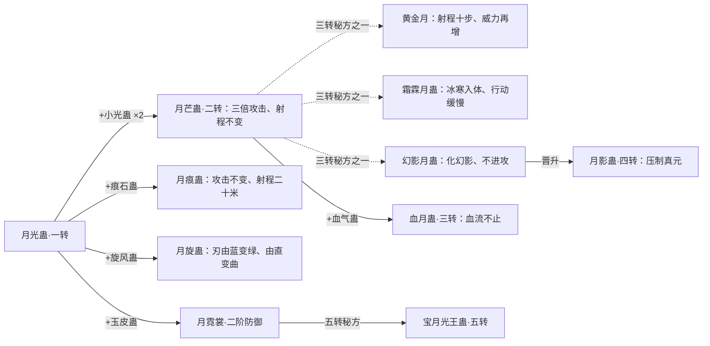
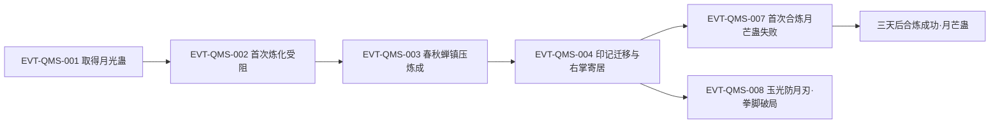

# 月光蛊

《问真》知识库的第一张「金样板」，也是一次完整的**知识恢复循环**：Wiki 暴露缺口 → 定向回原文取证 → 补原著事实 → 留审计推导 → 供《问真》取用。正文按**主题**组织，每主题三层：**原著事实**（必须有原文依据）、**合理推导**（依据/结论/不确定性）、**《问真》实现**（数值以游戏仓库为唯一真相源）。

字段状态用固定词表：`已确认`/`待取证`/`尚未整理`/`原著未明确`/`合理推导`/`存在冲突`。「待取证」＝我们还没找到，「原著未明确」＝原文确实没写，不可混用。台词加 `[对话|已核]` 并注说话人。

## 主题档案

提案结构（见「模板扩展建议」1），不替代 v2 强制块：主题档案回答「怎么用」，v2 块保留证据骨架。

### 一、效果：月刃与能力边界

- **原著事实** [已确认]
  - 释放三步：意念移蛊至掌心 → 灌真元 → 挥掌发射（E:V1-003604）。月刃约巴掌大小，十米外切断三十厘米厚草人颈、再飞约六米消散。
  - 中远程蛊，有效距离约十米（E:V1-004006）；初练者多偏飞、半途消散或互撞（3668–3680）。
  - 威力随**催动真元品阶**递进，不是常量：初阶"最多也只能割开巴掌长的血口子"（E:V1-005014），观众视为"顶多只能算把刀子…破皮流血的浅伤"（E:V1-005382）；中阶能"削蛊"，高阶能"直接断骨，甚至能斩铁"（E:V1-010642）；方源以酒虫精炼的**中阶**真元催动即自评"达到了高阶蛊师才有的攻击程度"（E:V1-010444）。
  - 受材质制约：高阶真元月刃"能一下子斩断人体最坚硬的头骨"，打野猪"却只能造成皮肉伤势，危及不到骨头"（E:V1-010908）。
  - 明确反制：玉皮蛊翠绿玉光"就能防住月刃"（E:V1-013112）；增幅过的月刃打在其上"顶多是造成…真元的加倍消耗"（E:V1-013548）；天蓬蛊令皮肤硬如白玉并"削减类似月刃这样的攻击效果"（E:V1-009988）。
  - 可被闪避、有前兆："月刃的每一次攻击，不是骤然发生的，都需要一个过程…必须要翻转掌腕，这就是最好不过的征兆"（E:V1-013292）；原文以冰鸟反衬——"这蓝色冰鸟不同于月刃，一经发出，便能自动锁敌"（E:V1-022918）。超十米消散、近于十米来不及反应（13100）；蛊仙级月刃亦"大部分被躲闪开来，少数的则被她的两个拳头轰碎"（E:V6-412816）。
  - 蛊本身会被打击：射穿方正手掌后，"掌心里面的月光蛊，也受到重大打击，濒临死亡"（E:V1-013388）。
  - 定位：`[对话|已核]`（方源，心语）一转期月刃"只能作为一种杀手锏，威慑性要大于杀伤力…真正有用的还是拳脚功夫"（E:V1-004014）。
  - 对隐形/高速目标极差：判月芒蛊"除非走了运气，正好击中这只石猴王"（E:V1-018942）；对低阶群目标高效——一记斩杀五六只玉眼石猴、重创石猴王（E:V1-018980）。两条属二转月芒蛊，非初阶常态。
- **合理推导** [合理推导]
  - 依据：威力分档（5014、5382、10642、10444）＋材质反例（10908）＋玉光可挡（13112、13548）。结论：月刃杀伤＝「催动真元品阶 × 目标材质与部位」的函数，蛊只决定形态（大小、十米、直线飞行）。做成固定伤害值必是改编。
  - 依据：有前兆、可闪避、不自动锁敌（13292、22918、412816）＋十米两端（13100）。结论：命中是熟练度与机会问题，十米是有效带两端而非单一射程。**不得把"必中"写成原著事实**（本轮对上一版的收紧）。
  - 不确定性：原文未给各阶绝对伤害量与"斩铁"的材质口径；草人颈、野猪是孤立个案，不足以反推伤害公式。
- **《问真》实现**
  - 映射：`moonlight_gu.combat = moonlight_strike`，v1 效果 `strike` 3 点且 `ignoreEvasion`；`buildTags` 含 `stable_hit`、`ignoreEvasion`。
  - **改编声明**：`ignoreEvasion`/`stable_hit` 与原著"有前兆、可闪避"相反，属改编写法；`field_actions: [illuminate]` 的原著明文作用者是一转小光蛊（103414–103416），非月光蛊。只登记张力，防被回写成原著事实。

### 二、价值与经济

- **原著事实** [已确认]
  - 古月一族秘法培育的镇族蛊、非天然、外地没有（E:V1-001490）；外观如弯月蓝水晶、轻如薄纸、一转（E:V1-001472）。
  - 一转市价位次："黄骆天牛蛊的市价也颇高，和月光蛊相当，次于玉皮蛊，更次于酒虫"（E:V1-009654）。
  - 取得：学堂蛊室免费选取（E:V1-003766），学员每隔一段时间有一次免费领蛊机会、额外获取付费（3768）；另有战功换取（E:V1-021220）。
  - 稀缺与不可补：蛊室每年才补充一次，方源后一次进蛊室"没有一只月光蛊"（E:V1-009580）；蛊消亡"不能轻易补充"，原文以此对照小光蛊"还可以去商铺购买。容易补充"（E:V1-017068）。
  - 标志蛊不可交易：古月月光蛊、熊家熊力蛊、白家溪流蛊"都是各家标志，并不在这换取的范围内"（E:V1-020446）。
  - 真正的资产是秘方：炼制秘方"只掌握在少数的几位家老，以及历代的族长手中"（E:V1-015920）；五转及以上秘藏、"不到将死之时，是绝不会传授出去的"（E:V1-015922）；逆炼秘方由族长亲管、另有一位最忠心家老秘密知晓、照影蛊被妥善隐藏（E:V1-026928），其价值"甚至能超过很多四转、五转的秘方"（E:V1-026926）。
  - 身份标识：它是古月一族标志蛊虫、"是作伪不得的"（E:V1-010796）——既是身份凭证也是暴露风险源（见主题三）。
  - 反向对照：酒虫、黑白豕蛊、九叶生机草一类珍稀蛊"家族高层都希望掌控住"（E:V1-017136）；月光蛊走相反路径——家族自育、广泛配发。
- **合理推导** [合理推导]
  - 依据：镇族定位、秘法培育、外地没有、逆炼来源、秘方价值极高（1490、26912–26928）。结论：它在族内是「可复制但不外流」的战略资产，不能按一转市场价衡量；外部势力缺的是秘方而非蛊。
  - 依据：免费配发＋每年补充一次＋标志蛊不可换取（3766、9580、20446）。结论：族内它是配给资源而非商品，稀缺性来自产能而非价格——这解释了"几乎人人一只"与"消亡不能轻易补充"的落差。
  - 不确定性：原文未写配发规则、数量上限与是否允许族内交易；「战略资产」是据三点推出的定位判断。
- **《问真》实现**：商店 `purchase_moonlight`，`stone_cost` 6、`tier` 3；稀有度 `epic`、`value` 4；掉落表 `epic` 池。意图：把「族内可造、族外难得」译成「高价＋高稀有度」。

### 三、使用与消耗

- **原著事实** [已确认]
  - 每记月刃消耗约一成真元；一名丙等学员自述空窍存三成八青铜真元、只够连发三片（E:V1-003730）。
  - 「一成」是**一转初阶口径**。一转四小境界真元色阶为初阶翠绿、中阶苍绿、高阶深绿、巅峰墨绿（E:V1-012604）；同记月刃换算到更高色阶占比减半——"催发一次，需要动用一成的翠绿真元，换算成苍绿真元，只需要半成。深绿真元再缩减一倍，墨绿真元亦是如此"（E:V1-012614），等价式"一成的墨绿真元，相当于两成深绿，四成苍绿，八成翠绿"（E:V1-012616）。
  - 月芒蛊（二转）一片月刃一成浅红真元；二转初/中/高阶分别连发四/八/十六记（E:V1-020174）。首次炼化半小时耗三成真元、仅炼化十二分之一，中断后约六小时被驱除殆尽（E:V1-001840）。中阶真元断骨斩首系酒虫精炼个案加成（E:V1-005438）。
  - **非战斗·解石**："用蓝光碾磨石头表面，这是一种对月光蛊的精微运用。通常使用了月光蛊两三年的蛊师，才可达到这种程度"（E:V1-006362）；磨掉巨石"非得有一两年的苦功不可"（E:V1-009544）；手法罕见，旁观者据"居然直接用月光蛊解石，而不损石心分毫"推断使用者可疑（E:V1-030686，说话人未在本窗口确认）。
  - **非战斗·鉴定**：方源"从葛家的族库当中，取得了许多一清二楚蛊，曰光蛊，月光蛊等"（"曰光蛊"为"日光蛊"形近误植）用于鉴定灰白石板（E:V3-091274）。
  - 效率参照：高阶真元催动下三记月刃几个呼吸杀死十七八头玉眼石猴（占该战果四十一头近半），其余以拳脚耗时十多分钟（E:V1-018690）。
- **合理推导** [合理推导]
  - 依据：四色色阶与换算（12604–12616）＋初阶一成口径（3732）＋二转四/八/十六记（20174）。结论：「能发几刃」≈ 空窍真元量 ÷ 当前品阶的"一成"；续航翻倍来自真元品阶提升，不需要冷却或充能假设。这直接解释酒虫精炼的战斗价值。
  - 依据：解石需"两三年"熟练度、磨巨石要"一两年苦功"（6362、9544）。结论：它同时是武器与工具，存在一条**非战斗的高精度维度**，门槛是时间而非真元，也因此成为身份识别线索（30686）。
  - 不确定性：真元绝对量纲未知，"一成"是相对宿主空窍的比例；中阶个案不得泛化。另有未解张力（18976"一成一分的真元，也就是两记月刃"；4656–4678 酒虫凝练个例的小境界换算为一级 ×4，含一成真元"化为动力"的额外消耗）——只登记，不强行统一。
- **《问真》实现**：`essence_cost` 1、`true_qi_cost` 2、`replace_value` 4。意图：把"靠真元总量吃饭"映射为固定真元消耗，让"发几刃"成为可计算决策而非掷骰。

### 四、喂养与资源链

- **原著事实** [已确认]
  - 口粮：每天两顿、早晚各两片，日耗四片；一块元石可购十片（E:V1-003812）。存储："若无存储手段，只能存放五天，因此方源每次只买一包"（E:V1-003874）；对照是"月兰花瓣几天内就会枯萎，但参须却能长久储藏"（E:V1-021354）。
  - 来源：月兰花由古月一族在地下溶洞栽培，"这片花海，可以说是家族最大的培养基地了"（E:V1-000940）；族长自述"我族有灵泉产出元石，在地下溶洞又种植了大片月兰花"（E:V1-002636）；施肥用腐泥冻土——冰雪冻结泥沼产生的常见资源，十分肥沃（E:V1-014046）。
  - 辅助食料·知心草：掺一根，月光蛊"吃上一片月兰花瓣就饱了"（日耗四片降至两片）；知心草一斤两块元石、花瓣十片一块元石，掺养更划算（E:V1-006126、E:V1-006130）。知心草另称"炼蛊材料"（E:V4-123568，`[对话|已核]`，琅琊地灵）——材料侧用途不在本页展开。
  - 供给时效：知心草在市集被"哄抢购买"（E:V1-006138）；次日去寻"已经被售卖一空了"（E:V1-006708）。
  - 断粮：失去花瓣可能自我封印（类似冬眠），蓝芒消散、由透明水晶褪为灰石，日久结成顽石；但这是少数情况，多数会被饿死（E:V1-006184）。
  - 外族觊觎：花酒行者要求古月一族每周提供三十斤月兰花瓣与三千枚元石（E:V1-002640）；此前他以元石求购月兰花被设局下毒蛊（E:V1-002630）。
  - 个体经济压力：被抢走补贴的同学哭诉"补贴每次都只有三块元石…我的月光蛊快喂养不起了"（E:V1-013462，`[对话|已核]`，古月族女学员）；方源养月光蛊＋酒虫每天近一块元石，养到四只时"每天元石的消耗，要比两块还要多一点"（E:V1-003834、E:V1-010050）。
  - 成本随境界上涨："蛊师境界提升了，但蛊虫的食物标准也随着提高了"，故一般蛊师只养四五头同级蛊（E:V1-003924）。
  - **食料决定炼蛊路线**：黄金月、霜霖月、幻影月"食用的都是大量的月兰花瓣"（E:V1-026822），而花瓣"极难存储，只能保质数天"；方源要离族闯荡，判"没有食物喂养它们，大半年之后就死了。还不如不炼制呢"（E:V1-026824）——三条三转路线因此被否决。
  - **反向个案·血月蛊**：改食新鲜血液、"不再是月兰花瓣"，食物"遍布南疆各个地方。随处可见"（E:V1-026866）；代价是每月特定几天外溢鲜血、"攻击力暴降到平时的三分之一"（E:V1-026858），而它攻击能力本就"差强人意"（E:V1-026852）。
- **合理推导** [合理推导]
  - 依据：日耗四片、只存五天、元石十片（3812–3874）＋掺料减半、断粮封印（6126–6130、6184）。结论：花瓣是有保质期的消耗品，囤积无意义，喂养成本本质是「稳定现金流」；这解释了低阶蛊师倾向少养蛊与"掺料降本"手段的存在。
  - 依据：26822–26824 与 26866–26870。结论：喂养链不是后勤细节而是**升炼路线的前置约束**——"吃什么"能直接淘汰一条路线；反过来"什么好养"能让人接受有明显缺陷的产物。设计上，饲料约束应挂配方前置条件，而非做成数值加成。
  - 不确定性：替代食料未穷举（已知知心草、参须可久储）；月兰花种植周期与产量原文未写；"封印成顽石"是小概率事件，不能当稳定机制。
- **《问真》实现**：`feeding_cost` 1；掉落材料池出现 `moon_blue_petal`。意图：把"有保质期的口粮"压成单点喂养消耗。

### 五、构筑与协同

- **原著事实** [已确认]
  - 蛊师通常只养四五头同级蛊，养多也用不出（E:V1-003902、E:V1-003924）。
  - 一攻一守经典搭配：`[对话|已核]`（古月博，族长）判方正"选择了铜皮蛊，是用于防守。搭配月光蛊，就是一攻一守"（E:V1-009762）；判方源"选择的是小光蛊…能令月刃攻击更强。这就说明他的性情激进，饱含侵略性"（E:V1-009774）。
  - 本命蛊定位：古月一族"绝大多数的族人都选择它成为本命蛊"（E:V1-001490）；学堂家老亦以此示范——"在场的大多数人，都是选择月光蛊作为本命蛊"（E:V1-003602）。而本命蛊"性命交修。一旦灭亡，蛊师必定遭受重创"（1480）。
  - 标志蛊三并列：古月月光蛊／熊家熊力蛊／白家溪流蛊（E:V1-003602、E:V1-020446、E:V1-026920）。
  - 远程方法可迁移：`[对话|已核]`（学堂家老）"这种经典的远程攻击方法可以运用到其他蛊虫身上，运用范围非常广泛"（E:V1-003602）。
  - 配对合炼材料形成货架需求："有玉皮蛊、旋风蛊、痕石蛊等等…都是能和月光蛊搭配起来，合炼成更高级数的蛊虫"（E:V1-017846）。
  - 小光蛊协同：双蛊同催时月刃体积与攻击力各扩大一倍，两只小光蛊不叠加（E:V1-010926、E:V1-017148，见 [小光蛊](small-light-gu.md)）。
  - 月芒蛊路线只增攻击不增射程：攻击范围仍旧十米（E:V1-017154）；效率上月光蛊配小光蛊一记只斩一两头石猴，晋升月芒蛊后一记收割五六头（E:V1-018636）。
  - 转手与借用：血月蛊可交给白凝冰、"上手就用"——原文给的原因是"血月蛊起源于月光蛊，白凝冰自然熟悉得很"（E:V2-035326）；同期天蓬蛊、锯齿金蜈也借给她（E:V2-035042）。
  - 数量随修为扩张：方源三转时持七只蛊（E:V1-023134）；后期手头十二只时自评"这个数目太多了"（E:V2-035044）。
  - 流派线索：小光蛊有明文定性"十分出名的光道辅助蛊虫"（E:V3-103414）；月光蛊自身的流派归属原文未见明文（见「待核对」）。
- **合理推导** [合理推导]
  - 依据：只养四五头、三四发即耗尽、小光蛊单向增幅（3900–3926、3910–3914、10926）＋三转七只、后期十二只（23134、35044）。结论：一转期它适合「主输出＋小光蛊 ×1」的窄构筑，真元预算决定它占几个卡位；「四五头」是低阶常见值而非硬上限。
  - 依据：血月蛊转手"上手就用"且原因写明"起源于月光蛊"（35326–35330）＋远程方法可迁移（3602）。结论：同源蛊上手成本被原文写低，这为「标志蛊＝共同战术语言」提供了机制解释，也可作为"同系蛊共用操作接口"的设计依据。
  - 不确定性：小光蛊→月刃翻倍是有原文个案的**单向**结论，不得泛化为通用组合规则；转手个案不能外推为"任何蛊都可即时转手生效"。
- **《问真》实现**：`buildRole` Core、`buildTags` `[stable_hit, ignoreEvasion, sustain_core]`、`synergy_hooks` `[light_combo]`。意图：只挂光系承载"小光蛊协同"这一条，避免把个案扩成通用规则。

### 六、炼蛊链、合炼机制与升炼路线

- **原著事实** [已确认]
  - 路线总述："月光蛊的合炼秘方有很多，晋升路线也有很多"（E:V1-017152）。最大化攻击力那条射程仍十米（E:V1-017154）；月痕蛊（＋痕石蛊）攻击力不变、射程翻倍到二十米（E:V1-017156）；月旋蛊（＋旋风蛊）月刃由蓝变绿、由直线变曲线（E:V1-017158）；月霓裳（＋玉皮蛊）是罕见路线、二阶防御类、最高能晋升到五转成就宝月光王蛊（E:V1-017160）；玉皮蛊＋月光蛊正符合一个已掌握的五转秘方（E:V1-015738）。
  - 月芒蛊＝月光蛊×1＋小光蛊×2，攻击力达月光蛊三倍（E:V1-017148）；月霓裳合炼由族长亲自指导（E:V1-015742）。
  - 月芒蛊之上的三转分支：黄金月（射程仍旧十步、威力再增，金黄月牙"足有半人高"）、霜霖月蛊（月刃幽白冰冷，中者冰寒入体、行动缓慢）、幻影月蛊（不用于进攻，化一道幻影分散火力、迷惑敌人）（E:V1-026786）；幻影月蛊可再晋四转月影蛊（E:V1-026792）。
  - 月影蛊"能种入蛊师空窍，压制住蛊师真元的使用"（E:V1-026794），量化为"四转蛊师三成真元，五转蛊师一成半，三转蛊师六成真元"，对丙等资质近乎致命（E:V1-026802）；但进入方源空窍会被春秋蝉反炼（E:V1-026806）。
  - 另一条三转路线：二转月芒蛊＋血气蛊 → 三转血月蛊（E:V1-026840）；月刃通体血红、脸盆大小，形成伤口则血流不止（26842）；外形与月光蛊类似、寄居掌心化为红色月牙印记（E:V1-027302）；擅长持久战、伤势无法止血（E:V1-027474），最大弊端见主题四。
  - 秘方载体：合炼秘方记于照影蛊，白色照影蛊记三转秘方，其中"大部分并不适合方源，所需的蛊虫都是以月旋蛊，月痕蛊等等为底子"（E:V1-026780）。秘方与逆炼的保管制度见主题二。
  - **合炼机制**："要合炼就得知道秘方。有些蛊虫之间，是不能合炼的"（E:V1-015734）；"合炼蛊虫最重要的，就是一心多用，意识融合"（E:V1-015744），且需先抹去蛊的野生意识；过程是两蛊悬浮成光团、"往光团中扔元石"，元石化为一缕纯净天然真元融入光团（E:V1-015764）。
  - **成功率**："合炼越高端的蛊虫，成功率就越低"，前世合炼春秋蝉不到百分之一、运气差"蛊虫就全死光了"（17162–17170）；"往往使用越久的蛊虫，合炼起来的成功率就越大"（E:V1-015912）；"雪獠牙的添加…能将成功率骤然提升两成"（E:V1-015916）；月痕蛊秘方另载窍门"若在合炼中途，增添一些玉石。或者在月光充足的夜晚，露天合炼，将有更高的成功率"（E:V1-026766）。
  - **克制失败率的唯一方法＝本命蛊**：千万年来"就是这个万恶的失败率，让无数高转蛊师功亏一篑"，唯有一个方法能稍稍克制（17178–17184）；"不管合炼的结果，是失败还是成功。蛊师的本命蛊是不会死亡的，最多不过受伤罢了"（E:V1-017186）；与本命蛊一起合炼的其他蛊"仍会有死伤的可能"（17194）；本命蛊是什么"将很大程度上影响蛊师的发展方向"，故会积极寻找秘方提升其层次（E:V1-017198）。
  - **失败代价与个案**：失败时"根据合炼秘方的不同，蛊虫会因此受伤，运气差的时候。蛊虫会直接死亡"（E:V1-017062）；方源首次合炼月芒蛊失败，一只小光蛊当场消散，他判"不是月光蛊消亡，小光蛊死掉一只，还可以去商铺购买。容易补充"（E:V1-017052、E:V1-017068）；幸存两蛊"表面，都有些黯淡无光。这是炼化失败，蛊虫本身受了损伤的表现"（E:V1-017070）；需"至少三天后，才能再次进行合炼"（E:V1-017074），三天后炼成（E:V1-017148）；另例："月光蛊的表面出现了微微的裂痕，而玉皮蛊则显得有些萎靡不振"（E:V1-015780）。
  - **逆炼来源**："一升一降之间，因为过程不同，得到的也许就是全新的蛊虫"（E:V1-026910）；月光蛊"并非是天然蛊虫，而是一代族长逆炼而得的"（E:V1-026912）；三家标志蛊"皆是如此情形"（E:V1-026920）。
  - 外部性：三转邀月蛊把五位家老射出的月刃"一一吞并"，放大为一记比马车还大的紫色月刃（E:V1-028294）——这是邀月蛊的能力，不是月光蛊的。
- **谱系图**（实线＝已核合炼关系，虚线＝"三转秘方之一"的分支归属，同一底蛊）

- **合理推导** [合理推导]
  - 依据：17152 把「晋升路线」与「合炼路线」并称，17160"最高能晋升到五转"指月霓裳这一合炼产物继续沿合炼链上行。结论：上行是「合炼换蛊」而非同一只蛊自行升转；分支取向（攻击/射程/形态/防御/幻术）差异大于单纯数值升级。
  - 依据：15764–15770、15912–15916、17052–17074。结论：合炼是「资源＋时间＋风险」三重约束的工艺——投元石、蛊要养得足够久、可加料与挑时辰提成功率，失败则伤蛊甚至亡蛊。这解释了秘方与"养了很久的蛊"为何本身就是家族资产。
  - 依据：1490"绝大多数族人选月光蛊作本命蛊"＋17186–17194"本命蛊在合炼中不会死亡、最多受伤，但同期参与合炼的其他蛊仍会死伤"。结论：**把月光蛊炼成本命蛊，等于给整条月光系升炼链投保**，代价是每次合炼仍可能赔掉配对的另一只蛊。原文未自述此因果，本条是两处事实的连结。
  - 不确定性：各路线成功率、元石与材料数量原文未量化；月痕蛊/月旋蛊/黄金月/霜霖月蛊/幻影月蛊的**转数**原文未逐条明文（月芒蛊＝二转、月霓裳＝二阶、血月蛊＝三转、月影蛊＝四转有明文），故按"月光蛊合炼晋升线"登记、不代原文补数。若出现同一只蛊自行升转的用例，须修订"晋升＝合炼"。
- **《问真》实现**：配方 `moonlight_glow`（月光蛊＋小光蛊 → 月芒蛊，月露 1）、`moon_ray_forged`（月光蛊＋小光蛊 → 月痕蛊，兽骨 1）；`moon_glow_fixed`、`advance_moonlight_gu` 已 retired。意图：两条活跃配方共享同一对输入但产出不同，用「分叉」表达原著的多条路线。设计建议（本轮）：「使用越久成功率越大」「可加料与挑时辰」「失败伤蛊乃至亡蛊、三天内不能重试」三件事可玩性很强，比任何数值都更接近原著。

### 七、实战案例

- **原著事实** [已确认]
  - 学堂考核五人一组各攻三次：方源首刃故意打偏约十五米越过竹墙，后两刃衔接连发同中草人颈、斩落头颅夺第一（4020–4206）；草人傀儡为一转草人蛊、具草木系轻微自愈，不断成两截则伤口复合如初（3692–3696）。
  - 玉光防御对策：方正把距离压到六米后改用月光蛊对射，自恃"即便躲闪不及，他还有玉皮蛊这个底牌。只要撑起翠绿玉光，就能防住月刃"（E:V1-013100、E:V1-013112）；纯月刃无法破防、增幅只令对方多耗真元，方源最终以拳脚击中方正脸颊取胜（13548–13570）。反制机理见主题一。
  - 工具化实战：血月蛊贴着猴脑壳缓缓绕一圈即可揭下半边脑壳，代价是空窍真元"彻底见底"（E:V2-037104）；同一手法的前身是"昔日，他用月谷蛊解石"（同段"月谷蛊"为"月光蛊"形近误植）。
- **合理推导** [合理推导]
  - 依据：首刃打偏、后两刃连中、草人可自愈（4020–4206、3692–3696）。结论：该考核同时考「控制落点」与「连续发射的稳定性」，与主题一一致——命中是操作问题。
  - 依据：玉光能完全免除月刃伤害，而增幅只转嫁为对方真元消耗（13112、13548）。结论：在"一攻一守"对位里，纯攻击路线会被防御蛊拖成真元消耗战——**防御应有效压制月刃，而非只减伤**。
  - 不确定性：单场考核不足以说明月刃对活体的杀伤边界；"斩首"是对草人傀儡的结果，不能外推到真人。
- **《问真》实现**：见主题一、五的投影说明。

## 跨页缺口移交（提案区块）

登记「本页已取证、但归属其他页面」的缺口，做到补一处知识而不扩散改动面；区块本身属提案（见「模板扩展建议」5）。

| 缺口 | 归属页 | 本页证据 |
|---|---|---|
| 月芒蛊仍写"射程/消耗/外观未逐条核验" | [月芒蛊](moon-glow-gu.md) | 射程仍十米（E:V1-017154）；一成浅红真元/记、二转三档四/八/十六记（E:V1-020174）；幽蓝月刃足有脸盆大小（E:V1-018610）；心语称"只有十步"（E:V1-024162）与"十米"口径不一 |
| 月痕蛊秘方窍门与底蛊用途 | [月痕蛊](moon-ray-gu.md) | 添玉石或月光充足之夜露天合炼提成功率（E:V1-026766）；三转秘方"以月旋蛊，月痕蛊等等为底子"（E:V1-026780） |
| 小光蛊的光道定性与合炼死伤 | [小光蛊](small-light-gu.md) | "十分出名的光道辅助蛊虫"（E:V3-103414）；合炼月芒蛊失败会死掉一只小光蛊且可补购（E:V1-017052、E:V1-017068） |
| 月系三转分支与月影蛊压制数值 | [蛊虫总表](roster.md) / roster-2 层 | 三分支与幻影月蛊→月影蛊（E:V1-026786、E:V1-026792）；月影蛊压制三/四/五转分别六成/三成/一成半真元（E:V1-026802） |
| 邀月蛊聚并放大月刃 | roster-2 层 | 邀月蛊吞并五位家老的月刃、放大为比马车还大的紫色月刃（E:V1-028294） |
| 血月蛊的食血与月度衰减 | roster 层 | 食新鲜血液、食物随处可见（E:V1-026866）；每月几天外溢鲜血、攻击力暴降到平时三分之一（E:V1-026858） |
| 一转基准第 10 题锚点偏移 | `tools/benchmark-qms.md` | 该题把"花瓣保存期限"锚在 3811–3812、3834 行，实际出自 3874 行（E:V1-003874）；本轮只登记、未改基准文件 |
| 月道与后期"月刃"杀招同源关系 | 待专项取证 | 殷无缺承上古月道蛊仙传承（E:V6-412852），其杀招"月牙突刺""月升"可凭空催生淡蓝半透明月刃（E:V6-412752、E:V6-412830）。与古月一族月光蛊是否同源，**本页无证据** |

## 状态时间线

| 状态 ID | 阶段 | 状态 | 证据 |
|---|---|---|---|
| ST-MOONLIGHT-01 | 存放 | 学堂蛊室白银盘一排供新人挑选；弯月蓝水晶、轻如薄纸、一转 | E:V1-001472 |
| ST-MOONLIGHT-02 | 初次炼化（一般个案） | 半小时耗三成真元仅炼化十二分之一；中断约六小时被驱除殆尽 | E:V1-001840 |
| ST-MOONLIGHT-03 | 炼成（方源个案） | 春秋蝉气息镇压意志后不到五分钟炼成；落额头中间成淡蓝弯月印记 | E:V1-003366 |
| ST-MOONLIGHT-04 | 使用 | 三步发射（见事件链后说明）；每记一成真元，中远程十米，初练易偏飞 | E:V1-003604、E:V1-004006 |
| ST-MOONLIGHT-05 | 位置迁移 | 印记随意念沿手臂移动至掌心；方源后期寄居右掌成淡蓝月牙纹路 | E:V1-003606、E:V1-010930 |
| ST-MOONLIGHT-06 | 协同 | 与小光蛊双蛊同催，月刃体积与攻击力各扩大一倍（两只不叠加） | E:V1-010926、E:V1-017148、`CAN-SMALL-LIGHT-001` |
| ST-MOONLIGHT-07 | 中阶真元个案 | 酒虫精炼中阶真元催动断骨斩首——个案加成，不泛化 | E:V1-005438 |
| ST-MOONLIGHT-08 | 喂养（掺料降本） | 掺一根知心草，每顿一片月兰花瓣即饱（日耗四片降至两片） | E:V1-006126 |
| ST-MOONLIGHT-09 | 断粮 | 可能自我封印（冬眠），蓝芒消散、水晶褪为灰石，日久成顽石（小概率） | E:V1-006184 |
| ST-MOONLIGHT-10 | 合炼晋升 | 四路线：月芒蛊（攻三倍）/月痕蛊（二十米）/月旋蛊（曲线刃）/月霓裳（防御·最高可晋五转宝月光王蛊） | E:V1-017152 |
| ST-MOONLIGHT-11 | 真元预算（月芒蛊） | 一成浅红真元/记；二转初/中/高阶分别四/八/十六记 | E:V1-020174 |
| ST-MOONLIGHT-12 | 受打击 | 宿主手掌被射穿时，掌中寄居的月光蛊"受到重大打击，濒临死亡" | E:V1-013388 |
| ST-MOONLIGHT-13 | 他人持有（非方源） | 一名被杀的蛊师"舌头上有一个月牙的印记，正是寄居着的月光蛊"，临死仍放出一记月刃 | E:V1-011790 |
| ST-MOONLIGHT-14 | 族外出现（存疑） | 从北原葛家族库取得"一清二楚蛊、曰光蛊、月光蛊等"用于鉴定灰白石板 | E:V3-091274 |
| ST-MOONLIGHT-15 | 合炼失败后 | 表面黯淡无光（受伤），至少三天后才能再次合炼；失败亦可能直接消亡 | E:V1-017070、E:V1-017074 |
| ST-MOONLIGHT-16 | 本命蛊（保护态） | 古月一族绝大多数族人以它为本命蛊；本命蛊在合炼中不会死亡、至多受伤 | E:V1-001490、E:V1-017186 |

## 原著明确内容

事实正文按主题写在「主题档案」，本节只留**批次窗口登记**（核验了哪些行段、结论是什么、细节见对应主题），以免同一事实在页内写两遍。

- 批次一~三（906–6013 行，第 4–38 节）：秘法培育镇族蛊、非天然、外地没有、一转弯月蓝水晶（1472–1494）；蛊室挑选、首次炼化受阻、春秋蝉镇压炼成（1484–1496、1840–1864、3366–3382）；三步发射与月刃尺寸射程（3604–3638）；初练偏飞（3668–3680）；每记一成真元、丙等三成八只够三片（3730–3736）；中远程十米并"威慑性要大于杀伤力"（4006、4014）；考核斩首（4020–4206）；草人傀儡可自愈（3692–3696）；酒虫中阶真元个案（5014、5382、5438–5516，**不得泛化为一转初阶常态**）。→ 主题一、三、七
- 批次四（2026-09-28 第一轮）：花瓣来源与掺知心草降本、断粮自我封印、四条升炼路线、月芒蛊消耗与三转分支。→ 主题四、六
- 批次五（2026-09-28 第二轮，定向补「喂养/炼蛊/能力边界/经济/协同」）：真元四色色阶与换算（12604–12616）；威力分档、材质反例、前兆与可闪避、玉光与天蓬反制、蛊可被打伤；花瓣只存五天、知心草双身份、供给售空、饲料标准随境界提高、食料否决三转路线、血月蛊食血与月度衰减；合炼机制与成功率、加料与时辰加成、失败代价与三天恢复、本命蛊抗失败、秘方制度与逆炼；市价位次、年度补充稀缺、标志蛊不可换取、解石与鉴定工具化、他人舌上寄居。→ 主题一~七（各行号见对应主题）
- 别名登记（本轮）：另有一处称"骨枪蛊，就类似于古月山寨的月刃蛊"（38980），全书仅此一见、语境指向月光蛊，登记为别名。"月谷蛊"（37104）、"曰光蛊"（91274，指日光蛊）为形近误植。
- 炼化印记与位置（2026-09-25 窗口）：炼成后落额头中间（E:V1-003380）；可被意念调动、沿手臂移到掌心（家老演示，3606）；方源后期寄居右掌掌心（10930）。此前"月光刃会在手掌留下印记"系误置炼化寄居印记，已按原文修正。

## 事件链

| 事件 ID | 事件 | 证据 | 因果关系 |
|---|---|---|---|
| EVT-QMS-001 | 方源在学堂蛊室白银盘挑选取得月光蛊 | E:V1-001484 | enables 002、003 |
| EVT-QMS-002 | 首次炼化受阻：半小时耗三成真元仅炼化十二分之一、中断约六小时被驱除 | E:V1-001840 | 前置 001；促使改用春秋蝉气息镇压 |
| EVT-QMS-003 | 春秋蝉气息镇压意志，数分钟内炼成，额头中间落淡蓝弯月印记 | E:V1-003366 | causes ST-MOONLIGHT-03；enables 004 |
| EVT-QMS-004 | 印记迁移：学堂家老演示意念移动至掌心；方源后期寄居右掌 | E:V1-003606、E:V1-010930 | changes ST-MOONLIGHT-05 |
| EVT-QMS-007 | 首次合炼月芒蛊失败：一只小光蛊当场消散，幸存两蛊受伤，至少三天后才能再炼 | E:V1-017052、E:V1-017070、E:V1-017074 | changes ST-MOONLIGHT-15；三天后炼成（E:V1-017148） |
| EVT-QMS-008 | 方正以玉皮蛊翠绿玉光防住月刃；方源以拳脚破局 | E:V1-013112、E:V1-013548 | supports「防御可完全抵消月刃」的边界命题 |

月刃释放三步（ST-MOONLIGHT-04）：① 意念调动月光蛊移至掌心 → ② 灌入真元 → ③ 挥掌发射（E:V1-003604）。追溯示例："印记在哪？" → ST-MOONLIGHT-03 → E:V1-003366 → 3366–3382 行（3380 落额头）。

## 资料整理

- 笔记记录：月光蛊以月兰花瓣为食，催动月光刃消耗约十分之一真元；笔记约数"十分之一"与原文"一成"（3732、3912）一致，本批采用原文"一成"口径。（notes:game/分支：六卷精编版/读书笔记/A2a-00001-15500-补读.md）
- 本轮锚点审计：本页上一版与新增引用中共 12 个 E-ID 落在**空行**上（段一候选如 1473、1483、1841、3365、3603、4005、10925、17147、18975 与其相邻编号，另及段三 20173），已全部改指主张主行。`E:V1-001472`、`E:V1-003604` 同时被 `game/data/gu.json`、`lore/runtime/` 与一至九转模型库引用且本身有效，保持不变。经验：**E-ID 必须落在有字的那一行，区间起点不要取前一行空行**。

## 分析与解读

- 印记位置（额头→掌心→右掌寄居）是状态变化而非事实冲突（3380、3606、10930 三窗互证）。ST-MOONLIGHT-13 是**另一只月光蛊**（无名蛊师）的寄居状态，登记于此只为防止"舌上月牙＝方源"的误读。
- 四条炼蛊分支是并行选项而非线性升级；「攻远不攻力」提示分支取向差异大于数值差异。月霓裳线最高可晋五转宝月光王蛊，但原文同时强调"有五转秘方，并不意味着一定就能炼成五转的蛊虫"（17162）。
- **最大过度压缩**：把月刃当作固定面板。原文把它拆成四个独立变量——催动真元品阶（威力台阶）、目标材质（是否破防）、距离（十米有效带两端）、发射前兆（可否闪避）。压成一个数字就丢掉原著最有设计价值的部分。
- **第二处**："射程十米"被当成唯一常数。原文还有月痕蛊二十米、黄金月与月芒蛊的"十步"表述（26786、24162）、超十米即消散、以及"弓箭覆盖范围比月刃大"（10428）。射程是**品种与口径双重变量**。
- **第三处（结构性）**：「主题档案」与 v2 强制块曾把同一批事实写两遍；本页已去重，并因此把页体积从 63 KB 压回预算内。

## 待核对

- [待取证] 月刃伤害边界未穷举：已知个案为草人颈（十米外断三十厘米）、高碗双前臂（中阶断骨）、人体头骨与野猪皮肉（高阶的材质对照，10908）。缺口：原文未给"削蛊/断骨/斩铁"三档的量纲与材质硬度口径。
- [待取证] 替代食料未穷举：已核知心草（6126–6130）与"参须能长久储藏"（21354）；月兰花种植周期与产量、花瓣的野外替代品原文未写。知心草的材料侧用途（123568）已登记未展开。
- [待取证] 月旋蛊/月痕蛊/黄金月/霜霖月蛊/幻影月蛊的**转数**原文未逐条明文。已知风险：蛊虫总表的 1 转分组把月旋蛊与 61 只一转蛊并列，而它与月痕蛊同为月光蛊（一转）的合炼产物、与二转月芒蛊互斥，该分组需在对应页面批次中复核。
- [尚未整理] 月光蛊在古月一族防卫体系中的编制与配发规则（谁可领、数量上限）；已见外族勒索（2640）、学堂免费选取与定期免费领蛊（3766–3768）、战功换取（21220）、"标志蛊不在换取范围"（20446）四种流向。
- [已确认] 上行是「合炼换蛊」而非同一只蛊自行升转（17152、17160）；未见自行升转用例。
- [已确认] 真元口径：一转四阶色别与"换算减半"规则（12604–12616），解释了一转初阶"一成/记"与二转四/八/十六记的翻倍机制。
- [已确认] 合炼风险与增益有明文：使用越久成功率越大（15912）、加料提两成（15916）、可挑时辰与辅材（26766）、失败伤蛊或亡蛊（17062）、本命蛊不会死但同炼的其他蛊会死伤（17186–17194）。
- [存在冲突] 笔记记"月光刃消耗约十分之一真元"、原文为"一成"（3732、3912）；本页采用原文口径。（来源：笔记↔原文漂移）
- [存在冲突] 原文自身两处月刃消耗口径不一：20174"一成浅红/记"（含二转四/八/十六记）与 18976"一成一分的真元，也就是两记月刃"。12614–12616 的换算规则**不能**解释后者，继续登记、不强行统一。（来源：原文内部矛盾·未解）
- [存在冲突] 小境界换算比有两套：12612–12618 等价式为每级 ×2，4656–4678 酒虫凝练个例为一级 ×4（含一成真元"化为动力"的额外消耗）。本页据此不改月刃消耗口径。（来源：原文内部矛盾）
- [存在冲突] "其他地方没有"（1490）与后期从北原葛家族库取得月光蛊（91274）张力明显：可能是后期扩散、方源自备或文本误植，本页不擅自裁定。（来源：原文跨段张力）
- [原著未明确] 月光蛊的**流派归属**：全书未见"月光蛊属光道/月道"明文；有明文的只有小光蛊"光道辅助蛊虫"（103414）与后期"上古月道蛊仙大能"（412852）。故"月道"只能作归档标签，不得回写成原著事实。
- [待取证] "月道"线索：殷无缺承上古月道蛊仙传承（412852），其杀招"月牙突刺""月升"可凭空催生淡蓝半透明月刃（412752、412794、412830），该月刃被黑楼兰"大部分被躲闪开来，少数的则被她的两个拳头轰碎"（412816）。与古月一族月光蛊的同源关系无证据。
- [待取证] 月系杀招名："金月斩"（23676）与家老台词里的"三转月手刀"（23688）是否成体系的固化杀招、与黄金月的关系如何，本页未查证。
- [合理推导] "小光蛊→月刃翻倍"为个案单向结论，不得泛化为通用组合规则（见主题五）；"月光蛊作本命蛊＝给整条月光系升炼链投保"据 1490＋17186–17194 串起，原文未自述该因果，若出现反例须修订。

## 模板扩展建议

**在 L1 评审通过前，本页不修改 `lore/wiki/AGENTS.md` 或任何核心模板**，仅在此登记。

1. 新增页型结构「主题档案」：v2 强制块按**证据形态**切分，会把同一主题的原著事实、推导与游戏映射拆进互不相邻的大区块（想知道"月光蛊怎么喂"要跨 4 个章节自己拼装）。建议允许 `## 主题档案` 下用 `### 主题`、每主题固定三层，v2 强制块保持不动。
2. 正名词表：建议统一为 `已确认/待取证/尚未整理/原著未明确/合理推导/存在冲突`，并映射到既有 `可核|推断|未决` 三态。理由："待取证"（我们没找到）与"原著未明确"（原文确实没写）语义相反，混用会把检索缺口误报成原著空白。
3. 约定游戏层表达边界：页面只写「映射关系与设计意图」，数值由构建期从游戏仓库读取并标"以游戏仓库为准"。本轮实例：`ignoreEvasion`/`stable_hit`/`illuminate` 三项与原著有距离（月刃可闪避；"驱散黑暗"的明文作用者是小光蛊），需显式声明改编。
4. 区分「存在冲突」的来源：一个标记同时承载"笔记↔原文漂移"（可回溯修正）、"原文内部矛盾"（只能登记）与"原文跨段张力"（不擅自裁定）。混用会让审计无法区分"我们抄错了"与"原文本就如此"，也会让后续 Agent 误把原著张力当加工错误去"修正"。
5. 新增「跨页缺口移交」区块＋`待核对` 可选「归属页」标注：取证时顺手发现的**他页**缺口现状没有标准落点——要么写进本页（污染实体边界），要么批量改他页（超出批次范围）。本轮在 6 个页面上发现已取证却仍写"待核验"的缺口。
6. 给 E-ID 增加「主行命中」校验：check9 只校验段号与六位行号、不校验该行是否为空。本轮发现系统性**指向空行**的 E-ID（本页曾达 12 处），形式上全部过门禁、实际上定位不到任何句子，是"看起来有证据"的最隐蔽形态。建议增加轻量校验——E-ID 对应原文行去空白后长度 > 0（原文不入 Git，本地无 `source/` 时按 WARN）。
7. 给「主题档案」定反膨胀规则：本轮双写使本页一度达 63 KB、超 GOVERNANCE「内容页 ≤40 KB」预算，已按去重整改。建议把"去重优先于删事实"写成主题档案的默认纪律，并在预算超标时优先查双写而不是先删知识。

关联页面：[小光蛊](small-light-gu.md)、[月芒蛊](moon-glow-gu.md)、[月痕蛊](moon-ray-gu.md)、[方源](../characters/fang-yuan.md)、[蛊的饲养与炼化](../world/gu-care-and-refinement.md)、[炼蛊与杀招链](../world/gu-refine-killer-chain.md)、[真元](../world/primeval-essence.md)、[蛊虫关系](gu-relations.md)、[蛊虫总表](roster.md)、[炼蛊](../rules/refinement.md)、[杀招](../rules/killer-moves.md)、[经济与资源总表](../world/economy-roster.md)、[流派总表](../world/path-roster.md)。
