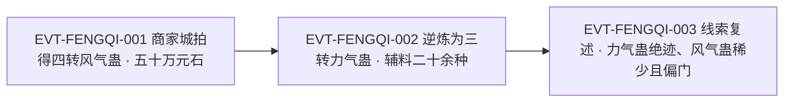

# 风气蛊

一件**不作用于个体、只作用于群体**的气道蛊。原著给它的定性只有两句：一句讲出身——「风气蛊不仅出身特殊，用途也特殊。」`E:V2-057030`；一句讲用途——「它针对一支种族群体而施展，用一种无形的力量，营造出一种集体中流行的爱好或者习惯。」`E:V2-057032`。全书 `风气蛊` 命中 24 行，集中在两个场景：段 2 商家城拍卖会上的竞拍与来历介绍，以及段 2／段 3 它被当作逆炼原料、转化为三转力气蛊的两次交代。

本页为 2026-09-28 第二批实体页**新建页**。所有引文回根原文 `source/蛊真人-clean.txt` 逐行复核，行号即 `E:V{段}-{6位行号}`；原文中的讹字（如 `夭然蛊`、`众入`、`个入`）按**逐字照录**处理，不作正字改写，必要处括注 `原文如此`。

**检索口径（必读）**：本页对 `风气蛊` 与词根 `风气`、族根 `气蛊` 做了全量分类账。实测：`风气蛊` = 24 行（24 次），**全部独立指称本蛊**，左邻字符为 转／了／这／只／对／的／但／有，均非构词成分，**无更长名后缀误切**；词根 `风气` = 40 行 = 本蛊 24 行 + 普通词 16 行；族根 `气蛊` = 188 行，其中含本蛊者 24 行，其余为他实体或泛称（已实测：`力气蛊` 48 行、`勇气蛊` 28 行、`硬气蛊` 9 行、`血气蛊` 8 行、`人气蛊` 8 行、`朝气蛊` 6 行，另有剑气／刀气／化气／锁气／正气／尸气等）。交付前已用脚本断言 `枚举集合 == 实测集合` 通过。详见主题五。

## 主题档案

### 一、品阶与出身：四转气道天然蛊，没有炼制秘方

#### 原著事实

- **四转明文**：「下面是第三十二件拍品——四转风气蛊。」`E:V2-057022`。
- **登记锚回原文打印确认**：`roster-3.md` 给 `qi_mov_4_03_gu` 的登记锚即 `E:V2-057022`（原文转 4，与 game 转 4 一致）。本页回原文打印该行，**该行是正文行、不是章节题名行**，转数证据就在该行本身。
- **外形**：「风气蛊形如一只蝴蝶，它有青蓝色的双翅，每一次扇动，都会有碎钻般的星芒在周围的空气中产生。」`E:V2-057024`。
- **天然蛊与无秘方**：「风气蛊，是很特殊的蛊虫。它吸收生命的活力，从风中诞生，是夭然蛊。」`E:V2-057026`（`夭然蛊` 原文如此）；同句续写「到目前为止，还未有秘方大师，研究出炼成它们的秘方。」`E:V2-057026`。
- **秘方流派的语境**：「秘方大师一般分为三大流派。过去流派，研究消失的力道、气道等等蛊虫秘方，试图还原。现在流派，研究夭然蛊，企图钻研出合炼它们的秘方。」`E:V2-057028`。
- **气道归属**：「白凝冰的朝气蛊，巨开碑的硬气蛊，方源的风气蛊，都和气道有关。」`E:V2-058656`；「风气蛊、力气蛊，两者同为气道蛊。」`E:V2-059740`。

#### 合理推导

- **依据：**`E:V2-057026`（`从风中诞生，是夭然蛊`）＋`E:V2-058656`（`都和气道有关`）；**结论：**风气蛊是**气道中的天然蛊**——它不出自合炼，而是「从风中诞生」，这让它的获取路径（野获、拍卖）与合炼蛊完全不同；**不确定性：**原文只写它吸收生命的活力、从风中诞生，未写诞生的具体条件（何处生风）、生成频率与存量。
- **依据：**`E:V2-057026`（`还未有秘方大师，研究出炼成它们的秘方`）＋`E:V2-057028`（现在流派「企图钻研出合炼它们的秘方」）；**结论：**至少到该场拍卖的时间点，风气蛊的**炼制秘方尚属空白**，且在学派层面被列为「现在流派」的攻关对象；**不确定性：**原文只写「到目前为止」，未写此后是否被攻克，本页不对后续作任何结论。
- **依据：**`E:V2-059742`（逆炼需要秘方）；**结论：**存在**炼制秘方**与**转化（逆炼）秘方**两类不同的东西——前者缺位不等于后者缺位，风气蛊同时是炼不出来、却又有现成逆炼方的；**不确定性：**原文未解释逆炼方为何能先于炼制方存在，也未写逆炼方的来源。

#### 《问真》设计意义

- **可采规则（天然蛊的获取路径）**：把一件蛊设为只能从环境中获得，等于给它接上了一条不依赖炼道的供给链，能在炼道强势的体系里留出生态位。
- **可采规则（缺炼制方而有转化方）**：允许炼不出来、但可以改出来，可以把稀缺件的价值锚定在环境与存量上，而不是炼师手上。

### 二、作用机制：只对群体生效，营造集体流行的爱好或习惯

#### 原著事实

- **作用对象与方式**：「它针对一支种族群体而施展，用一种无形的力量，营造出一种集体中流行的爱好或者习惯。」`E:V2-057032`。
- **对个人的弱效力**：「风气蛊对势力有效果，对个入用途极少，也使得大多数入兴致缺缺。」`E:V2-057076`（`个入`／`大多数入` 原文如此）。
- **第一处实操——对付兽群**：「上古时代，蛊师们用它来对付兽群。」`E:V2-057034`；同段举例「这支钢针猪群，就忽然形成了一种，喜欢用全身皮毛蹭石头的习惯。」`E:V2-057034`。
- **效果落点**：「钢针猪的皮毛，如根根铁针，攻防一体。蹭了石头之后，皮毛渐渐损毁，蛊师们对付起来，不费吹灰之力。」`E:V2-057036`。
- **第二处实操——对内治理**：「有的家族，粮食缺乏，却爱好酿酒。用了风气蛊后，改变了酿酒的习惯后，粮食增多，家族壮大起来。」`E:V2-057040`。

#### 合理推导

- **代价与收益（三要素）**：**结论：**本条三方关系为——**支付方＝施蛊的蛊师**（付出一枚四转风气蛊一次催动；价格见主题五）；**受益方＝施蛊方**（对兽群是削弱其战力，对己方部落家族是改变生活习惯）；**支付时点／生效条件＝针对一支群体施展之时**，且生效对象必须是**群体**——对个体则效力微弱；**依据：**`E:V2-057032`、`E:V2-057076`、`E:V2-057034`、`E:V2-057040`；**不确定性：**原文未给单次催动的真元消耗、有效群体的规模上限与作用持续时长，本批尚未找到。
- **依据：**`E:V2-057032`（`营造出一种集体中流行的爱好或者习惯`）＋`E:V2-057034`（钢针猪蹭石头的习惯）＋`E:V2-057036`（皮毛损毁）；**结论：**它的杀伤**不直接施加于身体**，而是先造出一个「习惯」，再由这个习惯去消耗群体的身体——即**经行为中介的间接伤害**；**不确定性：**原文未写这种习惯的持续时长、能否被群体自行察觉或戒断，也未写同一群体被反复施展后的效果。
- **依据：**`E:V2-057032`（`无形的力量`）＋`E:V2-057034`（`忽然形成`）；**结论：**生效方式是**不可见的心理—行为诱导**，而非常规攻伐；因此它的可对抗点更可能在识破与祛除，而非格挡与闪避；**不确定性：**原文未写是否存在对抗此蛊的手段（解蛊、免疫、逆用），此点尚未找到。

#### 《问真》设计意义

- **可采规则（群体级状态篡改）**：把目标从单体改为一支群体，并让效果落在 AI 的行为倾向上，可以造出以战养政、以风破军的战役玩法。
- **可采规则（对个体无效的强约束）**：明确写出对个体用途极少（E:V2-057076），是给这件蛊上的硬性使用边界，能防止它被当成万能单体控制蛊。
- **可采规则（习惯要可见）**：既然伤害经行为中介，玩家就应能从群体的行为变化里读出中蛊，而不是只看血条——这是可玩性的关键接口。

### 三、对内与对外：从对付兽群到统治部落家族

#### 原著事实

- **身份升级**：「但后来，蛊师们渐渐发现，风气蛊用来统治部落、家族，是绝好的利器。」`E:V2-057038`。
- **两向皆可用**：「风气蛊不仅可以用来对内，也可以用来对外。」`E:V2-057042`。
- **对外史例**：「两个家族相争，弱小的一方动用了风气蛊，使得强大的家族忽然兴起了女子裹小脚的风气。」`E:V2-057046`。
- **史例后果**：「这使得这个家族中的女子，劳动力大减。女性蛊师也战斗力大降，最终被弱小的家族翻盘逆转而灭。」`E:V2-057048`。
- **本质归因**：「说到底这是蛊的世界，有千奇百怪的蛊虫。」`E:V2-057050`。
- **购买动机未明**：「当然有需求，不过此事未成，却还须保密。」`E:V2-057088`；旁观者则猜「怎么，你难道也想重建古月山寨？」`E:V2-057084`。

#### 合理推导

- **代价与收益（三要素）**：**结论：**本条三方关系为——**支付方＝动用方的对手**（被施加方的劳动力与战力被削减，成本落在对手身上而非施蛊方）；**受益方＝弱小的一方**（以弱胜强，凭风气篡改实现翻盘）；**支付时点／生效条件＝习惯在对方群体内形成之后**才兑现收益，且需要对方「兴起了」这种风气；**依据：**`E:V2-057046`、`E:V2-057048`；**不确定性：**原文未给削弱幅度、习惯形成所需时长与被施加方的可觉察度，本批尚未找到。
- **依据：**`E:V2-057038`、`E:V2-057040`、`E:V2-057046`；**结论：**本蛊的正收益主战场是**治理与战争中的群体改造**（`统治部落、家族`、`对内`、`对外`），对兽群只是上古的用法之一；**不确定性：**原文用「蛊师们渐渐发现」一句带过这个用途升级，未写它从兽群转向人类群体时是否需要新的门槛或代价。
- **依据：**`E:V2-057088`＋`E:V2-057084`＋`E:V2-057082`（`魏大哥，这只蛊我就收下了。`）；**结论：**方源在商家城买下它的动机在当卷**只交代到保密为止**，「重建古月山寨」是旁人猜测而非原文说明；**不确定性：**其真实用途要到段 2 后段的逆炼交代（主题四）才被读者确知，本页不把旁人的猜测当事实。

#### 《问真》设计意义

- **可采规则（以弱胜强的合法路径）**：让弱势方能靠改掉对手群体的习惯翻盘，是给国力／战力差悬殊的对抗留出第二条通往胜利的线。
- **可采规则（对内也是同一件蛊）**：同一件蛊既能削弱敌人又能整饬内部，可以让玩家在用在哪一方上做取舍，而不是只堆威力。

### 四、气道逆炼：四转风气蛊 → 三转力气蛊

#### 原著事实

- **逆炼的主材**：「炼成力气蛊的主体，就是四转风气蛊。」`E:V2-059736`；「方源从拍卖场意外的看到，竟然有风气蛊后，就当即产生了买下的坚定想法。」`E:V2-059738`（`意外的` 原文如此）。
- **同族可转**：「风气蛊、力气蛊，两者同为气道蛊。本身的法则有微妙的相似之处，因此可以通过炼蛊而相互转化。」`E:V2-059740`。
- **转化的成本与成功率**：「这个转化的秘方，十分复杂。动用二十多种不同的辅料，进行逆炼，中间有三十多步骤。火候、时间都要把握清楚，不能有一丝一毫的差错。成功率倒是不低，有八成几率。」`E:V2-059742`。
- **产物转数**：「力气蛊，只是三转蛊虫。」`E:V2-059744`。
- **稀缺性**：「但风气蛊只有四转级数，属于偏门蛊，也比较稀少。」`E:V3-095118`；「方源若要得到力气蛊，就只能用北原的风气蛊，逆炼成三转力气蛊。」`E:V3-095120`。
- **力气蛊的市面状态**：「力气蛊早已在凡世的市面上绝迹，方源的这只力气蛊，还是他通过四转风气蛊逆炼而得。」`E:V3-095116`。

#### 合理推导

- **代价与收益（三要素）**：**结论：**本条三方关系为——**支付方＝炼制者（方源）**（支付一枚四转风气蛊＋二十多种辅料＋三十多步骤的工时，并按八成几率承担失败风险）；**受益方＝炼制者**（得到一枚三转力气蛊，补上远程手段的缺口）；**支付时点／生效条件＝逆炼过程中即时支付**，收益以逆炼成功（`有八成几率`）为生效条件；**依据：**`E:V2-059736`、`E:V2-059742`、`E:V3-095116`；**不确定性：**原文未给辅料清单、三十多步骤的顺序与失败后的损失形态（只给八成几率），本批尚未找到。
- **依据：**`E:V2-059736`＋`E:V2-059742`＋`E:V2-059744`；**结论：**这是一次**降转转化**——以四转件换三转件，代价里包含转数下降这一项；它的合理性不来自净收益，而来自**目标件的稀缺**（力气蛊市面绝迹）；**不确定性：**原文只给成功率八成与三十多步骤，未写失败时的损失形态（是否连主材一并毁去）。
- **依据：**`E:V3-095118`、`E:V3-095120`、`E:V3-095122`；**结论：**风气蛊在这条线上的角色是**不可替代的原料**，而非战力件；当需求方已是五转修为时，三转产物已不合用（`三转的蛊对他的帮助极少`），评价完全取决于持有者的修为层级；**不确定性：**原文未写是否可逆炼出更高转数的力气蛊，也未写除力气蛊外还能转化出哪些气道蛊。

#### 《问真》设计意义

- **可采规则（降转转化）**：允许高转件转化为更低转的稀缺件，是把已过气的旧物重新接入经济循环的一条路，也解释了收藏低频件的行为。
- **可采规则（转化有失败率与辅料清单）**：给逆炼配上辅料数、步骤数与成功率，能让它成为一个可展示、可投机的合成配方，而不只是数值交换。

### 五、拍场与名称边界：五十万元石成交，以及它不是什么

#### 原著事实

- **底价与叫价**：「风气蛊，底价二十六万元石。」`E:V2-057052`；报价依次为「翼家的家老翼不悔首先报了价」`E:V2-057054`、「飞家的飞鸾凤毫不示弱」`E:V2-057056`、「一位秘方大师喊道」`E:V2-057058`、魏央出「三十八万」`E:V2-057060`、方源出「五十万」`E:V2-057062`。
- **成交**：「五十万一次……两次……三次，成交！」`E:V2-057072`；「五十万的价格，稍微超过了众入预期，没有入加价。」`E:V2-057074`（`众入`／`没有入` 原文如此）。
- **拍卖行的估价**：「方正老弟，这风气蛊四十六万就可以拿下的。」`E:V2-057078`。
- **线内旁证：他实体**：紧随其后的拍品是**餐风蛊**——「风气蛊之后，是一套餐风蛊。」`E:V2-057092`、「三十八只餐风蛊，合成一套，一起拍卖。」`E:V2-057094`、「餐风蛊只是二转蛊虫，但很实用。能令蛊师以风为食，填饱肚子。」`E:V2-057096`。
- **名称碰撞全量分类账**（计数为全书穷举所得，无单行可挂；下列 E-ID 为各类落点行）：`风气蛊` 24 行**全为本实体**；词根 `风气` 另 16 行为普通词用法——指一时之风尚或作风，如「可见北原蛊师研发新蛊的风气。」`E:V3-081784`、「但幸好北原风气，这些蛊师大多都兼修了力道。」`E:V3-105092`、「这个风气真的太坏了！」`E:V6-430196`；族根 `气蛊` 188 行中，除本实体 24 行外均为他实体或泛称。
- **分类账断言**：`风气蛊`（24 行）⊕ `风气` 普通词（16 行）= 40 = 词根 `风气` 实测行数，两集合互不相交，断言通过。

#### 合理推导

- **代价与收益（三要素）**：**结论：**本条三方关系为——**支付方＝方源**（以五十万元石成交，超出拍卖行估价的四十六万）；**受益方＝方源**（取得一枚市面上稀少的天然蛊，并在同一场拍得秘方）；**支付时点／生效条件＝竞价落槌时一次性支付**；**依据：**`E:V2-057052`、`E:V2-057062`、`E:V2-057072`、`E:V2-057078`；**不确定性：**原文未给该成交价与同类天然蛊的比价基准，也未给四十六万估价的构成口径，本批尚未找到。
- **依据：**`E:V2-057068`（`五十万元石，买一只风气蛊？`）＋`E:V2-057076`＋`E:V2-057074`；**结论：**本蛊的价格**不由其单体战力决定**——它「对个入用途极少」，拍卖行的估价与围观者的质疑都指向同一件事：这是一个**用途不明、受众很窄**的偏门件，其价值只能在特定买家的手里兑现；**不确定性：**原文未给此类偏门蛊的一般定价规律，单场成交价不足以推论行情。
- **依据：**主题五的分类账；**结论：**`风气蛊` 与 `餐风蛊` 是**同一风类序列中的两件不同实体**（前者四转天然蛊、后者二转实用蛊），词根 `风气` 与 `气蛊` 又各含大量非本蛊内容，**检索层必须先做词根与族根两道预筛**；**不确定性：**`风气` 的 16 行普通词用法是否在设定上与本蛊的名源相关（是否取 `风气＝风尚` 之义命名），原文未做说明。

#### 《问真》设计意义

- **可采规则（偏门件的定价）**：让一件蛊的价格脱离战力曲线，改由懂行的人才会出手决定，能在拍卖类玩法里制造信息不对称与竞价的戏剧性。
- **可采规则（名称近似的干扰项）**：同场相邻的 `餐风蛊` 提示检索与展示都要避免同根名互相污染，UI 上宜给出同根不同件的显式区分。

## 状态时间线

| 状态 ID | 阶段 | 状态 | 证据 |
|---|---|---|---|
| ST-FENGQI-01 | 名称与品阶 | 原文冠以四转；登记锚行为正文行；与 game 侧转数一致 | E:V2-057022 |
| ST-FENGQI-02 | 出身 | 气道天然蛊，吸收生命活力、从风中诞生，非合炼所得 | E:V2-057026、E:V2-058656 |
| ST-FENGQI-03 | 秘方状态 | 截至该场拍卖，尚未有秘方大师研究出炼成它们的秘方；被列为现在流派的攻关对象 | E:V2-057026、E:V2-057028 |
| ST-FENGQI-04 | 作用机制 | 针对一支种族群体施展，营造集体中流行的爱好或习惯；对个体用途极少 | E:V2-057032、E:V2-057076 |
| ST-FENGQI-05 | 实战用法 | 上古用于对付兽群；钢针猪群被诱导成蹭石头的习惯，皮毛渐渐损毁 | E:V2-057034、E:V2-057036 |
| ST-FENGQI-06 | 治理用法 | 后来被发现是统治部落、家族的利器，可对内改变习惯（酿酒）、亦可对外 | E:V2-057038、E:V2-057040、E:V2-057042 |
| ST-FENGQI-07 | 史例 | 弱小家族以之令强族兴起女子裹小脚之风，强族劳动力与战力大降、被翻盘而灭 | E:V2-057046、E:V2-057048 |
| ST-FENGQI-08 | 逆炼转化 | 以四转风气蛊为主体逆炼出三转力气蛊；秘方动用二十多种辅料、三十多步骤、成功率八成 | E:V2-059736、E:V2-059742、E:V2-059744 |
| ST-FENGQI-09 | 稀缺与获取 | 只有四转级数、属偏门蛊且稀少；北原仍有存量；力气蛊已在凡世市面绝迹 | E:V3-095118、E:V3-095120、E:V3-095116 |
| ST-FENGQI-10 | 拍场成交 | 商家城第三十二件拍品，底价二十六万元石，方源以五十万落槌，高于行内估价四十六万 | E:V2-057052、E:V2-057072、E:V2-057078 |
| ST-FENGQI-11 | 名称碰撞 | 词根 `风气` 另 16 行为普通词；族根 `气蛊` 188 行中其余均为他实体或泛称 | E:V3-081784、E:V3-105092、E:V6-430196 |

## 原著明确内容（本批取证窗口登记）

本批以 `风气蛊` 为取证词扫全书得 24 行（24 次）；另以词根 `风气` 扫得 40 行、以族根 `气蛊` 扫得 188 行。下表登记本批实际读取并用于本页的窗口。

| 窗口 | 内容要点 | 用途 |
|---|---|---|
| 57022–57052 | 第三十二件拍品四转风气蛊；外形如蝴蝶；天然蛊无炼制秘方；秘方大师三流派；出身特殊用途特殊；针对群体营造习惯；上古对付钢针猪群；转为统治部落家族的利器；对内酿酒之例；对外史例裹小脚；底价二十六万元石 | 主题一、二、三、五 |
| 57054–57092 | 翼不悔、飞鸾凤、秘方大师、魏央、方源的逐轮叫价；成交五十万；对势力有效对个人极少；行内估价四十六万；方源称有需求但须保密；白凝冰暗暗警惕；随后拍品为餐风蛊 | 主题五 |
| 57242–57250 | 蛊师之间不得询问彼此蛊虫的忌讳；旁人追问方源为何放弃苦力蛊而买风气蛊 | 主题五 |
| 58652–58656 | 气道盛极而衰、被力道取代；白凝冰朝气蛊、巨开碑硬气蛊、方源风气蛊都和气道有关 | 主题一 |
| 59732–59744 | 力气蛊是闭关炼蛊的产物；主体就是四转风气蛊；买下的动机源自拍场一见；同属气道、法则相似可互转；转化秘方二十多种辅料、三十多步骤、八成成功率；力气蛊只是三转蛊虫 | 主题四 |
| 95112–95124 | 自力更生蛊与力气蛊的稀缺；力气蛊市面绝迹、由四转风气蛊逆炼而得；风气蛊只有四转级数、属偏门蛊、稀少；北原风气蛊逆炼成三转力气蛊；五转修为者用三转蛊帮助极少 | 主题四 |
| 81784、105092、430196、431592 等 | 词根 `风气` 的普通词用法抽样（北原蛊师研发新蛊的风气、北原风气兼修力道、风气真坏、坏了这里的风气） | 主题五 |

## 事件链

| 事件 ID | 事件 | 参与者 | 证据 | 因果 |
|---|---|---|---|---|
| EVT-FENGQI-001 | 商家城拍卖会第三十二件拍品四转风气蛊开拍，自二十六万元石起价，经翼不悔、飞鸾凤、秘方大师、魏央逐轮竞价，方源以五十万元石落槌 | 方源、女蛊师、翼不悔、飞鸾凤、魏央、商睚眦 | E:V2-057022、E:V2-057052、E:V2-057060、E:V2-057062、E:V2-057072、E:V2-057078、E:V2-057088 | 因：需一件气道原料；果：EVT-FENGQI-002 |
| EVT-FENGQI-002 | 方源以四转风气蛊为主体闭关逆炼，动用二十多种辅料、三十多步骤，将四转风气蛊转化为三转力气蛊 | 方源 | E:V2-059736、E:V2-059738、E:V2-059740、E:V2-059742、E:V2-059744 | 因：EVT-FENGQI-001；果：补上远程手段（`E:V3-095124`） |
| EVT-FENGQI-003 | 段 3 再述这条线的稀缺性：力气蛊已在凡世市面绝迹，只能以北原的风气蛊逆炼成三转力气蛊；而持有者已是五转修为，三转产物帮助极少 | 方源 | E:V3-095116、E:V3-095118、E:V3-095120、E:V3-095122 | 因：EVT-FENGQI-002 的产物定位；果：本实体被确认为不可替代的原料件 |

事件口径：本页沿用实体簇号 `EVT-FENGQI-*`。事件节点 3 个，**已达事件节点 3 个以上应配图的阈值，故配 mermaid 主干**。三次事件跨段 2 与段 3，其间本蛊无其他记载。

## 资料整理

本页为**新建页**，没有旧版；本批来源只有根原文，没有 `notes:`／`memory:` 层转述进入本页事实区。相关派生记录的处置登记如下（**本段内容不得当作原著事实**）：

- `roster-3.md` 条目 `qi_mov_4_03_gu`：原文转 4、game 转 4（`一致`）、登记锚 `E:V2-057022`、名命中 24。**本页复核：锚点行与原文一致**（`E:V2-057022` 为正文行，明文四转风气蛊），本页只登记、不改该页。
- **id 归类张力（派生层）**：该实体 id 为 `qi_mov_4_03_gu`（气道·移动），但本页 24 行证据中**没有一条**把风气蛊写成位移或机动手段：它的作用面是**群体的心理与行为**。本轮不改 id（id 由 roster-3 核定，禁另造），仅按改编／张力登记该张力于《待核对》。
- `lore/wiki/gu/slave-atk-3-04-gu.md`（驭狼蛊）等既有页把 `驭兽蛊` 当族属统称的写法**与本页无关**，本页不引用其族属口径。
- `game/**` 只读，不在本批改动范围；本页不写第二份游戏数值，也不据游戏数据反推 Canon。

## 分析与解读

1. **本页最干净的锚是转数**。`E:V2-057022` 在拍品报品时直接写出四转，属正文行；这与 `roster-3.md` 登记的 4 一致，不需要旁证链。
2. **风气蛊是一件群体心理件，而不是战斗件**。全书 24 行里最核心的两句是「针对一支种族群体而施展」与「对个入用途极少」`E:V2-057032`、`E:V2-057076`；钢针猪与裹小脚两个例子都在讲**先把习惯种进去，再让习惯去消耗对手**。
3. **它同时扮演三种角色**：治理工具（对内）、战争手段（对外）、稀缺原料（逆炼为力气蛊）。三条线共用同一件四转蛊，这在本书的低转件里并不多见，也是它单价能被抬到五十万的原因。
4. **天然蛊无炼制方与有现成逆炼方并不矛盾**。前者讲的是**炼成**它，后者讲的是**改出别的**它；本页把这两件事分列在主题一与主题四，避免读者把它们读成互相否定。
5. **两处必须并列登记的原文账**：①`夭然蛊`、`众入`、`没有入`、`个入` 一类讹字按逐字照录；②旁人对购买动机的猜测（「重建古月山寨」`E:V2-057084`）与原文交代（「此事未成，却还须保密」`E:V2-057088`）并列，不把猜测当事实。

## 待核对

- `[待取证]` **时效与抗性**：这种习惯持续多久、能否被群体自行察觉／戒断／祛除，原文均未写；是否存在对抗本蛊的手段，**尚未找到**（不得写成原著没有）。
- `[待取证]` **编号口径**：`E:V2-057022` 记其为「第三十二件拍品」，而 `E:V2-057020` 处已述「第十四件拍品，第十五件，十六件…十八件…二十八件……」，两处序号之间是否还有未列出的拍品，原文未逐一交代。
- `[待取证]` **转数上限与下位件**：原文只写它「只有四转级数」`E:V3-095118`；是否存在一转至三转的风气蛊、或五转以上者，**尚未找到**。
- `[原著未明确]` **逆炼配方**：二十多种辅料的清单、三十多步骤的顺序、失败的损失形态，原文均未给；亦未写该逆炼秘方的来源与持有人。
- `[原著未明确]` **天然蛊的诞生条件**：只写「吸收生命的活力，从风中诞生」`E:V2-057026`，未写生的风、频次与可采性。
- `[存在冲突]` **桥接层：id 前缀 `qi_mov_*` 与原文用途不一致**：id 归入气道·移动，但原文 24 行中无一条指向位移或机动，作用面是群体心理与行为。当前状态：不裁定，本轮不改 id，按改编／张力登记。
- `[存在冲突]` **文内两处相关称谓不作混同**：`餐风蛊` 是同场相邻、同属风类的**另一件**二转蛊 `E:V2-057092`、`E:V2-057096`；`风气` 的 16 行普通词用法 `E:V3-081784`、`E:V3-105092`、`E:V6-430196` 为风尚／作风义，不属于本实体。本页只作并列登记，不合并。
- 2026-09-28：本页按 id 引用 roster-3 条目（id 为稳定键，不以其行号作定位依据）。

## 模板扩展建议（只登记，不改核心模板）

1. **需要作用对象层级的字段位**。本实体的关键约束是只对群体、不对个体，现模板只能写进正文；建议允许一条作用对象声明（单体／群体／环境），以承载这类边界。
2. **需要获取路径的登记位**：天然蛊与合炼蛊的供给链完全不同（野获／拍卖 vs 炼师），跨页比对时缺少统一位置。
3. **需要原文讹字的登记惯例**：本页按逐字照录处理 `夭然蛊`／`众入`／`个入`，并把原文如此括注在引文之后；建议在契约层给这一写法一个固定位，免各页各自发明。

## 关联页面

[气道](../world/qi-path.md)、[炼道](../world/refinement-path.md)、[奴道](../world/enslavement-path.md)、[炼蛊与杀招链](../world/gu-refine-killer-chain.md)、[蛊的饲养与炼化](../world/gu-care-and-refinement.md)、[流派总表](../world/path-roster.md)、[北原](../world/north-plain.md)、[南疆](../world/south-jiang.md)、[蛊虫关系](gu-relations.md)、[蛊虫总表](roster.md)、[蛊虫总表三期](roster-3.md)、[方源](../characters/fang-yuan.md)、[白凝冰](../characters/bai-ning-bing.md)。
