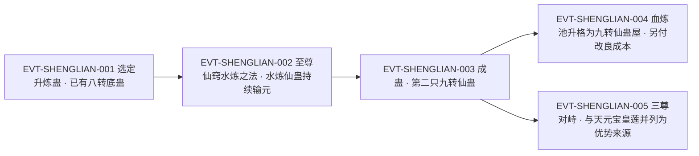

# 九转升炼蛊

九转升炼蛊是**方源的第二只九转仙蛊**（`E:V6-430632`），也是全批唯一以"**炼蛊能力本身**"为主题的实体：它不直接用于战斗，作用在炼制流程上——「升炼蛊一旦成为九转，对于将来方源升炼其他的八转仙蛊，有很大的帮助。」`E:V6-429518`。它的前身是八转升炼蛊，来自琅琊派，先后做过长毛炼道大阵与四元方悔血炼池的核心（`E:V6-429524`）；升到九转后，它把这整座仙蛊屋一并提升为「货真价实的九转仙蛊屋」`E:V6-433556`。

**本页的两项口径前置说明**：

1. **登记锚复核结果**：`roster-3.md` 给本 id 登记的锚点 `E:V6-429520`，经回原文逐字核对，落在**正文行**——该行是「就比如之前，方源升炼天元宝皇莲蛊，若是拥有九转升炼蛊，那么难度下降至少一倍！」，不是章节题名行、也不是子串行。本页的转数与机制证据同样取自正文。
2. **题名行单列**：本实体的 11 次命中里**有且仅有 1 行是章节题名行**——`E:V6-430424`「章节目录 第二百八十六节：九转升炼蛊！」。按契约，该行只作`该名在全书出现`的存在性证据，**不作转数与机制依据**。

全书出现`九转升炼蛊`共 **11 行 / 11 次**（含重复块、未去重）；母体名`升炼蛊`共 **26 行 / 27 次**，其中 **5 行是子串误切**（`提**升炼蛊**…`结构，含 `roster-3.md` 误挂给 `refine_log_5_01_gu` 的 `E:V6-394452`），实指本实体的 21 行。逐条账见《原著明确内容》。本页为 2026-09-28 A 线恢复批**新建页**，行号即 `E:V{段}-{6位行号}`（段号由行号机械推导）。

## 主题档案

### 一、本体与归属：炼道仙蛊「升炼蛊」的九转形态

#### 原著事实

- 它是方源的第二只九转仙蛊：「这是方源的第二只九转仙蛊，带给方源的帮助会相当的大。」`E:V6-430632`；选题时的原话：「我现在要做的，应当是炼制第二只九转仙蛊！」`E:V6-429508`
- 在候选中被明确挑出（排除法）：「不是春秋蝉、狗屎运，也不是态度蛊、如梦令蛊，而是升炼蛊。」`E:V6-429516`；决定句：「那就是——升炼蛊！」`E:V6-429514`
- 前身与来历（同一只蛊的八转状态）：「第一个优势，方源本身就拥有八转的升炼蛊。这只升炼蛊来自琅琊派，原先是长毛炼道大阵的核心，后来又称为了方源的四元方悔血炼池的核心。」`E:V6-429524`
- 道属：炼道。「第二个优势，升炼蛊乃是炼道仙蛊。虽然过程中也会涉及到一些律道仙材，但是远比天元宝皇莲蛊要好得多。炼道仙材占据绝大多数。」`E:V6-429526`
- 与自己擅长的流派一致：「还有一个关键，那就是天元宝皇莲蛊乃是木道仙蛊，升炼蛊却是炼道仙蛊，后者是方源最擅长的部分。」`E:V6-430108`
- 升转后的形态：「浩荡的水流中，全新的升炼蛊冉冉升起。」`E:V6-430616`、`E:V6-430618`
- 外形与八转无别、但已有质变：「九转的升炼蛊啊……」方源仔细端详着，发现仙蛊模样和之前八转并无多少差别。`E:V6-430628`；`E:V6-430630`
- 在血炼池四大核心中的位次：「这座仙蛊屋仍旧是四大核心仙蛊，升炼仙蛊、水炼仙蛊、仙级悔蛊，以及血本仙蛊。」`E:V6-433558`；`E:V6-433560`
- 同池其余核心的转数上限：「其中，血本仙蛊目前已经到达极限，无法升炼成九转。天庭在压制血道发展方面，可谓功不可没。」`E:V6-433562`

#### 合理推导

- **依据**：`E:V6-429524`、`E:V6-430616`、`E:V6-430630`、`E:V6-433554`、`E:V6-433560`；**结论**：`九转升炼蛊`与`升炼蛊`是**同一只蛊的两个转数状态**，而不是两只蛊——原文写的是"升炼、提升、安插回池"，不是"另炼一只"；`E:V6-433560` 的「升炼仙蛊已是九转」最直接；**不确定性**：`E:V6-430616` 用了「全新的升炼蛊」这一措辞，若按字面读也可能被理解为新个体，本页以"同一只蛊升转"为主口径，并把该措辞列为反例登记（见《待核对》）。
- **依据**：`E:V6-429526`、`E:V6-430108`、`E:V6-430110`；**结论**：它的"炼道"属性不是可有可无的标签，而是**降低炼制难度的直接原因**——同一段对比的是木道的天元宝皇莲蛊，处理炼道仙材"可比处理木道仙材要容易得多"；**不确定性**：原文没有给出"容易多少"的量化（唯一量化在 `E:V6-429520`，那是它升转**之后**带来的效果，不是炼制它本身的难度）。
- **依据**：`E:V6-433558`、`E:V6-433560`、`E:V6-433562`；**结论**：这座仙蛊屋的规格由**四只核心中最高的一只**决定——升炼蛊升到九转，整座池就成为九转仙蛊屋；**不确定性**：原文未写"仙蛊屋转数"是否只看核心蛊最高转数，本页只登记这一实例。

#### 《问真》设计意义

- `作用于炼制流程`的仙蛊在系统里对应**工艺加成件**：不给战力，给产出与成功率；这类道具的价值随主线越到后期越高（后期炼的都是八转、九转），与 `E:V6-429520` 的量化收益吻合。
- `同一只蛊升转后整座建筑规格跟着跃迁`适合做成**建筑—核心绑定**规则：核心蛊的转数即建筑等级的来源之一，而不是另建一套建筑等级。
- 它天然带一个"长期投资项目"的性格：到手即八转、可用性受限于持有者修为（后来的九转），与飞剑蛊、慧剑蛊是同一条设计线的不同强度版本。

### 二、炼制过程：以八转升炼蛊为底，主要采用水炼之法

#### 原著事实

- 两大优势（选题时的自陈）：`E:V6-429522`、`E:V6-429524`、`E:V6-429526`；成功率的判断：「方源乃是炼道尊者，对于炼道仙材的处理堪称万无一失。如此一来，成功率也会极大增加。」`E:V6-429528`
- 炼制的发生地与时间跨度：「就在方源暗中着手炼制九转升炼蛊的时候。」`E:V6-429530`；「至尊仙窍中，有关九转升炼蛊的炼制，已然进行到了中后段。」`E:V6-430098`
- 过程评价（旁白）：`E:V6-430100`；「方源甚至是一边炼制九转仙蛊，一边处理事务。」`E:V6-430112`
- 与上一只九转仙蛊的对照：「和上一次的情形完全不同，」`E:V6-430104`；`E:V6-430106`；`E:V6-430110`
- 炼制手法：「这一次炼制九转升炼蛊，方源主要采用的便是水炼之法。」`E:V6-430534`
- 手法的物理形态：「至尊仙窍中，数十道长河在高空飞舞。」`E:V6-430528`；「每一条河流中，都充斥着种种仙材。」`E:V6-430530`；收束时「却是此时，在至尊仙窍中，数十条河流合并，激荡起万千浪花。」`E:V6-430614`
- 同时进行的另一件事（并行叙事，非炼制代价）：「方源根本不需要什么元境提取之法，一面戏耍逗弄百足天君，一面炼制升炼蛊。」`E:V6-430526`

#### 合理推导

- **依据**：`E:V6-429524`、`E:V6-429526`、`E:V6-429528`、`E:V6-430100`、`E:V6-430112`；**结论**：这次炼制被作者刻意写成**全书最轻松的一次高阶炼制**——底蛊已有（八转升炼蛊）、仙材以炼道为主（正中方源本行）、持有者本人是炼道尊者，"太轻松了"是旁白给的判断；**不确定性**：原文未给这次炼制的时长与仙材清单，`E:V6-429530` 与 `E:V6-430098` 之间跨度（约 568 行）只说明"进行到中后段"，不能当作时长。
- **依据**：`E:V6-430534`、`E:V6-430536`、`E:V6-430528`、`E:V6-430614`；**结论**：「水炼之法」在本例中是**以河流为载体的连续性炼制**（数十道长河并行、河流中充斥仙材、最后合并成蛊），而不是单次投料；**不确定性**：原文没有说明水炼之法的通用机制，本页只登记它在本次炼制中的形态。

#### 《问真》设计意义

- `同类底蛊 + 本行仙材 + 本行持有者`这一组条件让它成为**炼制难度公式的样板**：三个条件同时满足时，过程可以"太轻松"；这也给产品一条明确的难度调节旋钮。
- `以水炼之法炼制`把它和四元方悔血炼池里的八转水炼仙蛊绑在一起（`E:V6-430536`），适合做成配方与载体耦合的炼制玩法：换手法就要换载体。

### 三、能力：让升炼其他八转仙蛊的难度下降至少一倍

#### 原著事实

- 能力总述：「升炼蛊一旦成为九转，对于将来方源升炼其他的八转仙蛊，有很大的帮助。」`E:V6-429518`
- 唯一的量化：「就比如之前，方源升炼天元宝皇莲蛊，若是拥有九转升炼蛊，那么难度下降至少一倍！」`E:V6-429520`
- 另一条可观测效果：「果然如他所料，因为拥有了第二只九转仙蛊，天机混淆杀招在他身上留下的层层渔网般的天道道痕，消耗的速度几乎比之前快了一倍！」`E:V6-430656`
- 作者的定性：「由此可见，九转升炼蛊带给方源的帮助，会有多么巨大。」`E:V6-430658`；「它意义重大，能影响很多后续的东西。」`E:V6-430660`
- 后续战局的复述（说话人：方源）：「那么之后，升炼九转天元宝皇莲蛊成功，是方源大大缩短了他和其他尊者之间的差距。」`E:V6-436560`；「九转升炼蛊则是再次缩短差距，并且更加深方源在炼道方面的特长。」`E:V6-436562`
- 与其并列的资产清单：「至尊仙窍、九转天元宝皇莲、九转升炼蛊，主修炼道辅修天道，天机混淆杀招种种因素，让我现在暗中拥有优势很大，气运和其余三尊总和不相上下。」`E:V6-436548`
- 未来的预期收益：「质变之后，将来升炼其他九转仙蛊，不会再有此次的难度了。」`E:V6-436554`

#### 合理推导

- **依据**：`E:V6-429518`、`E:V6-429520`、`E:V6-436554`；**结论**：它的能力有明确的作用域——**升炼其他仙蛊时的难度**，而不是炼制本身的其他环节（不写成功率、不写耗时）；量化只有一个锚点「至少一倍」，且是以"假如当时拥有"的反事实形式给出；**不确定性**：全书没有第二次用它升炼别蛊的实例，因此"至少一倍"是否能叠加、是否随目标转数变化，均无据。
- **依据**：`E:V6-430656`、`E:V6-436548`；**结论**：原文把「第二只九转仙蛊」带来的天道道痕消耗加速也记在它名下，但同句的因果主语是**"第二只九转仙蛊"这个身份**而不是升炼蛊的能力；**不确定性**：这一条可能是"多一只九转"的通用效果，也可能是升炼蛊特有，原文不足以判定，本页按口径并存登记（见《待核对》）。
- **依据**：`E:V6-430658`、`E:V6-430660`、`E:V6-436562`；**结论**：作者对它的定位是**炼道体系的放大器**（"更加深方源在炼道方面的特长"），不是单点道具；**不确定性**：原文未写它能否被他人使用（对照慧剑蛊有"需要本人的八转仙元"这条明文，本实体没有）。

#### 《问真》设计意义

- 「难度下降至少一倍」是少见的**可换算的工艺增益**：产品可直接落成"目标仙蛊升炼难度减半（下限）"，而不是模糊的"提升成功率"。
- 把它的增益限定在"升炼"这一具体动作上，可以避免它变成通用万能加成——这与 `E:V6-429518` 的原文字面一致。

### 四、代价与受益：谁支付、谁受益、何时支付

#### 原著事实

- **支付方＝方源（炼道尊者本人）**；**支付内容＝仙元，由八转水炼仙蛊持续接收**：「四元方悔血炼池中的核心仙蛊——八转水炼仙蛊，从炼制初始，就一直被灌输仙元，几乎没有停止过。」`E:V6-430536`
- **支付时点＝炼制全程持续**：同句「从炼制初始，就一直被灌输仙元，几乎没有停止过。」`E:V6-430536`
- **受益方一＝方源自身**：`E:V6-429518`、`E:V6-429520`、`E:V6-430632`、`E:V6-430658`
- **受益方二＝四元方悔血炼池（建筑本身升格）**：「四元方悔血炼池也会因此，提升为九转仙蛊屋。」`E:V6-430634`；`E:V6-433556`；并带来横向比较的跃升：「若说之前，四元方悔血炼池可能还和神帝城不相伯仲，但只要成为真正的九转，必定稳压神帝城一头了。」`E:V6-430646`；原因：「毕竟神帝城中可是没有九转仙蛊的。」`E:V6-430648`
- **受益方三＝它与池内其余核心的关系**：升炼蛊升为九转，其余三只仍为八转（`E:V6-433560`），血本仙蛊已到极限无法升炼（`E:V6-433562`）。
- **额外的一次支付**：升转后还需要**改良血炼池**以匹配九转的升炼仙蛊：「当然了，方源要对之前的四元方悔血炼池进行一番改良，让它能够匹配九转的升炼仙蛊。」`E:V6-430650`；完成时点：「方源将升炼蛊提升到了九转之后，便开始改良四元方悔血炼池。前一段时间完成之后，他便开始魂魄泡澡。」`E:V6-433554`
- 改良的难度：「方源乃是炼道尊者，炼道无上大宗师，要改良出这个来，难度并不大。」`E:V6-430652`
- 他对其地位的估价：「一旦我改良完毕，九转升炼蛊就能重现安插在四元方悔血炼池中，从而使得这座仙蛊屋也随之发生质变。若是有仙蛊屋排行榜，它必然是首位了。」`E:V6-430642`

#### 合理推导

- **依据**：`E:V6-430536`、`E:V6-430650`、`E:V6-433554`；**结论**：本实体的代价结构是**两段式**——炼制期间持续灌输仙元（支付方方源），炼制完成后还要再付一次"改良建筑"的成本（支付方仍是方源）；两次支付的受益方不同（第一次得蛊、第二次得可用的蛊屋）；**不确定性**：全书未给这两笔支出的数值，也未写改良的具体内容。
- **依据**：`E:V6-430646`、`E:V6-430648`、`E:V6-433556`；**结论**：这次炼制的一次性收益被写成**可比较的战力**（稳压神帝城一头），而比较的判据只是"有没有九转仙蛊"；**不确定性**：这是方源的内部估价（`E:V6-430644` 明写"方源在心中估量"），不是旁白的客观排名。
- **依据**：`E:V6-433560`、`E:V6-433562`；**结论**：这座池子的升格代价之一，是**它无法整体升格**——四核中只有升炼蛊到了九转，血本仙蛊受天庭压制而止步八转；**不确定性**：原文未写另外两只（水炼、仙级悔蛊）为何停在八转，也未写它们将来能否升。

#### 《问真》设计意义

- `持有但需另付成本才能用`和`建筑随核心升格、但不会整体升格`这两条合起来，能构成一条比"一次性升级"更耐玩的建筑成长线。
- 把"支付方"与"受益方"拆开（本页三处受益方）可以直接映射到产品里的多目标投资决策：同一笔投入同时喂养角色、建筑与后续配方效率。

### 五、身份边界与命名：升炼蛊、九转升炼蛊、同池子串误切与锚点复核

#### 原著事实

- 本名（本 id 的中文名）「九转升炼蛊」：11 行 / 11 次，行号 429520、429522、429530、430098、430424（**题名行**）、430534、430642、430658、433556、436548、436562。
- 母体名「升炼蛊」：26 行 / 27 次。逐条分类：
  - **子串误切 5 行**（形如“提”＋`升炼蛊`，实为「提升炼蛊」，非蛊名）：`E:V4-151884`、`E:V4-156140`、`E:V5-234350`、`E:V5-267300`、`E:V6-394452`
  - **实指本实体 21 行**：429514、429516、429518、429520、429522、429524（同行 2 次）、429526、429530、430098、430108、430424（题名行）、430526、430534、430616、430628、430642、430658、433554、433556、436548、436562
- **第三种字面形态「升炼仙蛊」（本页新增证据）**：全书 25 行 / 25 次，**是个同形歧义形态**，必须逐条看上下文：
  - **明确指本实体 4 行**：`E:V5-327224`「八转升炼仙蛊一直是长毛炼道大阵的核心。」（八转状态）、`E:V6-433558`（四大核心枚举）、`E:V6-433560`「升炼仙蛊已是九转，其余的三只仙蛊都是八转。」、`E:V6-433564`「升炼仙蛊成就九转」。
  - **两可 2 行**（既可读作蛊名，也可读作"升炼（动）仙蛊（宾）"）：`E:V6-430650`「让它能够匹配九转的升炼仙蛊。」、`E:V6-430654`「方源暂且放下升炼仙蛊，检查自身。」
  - **明确是动作短语 19 行**（升炼＋仙蛊，非蛊名）：`E:V5-309938`（**题名行**「章节目录 第六百六十三节：升炼仙蛊」）、`E:V5-310012`、`E:V5-310026`、`E:V5-310042`、`E:V5-310486`、`E:V5-310488`（措辞两可）、`E:V5-311608`、`E:V5-324442`、`E:V5-333614`、`E:V5-333620`、`E:V5-335784`、`E:V5-338546`、`E:V5-354192`、`E:V5-354356`、`E:V5-354448`、`E:V5-356544`、`E:V6-394330`、`E:V6-398258`、`E:V6-398260`。
  - 逐字对读：19 行那一组写的是「大规模升炼仙蛊」「支持毛民蛊仙们升炼仙蛊」「用来升炼仙蛊」一类，动宾结构完整；4 行那一组写的是「八转升炼仙蛊一直是长毛炼道大阵的核心。」「升炼仙蛊已是九转」一类，是名词性指称。
- 同一只蛊的两处硬对照（本页新增）：`E:V5-327224`「八转升炼仙蛊一直是长毛炼道大阵的核心。」与 `E:V6-429524`「原先是长毛炼道大阵的核心」**同述一个谓词、同一个建筑**，只是字面换了后缀；`E:V6-433560`「升炼仙蛊已是九转」与 `E:V6-433556`「容纳了九转升炼蛊」同指一池一蛊。
- `roster-3.md` 把 `refine_log_5_01_gu`（升炼蛊）的登记锚写作 `E:V6-394452`——该行原文是「但用九转仙材，炼制八转仙蛊，却是能略微提升炼蛊的成功率。」，其中的「升炼蛊」是**「提升炼蛊」被切出的子串**，**不是蛊名**。
- 题名行唯一：「章节目录 第二百八十六节：九转升炼蛊！」`E:V6-430424`。本批另以`节：升炼蛊`在全书检索得 **0 行**——即不存在标题为`第二百八十五节：升炼蛊！`的行。
- 同批三个子串误切 id 的独立复核（本页实跑，非转述）：
  - `refine_log_5_05_gu`（炼炉蛊）：全书「炼炉蛊」1 行 / 1 次，而「炼炉蛊阵」同为 1 行 / 1 次 → 该行是**阵名**，非蛊名。
  - `refine_log_2_03_gu`（合炼蛊）：全书「合炼蛊」12 行 / 12 次，「合炼蛊虫」同为 12 行 / 12 次 → **全部命中都被长名包含**，独立命中 0。
  - `refine_atk_1_04_gu`（化蛊）：全书「化蛊」46 行 / 49 次，而「炼化蛊虫」28 行 / 28 次、「衍化蛊」17 行 / 20 次、「虚化蛊阵」1 行 / 1 次，合计 49 次 → **全部命中都被长名包含**，独立命中 0。
- 对照实体（不是别名）：`天元宝皇莲蛊` 13 行 / 13 次，是**木道**仙蛊，与它互为"上一只九转"的对照（`E:V6-429520`、`E:V6-429526`、`E:V6-430108`）；`四元方悔血炼池` 77 行 / 78 次，是它的**载体建筑**而非同族蛊。

#### 合理推导

- **依据**：`E:V5-327224`、`E:V6-429524`、`E:V6-433556`、`E:V6-433560`、`E:V6-433564`；**结论**：「升炼仙蛊」「升炼蛊」「九转升炼蛊」三者是**同一实体的三种字面形态**，据此把「升炼仙蛊」登记为别名；判定依据是两条同指：八转期同指长毛炼道大阵核心，九转期同指四元方悔血炼池四大核心、且明写「已是九转」；**不确定性**：该形态 25 次命中里 19 次是"升炼＋仙蛊"的动宾短语，**检索该形态不能直接采信**，必须逐条看上下文（本页已在上一节列全分类账）。
- **依据**：`E:V6-429524`、`E:V6-433554`、`E:V6-433560`；**结论**：`九转升炼蛊`是`升炼蛊`的**九转状态称呼**，不是独立个体；本页**不把`升炼蛊`写进 aliases**，理由是 roster-3 已为它单独立了 id（`refine_log_5_01_gu`），写入 aliases 会让同库两个 id 互为别名；而`升炼仙蛊`在 roster-3 中没有 id，若不登记为别名则无处可查，故二者处置不同；**不确定性**：`roster-3.md` 为两者各立了一个 id（`refine_log_5_01_gu` 与 `refine_log_5_02_gu`），是否应合并属 roster 层的决定，本页不代其裁决（见《待核对》）。
- **依据**：`E:V6-394452`、`E:V4-151884`、`E:V4-156140`、`E:V5-234350`、`E:V5-267300`；**结论**：「升炼蛊」这一检索词存在一个**稳定形态的假阳性**——凡出现「提升炼蛊」的地方都会被切出一次，其中一处（394452）已被误用为锚点；**不确定性**：无，5 行已逐条看过上下文。
- **依据**：本页实跑的三组计数（炼炉蛊／炼炉蛊阵、合炼蛊／合炼蛊虫、化蛊／炼化蛊虫＋衍化蛊＋虚化蛊阵）；**结论**：这三个 id 的命中**全部被更长词包含**，属子串误切；**不确定性**：本页只做计数与包含关系判定，未逐行细读每一处的语义（如「虚化蛊阵」是否另有所指），故只登记"独立命中为 0"这一可判定结论。
- **依据**：`E:V6-430424` 与`节：升炼蛊`检索得 0 行；**结论**：本实体的题名行**只有一处**，此前批次记录中提到的"两处章节目录行`第二百八十五节：升炼蛊！`"在根原文中**不存在**；**不确定性**：该说法可能来自另一版本或另一洗稿文本，本页按本次实测登记并提出更正。

#### 《问真》设计意义

- 本实体是"**子串误切**"最集中的样本：单是「升炼蛊」一个词就有 5 行假阳性，而 `refine_log_5_01_gu` 的锚点恰好落在假阳性行上。这类错误不会报错、只会静默给出错的证据，因此预筛必须用最长匹配并逐条看上下文——这正是本批契约要求的做法。
- `同一只蛊的两个转数状态各占一个 id`是一个 roster 层的建模选择：若做成两页，读者需在两侧都读到"其实是同一只"；若合并，则"每只蛊一个 id"的一致性会被打破。产品侧对应的问题是：**转数变化时是升级同一实体，还是产出新实体**。

## 状态时间线

| 状态 ID | 阶段 | 状态 | 证据 |
|---|---|---|---|
| ST-SHENGLIAN-01 | 前身（八转） | 八转升炼蛊：来自琅琊派，原为长毛炼道大阵核心，后为方源四元方悔血炼池核心（原文亦作「八转升炼仙蛊」） | E:V5-327224、E:V6-429524 |
| ST-SHENGLIAN-02 | 选题 | 方源决定炼制第二只九转仙蛊，排除春秋蝉、狗屎运、态度蛊、如梦令蛊，选定升炼蛊 | E:V6-429508、E:V6-429514、E:V6-429516 |
| ST-SHENGLIAN-03 | 可行性 | 两大优势：底蛊已有、且为炼道仙蛊（仙材以炼道为主）；持有者是炼道尊者 | E:V6-429522、E:V6-429524、E:V6-429526、E:V6-429528 |
| ST-SHENGLIAN-04 | 炼制中 | 在至尊仙窍暗中炼制，一度进行到中后段；旁白评为「太轻松了」；主线事务可并行处理 | E:V6-429530、E:V6-430098、E:V6-430100、E:V6-430112 |
| ST-SHENGLIAN-05 | 手法 | 主要采用水炼之法；八转水炼仙蛊从炼制初始持续被灌输仙元；数十条河流并行后合并 | E:V6-430534、E:V6-430536、E:V6-430528、E:V6-430614 |
| ST-SHENGLIAN-06 | 成蛊 | 水流中全新的升炼蛊冉冉升起，赫然已是九转层次；外形与八转无多差别但已质变 | E:V6-430616、E:V6-430618、E:V6-430628、E:V6-430630 |
| ST-SHENGLIAN-07 | 能力（升炼增益） | 使将来升炼其他八转仙蛊难度下降至少一倍；将来升炼其他九转仙蛊不再有此难度 | E:V6-429518、E:V6-429520、E:V6-436554 |
| ST-SHENGLIAN-08 | 能力（连带观测） | 天机混淆杀招留下的天道道痕消耗速度几乎比之前快了一倍 | E:V6-430656、E:V6-430658、E:V6-430660 |
| ST-SHENGLIAN-09 | 建筑升格 | 四元方悔血炼池因容纳九转升炼蛊而成为货真价实的九转仙蛊屋，稳压神帝城一头 | E:V6-430634、E:V6-430646、E:V6-430648、E:V6-433556 |
| ST-SHENGLIAN-10 | 附加支出 | 升转后需改良血炼池以匹配九转升炼仙蛊，改良在前一段时间完成 | E:V6-430650、E:V6-430652、E:V6-433554 |
| ST-SHENGLIAN-11 | 池内格局 | 四核仍在（升炼、水炼、仙级悔蛊、血本），唯有升炼仙蛊为九转，其余三只八转，血本已到极限 | E:V6-433558、E:V6-433560、E:V6-433562 |
| ST-SHENGLIAN-12 | 战略定位 | 与至尊仙窍、九转天元宝皇莲并列为方源暗中优势的来源；被计为"再次缩短与尊者的差距" | E:V6-436548、E:V6-436560、E:V6-436562 |
| ST-SHENGLIAN-13 | 登记锚复核 | roster-3 的锚点 E:V6-429520 落在正文行；11 次命中中仅 1 行题名（E:V6-430424） | E:V6-429520、E:V6-430424 |

## 原著明确内容（本批取证窗口登记）

本批对「九转升炼蛊」在根原文全书扫描：**11 次命中 / 11 行**（含重复块，未去重）；对母体名「升炼蛊」扫描：26 次 / 26 行（另有 1 行重复块为 2 次，合计 27 次），其中 5 行为「提升炼蛊」子串误切，实指本实体 21 行；对第三种字面形态「升炼仙蛊」扫描：25 次 / 25 行，其中明确指本实体 4 行、两可 2 行、动作短语 19 行（含 1 行题名行，详见主题五）。另以`炼炉蛊／炼炉蛊阵``合炼蛊／合炼蛊虫``化蛊／炼化蛊虫／衍化蛊／虚化蛊阵`三组对照复核，独立命中均为 0（详见主题五）。下表登记本批实际读取的窗口。

| 窗口 | 内容要点 | 用途 |
|---|---|---|
| 429508–429530 | 决定炼制第二只九转仙蛊；排除法与选定；升转后对升炼其他八转仙蛊的帮助；量化「难度下降至少一倍」；两大优势；着手炼制 | 主题一、三、四 |
| 430094–430112 | 炼制进行到中后段；「太轻松了！」；天元宝皇莲蛊为木道而升炼蛊为炼道；一边炼制一边处理事务 | 主题一、二 |
| 430420–430430 | **章节题名行「第二百八十六节：九转升炼蛊！」**（仅存在性证据）；同窗为百足天君交易血道仙蛊 | 主题五（锚点口径） |
| 430522–430540 | 一面戏耍百足天君一面炼制升炼蛊；数十道长河并行、河中充斥仙材；主要采用水炼之法；八转水炼仙蛊持续被灌输仙元 | 主题二 |
| 430610–430660 | 数十条河流合并；全新升炼蛊升起、赫然九转；与八转无多差别但已质变；第二只九转仙蛊；血炼池升为九转仙蛊屋；与神帝城比较；改良以匹配九转；天道道痕消耗加速 | 主题一、三、四 |
| 433550–433562 | 升转后改良血炼池并完成；池成为货真价实的九转仙蛊屋；四大核心（升炼九转、其余八转）；血本仙蛊止步八转 | 主题一、四、五 |
| 309936–309940 | **第三种字面形态的题名行**：「章节目录 第六百六十三节：升炼仙蛊」——此处是"升炼＋仙蛊"的动作短语读法 | 主题五（同形歧义） |
| 327222–327226 | 八转升炼仙蛊一直是长毛炼道大阵的核心（第三种字面形态明确指蛊的用例） | 主题五 |
| 436544–436566 | 「四尊共存，三尊对峙」的资产清单含九转升炼蛊；升炼九转天元宝皇莲与九转升炼蛊各自缩短与尊者的差距；升炼九转天机蛊为转折点 | 主题三、五 |
| 394448–394456 | **子串误切样本**：「但用九转仙材，炼制八转仙蛊，却是能略微提升炼蛊的成功率。」——`roster-3.md` 把它误挂为 `refine_log_5_01_gu` 的锚点 | 主题五（锚点复核） |

题名行说明：本页命中中的 `E:V6-430424` 是章节目录题名行，本页**只把它当`该名在全书出现`的存在性证据**，不作转数与机制依据；转数与机制全部另取正文行（`ST-SHENGLIAN-13`）。

## 事件链

| 事件 ID | 事件 | 参与者 | 证据 | 因果 |
|---|---|---|---|---|
| EVT-SHENGLIAN-001 | 方源在九转仙蛊候选中排除春秋蝉、狗屎运、态度蛊、如梦令蛊，决定以已有八转底蛊升炼出第二只九转仙蛊——升炼蛊 | 方源 | E:V6-429508、E:V6-429514、E:V6-429516、E:V6-429522、E:V6-429524 | evidences ST-SHENGLIAN-01、ST-SHENGLIAN-02、ST-SHENGLIAN-03 |
| EVT-SHENGLIAN-002 | 方源在至尊仙窍以水炼之法炼制，八转水炼仙蛊自始持续接收仙元，数十条河流并行并最终合并 | 方源 | E:V6-429530、E:V6-430098、E:V6-430534、E:V6-430536、E:V6-430614 | evidences ST-SHENGLIAN-04、ST-SHENGLIAN-05 |
| EVT-SHENGLIAN-003 | 炼制成功：全新的升炼蛊升起，已是九转层次，成为方源第二只九转仙蛊 | 方源 | E:V6-430616、E:V6-430618、E:V6-430628、E:V6-430632 | evidences ST-SHENGLIAN-06 |
| EVT-SHENGLIAN-004 | 连带效果显现：四元方悔血炼池因容纳九转升炼蛊而升格为九转仙蛊屋；方源随即改良血炼池以匹配九转升炼仙蛊 | 方源 | E:V6-430634、E:V6-430642、E:V6-430650、E:V6-433554、E:V6-433556 | evidences ST-SHENGLIAN-09、ST-SHENGLIAN-10、ST-SHENGLIAN-11 |
| EVT-SHENGLIAN-005 | 三尊对峙阶段：方源把九转升炼蛊与至尊仙窍、九转天元宝皇莲并列为自己暗中优势的来源，并预期它将缩短与其余尊者的差距 | 方源、幽魂魔尊、星宿仙尊、巨阳仙尊 | E:V6-436546、E:V6-436548、E:V6-436560、E:V6-436562、E:V6-436566 | evidences ST-SHENGLIAN-12 |

事件口径：本页沿用实体簇号 `EVT-SHENGLIAN-*`（与 `ST-SHENGLIAN-*` 同簇）。事件节点 5 个，已达`≥3 节点应配图`的阈值，故配 mermaid 主干。EVT-SHENGLIAN-004 与 EVT-SHENGLIAN-005 **同源**（都由"拥有了第二只九转仙蛊"派生），二者之间无原文因果，故作并列分支、不连线。

## 资料整理

本页为**新建页**，没有旧版；本批来源只有根原文，没有 `notes:`／`memory:` 层转述进入本页事实区。相关派生记录的处置登记如下（**本段内容不得当作原著事实**）：

- `lore/wiki/gu/roster-3.md` 的 `refine_log_5_02_gu` 条目记为 `| refine_log_5_02_gu | 九转升炼蛊 | 5 | 9 | E:V6-429520 |`。本页复核结论：登记锚 `E:V6-429520` 是**正文行**（含"难度下降至少一倍"的那句），非题名行、非子串行，可以留用；原文转 9 与正文一致（`E:V6-430632`、`E:V6-433560`）。本页只登记，不改该页。
- 同文件 `refine_log_5_01_gu`（升炼蛊）的登记锚 `E:V6-394452` 落在**子串误切行**上（原文为「提升炼蛊的成功率」）。本页只登记该问题与证据，不改他家页面，也不修改 roster。
- 同文件 `refine_log_5_05_gu`（炼炉蛊，实为"炼炉蛊阵"）、`refine_log_2_03_gu`（合炼蛊，实为"合炼蛊虫"）、`refine_atk_1_04_gu`（化蛊，实为"炼化蛊虫"＋"衍化蛊"）三个 id 的子串误切性质，本页已按主题五的三组计数独立复核（计数一致，独立命中均为 0）。本页只登记，不改 roster。
- `game/data/gu_names.json` 与本实体相关的中文名只对应 `refine_log_5_02_gu`；`game/**` 只读，不在本批改动范围。
- 本页不声明桥接层 canon 字段、不新建桥接层 canon 编号（本轮口径：Canon 权威已在本 Wiki，桥接层文件只作消费层，本批不引用）。

## 分析与解读

以下为归纳，不是原文（须与上文`原著事实`区分）：

1. **它是全批唯一"收益写在工艺流程上"的实体**：飞剑蛊、慧剑蛊、浪迹天涯仙蛊的收益都在战斗侧，只有九转升炼蛊的收益是"下次炼东西更省力"（`E:V6-429518`、`E:V6-429520`），并且被量化到"至少一倍"。
2. **它的叙事价值在于"证明方源已经富到可以炼九转"**：作者用"太轻松了"`E:V6-430100` 与"一边炼制、一边处理事务"`E:V6-430112` 两句，把一次九转炼制写成日常；这与前一只九转（天元宝皇莲蛊，木道、要应对三尊压力 `E:V6-430104`）形成对照。
3. **它把"建筑"拉进了实体史**：本页 11 次命中里有 5 次的落点其实是四元方悔血炼池（`E:V6-430634`、`E:V6-430642`、`E:V6-430650`、`E:V6-433554`、`E:V6-433556`）。写这只蛊而不写池，会丢掉它一半的后果。
4. **它的能力条有且只有两条**：升炼难度减半（下限）、以及被记在"第二只九转仙蛊"名下的一次连带效果（`E:V6-430656`）。后者不宜当作它独有的能力（见《待核对》）。
5. **锚点风险在本页是两个方向**：`roster-3.md` 对 `refine_log_5_02_gu` 的锚点**是对的**（正文行），而它对 `refine_log_5_01_gu` 的锚点**是错的**（子串行）。同一个词根的两条记录一正一误，说明预筛不能只按词根批量出锚。
6. **本实体有四种字面层次**：`九转升炼蛊`（11 次，本 id 名）、`升炼蛊`（21 次实指 + 5 次子串误切）、`升炼仙蛊`（4 次明确指蛊 + 2 次两可 + 19 次动作短语）、以及动作词「升炼」（全书高频）。其中只有第一、第二种是安全的检索词；第三种必须逐条看上下文。这与飞剑蛊的`飞剑`一词遇到的是**同一类问题**：高频通用构词与专名同形。

## 待核对

- `[存在冲突]` **`同一只蛊升转`对`另炼新个体`**——主口径（同一只蛊）：`E:V6-429524`（已有八转的升炼蛊）、`E:V6-430630`（"它已经发生了质的变化"）、`E:V6-433554`（"方源将升炼蛊提升到了九转之后"）、`E:V6-433560`（"升炼仙蛊已是九转"）；反例口径（新个体）：`E:V6-430616`（"全新的升炼蛊冉冉升起"）。当前状态：本页采主口径，并在此登记反例措辞，不强行统一。
- `[存在冲突]` **`E:V6-430656` 那条连带效果的归属**——口径 A（算作升炼蛊的能力）：该行与 `E:V6-430658`「由此可见，九转升炼蛊带给方源的帮助，会有多么巨大。」相邻；口径 B（算作"第二只九转仙蛊"的通用效果）：该行自述的因果主语是「因为拥有了第二只九转仙蛊」。当前状态：并列登记，不强判。
- `[待取证]` **「至少一倍」的适用范围**：`E:V6-429520` 的量化是反事实句（"若是拥有"），且全书只出现一次；未能找到它第二次用于升炼别蛊的实例。属`尚未找到`，**不得写成`原著没有`**。
- `[原著未明确]` **炼制本次的实际成本数值**：机制 [已确认]（以八转升炼蛊为底、主要采用水炼之法炼制 `E:V6-430534`）；具体数值 [待取证]——`E:V6-430536` 只说水炼仙蛊"从炼制初始就一直被灌输仙元，几乎没有停止过"，未给仙元数量、未给时长（`E:V6-429530` 与 `E:V6-430098` 之间约 568 行只用于说明进度，不能当时间）。
- `[原著未明确]` **改良血炼池的具体内容**：`E:V6-430650` 只写"进行一番改良，让它能够匹配九转的升炼仙蛊"，`E:V6-430652` 只评"难度并不大"，未写改良了什么。
- `[原著未明确]` **它能否被本人以外的持有者使用**：全书未见此蛊与他人相关的行；对照慧剑蛊有"需要本人的八转仙元"明文，本实体没有这类说明。
- `[疑似子串误切]` **`refine_log_5_01_gu`（升炼蛊）的登记锚 `E:V6-394452`**：原文为「但用九转仙材，炼制八转仙蛊，却是能略微提升炼蛊的成功率。」——「升炼蛊」在此是「提升炼蛊」的切分产物，不是蛊名。建议把该 id 的锚点改到实指行（如 `E:V6-429514`）。本页只登记，不改 roster。
- `[疑似子串误切]` **`refine_log_5_05_gu`（炼炉蛊）／`refine_log_2_03_gu`（合炼蛊）／`refine_atk_1_04_gu`（化蛊）**：本页实跑计数为「炼炉蛊」1 行 = 「炼炉蛊阵」1 行；「合炼蛊」12 行 = 「合炼蛊虫」12 行；「化蛊」46 行 / 49 次 = 「炼化蛊虫」28 行 28 次 ＋「衍化蛊」17 行 20 次 ＋「虚化蛊阵」1 行 1 次。三者独立命中均为 **0**。建议在 roster 层复核。本页只登记。
- `[存在冲突]` **批次记录中的"两处章节目录行"与实测不符**：此前批次记录提到本实体命中含`第二百八十五节：升炼蛊！`。本批实测：以`节：升炼蛊`在根原文检索得 **0 行**，以「第二百八十五节」检索得 3 行（`E:V4-169864`「野生仙蛊，蛊阵痕迹」、`E:V5-243330`「金刚念」、`E:V6-430206`「天庭干预」），均与本实体无关；本实体的题名行**只有 1 处**，即 `E:V6-430424`「章节目录 第二百八十六节：九转升炼蛊！」。当前状态：以本次实测为准并登记该差异，供批次核对。
- `[存在冲突]` **两个 id 指同一只蛊的两个转数状态（Wiki 内部，非原文冲突）**：`roster-3.md` 同时登记 `refine_log_5_01_gu`（升炼蛊）与 `refine_log_5_02_gu`（九转升炼蛊）。按 `E:V6-429524`、`E:V6-433560`，两者是同一条蛊的八转／九转状态。是否合并属 roster 层决定，本页不代裁；建议上抛。
- **体量登记**：已超 40 KB（落盘实测 40,495 字节；按 1 KB=1000 B 计超 40 KB），按 GOVERNANCE 登记例外；**未为压体积删除任何有效知识**（「升炼仙蛊」25 次命中的三段分类账、三个幽灵 id 的复核计数均保留）。
- 2026-09-28：本页按 id 引用 roster-3，不以其行号定位（行号会随该文件增改位移）。

## 模板扩展建议（只登记，不改核心模板）

1. **`同一实体的不同转数状态`需要登记位**：本页与 `refine_log_5_01_gu` 的关系无法用现有 `aliases`／`身份边界`任一项单独表达——它不是别名（字面不同且语义不同），也不是同名异物（确是同一只）。建议在模板里给出"同一实体的转数状态"一栏，或在元数据里允许 `promoted_from` 一类的引用（只登记需求，本轮不改模板）。
2. **`作用域为工艺流程`的收益需要与战斗收益分开表达**：现有三层分源能写清事实，但页内没有区分"战力／产出／成功率"的位置；本页只能靠 `ST-` 行的文字承载。
3. **子串误切与同形短语应在模板层留下可复用的判据位**：本页对三个幽灵 id 的判定全靠"独立命中数 = 0"这一条计数口径，而第三种字面形态「升炼仙蛊」的判定靠的是"逐条看上下文后的分类账"（25 次里 19 次不是名词）。建议把两者都固化成一栏（"命中总数／被长名包含数／同形非实体数／独立命中数"），便于后续批次直接核对。

## 关联页面

[炼道](../world/refinement-path.md)、天道、[炼蛊与杀招链](../world/gu-refine-killer-chain.md)、[蛊的饲养与炼化](../world/gu-care-and-refinement.md)、[真元](../world/primeval-essence.md)、[修炼体系](../world/cultivation-system.md)、[道痕](../rules/dao-marks.md)、[蛊虫关系](gu-relations.md)、[蛊虫总表](roster.md)、[蛊虫总表三期](roster-3.md)、[蛊虫与蛊师能力来源](cultivator-effects-and-scouting.md)、[飞剑蛊](sword-atk-5-02-gu.md)、[慧剑蛊](wisdom-atk-5-05-gu.md)、[方源](../characters/fang-yuan.md)
