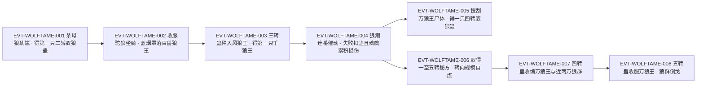

# 驭狼蛊

奴道**驭兽蛊族**的狼种分件。它与犬种件（[驭犬蛊](slave-atk-1-03-gu.md)）同机制、同账目结构，但**操控对象、品阶档位与获取路径都不同**：它能支配的是狼王一路的层级（百狼王／千狼王／万狼王／异兽），在方源以北原常山阴身份立身的那一段，它是**主力手段**——「今后我以常山阴的身份行走北原，得以驭狼为主」`E:V3-080864`。

原著把它归入「对魂魄上的控制，针对心智的主宰」`E:V3-081834`；它的机制要点是**化作轻烟罩落、种入目标魂魄，再由双方魂魄的强弱决定成败**。本页为 2026-09-28 A 线正式 20 页恢复批**新建页**，所有引文回根原文 `source/蛊真人-clean.txt` 逐行复核，行号即 `E:V{段}-{6位行号}`；正文按"原著事实／合理推导／《问真》设计意义"三层组织。本页对同族页 [驭犬蛊](slave-atk-1-03-gu.md) 做了**独立取证**，未照抄其结论，交叉核对结果登记于主题二与《分析与解读》。

## 主题档案

### 一、身份与品阶：奴道驭兽蛊族的狼种分件，原文明文为二转

#### 原著事实

- **归属与命名规则**：「一般兽王的身上，有可能寄生着驭兽蛊。譬如犬王的身上，有驭犬蛊。狼王的身上，就有驭狼蛊」`E:V3-078940`。
- **族属枚举**：「这兽，指的是驭兽蛊。驭熊蛊、驭狼蛊、驭虎蛊等等皆可，就算是驭鹿蛊、驭牛蛊也行」`E:V1-025948`。
- **道属定位**：「驭兽蛊、奴隶蛊，就是对魂魄上的控制，针对心智的主宰」`E:V3-081834`。
- **二转明文（多处实战）**：「哪怕是二转的驭狼蛊，方源也需要」`E:V3-078942`；「一只二转的驭狼蛊，便化作一团蓝烟，往下落去，罩住百兽狼王」`E:V3-080200`；「并获得了一只二转的驭狼蛊」`E:V3-080708`。
- **同族品阶—目标实例**：「驭熊蛊只是二转蛊虫，还奴役不了熊王」`E:V1-024900`。
- **本页取词与首现**：全书「驭狼蛊」命中 69 行，**均独立指称本蛊**（未检得被更长词包含的用例）；最早出现于族属枚举句 `E:V1-025948`，本页锚点取 `E:V3-078942`（与 `roster-3.md` 第 198 行登记一致）。
- **机制 [已确认] / 具体数值 [待取证]（拆条）**：机制＝化轻烟入魂、以魂魄压制夺控、一次性消耗，`[已确认]`（`E:V3-080200`、`E:V3-080202`、`E:V3-080866`）；具体数值＝单次魂魄消耗量、成功率、有效时长、轻烟浓淡与转数的换算，原文均未给，另列 `[待取证]`（见《待核对》）。

#### 合理推导

- **依据**：`E:V3-078942`、`E:V3-080200`、`E:V3-080708`（三处独立二转用例）；**结论**：本页锚定的这一枚驭狼蛊**品阶为二转**，与 `roster-3.md` 第 198 行"原文转 2／L0 裁定 2026-09-25 依原文改 rank（原 game=3）"**一致**，属**口径对齐**而非命名重用异常；**不确定性**：同名的三转／四转／五转驭狼蛊在原著中各自成立（见主题二），因此"驭狼蛊＝二转"只对**本页这一枚**成立。
- **依据**：`E:V1-024900`；**结论**：品阶是**能奴役对象层级的门槛**，而非"能不能用"的门槛——低阶蛊对高阶目标并非报错，而是**不到那一步**（对照 `E:V3-080868` 的转数—目标表）；**不确定性**：原文未给一张完整的逐转对应表。

#### 《问真》设计意义

- **可采规则（品阶即权限层级）**：控制类道具的品阶直接映射到"能支配的目标层级"，比命中率更能表达层级差；同时天然生成"升级换蛊"的持续投入。
- **可采规则（同名多品阶并存）**：同一族名的道具按品阶并存，登记时必须以"哪一枚"为准，避免把族名当成单一实体。

### 二、家族结构与命名边界：族属统称「驭兽蛊」，分件按兽种，本身横跨一转至五转

#### 原著事实

- **族属统称**：「这兽，指的是驭兽蛊」`E:V1-025948`；两条"凡驭兽蛊"式的通则句亦以族名立论：「但凡驭兽蛊，几乎都是消耗蛊，爆成轻烟之后，不管成功还是失败，都要消散掉的」`E:V3-080866`、「四转的驭兽蛊，可以控制万兽王」`E:V3-083834`。
- **分件按兽种**：犬王↔驭犬蛊、狼王↔驭狼蛊`E:V3-078940`；驭熊／驭狼／驭虎／驭鹿／驭牛皆可`E:V1-025948`。
- **族属上限（属驭兽蛊，非驭狼蛊）**：「准确的说，应当是方源直接借走了琅琊地灵的七转驭兽蛊。此仙蛊可控天下任何的野兽、异兽、万兽王、兽皇，以及荒兽、上古荒兽」`E:V4-129376`；同一事实在别处复述为「此仙蛊可控天下任何的野兽、异兽、万兽皇，甚至荒兽、上古荒兽！」`E:V3-085466`。
- **驭狼蛊本身横跨一转至五转**：「这是一转到五转的驭狼蛊秘方」`E:V3-089750`；「单单五转驭狼蛊秘方，就有八种。分别用不同的材料，不同的方法，得到相同的蛊虫。而一转到四转的驭狼蛊秘方，就更多了」`E:V3-089752`；「这些秘方，不仅从一转至五转应有尽有，而且每转驭狼蛊的秘方，都有不同种类」`E:V3-090658`；五转实战「方源趁机催动五转驭狼蛊，将其收服」`E:V3-100956`。
- **常见度**：「驭狼蛊这种常见的蛊方，不可能没有」`E:V3-089742`。

#### 合理推导

- **依据**：`E:V1-025948`、`E:V3-078940`；**结论**：`驭兽蛊` 是**族属统称**（按兽种分件：驭犬／驭狼／驭熊／驭虎／驭鹿／驭牛），不是与"驭狼蛊"并列的第二只蛊；本页把它列入 aliases 仅为检索便利，**性质已在正文声明**；**不确定性**：原文未给族属的封闭清单（是否还有驭蛇、驭马等未枚举件）。
- **依据**：`E:V3-089750`、`E:V3-089752`、`E:V3-090658`、`E:V3-100956`；**结论**：原著里的"驭狼蛊"是**一个跨一转至五转的系列**，每一转有不同种类的炼法却得到"相同的蛊虫"；因此 `slave_atk_3_04_gu` 这一 id 只对应**二转那一枚**，其余品阶在原著中各自独立；**不确定性**：六转及以上的驭狼蛊原文未給（族属的七转实例是驭兽蛊仙蛊，见 `E:V4-129376`），故不写成"驭狼蛊最高五转"。
- **与 [驭犬蛊](slave-atk-1-03-gu.md) 的交叉核对**：该页主张（1）消耗蛊、成败均消散（2）转数决定可控层级（三转驭千狼王、四转驭万狼王／异兽）（3）成年异兽需四转蛊。本页在驭狼蛊证据上**独立复核到相同结论**（`E:V3-080866`、`E:V3-080868`、`E:V3-083846`），**未发现不一致**；差异仅在**证据来源**：该页以其自身（犬种件）证据为主，本页全部取自狼种件与族属通则句。

#### 《问真》设计意义

- **可采规则（族属 + 分件两层数据）**：族属层放通则（一次性消耗、魂魄机制），分件层放兽种与品阶，能避免"六件驭兽蛊各写一遍通则"。
- **可采规则（族名与分件名都保留）**：检索时族名与分件名都要能命中，但**合并只在展示层，不在实体层**。

### 三、催动机制与生效条件：化轻烟入魂，由双方魂魄的强弱定成败

#### 原著事实

- **催动形态**：「驭狼蛊，去！」`E:V3-080198`；「一只二转的驭狼蛊，便化作一团蓝烟，往下落去，罩住百兽狼王」`E:V3-080200`；「驭狼蛊轻轻一爆，化为一股轻烟，罩落在驼狼的身上」`E:V3-080728`；「驭狼蛊，去！」方源伸手一指，二转的驭狼蛊化为一股轻烟，落在这头百狼王的身上`E:V3-083368`。
- **生效＝魂魄较量**：「百兽狼王激烈挣扎，魂魄上传来强烈的反抗之意。但面对方源百人魂的强势，它很快就一败涂地」`E:V3-080202`。
- **品阶映射为轻烟浓淡**：「三转驭狼蛊化成的轻烟，要比二转驭狼蛊浓郁许多，落在千狼王的身上」`E:V3-083500`；四转「驭狼蛊化为一大蓬的轻烟，朝着夜狼王兜头而下，将其罩住」`E:V3-084540`。
- **获取方式与转移**：买来的蛊「都是已经被别人炼化过的。当场完成交接后，这些蛊虫都成了方源所有」`E:V3-081842`；「他将这些蛊，都收入空窍之中」`E:V3-081844`。

#### 合理推导

- **依据**：`E:V3-080202`、`E:V3-083368`、`E:V3-083500`；**结论**：驭狼蛊的成败**不是命中判定，而是魂魄对抗**——轻烟只是投递方式，真正的判定发生在魂魄层；这也解释了为什么同一枚蛊对弱者一触即落、对强者屡屡失效；**不确定性**：原文未给量化规则（魂魄差多少倍可压住），也未说明施术者自身魂魄状态（如受损后）如何影响判定。
- **依据**：`E:V3-081842`、`E:V3-081844`；**结论**：成蛊是**可交接的资产**（已炼化即可易主，收入空窍），因此"囤蛊"在原著是常规战术；**不确定性**：原文未给单只空窍可容纳的数量上限。

#### 《问真》设计意义

- **可采规则（投递与判定分离）**：把"能不能送到"和"压不压得住"拆成两段判定，可以让目标既有闪避空间（守护蛊），也有对抗空间（魂魄强度）。
- **可采规则（成蛊可交易可囤积）**：按枚计数的消耗品天然产生"备货—损耗—补货"的资源曲线。

### 四、代价三要素：三种账单全在蛊师账上

#### 原著事实

- **账单之一·蛊本身一次性消耗**：「但凡驭兽蛊，几乎都是消耗蛊，爆成轻烟之后，不管成功还是失败，都要消散掉的」`E:V3-080866`；驭狼蛊自身亦被直接判定为消耗蛊（原文该处用字作"姓"，本页按义记作"性"，引文处不代改）：`E:V3-083642`；战果代价「抓了这么多的狼王，方源也因此消耗了不少的驭狼蛊」`E:V3-083644`。
- **账单之二·失败也扣**：狼王「忽然口吐火光，将轻烟烧灼得干干净净」`E:V3-083428`之后，「方源面色一冷，失去了二转驭狼蛊，令心口微微一痛」`E:V3-083430`。
- **账单之三·魂魄损耗**：「催动驭狼蛊，消耗的真元并不多，但关键还是魂魄」`E:V3-083460`；「方源连番收服百狼王，用百人魂屡次碾压百狼王。魂魄之间的碰撞较量，令方源魂魄震荡浮躁，心中的烦闷感觉越来越重」`E:V3-083462`；「如果不管不顾，还会发生头晕眼花的症状，更严重的会导致魂魄受损，丧失记忆，智力下降」`E:V3-083464`。
- **恢复的正当做法**：「方源闭目养神，平心静气，安定魂魄」`E:V3-083466`；「休息了一会儿，百人魂重新稳定下来，一切的烦闷感都烟消云散！」`E:V3-083468`。
- **减轻魂魄负担的正当路径**：有四转蛊后便能「减少魂魄上的负担」`E:V3-083844`（该处动词含清洗讹字，本页只引可核验的完整片段）。

#### 合理推导

- **三要素（支付方／受益方／支付时点）**：**支付方＝蛊师（同时支付蛊、魂魄与时间）**（`E:V3-080866`、`E:V3-083460`）；**受益方＝蛊师**（获得狼群的指挥权与战力，`E:V3-083714`）；**支付时点＝催动瞬间，成败均付**（`E:V3-080866`、`E:V3-083430`）——被夺取的狼自始至终**既不付费，也不受益**，它是被支配的一方；**不确定性**：原文未给魂魄损耗的量化值，也未给"失败时是否比成功时更省"的规则。
- **依据**：`E:V3-083460`、`E:V3-083462`、`E:V3-083464`；**结论**：这一机制的真正瓶颈**不是真元而是魂魄耐受度**——连番使用会造成累积损伤乃至"丧失记忆，智力下降"，因此它的战术节奏被设计成"打一阵、歇一阵"；**可能反例**：方源是百人魂的持有者（`E:V3-080202`），普通蛊师的承受阈值原文未给。

#### 《问真》设计意义

- **可采规则（成本记在使用者身上）**：把上限压在"使用者自己的核心资源"而非道具数量上，比冷却时间更能表达"这是拿自己换"。
- **可采规则（失败仍扣账）**：失败不退费的消耗品，能让每次出手都有决策重量；配合"可换目标再试"，风险与补救同时存在。

### 五、转数—目标对应与规模上限：控制件的效力对标目标当前层级

#### 原著事实

- **逐转对应**：「三转的驭狼蛊，能奴隶千狼王。四转的驭狼蛊，能奴隶万狼王，或者异兽」`E:V3-080868`。
- **二转的实战层级**：二转可用以种入百兽狼王`E:V3-080200`、百狼王`E:V3-083368`；也可用于日常坐骑——「距离驼狼还有两百步远时，方源手指一弹，催动二转驭狼蛊」`E:V3-080726`。
- **四转的目标层级**：「如果我有一只四转驭狼蛊的话，这头龟背万狼王就能被我收入麾下了，可惜」`E:V3-083832`；「你忘了我的手中，有一只四转驭狼蛊吗？」`E:V3-084100`；实战「瞧准时机，催动四转驭狼蛊」`E:V3-092266`。
- **间接驭群以省魂魄**：有四转蛊后能直接控制万狼王，再「通过狼王间接地」支配狼群，从而「减少魂魄上的负担」`E:V3-083844`。
- **目标成长即淘汰旧蛊**：「而他的异兽白眼狼，现在是幼体，用三转蛊还可奴隶。但是一旦成年，也需要四转蛊了，否则就会不听话，甚至逃遁」`E:V3-083846`。
- **规模实例**：狼潮战场「三只驭狼蛊化为轻烟落下，瞬间招揽了三只百兽王」`E:V3-083714`；水狼战场「又被方源用驭狼蛊收编了两千多头」`E:V3-089294`；四转蛊一役「就将这只万狼王，以及近两万的狼群，顺利收编」`E:V3-092268`。
- **缺蛊即卡死规模**：「没有这两种蛊的秘方，方源就没有大量的驭狼蛊。没有这些驭狼蛊，方源身边的狼群规模最多就只是数千头，根本上不了大的台面」`E:V3-080870`。

#### 合理推导

- **依据**：`E:V3-080868`＋`E:V3-083846`；**结论**：控制件的效力**对标目标的当前层级**，目标成长即令旧蛊失效；这不是"效果到期"，而是**层级不匹配**——故升级路径是"换更高转的蛊"而非"续费"；**不确定性**：原文未给二转的对应表项（只有三转／四转明文），也未给"异兽"与"万狼王"谁更难控。
- **依据**：`E:V3-080870`、`E:V3-092268`、`E:V3-092294`；**结论**：**规模由蛊的存量决定**，而存量由秘方决定——秘方是这条线的真正闸门（主题七）；数千头与近两万头之间的差距，本质是"有没有量产能力"；**不确定性**：原文未给"一头狼王能带多少头狼"的固定比例。

#### 《问真》设计意义

- **可采规则（层级匹配而非永久生效）**：目标变强 → 需要更高阶控蛊，可把"养成"与"控制"绑成一对互相追赶的曲线。
- **可采规则（秘方＝产能闸门）**：把规模上限放在"配方可得性"而非数值上，能让"搞到配方"成为一条独立任务线。

### 六、失败与反制：守护蛊可烧尽轻烟，魂魄碰撞会累积损伤

#### 原著事实

- **反制之一·火光烧烟**：「激战片刻后，他使出驭狼蛊」`E:V3-083426`；「轻烟一扬，眼看着就要落下，但这狼王忽然口吐火光，将轻烟烧灼得干干净净」`E:V3-083428`；随后下属解释「请少族长恕罪，这是此狼第一次使用这蛊！」`E:V3-083434`。
- **反制之二·焚身蛊护体**：「有着这只蛊虫，保护千狼王，驭狼蛊的轻烟还未落下，就会被焚烧得干干净净」`E:V3-083548`。
- **反制之三·阻断催动**：「这是金罡蛊，必须把它打掉！我才能催动驭狼蛊……」方源大叫道`E:V3-084366`。
- **换目标再试的正当做法**：「方源见一时间拾掇不下这头狼王，立即吩咐下去，将麻烦抛给其他人。而他自己则转移目标，靠近另一只狼王，再使出一只驭狼蛊」`E:V3-083436`。
- **狼王也有弱点**：「狼王的身上，没有防御蛊，难怪会被方源这般轻易杀死」`E:V3-078938`。

#### 合理推导

- **依据**：`E:V3-083428`、`E:V3-083548`、`E:V3-084366`；**结论**：驭狼蛊的反制**全部走"守方带蛊"这条路**——烧尽投递物（火光／焚身蛊）、或直接阻断催动（金罡蛊）；因此"目标身上有没有守护蛊"是判定的前置条件（与 [驭犬蛊](slave-atk-1-03-gu.md) 归纳的"目标无守护蛊"一致，`E:V3-084366`、`E:V3-083548` 为本页独立证据）；**不确定性**：原文未给"守护蛊能否被事先侦察出来"的规则，方源是靠临战试错发现的。
- **依据**：`E:V3-083434`；**结论**：**目标也会用蛊**，兽王的实力不止体魄，还包括它身上的寄生蛊；这使"收服"实质是**两套蛊虫体系的对抗**；**不确定性**：该句出自下属之口，具体蛊名与机制未展开。

#### 《问真》设计意义

- **可采规则（反制走守护件）**：让目标自带一件可被拆除的守护蛊，玩家就有"先拆再收"的可操作顺序，而不是纯概率。
- **可采规则（失败要留痕）**：失败扣蛊＋魂魄累积损伤，能让一次失败产生可感知的代价，同时不阻断继续尝试。

### 七、获取、炼制与市场：兽王身上寄生，四转以上市面一般不出售

#### 原著事实

- **野生寄生**：「一般兽王的身上，有可能寄生着驭兽蛊」`E:V3-078940`；「一般而言，兽王的身上，都会有可能寄生着相应的驭兽蛊」`E:V3-083646`；「虽然万兽王的身上，寄生四转驭兽蛊的几率较大」`E:V3-083852`。
- **猎杀取蛊**：方源「意外地发现这个狼窝的时候，就将窝里虚弱的母狼和幼崽全部杀死，并获得了一只二转的驭狼蛊」`E:V3-080708`；搜刮万狼王尸体的蛊师大喊「大人，发现了一只四转驭狼蛊！」`E:V3-083848`；「方源从这些狼王的身上，搜刮到一只三转驭狼蛊，五只二转驭狼蛊」`E:V3-083648`。
- **市面管制**：「因此北原的市面上，一般不会出售四转的驭兽蛊」`E:V3-083836`；「有许多蛊虫，到了四转之上，价值就会暴涨。驭兽蛊是其中之一，除此之外还有舍利蛊」`E:V3-083838`；方源「只收购到二转、三转的驭狼蛊，没有买到一只四转驭狼蛊」`E:V3-083840`。
- **市场成交实例**：「令方源惊喜的是，这店铺中居然有一枚四转的驭狼蛊，售价是七万元石，方源当即拿下」`E:V3-081694`；「一番讨价还价之后，方源又收购了五只三转驭狼蛊，三十八只二转驭狼蛊」`E:V3-081696`；「方源缺少驭狼蛊的秘方，几进几出后，顺利地买到了一转到三转的秘方」`E:V3-081680`。
- **自炼与秘方**：「我现在手中，有大量二三转的驭狼蛊不缺。四转的驭狼蛊，看来还得自己炼啊」`E:V3-083842`；从琅琊地灵处取得「一转到五转的驭狼蛊秘方」`E:V3-089750`；「如今一转到五转的驭狼蛊方，已经从琅琊地灵身上搞到手。只缺少这些毛民，来帮助他炼蛊了」`E:V3-090380`。
- **大规模炼制会惊动市场**：「不好，有人在大量收购驭狼蛊的炼制材料！」`E:V3-090644`；「这些蛊仙拦截的材料，只是大众化的驭狼蛊方而已」`E:V3-090660`。
- **储备位置**：「而在真元海底，沉积着大量的驭狼蛊、不少的十钧之力蛊，以及一些狼魂蛊」`E:V3-092716`；另一处「海底，收藏着大量的驭狼蛊，二转的偏多，三转的偏少，四转的没有一只」`E:V3-084772`。

#### 合理推导

- **依据**：`E:V3-078940`、`E:V3-083646`、`E:V3-083852`、`E:V3-083848`；**结论**：驭狼蛊的**主获取路径是"猎狼取蛊"**——杀死兽王后从寄生位搜刮，形成"以战养战"的循环（收服用掉、猎杀补回）；**不确定性**：原文只说"有可能寄生"，未给概率；`E:V3-083852` 的"几率较大"是修饰而非数值。
- **依据**：`E:V3-083836`、`E:V3-083838`、`E:V3-081694`；**结论**：**四转是价格与可得性的分水岭**——市面一般不出售、价值暴涨，唯有七万元石的一例偶然成交；故"高转控制力"在原著里是**特权而非商品**；**可能反例**：`E:V3-081694` 证明四转驭狼蛊确实出现在店铺中，"一般不出售"≠"绝不出现"。
- **依据**：`E:V3-089750`、`E:V3-089752`、`E:V3-090644`；**结论**：**秘方是产能闸门**，而"大量收购材料"这个动作本身会**暴露意图**（`E:V3-090644`），因此量产不是纯经济行为，还带着情报成本；**不确定性**：原文未给炼蛊的成材率与耗时。

#### 《问真》设计意义

- **可采规则（猎杀补货）**：把"消耗品的补给来源"绑在击杀同类目标上，能让控制流自带刷怪循环，不必依赖商店。
- **可采规则（采购暴露意图）**：大额收购材料触发外界反应，可把经济行为接入叙事与对抗，而不是纯结算。

## 状态时间线

| 状态 ID | 阶段 | 状态 | 证据 |
|---|---|---|---|
| ST-WOLFTAME-01 | 身份·族属 | 奴道驭兽蛊族按兽种分件的狼种件；「驭兽蛊」为族属统称 | E:V1-025948、E:V3-078940、E:V3-081834 |
| ST-WOLFTAME-02 | 品阶（本页锚定件） | 原文明文为二转（三处独立用例）；与 roster-3 第 198 行"原文转 2／L0 裁定"对齐 | E:V3-078942、E:V3-080200、E:V3-080708 |
| ST-WOLFTAME-03 | 品阶·系列跨度 | 同族秘方一转到五转皆有且每转多种；五转驭狼蛊有实战用例 | E:V3-089750、E:V3-089752、E:V3-090658、E:V3-100956 |
| ST-WOLFTAME-04 | 族属上限（非本件） | 族属存在七转仙蛊，可控天下野兽、异兽、万兽王／万兽皇、荒兽、上古荒兽 | E:V4-129376、E:V3-085466 |
| ST-WOLFTAME-05 | 催动形态 | 化蓝烟／轻烟罩落目标，种入魂魄；转数越高轻烟越浓 | E:V3-080198、E:V3-080200、E:V3-080728、E:V3-083500 |
| ST-WOLFTAME-06 | 生效条件 | 由双方魂魄强弱定成败；百兽狼王魂魄反抗后被百人魂碾压而败 | E:V3-080202 |
| ST-WOLFTAME-07 | 代价·一次性消耗 | 消耗蛊，爆成轻烟后成败均消散；失败亦扣（"失去了二转驭狼蛊"） | E:V3-080866、E:V3-083430、E:V3-083642 |
| ST-WOLFTAME-08 | 代价·魂魄损伤 | 催动真元不多但关键在魂魄；连番使用致震荡浮躁，重则魂魄受损、丧失记忆、智力下降 | E:V3-083460、E:V3-083462、E:V3-083464 |
| ST-WOLFTAME-09 | 转数—目标对应 | 三转驭千狼王；四转驭万狼王或异兽；四转后可间接驭群以减魂魄负担 | E:V3-080868、E:V3-083844 |
| ST-WOLFTAME-10 | 目标成长失效 | 异兽幼体三转可奴，成年即需四转蛊，否则不听话甚至逃遁 | E:V3-083846 |
| ST-WOLFTAME-11 | 反制 | 目标以火光／焚身蛊烧尽轻烟，或以金罡蛊阻断催动；收服可换目标再试 | E:V3-083428、E:V3-083548、E:V3-084366、E:V3-083436 |
| ST-WOLFTAME-12 | 获取·寄生与猎取 | 兽王身上可能寄生相应驭兽蛊；猎杀后自尸身搜刮（二／三／四转均有实例） | E:V3-078940、E:V3-083646、E:V3-083852、E:V3-083848 |
| ST-WOLFTAME-13 | 获取·市场与秘方 | 四转以上市面一般不出售、价值暴涨；秘方一至五转皆有、每转多至八种 | E:V3-083836、E:V3-083838、E:V3-083840、E:V3-089752 |
| ST-WOLFTAME-14 | 应用·规模 | 狼潮连番收编百兽王／千狼王；四转蛊一役收编万狼王及近两万狼群；缺秘方则规模止于数千头 | E:V3-083714、E:V3-092268、E:V3-080870 |
| ST-WOLFTAME-15 | 命名边界 | 「驭兽蛊」为族属统称、非并列第二蛊；本 id 对应二转那一枚 | E:V1-025948、E:V3-078940、E:V3-078942 |

## 原著明确内容（本批取证窗口登记）

本批以「驭狼蛊」为取证词扫全书得 69 行，**均独立指称本蛊**；另以「驭兽蛊」扫得 13 行（族属统称与通则句）。69 行中，1 行在段 1（族属枚举），其余集中于段 3 的青茅山—北原狼潮段（78940–100956），另 1 行在段 4（129376 属族属仙蛊口径，非驭狼蛊）。下表登记本批实际读取并用于本页的窗口。

| 窗口 | 内容要点 | 用途 |
|---|---|---|
| 24896–24900、25948–25952 | 驭兽蛊族属枚举（熊狼虎鹿牛皆可）；驭熊蛊仅二转、奴役不了熊王；食草兽需操纵其吞人 | 主题一、二 |
| 78936–78944 | 狼王身上没有防御蛊故易杀；兽王身上可能寄生驭兽蛊（犬王↔驭犬蛊、狼王↔驭狼蛊）；二转亦所需 | 主题一、三、六、七 |
| 80196–80202 | 「驭狼蛊，去！」化蓝烟罩住百兽狼王；狼王魂魄反抗，被百人魂碾压而败 | 主题三、五 |
| 80706–80728 | 以驼狼代步；杀母狼与幼崽得一只二转驭狼蛊；催动后化轻烟罩落驼狼 | 主题三、五、七 |
| 80862–80870 | 剩三转／二转各一只须谨慎使用；以常山阴身份行走北原得以驭狼为主；凡驭兽蛊几乎都是消耗蛊、成败均消散；三转驭千狼王、四转驭万狼王或异兽；无秘方则狼群止于数千头 | 主题一、二、四、五、七 |
| 81142–81158 | 三转驭狼蛊罩住风狼王，成功种下后得第一只千狼王 | 主题五 |
| 81678–81696 | 买到一至三转秘方；店铺偶得四转驭狼蛊（七万元石）；收购五只三转、三十八只二转 | 主题七 |
| 81826–81846 | 奴魂不分家；驭兽蛊／奴隶蛊是对魂魄的控制、针对心智的主宰；买来蛊已被他人炼化、交接后归己、收入空窍；储备以二三转驭狼蛊与三转狼魂蛊为重 | 主题一、三、七 |
| 83298–83300、83366–83368 | 敌方由蛊虫侦察得知百狼王被种下驭狼蛊；方源再以二转蛊罩落百狼王 | 主题三 |
| 83424–83442 | 狼王口吐火光烧尽轻烟（属首次使用该蛊）；失败即失去二转驭狼蛊；转攻他狼再使一枚 | 主题四、六 |
| 83458–83468 | 催动真元不多但关键是魂魄；连番碰撞致魂魄震荡浮躁，重则受损、失忆、降智；静养可复原 | 主题四、六 |
| 83496–83500 | 以三转蛊罩落千狼王；三转轻烟比二转浓郁许多 | 主题三、五 |
| 83546–83554 | 千狼王以焚身蛊护体，轻烟未落即被烧尽；一头不成可换一头 | 主题六 |
| 83616–83618 | 买下水狼群；白眼狼被种下三转驭狼蛊并以三更蛊加速成长 | 主题五、七 |
| 83638–83648 | 重点仍是驭狼蛊；驭狼蛊为消耗蛊、抓狼王耗掉不少；兽王身上可能寄生相应驭兽蛊；自尸身搜刮得一只三转、五只二转 | 主题四、七 |
| 83712–83724 | 连番出手三只驭狼蛊瞬间招揽三只百兽王；再出三转驭狼蛊 | 主题五 |
| 83830–83856 | 缺四转蛊收不下龟背万狼王；四转驭兽蛊可控制万兽王、一支万兽群即家族之力；四转以上市面一般不出售、价值暴涨；搜刮万狼王尸体得四转驭狼蛊 | 主题五、七 |
| 83918、84100 | 空窍中二转成堆、三转不少、四转一只；方源以四转蛊为底牌 | 主题七 |
| 84364–84366、84536–84540 | 金罡蛊护体须先打掉才能催动驭狼蛊；四转驭狼蛊化为一大蓬轻烟罩住夜狼王 | 主题三、六 |
| 84772 | 真元海底收藏大量驭狼蛊，二转偏多、三转偏少、四转无一只 | 主题七 |
| 85460–85472 | 秘方可换仙蛊（七转秘方换六转仙蛊）；琅琊福地另有一只七转驭兽蛊，可控野兽异兽万兽皇及荒兽、上古荒兽 | 主题二 |
| 89294 | 水狼战场以驭狼蛊收编两千多头 | 主题五 |
| 89736–89752 | 驭狼蛊是常见蛊方；琅琊地灵交给一至五转秘方，单五转就有八种，一至四转更多 | 主题二、七 |
| 90378–90380、90644–90660 | 需要大量驭狼蛊；一至五转方到手；大量收购炼制材料被外界察觉；秘方一转至五转应有尽有、每转不同种类 | 主题五、七 |
| 92262–92268 | 先以狼群分割蚕食，再以四转驭狼蛊收编野生万狼王与近两万狼群 | 主题五 |
| 92714–92716 | 真元海底沉积大量驭狼蛊、十钧之力蛊与狼魂蛊 | 主题七 |
| 92840–92852 | 方源将四转驭狼蛊交给只有三转修为的土波使用；其催动艰难、历好一会儿才缓慢催起 | 主题一、四 |
| 100954–100956 | 以五转驭狼蛊收服万狼王 | 主题二、五 |
| 129374–129378 | 八头荒兽皆借自琅琊地灵；七转驭兽蛊为仙蛊，可控天下野兽、异兽、万兽王、兽皇、荒兽、上古荒兽 | 主题二 |

## 事件链

| 事件 ID | 事件 | 参与者 | 证据 | 因果 |
|---|---|---|---|---|
| EVT-WOLFTAME-001 | 方源杀母狼与幼崽，取得第一只二转驭狼蛊 | 方源 | E:V3-080708 | evidences ST-WOLFTAME-02、ST-WOLFTAME-12 |
| EVT-WOLFTAME-002 | 以二转蛊收服驼狼作坐骑，又罩住百兽狼王；狼王魂魄反抗后被百人魂碾压而败 | 方源、百兽狼王 | E:V3-080726、E:V3-080728、E:V3-080200、E:V3-080202 | evidences ST-WOLFTAME-05、ST-WOLFTAME-06 |
| EVT-WOLFTAME-003 | 以唯一一只三转驭狼蛊种入风狼王，得到第一只千狼王 | 方源、风狼王 | E:V3-081144、E:V3-081146、E:V3-081158 | evidences ST-WOLFTAME-09 |
| EVT-WOLFTAME-004 | 狼潮战场连番催动：失败被火光／焚身蛊烧尽轻烟而损失蛊，成功则收服多只百兽王与千狼王；魂魄累积震荡 | 方源、蛮轰、葛光 | E:V3-083428、E:V3-083430、E:V3-083714、E:V3-083462 | evidences ST-WOLFTAME-07、ST-WOLFTAME-08、ST-WOLFTAME-11 |
| EVT-WOLFTAME-005 | 搜刮万狼王尸体得一只四转驭狼蛊 | 方源、搜刮蛊师 | E:V3-083848、E:V3-083856 | evidences ST-WOLFTAME-12 |
| EVT-WOLFTAME-006 | 自琅琊地灵处取得一至五转驭狼蛊秘方，转向规模自炼；大量收购材料引发外界察觉 | 方源、琅琊地灵 | E:V3-089750、E:V3-090380、E:V3-090644 | evidences ST-WOLFTAME-13 |
| EVT-WOLFTAME-007 | 以四转驭狼蛊收编野生万狼王及近两万狼群 | 方源 | E:V3-092266、E:V3-092268 | evidences ST-WOLFTAME-09、ST-WOLFTAME-14 |
| EVT-WOLFTAME-008 | 以五转驭狼蛊收服万狼王，狼群随其归附而分裂倒戈 | 方源、万狼王 | E:V3-100956、E:V3-100958 | evidences ST-WOLFTAME-03 |

事件口径：本页沿用实体簇号 `EVT-WOLFTAME-*`（与分配前缀 `ST-WOLFTAME-` 同簇，未与既有 EVT 前缀冲突）。事件节点 8 个，已达"≥3 节点应配图"的阈值，故配 mermaid 主干。

## 资料整理

本页为**新建页**，没有旧版；本批来源只有根原文，没有 `notes:`／`memory:` 层转述进入本页事实区。相关既有派生记录的处置登记如下（**本段内容不得当作原著事实**）：

- `roster-3.md` 第 198 行登记 `slave_atk_3_04_gu`｜驭狼蛊，原文转 2，锚点 `E:V3-078942`，备注"L0 裁定 2026-09-25 依原文改 rank（原 game=3）"。**本页复核：该行与原文一致**（二转三处独立明文），无需修正；本页只登记、不改该页。
- `roster-3.md` 第 199 行 `slave_atk_3_05_gu`｜驭熊蛊（原文转 2，锚点 `E:V1-024900`）与第 197 行 `qi_mov_4_06_gu` 同批裁定，均**非本页范围**；本页只在主题一引用 `E:V1-024900` 作为"品阶—目标"的同族旁证。
- [驭犬蛊](slave-atk-1-03-gu.md)（`slave_atk_1_03_gu`）是同族犬种件的实体页，其"消耗蛊、转数决定层级、成年异兽需四转蛊"等结论本页已**独立复核并一致**；本页未照抄其证据引用，两页页码不同、兽种不同。该页在 `sources` 中列有 Canon 索引条目，本页按本轮口径**不新建、不引用 CAN ID**，故 `sources` 只有根原文一项。
- `game/data/gu_lore.json`、`game/data/gu.json` 等游戏实现不在本批读取范围；《问真》数值以游戏仓库为唯一真相源，本页不写第二份游戏数据，也不据游戏数据反推 Canon。
- 狼魂蛊（选购／凝练魂魄的伴生件，`E:V3-081840`、`E:V3-092716`）在本批只作上下文出现，**尚无独立实体页**，故不在《关联页面》中挂链，其内容不入本页事实区。

## 分析与解读

1. **本页最大增量是"代价三账单全在蛊师账上"**。原文同时收三种费：蛊本身一次性消耗且**失败也扣**（`E:V3-080866`、`E:V3-083430`）、魂魄的累积损伤乃至"丧失记忆，智力下降"（`E:V3-083462`、`E:V3-083464`）、以及时间成本（静养复原，`E:V3-083468`）。**被夺取的狼既不付费，也不受益**——这是它与召唤类机制最根本的区别。
2. **成败判定发生在魂魄层，不在投递层**。`E:V3-080202` 写得最清楚：狼王"魂魄上传来强烈的反抗之意"，而结果是"面对方源百人魂的强势，它很快就一败涂地"。轻烟的浓淡（`E:V3-083500`）只是品阶的可视化，不是判定依据。
3. **二转这一枚的边界很干净**。它能拿下百兽狼王与百狼王（`E:V3-080200`、`E:V3-083368`）、也能种给驼狼当坐骑（`E:V3-080726`），但要千狼王就必须三转（`E:V3-080868`）；这与 `roster-3.md` 第 198 行的"原文转 2"**互证**。
4. **"驭狼蛊"在原著是一个跨一转至五转的系列**，不是单一实体。`E:V3-089752` 说单五转就有八种秘方，`E:V3-100956` 有五转实战。因此本页把 `slave_atk_3_04_gu` 明确限定为**二转那一枚**，其余品阶不并入——这是本页最重要的一条边界声明。
5. **族属统称与分件名要分清**。`驭兽蛊` 是族名（`E:V1-025948`、`E:V3-080866`），`驭狼蛊` 是分件名；族属另有七转仙蛊实例（`E:V4-129376`、`E:V3-085466`），**不得**据此把七转写成驭狼蛊的转数。
6. **本页与同族页无结论冲突**。逐条比对 [驭犬蛊](slave-atk-1-03-gu.md) 的三条核心结论后，本页在驭狼蛊证据上复核到相同结果；差异只在证据来源与对象兽种。零星差异记录在《待核对》。

## 待核对

- `[待取证]` **具体数值**（机制 `[已确认]` 见 `E:V3-080200`、`E:V3-080202`、`E:V3-080866`）：单次催动的魂魄消耗量、成功率、有效时长、轻烟浓淡与转数的换算关系，原文均未给。
- `[待取证]` **二转的对应表项**：`E:V3-080868` 只明文给出三转（千狼王）与四转（万狼王／异兽），二转的可控层级只能从实战（百兽狼王、百狼王、驼狼）推知，原文未给成文规则。
- `[原著未明确]` **六转及以上的驭狼蛊**：秘方明文到五转（`E:V3-089750`、`E:V3-090658`），五转有实战（`E:V3-100956`）；六转以上的驭狼蛊**未检得**任何表述。族属的七转实例是**驭兽蛊**（`E:V4-129376`、`E:V3-085466`），不能移植为驭狼蛊的转数。此条按"未检得"登记，**不得写成"原著没有"**。
- `[原著未明确]` **寄生概率**：`E:V3-078940`、`E:V3-083646` 均作"有可能寄生"，`E:V3-083852` 只作"几率较大"，无量化。
- `[原著未明确]` **能力边界**：被种入的狼能否被"解控"、主人死后控制是否解除、能否同时控制多头同类兽王，原文均未给。
- `[待取证]` **真元海底的存放上限**：`E:V3-084772`、`E:V3-092716` 只描述"沉积着大量"的现状，未给容量规则。
- `[存在冲突]` **游戏口径 × 原著口径（登记为改编／张力）**：`roster-3.md` 第 198 行记 game 转已按 L0 裁定 2026-09-25 改为 2（原 game=3），与原文二转**对齐**；本页据此**不登记为命名重用异常**，只登记"裁定已改"这一事实，且**不写第二份游戏数值**。若游戏侧仍存在按 3 转实现的旧数据，属实现层问题，本页不据以改写 Canon。
- `[原著未明确]` **CAN 覆盖**：本页无对应 Canon 索引条目（本轮不新建 CAN ID）。若后续需要桥接，缺口登记于此。

## 模板扩展建议（只登记，不改核心模板）

1. **需要"族属／分件"的两层表达**。`驭兽蛊`（族名）与 `驭狼蛊`（分件名）在原文是统称与实例的关系，现模板的 `aliases` 只能表达"同义"，表达不了"族属"，容易在别的分件页重复列同一族名。
2. **需要"品阶—目标"对应表位**。`E:V3-080868` 这类"某转可控某层级"的明文是控制件的核心参数，现模板把它埋在正文里，跨页比对只能靠人工。
3. **需要"代价分期"的表达**。本页的三种账单（蛊／魂魄／时间）支付时点相同而偿还方式不同（瞬时损耗 vs 累积损伤 vs 休息复原），现模板的"代价"一节无法区分。
4. **需要"原料可交易性"字段**。成蛊可交接、可囤积、可存放（`E:V3-081842`、`E:V3-084772`），与一次性投放的杀招在资源语义上完全不同。

## 关联页面

[奴道](../world/enslavement-path.md)、[狼潮](../events/wolf-tide.md)、[青茅山](../events/qing-mao-mountain.md)、[流派总表](../world/path-roster.md)、[蛊的饲养与炼化](../world/gu-care-and-refinement.md)、[炼蛊与杀招链](../world/gu-refine-killer-chain.md)、[杀招与组合](../rules/killer-moves.md)、[驭犬蛊](slave-atk-1-03-gu.md)、[蛊虫关系](gu-relations.md)、[蛊虫总表](roster.md)、[蛊虫总表三期](roster-3.md)、[方源](../characters/fang-yuan.md)。
