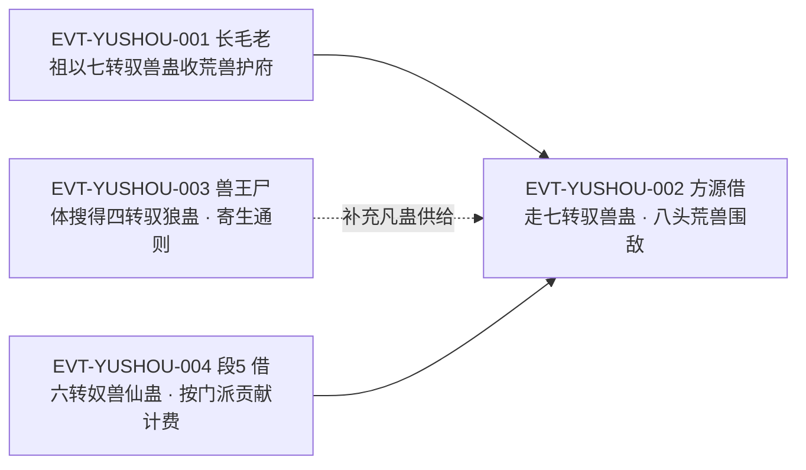

# 驭兽蛊

奴道驭兽一脉里**名字与实体最容易被混同**的一件。原著既用它泛指整个驭兽家族（「这兽，指的是驭兽蛊。驭熊蛊、驭狼蛊、驭虎蛊等等皆可」`E:V1-025948`），也用它指称具体的一只件（「四转的驭兽蛊，可以控制万兽王。」`E:V3-083834`），到仙蛊阶更直接写作「一只七转的驭兽蛊」`E:V3-085464`。全书 `驭兽蛊` 命中 13 行（15 次），另有 `驭兽仙蛊` 5 行与 `奴兽仙蛊` 21 行指向同一只仙蛊的两种名形态。

本页为 2026-09-28 第二批实体页**新建页**。本页的首要任务不是复述机制，而是把**身份边界**写清：它**不是**在库页 `slave-atk-1-03-gu.md`（驭犬蛊）、`slave-atk-3-04-gu.md`（驭狼蛊）的别名，也不因原文的统称用法而降格为泛称——roster 已把它单独立为独立 id。所有引文回根原文 `source/蛊真人-clean.txt` 逐行复核，行号即 `E:V{段}-{6位行号}`。

**检索口径（必读）**：本页对 `驭兽蛊` 与词根 `驭兽` 做了全量分类账。实测：`驭兽蛊` = 13 行（15 次），左邻字符为 是／纵／着／凡／的／转，**均非构词成分、无更长名后缀误切**；词根 `驭兽` = 36 行 = `驭兽蛊` 13 行 + `驭兽仙蛊` 5 行 + 称谓／技能／书名 18 行（含 `驭兽大师`、`驭兽术`、`驭兽造诣`，以及原文第 20、142 行网络小说书单中的《驭兽斋》——该两行落在无 E-ID 空间的卷首，只作裸行号登记）。交付前已用脚本断言 `枚举集合 == 实测集合` 通过。详见主题五。

## 主题档案

### 一、身份边界：一个 id，两种用法，且不是驭犬蛊／驭狼蛊的别名

#### 原著事实

- **统称用法**：「这兽，指的是驭兽蛊。驭熊蛊、驭狼蛊、驭虎蛊等等皆可，就算是驭鹿蛊、驭牛蛊也行。」`E:V1-025948`——此处 `驭兽蛊` 被用作「兽」这一材料的类名，后接分兽种的专名。
- **具体件用法**：「四转的驭兽蛊，可以控制万兽王。一旦有一支万兽群，对于一个家族而言，都是一股巨大的力量。」`E:V3-083834`；「因此北原的市面上，一般不会出售四转的驭兽蛊。」`E:V3-083836`。
- **仙蛊阶仍以此名相称**：「他知道琅琊福地中，还有一只七转的驭兽蛊。」`E:V3-085464`；「这驭兽蛊关系重大，地灵肯定也不会换。」`E:V3-085472`。
- **族属—分件关系的原文表述**：「一般兽王的身上，有可能寄生着驭兽蛊。譬如犬王的身上，有驭犬蛊。狼王的身上，就有驭狼蛊。」`E:V3-078940`；「一般而言，兽王的身上，都会有可能寄生着相应的驭兽蛊。」`E:V3-083646`。
- **在库页的比对基准**：驭犬蛊为**一转**（「方源收购了大量的一转驭犬蛊、二转纸鹤蛊，一转爆蛋蛊」`E:V2-060300`）；驭狼蛊为**二转**（「哪怕是二转的驭狼蛊，方源也需要。」`E:V3-078942`），且「驭狼蛊是一次姓的消耗蛊。」`E:V3-083642`；两者按兽种命名，本实体名面不分兽种。
- **roster 登记**：`slave-atk-4-02-gu.md` 一行由 `roster-3.md` 记为本实体（原文转 4、登记锚 `E:V3-083834`）；本页回原文打印该锚，**该行为正文行、不是章节题名行**，转数与功能证据都在该行。

#### 合理推导

- **依据：**`E:V1-025948`（统称）＋`E:V3-083834`（有转数的具体件）＋`E:V3-085464`（七转仍称此名）；**结论：**`驭兽蛊` 是**一名两用的词**——它在原文里既是驭兽家族的通名，也是一件有品阶、有唯一性（仙蛊仅一只）的具体蛊；roster 取其后一种用法立为独立 id，本页沿用该裁定；**不确定性：**原文从未声明**通名与专名同形**是有意设定还是行文习惯，本页只并列登记两种用法，不作合并或拆分。
- **代价与收益（三要素）**：**结论：**本条三方关系为——**支付方＝持蛊者**（支付一枚驭兽蛊，且按通则它一旦催动即消散）；**受益方＝持蛊者**（把目标兽王／兽群收入麾下，取得兽群这一军事力量）；**支付时点／生效条件＝催动瞬间**，成败均以蛊体消散为终点；**依据：**`E:V3-080866`、`E:V3-083834`；**不确定性：**原文未给催动的真元代价与魂魄代价量值，也未给蛊体消散以外的例外形态，本批尚未找到。
- **依据：**`E:V1-025948`、`E:V3-078940`、`E:V3-083646` 三句同构（`驭兽蛊` 后面紧接 `驭犬蛊`／`驭狼蛊` 之类的分件名）；**结论：**本实体与驭犬蛊／驭狼蛊是**族属名与按兽种分件名**的关系，**不是彼此的别名**——aliases 只在确证同实体时才填，故本页 `aliases: []`；**可能反例：**`E:V3-083834` 的语境是方源缺一只四转驭狼蛊，若把该句的 `驭兽蛊` 也读成通名，则**具体件**读法失去这一条证据，仅剩仙蛊阶的 `E:V3-085464` 支撑；本页对此按**不裁定**处理，并在《待核对》并列登记。
- **依据：**`E:V2-060300`（驭犬蛊一转）＋`E:V3-078942`（驭狼蛊二转）＋`E:V3-083834`（驭兽蛊四转）；**结论：**三者分属一转、二转、四转三个层级，**转数差异本身就是它们不能互为别名的硬证据**；**不确定性：**原文未给驭兽一脉的完整转数表，本页只能就三件各自成文的转数作比较。

#### 《问真》设计意义

- **可采规则（通名与专名同形的检索陷阱）**：同名既能当族属又能当件，正是玩家与策划最容易混同的地方；实现上应把**族属**与**实体**分成两个命名空间，UI 里给出显式区分，避免把族属名当成可持有的蛊。
- **可采规则（分件与总件的取舍）**：按兽种分件（犬、狼、熊……）能让玩家对特定兽群有专精；保留一件不分兽种的总件，则给出灵活但不专精的另一条路——两者并存构成可选策略面。

### 二、品阶与产能：四转控制万兽王，四转之上价值暴涨

#### 原著事实

- **四转的功能位**：「四转的驭兽蛊，可以控制万兽王。」`E:V3-083834`。
- **稀缺与不可购**：「因此北原的市面上，一般不会出售四转的驭兽蛊。」`E:V3-083836`。
- **价值跃升**：「有许多蛊虫，到了四转之上，价值就会暴涨。驭兽蛊是其中之一，除此之外还有舍利蛊。」`E:V3-083838`。
- **同阶对照**：「此蛊也是四转，但是比较起四转驭兽蛊，它的价值就低多了。因为容易炼制，成本低廉，在市面上也比较常见。」`E:V3-083876`（同段对照物为十钧之力蛊）。
- **兽王层级与蛊转数的对应**：「一般而言，百兽王的身上，寄生着二转野生蛊。千兽王的身上，是三转蛊。万兽王掌握着四转蛊。」`E:V2-035504`；分件侧的层级对照则见「三转的驭狼蛊，能奴隶千狼王。四转的驭狼蛊，能奴隶万狼王，或者异兽。」`E:V3-080868`。

#### 合理推导

- **代价与收益（三要素）**：**结论：**本条三方关系为——**支付方＝买方**（在四转件被市场锁死的条件下，支付高昂代价或自行炼制，向四转以上区间支付；对照句给出参照：同阶十钧之力蛊因易炼而便宜）；**受益方＝买方／家族**（取得可控制万兽王的件，进而取得一支万兽群——「对于一个家族而言，都是一股巨大的力量」）；**支付时点／生效条件＝购入或炼制时一次性支付**；**依据：**`E:V3-083834`、`E:V3-083836`、`E:V3-083838`、`E:V3-083876`；**不确定性：**原文未给四转件的实际售价与炼制工时，也未给四转以上区间的价格口径，本批尚未找到。
- **依据：**`E:V3-083836`＋`E:V3-083838`＋`E:V3-083876`；**结论：**本实体的价格不是随转数线性上升，而是在**四转这一档发生断裂**——市面不再出售，价值转而由炼制能力决定；**不确定性：**原文只给「一般不会出售」与**价值暴涨**两句定性话，未给四转驭兽蛊的实际价格，也未说明锁死的成因是管制、成本还是需求超过供给。
- **依据：**`E:V3-083834`＋`E:V3-080868`；**结论：**能力的量级随转数跳档（三转对应千狼王、四转对应万狼王、四转驭兽蛊对应万兽王），因此本实体的核心指标是**可控兽王层级**；**不确定性：**`万兽王` 与 `万狼王` 是否同层级、异兽与荒兽分别对应几转，原文未给统一表。

#### 《问真》设计意义

- **可采规则（四转断层）**：把某一转数设为市场供给的断点，可以让高阶件成为自制力的展示品，也能自然解释低转件为何长期有需求。
- **可采规则（同阶不同价）**：用十钧之力蛊这类**同阶但可量产**的对照件作反例，能让玩家理解定价取决于供给而非品阶，符合本体系一贯的经济逻辑。

### 三、消耗属性与寄生获取：兽王身上的现成货

#### 原著事实

- **消耗蛊通则**：「但凡驭兽蛊，几乎都是消耗蛊，爆成轻烟之后，不管成功还是失败，都要消散掉的。」`E:V3-080866`。
- **寄生位置**：「一般兽王的身上，有可能寄生着驭兽蛊。」`E:V3-078940`；「一般而言，兽王的身上，都会有可能寄生着相应的驭兽蛊。」`E:V3-083646`；「虽然万兽王的身上，寄生四转驭兽蛊的几率较大，但方源还是高兴。」`E:V3-083852`。
- **实战中的搜刮**：「果然，方源从这些狼王的身上，搜刮到一只三转驭狼蛊，五只二转驭狼蛊。」`E:V3-083648`；「“大人，发现了一只四转驭狼蛊！”」`E:V3-083848`。
- **真元代价（同场景旁证）**：「一下子治疗这么多的狼，对真元消耗很大。」`E:V3-083658`。
- **人兽葬生蛊的用料**：「这兽，指的是驭兽蛊。」`E:V1-025948`；「若是鹿、牛之类，天生食草的，就得要蛊虫操纵驭兽蛊，逼着它们将人吞吃下去。」`E:V1-025948`。

#### 合理推导

- **代价与收益（三要素）**：**结论：**本条三方关系为——**支付方＝持蛊者**（支付一枚驭兽蛊，且**无论成败都会消散**，失败亦不退还）；**受益方＝持蛊者**（成功则得到目标兽的控制权）；**支付时点／生效条件＝催动瞬间即支付，收益以成功为条件**——这是本实体最尖锐的一条：**成本确定、收益不确定**；**依据：**`E:V3-080866`；**不确定性：**原文未给成功率与失败的判定条件，也未给失败时真元与魂魄的实际损耗量，本批尚未找到。
- **依据：**`E:V3-078940`、`E:V3-083646`、`E:V3-083852`、`E:V3-083648`；**结论：**驭兽蛊的主要来源不是炼制而是**狩猎高阶兽王后取蛊**，因此**猎兽**与**扩军**在本实体的经济里是同一件事；**不确定性：**原文用「有可能」「几率较大」两处模糊语，未给具体寄生率，也未说明兽王生前是否主动使用身上的驭兽蛊。
- **依据：**`E:V1-025948`、`E:V1-025948`；**结论：**本实体在原文中还被当作**合炼材料的类别名**使用（人兽葬生蛊需要一只被操纵的兽来吞人），这进一步支持**通名用法确实存在**的判断；**不确定性：**该场景用的是驭熊蛊（`E:V1-025952` 处催起的是种在黑熊身上的驭熊蛊），原文并未真正消耗一只名为驭兽蛊的件，本页因此只把它当统称证据、不当具体件证据。

#### 《问真》设计意义

- **可采规则（成本确定、收益不定）**：把一次性消耗与成功率绑定，是压制兽海战术的有效旋钮；玩家会先算期望值再决定是否催动。
- **可采规则（猎兽得蛊）**：让高阶兽王身上携带可剥取的驭兽蛊，能把**打猎**与**扩军**串成同一条经济链，而不必依赖炼师供给。

### 四、道属与魂魄：奴道自魂道衍出，控制落在魂魄与心智

#### 原著事实

- **奴魂同源**：「自古奴魂不分家。」`E:V3-081830`；「奴道最初就是从魂道方面衍生的分支，后来蛊师们结合了太古智道，令奴道真正的读力出来。」`E:V3-081832`。
- **机制定性（与奴隶蛊并列）**：「驭兽蛊、奴隶蛊，就是对魂魄上的控制，针对心智的主宰。」`E:V3-081834`。
- **魂魄负担的旁证**：「有了四转蛊，他就能直接艹纵万狼王，通过狼王间接地艹纵狼群，减少魂魄上的负担。」`E:V3-083844`。
- **提升奴役效果的配套蛊**：「若是方源凝练成狼魂，对他奴役狼群也多有帮助。」`E:V3-081836`。
- **间接奴役的既有做法**：「他是通过奴役万兽王、千兽王、百兽王等，间接地掌控整个兽群大军。」`E:V4-179158`。

#### 合理推导

- **代价与收益（三要素）**：**结论：**本条三方关系为——**支付方＝控制者**（除蛊体消散外，另支付**魂魄上的负担**——层级越高、辖下兽群越大，负担越重）；**受益方＝控制者**（以间接操纵减少自身负担，取得兽群指挥权）；**支付时点／生效条件＝长期持有与操纵期间持续支付**，且可通过**以兽王间接控群**的方式降低单位成本；**依据：**`E:V3-083844`、`E:V3-081834`；**不确定性：**原文未给魂魄负担的量值与其上限的对应关系，也未给以兽王间接控群的省耗比例，本批尚未找到。
- **依据：**`E:V3-081830`、`E:V3-081832`、`E:V3-081834`；**结论：**驭兽蛊的机制**归属奴道、根在魂道**，其作用面是**对象的魂魄与心智**，因此它不是**驱赶野兽**的物理手段；**不确定性：**原文未写对魂魄的具体作用形态（种入、覆盖还是切断），也未给负担的量化口径。
- **依据：**`E:V3-083844`＋`E:V3-081836`；**结论：**本实体的效率可以通过**外挂件**（狼魂蛊一类）与**操控拓扑**（直控兽王而非逐只控群）两条路优化，即蛊、魂与组织方式三者共同决定效果；**不确定性：**这两条的量化收益原文均未给。

#### 《问真》设计意义

- **可采规则（控制有长期成本）**：把控制权与魂魄负担绑定，等于给大军团玩法上了持续代价，防止**收得越多越强**的单调增长。
- **可采规则（以王控群）**：让玩家通过控制兽王间接控制兽群，可以在不牺牲手感的条件下降低单位操作与代价——这是本体系里少见的**管理效率**型设计。

### 五、仙蛊阶：七转驭兽蛊／驭兽仙蛊／奴兽仙蛊，同指一只

#### 原著事实

- **七转的威能**：「此仙蛊可控天下任何的野兽、异兽、万兽皇，甚至荒兽、上古荒兽！」`E:V3-085466`；段 4 复述为「此仙蛊可控天下任何的野兽、异兽、万兽王、兽皇，以及荒兽、上古荒兽。」`E:V4-129376`。
- **护府战功**：「长毛老祖当年，就是用了此蛊，收服了许多荒兽，甚至几头上古荒兽，埋在十二云阁的地基下面。」`E:V3-085468`；「有这些荒兽护卫，整个琅琊福地固若金汤，一直顶了六波蛊仙的狂攻，直到第七波时才支撑不住。」`E:V3-085470`。
- **借蛊实战**：「准确的说，应当是方源直接借走了琅琊地灵的七转驭兽蛊。」`E:V4-129376`；「八头荒兽，皆是方源从琅琊地灵处借来的。」`E:V4-129374`。
- **另一名形态 `驭兽仙蛊`**：「他知道，琅琊地灵的手中有一只驭兽仙蛊，奴隶了十二头荒兽，分别隐藏在十二云阁之下。」`E:V4-122890`。
- **另一名形态 `奴兽仙蛊`**：「驭兽仙蛊只有一只，存放在琅琊福地当中。使用此蛊奴役荒兽，见效一瞬之间，荒兽进退如意，心随意动，这是奴道的无上杰作。」`E:V4-145562`；紧邻三行内则写作「他虽然没有奴兽仙蛊，但通过其他方法。也可稍稍控制这等荒兽。」`E:V4-145560`、「方源没有奴兽仙蛊，其他奴道蛊仙自然也没有。」`E:V4-145564`。
- **唯一性与稀有**：「奴兽仙蛊仅有一只，但控制荒兽的办法，却有许多。」`E:V4-145384`；「驭兽仙蛊只有一只，存放在琅琊福地当中。」`E:V4-145562`。
- **段 5 的六转口径**：「他拍开木盒，盒中躺着一只仙蛊，不是其他，正是六转奴兽仙蛊！」`E:V5-202278`；「可是六转奴兽仙蛊，需要数万的门派贡献……」`E:V5-223624`；借用方式为「奴兽仙蛊只算是门派借给我的，每一次借用，都要按照时间长短，支付门派贡献。」`E:V5-223622`。

#### 合理推导

- **依据：**`E:V4-145560`、`E:V4-145562`、`E:V4-145564` 三行紧邻而两种名字交替出现，且 `E:V4-122890`／`E:V4-145562` 与 `E:V4-145384` 都记「仅有一只」；**结论：**`驭兽仙蛊` 与 `奴兽仙蛊` 是**同一只仙蛊的两个名形态**，本页据 `aliases` 只收同实体别名的原则，仍**不写入 aliases**（因为它同时是 `驭兽蛊` 的仙蛊阶形态，写进去会与 `name` 同名或引入族属歧义），改为在**此处正文明确定性**；**不确定性：**原文未声明两者同为一只，本页的判定建立在「仅有一只」与相邻交替两处证据上。
- **口径并列（转数）**：**依据：**A 侧证据——**口径 A＝七转**，证据 `E:V3-085464`（`还有一只七转的驭兽蛊`）、`E:V4-129376`（`借走了琅琊地灵的七转驭兽蛊`）；B 侧证据——**口径 B＝六转**，证据 `E:V5-202278`（`正是六转奴兽仙蛊！`）、`E:V5-223624`（`可是六转奴兽仙蛊`）。**当前状态：不裁定**。**结论：**同一实体的转数在段 4 与段 5 出现七转与六转两种口径，本页并列登记、不裁定。段 4 与段 5 相隔约 74,000 行，可能是同一只蛊的品阶在设定上发生了变动，也可能是两处所指并非同一只，原文未作交代。**不确定性：**原文未交代两种口径的先后或改设说明，也可能是两只不同的仙蛊；本批尚未找到可裁定的第三处证据。
- **代价与收益（三要素）**：**结论：**本条三方关系为——**支付方＝借用者**（按借用时长支付门派贡献，或支付数万贡献以图买下）；**受益方＝借用者**（以一只仙蛊统辖多头荒兽，取得远超自身层级的战力）；**支付时点／生效条件＝按借用时长分期支付**，费用随持有时间累积；**依据：**`E:V5-223622`、`E:V5-223624`、`E:V4-129376`；**不确定性：**原文未给门派贡献的具体数额、借用时长的计量口径与买断价的可谈范围，本批尚未找到。
- **依据：**`E:V3-085466`＋`E:V3-085468`＋`E:V4-129376`；**结论：**仙蛊阶的本实体不只是战力件，更是**地缘级资产**——它的历史用途是埋荒兽于地基下充当护府屏障，其价值锚定在被护卫的据点而非单场战斗；**不确定性：**原文未给仙蛊阶的使用代价（真元、魂魄负担、是否有次数限制）。

#### 《问真》设计意义

- **可采规则（借而不给）**：把最强的一件设为**可借不可得、按时间计费**，能在保留顶级战力的同时，避免它被永久持有而失衡。
- **可采规则（据点级资产）**：让仙蛊的用途从**打一场**扩展到**守一座**，能给据点防御提供非建筑类的解法。
- **可采规则（同一实体的两名并存）**：原文自身就这样用，实现层应允许多名指向同一对象，避免把两个名字做成两件蛊。

## 状态时间线

| 状态 ID | 阶段 | 状态 | 证据 |
|---|---|---|---|
| ST-YUSHOU-01 | 身份边界 | 原文一名两用：既作驭兽家族的统称，也作有品阶的具体件；roster 取后者立为独立 id | E:V1-025948、E:V3-083834 |
| ST-YUSHOU-02 | 族属—分件 | 与驭犬蛊（一转）、驭狼蛊（二转）是族属名与分件名，非别名；本页 aliases 为空 | E:V3-078940、E:V2-060300、E:V3-078942 |
| ST-YUSHOU-03 | 品阶产能 | 四转者可控制万兽王；一支万兽群对一个家族即是巨大力量 | E:V3-083834 |
| ST-YUSHOU-04 | 稀缺与价值 | 北原市面一般不出售四转驭兽蛊；四转之上价值暴涨，与舍利蛊同列；同阶十钧之力蛊因易炼而便宜 | E:V3-083836、E:V3-083838、E:V3-083876 |
| ST-YUSHOU-05 | 消耗属性 | 但凡驭兽蛊几乎都是消耗蛊，爆成轻烟，无论成败都要消散 | E:V3-080866 |
| ST-YUSHOU-06 | 获取路径 | 兽王身上可能寄生相应驭兽蛊；万兽王寄生四转件几率较大；实战中可从兽王尸体搜刮 | E:V3-078940、E:V3-083646、E:V3-083852、E:V3-083648 |
| ST-YUSHOU-07 | 道属 | 奴道自魂道衍生并合入太古智道；本实体与奴隶蛊同列为对魂魄上的控制、心智的主宰 | E:V3-081830、E:V3-081832、E:V3-081834 |
| ST-YUSHOU-08 | 魂魄负担 | 以四转蛊直控万狼王、再由狼王间接控群，可减少魂魄上的负担 | E:V3-083844 |
| ST-YUSHOU-09 | 仙蛊阶 | 琅琊福地藏一只七转驭兽蛊，可控天下任何野兽、异兽、万兽皇、荒兽、上古荒兽；长毛老祖曾以之收服荒兽护府 | E:V3-085464、E:V3-085466、E:V3-085468 |
| ST-YUSHOU-10 | 仙蛊名形态 | 驭兽仙蛊与奴兽仙蛊交替出现、均记仅有一只；助役十二头荒兽 | E:V4-122890、E:V4-145562、E:V4-145384 |
| ST-YUSHOU-11 | 用料位 | 人兽葬生蛊合炼中「兽」即指驭兽蛊，熊狼虎鹿牛皆可，食草兽需蛊虫操纵其吞人 | E:V1-025948、E:V1-025948 |

## 原著明确内容（本批取证窗口登记）

本批以 `驭兽蛊` 为取证词扫全书得 13 行（15 次）；另以词根 `驭兽` 扫得 36 行、以 `驭兽仙蛊`／`奴兽仙蛊` 分别扫得 5 行／21 行。下表登记本批实际读取并用于本页的窗口。

| 窗口 | 内容要点 | 用途 |
|---|---|---|
| 25944–25952 | 人兽葬生蛊的材料分野：人须处女蛊师，兽即指驭兽蛊；熊狼虎鹿牛皆可；食草兽需蛊虫操纵其吞人；催起种在黑熊身上的驭熊蛊 | 主题一、三 |
| 78936–78946 | 兽王身上可能寄生驭兽蛊；犬王对应驭犬蛊、狼王对应驭狼蛊；二转驭狼蛊也为方源所需 | 主题一、三 |
| 80862–80872 | 三转／二转驭狼蛊存量告急；缺少三转、四转驭狼蛊秘方；驭兽蛊几乎都是消耗蛊；三转驭狼蛊能奴隶千狼王 | 主题三、四 |
| 81830–81840 | 自古奴魂不分家；奴道自魂道衍生并合入太古智道；驭兽蛊、奴隶蛊同列为对魂魄上的控制、心智的主宰 | 主题四 |
| 83640–83660 | 驭狼蛊是一次性消耗蛊；兽王身上可能寄生相应驭兽蛊；搜刮狼王尸体得三转一只、二转五只 | 主题三 |
| 83828–83880 | 四转驭兽蛊可控制万兽王；北原市面一般不出售四转驭兽蛊；四转之上价值暴涨并例举舍利蛊；万兽王寄生四转驭兽蛊几率较大；十钧之力蛊同阶而廉价 | 主题二、三 |
| 85458–85478 | 琅琊福地中另有一只七转驭兽蛊，可控一切兽与荒兽；长毛老祖以此收服荒兽埋于十二云阁地基下 | 主题五 |
| 122886–122892 | 琅琊地灵手中有一只驭兽仙蛊，奴隶了十二头荒兽，分藏十二云阁之下 | 主题五 |
| 145382–145390、145558–145566 | 奴兽仙蛊仅有一只，但控制荒兽的办法有许多；驭兽仙蛊只有一只，存放在琅琊福地；相邻三行两种名字交替出现 | 主题五 |
| 202276–202282、223620–223626 | 段 5 口径：盒中仙蛊正是六转奴兽仙蛊；向毛十二商借、愿以门派贡献支付；借用按时长计费、买下需数万贡献 | 主题五 |
| 129370–129382 | 方源借走琅琊地灵的七转驭兽蛊；此仙蛊可控任何野兽、异兽、万兽王、兽皇、荒兽、上古荒兽；八头荒兽围困鹤风扬与苍郁仙子 | 主题五 |
| 原文第 20 行、原文第 142 行 | 网络小说书单中的《驭兽斋》——词根命中但与本实体无关，两行落在无 E-ID 空间的卷首，只作裸行号登记 | 主题一（检索口径） |

## 事件链

| 事件 ID | 事件 | 参与者 | 证据 | 因果 |
|---|---|---|---|---|
| EVT-YUSHOU-001 | 长毛老祖以七转驭兽蛊收服大量荒兽与几头上古荒兽，埋于十二云阁地基之下；这些荒兽护卫使琅琊福地固若金汤，顶住六波蛊仙狂攻 | 长毛老祖、琅琊福地 | E:V3-085468、E:V3-085470 | 因：取得七转驭兽蛊；果：EVT-YUSHOU-002 的资产基础 |
| EVT-YUSHOU-002 | 方源直接借走琅琊地灵的七转驭兽蛊，以八头荒兽围困鹤风扬与苍郁仙子 | 方源、琅琊地灵、鹤风扬、苍郁仙子 | E:V4-129374、E:V4-129376 | 因：EVT-YUSHOU-001 遗留的荒兽与仙蛊；果：地魁荒兽等参战 |
| EVT-YUSHOU-003 | 北原万狼王之战后，方源从兽王尸体上搜刮到一只四转驭狼蛊，并依兽王身上多寄生相应驭兽蛊的通则取得补充 | 方源、葛家老族长 | E:V3-083646、E:V3-083848、E:V3-083852 | 因：EVT-YUSHOU-004 的猎兽行动；果：补齐四转控制能力 |
| EVT-YUSHOU-004 | 段 5 方源向毛十二商借六转奴兽仙蛊，愿以门派贡献支付；毛十二改提另一要求；该蛊借用按时长计费、买下需数万门派贡献 | 方源、毛十二 | E:V5-202278、E:V5-202280、E:V5-223622、E:V5-223624 | 因：需要一只可控制荒兽的仙蛊；果：获得段 5 的荒兽控制力 |

事件口径：本页沿用实体簇号 `EVT-YUSHOU-*`。事件节点 4 个，**已达事件节点 3 个以上应配图的阈值，故配 mermaid 主干**；虚线表示供给或前置关系，而非直接的时序因果。四次事件跨段 3、段 4、段 5，段 1 与段 2 的本实体记载均为材料与建制语境。

## 资料整理

本页为**新建页**，没有旧版；本批来源只有根原文，没有 `notes:`／`memory:` 层转述进入本页事实区。相关派生记录与既有页的处置登记如下（**本段内容不得当作原著事实**）：

- `roster-3.md` 条目 `slave_atk_4_02_gu`：原文转 4、game 转 4（`一致`）、登记锚 `E:V3-083834`、名命中 15。**本页复核：锚点行与原文一致**（`E:V3-083834` 为正文行、明文四转可控制万兽王），本页只登记、不改该页。
- **L0 本轮裁决的落实**：`slave-atk-1-03-gu.md`（驭犬蛊）与 `slave-atk-3-04-gu.md`（驭狼蛊）两页中，本实体作为族属统称出现；L0 已把它从二者的 aliases 中摘出，本页据此**不并入它们、也不把它们并入本页**，并以 `aliases: []` 保持独立身份。
- **不沿用既有页的口径**：`slave-atk-3-04-gu.md` 把 `驭兽蛊` 写成族名兼按兽种分件的统称口径。本页**不照搬**该口径作为本实体的定义——原文确实存在统称用法（见主题一），但 roster 取的是具体件用法，本页按**一名两用、并列登记**处理。
- **id 归类张力（派生层）**：该实体 id 为 `slave_atk_4_02_gu`（奴道·攻击），而原文对它的机制定性是「对魂魄上的控制，针对心智的主宰」`E:V3-081834`，并非物理攻击。本轮不改 id（id 由 roster-3 核定，禁另造），仅按改编／张力登记该张力于《待核对》。
- `game/**` 只读，不在本批改动范围；本页不写第二份游戏数值，也不据游戏数据反推 Canon。

## 分析与解读

1. **本页的核心结论是身份**：`驭兽蛊` 是一个**一名两用的词**，但其具体件用法有转数（四转）、有功能（控制万兽王）、有仙蛊阶（七转），足以成立为独立实体；`aliases` 因此留空，关系全部写进正文而不是别名表。
2. **它与驭犬蛊／驭狼蛊不可互为别名，有三重硬证据**：三者的转数分别是一转、二转、四转（`E:V2-060300`、`E:V3-078942`、`E:V3-083834`）；命名维度不同（按兽种 vs 不分兽种）；原文的族属—分件句式把三者并列而非等同（`E:V1-025948`、`E:V3-078940`）。
3. **它的价值断层在四转**。`E:V3-083836` 与 `E:V3-083838` 合用，给出**市面不出售＋四转之上价值暴涨**的组合；对照句 `E:V3-083876` 又用十钧之力蛊说明同阶可以很便宜——定价取决于供给，与品阶无关。
4. **成本确定、收益不定是它最锋利的一条**。`E:V3-080866` 写明「不管成功还是失败，都要消散掉」，把驭兽蛊变成典型的一次性赌注，这也解释了兽王寄生（`E:V3-083646`）为何是主要获取路径。
5. **两处必须并列登记、不得合并的原文账**：①仙蛊转数的七转（`E:V3-085464`、`E:V4-129376`）与六转（`E:V5-202278`、`E:V5-223624`）；②统称用法（`E:V1-025948`）与具体件用法（`E:V3-083834`）。本页均按口径 A／口径 B 并列，当前状态不裁定。

## 待核对

- `[存在冲突]` **本实体的一名义两用**：统称用法见 `E:V1-025948`、`E:V3-078940`、`E:V3-083646`；具体件用法见 `E:V3-083834`（四转控制万兽王）、`E:V3-085464`（七转一只）。当前状态：**不裁定**。roster 取具体件用法立为独立 id，本页沿用；但 `E:V3-083834` 一句的语境是方源缺一只四转驭狼蛊，若按语境读作通名，则具体件读法仅剩仙蛊阶支撑。两读法并列登记，本页不合并、不降格。
- `[存在冲突]` **仙蛊转数：七转 vs 六转**。口径 A＝七转：`E:V3-085464`、`E:V4-129376`；口径 B＝六转：`E:V5-202278`、`E:V5-223624`。当前状态：**不裁定**（段 4 与段 5 相隔约 74,000 行）。
- `[存在冲突]` **仙蛊名形态是否同一只**：`驭兽仙蛊` 5 行与 `奴兽仙蛊` 21 行均记「仅有一只」`E:V4-122890`、`E:V4-145384`、`E:V4-145562`，且 `E:V4-145560`／`E:V4-145562`／`E:V4-145564` 相邻三行交替两称；原文未声明二者为同一只，本页的同一判定属**推导**，不写入 `aliases`。
- `[存在冲突]` **桥接层：id 前缀 `slave_atk_*` 与机制不符**：原文定性为对魂魄上的控制、心智的主宰 `E:V3-081834`，非物理攻击。当前状态：不裁定，本轮不改 id，按改编／张力登记。
- `[待取证]` **寄生的具体概率**：`E:V3-078940` 作「有可能」、`E:V3-083852` 作「几率较大」，均无量值；亦未写兽王生前是否使用身上的驭兽蛊。
- `[待取证]` **控制的上限与成功率**：一份四转件可控制几头万兽王、失败率几何、失败后的魂魄损伤如何，原文均未给。
- `[待取证]` **价格**：北原市面不出售四转件 `E:V3-083836`，故无价可引；段 5 的仙蛊只给出「数万的门派贡献」`E:V5-223624` 这一量级。
- `[原著未明确]` **炼制秘方**：原文提到缺的是三转、四转**驭狼蛊**秘方 `E:V3-080864`；本实体自身的炼制秘方是否存在，**尚未找到**，不得写成原著没有。
- `[原著未明确]` **转数区间**：本实体成文者有四转 `E:V3-083834` 与七转 `E:V3-085464`；五转、六转的「驭兽蛊」是否出现，**尚未找到**。
- 2026-09-28：本页按 id 引用 roster-3 条目（id 为稳定键，不以其行号作定位依据）。

## 模板扩展建议（只登记，不改核心模板）

1. **需要一名两用的登记位**。本实体同时是族属名与具体件名，现状只能写进《身份边界》与《待核对》，跨页（驭犬／驭狼）比对时没有统一位置。
2. **需要别名判定的证据位**：本页判定 `驭兽仙蛊`／`奴兽仙蛊` 为同一只仙蛊却仍不入 `aliases`，这类**认定是同一对象但不入别名表**的状态需要一个显式字段（如 `same-entity:`），否则后来者容易误改 aliases。
3. **需要裸行号引用的固定写法**：本页有两条命中落在无 E-ID 空间的卷首（原文第 20、142 行），建议给这一写法一个固定格式，避免各页各自发明。

## 关联页面

[奴道](../world/enslavement-path.md)、[魂道](../world/soul-path.md)、[流派总表](../world/path-roster.md)、[炼蛊与杀招链](../world/gu-refine-killer-chain.md)、[蛊的饲养与炼化](../world/gu-care-and-refinement.md)、[北原](../world/north-plain.md)、[琅琊福地遭袭](../events/langya-blessed-land-invasion.md)、[狼潮](../events/wolf-tide.md)、[驭犬蛊](slave-atk-1-03-gu.md)、[驭狼蛊](slave-atk-3-04-gu.md)、[我力仙蛊](force-atk-5-20-gu.md)、[蛊虫关系](gu-relations.md)、[蛊虫总表](roster.md)、[蛊虫总表三期](roster-3.md)、[方源](../characters/fang-yuan.md)。
