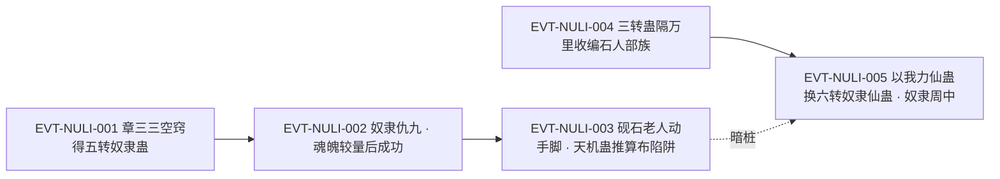

# 奴隶蛊

奴道里**对人**而非对兽的一件。它的定位与驭兽蛊并列在同一句里：「驭兽蛊、奴隶蛊，就是对魂魄上的控制，针对心智的主宰。」`E:V3-081834`；区别在于对象——兽与**蛊师**。全书 `奴隶蛊` 命中 55 行（64 次），其中真正指本蛊者 39 行；它同时有凡蛊阶与仙蛊阶两级形态，后者在原文中又称 `奴隶仙蛊`。

本页为 2026-09-28 第二批实体页**新建页**。本页必须写清的一条是**身份边界**：`奴隶仙蛊` 与 `奴隶蛊` 是**同一实体的两级名**（凡蛊阶／仙蛊阶），不是另立的一只蛊；而 `奴隶蛊师`（人）与 `奴隶蛊仙`（人／`奴隶＋蛊仙`）只是词根被切出的**误切命中**，与本实体无关。所有引文回根原文 `source/蛊真人-clean.txt` 逐行复核，行号即 `E:V{段}-{6位行号}`。

**检索口径（必读）**：本页对 `奴隶蛊` 与 `奴隶仙蛊` 做了全量分类账。实测：`奴隶蛊` = 55 行（64 次）= A 类本实体 39 行 + B 类 `奴隶蛊师`（人）6 行 + C 类 `奴隶蛊仙`（人／`奴隶＋蛊仙`）10 行；三集互不相交。A 类中有 1 行落在段间空隙（120867–121057，无合法 E-ID 空间），故只能写作**原文第 120876 行**。`奴隶仙蛊` 为独立词根，全书 17 行，**与 A 类无一行重合**（即 `奴隶仙蛊` 不是 `奴隶蛊` 的子串）。交付前已用脚本断言 `枚举集合 == 实测集合` 通过。四类枚举见《原著明确内容》一节。B/C 类为**互斥归属后的净计数**：`奴隶蛊师` 的字面命中为 7 行、`奴隶蛊仙` 的字面命中为 11 行，各比净计数多 1——差额两行（`E:V3-091156`、`E:V4-122104`）因同句指本体而计入 A 类。

## 主题档案

### 一、身份边界：奴隶蛊（一转到五转）与奴隶仙蛊（六转）是同一实体的两级名

#### 原著事实

- **凡蛊阶的转数区间**：「奴隶蛊，从一转到五转皆有。这种蛊虫，一旦种下，就能控制蛊师。」`E:V2-071720`；同一句在段 3 原样复现——「奴隶蛊，从一转到五转皆有。」`E:V3-078298`。
- **五转是凡蛊阶的上位**：「哼，奴隶蛊珍贵无比，是五转蛊虫，你以为我会有？」`E:V1-002640`；「你是五转蛊师，那就得用五转奴隶蛊。这种蛊珍稀无比，远超同级」`E:V2-071306`。
- **仙蛊阶名 `奴隶仙蛊`**：「我手中的这只奴隶仙蛊，只有六转。」`E:V4-178528`；「方源交还我力仙蛊，换取黑楼兰的奴隶仙蛊，同时借用态度蛊一年时间。」`E:V4-178580`。
- **同一只仙蛊也被直呼 `奴隶蛊`**：「方源不是黑楼兰，黑楼兰手中有六转奴隶蛊，可以直接奴隶蛊仙。」`E:V4-122104`；原文第 120876 行处，黑楼兰也把**奴隶蛊**与排难蛊、定仙游并列为其仅剩的三只仙蛊（该行落在段间空隙，无 E-ID 空间，只能作裸行号登记）。
- **章节目录亦用仙蛊阶名**：「章节目录 第三百二十九节：奴隶蛊仙」`E:V4-178918`——该行是目录题名行，不作正文证据。
- **本实体与驭兽蛊的分工**：「驭兽蛊、奴隶蛊，就是对魂魄上的控制，针对心智的主宰。」`E:V3-081834`；两者分执人与兽，「自古奴魂不分家。」`E:V3-081830`。
- **roster 登记**：`slave-atk-5-01-gu.md` 一行由 `roster-3.md` 记为本实体（原文转 5、game 转 5、登记锚 `E:V1-002640`）。本页回原文打印该锚，**该行为正文行（花酒行者的台词）、不是章节题名行**，且五转明文即在该行。

#### 合理推导

- **依据：**`E:V2-071720`（一转到五转皆有）＋`E:V4-178528`（仙蛊只有六转）＋`E:V4-122104`（六转者也被直呼为奴隶蛊）＋`E:V4-178918`（目录题名为奴隶蛊仙）；**结论：**`奴隶蛊` 与 `奴隶仙蛊` 是**同一实体的两个阶名**——凡蛊阶一律写 `奴隶蛊`、仙蛊阶多写 `奴隶仙蛊`，但仙蛊阶在限定转数时仍可用 `奴隶蛊`；**不确定性：**原文从未声明二者同指，本页的判定建立在**同一持有者（黑楼兰）、同一转数（六转）、同一功能（可直接奴隶蛊仙）**三处吻合之上。
- **依据：**契约**aliases 只放同一实体的别名**并以保守为先；**结论：**本页 `aliases` 留空，关系只写在正文——理由有二：①写成别名会与 `name` 同形或引入阶名歧义；②`奴隶仙蛊` 与 `奴隶蛊` 是**阶名关系**，页内已有《关联页面》与状态行承载；**可能反例：**若后续 L0 裁定阶名应入 aliases，本页需回改，故此处把判定与依据一并写全，便于复核。
- **代价与收益（三要素）**：**结论：**本条三方关系为——**支付方＝施蛊者**（支付一枚对应转数的奴隶蛊，五转者「珍贵无比」`E:V1-002640`）；**受益方＝施蛊者**（取得一名蛊师「为己所用」`E:V2-071722`）；**支付时点／生效条件＝种下瞬间支付，收益以魂魄较量取胜为条件**；**依据：**`E:V1-002640`、`E:V2-071722`、`E:V2-074238`；**不确定性：**原文未给各转蛊的获取成本与魂魄较量的成功率，也未给种下后生效所需时长，本批尚未找到。

#### 《问真》设计意义

- **可采规则（阶级名与实体名分层）**：凡蛊与仙蛊共用一个词根、由阶名区分，检索与实现时都要把**名**与**阶**拆开，否则会把同一对象做成两件蛊。
- **可采规则（名与实的一致性校验）**：本页把**只有一只、只有六转、只有一次机会**三条分别为同一对象的证据，正说明高阶件的唯一性信息应集中登记，而不是散落在各章台词里。

### 二、机制与生效条件：种下即控人，落体成黄色光影，成否取决于魂魄较量

#### 原著事实

- **核心效果**：「这种蛊虫，一旦种下，就能控制蛊师。」`E:V2-071720`；「五转的奴隶蛊，便能控制五转蛊师为己所用」`E:V2-071722`。
- **投送与形态**：「方源面色平淡，飞出五转奴隶蛊。」`E:V2-074228`；「奴隶蛊炸成一团黄色光影，落到仇九的身上。」`E:V2-074230`。
- **障碍可被外力排除**：「有地灵压制着，仇九无法催动蛊虫，只能任由奴隶蛊种下。」`E:V2-074236`。
- **成否是魂魄较量**：「但要控制一个五转蛊师，却并不那么容易，关乎魂魄之间的较量。」`E:V2-074238`；「仇九竭力反抗，方源魂魄震动，一时间僵持下来，宛若角力。」`E:V2-074240`；随后「成功了！」`E:V2-074292`。
- **转数必须匹配**：「六转级别的奴隶仙蛊，只能奴隶六转的蛊仙。」`E:V4-179168`。
- **对象资质影响成败**：「这还多亏了周中是羽民，不是纯正的人类，灵性还是稍差一筹的。若是我奴隶一个纯种人族蛊仙，说不定已经失败了。」`E:V4-179170`。
- **自愿优于强迫**：「不错，最好是他（她）心甘情愿。因为动用奴隶蛊等等，控制他（她）时，会干扰情绪的正确抒发，以及摧毁该有的变身成僵尸的体会和感受。」`E:V3-106790`。

#### 合理推导

- **代价与收益（三要素）**：**结论：**本条三方关系为——**支付方＝目标（被剥夺自主者）**（「士可杀不可辱，你想奴隶我，痴心妄想啊」`E:V2-074232` 所反映的丧失自主）；**受益方＝施蛊者**（取得一名「忠心耿耿的奴才」`E:V2-071764`）；**支付时点／生效条件＝在魂魄较量中败北的瞬间**；**依据：**`E:V2-074232`、`E:V2-074238`、`E:V2-071764`；**不确定性：**原文未给败北者的可逆性、善后者与原持有者后续的可恢复程度，本批尚未找到。
- **依据：**`E:V2-074238`＋`E:V2-074240`＋`E:V4-179168`＋`E:V4-179170`；**结论：**本实体的成否不是命中判定，而是**两方魂魄的量级比较**：转数必须对得上（六转件只能对付六转对象），且对象魂魄越弱（如非纯种人族）越容易成功；**不确定性：**原文未给魂魄量级的量化口径，也未写失败时施蛊方与受方的具体损失（仅写「方源魂魄震动」）。
- **依据：**`E:V3-106790`（最好是对方心甘情愿）＋`E:V2-074236`（外力压制可令其无从抵抗）；**结论：**成功的路径有两条——**压低对方抵抗力**（压制、控制、其蛊不可用）与**取得对方配合**（自愿），后者还能避免情绪与体感被干扰的副作用；**不确定性：**原文未写「心甘情愿」是否提高成功率本身，只说它能避免情绪与变身体会受损。

#### 《问真》设计意义

- **可采规则（魂魄量级而非命中率）**：用双方魂魄量级决定成败，能让**先削弱目标魂魄**成为一条可玩的战术线，也让转数匹配成为硬约束。
- **可采规则（自愿与非自愿的差异后果）**：让强迫控制附带情绪与体感损伤，自愿则无，可以把控制类技能从**一键收人**变成需要谈判与铺垫的玩法。

### 三、代价与魂魄负担：一位蛊师很少操纵超过五个奴隶

#### 原著事实

- **人比兽难控**：「但人是万物之灵」`E:V3-091160`；同段续写「对魂魄的负担更大，尤其是要奴隶那些魂魄强盛的蛊师。」`E:V3-091160`。（原文在该段以 `**` 遮盖若干处动词，本页只取未被遮盖的连续片段。）
- **数量上限**：「往往一位蛊师，驾驭一位奴隶蛊师，再多的话，魂魄负担就大了。」`E:V3-091162`；「奴隶蛊师的数量，就更少。」`E:V3-091162`。
- **门槛是魂魄更强**：「而那些魂魄强盛的奴隶蛊师」`E:V3-091164`；其后紧接的句子要求操纵者比对方魂魄更加强大（该处原文以 `**` 遮盖动词，本页不逐字引）。
- **五转件的价值锚点**：「这只五转奴隶蛊，当然要奴隶五转蛊师，才能充分利用它的价值。」`E:V2-074294`；「毕竟是五转奴隶蛊，若要用在四转蛊师的身上，就有些亏本了。」`E:V2-071724`；方源自己则「不过尽管五转奴隶蛊珍稀无比，如此大材小用，方源还是要用！」`E:V2-071740`。
- **仙蛊阶的代价**：「奴隶仙蛊并不能无限使用，只有一次机会。」`E:V4-178528`；「奴隶仙蛊也被方源借走，直接消耗掉了。」`E:V6-375902`；「运用奴隶仙蛊的后遗症，将很快消除，战力也会迅速回复！」`E:V4-181480`。

#### 合理推导

- **代价与收益（三要素）**：**结论：**本条三方关系为——**支付方＝施蛊者**（支付**魂魄负担**这一持续成本，且随奴隶数量与其魂魄强度递增）；**受益方＝施蛊者**（获得可长期役使的战力与干员）；**支付时点／生效条件＝操纵期间持续支付**，数量或强度任一超额即负担骤增；**依据：**`E:V3-091160`、`E:V3-091162`、`E:V3-091164`；**不确定性：**原文未给魂魄负担的量值、上限与恢复方式，也未给数量与强度的换算口径，本批尚未找到。
- **依据：**`E:V3-091162`（往往一位蛊师驾驭一位奴隶蛊师，再多负担就大）＋`E:V3-091164`（要控魂魄强盛者须比其更强）；**结论：**这件蛊的产出**不随投入线性增长**——它天然被施蛊者自己的魂魄上限封顶，形成**少而精**的编制；**不确定性：**原文只给**往往一位**与**很少超过五个**这类模糊上限，未给确切数值口径（且该处说明是葛家视角的常理，不是硬规则）。
- **依据：**`E:V2-074294`、`E:V2-071724`、`E:V2-071740`；**结论：**转数错配会**浪费价值**（五转件用在四转对象上等于亏本），但原文也给出**明知道亏还要用**的实例——工具的取舍取决于时局而非账面效率；**不确定性：**原文未写强制使用时的额外代价，也未写能否退蛊或转让被控制者。
- **依据：**`E:V4-178528`、`E:V6-375902`、`E:V4-181480`；**结论：**仙蛊阶的正确用法是**一次性、对同阶目标**的斩首工具，且事后留有**后遗症**需要靠魂魄底蕴修补；**不确定性：**原文未写后遗症的具体形态与持续时长。

#### 《问真》设计意义

- **可采规则（编制上限来自自身魂魄）**：用**自身魂魄强度**封顶可控制的奴隶数，比给每件蛊设冷却更能鼓励角色成长与取舍。
- **可采规则（转数错配即浪费）**：把匹配关系做成显式机制，能让玩家主动等待**值得下手的目标**，制造节奏感而非无脑施放。

### 四、稀缺、价格与获取：五转者珍贵无比，仙蛊阶只有一次机会

#### 原著事实

- **稀缺定性**：「奴隶蛊珍贵无比，是五转蛊虫」`E:V1-002640`；「这种蛊珍稀无比，远超同级」`E:V2-071306`；「五转的奴隶蛊，便能控制五转蛊师为己所用，十分珍稀，极其罕见。」`E:V2-071722`。
- **价格与受众**：「虽然也有奴隶蛊，效果更好，但却是五转蛊。价格高昂，又珍稀，也不是普通人能用得起的。」`E:V2-061434`。
- **非常规获取（其一：遗产）**：「从章三三的空窍中，方源竟然收获到了一只五转的奴隶蛊。」`E:V2-071718`；「章三三只是四转蛊师，但却有一只五转的奴隶蛊。方源杀他的最大企图，就是这只蛊。」`E:V2-074222`。
- **非常规获取（其二：自炼）**：「方源将新炼制的奴隶蛊取出来，交给地灵小狐仙。」`E:V3-078296`；「方源炼制的，都是三转奴隶蛊，足够驾驭住石人部族了。」`E:V3-078298`。
- **有货也未必卖**：「“现在最大的麻烦，就是奴隶蛊稀缺。若是有大量的奴隶蛊的话，我们就能将这些奴隶蛊师放上战场。」`E:V3-091156`；同段另有「但我们可没有那么多的奴隶蛊啊。」`E:V3-089126`。
- **仙蛊阶的交换价**：「那么我就退一步，用这只我力仙蛊。换取你手中的奴隶仙蛊。」`E:V4-178518`；「我手中的这只奴隶仙蛊，只有六转。你用六转换六转，这个可以。」`E:V4-178528`。

#### 合理推导

- **代价与收益（三要素）**：**结论：**本条三方关系为——**支付方＝买方或夺取方**（支付高价、一只同阶仙蛊（我力仙蛊），或承担杀人夺蛊的风险）；**受益方＝买方或夺取方**（取得一件可控制同阶蛊师的稀缺工具）；**支付时点／生效条件＝购得、夺取或炼制完成时**；**依据：**`E:V2-061434`、`E:V2-071718`、`E:V4-178518`、`E:V3-078296`；**不确定性：**原文未给该件的市场价、炼制难度与杀人夺蛊的风险量化，本批尚未找到。
- **依据：**`E:V1-002640`＋`E:V2-061434`＋`E:V2-071722`；**结论：**本实体的稀缺是**双重的**——原始产出稀少（不是人人能炼）加上用途受限（只对同阶或更低阶目标划算），因此它长期处在**有价无市**的状态；**不确定性：**原文只给「价格高昂」这类定性话，未给五转奴隶蛊的具体价位，也未给市面流通量的口径。
- **依据：**`E:V2-071718`＋`E:V3-078296`＋`E:V3-089126`；**结论：**本实体的获取路径有三条——遗物（杀敌后从空窍取得）、自炼、以及市场（但市场常缺货）；三条路都说明它的**掌握者集中在少数人手里**，这也正是《身份边界》为什么要谨慎：名与阶一混，稀缺性就会被误读成两只不同的蛊；**不确定性：**原文未给各条路径的相对产量。

#### 《问真》设计意义

- **可采规则（三条获取路径并存）**：让同一件蛊既能捡、能炼、又能买，可以在不改变强度的前提下改变玩家的行为模式（猎杀流、炼道流、贸易流）。
- **可采规则（抢手的稀缺件）**：让稀缺件在交易里以**另一只同阶仙蛊**计价，能把高阶资源直接放进以物易物的循环，而非纯货币市场。

### 五、实战与治理：从章三三到石人部族，从战场到仙鹤门的暗算

#### 原著事实

- **五转对五转的实战**：章三三死后，方源以该蛊对仇九出手——「士可杀不可辱，你想奴隶我，痴心妄想啊……」`E:V2-074232`，结果「成功了！」`E:V2-074292`。
- **一次尝试、未成**：「哦，是这样啊。但你要我如何相信你的诚意呢？除非你能主动的，被我种下奴隶蛊。」`E:V2-064754`；对方答「大，大人，在这个蛊仙福地里，蛊师原有的蛊虫都不能运用。再说，我也没有奴隶蛊啊。」`E:V2-064756`。
- **治理用途（石人）**：「小狐仙将奴隶蛊挪移到万里之外，直接作用在关键石人的身上。」`E:V3-078300`；「石人的魂魄，哪里是方源百人魂的敌手，轻而易举地就被奴隶。」`E:V3-078302`；「转瞬之间，方源掌控了包括岩勇在内的三位石人族长，以及十多位石人家老。」`E:V3-078304`。
- **战场用途（葛家的盘算）**：「我们就能将这些奴隶蛊师放上战场。这将极大地增强我们葛家的战斗力！」`E:V3-091156`。
- **另一场暗算（仙鹤门）**：「“若是他冥顽不灵，我们再秘密动手。奴隶蛊就是一个好方法。」`E:V3-075592`。
- **前世的共同记忆**：「在奴隶蛊的作用下，他成了方源一名忠心耿耿的奴才。」`E:V2-071764`；方源重述旧事时也把它列为关键项——「奴隶蛊、碧空蛊毒、地灵、青铜大殿、仙元、定星蛊、第二空窍蛊、百战不殆蛊……」`E:V2-074106`；「要想他说出巫山路径，除非动用章三三的五转奴隶蛊。」`E:V2-074152`。

#### 合理推导

- **代价与收益（三要素）**：**结论：**本条三方关系为——**支付方＝施蛊方**（支付蛊体本身与其稀缺性——葛家正是因为缺货而不敢收编降俘）；**受益方＝施蛊方的组织**（把俘虏／降卒转化为己方战力，或以一枚三转件整族收编）；**支付时点／生效条件＝组织需要扩编时**，而生效条件是能拿得出足够的蛊；**依据：**`E:V3-091156`、`E:V3-089126`、`E:V3-078304`；**不确定性：**原文未给可用蛊的存量与所需蛊数的对应关系，也未给收编整族所需的蛊数下限，本批尚未找到。
- **依据：**`E:V3-078300`＋`E:V3-078302`＋`E:V3-078304`；**结论：**本实体在治理层面的效率远高于逐个控制——**三转件 + 一次性远程施放**即可拿下整个石人部族的决策层；这条同样印证成功率由魂魄差决定（石人魂魄远弱于方源的百人魂）；**不确定性：**原文未写被控制者是否可被转授、其忠诚度是否随施蛊者实力变化而波动。
- **依据：**`E:V3-075592`＋`E:V2-064754`；**结论：**本实体在原文中常被当作**计划中的手段**（先谈判、不成再动手），而非直接开打的招式；它的存在本身就改变了对方的谈判行为；**不确定性：**这些计划多数未落地，原文未给它们实施后的结果。

#### 《问真》设计意义

- **可采规则（俘虏转化）**：把降卒转化为可用战力，是让战争收益本地化的一条线；配以稀缺性，就形成**战果受限于工具存量**的张力。
- **可采规则（决胜点前置）**：先对决策层下手（石人族长与家老），再带走整个部族，能把控制类玩法从**抓人**升级为**接管**。

### 六、稀缺的反面与反制：动手脚、天机推算

#### 原著事实

- **被人动了手脚**：「小徒孙，你身上的奴隶蛊，我已经动了手脚。我算定方源必定会参与义天山正魔大战，届时你可卧底在他身边，伺机而动。」`E:V3-086302`。
- **被推算出来**：「砚石老人在发现杀人鬼医被种下奴隶蛊后，依靠天机蛊，推算出方源，会在将来的某天，回到南疆。」`E:V3-090586`；「因此，砚石老人才布下了陷阱，等着方源跳进来。」`E:V3-090588`。
- **被控制者的反噬记忆**（段 1 的旧事）：「奴隶蛊珍贵无比，是五转蛊虫，你以为我会有？」`E:V1-002640`——四代族长以**愿意吃下奴隶蛊**骗取花酒行者信任，最终「被四代族长逆袭暗算，憾死在青茅山中。」`E:V2-071722`。
- **知情人视角的复盘**：「仇九接连提出毒誓蛊、奴隶蛊的建议，已显慌乱，但始终不敢说出福地位置。」`E:V2-071314`。
- **尚未看到的手段**：本批未检得任何以**解蛊**为名的专门手段；对已种者的对抗，原文给出的路径是**在种下之前动手脚**（`E:V3-086302`）或**事后推算**（`E:V3-090586`）。

#### 合理推导

- **代价与收益（三要素）**：**结论：**本条三方关系为——**支付方＝第三方干预者**（支付一次改造或一次推算；对砚石老人而言还须动用天机蛊一类仙蛊 `E:V3-090584`）；**受益方＝干预者**（把敌人的控制成果变成自己的卧底，或提前掌握敌人行踪）；**支付时点／生效条件＝在受术者已被种蛊之后、施蛊者尚未察觉之前**；**依据：**`E:V3-086302`、`E:V3-090586`；**不确定性：**原文未给改造与推算的代价量值，也未给动手脚的门槛与施蛊者可察觉的条件，本批尚未找到。
- **依据：**`E:V3-086302`＋`E:V3-090586`；**结论：**本实体的控制**不是单向的**——被种者可被第三方接管为卧底，施蛊者的行动也可被推算；因此**种下**只是竞争的开始而非结束；**不确定性：**原文未写**动手脚**的具体条件与门槛，也未写方源是否察觉、何时察觉。
- **依据：**`E:V2-071722`＋`E:V2-071314`＋`E:V2-064756`；**结论：**原文承认这件蛊在**被用作口头承诺**时会反过来成为对方的话术（四代族长与仇九都拿它当谈判筹码），因此它在剧情里的功能经常是**信任的试金石**而非单纯的工具；**不确定性：**这一层属于叙事功能判断，非机制事实。

#### 《问真》设计意义

- **可采规则（控制权可被第三方劫持）**：给**已控制单位**留一条被策反的暗线，能让控制类玩法产生长期的猜疑与排雷成本，而不是一次性结算。
- **可采规则（可被推算）**：把高阶蛊的使用留下可被侦查的痕迹，可为追查与反追查提供线索经济。

## 状态时间线

| 状态 ID | 阶段 | 状态 | 证据 |
|---|---|---|---|
| ST-NULI-01 | 名称与名阶 | 凡蛊阶称奴隶蛊、一转到五转皆有；仙蛊阶称奴隶仙蛊（六转），限定转数时也直呼奴隶蛊 | E:V2-071720、E:V4-178528、E:V4-122104 |
| ST-NULI-02 | 身份边界 | 奴隶仙蛊与奴隶蛊为同一实体的两级名，非另立一只；本页 aliases 留空、关系写正文 | E:V2-071720、E:V4-178528、E:V6-375902 |
| ST-NULI-03 | 品阶 | 凡蛊阶的上位为五转：珍贵无比、远超同级、极其罕见 | E:V1-002640、E:V2-071306、E:V2-071722 |
| ST-NULI-04 | 核心效果 | 一旦种下就能控制蛊师；五转件可控制五转蛊师为己所用 | E:V2-071720、E:V2-071722 |
| ST-NULI-05 | 生效形态 | 飞出后炸成一团黄色光影、落到目标身上；对方蛊不可用时只能任凭种下 | E:V2-074228、E:V2-074230、E:V2-074236 |
| ST-NULI-06 | 成否判定 | 关乎魂魄之间的较量，会僵持如角力，最终成功；六转件只能对付六转对象 | E:V2-074238、E:V2-074240、E:V4-179168 |
| ST-NULI-07 | 对象资质 | 对象灵性越弱越易成：羽民成功，方源自评对纯种人族蛊仙或许会失败 | E:V4-179170 |
| ST-NULI-08 | 自愿与强迫 | 最好对方心甘情愿，否则会干扰情绪抒发、摧毁变身体会与感受 | E:V3-106790 |
| ST-NULI-09 | 数量上限与门槛 | 人比野兽难控、魂魄负担更大；往往一位蛊师驾驭一位奴隶蛊师；控魂魄强盛者须比其更强 | E:V3-091160、E:V3-091162、E:V3-091164 |
| ST-NULI-10 | 价值锚点 | 五转件奴隶五转蛊师才充分利用其价值；用在四转对象上亏本，但形势所迫仍会用 | E:V2-074294、E:V2-071724、E:V2-071740 |
| ST-NULI-11 | 仙蛊阶代价 | 六转奴隶仙蛊只有一次机会，用后即被消耗，且留有后遗症 | E:V4-178528、E:V6-375902、E:V4-181480 |
| ST-NULI-12 | 稀缺与价格 | 价格高昂、又珍稀，不是普通人用得起的；葛家亦感缺货，缺到不敢收编降俘 | E:V2-061434、E:V3-091156、E:V3-089126 |
| ST-NULI-13 | 获取路径 | 杀敌后自其空窍取得、自行炼制、以及市场购入三条并存 | E:V2-071718、E:V3-078296、E:V3-078298 |
| ST-NULI-14 | 治理与战场 | 三转件即可整族收编石人决策层；葛家欲以大量奴隶蛊把奴隶蛊师放上战场 | E:V3-078300、E:V3-078304、E:V3-091156 |
| ST-NULI-15 | 反制 | 已种之蛊可被第三方动手脚改为卧底；种蛊事实可被天机蛊推算出来 | E:V3-086302、E:V3-090586、E:V3-090588 |
| ST-NULI-16 | 名称碰撞 | 词根还切出奴隶蛊师（人）6 行与奴隶蛊仙（人／奴隶＋蛊仙）10 行，均非本实体；另 1 行落段间空隙只能作裸行号 | E:V3-089126、E:V4-178918 |

## 原著明确内容（本批取证窗口登记）

本批以 `奴隶蛊` 为取证词扫全书得 55 行（64 次），以 `奴隶仙蛊` 另扫得 17 行。四类枚举如下（**枚举完全、可逐行复核**；脚本断言 `枚举集合 == 实测集合` 通过）。

| 类别 | 行数 | 全部行号 |
|---|---|---|
| A 本实体（蛊虫） | 39 | 002636、002640、061434、064754、064756、071304、071306、071314、071662、071718、071720、071722、071724、071732、071740、071764、074044、074106、074152、074222、074228、074230、074232、074234、074236、074294、075592、078296、078298、078300、081834、086302、090586、091156、091158、091166、106790、120876、122104 |
| B 子串误切·奴隶蛊师（人） | 6 | 081010、089126、089638、091162、091164、096278 |
| C 子串误切·奴隶蛊仙（人／`奴隶＋蛊仙`） | 10 | 178918、179154、182840、227066、251940、299352、304188、310024、313064、435352 |
| D 奴隶仙蛊（同一实体的仙蛊阶名） | 17 | 122108、128094、133460、139884、140242、178518、178522、178526、178528、178580、179118、179168、179184、179186、181480、181482、375902 |

- A 类中 **原文第 120876 行** 落在段间空隙 120867–121057，**无合法 E-ID 空间**，故只能写作裸行号；`71662` 是章节题名行（`第一百八十八节：五转奴隶蛊`），登记锚另行取 `E:V1-002640`。
- D 类与 A 类**无一行重合**，即 `奴隶仙蛊` 不是 `奴隶蛊` 的子串；两类的并集 56 行为本实体的全部记载。
- 本批实际读取并用于本页的窗口如下表。

| 窗口 | 内容要点 | 用途 |
|---|---|---|
| 2634–2642 | 四代族长愿吃下奴隶蛊为奴；花酒行者明言奴隶蛊珍贵无比、是五转蛊虫 | 主题一、四、六 |
| 61432–61436 | 控制奴隶最常用的方法之外，另有奴隶蛊效果更好却是五转蛊，价格高昂又珍稀 | 主题四 |
| 64752–64758 | 方源要求韩不留主动被种奴隶蛊以证诚意；对方称福地内蛊虫不可用、自己也没有奴隶蛊 | 主题五 |
| 71302–71316 | 仇九自请以奴隶蛊认主；方源指出五转蛊师须用五转奴隶蛊、远超同级 | 主题一、四、六 |
| 71660–71664、71716–71744、71762–71766 | 章三三空窍中得五转奴隶蛊；一转到五转皆有、种下即控人；五转控五转；四代族长旧事；大材小用仍要用；风天语成为忠心奴才 | 主题一、三、四、五、六 |
| 74042–74046、74104–74108、74150–74154、74220–74240、74292–74296 | 方源复盘旧事；奴隶蛊列为关键项；除非动用章三三的五转奴隶蛊；飞出成黄色光影落体、只能任凭种下、魂魄较量与僵持、最终成功、须奴隶五转蛊师才值回价值 | 主题二、三、五 |
| 75590–75594 | 仙鹤门鹤风扬提议谈判不成便秘密动用奴隶蛊对付方源 | 主题五 |
| 78294–78304 | 方源炼制三转奴隶蛊交地灵小狐仙，隔万里作用于关键石人，转瞬掌控三位族长与十多位家老 | 主题一、三、五 |
| 81832–81836 | 奴道自魂道衍生；驭兽蛊、奴隶蛊即对魂魄上的控制、心智的主宰 | 主题一 |
| 86300–86304、90584–90588 | 砚石老人已对仇九身上的奴隶蛊动了手脚，并以天机蛊推算方源行踪、布下陷阱 | 主题六 |
| 91152–91170 | 奴隶蛊稀缺是葛家最大麻烦；它是能够控人的蛊虫（原文以 `**` 遮盖该处动词）；人比野兽难控、负担更大；一位蛊师很少操纵超过五个 | 主题三、五 |
| 106788–106792 | 动用奴隶蛊会干扰情绪抒发、摧毁变身成僵尸的体会与感受，故最好对方心甘情愿 | 主题二 |
| 原文第 120876 行 | 黑楼兰质问时把奴隶蛊、排难蛊、定仙游列为对方仅剩的三只仙蛊（裸行号） | 主题一 |
| 122102–122112 | 黑楼兰手中有六转奴隶蛊可直接奴隶蛊仙；方源无奴隶仙蛊却自信仍可收服太白云生 | 主题一、四 |
| 128092–128096、133458–133462、139882–139886、140240–140244 | 黑楼兰家底含奴隶仙蛊；欲以之收人为己用；其仙蛊被列为一枚重宝；方源曾记挂此蛊后改选他蛊 | 主题一、四 |
| 178516–178532、178578–178582 | 以我力仙蛊换黑楼兰的奴隶仙蛊；此蛊只有六转、只有一次机会；成交并借用态度蛊一年 | 主题一、三、四 |
| 179116–179120、179166–179170、179182–179188、181478–181484 | 催动奴隶仙蛊奴隶周中；六转件只能奴隶六转蛊仙；对象是羽民故稍易；方源不懂奴道仙级杀招、只是肤浅使用；后遗症需靠落魄谷与荡魂山消除 | 主题二、三 |
| 375900–375904 | 后史交代：奴隶仙蛊被方源借走并直接消耗掉 | 主题一、三 |
| 81010、89126、89638、91162、91164、96278 | 奴隶蛊师（人）的误切命中抽样；其中一处按旧例把降俘称为奴隶蛊师 | 主题四、六（分类账） |

## 事件链

| 事件 ID | 事件 | 参与者 | 证据 | 因果 |
|---|---|---|---|---|
| EVT-NULI-001 | 章三三身死，方源从其空窍取得一只五转奴隶蛊；他判断章三三留着不用是想等一个值得下手的目标 | 方源、章三三 | E:V2-071718、E:V2-071722、E:V2-071724、E:V2-074222 | 因：五转件罕见；果：EVT-NULI-002 |
| EVT-NULI-002 | 方源以五转奴隶蛊对五转蛊师仇九出手：蛊化黄色光影落体，经魂魄较量与僵持后成功种下 | 方源、仇九 | E:V2-074228、E:V2-074230、E:V2-074232、E:V2-074238、E:V2-074240、E:V2-074292 | 因：EVT-NULI-001；果：EVT-NULI-003 |
| EVT-NULI-003 | 砚石老人察觉仇九被种奴隶蛊，先对蛊动手脚使其成为卧底，再借天机蛊推算方源将回南疆，布下陷阱 | 砚石老人、仇九、方源 | E:V3-086302、E:V3-090584、E:V3-090586、E:V3-090588 | 因：EVT-NULI-002；果：方源长期未察觉的暗桩 |
| EVT-NULI-004 | 方源炼成三转奴隶蛊交地灵小狐仙，隔万里作用于关键石人，瞬即掌控三位石人族长与十多位家老 | 方源、地灵小狐仙、岩勇等石人 | E:V3-078296、E:V3-078298、E:V3-078300、E:V3-078302、E:V3-078304 | 因：石人部族分裂后需重新掌控；果：石人部族被纳管 |
| EVT-NULI-005 | 方源以我力仙蛊换取黑楼兰的六转奴隶仙蛊（另有借用态度蛊一年的附加条件），段 4 以之奴隶羽民蛊仙周中，界外史则记该蛊被直接消耗掉 | 方源、黑楼兰、周中 | E:V4-178518、E:V4-178528、E:V4-178580、E:V4-179118、E:V4-179120、E:V4-179168、E:V6-375902 | 因：需要一件能直接对付蛊仙的工具；果：周中被奴隶、后遗症待消 |

事件口径：本页沿用实体簇号 `EVT-NULI-*`。事件节点 5 个，**已达事件节点 3 个以上应配图的阈值，故配 mermaid 主干**；虚线表示长期潜伏的因果，不是直接时序。五次事件跨段 2、段 3、段 4、段 6。

## 资料整理

本页为**新建页**，没有旧版；本批来源只有根原文，没有 `notes:`／`memory:` 层转述进入本页事实区。相关派生记录与既有页的处置登记如下（**本段内容不得当作原著事实**）：

- `roster-3.md` 条目 `slave_atk_5_01_gu`：原文转 5、game 转 5（`一致`）、登记锚 `E:V1-002640`、名命中 64。**本页复核：锚点行与原文一致**（`E:V1-002640` 为花酒行者台词、属正文行，五转明文在该行），本页只登记、不改该页。
- **`奴隶仙蛊` 的定性**：本页判定它与 `奴隶蛊` 为**同一实体的两级名**（依据 `E:V2-071720`、`E:V4-178528`、`E:V4-122104`、`E:V6-375902`），但**不写入 `aliases`**（保守做法：阶名入别名会与 `name` 的语义范围重叠，且 L0 本轮统一要求 aliases 只放同一实体的别名、关系以正文表达）。
- **`我力仙蛊` 页的对照**：`lore/wiki/gu/force-atk-5-20-gu.md` 中同时出现 `奴隶蛊` 与 `奴隶仙蛊` 的明文；本页据 `E:V4-178518`、`E:V4-178528`、`E:V4-178580`、E:V6-375902 判定两处称谓指向**同一对象**（凡蛊阶名／仙蛊阶名），不视作两只蛊。本页只登记该判定，不改该页。
- **id 归类张力（派生层）**：该实体 id 为 `slave_atk_5_01_gu`（奴道·攻击），而原文的机制定性是「对魂魄上的控制，针对心智的主宰」`E:V3-081834`，且其效果落点在役使而非伤害。本轮不改 id（id 由 roster-3 核定，禁另造），仅按改编／张力登记该张力于《待核对》。
- `game/**` 只读，不在本批改动范围；本页不写第二份游戏数值，也不据游戏数据反推 Canon。

## 分析与解读

1. **本页的第一结论是名阶**。凡蛊阶 `奴隶蛊` 一转到五转 `E:V2-071720`、仙蛊阶 `奴隶仙蛊` 六转 `E:V4-178528`，而六转者仍可被直呼为 `奴隶蛊` `E:V4-122104`、裸行号 120876；三者合起来指向同一对象，故 `aliases` 留空、关系写入正文。
2. **它的胜负口径是魂魄而非命中**。`E:V2-074238`、`E:V2-074240`、`E:V4-179168`、`E:V4-179170` 四句连读，给出**转数必须匹配＋对方魂魄越弱越易成**的双门槛；这解释了石人部族为何能被一枚三转件打动（`E:V3-078302`）。
3. **它的稀缺是结构性的**。`E:V1-002640`、`E:V2-061434`、`E:V2-071722` 三处都写它的珍稀，`E:V3-091156`、`E:V3-089126` 则写连一个家族都缺货——这不是价格问题，而是产出与用途共同压出来的缺口。
4. **它的上限来自自己**。`E:V3-091162`、`E:V3-091164` 把数量上限钉在施蛊者的魂魄上，使**多找几个**不是投入问题而是资质问题。
5. **它可被第三方接管**。`E:V3-086302` 与 `E:V3-090586` 说明种下只是开始：被种者可能变成别人的卧底，施蛊者的行踪也可能被推算出来。
6. **两处必须并列登记的原文账**：①`奴隶蛊师`（6 行）与 `奴隶蛊仙`（10 行）是词根误切、不是本实体，但都含完整词根，检索层必须做预筛；②`E:V3-091162` 处只给「往往一位蛊师，驾驭一位奴隶蛊师」这类**常理表述**，本页不把它当硬数值。

## 待核对

- `[存在冲突]` **凡蛊阶的上位是五转，而仙蛊阶为六转**：`E:V1-002640`、`E:V2-071306`、`E:V2-071722` 均以五转为凡蛊阶的上位；`E:V4-178528` 记换得的奴隶仙蛊只有六转；裸行号 120876 与 `E:V4-122104` 又把六转者写作 `奴隶蛊`。当前状态：**不裁定**——本页按**凡蛊一转到五转、仙蛊阶六转**并列登记，不合并两级、也不否认六转件可被称作奴隶蛊。
- `[待取证]` **七转及以上**：本批未检得七转及以上的奴隶蛊／奴隶仙蛊，此条按**尚未找到**登记，不得写成原著没有。
- `[待取证]` **数量上限的确切口径**：`E:V3-091162` 只说「往往一位蛊师，驾驭一位奴隶蛊师，再多的话，魂魄负担就大了」，同段另有一处**很少超过五个奴隶**的模糊上限（该处原文以 `**` 遮盖动词，本页不逐字引），无量值、无硬规则出处。
- `[待取证]` **失败后果**：`E:V2-074240` 只写「方源魂魄震动」，未写失败时的损失形态（蛊是否损毁、魂魄是否受创、能否再用）。
- `[待取证]` **后遗症**：`E:V4-181480` 只说运用奴隶仙蛊留有后遗症、可由落魄谷与荡魂山消除，未写形态与时长。
- `[原著未明确]` **解蛊手段**：本批未检得专门以解除奴隶蛊为名的蛊或杀招；原文给出的是在**种下前动手脚**（`E:V3-086302`）与**事后推算**（`E:V3-090586`）两条绕行路径。
- `[原著未明确]` **被控制者能否被转授或转让**：原文未写；亦未写控制是否随施蛊者死亡而失效（反例可参见 `E:V2-071722` 四代族长的旧事）。
- `[存在冲突]` **桥接层：id 前缀 `slave_atk_*` 与机制不符**：原文定性为对魂魄上的控制、心智的主宰 `E:V3-081834`，效果落点在役使而非伤害。当前状态：不裁定，本轮不改 id，按改编／张力登记。
- `[原著未明确]` **原文讹字**：本页引文按逐字照录处理，涉及 `**` 遮盖处（`E:V3-091158`、`E:V3-091160`、`E:V3-091164`）只取未被遮盖的连续片段，并在主题三括注说明。
- `[原著明确]` **体积（登记例外）**：本页 40,516 字节（十进制口径，40 KB＝40,000 B），**已超 40 KB，按 GOVERNANCE 登记例外**（不为压体积删除有效知识；本批不设体积硬上限）。
- 2026-09-28：本页按 id 引用 roster-3 条目（id 为稳定键，不以其行号作定位依据）。

## 模板扩展建议（只登记，不改核心模板）

1. **需要名阶字段位**。同一实体在凡蛊阶与仙蛊阶各有一名（奴隶蛊／奴隶仙蛊），现状只能写进《身份边界》与状态行；跨页（如我力仙蛊页）比对时没有统一位置。
2. **需要控制关系的登记位**：本实体被第三方动手脚后可控（`E:V3-086302`），这类**控制权的二次转移**既不是别名也不是阶级，需要一个表达位。
3. **需要原文遮盖符的登记惯例**：本页涉及 `**` 遮盖若干动词，现按**只引未遮盖片段＋括注说明**处理，建议在契约层固定这一写法。

## 关联页面

[奴道](../world/enslavement-path.md)、[魂道](../world/soul-path.md)、[流派总表](../world/path-roster.md)、[炼蛊与杀招链](../world/gu-refine-killer-chain.md)、[蛊的饲养与炼化](../world/gu-care-and-refinement.md)、[北原](../world/north-plain.md)、[青茅山](../events/qing-mao-mountain.md)、[王庭](../events/royal-court.md)、[我力仙蛊](force-atk-5-20-gu.md)、[驭兽蛊](slave-atk-4-02-gu.md)、[蛊虫关系](gu-relations.md)、[蛊虫总表](roster.md)、[蛊虫总表三期](roster-3.md)、[方源](../characters/fang-yuan.md)、[黑楼兰](../characters/he-lou-lan.md)、[义天山](../events/yitian-mountain.md)。
