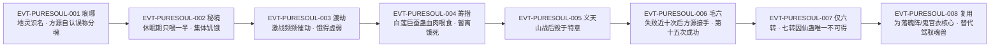

# 净魂仙蛊

魂道蛊仙的**辅助修行仙蛊**，效用极其单一而关键：「能精炼蛊仙魂魄，将杂质魂魄剔除出体外」`E:V4-123190`——同一句话里紧接着给出反向后果：「但若是使用过度，反会把精华魂魄也会剔除体外」`E:V4-123190`。它自身没有攻伐与防御；方源「虽然仙蛊众多，但没有一只仙蛊专门用来攻防」`E:V4-126106`，是净魂被他安在杀招万我上、让他"有了仙道杀招"。

本页为 2026-09-28 A 线正式 20 页恢复批**新建页**。所有引文回根原文 `source/蛊真人-clean.txt` 逐行复核，行号即 `E:V{段}-{6位行号}`；正文按"原著事实／合理推导／《问真》设计意义"三层组织。**本页最重要的一处修正是品阶**：`roster-3.md` 记"原文净魂仙蛊至少七转"，本批复核发现那是**需求门槛**（解魂道陷阱所需），而原文对品阶的明文是**六转**（详见主题一与《资料整理》）。

## 主题档案

### 一、身份与品阶：明文六转；「至少七转」是需求门槛不是品阶

#### 原著事实

- **识名**：方源掏出仙蛊请琅琊地灵辨认，地灵道「这只仙蛊我当然认得。它名为净魂，乃是魂道蛊仙辅助修行之物」`E:V4-123190`；方源内心「原来这仙蛊叫做净魂，我之前称呼它为分魂，算是叫错了」`E:V4-123192`。
- **品阶明文（六转）**：方源重炼成功后「稍稍不足的是，这只净魂仙蛊只是六转而已」`E:V5-270940`；他对外说明时亦作「虽然只是六转的净魂仙蛊」`E:V5-271014`；「改良后的仙道杀招鬼官衣，以七转换魂仙蛊，六转净魂仙蛊为核心」`E:V5-271538`；魂道仙蛊盘点「只有七转换魂、六转净魂两只」`E:V5-275032`。
- **转数名录旁证**：全书仙蛊转数名录中，「六转有我力、拔山、挽澜、力气、春秋蝉、江山如故、人如故、日、解谜、金刚念、运、气运、妇人心、血本、变形、星眸、道可道、」「黄沙、净魂、察运、连运、时运、星念等」`E:V5-273794`（净魂列六转）；七转名录 `E:V5-273792` **不含**净魂。
- **「至少七转」的语境是需求**：「现在方源成为了影宗新主，也就掌握着解除陷阱的方法，但是这个方法需要一只至少七转的净魂仙蛊，充当核心」`E:V5-267348`。
- **七转净魂被明文排除**：「六转净魂既然存在，世间就不会有七转、八转乃至九转的净魂仙蛊了」`E:V5-270962`。
- **上游位序**：「妇人心之上，则是仙蛊净魂」`E:V4-123374`。
- **形态**：「它形如蝌蚪，但有方源的拳头大小，通体灰白」`E:V5-270924`；饥饿虚弱时「宛若一只蝌蚪，通体灰白干瘪，趴在地上，一动不动」`E:V4-148920`。
- **机制 [已确认] / 具体数值 [待取证]（拆条）**：机制＝剔除杂质魂魄以精炼宿主魂魄，`[已确认]`（`E:V4-123190`）；具体数值＝单次炼魂的消耗量、可剔除杂质的比例、饥饿阈值，原文均未给，另列 `[待取证]`（见《待核对》）。

#### 合理推导

- **依据**：`E:V5-270940`（"只是六转而已"）＋`E:V5-273794`（六转名录含净魂）＋`E:V5-275032`（"七转换魂、六转净魂"）＋`E:V5-270962`（六转存在则七转以上不可得）；**结论**：**净魂仙蛊的品阶为六转 `[已确认]`**；`roster-3.md` 的"原文转 7"来自 `E:V5-267348` 的**需求侧**表述，属口径混用；**不确定性**：`E:V5-270940` 等明文针对的是**方源重炼的那一只**，真传秘境原体的转数原文未直接写（见《待核对》），故"六转"是对**个体**的明文，不宜推广成"该蛊种的唯一品阶"以外的更强断言。
- **依据**：`E:V5-270962`；**结论**：这是原著中**"仙蛊唯一"最锋利的一次表述**——它不是"很难炼成"，而是"只要一只六转净魂存在，七转及以上就在世界上不可能存在"；**不确定性**：原文没有解释这一约束的机制来源（天道限制／蛊种本身的上限），本页不代为补设。

#### 《问真》设计意义

- **可采规则（唯一性硬约束）**：把"同一蛊只能存在一只"做成硬规则，会让"我有了"直接等于"别人不能有"，比稀有度百分比更有叙事张力，也天然生成争夺动机。
- **可采规则（需求门槛与品阶分离）**：一件资产"能被用来做什么"依赖外部需求条件（此处：解阵需要 ≥7 转），而"它本身几转"是另一件事。把两者分列字段，能避免"看到需求就写成品阶"这类误读——本页正是该误读的实例。

### 二、核心效用：炼魂——剔除杂质，过度则剔精华

#### 原著事实

- **道属定位与原理**：「它名为净魂，乃是魂道蛊仙辅助修行之物」`E:V4-123190`。
- **魂道三支与净魂的落位**：「魂道修行，需要壮魂、炼魂、安魂。壮魂首选荡魂山胆识蛊，炼魂首选落魄谷中的**雾、落魄风。安魂首选**湖中安魂汤」`E:V4-123190`（该句中的两处 `**` 是原文自身的屏蔽标记，原文如此，本页照录并就地标注，不代为补全）。
- **效用与反向后果**：在同一段里，「能精炼蛊仙魂魄，将杂质魂魄剔除出体外」`E:V4-123190`；「但若是使用过度，反会把精华魂魄也会剔除体外」`E:V4-123190`。
- **相对旧件的效能**：「净魂能够炼魂，效果要远超方源之前的狼魂蛊。方源有胆识蛊，壮魂极易。在没有进入落魄谷之前，仙蛊净魂是最好的替代品」`E:V4-123374`。
- **定位是"辅助"**：「净魂仙蛊只是帮助蛊仙魂道修行的辅助仙蛊」`E:V4-134522`。

#### 合理推导

- **依据**：`E:V4-123190` 同句给出正反两面；**结论**：净魂的能力是**有刻度的精炼**而非"加数值"——它会同时识别并剔除"杂质"，而"杂质／精华"的界限随用量推移，故过量的后果是把本体一起削掉；**不确定性**：原文未给"过度"的判定线，也未说明被剔掉的精华能否自然恢复。
- **依据**：`E:V4-123374`；**结论**：净魂在体系中是**落魄谷的替代品**（落魄谷为炼魂首选，净魂在未入落魄谷前最好用），故其价值有一层"先到先得的时间性"；**可能反例**：这是方源当时的自述（`E:V4-123374` 语境是方源盘点自身仙蛊），不必然等于世界规则。

#### 《问真》设计意义

- **可采规则（双向刻度）**：同一件资产既提升上限又侵蚀本体，把它做成"可调节的过载风险"比做成纯增益更有决策压力——玩家可选择"用一次"或"用到极限"。
- **可采规则（替代品位）**：净魂是"更好的地方还没到之前"的最优解，这类"过渡性最优"能自然驱动玩家向高价值地图迁移，而不必用任务强制。

### 三、母体杀招万我：从"必需核心"到"可替代"

#### 原著事实

- **核心地位**：「这只净魂仙蛊，便是杀招万我的核心蛊」`E:V4-123194`；「除此之外，净魂还是杀招万我的核心蛊。这个价值就更大了」`E:V4-123376`。
- **万我的机制与代价**：「杀招万我能叫方源产生本我力道虚影。这些力道虚影蕴藏方源的一丝魂魄，因此方源指挥起来。如臂使指，灵活机变」`E:V4-123196`；「但也正因如此，动用杀招万我，会消耗方源魂魄底蕴」`E:V4-123198`。
- **净魂对威力的贡献**：「方源的才情还比不上沈桀骜，去掉净魂仙蛊的话，万我杀招威力根本不够看」`E:V4-135078`；方源自估「它若能再用，和我力一起，必能令万我杀招威力上涨一倍左右」`E:V4-148056`。
- **但并非不可替代**：「皆因净魂虽是万我核心，但却并非不可替代」`E:V4-123388`；饿馁期间「原本万我核心，是净魂仙蛊。而后净魂饥饿，不堪催用，便用我力代替」`E:V4-149774`；后期核心已扩为「核心仙蛊是我力、拔山、挽澜、净魂」`E:V5-290832`。
- **饥饿直接扣战力**：「净魂仙蛊已经喊饿。以至于方源目前使用万我杀招的风险剧增」`E:V4-128018`；「净魂仙蛊已经饥饿，使用万我具备风险，且浪费仙元」`E:V4-128412`。
- **无净魂时的妥协**：「虽然没有净魂仙蛊，但方源用了其他凡蛊替代。万我的作战威能下降了不少，但此刻用来惑敌，还是很好用的」`E:V5-200668`。

#### 合理推导

- **依据**：`E:V4-123194`、`E:V4-123196`、`E:V4-123198`；**结论**：万我之所以需要一个"魂道辅助件"当核心，是因为**该杀招本体的产出物（力道虚影）里嵌着宿主的魂魄**——净魂提供的正是"魂魄侧"的支撑，所以万我同时消耗宿主魂魄底蕴；**不确定性**：原文没有把"净魂如何提升威力"拆成可计算的因子，只有"去掉就不够看""一起用涨一倍左右"两句相对表述。
- **依据**：`E:V4-123388`＋`E:V4-149774`＋`E:V5-290832`；**结论**：万我是**多核可换的杀招**，净魂在核心位上先被替换、后又回到核心位之一；"核心"在此不是唯一槽位；**可能反例**：核心扩为四只（我力、拔山、挽澜、净魂）是本书后期的形态，前面长期为单核／双核，本条只登记形态演变，不主张一般规律。

#### 《问真》设计意义

- **可采规则（多核杀招）**：允许同一杀招挂多枚核心件、并允许中途替换，能把"装备更替"与"阵容构建"合流；净魂的"可替代但强"正好构成一条不归零的降级曲线。
- **可采规则（资源状态影响技能）**：仙蛊饥饿直接表现为"技能有风险且浪费"，这比"技能冷却"更能让玩家感到资产的真实状态。

### 四、喂养代价：上万头白莲巨蚕蛊（支付方／受益方／时点）

#### 原著事实

- **食材明文**：「净魂仙蛊的喂养，须得上万头白莲巨蚕蛊的血肉」`E:V4-124558`；「净魂仙蛊一次喂养，需要数万头的白莲巨蚕蛊的血肉，但方源得到手中的，却根本达不到这个数量」`E:V4-148880`。
- **食材稀缺**：「喂养净魂仙蛊，需要上万头白莲巨蚕蛊的血肉，然而白莲巨蚕蛊却是十分罕见」`E:V4-128586`；「可惜到了现在，就算是宝黄天中已经很少见到白莲巨蚕蛊了」`E:V4-128588`。
- **食材的来源**：「白莲巨蚕蛊乃是净魂仙蛊的食材，同样也是幽魂魔尊开创」`E:V5-273628`；「如今，他又有了净魂仙蛊，但白莲巨蚕蛊不仅是满足净魂的喂养需求，同时，还是幽魂真传中，许多魂道蛊阵的铺设基石」`E:V5-273632`。
- **饥饿的后果链**：黑楼兰渡劫一役后「因为激战中频频催动，净魂仙蛊已经饿得虚弱」`E:V4-128004`；「要知道，饥饿的仙蛊强行催用，会导致仙蛊的死亡」`E:V4-128016`；因此「也许某次催动这个仙道杀招，净魂仙蛊就会支撑不住而毁灭」`E:V4-128018`。
- **勉力维持与转机**：「尽管在宝黄天中高价收购了一些，但也只能堪堪维持住净魂仙蛊，不让它饿死」`E:V4-130694`；「至少净魂仙蛊暂时脱离了饿死的尴尬结果。方源之前已经打算舍弃它了」`E:V4-148946`；「好在方源已经在宝黄天中，获得了足够的白莲巨蚕蛊，喂饱了仙蛊净魂」`E:V4-174138`。
- **喂食实况**：饥饿时「方源只得将净魂仙蛊放到血肉上」`E:V4-148926`，食后「终于让它有了一丝力气，口器张开的更大了一些，开始吞食白莲巨蚕蛊肥嫩的血肉」`E:V4-148930`；喂完「已经可以在半空中随处飞游了」`E:V4-148936`。
- **同批仙蛊的对照**（三只同时饥饿，各有各的食材）：「净魂仙蛊喂养，需要上万头的白莲巨蚕蛊。」「连运仙蛊，需要上古荒兽天地沙鸥栖息地的沙土万斤。」「毒道仙蛊妇人心，要用妇人的心脏去喂养」`E:V4-128120`。

#### 合理推导

- **三要素（支付方／受益方／支付时点）**：**支付方＝净魂的持有者**（`E:V4-130694`、`E:V4-174138`），但代价的实际形态是**消耗外部物种与流通资源**（`E:V4-128586`、`E:V5-273628`）；**受益方＝持有者的战力与魂道修行**（`E:V4-134522`、`E:V5-281508`）；**支付时点＝每次喂养**，且不可一次买断（`E:V4-148930`、`E:V4-148946`）。**不确定性**：白莲巨蚕蛊是否可人工豢养、需多久，"上万头"与"数万头"两处表述的差异（见《待核对》）。
- **依据**：`E:V5-273632`；**结论**：白莲巨蚕蛊是**一材多用**的枢纽资源——既喂净魂，又是幽魂真传诸多魂道蛊阵的铺设基石；这使"喂蛊"与"布阵"直接竞争同一份稀缺资源；**可能反例**：该句语境是方源的处境自述，其他持有者（如幽魂魔尊）是否同样受限原文未言。

#### 《问真》设计意义

- **可采规则（食材即地图资源）**：把高转资产的维持成本绑定到一种**采集／掉落自特定地域的物种**上（`E:V4-174136` 记落魄谷曾有海量白莲巨蚕蛊、战后被打扫），能让"养蛊"自然驱动远行与争夺。
- **可采规则（共享食材的冲突）**：同一份食材服务两种用途，可直接生成"先喂蛊还是先布阵"的资源分配决策，无需额外系统。

### 五、炼制与「仙蛊唯一」：魂丝门槛、近三十次失败、雪莲花精改良

#### 原著事实

- **主材门槛极低**：「炼制净魂仙蛊，只需要一小段的魂丝即可。甚至不需要千里魂丝，百里魂丝也够资格」`E:V5-267298`。
- **失败规模**：毛六主炼阶段「算上这一次，炼制净魂仙蛊，已经失败了近十次了吧？」`E:V5-267334`；方源接手后「十五次才成功，算上之前毛六失败的次数，一共有近三十次！」`E:V5-270906`；「成功来的有些意外，有些突然，仿佛忽然间，方源双手捧上了一只净魂仙蛊」`E:V5-270904`。
- **仙蛊唯一的踩空风险**：「方源目前还有一个顾虑，那就是已经有人提前炼出了净魂仙蛊」`E:V5-270584`；「仙蛊唯一，那么他这边就死活炼制不成了」`E:V5-270586`；失败形态是「整个过程都毫无失误，偏偏在最后成功的那一刹那，莫名其妙地失败崩灭」`E:V5-270590`。
- **配方流传范围**：「但净魂仙蛊的仙蛊方比较隐秘，流传的范围狭窄，加之陨灭的时间段并不长，所以方源的希望还是比较大的」`E:V5-270594`。
- **改良点**：「嗯……或许我们可以改良最后的几个步骤。那些冰道仙材，我们用雪莲花精替代」`E:V5-270596`；「但这当中，并不包括关键的仙材雪莲花精」`E:V5-270934`；「眼前的事实证明，这种七转仙材，的确带给方源相当巨大的助益」`E:V5-270936`。
- **再往上炼的代价**：「不过，要炼成七转净魂仙蛊，那就比炼六转净魂更加艰难。并且，要将这只六转净魂当做主材，来参与炼制」`E:V5-270958`；「但这一次失败，六转净魂仙蛊说不定就毁了，一切就要重头再来」`E:V5-270966`。
- **想弥补差距的两条路**：用六转净魂解阵「需要至少八年，才能彻底解决了仙僵肉身上的魂道陷阱」`E:V5-270944`，而「若是用七转净魂仙蛊的话，顶多半年光阴」`E:V5-270954`；另一条路是牺牲品——「虽然只是六转的净魂仙蛊，但是影宗传承中，却有独到的法门，可以成。但是却需要牺牲一位七转蛊仙的魂魄」`E:V5-271014`。

#### 合理推导

- **依据**：`E:V5-267298`（主材只需一小段魂丝）＋`E:V5-270906`（近三十次失败）＋`E:V5-270596`、`E:V5-270934`；**结论**：净魂的炼制难度**不在稀缺主材，而在工艺精度与仙材配比**——门槛从"能不能弄到材料"转成"能不能一次跑通流程"；**不确定性**：原文未给单次炼制的时间与资源损耗量。
- **依据**：`E:V5-270586`、`E:V5-270590`、`E:V5-270958`、`E:V5-270962`；**结论**：**"仙蛊唯一"把炼制从"投入产出"变成"抢占"**——别人先成，自己的一切投入归零（`E:V5-270586`）；而自己先成，则提升路线被自己锁死（`E:V5-270962`）；**可能反例**：`E:V5-270584` 的顾虑最终没有阻止方源成功（`E:V5-270904`），原文未交代对方那只的下场，故"有人先炼成则必失败"这一读法并不严密（见《待核对》）。
- **依据**：`E:V5-270966`；**结论**：七转路线的风险是**押上已成的六转本体**，这是"用成品当材料"的双输结构；**不确定性**：`E:V5-270968` 提到的血本仙蛊"或许可以保本"未在原文兑现，本页只登记为可能性。

#### 《问真》设计意义

- **可采规则（配方改良而非堆料）**：用"替换某几味仙材即可显著提升成功率"（`E:V5-270596`）表达技术路线，比"再多攒一倍材料"更能体现炼道流派的差异。
- **可采规则（唯一性锁死升级）**：一旦持有低阶唯一件，就永久失去高阶版本的获取机会——这是少见但极有味道的设计约束，可直接采用（`E:V5-270962`）。

### 六、复用与身兼数职：万我／自身修行／替代驾驭魂兽，以及"分身乏术"

#### 原著事实

- **用途清单**：「而六转净魂仙蛊，则是方源用于万我杀招，还有自身魂道修行的，用途很大，现在用来替代，勉强驾驭这些魂兽，可谓是身兼数职」`E:V5-281508`。
- **利用率高**：「像净魂仙蛊这种情况，仙蛊的利用程度就很高，方源养这一只蛊，却做了不同样的事情，远比豢养换魂仙蛊要合算得多」`E:V5-281510`。
- **代价是分身乏术**：「不过这样一来，净魂仙蛊有时候就分身乏术，难以兼顾周全」`E:V5-281512`；且「方源采用的魂道仙蛊太少，一只七转换魂，一只六转净魂」`E:V5-281506`。
- **母体挪用一·落魄阵**：「方源此时用的落魄阵，乃是以修行魂道为主。它是以六转仙蛊净魂为核心，海量白莲巨蚕蛊为基石，夹杂其他各种蛊虫，建设而成」`E:V5-273654`。
- **母体挪用二·鬼官衣**：「改良后的仙道杀招鬼官衣，以七转换魂仙蛊，六转净魂仙蛊为核心」`E:V5-271538`；「鬼官衣杀招以七转换魂仙蛊，六转净魂仙蛊为核心，此刻已经化为武装劲服」`E:V5-333126`。
- **母体挪用三·星魂战场**：「此招名为星魂战场，以净魂、星痕、星芽、星光、星念为核心」`E:V4-180362`。
- **外借的边界**：「净魂仙蛊是他千方百计炼制出来的，怎么可能说送就送，顶多是外借」`E:V5-270990`；「到那时，方源给与影无邪净魂仙蛊的举止，不就是愚蠢的资敌吗？」`E:V5-271010`。
- **不卖的理由**：盘点待售仙蛊时方源把它划出名单「净魂仙蛊是仙道杀招万我的核心，虽然目前饥饿，不能催用，但也不会卖」`E:V4-136940`；同处「除了这四只仙蛊，我还有春秋蝉、净魂、连运、妇人心，智慧蛊也勉强算是罢」`E:V4-136934`。

#### 合理推导

- **依据**：`E:V5-281508`、`E:V5-281510`、`E:V5-281512`；**结论**：多用途**不是免费的**——同一枚蛊被摊到多个用途后出现"分身乏术"，这是原文对"稀缺资产复用"给出的最直接的成本表述；**不确定性**：原文未说分身乏术是规则层冲突（不能同时启用）还是叙事层的精力不足。
- **依据**：`E:V4-180362`、`E:V5-273654`、`E:V5-271538`；**结论**：净魂是**多套杀招／蛊阵的共享核心件**，因此它的状态（饥饿／虚弱／被毁）会同时波及多个系统，形成单点故障；**可能反例**：这些杀招在书中的出现时段不同，是否曾同时启用在原文中不明确。

#### 《问真》设计意义

- **可采规则（单点故障）**：让一项高价值资产同时被多个系统引用，天然产出"它出问题就全盘降级"的紧张感，比分散的独立装备更有故事。
- **可采规则（借用而非赠予）**：「顶多是外借」`E:V5-270990` 与"资敌"顾虑 `E:V5-271010` 一起，给"借出关键资产"提供了经济与立场双重成本，可做成有记录的外借系统。

### 七、命名边界：游戏同名 rank=1 与「分魂」误称

#### 原著事实

- **游戏侧同锚**：`roster-3.md` 中 `soul_atk_1_02_gu`（净魂仙蛊）列入"命名重用异常（传奇蛊名 × 游戏 rank1）"段，记 game 转 1／原文转 7、锚点 `E:V5-267348`；备注为"原文净魂仙蛊至少七转"。
- **原著侧**：如主题一，原文对品阶的明文是六转（`E:V5-270940`、`E:V5-275032`），"至少七转"出自解阵需求（`E:V5-267348`）。
- **误称来源**：「原来这仙蛊叫做净魂，我之前称呼它为分魂，算是叫错了」`E:V4-123192`。
- **「分魂」另有独立用法**：以「分魂」检索全书命中 122 处（本批扫描口径），其中最早一处即上述 `E:V4-123192`，其后大量用法属**魂魄分裂／分魂术式**语境（如 185750 起），与本蛊无关。

#### 合理推导

- **依据**：`E:V4-123192`＋全书 122 处「分魂」的分布；**结论**：「分魂」**不是**净魂仙蛊的别名，而是方源本人的一次误称；把它登记为别名会与魂道"分魂"概念碰撞；**不确定性**：方源误称的具体所指（他当时以为该蛊是做什么的）原文未展开。
- **依据**：游戏 rank=1 × 原著六转仙蛊；**结论**：按本轮 L0 口径，**原著本尊与《问真》同名实体视为不同实体**，本页只登记"命名重用异常"，不写第二份游戏数值、不做 1:1 合并；**不确定性**：该 id 的产品命名方案由 L0 裁定，本页无权限处理。

#### 《问真》设计意义

- 角色误称不应自动沉淀为别名：命名表需要区分"世界内的错误叫法"与"客观别名"，否则会把叙事当作事实。
- 同名重用应保留为可审计警告：并存两边引用链，比合并后丢失一侧证据更安全。

## 状态时间线

| 状态 ID | 阶段 | 状态 | 证据 |
|---|---|---|---|
| ST-PURESOUL-01 | 识名 | 琅琊地灵认出此蛊名为净魂，为魂道蛊仙辅助修行之物；方源自认此前误称其为"分魂" | E:V4-123190、E:V4-123192 |
| ST-PURESOUL-02 | 品阶·明文 | 方源重炼个体为六转；六转名录含净魂而七转名录不含；魂道仙蛊仅"七转换魂、六转净魂两只" | E:V5-270940、E:V5-273794、E:V5-275032 |
| ST-PURESOUL-03 | 核心效用 | 精炼魂魄、剔除杂质于体外；使用过度则连精华魂魄一并剔除 | E:V4-123190 |
| ST-PURESOUL-04 | 杀招核心 | 杀招万我的核心蛊；万我的力道虚影蕴宿主魂魄，故动用会消耗魂魄底蕴 | E:V4-123194、E:V4-123196、E:V4-123198 |
| ST-PURESOUL-05 | 喂养需求 | 须上万头白莲巨蚕蛊血肉；一次喂养需数万头，而白莲巨蚕蛊十分罕见 | E:V4-124558、E:V4-148880、E:V4-128586 |
| ST-PURESOUL-06 | 饥饿风险 | 频频催动后饿得虚弱；饥饿仙蛊强行催用会致仙蛊死亡，万我风险剧增 | E:V4-128004、E:V4-128016、E:V4-128018 |
| ST-PURESOUL-07 | 被毁 | 义天山大战后，净魂等仙蛊毁于方源的特意之下，影无邪未及拯救 | E:V5-199310 |
| ST-PURESOUL-08 | 重炼 | 主材只需一小段魂丝（百里魂丝亦够）；累计近三十次失败，方源接手后第十五次成功 | E:V5-267298、E:V5-270906 |
| ST-PURESOUL-09 | 改良 | 以雪莲花精替代冰道仙材改良仙蛊方；雪莲花精为七转仙材 | E:V5-270596、E:V5-270936 |
| ST-PURESOUL-10 | 身兼数职 | 兼作万我核心、自身魂道修行与替代驾驭魂兽；利用率高但分身乏术 | E:V5-281508、E:V5-281510、E:V5-281512 |
| ST-PURESOUL-11 | 母体挪用 | 复用为落魄阵核心、鬼官衣核心、星魂战场核心 | E:V5-273654、E:V5-271538、E:V4-180362 |
| ST-PURESOUL-12 | 命名边界 | 游戏 id `soul_atk_1_02_gu` 为 rank=1 同名重用；「分魂」是角色误称而非别名 | E:V5-270940、E:V4-123192 |

## 原著明确内容（本批取证窗口登记）

本批对「净魂仙蛊」在根原文全书扫描命中 102 行；对「净魂」（含不带"仙蛊"后缀的用法）扫描命中 132 行，差集 30 行均为省略后缀的同一指称（如"核心仙蛊净魂"），未检得第二个实体。全书最早出现在 `E:V4-123184`–`E:V4-123190`（琅琊地灵识名），`roster-3.md` 登记的锚点为 `E:V5-267348`（再炼净魂的需求），两者分属段四与段五。下表登记本批实际读取并用于本页的窗口。

| 窗口 | 内容要点 | 用途 |
|---|---|---|
| 123184–123200 | 琅琊地灵识名（净魂＝魂道蛊仙辅助修行之物）；魂道三支；精炼／剔杂质与过度剔精华；方源自认误称"分魂"；万我核心地位 | 主题一、二、三、七 |
| 123368–123390 | 抢得净魂等仙蛊；净魂高于妇人心；炼魂效果远超狼魂蛊；万我核心但并非不可替代 | 主题一、二、三 |
| 124554–124566 | 喂养须上万头白莲巨蚕蛊血肉；真传秘境休眠期巨阳意志只用一半资源喂养，脱离后集体饥饿 | 主题四 |
| 126102–126108 | 方源仙蛊众多却无一只专攻防；净魂担万我核心后才有仙道杀招 | 主题三 |
| 127100–127108 | 战备以候补凡蛊替换，只看核心净魂 | 主题六 |
| 127998–128022 | 激战中频频催动致净魂饿得虚弱；饥饿强行催用致仙蛊死亡；万我风险剧增 | 主题四 |
| 128116–128122、128410–128414 | 三只仙蛊同时饥饿且各有食材；净魂饥饿使万我有风险且浪费仙元 | 主题四、三 |
| 130578–130584、130688–130698 | 越发虚弱；喂饱需上万头白莲巨蚕蛊而持有者手中量很少 | 主题四 |
| 134516–134524 | 仙蛊与仙道杀招的关系；万我核心用净魂，而净魂本身只是辅助仙蛊 | 主题二、三 |
| 135074–135080 | 去掉净魂则万我威力"根本不够看" | 主题三 |
| 136930–136942 | 净魂列入"不出售"名单；理由是万我核心，饥饿不能催用也不卖 | 主题六 |
| 148040–148060 | 饥饿到极限；仙蛊唯一与"净魂不是必不可少"；有净魂＋我力可令万我威力上涨一倍左右 | 主题三、五 |
| 148876–148882 | 一次喂养需数万头白莲巨蚕蛊血肉，方源手中数量不足 | 主题四 |
| 148908–148950 | 净魂形态（拳头大小蝌蚪状、灰白干瘪）；放到血肉上吞食；欲求不满；暂离饿死，方源此前已打算舍弃 | 主题一、四 |
| 149766–149778 | 万我核心由净魂→我力→（我力＋拔山）的更替过程 | 主题三 |
| 154820–154828 | 手头净魂至今未喂饱；魂道道痕稀缺使豢养白莲巨蚕蛊不可行 | 主题四 |
| 174134–174140 | 落魄谷曾海量白莲巨蚕蛊，百日大战后残留不多且被中洲蛊仙打扫；后在宝黄天获得足够食材并喂饱净魂 | 主题四 |
| 180356–180370、181330–181340 | 星魂战场以净魂、星痕、星芽、星光、星念为核心；布设与开启方式 | 主题六 |
| 199306–199312 | 义天山大战后净魂等仙蛊毁于方源特意之下 | 时间线 |
| 200664–200670 | 无净魂时以其他凡蛊替代，万我威能下降但可用于惑敌 | 主题三 |
| 267294–267350 | 再炼净魂仙蛊：魂丝门槛、累计失败近十次、原掌握的一只已失去；解魂道陷阱需"至少七转的净魂仙蛊" | 主题一、五 |
| 270582–270606 | "已经有人提前炼出"的顾虑与仙蛊唯一的踩空形态；仙蛊方流传狭窄；以雪莲花精替代冰道仙材改良 | 主题五 |
| 270898–270970 | 第十五次成功；重炼个体只是六转；六转需八年、七转顶多半年的差距；炼七转须以六转为主材且可能毁掉本体；六转既存则七转以上不可得 | 主题一、五 |
| 270986–271016 | 只肯外借不肯送；送与影无邪即资敌；另一条路须牺牲一位七转蛊仙的魂魄 | 主题六、五 |
| 271534–271540、273622–273656 | 鬼官衣以七转换魂＋六转净魂为核心；落魄阵以六转净魂为核心、白莲巨蚕蛊为基石；白莲巨蚕蛊为幽魂魔尊开创亦为净魂食材 | 主题六、四 |
| 273790–273798 | 七转名录与六转名录分列，净魂在六转；察运等后四者为影无邪得走、方源借特意摧毁一批 | 主题一 |
| 275028–275034 | 魂道仙蛊只有七转换魂、六转净魂两只 | 主题一 |
| 281502–281514 | 驾驭魂兽的魂魄底线与"魂道仙蛊太少"；净魂身兼数职、利用率高、分身乏术 | 主题六 |
| 290826–290834 | 万我核心仙蛊为我力、拔山、挽澜、净魂 | 主题三 |
| 333122–333128 | 鬼官衣以七转换魂、六转净魂为核心 | 主题六 |

## 事件链

| 事件 ID | 事件 | 参与者 | 证据 | 因果 |
|---|---|---|---|---|
| EVT-PURESOUL-001 | 方源掏出净魂仙蛊请琅琊地灵辨认，得知名与本用；他自认此前误称其为"分魂" | 方源、琅琊地灵 | E:V4-123184、E:V4-123190、E:V4-123192 | evidences ST-PURESOUL-01 |
| EVT-PURESOUL-002 | 真传秘境休眠期巨阳意志只用一半资源喂养；脱离秘境后净魂等仙蛊集体饥饿 | 方源、巨阳意志 | E:V4-124564 | causes EVT-PURESOUL-003 |
| EVT-PURESOUL-003 | 黑楼兰渡劫激战中频频催动，净魂饿得虚弱；万我因此风险剧增、且浪费仙元 | 方源 | E:V4-128004、E:V4-128018、E:V4-128412 | evidences ST-PURESOUL-06 |
| EVT-PURESOUL-004 | 方源以宝黄天筹措白莲巨蚕蛊血肉喂食，净魂暂离饿死；此后仍在未喂饱与勉强维持间反复 | 方源 | E:V4-148926、E:V4-148946、E:V4-174138 | evidences ST-PURESOUL-05 |
| EVT-PURESOUL-005 | 义天山大战后，净魂、吃力等仙蛊毁于方源的特意之下，影无邪未及拯救 | 方源、影无邪 | E:V5-199310 | causes EVT-PURESOUL-006 |
| EVT-PURESOUL-006 | 毛六主炼失败近十次后由方源接手并改良仙蛊方（雪莲花精替代冰道仙材），第十五次成功 | 方源、毛六 | E:V5-267334、E:V5-270596、E:V5-270906 | evidences ST-PURESOUL-08 |
| EVT-PURESOUL-007 | 重炼个体仅六转：解魂道陷阱需八年；欲炼七转则须以本体为主材，而"仙蛊唯一"已使七转以上不可得 | 方源 | E:V5-270944、E:V5-270958、E:V5-270962 | evidences ST-PURESOUL-02 |
| EVT-PURESOUL-008 | 净魂被复用为落魄阵与鬼官衣的核心，并替代驾驭魂兽，身兼数职而分身乏术 | 方源 | E:V5-273654、E:V5-271538、E:V5-281508、E:V5-281512 | evidences ST-PURESOUL-10 |

事件口径：本页沿用实体簇号 `EVT-PURESOUL-*`（与分配前缀 `ST-PURESOUL-` 同簇，未与既有 EVT 前缀冲突）。事件节点 8 个，已达"≥3 节点应配图"的阈值，故配 mermaid 主干。

## 资料整理

本页为**新建页**，没有旧版；本批来源只有根原文，没有 `notes:`／`memory:` 层转述进入本页事实区。相关既有派生记录的处置登记如下（**本段内容不得当作原著事实**）：

- `roster-3.md` 中 `soul_atk_1_02_gu` 条目登记：净魂仙蛊，game 转 1／原文转 7、锚点 `E:V5-267348`，备注"原文净魂仙蛊至少七转"。**本页复核：该备注属需求侧口径**——`E:V5-267348` 的"至少七转"是**解除魂道陷阱所需的条件**；原文对品阶的明文是**六转**（`E:V5-270940`、`E:V5-271014`、`E:V5-271538`、`E:V5-273794`、`E:V5-275032`），并明确"六转既存则七转以上不可得"（`E:V5-270962`）。故"原文转 7"宜读作"解阵需求 ≥7 转"。本页只登记、不改该页（越批改动会污染该批证据边界）。**2026-09-28 复核（已落地）**：「至少七转」由**品阶**位移至**需求门槛**位，品阶仍取原文明文**六转**（`E:V5-270940`、`E:V5-270962`）；原备注按标注式保留。
- **锚点口径差异**：全书「净魂仙蛊」最早见于 `E:V4-123184`、`E:V4-123190`（琅琊地灵识名），`roster-3.md` 的锚点取 `E:V5-267348`（再炼需求）。两者均成立，但**不是同一含义**（首现 vs 功能锚点），本页同时登记。
- [魂道](../world/soul-path.md) 与 [杀招与组合](../rules/killer-moves.md)（万我）为本页的对接页：前者的魂道三支（壮魂／炼魂／安魂）与本页主题二同源；后者登记的万我杀招，其核心件的品阶与代价以本页为准。本页不重复其内容。
- `game/data/gu_lore.json`、`game/data/gu.json` 等游戏实现不在本批读取范围；《问真》数值以游戏仓库为唯一真相源，本页不写第二份游戏数据，也不据游戏数据反推 Canon。
- 游戏侧 Canon 索引文件（位于 `game/docs/lore/`）属消费／桥接层；本页不新建、不引用 CAN ID，缺口登记于《待核对》。

## 分析与解读

1. **本页最大增量是品阶纠偏**：`roster-3.md` 把"解阵需要 ≥7 转"的需求门槛抄成了"原文净魂仙蛊至少七转"。原文其实把品阶写得很干净——"只是六转而已"`E:V5-270940`，且六转名录含它、七转名录不含它（`E:V5-273794`、`E:V5-273792`），并有"六转净魂既然存在，世间就不会有七转、八转乃至九转的净魂仙蛊了"`E:V5-270962`。这是**口径混用**，不是原文矛盾。
2. **净魂的机制是"有刻度的剔除"，不是"加成"**：`E:V4-123190` 同句给出正反两面，过度使用会把精华一起剔掉。设计上它是**双向刻度件**，一句原文就能表达风险。
3. **它的代价结构极清晰**：支付方＝持有者（`E:V4-130694`、`E:V4-174138`），但消耗形态是**外部物种资源**（白莲巨蚕蛊，`E:V4-128586`、`E:V5-273628`）；受益方＝持有者战力与魂道修行（`E:V4-134522`、`E:V5-281508`）；支付时点＝**每次喂养**，不可买断（`E:V4-148930`、`E:V4-148946`）。
4. **"仙蛊唯一"是本页最硬的规则约束**（`E:V5-270586`、`E:V5-270590`、`E:V5-270962`）：它同时锁住别人的上限与自己的升级路线——先成者赢，且赢得六转后，七转永久关闭。
5. **万我核心位的完整演变可回原文**：核心（`E:V4-123194`）→ 饥饿致风险（`E:V4-128018`）→ 由我力代替（`E:V4-149774`）→ 列为四核之一（`E:V5-290832`）→ 无它时用凡蛊替代、威能下降但可惑敌（`E:V5-200668`）。这条弧线说明"核心"是可换的槽位，不是身份。
6. **分身乏术是原文自己给的复用成本**（`E:V5-281508`–`E:V5-281512`）：净魂被摊到万我、自身修行、替代驾驭魂兽三件事上，利用率"很高"但"难以兼顾周全"。这一条比任何数值都更适合拿去做系统约束。
7. **与《问真》的边界**：本页只写原著事实与推导。游戏侧 `soul_atk_1_02_gu`（rank 1）与原著六转仙蛊属**同名不同实体**，按本轮口径只登记"命名重用异常"，不合并、不写第二份数值。

## 待核对

- **已落地 2026-09-28**：品阶裁定已落地——「至少七转」（`E:V5-267348`）是**解魂道陷阱的需求门槛**，不是品阶；原文对品阶的明文为**六转**（`E:V5-270940`、`E:V5-270962`）。`roster-3.md` 中 `soul_atk_1_02_gu` 条目原记按标注式保留。
- `[待取证]` **具体数值：炼魂与催动的消耗**（同条机制 `[已确认]` 见 `E:V4-123190`）。原文未给单次炼魂的仙元消耗、可剔除杂质比例，以及"使用过度"的判定线。
- `[待取证]` **白莲巨蚕蛊的用量口径**：`E:V4-124558` 作"须得上万头"、`E:V4-148880` 作"一次喂养，需要数万头"——两处量级不同（上万／数万），本页并存登记，不统一为一个数字；喂养周期原文亦未给。
- `[待取证]` **白莲巨蚕蛊可否豢养与产出地**：`E:V4-154824` 记魂道道痕稀缺使豢养不可行、`E:V4-174136` 记落魄谷曾有海量但被打扫；其自然产出地与再生条件原文未给。
- `[原著未明确]` **真传秘境原体的转数**：原文所有品阶明文均针对**方源重炼的六转个体**（`E:V5-270940` 等）；最早那只（`E:V5-267340` 记"原本还掌握过，可惜后来没了"）的转数未直接写明，故本页不写"该蛊种只有六转"。
- `[原著未明确]` **分身乏术的性质**：`E:V5-281512` 只写"分身乏术，难以兼顾周全"，未说明是规则层面不能同时启用，还是叙事层面的精力不足。
- `[存在冲突]` **品阶口径（跨层混用）**：口径 A＝`roster-3.md` 中 `soul_atk_1_02_gu` 条目"原文净魂仙蛊至少七转"（依据 `E:V5-267348`，属**需求门槛**）；口径 B＝原文品阶明文（`E:V5-270940`、`E:V5-275032`、`E:V5-273794`，为**六转**），并有 `E:V5-270962` 排除七转以上。**当前状态：两说并存，本页按口径 B 记品阶、把口径 A 还原为需求门槛**；不强行统一、不改他页。**2026-09-28 复核（已落地）**：本页按口径 B 记品阶（六转），口径 A 已还原为**需求门槛**（解魂道陷阱需 ≥7 转）；两条口径均原样留档。
- `[存在冲突]` **「仙蛊唯一」与"已经有人提前炼出"的表面张力**：`E:V5-270584` 记方源的顾虑是"已经有人提前炼出了净魂仙蛊"，按 `E:V5-270586` 他本应炼不成；但 `E:V5-270904` 明写他成功炼成。原文未交代对方那只的下场。**当前状态：并存登记**，不据此推翻"仙蛊唯一"，也不把"别人先成则必失败"当作严密规则。
- `[待取证]` **母体杀招与蛊阵的参数**：星魂战场（全书 12 处）、落魄阵（9 处）、鬼官衣等以净魂为核心的具体规模、耗元与效果强度，本页只登记"以净魂为核心"这一事实，参数未展开。
- `[存在冲突]` **游戏口径 × 原著口径（登记为改编／张力）**：`roster-3.md` 把 `soul_atk_1_02_gu` 列入"命名重用异常"段，记 game 转 1／原文转 7。按本轮 L0 口径，原著本尊与《问真》同名实体**视为不同实体**，本页只登记，不做 1:1 合并，不写第二份游戏数值。
- `[原著未明确]` **CAN 覆盖**：本页无对应 Canon 索引条目（本轮不新建 CAN ID）。若后续需要桥接，缺口登记于此。
- 2026-09-28：本页原按 roster-3 行号引用，因 L0 落地使该文件行号位移，已改为按 id 引用（id 为稳定键，行号不再作为定位依据）。

## 模板扩展建议（只登记，不改核心模板）

1. **需要"需求门槛 vs 本体品阶"的分列字段**。本页的纠偏对象正是一次口径混用：同一行原文既可读作"我需要 ≥7 转的它"，也被读成"它就是七转"。建议实体页允许并列"本体品阶／外部需求门槛"两栏。
2. **需要"母体反向索引"位**。万我、落魄阵、鬼官衣、星魂战场都以净魂为核心件，但从这四个条目都无法反跳到净魂页；建议在《关联页面》之外增设"以本件为核心的杀招／阵法"清单。
3. **需要"消耗型资源链"字段**。净魂 → 白莲巨蚕蛊（且该资源同时是幽魂真传魂道蛊阵的基石，`E:V5-273632`）构成一条跨页资源链，单页无处安放。

## 关联页面

[魂道](../world/soul-path.md)、[奴道](../world/enslavement-path.md)、[流派总表](../world/path-roster.md)、[蛊的饲养与炼化](../world/gu-care-and-refinement.md)、[炼蛊与杀招链](../world/gu-refine-killer-chain.md)、[真元](../world/primeval-essence.md)、[杀招与组合](../rules/killer-moves.md)、[炼蛊](../rules/refinement.md)、[宿命蛊](fate-gu.md)、[招灾蛊](luck-atk-1-03-gu.md)、[蛊虫关系](gu-relations.md)、[蛊虫总表三期](roster-3.md)、[方源](../characters/fang-yuan.md)。
