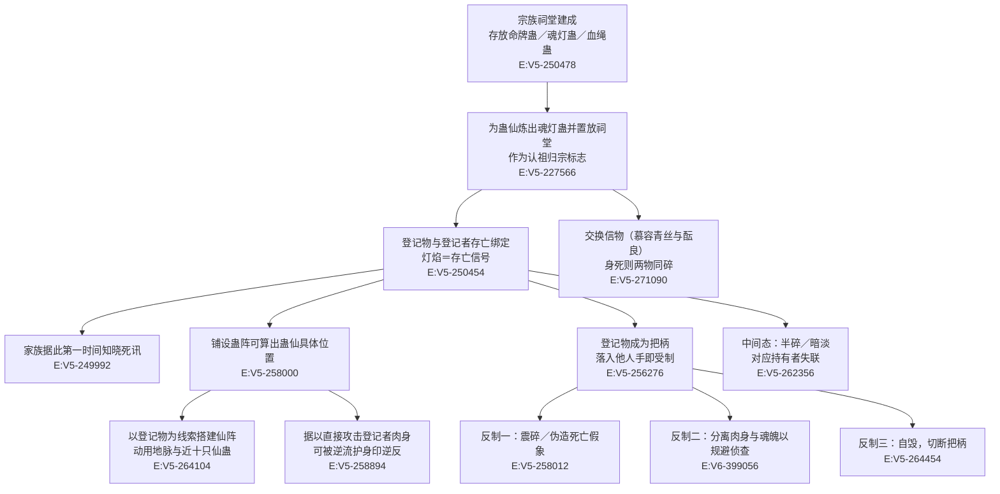

# 魂灯蛊

本页为 2026-09-28 A 线正式 20 页恢复批**新建页**（分片 S1-4）。全书字面命中「魂灯蛊」**39 处 / 去重 38 行**；单写“魂灯”（不含“蛊”字）另 **1 处 / 1 行**（第 291648 行“蒙屠的魂灯破灭”），二者合计 40 处 / 39 行。`roster-3.md` 登记为 `soul_atk_5_01_gu`、`game_rank=5`、`status=rank_cap`、原文转 **6**、登记锚 `E:V5-264322`。

**登记锚有效，但转数存在口径张力**：`E:V5-264322` 逐字为「不过幸好，我在关键时刻，保住了方源的命牌蛊、魂灯蛊。即便为此，舍弃了一只六转仙蛊。」——该行**确实含“魂灯蛊”**，故锚点成立；但句中的“六转仙蛊”是**被舍弃的另一只蛊**，并非魂灯蛊本身。而原文另有明写「毕竟，命牌蛊、魂灯蛊只是凡蛊而已」（`E:V5-250498`）。**登记转数 6 与本处“凡蛊”表述冲突，本页并列登记、不裁定**，详见《待核对》。所有引文回根原文 `source/蛊真人-clean.txt` 逐行复核，行号即 `E:V{段}-{6位行号}`。

**检索口径（必读）**

- 本批对根原文全书扫描（`open(p, encoding='utf-8', newline='').read().split('\r\n')`，437,060 行），逐条看上下文后分类如下：

| 检索串 | 处数 | 行数 | 说明 |
| --- | --- | --- | --- |
| 魂灯蛊 | 39 | 38 | 39 次 / 38 行；**唯一含 2 次的行是 `E:V5-258012`**（其余各行均 1 次），本页主检索串 |
| 魂灯（不含“蛊”字） | 1 | 1 | 第 291648 行“蒙屠的魂灯破灭”，同指本实体，计入派生写法 |
| 命牌蛊（配对实体，非本页主检索串） | 47 | 45 | 与魂灯蛊成对出现，40 行以上为并列句子 |
| 血绳蛊（同组第三件，非本页主检索串） | 4 | 4 | 与魂灯蛊同为祠堂三件套之一 |

- **“魂灯蛊／命牌蛊／魂灯”三者关系在本页必须分开**：命牌蛊是**另一只蛊**（配对实体），详见主题四；`roster-3.md` 中命牌蛊与本实体是两个不同 id，不得互并入 aliases。
- **未发现同名异物**：全书没有第二种叫“魂灯”的东西；不存在子串误切（“魂灯蛊”不是任何更长实体名的后缀）。
- 登记锚为**正文行**（非题名行）：`E:V5-264322` 逐字含“魂灯蛊”。**转数另据正文**核定，见《待核对》。

## 主题档案

### 一、身份与品阶：宗族祠堂三件套之一，原文称“凡蛊”

#### 原著事实

- **制度层面的定位**：「基本上，不管是超级势力，还是普通家族，都会建设一座宗族祠堂。里面存放着命牌蛊或者魂灯蛊，亦或者血绳蛊」`E:V5-250478`；「前两者比较普遍，血绳蛊稀少一些，毕竟牵扯到血道」`E:V5-250480`；「就算是中洲的大小门派，也有类似于宗族祠堂的建筑设施，同样是存放命牌蛊、魂灯蛊等」`E:V5-250482`。
- **品阶的原文表述**：「毕竟，命牌蛊、魂灯蛊只是凡蛊而已，动用一些手段，不难干涉」`E:V5-250498`。
- **天道／正道层面的用途**：「首先正道势力之中，蛊仙不是拥有命牌蛊，就是设立了魂灯蛊，或者是血绳蛊」`E:V5-286668`。
- **转数**：机制 [已确认] —— 本实体存在、可炼、可置放于祠堂、可与蛊仙存亡绑定（`E:V5-227566`、`E:V5-250478`、`E:V5-250654`）；具体数值 [待取证] —— 原文一处称其为“凡蛊”（`E:V5-250498`，凡蛊为一转至五转），而 `roster-3.md` 登记原文转 6，二者冲突。
- **形制与光色**：「命牌蛊破碎之后，宛若块块木片屑子，而魂灯蛊毁灭后，则是一块碎裂的瓢虫，再也发不出晦暗的淡蓝烛光」`E:V5-250486`。

#### 合理推导

- **依据**：`E:V5-250478`（超级势力到普通家族都建祠堂）＋`E:V5-250482`（中洲门派亦有类似设施）＋`E:V5-286668`（正道势力普遍采用）；**结论**：魂灯蛊是**覆盖面极广的基础制度件**，其重要性来自“普及”而非“稀有”——与同批的排难蛊（唯一基石）、狗屎运蛊（孤例本命蛊）形成三种不同的“围棋式”定位；**不确定性**：`E:V5-250480` 说“前两者比较普遍”，但未给任何数量或比例。
- **依据**：`E:V5-250498`（“只是凡蛊而已”）＋`E:V5-250486`（碎裂后“再也发不出……烛光”）；**结论**：本实体的价值不在威能而在**信息**，因此用凡蛊层级（低成本、可批量）即可承载；**可能反例**：`E:V5-264322` 行中出现“一只六转仙蛊”被舍弃以保住它，说明在特定情境下它的重要程度被抬到仙蛊量级——但该“六转仙蛊”是**另一只蛊**，不能据此定本实体的转数。

#### 《问真》设计意义

- 这是**“低阶但不可替代”**的原型：品阶低（凡蛊），功能却横跨制度、侦查、身份审核三条线。设计上宜把它做成“登记类物品”而非战斗物品，并允许它在极低阶就被玩家获取——稀缺性应该体现在“信息可信度”上，而不是品阶上。
- “形如瓢虫、燃淡蓝烛光”是可复用的**状态可视化**素材：灯亮／暗淡／熄灭三态天然对应“在世／危险／已亡”，设计上宜直接映射为可观测的三态指示物。

### 二、核心机制：灯焰表征存亡，破碎即主亡

#### 原著事实

- **生死的直接读数**：「他失声惊呼：“武庸大人的命牌蛊碎了、魂灯蛊灭了！武庸大人……难道死了？！”」`E:V5-250454`；「命牌蛊、魂灯蛊破碎，意味着武庸可能已经陨落」`E:V5-250654`；「不，不好了！洞主大人的魂灯蛊熄灭了，命牌蛊也破碎了！」`E:V6-400214`；「告知我蒙屠的魂灯破灭」`E:V5-291648`。
- **异常态**：「翠波妹妹的命牌蛊忽然半碎开来，魂灯蛊也暗淡无光」`E:V5-262356`；「你的命牌蛊、魂灯蛊都有异状发生，我便赶来援助你」`E:V5-265796`。
- **时间上的即时性**：「武艺髯死了，这次，武原句、戎豪竟也死了。有着命牌蛊、魂灯蛊，武家第一时间就知晓了死讯」`E:V5-249992`；「武家、姚家大为震动，因为从命牌蛊、魂灯蛊等手段中，得到信息，武艺髯、姚耕已经命丧黄泉！」`E:V5-249834`。
- **可以“半碎／暗淡”而非只有全灭**：见 `E:V5-262356`、`E:V5-250792`（“区区命牌蛊、魂灯蛊的破碎代表不了真相”）。
- **支付方／受益方／时点**：支付方 = **被登记的那名蛊仙本人**（其存亡被外化为一件可被他人观察的器物）；受益方 = 家族／势力方（第一时间获知死讯，`E:V5-249992`）；生效时点 = **置放之时起持续**，直至破碎或自毁（`E:V5-264338`）。

#### 合理推导

- **依据**：`E:V5-250454`、`E:V5-250654`、`E:V6-400214`（三处独立行都写“熄灭／破碎＝死”）；**结论**：本实体的核心机制是**单一的二元信号**（存／亡），加上一个中间态（暗淡、半碎）；**不确定性**：`E:V5-250792` 又写“破碎代表不了真相”，说明**信号可被伪造**，即“灯灭”不等于“人死”——这正是机制的**已知漏洞**，与 `E:V5-258012` 的伪造手法互为印证。
- **依据**：`E:V5-262356`（半碎＋暗淡）；**结论**：中间态的存在使本实体成为**灾厄预警器**（不是只有生死的二值）；**可能反例**：原文未说明“暗淡”的判读标准，家族方是否总能正确解读中间态，无对照案例。

#### 《问真》设计意义

- 建议把它实现为**“可被伪造的信号源”**而不是“真值查询接口”：设计上必须让玩家能怀疑、验证、伪造它，否则这类物品会直接销毁所有“假死／替身／身份顶替”的剧情空间。
- “半碎／暗淡”中间态可承担**预警机制**：让玩家在盟友出事前获得模糊提示，从而产生“救不救、来不来得及”的决策压力。

### 三、侦查与定位：可推算蛊仙的具体位置

#### 原著事实

- **定位能力**：铺设蛊阵取出命牌蛊、魂灯蛊置入其中，可算出目标的具体位置——「去从内库中借出相应仙蛊，铺设命理相位蛊阵，将武遗海的命牌蛊、魂灯蛊取出来，置入蛊阵，算出我弟的位置」`E:V5-258000`；反向旁证：两者破碎后便无法据此定位 `E:V5-271120`。
- **据此设阵**：「这座仙阵是以地脉为基，方源的命牌蛊、魂灯蛊为线索，动用了近十只仙蛊，难以计数的凡蛊，搭建起来的」`E:V5-264104`；「他当即传讯回武家：“武罚太上长老，去从内库中借出相应仙蛊，铺设命理相位蛊阵，将武遗海的命牌蛊、魂灯蛊取出来，置入蛊阵，算出我弟的位置！”」`E:V5-258000`。
- **可反向用于攻击**：「逆流河减少了细微，看来武庸的确掌握着某种厉害手段，能够根据我的命牌蛊、魂灯蛊，来直接攻击我的肉身。可惜碰上了逆流护身印，尽数逆反了回去」`E:V5-258894`；「又有命牌蛊、魂灯蛊落在武家手上，关键是武家居然有手段，可以凭此攻击方源」`E:V5-258978`。
- **作为身份审核手段**：「尤其是通过族中的魂灯蛊等隐秘联系，就算是方源利用见面曾相识，也通过不了」`E:V5-294794`；「再加上宗祖祠堂中的命牌蛊、魂灯蛊等等都无异状，二长老应当还是他本人！」`E:V5-345472`；「这个过程有些类似于超级家族的命牌蛊、魂灯蛊，但更具强大的约束性」`E:V5-305216`。

#### 合理推导

- **依据**：`E:V5-258000`（铺设命理相位蛊阵算出具体位置）＋`E:V5-264104`（搭建蛊阵需要它作线索）＋`E:V5-258894`（可据以直接攻击肉身）；**结论**：本实体是**远程定位＋远程施术的锚点**，其危险程度远高于“显示生死”这一层——拥有它等于**持有对方的一把钥匙**，因此它同时是**把柄**（`E:V5-256276` 称之为“隐患”）；**不确定性**：定位精度、有效距离、是否需配合其他仙蛊，原文只给了“需要蛊阵”“动用近十只仙蛊”这类定性描述。
- **依据**：`E:V5-294794`（可拦下“见面曾相识”级别的伪装）＋`E:V5-345472`（无异状即可确认本人）；**结论**：本实体被当作**身份审核的硬证据**，其权威性高于外观与气息判断；**可能反例**：`E:V5-258012` 明写“影宗既有信道手段，可以震碎我的命牌蛊、魂灯蛊，伪造出我死亡的假象”——即这套“硬证据”本身可被专业手段破坏，故其为**高置信但非不可挑战**的凭据。

#### 《问真》设计意义

- 把“低阶物品＋高阶用途”做成**可在系统层被消费的规则**：一件凡蛊即可作为“定位锚”驱动仙阵，设计上宜给这类物品一个“作为阵基可被引用”的标记位，以便任务脚本直接调用。
- 同时必须实现**反制链**（伪造、震碎、分离肉身与魂魄），否则该物品会单方面锁死所有身份伪装玩法；原文已给出至少三条反制（`E:V5-258012`、`E:V6-399056` 语境、`E:V5-250498`“不难干涉”）。

### 四、配对关系：与命牌蛊配对（配对≠同一实体）

#### 原著事实

- **成对炼出、成对置放**：「于是，武樵又为方源当场炼出了魂灯蛊、命牌蛊。这些蛊虫今后都要置放在武家的宗祠之中，算是方源正式认祖归宗的标志」`E:V5-227566`；「一只命牌蛊，一只魂灯蛊」`E:V5-258336`。
- **成对出现于绝大多数句子**：「里面存放着命牌蛊或者魂灯蛊」`E:V5-250478`、「武庸大人的命牌蛊碎了、魂灯蛊灭了」`E:V5-250454`、「命牌蛊、魂灯蛊破碎」`E:V5-250654`、「一只命牌蛊，一只魂灯蛊」`E:V5-258336`、「命牌蛊也破碎了」`E:V6-400214`。
- **两者是两只不同的蛊**：碎裂物不同——「命牌蛊破碎之后，宛若块块木片屑子，而魂灯蛊毁灭后，则是一块碎裂的瓢虫」`E:V5-250486`；且在交易语境中可分头处置（「将武遗海的命牌蛊、魂灯蛊，都通过宝黄天，给我送过来」`E:V5-258826`，并列而各为一物）。
- **与血绳蛊同组但不同物**：「里面存放着命牌蛊或者魂灯蛊，亦或者血绳蛊」`E:V5-250478`；「前两者比较普遍，血绳蛊稀少一些，毕竟牵扯到血道」`E:V5-250480`。

#### 合理推导

- **依据**：`E:V5-250486`（破损物形态不同：木片屑子 vs 碎裂瓢虫）＋`E:V5-258336`（“一只命牌蛊，一只魂灯蛊”）＋`E:V5-264322`（并列保全）；**结论**：命牌蛊与魂灯蛊是**互补配对的两个独立实体**（一个碎为木片、一个碎为瓢虫；一个或偏于名位凭信、一个或偏于灯焰存亡信号），配对关系**不等于同一性**——本页因此**不把“命牌蛊”写入 aliases**；**不确定性**：原文未给两者能力差异的完整对照表，“分工”只能从破损形态与句子语境推断。
- **依据**：`E:V5-271090`（“这两只蛊虫，可是她和酝良特意交换的信物！”）；**结论**：配对蛊在叙事中被用作**双向信物**（互换，各自持对方的），这意味着配对关系可以是**跨家族**的；**可能反例**：同一处也写“她仙窍中的魂灯蛊、命牌蛊尽皆破碎”，说明信物随持有者身死而毁，其“跨家族”属性只在生前有效。

#### 《问真》设计意义

- “配对≠同一”需要在 runtime 层有明确表达：建议用**配对边**连接两个独立 id，并禁止把配对伙伴并入 aliases——否则一旦编译器按名字合并，会直接抹掉两者在破损形态、炼法、用途上的差异。
- “互换信物”给出一个**双向绑定**的设计模板：两个角色各持对方的登记物，任一方出事对方即知；适合用来做跨阵营的契约、婚约、结盟机制。

### 五、代价与反制：可被干涉、可被伪造、可被规避

#### 原著事实

- **可被干涉（原文自陈的弱点）**：「毕竟，命牌蛊、魂灯蛊只是凡蛊而已，动用一些手段，不难干涉」`E:V5-250498`。
- **可被震碎伪造**：「当然，影宗既有信道手段，可以震碎我的命牌蛊、魂灯蛊，伪造出我死亡的假象。自然也有可能，杀死武遗海，却保留命牌蛊、魂灯蛊」`E:V5-258012`。
- **可被规避（以分离肉身与魂魄实现）**：「当初，方源为了规避魂灯蛊的侦查，并没有杀死房睇长，只是分离了他的肉身和魂魄」`E:V6-399056`；配套谎言：「我的肉身本就是房睇长的肉身，因此血统方面不是破绽。房睇长并没有死，命牌蛊也不会有什么异状」`E:V5-345688`。
- **可被自毁（持方主动切断）**：「武庸吃惊不已：“方源的命牌蛊、魂灯蛊居然自毁了？是方源那边运用了什么法门？”」`E:V5-264338`；「想必此时，我的命牌蛊、魂灯蛊都已经破碎了吧。武庸也再不能利用这个把柄，来对付我了」`E:V5-264454`。
- **可被反噬（攻击者反被打回）**：「能够根据我的命牌蛊、魂灯蛊，来直接攻击我的肉身。可惜碰上了逆流护身印，尽数逆反了回去」`E:V5-258894`。
- **保全的代价**：「不过幸好，我在关键时刻，保住了方源的命牌蛊、魂灯蛊。即便为此，舍弃了一只六转仙蛊」`E:V5-264322`。
- **支付方／受益方／时点**：登记时支付方 = **被登记者**（上交一件能表征自身存亡与位置的信物，`E:V5-227566`）；受益方 = 家族／势力（`E:V5-250478`：家族建宗族祠堂存放此类蛊虫以掌握族人生死）；被滥用的时点 = **一旦落入他人之手**（`E:V5-258978`）；止损时点 = 自毁（`E:V5-264338`、`E:V5-264454`）。

#### 合理推导

- **依据**：`E:V5-250498`（凡蛊，不难干涉）＋`E:V5-258012`（可震碎伪造）＋`E:V6-399056`（可分离肉身魂魄规避）；**结论**：本实体的“安全”层次很低——它的可信度来自**制度惯例**而非技术壁垒，因此它的正确用法是**制度而非防务**；**不确定性**：`E:V5-258012` 中的“信道手段”超出本书本页取证范围，其具体条件未明。
- **依据**：`E:V5-264454`（“也再不能利用这个把柄，来对付我了”）＋`E:V5-256276`（“还有一个隐患……放置在武家的宗族祠堂当中呢！”）；**结论**：对本实体的所有权关系，本质是**把柄关系**：持有者以它为质，登记者以它为患；**可能反例**：`E:V5-227566` 把它写为“正式认祖归宗的标志”，即它同时具备**荣誉／归属**的一面，不只是枷锁。

#### 《问真》设计意义

- 这是**“制度性物品的双面性”**样本：同一件凡蛊既是归宗信物（荣誉）又是被握住的把柄（威胁）。设计上宜让“加入组织”与“交出登记物”绑定，并把“取回登记物”做成一条完整的离会任务线——风险与收益天然对称。
- 反制链（干涉／震碎／分离肉身魂魄／自毁／逆反）原文齐备，可直接作为**等价对策清单**写入规则层，避免出现无解的单向监控。

### 六、沿革与事件：武家认祖归宗、武庸之乱、慕容青丝与蒙屠

#### 原著事实

- **入武家（认祖归宗）**：`E:V5-227566`（武樵当场炼出，置放武家宗祠，成为方源正式认祖归宗的标志）；`E:V5-226902`（“没有命牌蛊或者魂灯蛊，若是有的话，那就不是私生子，而是名正言顺的二少爷”）。祠堂本体：`E:V5-250476`（武仪山上的宗族祠堂，是一座凡蛊屋）。
- **武庸之死讯扩散**：`E:V5-249834`、`E:V5-249992`、`E:V5-250454`、`E:V5-250648`、`E:V5-250654`、`E:V5-250792`。
- **方源身上的“把柄”线**：`E:V5-254540`、`E:V5-254542`、`E:V5-256276`、`E:V5-257978`、`E:V5-258000`、`E:V5-258012`、`E:V5-258336`、`E:V5-258826`、`E:V5-258846`、`E:V5-258894`、`E:V5-258978`、`E:V5-264104`、`E:V5-264322`、`E:V5-264338`、`E:V5-264454`。
- **慕容青丝与酝良（互换信物）**：`E:V5-271090`（尽皆破碎，是彼此特意交换的信物）、`E:V5-271120`（破碎后无法据此定位酝良）。
- **蒙屠**：`E:V5-291648`（“蒙屠的魂灯破灭”）；**翠波**：`E:V5-262356`；**房睇长**：`E:V6-399056`、`E:V5-345688`、`E:V5-345472`；**池家**：`E:V5-254542`；**南疆正道身份审核**：`E:V5-294794`；**功德碑类比**：`E:V5-305216`。

#### 合理推导

- **依据**：武家线密集出现（`E:V5-249834` 起至 `E:V5-264454` 共十六行以上）；**结论**：本实体在叙事中承担**“消息总线”**职能——家族大事往往先经由它被宣布，再展开行动；这使它成为**推动情节提速的装置**（一次“灯灭”即可启动一连串追查）；**不确定性**：原文未说明祠堂内登记物的**保有时间与销毁条件**，只写到自毁与破碎。
- **依据**：`E:V5-264454`（“也再不能利用这个把柄”）＋`E:V6-375902` 语境之外的 `E:V5-264322`（保住它需舍弃另一只六转仙蛊）；**结论**：本实体的“价值”在冲突中被明确标价——**一只六转仙蛊**是它为方源换来的保全成本；**可能反例**：该“六转仙蛊”是**另一只蛊**，不能据此判定魂灯蛊自身的品阶（这正是本页《待核对》的核心）。

#### 《问真》设计意义

- 适合做**叙事触发器**：把“某人的魂灯熄灭”做成可被脚本监听的事件，从而由一件低阶物品自然引出追查、继承、篡位、复仇等一串剧情。
- “改写登记物＝改写身份”这一设定，给“顶替身份”玩法提供了规则落点：设计上宜让身份顶替必须处理登记物（保留、伪造或摧毁），而不是靠外观或气息蒙混。

## 状态时间线

| 状态 ID | 阶段 | 状态 | 证据 |
| --- | --- | --- | --- |
| ST-HUNDENG-01 | 制度常态 | 超级势力与普通家族普遍建宗族祠堂，存放命牌蛊或魂灯蛊或血绳蛊 | E:V5-250478 |
| ST-HUNDENG-02 | 稀有度分层 | 前两者较普遍，血绳蛊稀少（牵扯血道） | E:V5-250480 |
| ST-HUNDENG-03 | 普及范围 | 中洲大小门派亦有类似设施，同样存放命牌蛊、魂灯蛊 | E:V5-250482 |
| ST-HUNDENG-04 | 品阶表述 | 原文明写“命牌蛊、魂灯蛊只是凡蛊而已，动用一些手段，不难干涉” | E:V5-250498 |
| ST-HUNDENG-05 | 形制与光色 | 魂灯蛊毁灭后是一块碎裂的瓢虫，再也发不出晦暗的淡蓝烛光 | E:V5-250486 |
| ST-HUNDENG-06 | 入武家 | 武樵当场为方源炼出魂灯蛊、命牌蛊，置放武家宗祠，作为认祖归宗的标志 | E:V5-227566 |
| ST-HUNDENG-07 | 身份门槛 | 无命牌蛊或魂灯蛊者被视作私生子（无名分） | E:V5-226902 |
| ST-HUNDENG-08 | 死讯读数 | 武庸的命牌蛊碎、魂灯蛊灭，被解读为可能陨落 | E:V5-250454、E:V5-250654 |
| ST-HUNDENG-09 | 即时性 | 家族凭命牌蛊、魂灯蛊第一时间知晓死讯 | E:V5-249992、E:V5-249834 |
| ST-HUNDENG-10 | 定位用途 | 铺设命理相位蛊阵取出命牌蛊、魂灯蛊置入蛊阵，可算出目标位置 | E:V5-258000 |
| ST-HUNDENG-11 | 远程攻击 | 可据以直接攻击登记者肉身（遭逆流护身印逆反） | E:V5-258894、E:V5-258978 |
| ST-HUNDENG-12 | 把柄关系 | 方源留在武家宗祠的命牌蛊、魂灯蛊成为其隐患 | E:V5-256276 |
| ST-HUNDENG-13 | 伪造 | 影宗可震碎登记物、伪造死亡假象；亦可杀人而保留登记物 | E:V5-258012 |
| ST-HUNDENG-14 | 保全成本 | 保住方源的命牌蛊、魂灯蛊，代价是舍弃一只六转仙蛊 | E:V5-264322 |
| ST-HUNDENG-15 | 自毁止损 | 登记物自毁，武庸再不能以之为把柄 | E:V5-264338、E:V5-264454 |
| ST-HUNDENG-16 | 规避侦查 | 方源分离房睇长肉身与魂魄，以规避魂灯蛊的侦查 | E:V6-399056 |
| ST-HUNDENG-17 | 审核凭据 | 祠堂登记物无异状即可确认“二长老应当还是他本人” | E:V5-345472、E:V5-294794 |
| ST-HUNDENG-18 | 信物属性 | 慕容青丝与酝良特意交换，破碎后无法据以定位酝良 | E:V5-271090、E:V5-271120 |
| ST-HUNDENG-19 | 中间态 | 命牌蛊半碎、魂灯蛊暗淡无光，对应持有者失联 | E:V5-262356 |
| ST-HUNDENG-20 | 单写“魂灯” | 蒙自在称“蒙屠的魂灯破灭” | E:V5-291648 |

## 原著明确内容（本批取证窗口登记）

| 窗口 | 内容 | 对应主题 |
| --- | --- | --- |
| 226900–226904 | 无命牌蛊或魂灯蛊者被视为私生子（武遗海） | 主题六 |
| 227564–227568 | 武樵当场为方源炼出魂灯蛊、命牌蛊，置放武家宗祠，为认祖归宗标志 | 主题四／主题六 |
| 249832–249836 | 武家、姚家从命牌蛊、魂灯蛊等手段得知武艺髯、姚耕已死 | 主题二 |
| 249990–249994 | 家族凭此第一时间知晓死讯 | 主题二 |
| 250452–250456 | “武庸大人的命牌蛊碎了、魂灯蛊灭了！” | 主题二 |
| 250474–250484 | 宗族祠堂（凡蛊屋）与三件套的普及；血绳蛊稀少 | 主题一 |
| 250486–250486 | 命牌蛊碎为木片屑子，魂灯蛊碎为瓢虫、光灭 | 主题一／主题四 |
| 250496–250500 | “命牌蛊、魂灯蛊只是凡蛊而已，动用一些手段，不难干涉” | 主题一／主题五 |
| 250646–250656 | 武庸失踪、登记物破碎，武家大乱；意味着可能已陨落 | 主题二／主题六 |
| 250790–250794 | “区区命牌蛊、魂灯蛊的破碎代表不了真相” | 主题二 |
| 254538–254544 | 手段与“方源可没有在池家留下什么命牌蛊、魂灯蛊” | 主题六 |
| 256274–256278 | 加入武家的盟约与留在宗祠的命牌蛊、魂灯蛊构成隐患 | 主题五 |
| 257976–257980 | 武家宗祠中方源的登记物未破碎 | 主题六 |
| 258000–258012 | 借仙蛊铺设命理相位蛊阵以定位；可震碎伪造死亡假象 | 主题三／主题五 |
| 258334–258338 | “一只命牌蛊，一只魂灯蛊” | 主题四 |
| 258824–258828 | 通过宝黄天把登记物送过来 | 主题四／主题六 |
| 258844–258848 | “还有我的命牌蛊、魂灯蛊！” | 主题五 |
| 258892–258896 | 据登记物直接攻击肉身，遭逆流护身印逆反 | 主题三／主题五 |
| 258976–258980 | 登记物落在武家手上，武家有手段凭此攻击方源 | 主题三／主题五 |
| 262354–262358 | 翠波命牌蛊半碎、魂灯蛊暗淡无光 | 主题二 |
| 264102–264106 | 以地脉为基、以登记物为线索搭建仙阵 | 主题三 |
| 264320–264324 | 保住方源的命牌蛊、魂灯蛊，代价是舍弃一只六转仙蛊 | 《待核对》／主题五 |
| 264336–264340 | 登记物自毁，武庸吃惊 | 主题五 |
| 264452–264456 | 自毁后武庸再不能以之为把柄 | 主题五 |
| 265794–265798 | 登记物有异状即赶来援助 | 主题二 |
| 271088–271092 | 慕容青丝仙窍中的魂灯蛊、命牌蛊尽皆破碎，为与酝良交换的信物 | 主题四／主题六 |
| 271118–271122 | 破碎后无法据以定位酝良 | 主题三／主题六 |
| 286666–286672 | 正道势力普遍采用；可查生死、可推算具体位置 | 主题一／主题三 |
| 291646–291650 | “蒙屠的魂灯破灭” | 主题二／主题六 |
| 294792–294796 | 族中魂灯蛊的隐秘联系可拦下“见面曾相识”级伪装 | 主题三 |
| 305214–305218 | 功德碑过程类似超级家族的命牌蛊、魂灯蛊，但约束更强 | 主题三 |
| 345470–345474 | 宗祖祠堂中登记物无异状 → 认定二长老仍是本人 | 主题三 |
| 345686–345690 | “房睇长并没有死，命牌蛊也不会有什么异状” | 主题五／主题六 |
| 399054–399058 | 分离房睇长肉身与魂魄，以规避魂灯蛊的侦查 | 主题五／主题六 |
| 400212–400216 | “洞主大人的魂灯蛊熄灭了，命牌蛊也破碎了！” | 主题二 |

## 事件链

## 资料整理

### 一、命名检索口径与逐条分类账（本页核心交付之一）

字面「魂灯蛊」全书 **39 处 / 38 行**；单写“魂灯” **1 处 / 1 行**。逐条分类（行号可直接按段域表换算为 `E:V{段}-{6位行号}`，如 250478 → `E:V5-250478`、400214 → `E:V6-400214`）：

| 分类 | 处数 | 行数 | 行号清单 |
| --- | --- | --- | --- |
| 全名“魂灯蛊”（本实体） | 39 | 38 | 226902、227566、249834、249992、250454、250478、250482、250486、250498、250648、250654、250792、254540、254542、256276、257978、258000、258012、258336、258826、258846、258894、258978、262356、264104、264322、264338、264454、265796、271090、271120、286668、286670、294794、305216、345472、399056、400214 |
| 单写“魂灯”（同指本实体，不含“蛊”字） | 1 | 1 | 291648 |

**全部命中均为本实体**：无同名异物、无子串误切——“魂灯蛊”不是任何更长实体名的后缀，“魂灯”也不是无关词（第 291648 行“蒙屠的魂灯破灭”与全名同指）。这一点与同批狗屎运蛊（专名与俗语同形，需剔除 16 行）形成对照。

### 二、配对实体与登记记录处置

- **配对实体：命牌蛊**。全书“命牌蛊”**47 处 / 45 行**，“血绳蛊”**4 处 / 4 行**。三者构成原文明确称述的祠堂“三件套”（`E:V5-250478`）。本页**不把“命牌蛊”“血绳蛊”写入 aliases**，配对与同组关系在主题四以“身份边界”表达。
- `roster-3.md` 的 `soul_atk_5_01_gu` 行逐字为：`| soul_atk_5_01_gu | 魂灯蛊 | 5 | 6 | E:V5-264322 |  |`。本页复核：登记锚**可定位且该行逐字含“魂灯蛊”**（`E:V5-264322`），**锚点有效**；但该行句中的“六转仙蛊”是**被舍弃的另一只蛊**，据此推出本实体为六转缺乏文本支持；且 `E:V5-250498` 明写其为“凡蛊”。**登记转数 6 与原文冲突**，详见《待核对》。
- `game/data/gu_lore.json` 的对应条目实测逐字为 `{"id": "soul_atk_5_01_gu", "name": "魂灯蛊", "game_rank": 5, "status": "rank_cap", "lore_rank": 6, "anchor": "E:V5-264322"}`（只读核对，不在本批改动范围）。
- 同目录既有页 `soul-atk-1-02-gu.md`（净魂仙蛊）为**魂道另类实体**，与本页无配对关系；本页不改动该页。

## 分析与解读

- **本实体的功能不是“威能”，而是“信息”。** 全部 39 处命中中，无一处描述它用于战斗；它出现的高频语境是“某人的灯灭了→家族震动→展开追查”（`E:V5-250454`、`E:V5-249992`、`E:V5-249834`）。这是一件**把私人生死公共化的制度件**。
- **它与登记转数 6 的张力，本身就是一条重要的知识。** 若采信“凡蛊”表述（`E:V5-250498`），则本实体属于**低阶高用**的典型；若采信登记表，则需解释“六转仙蛊”为何被用来交换它（`E:V5-264322`）——但该句中六转者**另有其蛊**，故后一条文本并不支持六转结论。本页把两说并列，交由校验组裁定。
- **它同时是荣誉与枷锁。** 一手是“正式认祖归宗的标志”（`E:V5-227566`），一手是“还有一个隐患”（`E:V5-256276`）与“也再不能利用这个把柄”（`E:V5-264454`）——同物两面的写法非常完整，适合作为“制度性物品”的模板样本。
- **它的反制链在原文是齐备的**：干涉（`E:V5-250498`）、震碎／伪造（`E:V5-258012`）、规避（`E:V6-399056`）、自毁（`E:V5-264454`）、逆反（`E:V5-258894`）。设计上若只实现“监控”而不实现这五条，会与原文的能力设定相悖。
- **“半碎／暗淡”是难得的中间态**（`E:V5-262356`），表明这套系统不是二值开关，家族方可以读出“状况不好但未死”这一档——这正是可用作**预警装置**的文本依据。

## 待核对

- **原文口径冲突（须并列，不裁定）**：魂灯蛊的品阶／转数。
  - 口径 A：**登记为六转**。证据：`roster-3.md` 与 `game/data/gu_lore.json` 均记 `lore_rank=6`，登记锚 `E:V5-264322`。
  - 口径 B：**原文称其为“凡蛊”**。证据：`E:V5-250498`「命牌蛊、魂灯蛊只是凡蛊而已，动用一些手段，不难干涉」；凡蛊为一转至五转，与六转不相容。
  - 当前状态：**并列登记，本页不裁定**。需要指出的是，`E:V5-264322` 行内的“一只六转仙蛊”在句中是**被舍弃的另一只蛊**，不能作为本实体转数的依据；该登记项疑似把“同句出现的六转”误记为本实体转数。本批**不修改** roster-3 / gu_lore.json，仅登记证据。
- **登记锚性质说明**：`E:V5-264322` 是**正文行**（武庸自语），不是题名行；本页的转数因此**另据正文** `E:V5-250498` 与 `E:V5-264322` 两处并列判断。
- **命牌蛊与魂灯蛊的能力分工**：原文只给出破损形态差异（木片屑子 vs 碎裂瓢虫，`E:V5-250486`）与并列句式，未见明确的分工说明——**尚未找到**，不得写成“原著没有”。
- **登记物的保有时间、销毁条件与不可逆性**：只写到“破碎／自毁”，未见修复记载，**尚未找到**。
- **`E:V5-258012` 中“信道手段”的成立条件**：超出本页取证窗口，**尚未找到**；按纪律记为取证空缺。
- **段域空隙提醒（供全批复用）**：本页无落在段域空隙的行；但同批排难蛊页命中第 120876 行落在第 3/4 段空隙（120867–121057），不可挂 E-ID——建议校验组核对其余页面是否存在同类情形。
- 本页未超 40 KB；如后续增补导致超限，按 GOVERNANCE 在本节登记例外。

## 模板扩展建议（只登记，不改核心模板）

1. **建议新增“登记物／制度件”类别**：本实体的价值在信息与制度，而非威能。当前模板以“仙蛊／战斗”为主轴此类低阶高用实体容易在描述上失真。
2. **建议模板固定写“配对实体”小节**：配对≠同一（本页主题四），若不写死，后续整合极易把魂灯蛊与命牌蛊合并。
3. **建议把“可被伪造／可被规避”作为能力边界的必填项**：本实体的监控属性天然需要一个反制清单，模板宜留位。
4. **建议状态时间线支持“同一物品的多使用者也多阶段”**：本页跨越武家、武庸、慕容青丝、蒙屠、房睇长多条线，模板宜允许在证据列并列多行。

## 关联页面

- [soul-atk-1-02-gu.md](soul-atk-1-02-gu.md)（净魂仙蛊，魂道另类实体，与本页无配对关系）
- [luck-atk-5-05-gu.md](luck-atk-5-05-gu.md)（排难蛊，同批新建页）
- [../world/soul-path.md](../world/soul-path.md)（魂道）
- [../world/north-plain.md](../world/north-plain.md)（北原）
- [../characters/fang-yuan.md](../characters/fang-yuan.md)（方源）
- [../world/gu-care-and-refinement.md](../world/gu-care-and-refinement.md)（蛊虫的养护与炼制）
- [gu-relations.md](gu-relations.md)
- [roster-3.md](roster-3.md)
