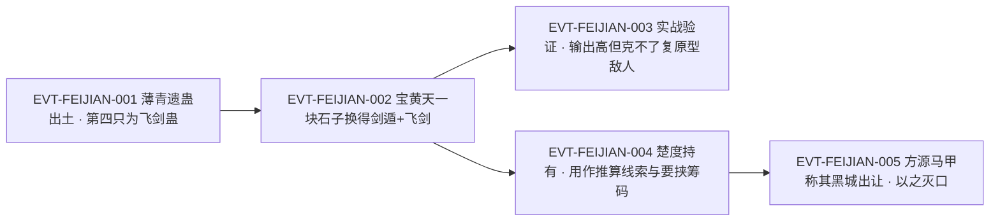

# 飞剑蛊

飞剑蛊是薄青一脉的**七转剑道攻伐仙蛊**——「外形看去。是一副银翅蜻蜓模样。」`E:V4-182394`，在剑仙薄青手上是「作战时，最常用的仙蛊之一」`E:V4-182396`。原文把它的知识分成三段：段4的智道传承窗口一次给足外形、转数、制作者与四道命名的剑道杀招（`E:V4-182394`–`E:V4-182400`）；段5的宝黄天交易窗口给出它入方源之手的全过程（`E:V5-190076`、`E:V5-190082`、`E:V5-190154`）；段5的两次实战窗口则专门写它的短板（`E:V5-191988`、`E:V5-194464`）。

全书出现「飞剑蛊」共 **11 行 / 11 次**（含重复块、未去重；检索口径见《原著明确内容》）。本页为 2026-09-28 A 线恢复批**新建页**，引文一律回根原文 `source/蛊真人-clean.txt` 逐行复核，行号即 `E:V{段}-{6位行号}`（段号由行号机械推导）；正文按`原著事实 → 合理推导 →《问真》设计意义`三层组织。

## 主题档案

### 一、本体：银翅蜻蜓模样的七转剑道攻伐仙蛊

#### 原著事实

- 外形（全书唯一一次）：`E:V4-182394`
- 同批取出的剑道遗蛊外形两两不同，可互为旁证：剑眉仙蛊「它形如蜈蚣，但蜈蚣的百足处，却是一根根的柔软须毛。」`E:V4-182356`；剑遁蛊「它形如金针蜜蜂，一经催动，身形化作一柄利剑，刺破空间，向前穿遁。」`E:V4-182404`。
- 转数与战史定位：「这只七转仙蛊，是剑仙薄青作战时，最常用的仙蛊之一。」`E:V4-182396`
- 段5 的剑道仙蛊总述把它写作「七转飞剑蛊」：`E:V5-190076`
- 道属：剑道。上句整句以「这些剑道仙蛊」起头 `E:V5-190076`；旁证另有「皆因这只飞剑仙蛊，乃是剑道七转！」`E:V5-203772`。
- 他人的转数判断（对话，说话人：戚灾）：「怎么又是一只七转剑道仙蛊？」`E:V5-191960`
- 仙蛊身份（非凡蛊）：`E:V5-190076` 与 `E:V5-190154` 均称其为「仙蛊」，且 `E:V5-199792` 起的清点把它列入「七转仙蛊」档而非凡蛊档。

#### 代价与收益（支付方／受益方／支付时点）

- **支付方**：催动者（控蛊者）的仙元；**受益方**：控蛊者——换来「攻伐」通道（`E:V5-210000`）；**支付时点**：每次催动即时支付。
- 有限的一次价格记录：宝黄天交易中它与剑遁蛊一起只花掉「一块随手拾取的石子」`E:V5-190082`——支付方方源，受益方方源，时点是一次性购入。**这是卖方报价的个案，不能读成它的市场价**（同段另写宝黄天的手续费用「贵得惊人」`E:V5-191372`）。
- **反面情形（原文明写）**：目标能自愈或重新凝聚时，仙元照付而战果归零——雪怪「脑袋上的伤口旋即自愈」`E:V5-194460`，阴气「转眼间又都恢复如初」`E:V5-191984`；此时实际受益方是被击中方。受益方不必是使用者，这一条在本页有两处实证。

#### 合理推导

- **依据**：`E:V4-182396`、`E:V5-190076`、`E:V5-191960`；**结论**：全书带转数的表述同指**七转**，三处一致；**不确定性**：`E:V5-191960` 出自人物惊疑之语，证据强度低于旁白，本页只把它当旁证，不以它为唯一依据。
- **依据**：`E:V4-182394` 与同批的 `E:V4-182356`、`E:V4-182404`；**结论**：作者在同一个窗口里逐只给出互不重复的外形，说明「银翅蜻蜓」是刻意区分的辨识特征；**不确定性**：其余 10 处命中均未复述外形，无法判断银翅蜻蜓是常态还是`催动前蛰伏态`。
- **依据**：`E:V4-182396`（薄青最常用之一）＋`E:V5-190082`（方源以石子换得）＋`E:V5-194484`（「他现在是六转蛊仙，运用七转仙蛊，实在过于吃力。」）；**结论**：飞剑蛊对持有者的门槛是**转数匹配**而非认主或资质——它被换到方源手上后，真正限制它的是持有者修为；**不确定性**：原文未写非剑道蛊仙能否催动它，也未写剑道蛊仙催动是否有加成（对照浪迹天涯仙蛊则有明文的水道／力道互斥口径）。

#### 《问真》设计意义

- `七转攻伐、跨属可持、受持有者转数压制`这一组特征适合做**高阶通用输出件**：进门门槛低（可交易、可炼化转手），发挥上限由持有者修为与是否同属剑道决定——比"绑定血脉／绑定流派"更贴原文的资产流转感。
- 原文给它留了一条清晰的反制口子（自愈、聚散），可直接做成**伤害通道 × 目标恢复特性**的克制规则，而不是单纯的数值克制。
- 价格记录（一块石子）宜作为剧情事件的道具，不要写进经济系统的基准价。

### 二、杀招核心：从四道飞剑杀招到暗歧杀与剑痕索命

#### 原著事实

- 薄青以它为核心组成杀招：「他以此蛊为核心，辅助其他仙蛊，和大量凡蛊，组成了不少剑道杀招，在历史上几乎都留下一笔深刻的印记。」`E:V4-182398`
- 点名四道：「比如其中的无形飞剑杀招、云霄飞剑杀招、穷追飞剑杀招、万里飞剑杀招……」`E:V4-182400`
- 作为「暗歧杀」核心之一：`E:V5-191432`
- 方源对这套杀招的自评（对话，说话人：方源）：「若是我有暗渡仙蛊，再加上手中正好拥有的飞剑仙蛊，这招暗歧杀，就巧好能用得上了。可惜……」`E:V5-191440`
- 作为「剑痕索命」的主蛊：「仙道杀招，以仙蛊为核心，凡蛊为辅助。比如方源掌握的仙道杀招剑痕索命，它就是以飞剑仙蛊为主。其他少量剑道等等流派的凡蛊为辅。」`E:V5-209992`
- `攻伐／挪移`的分工明文：`E:V5-210000`
- 可替代性与其代价：`E:V5-209994`、`E:V5-209996`、`E:V5-210002`
- 逆炼需求：`E:V5-194482`
- 实战佐证：`E:V5-194562`

#### 合理推导

- **依据**：`E:V4-182398`、`E:V4-182400`、`E:V5-191432`、`E:V5-209992`；**结论**：飞剑蛊在书中的真实身份是**杀招组件**而不是独立战力——它的价值随它所在的杀招体系变化，同一只蛊在薄青手里支撑四道命名杀招，在方源手里支撑剑痕索命与暗歧杀；**不确定性**：四道飞剑杀招只有名字没有机制描述，原文未写它们各自需要哪些凡蛊、代价几何。
- **依据**：`E:V5-209994`、`E:V5-209996`、`E:V5-210000`、`E:V5-210002`；**结论**：原文给出了一条可复现的**同类替换规则**：同属剑道的仙蛊之间可以互换核心，但换掉`攻伐位`会连带抬高凡蛊数量与催动时间、提高失败率；**不确定性**：`E:V5-210000` 只说「飞剑是用来攻伐的仙蛊」，未把「攻伐」定义成可量化的属性，本页不把它升级为词表。
- **依据**：`E:V5-194482`、`E:V5-194484`；**结论**：方源接手七转飞剑蛊的第一件事是消解**持有者与蛊的转数落差**；**不确定性**：原文只写他向琅琊地灵「求助」，同窗即转入剑痕索命的说明，未明写逆炼是否真的执行、结果如何。

#### 《问真》设计意义

- 把仙蛊当**杀招插槽**而不是独立装备，是本页最值得照搬的一条结构：同一只蛊接入不同杀招就改变定位，替换核心要付出凡蛊数量与失败率的代价。
- `攻伐位／挪移位`的分工可以做成插槽类型约束：类型不符仍可强行装入，但代价按 `E:V5-210002` 的口径上涨。

### 三、弱点窗口：克不了聚散如意与自愈型对手

#### 原著事实

- 战绩正面：`E:V5-191958`、`E:V5-194456`
- 失效一（阴气复原）：「他之前动用飞剑蛊，绞碎的阴气，转眼间又都恢复如初。」`E:V5-191984`；紧接 `E:V5-191986`
- 明写的短板（说话人：方源内心）：「飞剑蛊虽强，但对付这种聚散如意的敌人，却不拿手。」`E:V5-191988`
- 同类前例：「之前，他对付荒兽泥怪的时候，就有同感。」`E:V5-191990`
- 失效二（雪怪自愈）：`E:V5-194460`；机制解释：「雪怪类似于泥怪、云兽，不把体内的雪核破除，便很难将其杀死，是十分麻烦的强敌。」`E:V5-194462`
- 突破方式：「单纯的飞剑蛊，正被其所克。」`E:V5-194464`；紧接「但我此时用的，却是剑道杀招啊。」`E:V5-194466`
- 单点攻击的缺口与解法（旁白）：「若是有一种剑道杀招，能够辅助飞剑蛊，令其攻击扩散，而不是集中一点。这种麻烦也就迎刃而解了。」`E:V5-191996`

#### 合理推导

- **依据**：`E:V5-191984`、`E:V5-191988`、`E:V5-194460`、`E:V5-194464`；**结论**：飞剑蛊的失效条件是**目标的伤害结算方式**，不是对手的防御强度——阴气与雪怪都不是"挡住"了飞剑，而是"伤后复原"；**不确定性**：原文给出的三个实例（泥怪、阴气长索、雪怪）都是"可复原／需打核心"型，全书没有写出`只能靠强度硬挡`的实例，因此这条规则只宜当样本、不宜当完备列表。
- **依据**：`E:V5-194464`、`E:V5-194466`、`E:V5-194562`；**结论**：破解开关不是换蛊而是**换用法**——同一只飞剑蛊接入剑道杀招后即可破局（方源把功劳记给「七转飞剑蛊」与「剑痕索命」两项）；**不确定性**：`E:V5-194562` 是方源的事后复盘，把两项功劳并列，但没有拆出各自的贡献比例。

#### 《问真》设计意义

- 这条弱点天然支持**"高输出但结算方式错配"**的敌人设计：同一只蛊打普通敌人是秒杀（`E:V5-194456`），打可复原型敌人是白费（`E:V5-194464`）。
- `换用法破局`提供了一个比"换装备"更好的成长曲线：玩家可以靠组杀招而不是靠刷更强的蛊来解决同一类敌人。

### 四、流转史：薄青遗蛊 → 一块石子入方源 → 楚度持有 → 清点入账的矛盾

#### 原著事实

- 出处（智道传承窗口）：飞剑蛊是方源从沉眠的剑仙薄青身上钓出的「第四只仙蛊」`E:V4-182394`。
- 同批落入方源之手的还有慧剑蛊、剑眉蛊、浪剑蛊、剑遁蛊（`E:V4-182472`、`E:V5-190076`）。
- 交易过程：`E:V5-190078`、`E:V5-190080`、`E:V5-190082`
- 事后复述：「因为琅琊地灵送来了剑遁、飞剑两只七转仙蛊，宝黄天中热闹无比，越来越多的蛊仙加入其中，都在疯狂的议论此事。」`E:V5-190154`
- 喂养已解决（食料未点名）：「在此之前，方源已经收购了几批其他资源，将剑眉、浪剑、飞剑等七转仙蛊的食料问题，都一一解决了。」`E:V5-206496`
- 仙蛊身份与用途登记：`E:V5-199792`–`E:V5-199798` 是一次方源自有仙蛊的总清点，同批把态度蛊、慧剑蛊列入八转档，把换魂、剑眉、浪剑、剑遁、招灾列入七转档；另有智炼阵炼成清单 `E:V5-199992` 把飞剑仙蛊列为智炼阵帮助方源炼成的仙蛊之一。
- **时间序列上的缺位（本页新增证据）**：`E:V5-199798` 的七转档五只仙蛊（换魂蛊、剑眉蛊、浪剑蛊、剑遁蛊、招灾蛊）**不含飞剑蛊**，而该清点早于楚度持有窗口 `E:V5-203800`；直到 `E:V5-240966` 的清点才把飞剑列入方源自有七转档。
- **口径 A（楚度持有）**：「这飞剑仙蛊本就不是我的，而是我朋友之物。实不相瞒，我这位朋友失踪良久，我有所担心，所以才请你推算他的下落。这上面的仙缘自然也是他的东西。」`E:V5-203786`（说话人：楚度）；「田下心留恋地看着飞剑仙蛊被楚度收入仙窍」`E:V5-203800`；「七转飞剑本身就可牵动蛊仙神经，现在上面又有信道真传线索，楚度推己及人，不管怎么想，都觉得方源不会放弃。如此一来，他就更有了要挟方源的可能！」`E:V5-203814`
- **口径 B（方源自持的清点）**：「七转仙蛊有换魂、剑眉、浪剑、飞剑、剑遁、招灾（借给了楚度）、年蛊、以后、龙息、爱意、坚持。」`E:V5-240966`——同句把招灾蛊标为「借给了楚度」，却未对飞剑蛊作同样标注。
- **第三方说辞（不是旁白事实）**：方源假扮陈家老祖宗时宣称「这只七转剑道仙蛊，便是黑城出让的。再加上之前开的价，芸儿，我有意让你出使三仙洞，以此筹码说服三仙支持黑城。」`E:V5-208480`；听者反应作「黑城居然供奉给老祖宗一只七转仙蛊？」`E:V5-208406`；同一场对话后方源随即将听者灭口并收尸（`E:V5-208420`、`E:V5-208434`、`E:V5-208438`）。

#### 合理推导

- **依据**：`E:V5-190078`、`E:V5-190082`、`E:V5-190154`；**结论**：方源取得飞剑蛊的路径是**宝黄天对琅琊地灵的一次低价交易**，且「一块随手拾取的石子」的定价与其后「贵得惊人」的手续费口径（`E:V5-191372`）并存，说明这次成交是异常个案；**不确定性**：原文未写琅琊地灵为何接受这块石子。
- **依据**：`E:V5-199798`、`E:V5-203786`、`E:V5-203800`、`E:V5-203814` 与 `E:V5-240966`；**结论**：这两组口径**互相矛盾**——段5 前一窗口写飞剑蛊在楚度手中（楚度称其为「我朋友之物」并收入自己仙窍），段5 后一窗口的清点又把飞剑蛊列进方源自有清单（同句还把招灾蛊单列「借给了楚度」）；且更早的 `E:V5-199798` 清点里飞剑蛊**尚未出现在方源七转档**（同期剑遁蛊在列），说明它确实一度不在方源手上；本页并列登记，**不强行统一**；**不确定性**：全书未找到归还或索回的正文行；`E:V5-199798` 是单行枚举，无法排除其未穷举，故只能作旁证而不能当确证。
- **依据**：`E:V5-208406`、`E:V5-208480`、`E:V5-208434`；**结论**：`E:V5-208480` 的「黑城出让」是**方源在马甲状态下的说辞**，不是旁白给定的来源；把这句话当作出处记录会产生与 `E:V5-190082` 的伪冲突；**不确定性**：原文未明写黑城是否真给过方源任何东西，本页只按`说辞`登记。
- **依据**：`E:V5-203764`、`E:V5-203772`、`E:V5-203778`、`E:V5-203780`；**结论**：飞剑蛊身上被印刻了一道**信道手段**（推测为后来所加），且这一`信道道痕印在剑道道痕碎片上`的形态被旁白评为「如此一看，这种信道手段，简直是惊世骇俗！」`E:V5-203780`；**不确定性**：施加者只是田下心的推测（「依我推测。只是后来印刻上飞剑仙蛊的。」`E:V5-203764`），原文未给出确证的施加者。

#### 《问真》设计意义

- 飞剑蛊的流转史本身就是一条**可玩的任务链素材**：遗蛊出土（智道传承）→ 低价买入 → 落到第三方手里成为要挟筹码 → 身上被加了别派手段成为线索物。
- `蛊身上可以附着他派道痕并长期存留`这一条（`E:V5-203778`）适合做**道具附加线索**系统：一件装备同时承载战斗属性与信息属性，且信息属性跨流派不被排斥。
- 段5 的两组归属口径矛盾，对设计反而是可用选项：**口径 A** 支持"蛊可委托他人持有、且天然是筹码"；**口径 B** 支持"清点清单为准"。产品若需要唯一归属，必须显式选择其中一支并标注为改编。

### 五、命名边界：飞剑蛊／飞剑仙蛊／飞剑／剑飞剑蛊 四个字面层次

#### 原著事实

- 本名`飞剑蛊`：11 行 / 11 次（`E:V4-182394`、`E:V5-190076`、`E:V5-191432`、`E:V5-191954`、`E:V5-191984`、`E:V5-191988`、`E:V5-191996`、`E:V5-194456`、`E:V5-194464`、`E:V5-194482`、`E:V5-194562`）。
- 仙蛊式全称「飞剑仙蛊」：87 行 / 98 次。它与本名**同指一物**，有同窗共现的硬证：`E:V5-190078`、`E:V5-190082`（同一笔交易里两名并出）；`E:V5-191954`、`E:V5-191956`、`E:V5-191958`（指完「飞剑蛊！」紧接着就写「飞剑仙蛊锋锐无当」）；`E:V5-199992`（把飞剑仙蛊列入智炼阵炼成清单）。
- 简称`飞剑`：全书 184 行 / 200 次，**其中多数不是这只蛊**。逐条分类后：长名`飞剑仙蛊`98 次、长名`飞剑传书蛊`10 次（其中一例见 `E:V3-077560`，该行明写它是「一只小剑模样，三转的飞剑传书蛊」）、长名`飞剑鼠`18 次（荒兽名），余下才是裸词`飞剑`。
- 裸词「飞剑」在指本蛊时的用例：`E:V5-209994`、`E:V5-210000`、`E:V5-210002`、`E:V5-213922`、`E:V5-242852`、`E:V5-273792`。
- 裸词「飞剑」在指他物时的用例（不得并入本实体）：`E:V4-182400` 的「无形飞剑杀招、云霄飞剑杀招、穷追飞剑杀招、万里飞剑杀招」四个杀招名——此处「飞剑」是杀招名的一部分，不是本蛊的简称。
- 游戏侧另有 id 名`剑飞剑蛊`：本批以`剑飞剑蛊`在全书检索得 **0 行**，即该名字**不出现于原文**；它只是 `game/data/gu_names.json` 里 `sword_mov_3_36_gu` 的中文名。注意该名以「飞剑蛊」为后缀，若做子串预筛会被误判进本实体。

#### 合理推导

- **依据**：`E:V5-190078`、`E:V5-190082`、`E:V5-191956`、`E:V5-191958`、`E:V5-199992`；**结论**：`飞剑仙蛊`与`飞剑蛊`是同一实体的两种字面形态（蛊名与仙蛊式全称），故本页把它登记为别名；**不确定性**：原文没有一句直接写下`飞剑仙蛊就是飞剑蛊`，本判定依赖五处同窗共现，属强相邻证据而非显式等式。
- **依据**：`E:V5-209994`、`E:V5-210000`、`E:V5-213922`、`E:V5-242852`、`E:V5-273792`；**结论**：裸词「飞剑」在**列举与其他剑道仙蛊并列**的语境里指本蛊（与剑遁、剑眉、浪剑同列），这是可操作的判据；但同一形态也用于杀招名与实体剑器，**不能作为检索口径**；**不确定性**：两个语境之间没有形式上的区分标记，只能靠上下文判断。
- **依据**：`E:V3-077560`、`E:V5-203764`；**结论**：`飞剑传书蛊`（三转、信道具名 `E:V6-376870`）与`飞剑蛊`（七转剑道攻伐）是**不同实体**；两者唯一的关系是字面包含；**不确定性**：无。
- **依据**：`E:V4-182402`、`E:V4-182386`、`E:V5-273790`、`E:V5-273792`；**结论**：同名单里的剑遁蛊、浪剑蛊、剑眉蛊与慧剑蛊都是**近名同族而非别名**：它们是同一批薄青遗蛊中的不同个体，各有独立外形与用途（剑遁用于挪移 `E:V5-210002`）；**不确定性**：这四只在 roster-3 中未各立 id，本页只登记边界关系，不改 roster。

#### 《问真》设计意义

- 命名预筛需按**最长匹配**并逐条看上下文：仅凭「飞剑」二字扫描会把「飞剑仙蛊」「飞剑传书蛊」「飞剑鼠」以及杀招名一并卷进来；本页实测 200 次「飞剑」里只有一小部分指本蛊。
- 游戏侧`剑飞剑蛊`这类名字是**命名事故的高发点**（以本实体名为后缀却零原文命中），做同名词表时应把它与原著名分开登记，且不得据游戏名反推原著。

## 状态时间线

| 状态 ID | 阶段 | 状态 | 证据 |
|---|---|---|---|
| ST-FEIJIAN-01 | 本体定性 | 银翅蜻蜓模样；剑仙薄青作战时最常用的仙蛊之一；七转剑道攻伐仙蛊 | E:V4-182394、E:V4-182396、E:V5-190076 |
| ST-FEIJIAN-02 | 杀招体系 | 薄青以它为核心组成四道命名剑道杀招：无形飞剑、云霄飞剑、穷追飞剑、万里飞剑 | E:V4-182398、E:V4-182400 |
| ST-FEIJIAN-03 | 遗蛊取出 | 方源从沉眠的剑仙薄青身上钓出「第四只仙蛊」即飞剑蛊，同批另有慧剑、剑眉、浪剑、剑遁 | E:V4-182394、E:V4-182472、E:V5-190076 |
| ST-FEIJIAN-04 | 交易入账 | 经宝黄天以「一块随手拾取的石子」买下剑遁仙蛊与飞剑仙蛊；宝黄天议论沸腾 | E:V5-190078、E:V5-190082、E:V5-190154 |
| ST-FEIJIAN-05 | 实战·正面 | 一举绞碎阴气长索；洞穿雪怪脑袋；方源自评得力于七转飞剑蛊与剑痕索命 | E:V5-191958、E:V5-194456、E:V5-194562 |
| ST-FEIJIAN-06 | 实战·短板 | 阴气与被洞穿的雪怪均复原；明写「对付这种聚散如意的敌人，却不拿手」；「单纯的飞剑蛊，正被其所克」 | E:V5-191984、E:V5-191988、E:V5-194460、E:V5-194464 |
| ST-FEIJIAN-07 | 杀招适配 | 剑痕索命以飞剑仙蛊为主；以剑遁取代飞剑可行但会抬高凡蛊数量与失败率 | E:V5-209992、E:V5-209994、E:V5-210002 |
| ST-FEIJIAN-08 | 喂养义务 | 已收购数批资源，把剑眉、浪剑、飞剑等七转仙蛊的食料问题解决 | E:V5-206496 |
| ST-FEIJIAN-09 | 归属·口径A | 楚度称飞剑仙蛊「本就不是我的，而是我朋友之物」并收入自己仙窍，用作推算方源下落的线索与要挟筹码 | E:V5-203786、E:V5-203800、E:V5-203814 |
| ST-FEIJIAN-10 | 归属·口径B | 方源清点七转仙蛊时把「飞剑」列入自有清单，同句单列「招灾（借给了楚度）」；此前一次同类清点中飞剑蛊尚不在其七转档 | E:V5-199798、E:V5-240966 |
| ST-FEIJIAN-11 | 马甲说辞 | 方源假扮陈家老祖宗时称此蛊「便是黑城出让的」，并把灭口用的正是这只飞剑仙蛊 | E:V5-208406、E:V5-208420、E:V5-208480 |

## 原著明确内容（本批取证窗口登记）

本批对`飞剑蛊`在根原文全书扫描：**11 次命中 / 11 行**（含重复块，未去重），行号为 182394、190076、191432、191954、191984、191988、191996、194456、194464、194482、194562。另以变体扫描：`飞剑仙蛊`87 行 / 98 次、`飞剑`184 行 / 200 次、`飞剑传书蛊`10 行 / 10 次、`飞剑鼠`18 行 / 18 次、`剑飞剑蛊`0 行。下表登记本批实际读取的窗口。

| 窗口 | 内容要点 | 用途 |
|---|---|---|
| 182342–182404 | 智道传承窗口：逐只取出薄青遗蛊，剑眉仙蛊外形、浪剑蛊沿革、第四只飞剑蛊外形与四道杀招、第五只剑遁蛊外形 | 主题一、二 |
| 182472–182520 | 第六只仙蛊（八转剑道）与慧剑蛊的确认；同批遗蛊汇总 | 主题四（同批口径） |
| 190074–190086 | 剑道仙蛊名单（八转慧剑、七转剑遁／浪剑／剑眉／飞剑）；宝黄天以一块石子买下剑遁与飞剑 | 主题一、四 |
| 190152–190158 | 事后复述：琅琊地灵送来剑遁、飞剑两只七转仙蛊 | 主题四 |
| 191372–191376 | 宝黄天手续费「贵得惊人」；单独输送八转慧剑蛊的费用即让资源付之一空 | 主题一（价格口径反证） |
| 191430–191440 | 「暗歧杀」核心为飞剑蛊与暗渡蛊；方源自评缺暗渡蛊故用不上 | 主题二 |
| 191950–191996 | 阴气长索被绞碎又复原；「飞剑蛊虽强，但对付这种聚散如意的敌人，却不拿手」；提出以剑道杀招辅助飞剑蛊、令其攻击扩散以补单点攻击之短 | 主题三 |
| 194450–194466 | 雪怪洞穿后自愈；「单纯的飞剑蛊，正被其所克」；改用剑道杀招破局 | 主题二、三 |
| 194480–194484 | 向琅琊地灵求助「逆炼飞剑蛊等等七转仙蛊」；六转蛊仙用七转仙蛊「实在过于吃力」 | 主题二、四 |
| 194558–194566 | 方源复盘：得力于七转飞剑蛊与剑痕索命 | 主题二、三 |
| 199790–200036 | 仙蛊清点（八转态度、慧剑；七转换魂、剑眉、浪剑、剑遁、招灾，**不含飞剑蛊**）；智炼阵炼成清单含飞剑仙蛊 | 主题四 |
| 203760–203820 | 信道真传印刻在飞剑仙蛊上，旁白评该手段「如此一看，这种信道手段，简直是惊世骇俗！」；楚度称其为「我朋友之物」并收入仙窍；拟以之要挟方源 | 主题四、五 |
| 206494–206498 | 剑眉、浪剑、飞剑等七转仙蛊食料问题已解决 | 主题四 |
| 208400–208484 | 方源假扮陈家老祖宗，称飞剑仙蛊为`黑城出让／供奉`，随即灭口听者 | 主题四 |
| 209990–210002 | 剑痕索命以飞剑仙蛊为主；剑遁取代飞剑的可行性与代价 | 主题二 |
| 213916–213922 | 旁白以「飞剑、剑遁这些仙蛊」并称 | 主题五 |
| 240960–240998 | 家大业大清单：七转仙蛊含飞剑，招灾单列「借给了楚度」 | 主题四（口径 B） |
| 242846–242854 | 卜卦龟背蛊与态度、慧剑、剑遁、飞剑、龙息等蛊的并列比较 | 主题五 |
| 273788–273792 | 八转三蛊（态度、慧剑、似水流年）与七转清单（剑眉、浪剑、飞剑、剑遁等） | 主题五 |

节题行说明：本页 **11 处命中中没有一行是章节目录题名行**，故本页的转数与机制证据全部取自正文；与之相邻的 `E:V4-182352`「章节目录 第三百四十七节：八转慧剑蛊」是**慧剑蛊**的题名行，属另一页，本页不以任何题名行作 E-ID 锚点。

## 事件链

| 事件 ID | 事件 | 参与者 | 证据 | 因果 |
|---|---|---|---|---|
| EVT-FEIJIAN-001 | 方源自沉眠的剑仙薄青身上逐只钓出剑道遗蛊，第四只为飞剑蛊；同批另得慧剑、剑眉、浪剑、剑遁 | 方源、仙僵薄青 | E:V4-182394、E:V4-182396、E:V4-182472、E:V5-190076 | evidences ST-FEIJIAN-01、ST-FEIJIAN-03 |
| EVT-FEIJIAN-002 | 经宝黄天以一块随手拾取的石子买下剑遁、飞剑两只七转仙蛊，交易震动宝黄天 | 方源、琅琊地灵 | E:V5-190078、E:V5-190080、E:V5-190082、E:V5-190154 | evidences ST-FEIJIAN-04 |
| EVT-FEIJIAN-003 | 段5 两场实战验证：绞碎阴气长索、洞穿雪怪脑袋，但两者均复原；方源判定它对聚散如意型敌人不拿手，改用剑道杀招破局 | 方源、戚灾、雪怪 | E:V5-191958、E:V5-191984、E:V5-191988、E:V5-194456、E:V5-194460、E:V5-194464 | evidences ST-FEIJIAN-05、ST-FEIJIAN-06 |
| EVT-FEIJIAN-004 | 楚度持方源之飞剑仙蛊请北原第一智道蛊仙田下心推算方源下落，被拒后收回仙窍，拟以之要挟方源 | 楚度、田下心、方源 | E:V5-203764、E:V5-203786、E:V5-203794、E:V5-203800、E:V5-203814 | evidences ST-FEIJIAN-09 |
| EVT-FEIJIAN-005 | 方源假扮陈家老祖宗，出示飞剑仙蛊自称「黑城出让」，随即以该蛊灭杀听者陈立志并收尸 | 方源、陈立志、陈婉芸 | E:V5-208406、E:V5-208408、E:V5-208420、E:V5-208434、E:V5-208480 | evidences ST-FEIJIAN-11 |

事件口径：本页沿用实体簇号 `EVT-FEIJIAN-*`（与 `ST-FEIJIAN-*` 同簇）。事件节点 5 个，已达`≥3 节点应配图`的阈值，故配 mermaid 主干。图中 EVT-FEIJIAN-003 与 EVT-FEIJIAN-004 都由 EVT-FEIJIAN-002 派生（同为购入之后的去向），二者之间**无原文因果**，故作并列分支、不连线。

## 资料整理

本页为**新建页**，没有旧版；本批来源只有根原文，没有 `notes:`／`memory:` 层转述进入本页事实区。相关派生记录的处置登记如下（**本段内容不得当作原著事实**）：

- `lore/wiki/gu/roster-3.md` 的 `sword_atk_5_02_gu` 条目记为 `| sword_atk_5_02_gu | 飞剑蛊 | 5 | 7 | E:V5-190076 |`。本页复核结论：登记锚 `E:V5-190076` 是**正文行**（剑道仙蛊名单），不是题名行、也不是子串行；原文转 7 与正文一致。本页只登记，不改该页。
- `game/data/gu_names.json` 里与本实体同族、且**名字包含「飞剑蛊」后缀**的 id 是 `sword_mov_3_36_gu`（中文名`剑飞剑蛊`）。本批实测`剑飞剑蛊`在根原文 **0 行命中**，属游戏侧自造名。按`改编／张力`登记，不得据游戏名反推原著。
- `game/data/v1_battle.json`（见 `sword-atk-4-01-gu.md` 的资料整理）与 `game/**`：本批只读，不在改动范围。
- 本页不声明桥接层 canon 字段、不新建桥接层 canon 编号（本轮口径：Canon 权威已在本 Wiki，桥接层文件只作消费层，本批不引用）。

## 分析与解读

以下为归纳，不是原文（须与上文`原著事实`区分）：

1. **它是本批里"最像装备"的一只蛊**：外形辨识明确、转数稳定、可交易、可借出、可清点，全书没有一句把它人格化或认主化。与同批的慧剑蛊（需八转仙元、食料是七转仙材、炼化门槛高）相比，飞剑蛊的门槛低得多。
2. **它的短板写得比长板细**：正面战绩只有两行（`E:V5-191958`、`E:V5-194456`），反面则是连续两次对照实验加两句明写的判定（`E:V5-191988`、`E:V5-194464`）。原文作者显然想强调"纯输出件的边界"。
3. **它是`杀招插槽`概念最清楚的样本**：`E:V5-209992`–`E:V5-210002` 那三行把"以哪只蛊为核心→哪些凡蛊配套→替换核心后代价怎么变"完整走了一遍，是全批少见的机制级描写。
4. **两处归属口径的矛盾不要抹平**：段5 前一窗口楚度持蛊，段5 后一窗口清点归方源，两者相差约三万七千行（203800 与 240966），中间没有归还场景。抹平它会让"蛊可被他人代持并成为筹码"这条设计素材消失。
5. **最容易误用的一点在马甲台词**：`E:V5-208480`「这只七转剑道仙蛊，便是黑城出让的」紧跟着就是灭口（`E:V5-208434`），说话人处在假扮状态。读者若只看这一句，会得出与 `E:V5-190082` 相反的出处结论。

## 待核对

- `[待取证]` **飞剑蛊的具体食料**：`E:V5-206496` 确认它需要食料且问题已被解决，但**未点名食料是什么**（同段点名的是招灾蛊的黑血、乐山乐水蛊的山气水气笑石、浪迹天涯蛊的幽冥水母与深海闪电鳗鱼等）。属`尚未找到`，**不得写成`原著没有`**。
- `[原著未明确]` **单次催动的仙元消耗**：机制 [已确认]（催动须耗仙元，且境界不足时"运用七转仙蛊实在过于吃力"`E:V5-191984`）；具体数值 [待取证]——全书未给飞剑蛊的催动成本数值。可比对象是浪迹天涯仙蛊的「催动浪迹天涯蛊一次，损耗一颗青提仙元」`E:V4-125640`，但那是另一只蛊、另一流派，**不可套用**。
- `[原著未明确]` **四道飞剑杀招的配方与代价**：`E:V4-182398`、`E:V4-182400` 只给名字，没给凡蛊清单、没给催动要求；同段也不写它们各自的威力档位。
- `[原著未明确]` **「逆炼」的具体含义与结果**：`E:V5-194482` 只说方源「要求他为自己逆炼飞剑蛊等等七转仙蛊」，紧接着的 `E:V5-194484` 就转去写他六转修为吃力，未写逆炼是否执行、是否成功、是否改属。
- `[原著未明确]` **信道印记的施加者**：`E:V5-203764` 的「依我推测。只是后来印刻上飞剑仙蛊的。」是田下心的推断；`E:V5-203780` 也只评其形态「如此一看，这种信道手段，简直是惊世骇俗！」，未给施加者。
- `[存在冲突]` **归属：口径 A（楚度持有）对口径 B（方源清点自有）**——口径 A 证据：`E:V5-203786`「这飞剑仙蛊本就不是我的，而是我朋友之物」、`E:V5-203800`「飞剑仙蛊被楚度收入仙窍」、`E:V5-203814`（拟以之要挟方源）；口径 B 证据：`E:V5-240966` 把飞剑列入方源七转仙蛊清单，同句只把招灾标为「借给了楚度」。**时间序列旁证**：更早的 `E:V5-199798` 清点里，方源七转档为换魂、剑眉、浪剑、剑遁、招灾五只，**不含飞剑**（同期剑遁在列），与口径 A 相容。当前状态：本页并列登记，未找到归还／索回行，不强行统一；`E:V5-199798` 为单行枚举，未穷举的可能无法排除。
- `[存在冲突]` **出处：马甲说辞对交易记录**——`E:V5-208480`（方源假扮陈家老祖宗）称飞剑仙蛊「便是黑城出让的」，`E:V5-208406` 是听者对此说辞的复述；而 `E:V5-190078`、`E:V5-190082`、`E:V5-190154` 三行一致写明它经宝黄天由琅琊地灵转来。当前状态：以交易记录为旁白口径、以马甲台词为说辞口径并列，不采用后者作为出处。
- `[存在冲突]` **roster-3 的登记锚与全书首现的差别（Wiki 内部，非原文冲突）**：`roster-3.md` 把 `E:V5-190076` 记为锚点（剑道仙蛊名单行），而全书首现为 `E:V4-182394`（智道传承窗口内「第四只仙蛊。是飞剑蛊。」）。本页同时登记两者，不改他页。
- 2026-09-28：本页按 id 引用 roster-3，不以其行号定位（行号会随该文件增改位移）。

## 模板扩展建议（只登记，不改核心模板）

1. **"说辞"需要一个独立于"事实"的标记位**。本页的马甲台词（`E:V5-208480`）挂的是合法 E-ID、行也非空，若不看上下文会被当成出处记录。现有的三层分源没有"同一行内叙事与台词混排"的处理位；建议在"原著事实"bullet 上允许`说话人＋是否处于伪装状态`的标注（本页已在正文内手写，但模板无字段）。
2. **`同一实体的两种名字形态`宜在模板里给出登记位**。本页的「飞剑仙蛊」是 98 次命中的高频形态，而 roster-3 只登记了「飞剑蛊」；若无别名位，检索者会漏掉绝大多数证据。建议模板的 aliases 说明里补一句"含仙蛊式全称"。
3. **最强的判据是`同窗共现`**，建议把它写成命名归并的验收条件（本页对「飞剑仙蛊」的归并全部依赖五处同窗共现，而非显式等式）。

## 关联页面

[剑道](../world/sword-path.md)、[刀道](../world/blade-path.md)、[杀招连招并招体系](../rules/killer-moves.md)、[炼蛊与杀招链](../world/gu-refine-killer-chain.md)、[蛊的饲养与炼化](../world/gu-care-and-refinement.md)、[真元](../world/primeval-essence.md)、[修炼体系](../world/cultivation-system.md)、[道痕](../rules/dao-marks.md)、[蛊虫关系](gu-relations.md)、[蛊虫总表](roster.md)、[蛊虫总表三期](roster-3.md)、[蛊虫与蛊师能力来源](cultivator-effects-and-scouting.md)、[剑气蛊](sword-atk-4-01-gu.md)、[慧剑蛊](wisdom-atk-5-05-gu.md)、[方源](../characters/fang-yuan.md)、[琅琊福地遭袭](../events/langya-blessed-land-invasion.md)
