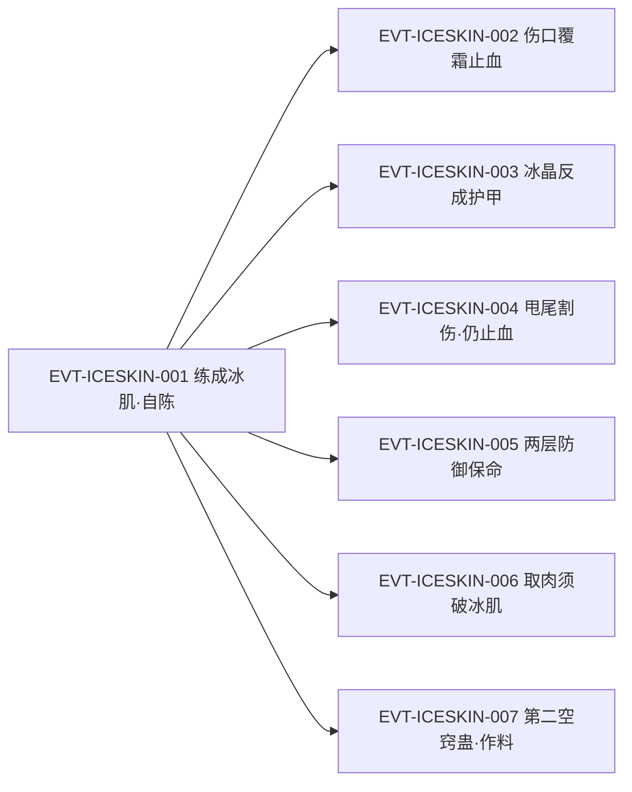

# 冰肌蛊

引文口径：`「」` 全书仅用于逐字原文引文；自造标签不用 `「」`（标有 `（概括）`／`（释义）`／`（合理推导）` 者为本批归纳，非原文）。

冰肌蛊是一只**三转的肌肤永久改造蛊**：用后「练成」一身冰肌，防御卓绝，且「这肌肤一经练成，就如同黑白豕蛊增添的力量，再无须真元支持。」（`E:V1-023222`）它同时带来免汗止血的功用，与玉骨蛊搭配时效果最佳，合称「冰肌玉骨」。

本页为 2026-09-28 A 线 20 页恢复批**新建页**。全书「冰肌蛊」命中 8 处（23066、36364、39242、39244、39728、40808、41458、70252）；因其效果常被写作「冰肌」而省略「蛊」字，本批另对「冰肌」全词扫描（38 处），把属于本实体机制的部分纳入，把修辞与同形词单列（见主题六）。所有引文回根原文 `source/蛊真人-clean.txt` 逐行复核，行号即 `E:V{段}-{6位行号}`；正文按“原著事实 → 合理推导 →《问真》设计意义”三层组织。

## 主题档案

### 一、名目、转数与入手：三转冰肌蛊，练成「冰肌」

#### 原著事实

- 转数与立场（白凝冰自陈）：「我已用三转冰肌蛊，练成了这身冰肌，防御卓绝！」`E:V1-023066`
- 改造的永久性：「如今她浑身的肌肤，被冰肌蛊的力量永久地改造成了“冰肌”。」`E:V2-039244`
- 使用者队列（白凝冰仍是北冥冰魄体时的冰水系蛊）：「冰刃蛊、冰锥蛊、水罩蛊、蓝鸟冰棺蛊、冰肌蛊、霜妖蛊」`E:V2-040808`
- 「用过」即已消耗的旁证：「倒不是她害怕疼痛，而是自己已经用过了冰肌蛊。」`E:V2-039242`
- 外观副作用：「她浑身冰肌，因此肌白如雪」`E:V2-040682`

#### 合理推导

- **依据**：`E:V2-039244`（永久改造肌肤）与玉骨蛊的对应表述（[玉骨蛊](bone-def-3-05-gu.md) 主题二）；**结论**：冰肌蛊与玉骨蛊是同一族“一次性改造身体、收益永久”的蛊，分工为改**肤**与改**骨**；**不确定性**：冰肌蛊自身是否也是「一次性消耗蛊」，原文**未明写**（对比玉骨蛊有明文 `E:V2-039732`），本页不代它断言。
- **依据**：8 处命中（`E:V1-023066`、`E:V2-036364`、`E:V2-039242`、`E:V2-039244`、`E:V2-039728`、`E:V2-040808`、`E:V2-041458`、`E:V2-070252`）；**结论**：冰肌蛊的来源、配方、价格原文均未交代；**不确定性**：白凝冰是从何处、以何代价得到该蛊，本页检得范围内无明文。

#### 《问真》设计意义

- 改造类蛊的获取若做成“剧情赠予”而非市场流通，可以解释为何这类蛊稀有却不贵——稀缺性来自来源，不来自价格。

### 二、防御机制：无须真元维持的常驻护甲

#### 原著事实

- 零维护定性：「这肌肤一经练成，就如同黑白豕蛊增添的力量，再无须真元支持。」`E:V1-023222`
- 支撑性命：「冰肌的防御力量，支撑着白凝冰的性命。」`E:V1-024132`
- 化解冰系攻击：「这层冰晶冻不死他，反而成了保护他的护甲，给他争取了恢复的时间。」`E:V1-023502`
- 亦有环境耐性：「自己的肌肤已经练成了冰肌，正耐冰霜寒冷。」`E:V1-023114`
- 硬到何种程度：「但因为冰肌的缘故，利刃像是砍在坚冰之上。」`E:V2-039976`
- 仍有上限：「饶是有冰肌护身，仍旧被割开一个豁大的伤口。」`E:V1-028766`；「他浑身浴血，冰肌的防御也几乎溃散」`E:V1-028810`
- 被强攻破防：「立时知道，单凭冰肌防护，扛不住这刀锋，连忙后撤。」`E:V2-048070`
- 环境可压制：「就算他有类似冰肌、铁骨、铜皮这类的防御，但在福地当中，这些都不好使。」`E:V2-064768`
- 机制 [已确认]：冰肌是练成后常驻、不需要真元维持的被动防御，同时提升对冰霜环境的耐性（`E:V1-023222`、`E:V1-023114`）。

#### 合理推导

- **依据**：`E:V1-023222`（无须真元支持）与白玉蛊的对应表述（[白玉蛊](white-jade-gu.md) 主题二：`E:V1-016070` 需持续灌真元）；**结论**：原文给出了两种并存的防御经济模型——**常驻型**（一次性代价、零维护、不可开关）与**主动型**（零前置、按次扣真元、可开关）；**不确定性**：冰肌在承受攻击时是否也扣真元，原文只写「再无须真元支持」，未展开。
- **具体数值 [待取证]**：冰肌的防御强度、承受上限、耐久是否会被永久消耗，原文均无数字。

#### 《问真》设计意义

- 常驻型与主动型并存是有价值的对比设计：常驻型省操作但不可切换且受环境压制（`E:V2-064768`），主动型可控但要付出实时成本。

### 三、免汗止血：功能收益与结构性代价

#### 原著事实

- 功能明文：「不仅有防御之能，还有免汗止血的功用。」`E:V2-039244`
- 止血实写：「一道伤痕显现出来，鲜血喷涌，但很快伤口出现一层浅浅的冰霜，将血止住。」`E:V1-023220`；「鲜血溅落在石头表面，但冰肌很快就替他止住血流。」`E:V1-028770`；「先前的刀伤，已经停止流血。这是冰肌的止血效能。」`E:V2-055100`
- 无冰肌的对照：「方源脸色苍白，短短片刻，他没有冰肌可以止血，因此失血较多。」`E:V2-040014`
- 互斥代价：「冰肌止汗止血，因此白凝冰今后就不能再用“血汗蛊”这类的蛊虫了。」`E:V2-041458`
- 妨碍自身取血：「白凝冰若用这骨刺蛊，首先骨刺就要破除冰肌，对她来讲很得不偿失。」`E:V2-039246`；实际处理：「不得已，白凝冰只好唤出锯齿金蜈，将自己的一块肉绞了下来。」`E:V2-039978`

#### 资源与代价（支付方／受益方／时点）

- **支付方**：使用者本人——使用冰肌蛊的一次性代价（蛊本体 + 改造过程的痛楚旁证 `E:V2-039242`）；**受益方**：同一位使用者——永久免汗止血与常驻防御（`E:V2-039244`）；**时点**：收益自改造完成后永久生效。
- **次级代价（机会成本）**：受益方同时被**锁定**——今后不能使用「血汗蛊」这类以汗／血为介质的蛊（`E:V2-041458`）；需要取血取肉时须先破开冰肌（`E:V2-039246`、`E:V2-039978`）；时点：与收益同时生效，且不可拆分。

#### 合理推导

- **依据**：`E:V2-039244`、`E:V2-039246`、`E:V2-039978`、`E:V2-041458`；**结论**：冰肌是“正面收益 + 结构性限制”的组合——免汗止血同时切断了一整类依赖排汗／出血的蛊；**不确定性**：原文只以「血汗蛊」为例，未穷举被排除的蛊名，也未写是否存在解除办法。

#### 《问真》设计意义

- 把「免汗止血」既做成生存增益又做成构筑排除项，可以让一次改造的选择产生长期后果，而不是纯数值叠加。

### 四、搭配：冰肌玉骨叠加、与主动防御可两层叠加

#### 原著事实

- 与玉骨蛊的最佳搭配：「更关键的是，玉骨蛊和冰肌蛊用来搭配使用，效果最佳。」`E:V2-039728`
- 叠加定性：「两者效果相互影响，有叠加之效用。」`E:V2-039730`
- 叠加后的战力评价：「而她用了玉骨蛊之后，原先的凡骨都成了玉骨。冰肌、玉骨，两者交相辉映，是一种上佳的使用搭配。」`E:V2-041460`
- 作为防护的代称：「她本身又有冰肌玉骨的防护，做不到一击必杀。」`E:V2-046874`；「饶是白凝冰有冰肌玉骨护体，也不敢撄其锋芒，只能暂退。」`E:V2-055048`
- 与主动防御蛊叠加：「狂针蜂蛊是三转蛊，数量多，又有洞穿的能力。」`E:V2-036364`；「不过幸好白凝冰曾经用过冰肌蛊。两层防御叠加起来，才保住了她的性命。」`E:V2-036364`
- 三管齐下：「再加上冰肌的防御，如此三管齐下，硬抗住大部分的攻击。」`E:V2-040088`
- 与霜妖蛊相得益彰：「自己的肌肤已经练成了冰肌，正耐冰霜寒冷。」`E:V1-023114`

#### 合理推导

- **依据**：`E:V2-036364`；**结论**：原文把冰肌与主动防御蛊（天蓬蛊）写成**可叠加的两层**，说明常驻层与主动层的收益是乘加而非互斥；**不确定性**：原文未给叠加上限，也未说是否所有常驻层都能与主动层叠。
- **依据**：`E:V2-039730`、`E:V2-039728`；**结论**：「冰肌玉骨」是两只独立改造蛊叠加的**结果**，不是一只蛊，也不是一条独立配方；**不确定性**：叠加后的具体效果量未给。

#### 《问真》设计意义

- “常驻层 + 主动层”的叠加结构，让防御构筑可以分层投资，而不必在“要么穿甲要么开盾”之间二选一。

### 五、作为炼蛊材料：第二空窍蛊秘方里的「冰肌化茎」

#### 原著事实

- 秘方原文（局部）：「腐土血粉，地中藏花。玉骨成瓣，冰肌化茎，花心金舍利。」`E:V2-070124`
- 步骤说明：「接下来，则是“玉骨成瓣，冰肌化茎，花心金舍利”，需要动用玉骨蛊，冰肌蛊，还有黄金舍利蛊。需要蛊师娴熟的炼蛊技艺。」`E:V2-070252`
- 秘方来源：地灵霸龟受请托告知「第二空窍蛊」的炼制秘方 `E:V2-070120`、`E:V2-070122`
- 体系规模：「炼这第二空窍蛊，需要上千个步骤。」`E:V2-070130`

#### 合理推导

- **依据**：`E:V2-070124`、`E:V2-070252`、`E:V2-070130`；**结论**：冰肌蛊在体系中除“改造使用者肌肤”外，还有第二种消费方式——高阶炼蛊产线的**中间材料**；**不确定性**：此处冰肌蛊是被消耗掉还是仅作引子，原文未明写；材料是否必须取自“已练成冰肌”的蛊师，也未交代。

#### 《问真》设计意义

- 同一只稀有蛊既是身体改造件又是高阶配方材料，天然形成资源竞争（用在自己身上，还是投进产线），不需要额外造材料。

### 六、同形异指：「冰肌玉骨」的两种用法

#### 原著事实

- 蛊效合成词（白凝冰）：「冰肌、玉骨，两者交相辉映，是一种上佳的使用搭配。」`E:V2-041460`
- 容貌套语（白凝冰亦用此语）：「她一身白袍，洗尽伪装，露出真容，瞳眸幽蓝如碧空，冰肌玉骨，脸颊微微泛红，带着刚刚沐浴而出的湿润之气。」`E:V2-049140`
- 容貌套语（星宿仙尊，与本蛊无关）：「她冰肌玉骨，肤白似雪，此时幽幽地瞧着方源」`E:V4-180242`
- 容貌套语（雪儿，雪民蛊仙，与本蛊无关）：「雪儿年轻貌美，身姿高挑，青春靓丽，更有蓝瞳蓝发，冰肌玉骨的异人风情。」`E:V5-274038`；「她蓝瞳蓝发，冰肌玉骨，带着异域风情。」`E:V5-326854`
- 计数：全书「冰肌玉骨」出现 8 处（49140、49488、46874、55048、180242、274038、326854、403982），其中只有 `E:V2-046874`、`E:V2-055048` 明确指白凝冰的战力防护，其余多为外貌描写。

#### 合理推导

- **依据**：`E:V2-049140`、`E:V4-180242`、`E:V5-274038`；**结论**：「冰肌玉骨」在原文中既是白凝冰蛊效的合成词，也是跨角色的容貌套语（星宿仙尊、雪儿均用）；**不确定性**：容貌描写的那几处是否隐含“也练过冰肌”，原文未给依据——本页**不把它们当作战力证据**。

#### 《问真》设计意义

- 词条侧应把“冰肌玉骨（蛊效）”与“冰肌玉骨（外貌套语）”分列，避免把描写性用词当成机制证据。

## 状态时间线

| 状态 ID | 阶段 | 状态 | 证据 |
|---|---|---|---|
| ST-ICESKIN-01 | 名目与转数 | 三转冰肌蛊；用后周身肌肤被永久改造成「冰肌」 | E:V1-023066、E:V2-039244 |
| ST-ICESKIN-02 | 常驻定性 | 肌肤一经练成，如同黑白豕蛊增添的力量，再无须真元支持 | E:V1-023222 |
| ST-ICESKIN-03 | 战场承伤 | 冰肌的防御力量支撑性命；挡下冰系攻击；被蜈蚣甩尾击中仍被割开大口 | E:V1-024132、E:V1-023502、E:V1-028766 |
| ST-ICESKIN-04 | 止血免汗 | 免汗止血：伤口覆霜止血；方源无冰肌则失血较多；取血取肉须先破冰肌 | E:V2-039244、E:V1-023220、E:V2-040014、E:V2-039978 |
| ST-ICESKIN-05 | 搭配加成 | 与玉骨蛊合成「冰肌玉骨」；与天蓬蛊两层防御叠加才保住性命 | E:V2-039728、E:V2-041460、E:V2-036364 |
| ST-ICESKIN-06 | 破防与环境压制 | 单凭冰肌扛不住强刀锋；在福地中这类防御被削弱至无 | E:V2-048070、E:V2-064768 |
| ST-ICESKIN-07 | 作料 | 第二空窍蛊秘方「冰肌化茎」需动用冰肌蛊 | E:V2-070124、E:V2-070252 |
| ST-ICESKIN-08 | 命名碰撞 | 「冰肌玉骨」亦用于星宿仙尊与雪儿的外貌描写，与蛊效合成词同形 | E:V4-180242、E:V5-274038 |

## 原著明确内容（本批取证窗口登记）

本批对「冰肌蛊」在根原文全书扫描：命中 8 处（段一 1 处、段二 7 处）；另对「冰肌」全词扫描：命中 38 处，含「冰肌玉骨」8 处与外貌描写若干。下表登记本批实际读取的窗口。

| 窗口 | 内容要点 | 用途 |
|---|---|---|
| 23058–23072 | 白凝冰自陈「三转冰肌蛊」、装作骨折诱敌；熊力被杀 | 主题一 |
| 23104–23116 | 霜妖蛊为三转、使用过度反伤自身；冰肌耐冰霜、与霜妖蛊相得益彰 | 主题二、四 |
| 23218–23226 | 被削中胳膊；伤口覆霜止血；「再无须真元支持」 | 主题二、三 |
| 23502 | 青书判断：冰晶冻不死，冰肌反成护甲 | 主题二 |
| 24128–24150 | 冰肌的防御力量支撑白凝冰性命；单一青藤不足以杀她 | 主题二 |
| 28766–28772、28810 | 被蜈蚣甩尾割开大口、冰肌止血；浑身浴血时防御几近溃散 | 主题二、三 |
| 36340–36368 | 狂针蜂蛊洞穿克制天蓬蛊；冰肌＋天蓬蛊两层叠加保住性命 | 主题四 |
| 39236–39250 | 骨刺蛊需先破冰肌；永久改造、免汗止血 | 主题一、三 |
| 39726–39734 | 玉骨蛊与冰肌蛊搭配最佳；「冰肌玉骨」叠加 | 主题四 |
| 39972–39980 | 取肉现场：利刃如砍坚冰，改用锯齿金蜈 | 主题三 |
| 40014、40086–40090 | 方源无冰肌而失血较多；冰肌＋天蓬蛊＋铁刺荆棘蛊三管齐下 | 主题三、四 |
| 40680–40684 | 浑身冰肌、肌白如雪，伪装时须故意抹黑 | 主题一 |
| 40804–40812 | 冰水系蛊搭配清单，含冰肌蛊 | 主题一 |
| 41446–41464 | 用蛊考究；冰肌止汗止血→不能再用血汗蛊；冰肌玉骨为白凝冰上佳搭配 | 主题三、四 |
| 46874、48066–48072 | 「冰肌玉骨的防护，做不到一击必杀」；单凭冰肌扛不住强刀锋 | 主题二、四 |
| 49136–49142、55044–55052、55100 | 洗尽伪装露真容（冰肌玉骨）；强敌当前只能暂退；止血效能 | 主题二、三、六 |
| 64768 | 福地当中冰肌／铁骨／铜皮这类防御被削弱至无 | 主题二 |
| 70118–70130、70246–70258 | 第二空窍蛊秘方原文与规模；「冰肌化茎」需动用冰肌蛊 | 主题五 |
| 180236–180246 | 星宿仙尊「冰肌玉骨」外貌描写（非本蛊效力） | 主题六 |
| 274034–274042、326854、403978–403986 | 雪儿「冰肌玉骨」外貌描写（非本蛊效力） | 主题六 |

## 事件链

| 事件 ID | 事件 | 参与者 | 证据 | 因果 |
|---|---|---|---|---|
| EVT-ICESKIN-001 | 白凝冰自陈已用三转冰肌蛊练成冰肌，并据此装作右臂骨折诱敌 | 白凝冰、熊力、方源 | E:V1-023066 | causes ST-ICESKIN-01 |
| EVT-ICESKIN-002 | 被削中胳膊：伤口很快覆上一层浅浅冰霜将血止住 | 白凝冰 | E:V1-023220 | evidences ST-ICESKIN-04 |
| EVT-ICESKIN-003 | 青书以冰晶攻击，冰肌反成护甲，为白凝冰争取恢复时间 | 古月青书、白凝冰 | E:V1-023502、E:V1-024132 | evidences ST-ICESKIN-03 |
| EVT-ICESKIN-004 | 被蜈蚣甩尾击中胸膛：冰肌被割开大口但仍止住血流 | 白凝冰 | E:V1-028766、E:V1-028770 | evidences ST-ICESKIN-03 |
| EVT-ICESKIN-005 | 遭狂针蜂群洞穿天蓬蛊，冰肌与天蓬蛊两层防御叠加保住性命 | 白凝冰、狂针蜂蛊 | E:V2-036364 | evidences ST-ICESKIN-05 |
| EVT-ICESKIN-006 | 白凝冰切前臂取肉：因冰肌护体利刃如砍坚冰，改用锯齿金蜈绞肉 | 白凝冰、方源 | E:V2-039976、E:V2-039978 | evidences ST-ICESKIN-04 |
| EVT-ICESKIN-007 | 方源炼制第二空窍蛊，「冰肌化茎」一步动用冰肌蛊 | 方源 | E:V2-070124、E:V2-070252 | evidences ST-ICESKIN-07 |

事件口径：本页沿用分配簇号 `ST-ICESKIN-*`；分配表只给出 `ST-` 形式，事件 ID 同簇沿用 `EVT-ICESKIN-*`，未占用他人前缀。事件节点 7 个，达到“≥3 节点应配图”的阈值，故附 mermaid。

## 资料整理

本页为**新建页**，没有旧版；本批来源只有根原文，没有 `notes:`／`memory:` 层转述进入本页事实区。相关派生记录的处置登记如下（**本段内容不得当作原著事实**）：

- `roster-3.md` 第 167 行把 `water_atk_3_06_gu`（冰肌蛊）记为转数 3，锚点 `E:V1-023066`。本页复核：三转有逐字明文（`E:V1-023066`），与 roster-3 一致，无需修订。
- `game/data/gu_lore.json` 的 `water_atk_3_06_gu` 为 `status=match`、`game_rank=3`、`lore_rank=3`、`anchor=E:V1-023066`，与本页一致。`game/**` 只读，本批不改动。
- **id 语义与机制的错位提示（只登记）**：实体 id 前缀为 `water_atk_*`（游戏侧按“水系·攻击”归类），而原文给出的机制是**防御 + 免汗止血**（`E:V2-039244`）。本页不改 id、不改 `game/**`，仅登记这一归类张力，供后续桥接层处理。
- **同名子串提示**：「冰肌」在原文中亦作容貌套语的一部分（`E:V4-180242`、`E:V5-274038`），不属于本实体机制；本页已在主题六分列。
- `game/docs/lore/canon-index.md` 无「冰肌蛊」条目，本页因此不声明 `canon-index` 字段、不新建 CAN ID。

## 分析与解读

以下为本批归纳（分析，非原著事实）：

1. **冰肌蛊是“零维护防御”的原文样本**。同批的 [白玉蛊](white-jade-gu.md) 每时每刻都在烧真元（`E:V1-016070`），冰肌则明写「再无须真元支持」（`E:V1-023222`）。两者并置，等于原文给了两套防御经济模型：一次性买断 vs 按次付费。
2. **它的收益与限制是同一件事的两面**。免汗止血既是生存收益（`E:V1-028770`），也排除了「血汗蛊」这类介质蛊（`E:V2-041458`），并要求取血取肉先破冰肌（`E:V2-039978`）。任何只写“+防御 +回血”的蒸馏都会丢掉这一层。
3. **它是「层」而不是「替代品」**。`E:V2-036364` 明确写「两层防御叠加起来」，说明冰肌与主动防御蛊可以同时生效；这比“换更强的甲”更有构筑空间。
4. **它的来源是空白**。8 处命中全是使用与效果，没有入手、配方、价格；本页因此把这一整块写进《待核对》，而不是拿游戏数据补齐。
5. **「冰肌玉骨」是同形词陷阱**。同一四个字既指白凝冰的蛊效（`E:V2-039730`），也用于星宿仙尊（`E:V4-180242`）与雪儿（`E:V5-274038`）的外貌；检索时若不区分，会把人物描写误读成机制证据。

## 待核对

- `[原著未明确]` **入手途径、配方与价格**：全书 8 处命中均未交代冰肌蛊从何而来、以何代价得到、能否合炼。
- `[原著未明确]` **是否一次性消耗蛊**：`E:V2-039242` 的「已经用过了冰肌蛊」暗示用过即消耗，但原文没有像玉骨蛊那样明写「一次性的消耗蛊」；本页不作断言。
- `[原著未明确]` **改造过程的代价**：`E:V2-039242` 只提「害怕疼痛」关联到冰肌蛊，未写痛楚程度、时长或失败后果。
- `[原著未明确]` **防御数值与耐久**：柔韧／坚硬程度只有比喻（`E:V2-039976`），无强度、上限或是否会永久损耗。
- `[原著未明确]` **被排除的蛊名清单**：`E:V2-041458` 只举「血汗蛊」这类，未穷举，也未写是否有解除或覆盖办法。
- `[待取证]` **冰肌在第二空窍蛊产线中的角色**：`E:V2-070252` 只说「需要动用」，未写是否被消耗、材料是否须取自练成冰肌者。
- `[存在冲突]` **归类张力（游戏桥接层 × 原著）**：实体 id 前缀为 `water_atk_*`（水系·攻击），而原文机制是防御与免汗止血（`E:V2-039244`）；**口径A（游戏）**：按水系攻击类目归档；**口径B（原文）**：防御型肌肤改造蛊。**当前状态**：本页采用口径B、不改 id 与 `game/**`，冲突登记待上游裁定。
- `[现名缺口]` **CAN ID**：`canon-index.md` 无冰肌蛊条目；本页只登记缺口，不新建 CAN ID。

## 模板扩展建议（只登记，不改核心模板）

1. **需要“常驻 / 主动”二分字段**。冰肌与白玉蛊的差别不在强度而在**维护模型**；模板若只有「防御力」一个位，这条差异无处安放（同批 [白玉蛊](white-jade-gu.md) 亦提同一问题）。
2. **需要“同形词 / 命名碰撞”登记位**。「冰肌玉骨」既是蛊效也是外貌套语（`E:V2-039730`、`E:V5-274038`），检索级混淆风险高，建议在模板层给出固定的碰撞登记位置。
3. **需要“id 归类与机制错位”提示位**。id 前缀 `water_atk_*` 与防御机制不符（`E:V2-039244`），这是桥接层问题，但实体页应有位置声明**本页按原文机制描述，不追认 id 归类**。

## 关联页面

[玉骨蛊](bone-def-3-05-gu.md)、[白玉蛊](white-jade-gu.md)、[石窍蛊](earth-def-3-01-gu.md)、[玉皮蛊](jade-skin-gu.md)、[白豕蛊与肉身增力](white-boar-strength-gu.md)、[骨蛊](bone-atk-1-08-gu.md)、[春秋蝉](spring-autumn-cicada-gu.md)、[水道](../world/water-path.md)、[力道](../world/strength-path.md)、[骨道](../world/bone-path.md)、[炼蛊与杀招链](../world/gu-refine-killer-chain.md)、[蛊的饲养与炼化](../world/gu-care-and-refinement.md)、[空窍与资质](../world/aptitude-and-aperture.md)、[真元](../world/primeval-essence.md)、[修炼体系](../world/cultivation-system.md)、[炼蛊](../rules/refinement.md)、[杀招](../rules/killer-moves.md)、[蛊虫关系](gu-relations.md)、[蛊虫总表三期](roster-3.md)、[方源](../characters/fang-yuan.md)
