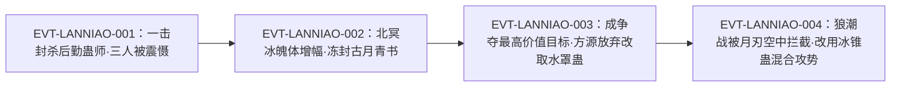

# 蓝鸟冰棺蛊

一只从齿关里飞出来的冰蓝色小鸟：外形「类似鸽子」，一经发出**自动锁敌**，撞上目标便自爆、放出寒气，把对方冻封进一座巨大冰块里——它的击杀方式不是砍杀而是**封存**，「冰块中封印着那位蛊师，他的脸上还保留着死之前的惊惶和恐惧」。全书正文把它记为**三转**，持有者为白凝冰，是他晋升三转后仅有的两只三转蛊虫之一。

本页为 2026-09-28 第二批 A 线恢复批**新建页**，实体 id 复用 `roster-3.md` 的 `water_atk_3_07_gu`。全书出现「蓝鸟冰棺蛊」的行有 9 行／字面命中 9 次；本页对它做了命名预筛（「蓝鸟」「冰棺」「冰棺蛊」三条子串路径），分类账见《主题档案·五》。所有引文回根原文 `source/蛊真人-clean.txt`，行号即 `E:V{段}-{6位行号}`。

**登记锚性质（必读）**：登记锚 `E:V1-022912` 经回原文打印，是**对话正文行**（「“三转蓝鸟冰棺蛊？”」），不是章节题名行；它同时给出转数明文，是本页转数判定的第一证据。另需注意：全书中「冰棺蛊」的每一次出现都只是「蓝鸟冰棺蛊」的子串，原文**不存在**独立以「冰棺蛊」为名的实体（详见主题五）。

## 主题档案

### 一、释放与形态：从齿间钻出的冰蓝小鸟，鸽形，一发即锁敌

#### 原著事实

- 出体方式：「一只冰蓝色的小鸟，从他洁白的齿关探出了脑袋。」`E:V1-022906`；「它从白凝冰的嘴巴里钻出来，一双宽厚矫健的羽翼用力一振，就向熊力飞撞过去。」`E:V1-022908`
- 外形与观感：「蓝色的冰鸟十分可爱。外形类似鸽子。但是熊力等人看到它，无不骤然失色。」`E:V1-022910`
- 自动锁敌（与月刃对照）：「熊力等人慌忙四处躲闪，但这只蓝色冰鸟不同于月刃，一经发出，便能自动锁敌。」`E:V1-022918`
- 第二次施放的动作：「白凝冰看准战机，陡然张开嘴巴，从牙齿间飞出一只冰蓝飞鸟。」`E:V1-023888`
- 连吐多发：「白凝冰拉开距离，张口连吐。」`E:V1-028816`；「一只只飞鸟，扑棱着翅膀，向方源飞来。」`E:V1-028818`

#### 合理推导

- **依据：**`E:V1-022906`＋`E:V1-024246`（「现今，寄居在白凝冰的咽喉处。」）；**结论：**本实体的寄居位置在**咽喉／齿关**，施放路径就是“张口—飞鸟出体”，因此它的形态是可出体的**兽形傀儡鸟**而非附着型增益；**不确定性：**原文未写这只冰鸟是否有自主意识、是否可在离体后回收，也未写被击毁（自爆）后蛊本身是否损毁。
- **依据：**`E:V1-022918` 明写「不同于月刃，一经发出，便能自动锁敌」；**结论：****自动锁敌**是本实体被原文点名与月刃类飞行攻击区隔开的核心特性，不是叙述性修辞；**不确定性：**原文未写锁敌是否有距离上限、能否被闪避或假目标引偏——`E:V1-022918` 只说熊力等人「慌忙四处躲闪」并未摆脱。

#### 《问真》设计意义

- 把“必中”写成蛊的固有能力（而不是玩家技能），会让它的强度与持有者的操作水平脱钩：它吃的是**命中率设计**而不是操作空间。做运行时数值时，这类特性的强度必须靠代价（主题四）而不是靠命中率来平衡。

### 二、命中与封印：撞击自爆 → 寒气四溢 → 巨冰封存

#### 原著事实

- 撞击与自爆：「它撞到熊力小组中的那位后勤蛊师，一下子爆炸开来。」`E:V1-022922`
- 视觉与寒气：「汹涌的寒气四溢，刺眼的蓝光照的战场一亮。」`E:V1-022924`
- 结果形态：「下一秒，蓝芒陡然消散，露出一座半透明的，带着一丝水蓝色的巨大冰块。」`E:V1-022926`
- 击杀判定：「冰块中封印着那位蛊师，他的脸上还保留着死之前的惊惶和恐惧，但已经彻底失去了生命的气息。」`E:V1-022928`
- 第二次命中的结果：「一声炸响之后，古月青书被冻在一块大如房屋的冰晶当中。」`E:V1-023896`
- 被拦截时的行为：「方源毫不慌乱，神色不变，左手翻腕，血色月刃一一拦截这些冰鸟，引得它们在空中自爆。」`E:V1-028820`

#### 合理推导

- **依据：**`E:V1-022922`＋`E:V1-022926`＋`E:V1-022928`；**结论：**本实体的击杀是**一次性封印式**的——自爆只是放出寒气的手段，真正的致死机制是“冻封成冰”，因此它的战果形态是**冰雕（尸骸留形）**而不是尸体；这一点与同书的冰锥／冰刃类穿透杀伤是两种不同的效果类别；**不确定性：**原文未写冰块是否可被外力破除、被封印者是否有可能被救出。
- **依据：**`E:V1-028820`；**结论：**本实体在**空中被拦截**时会被动自爆，即拦截等于提前引爆；**不确定性：**原文未写空中自爆是否仍有寒气与封印效果（`E:V1-028820` 只说「引得它们在空中自爆」，未记战果），也未写自爆后本体的损耗。

#### 《问真》设计意义

- “封印型击杀”在玩法上天然强于“伤害型”：它绕开血量、直接改变场上单位的状态。要让它在 runtime 里不失控，最自然的上限就是“每次催动一只、且可以被空中拦截提前引爆”——**这两条都是原文自带的**，不需要发明。

### 三、增幅与体系：北冥冰魄体让鸽形变鹰形，冰水一系成套搭配

#### 原著事实

- 增幅实例：「飞鸟咯咯的鸣叫一声，身形如鸽。但在北冥冰魄体的增幅之下，它飞在空中渐渐变成雄鹰般大小，飞旋一阵子后，悍然扑向古月青书。」`E:V1-023890`
- 体系归属（列举）：「就比方白凝冰还是北冥冰魄体的时候，冰刃蛊、冰锥蛊、水罩蛊、蓝鸟冰棺蛊、冰肌蛊、霜妖蛊……」`E:V2-040808`；「都是冰水一系的蛊虫，相互搭配使用，极其顺手，相得益彰。」`E:V2-040810`
- 与冰锥蛊的联用：「白凝冰见此不成，又增用冰锥蛊。」`E:V1-028824`；「一根根冰锥飞射，混合蓝鸟，形成密集攻势。」`E:V1-028826`

#### 合理推导

- **依据：**`E:V1-023890`；**结论：**本实体的**体积／威力可被体质增幅**（北冥冰魄体把鸽形放大到鹰形），因此它的基础形态不是固定强度，而是随持有者体质浮动；**不确定性：**原文只给“鸽→鹰”这一处形态变化，未给增幅的比例、也未说明增幅只改体积还是同时改寒气威力。
- **依据：**`E:V2-040808`＋`E:V2-040810`；**结论：**原文把本实体与冰刃蛊、冰锥蛊、水罩蛊、**冰肌蛊**、霜妖蛊并列为「冰水一系」，这是**家族／流派归属的明文列举**，因此主题三的体系位是原文给的，不是外推；**不确定性：**原文只写「相互搭配使用，极其顺手，相得益彰」，未给任何组合技的具体增益或联动数值。

#### 《问真》设计意义

- “同一词条在不同体质下形态不同”是一条现成的**载体适配规则**：蛊的形态由持有者体质决定，这让同一只蛊在不同角色手里有不同的体型与观感，是低成本高感知的差异化手段。

### 四、代价与限制：二转真元催三转蛊，剧烈消耗且威力打折

#### 原著事实

- 越级催动的代价：「白凝冰并不是没有三转蛊虫，只是一经使用，空窍中的二转真元就会剧烈消耗，同时也发挥不出三转蛊虫应有的威力。更容易在接下来的一段时间内，被敌人趁机大举进攻。」`E:V1-022930`
- 真元恢复后才可用：「白凝冰空窍中真元已经恢复，至少蓝鸟冰棺蛊是可以使用的。」`E:V1-024158`
- 与其它蛊儿的价值排序：「除了霜妖蛊之外，价值第二高的是蓝鸟冰棺蛊，三转蛊虫。现今，寄居在白凝冰的咽喉处。」`E:V1-024246`
- 与取蛊手段的等级对照：「若是能抓来蓝鸟冰棺蛊，就是最佳的情形。但是强取蛊毕竟只是二转，想要随蛊师的心愿，那它还有力未逮。」`E:V1-024248`

#### 合理推导

- **依据：**`E:V1-022930`；**结论：**本实体的威能**绑定在真元等级**上——持有者若只有二转真元，催动三转本实体便同时发生“剧烈消耗”与“威力打折”两件事，并且会留下被趁机进攻的窗口；**不确定性：**原文未给消耗量、威力折扣比例与「接下来的一段时间」的具体长度。
- **代价／收益三方**：**依据：** `E:V1-022930`、`E:V1-022932`；**支付方**＝使用者本人（真元剧烈消耗＋后续一段时间的防守空窗）；**受益方**＝使用者本人（换来一次封杀强敌的效果，`E:V1-022932` 记「已经被这记蓝鸟冰棺蛊吓住。」即当场逼退三人）；**支付时点**＝一经使用即扣，且惩罚跨时段（后续一段时间仍受威胁）；**结论：** 代价由使用者本人自付，收益是一次性封杀强敌，支付时点与受益时点分离；**不确定性：** 原文未给消耗量与“接下来的一段时间”的具体时长，本批尚未找到。
- **依据：**`E:V1-024248`；**结论：**夺蛊手段本身有等级上限（强取蛊只是二转），拿不下三转的本实体，所以本实体在原文里保持了**独占性**——`E:V1-024250` 记方源最终只拿到水罩蛊；**不确定性：**原文未写强取蛊转数之外的限制条件（如是否需要贴近、是否受寄居位置影响）。

#### 《问真》设计意义

- “越级使用”这条惩罚同时给三样东西：消耗、威力折扣、防守空窗。它让同一只蛊在高等级持有者手里才是完全体，天然形成了“蛊的转数”与“蛊师的转数”两条独立轴——这是可以直接落成数值的设计，而且不需要新增设定。

### 五、命名分类账与身份边界：不存在独立的「冰棺蛊」

#### 原著事实

- 完整蛊名「蓝鸟冰棺蛊」的 9 处命中（9 行／9 次）：`E:V1-022912`、`E:V1-022932`、`E:V1-023656`、`E:V1-023886`、`E:V1-024158`、`E:V1-024246`、`E:V1-024248`、`E:V1-028814`、`E:V2-040808`
- 「冰棺」词根的另外 9 处命中（实体义，指真冰棺／封印冰棺，**非蛊名**）：「熊林被白凝冰的冰锥洞穿全身，古月赤城被冻成了冰雕。冰棺中，他还保留着死前极力躲闪的动作」`E:V1-032692`；其余为 `E:V5-261936`、`E:V5-261938`、`E:V5-261954`、`E:V5-261956`、`E:V5-261996`、`E:V5-262032`、`E:V5-315250`、`E:V6-372408`
- 「蓝鸟」词根的 1 处额外命中（指该蛊放出的冰鸟）：「一根根冰锥飞射，混合蓝鸟，形成密集攻势。」`E:V1-028826`
- 同族对照（同水道不同实体）：「我已用三转冰肌蛊，练成了这身冰肌，防御卓绝！」`E:V1-023066`

#### 合理推导

- **依据：**全书 9 次「冰棺蛊」全部被包含在「蓝鸟冰棺蛊」之内（逐行核对：`E:V1-022912`、`E:V1-022932`、`E:V1-023656`、`E:V1-023886`、`E:V1-024158`、`E:V1-024246`、`E:V1-024248`、`E:V1-028814`、`E:V2-040808`）；**结论：**原文**不存在**独立命名的近名实体「冰棺蛊」——若其它分片册上有该名，它只能是本实体的子串误切，不得据以另建页面或写入本页 `aliases`；**不确定性：**本判定基于全书逐行字符串扫描（口径：含重复块、未去重），若后续版本原文增删行需重扫。
- **依据：**`E:V2-040808` 把蓝鸟冰棺蛊与**冰肌蛊**写在同一列举句中；**结论：**冰肌蛊是**另一种实体**（`E:V1-023066` 明文为三转、机制是「练成了这身冰肌，防御卓绝」），与本实体的封印击杀完全不是一回事，两者不得合并；**不确定性：**原文未写这两只蛊能否同时持有或联动（`E:V2-040810` 只给体系级描述）。
- **分类账（枚举集合 == 实测集合）**：「冰棺」词根全书 18 行／18 次 = 完整蛊名 9 行／9 次（上行已逐一枚举）＋实体义「冰棺」9 行／9 次（上行已逐一枚举）；「蓝鸟」词根全书 10 行／10 次 = 完整蛊名 9 行／9 次＋`E:V1-028826` 1 行／1 次。**依据：** 本机 `py -3` 对 `source/蛊真人-clean.txt` 的全文逐行字符串计数；**结论：**三个计数集合两两相加与实测相等，无溢出、无漏项；**不确定性：**计数含重复块、未去重，属字面命中而非分词结果。

#### 《问真》设计意义

- 近名子串是这类页面最容易被污染的地方：本页把「冰棺」18 行的去向逐行交代清楚，运行时若按名称做模糊匹配，就能据此把「冰棺」这类实体义用法排除在实体触发之外，而不是让它误触发一只封印蛊。

## 状态时间线

| 状态 ID | 阶段 | 状态 | 证据 |
|---|---|---|---|
| ST-LANNIAO-01 | 首现与转数 | 白凝冰张口放出冰蓝小鸟，熊力当场认名并报出三转 | E:V1-022906、E:V1-022908、E:V1-022912 |
| ST-LANNIAO-02 | 击杀在案 | 自动锁敌；撞击自爆；寒气四溢冻成巨大冰块；目标被封存致死 | E:V1-022918、E:V1-022922、E:V1-022926、E:V1-022928 |
| ST-LANNIAO-03 | 越级代价 | 二转真元催三转蛊，剧烈消耗且威力打折，并留下被趁机进攻的窗口 | E:V1-022930 |
| ST-LANNIAO-04 | 震慑与休整 | 三人被吓住；真元恢复后本实体重新可用 | E:V1-022932、E:V1-024158 |
| ST-LANNIAO-05 | 存量与价值 | 白凝冰三转蛊虫仅两只，霜妖蛊牺牲后本实体为唯一；价值全蛊第二，寄居咽喉 | E:V1-023656、E:V1-024246 |
| ST-LANNIAO-06 | 增幅命中 | 北冥冰魄体增幅，鸽形变鹰形，冻封古月青书 | E:V1-023890、E:V1-023896 |
| ST-LANNIAO-07 | 夺蛊失败 | 强取蛊仅二转，拿不下三转本实体；方源最终只取得水罩蛊 | E:V1-024248、E:V1-024250 |
| ST-LANNIAO-08 | 狼潮连吐 | 拉开距离张口连吐多发；被血色月刃空中拦截自爆；增用冰锥蛊混合攻势 | E:V1-028814、E:V1-028816、E:V1-028820、E:V1-028826 |
| ST-LANNIAO-09 | 体系定线 | 被明文列入「冰水一系」，与冰刃蛊、冰锥蛊、水罩蛊、冰肌蛊、霜妖蛊同列 | E:V2-040808、E:V2-040810 |

## 原著明确内容（本批取证窗口登记）

本批对「蓝鸟冰棺蛊」在根原文全书扫描：完整蛊名 9 行／9 次；「冰棺」词根 18 行／18 次；「蓝鸟」词根 10 行／10 次。下表登记本批实际读取的窗口（含单行抽读）。

| 窗口 | 内容要点 | 用途 |
|---|---|---|
| 22890–22940 | 白凝冰齿关放出冰蓝小鸟（22906）；熊力认名报三转（锚点 22912）；自动锁敌；撞爆、寒气、巨冰封存致死；越级催动的三重代价 | 主题一、二、四 |
| 23060–23070 | 冰肌蛊（三转、冰肌防御卓绝）——同水道近名对照 | 主题五 |
| 23640–23680 | 白凝冰晋升三转未久，三转蛊虫仅两只；霜妖蛊牺牲后本实体为唯一 | 主题五、状态线 |
| 23870–23900 | 小标题点名本实体；鸽形被北冥冰魄体增幅为鹰形；冻封古月青书 | 主题一、三 |
| 24140–24270 | 真元恢复后可用；价值全蛊第二、寄居咽喉；强取蛊二转拿不下；方源最终取水罩蛊 | 主题四、五 |
| 28800–28840 | 狼潮战：小标题点名；张口连吐多发；血色月刃拦截致空中自爆；增用冰锥蛊混合蓝鸟 | 主题二、三 |
| 32680–32700 | 实体义「冰棺」（古月赤城被冻成冰雕后置于冰棺）——非蛊名子串 | 主题五 |
| 40790–40820 | 「冰水一系」六蛊列举与体系判词 | 主题三 |

## 事件链

| 事件 ID | 事件 | 参与者 | 证据 | 因果 |
|---|---|---|---|---|
| EVT-LANNIAO-001 | 白凝冰以本实体一击封杀熊力小组后勤蛊师，三人被震慑，战斗转入消耗 | 白凝冰、熊力、后勤蛊师 | E:V1-022912、E:V1-022926、E:V1-022932 | evidences ST-LANNIAO-01、ST-LANNIAO-02 |
| EVT-LANNIAO-002 | 白凝冰在北冥冰魄体增幅下以本实体冻封古月青书 | 白凝冰、古月青书 | E:V1-023886、E:V1-023890、E:V1-023896 | evidences ST-LANNIAO-06 |
| EVT-LANNIAO-003 | 三大家族争夺战中本实体成最高价值目标，方源因强取蛊仅二转而放弃，改取水罩蛊 | 方源、白凝冰 | E:V1-024246、E:V1-024248、E:V1-024250 | evidences ST-LANNIAO-07 |
| EVT-LANNIAO-004 | 狼潮战中方源以血色月刃空中拦截本实体，白凝冰改用冰锥蛊混合蓝鸟形成密集攻势 | 方源、白凝冰 | E:V1-028814、E:V1-028820、E:V1-028826 | evidences ST-LANNIAO-08 |

事件口径：本页沿用实体簇号 `EVT-LANNIAO-*`。事件节点 4 个，已达“≥3 节点配 mermaid”的阈值，故上图按因果链绘制。

## 资料整理

本页为**新建页**，没有旧版；本批来源只有根原文，没有 `notes:`／`memory:` 层转述进入本页事实区。相关派生记录的处置登记如下（本段内容不得当作原著事实）：

- `roster-3.md` 的 `一致` 节 `water_atk_3_07_gu` 条目登记：`water_atk_3_07_gu | 蓝鸟冰棺蛊 | 3 | 3 | E:V1-022912`，状态为**一致**。本页复核：`E:V1-022912` 是对话正文行，含「三转」明文；`E:V1-024246` 再次明文「三转蛊虫」，两处一致。
- `game/data/gu_lore.json` 的 `water_atk_3_07_gu` 为 `game_rank=3`、`status=match`、`lore_rank=3`、`anchor=E:V1-022912`——投影与原文一致。`game/**` 只读，不在本批改动范围。
- **别名口径**：本页 `aliases` 为空。原文没有出现本实体的任何别称；`roster-3.md` 的另一实体 `冰肌蛊`（其页面为 `water-atk-3-06-gu.md`）与本实体同在 `E:V2-040808` 的列举句中但机制不同（前者见 `E:V1-023066`「练成了这身冰肌，防御卓绝」），属**近名同族**，不进 `aliases`。
- **近名排查结论**：全书不存在独立命名的「冰棺蛊」（9 次「冰棺蛊」全部是「蓝鸟冰棺蛊」的子串）；「冰棺」另有 9 处实体义用法（真冰棺／封印冰棺）。逐行清单见主题五分类账。
- **穷举口径**：本页的 `9 行／9 次` 等均为**含重复块、未去重**的字面命中计数（纯字符串计数，非分词）。
- **未采信的分片表推断**：分片表对本实体的“须预筛『蓝鸟』『冰棺』子串碰撞”提示经复核**成立并已执行**；但它未提示「冰棺蛊」并不独立存在，本页补登记该结论。

## 分析与解读

1. **本实体的强度分布很特殊**：命中率被固化成「自动锁敌」（`E:V1-022918`），效果是**状态改变**而非伤害（`E:V1-022928`、`E:V1-023896`）。两件事加起来意味着它的上限不取决于使用者操作，而取决于使用者敢不敢用——这正是 `E:V1-022930` 那段代价存在的理由。
2. **代价是三重而不是一重**：真元剧烈消耗、威力打折、后续防守空窗，三者同句给出（`E:V1-022930`）。任何只抄“耗真元”的写法都会把它写成纯收益蛊。
3. **“鸽→鹰”是全部命中里唯一的形态变化证据**：`E:V1-023890` 把增幅归因于北冥冰魄体。冰魄体一失，本实体的形态证据链就断了，因此本页不把“鹰形”写成固有能力。
4. **它在原文里的身份是“消耗性王牌”**：`E:V1-024246` 记价值第二且寄居咽喉，`E:V1-023656` 记它一度是白凝冰**唯一**可用的三转蛊。这一段把“高价值”与“不可替代”写在同一处，是理解白凝冰战法的关键。
5. **体系位是明文而非外推**：`E:V2-040808`、`E:V2-040810` 给出的六蛊列举是本书少见的成体系描述，本页因此可以确定它与冰肌蛊、霜妖蛊等同属冰水一系，而不必猜。
6. **狼潮战暴露了它的一个硬上限**：`E:V1-028820` 的空中拦截说明多发并不等于必中——一旦对手能批量拦截，本实体就只能靠与冰锥蛊联用来维持压力（`E:V1-028824`、`E:V1-028826`）。

## 待核对

- `[原著未明确]` **食料、寿命、外形细节**：本批读到的 9 处命中均未提及食料与寿命；外形只有「冰蓝色的小鸟」「外形类似鸽子」两处描述，与鸽／鹰形变化的关系只能登记为增幅现象，不能写成固定形态。
- `[原著未明确]` **空中自爆的战果**：`E:V1-028820` 只写「引得它们在空中自爆」，未写自爆是否仍放出寒气、是否仍能封印。不得据地面命中（`E:V1-022926`、`E:V1-023896`）外推。
- `[原著未明确]` **冰块的可破坏性**：被封印者能否被救出、冰块能否被外力破除，原文未写。
- `[原著未明确]` **自动锁敌的边界**：锁敌距离上限、能否被假目标引偏、能否被闪避，原文均未写；`E:V1-022918` 只说熊力等人躲闪未能摆脱。
- `[原著未明确]` **增幅的量化**：`E:V1-023890` 只有「身形如鸽」到「雄鹰般大小」这一处形态对照，未给增幅比例，也未说明是否同时改寒气威力。
- `[待取证]` **段五、段六的 9 处实体义「冰棺」的逐条语境**：本批只对其中的 `E:V1-032692` 逐字回读并确认是实体义；`E:V5-261936`、`E:V5-261938`、`E:V5-261954`、`E:V5-261956`、`E:V5-261996`、`E:V5-262032`、`E:V5-315250`、`E:V6-372408` 八处已确认不含本蛊名（均不含「蓝鸟冰棺蛊」），但未逐条解读语境。
- `[待取证]` **本实体是否有凡蛊／仙蛊分阶**：本批读到的全部命中都是三转（`E:V1-022912`、`E:V1-024246`），未见更高级别形态；是否仅存在三转一级“尚未找到”证据，不得写成“原著没有”。
- `[不裁定]` **登记锚性质**：分片表对本实体的登记锚标注无误（`E:V1-022912` 是含三转明文的对话正文行），本页沿用；仅登记其为正文行而非题名行。
- 2026-09-28：本页按 id 引用 roster-3（id 为稳定键），不引其行号，避免其它分片落地造成行号位移。

## 模板扩展建议（只登记，不改核心模板）

1. **“近名异物”需要一个固定落点**。本页花了整节交代「冰棺蛊」并不独立存在、「冰肌蛊」是同族另一实体。现有骨架里这类内容只能塞进正文与《资料整理》，建议将来在骨架增设“近名排查”位（只登记，本批不改）。
2. **“同名子串”与“实体义同形词”应分开记**。「冰棺」在本实体名下同时存在两种子串用法（蛊名内嵌、真冰棺），两者都不进 aliases；建议在命名规范里补一条：实体义同形词必须逐行交代去向。
3. **寄居位置值得成为字段**。本实体的寄居位置（咽喉／齿关）与施放路径强相关，且在原文出现两次（`E:V1-022906`、`E:V1-024246`），建议将来允许 frontmatter 记“寄居部位”（只登记）。

## 关联页面

[蛊虫关系](gu-relations.md)、[冰肌蛊](water-atk-3-06-gu.md)、[浪迹天涯仙蛊](water-rec-5-04-gu.md)、[蛊虫总表](roster.md)、[蛊虫总表三期](roster-3.md)、[水道](../world/water-path.md)、[冰雪道](../world/ice-path.md)、[道痕](../rules/dao-marks.md)、[杀招](../rules/killer-moves.md)、[蛊的饲养与炼化](../world/gu-care-and-refinement.md)、[白凝冰](../characters/bai-ning-bing.md)、[方源](../characters/fang-yuan.md)、[狼潮](../events/wolf-tide.md)。
