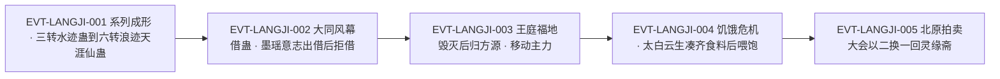

# 浪迹天涯仙蛊

浪迹天涯仙蛊是**六转水道移动仙蛊**——「浪迹天涯，乃是六转仙蛊。」`E:V3-119672`，在同一系列里排行最末也最出名：「到了六转，就是大名鼎鼎的浪迹天涯蛊。」`E:V3-079264`。它的身份有三重：一是**移动类仙蛊**（`E:V3-119606`、`E:V4-123318`）；二是七转仙蛊屋**近水楼台**的三大核心之一（`E:V4-121158`）；三是一件**在段4 被拍卖流通的高价资产**——北原拍卖大会上以「二换一」成交（`E:V4-137956`、`E:V4-138910`）。

它的知识分布很有特点：**系列的完整演进链**在段3（`E:V3-079246`–`E:V3-079264`），**归属与实战**在段3 末至段4 前段（`E:V3-119652`、`E:V4-127516`），**喂养与道属冲突**集中在段4 中段（`E:V4-125774`、`E:V4-138692`），**拍卖流转**在段4 后段（`E:V4-137628`–`E:V4-140430`），而**登记锚 `E:V4-154944`** 是段4 更后面的一行正文——它出现在灵缘斋凤金煌提出赌斗题目时，用来交代这套系列关系。

全书出现「浪迹天涯仙蛊」共 **36 行 / 36 次**（含重复块、未去重）；**本页 36 处命中中没有一行是章节题名行**。以词根「浪迹天涯」扫描共 70 行 / 75 次，最长匹配分类为：`浪迹天涯仙蛊` 36 次、`浪迹天涯蛊` 12 次、裸称「浪迹天涯」27 次（其中 **2 次是成语用法**、25 次指本蛊）。逐条账见《原著明确内容》。本页为 2026-09-28 A 线恢复批**新建页**，行号即 `E:V{段}-{6位行号}`（段号由行号机械推导）。

## 主题档案

### 一、本体：六转水道移动仙蛊，形如水母

#### 原著事实

- 转数与类别：「浪迹天涯，乃是六转仙蛊。」`E:V3-119672`；同段把它与智道蛊并列：「助仙蛊。分别是六转的移动仙蛊浪迹天涯，以及智道仙蛊乐山乐水蛊。」`E:V3-119606`
- 外形与催动形态：「此蛊宛若水母，小如婴儿拳头，包裹着一颗青提仙元，徐徐吞化。」`E:V3-119666`
- 催动效果：「一股巨浪在方源的脚下凭空产生，带动方源飞速移动，立即拉开和巨阳意志的距离。」`E:V3-119670`
- 道属：水道。「后者适合水道蛊仙，在江湖河海的环境下催动效用更佳。」`E:V4-123318`
- 与其他移动仙蛊的比较（同一句给出的定位）：「而平步青云，则擅长升降，论正常的平行疾驰，其速度要逊于浪迹天涯一筹。」`E:V4-123318`；方源的取舍理由：「方源是个实用主义者，对他而言，浪迹天涯蛊无疑更加实用。」`E:V4-123320`
- 食材与喂养（下一节专述）
- 与它同屋的另外两只核心：「有关近水楼台的仙蛊有三只，分别是：浪迹天涯蛊、乐山乐水蛊、招灾仙蛊。」`E:V4-121158`
- 在仙蛊屋中的角色：「对于凤九歌而言，它是构建七转仙蛊屋近水楼台的核心之一。」`E:V4-137638`
- 拍卖时的拍品介绍：「下面是第二十三件拍品。浪迹天涯。此蛊六转，用于移动……」`E:V4-137628`

#### 代价与收益（支付方／受益方／支付时点）

- **支付方**：催动者（持有者）的青提仙元；**受益方**：催动者（换来移动／拉开距离）；**支付时点**：每次催动即时支付，单次一颗。
- 单次成本（由第三方核算，不是旁白估算）：「方源，你这次为了救我，催动定仙游三次，损失了三颗青提仙元。催动浪迹天涯蛊一次，损耗一颗青提仙元。按照咱们的盟约，双倍补偿，就是八块仙元石。」`E:V4-125640`（说话人：黑楼兰）
- 单次成本被复述的另一处：「他多次用定仙游，往回西漠、中洲、南海，和黑城交战又用了浪迹天涯仙蛊，总共损耗了六颗青提仙元。」`E:V4-125750`
- 一场激战的合计消耗：「激斗中，方源又屡次催动乐山乐意仙蛊、浪迹天涯仙蛊等，消耗了十几个青提仙元。」`E:V4-127950`
- **受益方不必是持有者**：段3 末这只蛊由墨瑶意志持有并借给方源使用——「快把浪迹天涯蛊借我一用！」`E:V3-119652`，墨瑶意志回应「反正我已经没有了仙元，这些蛊虫都借给你罢。」`E:V3-119654`
- 借出的可撤回性：「至于浪迹天涯仙蛊，我是不会再借给你了。」`E:V3-120240`（说话人：墨瑶意志）
- 战斗力上的实际价值：「这个情况下，黑城要翻盘，就得用暗箭袭杀方源本体。但两道暗箭，已经被黎山仙子暂时困住，剩余一道根本拿拥有浪迹天涯仙蛊的方源毫无办法。」`E:V4-127516`

#### 合理推导

- **依据**：`E:V3-119666`、`E:V3-119670`、`E:V3-119672`、`E:V4-123318`；**结论**：它是一只**纯粹的位移件**——形如包裹仙元的水母、效果是脚下生成巨浪带动移动，本批尚未找到任何攻伐描写；**不确定性**：本批尚未找到移动距离、持续时间与地形限制（只写水道蛊仙"在江湖河海的环境下催动效用更佳"），本批亦未找到对火道蛊仙为何"比方源还要更慢一些"`E:V4-131278` 的机制。
- **依据**：`E:V4-125640`、`E:V4-125750`、`E:V4-127950`；**结论**：它的成本是**按次计费且可核算**的（一次一颗青提仙元），这在全批四只实体里是最清楚的计价口径；**不确定性**：本批尚未找到"一颗青提仙元换多少位移"的换算，因此无法判断它的性价比，只能得到"比凡道杀招返实蝠翼低"这一相对结论（`E:V4-131282`）。
- **依据**：`E:V3-119652`、`E:V3-119654`、`E:V3-120240`；**结论**：仙蛊**可以出借，而且出借方的意志可以随时收回**；支付与受益因此可以分离；**不确定性**：本批尚未找到借用的代价或手续（墨瑶意志的理由是"反正我已经没有了仙元"，即她催不动），无法判断这是惯例还是特例。

#### 《问真》设计意义

- `按次计价 + 需要持续投喂`是这只蛊最值得照搬的一组约束：它把移动能力变成**消耗品**，而不是常驻被动。产品可直接用"单次一颗仙元"的形态实现位移。
- `出借方与使用方分离`支持**借用／委托**类玩法：高级移动道具可以借给队友用，但成本记在使用者身上。
- 它与近水楼台其余两只核心蛊构成一组"整套收藏"的动机（`E:V4-121158`），适合做套装式资产设计。

### 二、系列演进：三转水迹蛊 → 四转浪迹蛊 → 五转萍踪浪迹蛊／浪迹江湖蛊 → 六转浪迹天涯仙蛊

#### 原著事实

- **系列谱系（登记锚所在行，原文逐字）**：「凤金煌提出，以炼制浪迹江湖蛊为题目。浪迹江湖蛊乃是五转水道蛊虫，和三转的水迹蛊，四转的浪迹蛊，六转的浪迹天涯仙蛊是一个系列。」`E:V4-154944`
- 三转：水迹蛊，属移动位——「三爪水龙蛊、螺旋水箭蛊用于攻击。防御上是水甲蛊，移动方面，有水迹蛊。治疗方面，是春雨蛊。」`E:V3-079246`
- 三转的缺陷（原文点名）：「水迹蛊提升的速度，几乎可以媲美一些四转蛊。唯一的缺陷是，脚印会含有水迹，便于追踪。同时会沾湿鞋子。」`E:V3-079258`
- 四转：「不过，此蛊往上发展很有潜力。到了四转，可以成为浪迹蛊，效用更加强大。」`E:V3-079260`
- 五转的**两个分支**：「到了五转，又有两种合炼方向。一种是便于临场闪避的萍踪浪迹蛊，另一种是能在水面快速行走的浪迹江湖蛊。」`E:V3-079262`
- 六转（同一段的收束）：「到了六转，就是大名鼎鼎的浪迹天涯蛊。」`E:V3-079264`
- 实战中的三转水迹蛊：「葛谣连忙催动水迹蛊，撑起水甲，不断躲闪，不断还击。」`E:V3-079704`
- 五转在本系列的另一次出场（用作赌斗题目）：`E:V4-154950`；对方的回应则指出灵缘斋的水道长项：「灵缘斋十分擅长水道蛊虫的培育豢养和运用，这点从近水楼台仙蛊屋就可看出。」`E:V4-154948`

#### 合理推导

- **依据**：`E:V3-079246`、`E:V3-079260`、`E:V3-079262`、`E:V3-079264`、`E:V4-154944`；**结论**：这是一个**通用凡蛊到仙蛊的升炼链**，六转的浪迹天涯是它的终点；链条内部每一转都"效用更加强大"，且五转出现**分支**（闪避向的萍踪浪迹蛊／水面行走向的浪迹江湖蛊）；**不确定性**：本批尚未找到从哪一转开始由"凡蛊"变成"仙蛊"（只说六转是仙蛊 `E:V4-154944` 与 `E:V3-119672`），六转之后是否还有分支本批亦未检到明文。
- **依据**：`E:V3-079258`＋`E:V4-154948`；**结论**：这个系列的整体设计取向是**移动与地形适应**，而且三转阶段被点出的缺陷（脚印含水迹、沾湿鞋子）恰好对应后续阶段的改进方向（四转"效用更加强大"、五转"能在水面快速行走"）；**不确定性**：本批尚未找到明文说明浪迹蛊与浪迹江湖蛊分别修掉了哪个缺陷，本页只登记"存在对应关系"这一推断，不代为指定。
- **依据**：`E:V4-154944` 出自凤金煌之口（用于赌斗题目），而系列谱系也只在 `E:V3-079246`–`E:V3-079264` 这一处由旁白完整给出；**结论**：谱系的两个来源（旁白／人物口述）互不矛盾，可并采；**不确定性**：`E:V4-154944` 是人物台词，转数由台词给出而非旁白，强度略低于 `E:V3-079246`–`E:V3-079264` 的旁白链。

#### 《问真》设计意义

- `同一系列跨 4 个转数、且中途分叉`是一条天然的**升级树**：低转蛊是量产件，到五转出现走位／环境适应的路线选择，六转收束为高阶仙蛊。
- 三转被点名的"脚印含水迹、便于追踪"是极少见的**负面特征**，适合作为低阶版本的副作用设计，而让高阶版本逐项修掉。

### 三、喂养与饿死风险：幽冥水母与深海闪电鳗鱼

#### 原著事实

- 食料点名（三处同口径）：「浪迹天涯蛊，需要数万头的幽冥水母，以及数千头的深海闪电鳗鱼。」`E:V4-124554`；`E:V4-125780`；`E:V4-130706`
- 两类食料的采购难度不同（原文给出的差异）：「前者虽然数量众多，但只要仙元石充足，不难收购。但后者却是市面上也较为稀少的。若非这次太白云生遇到鲨魔，又牺牲自己，以身犯险，还收购不到充足的量。」`E:V4-130706`
- 它曾是"近水楼台"的组成部分、长期吃不饱：「乐山乐水、浪迹天涯仙蛊，是仙蛊屋近水楼台的组成部分，这些年潜藏在王庭福地，也是饱一顿饿一顿。」`E:V4-124564`
- **饿死的条件与后果（本页最关键的一行）**：「浪迹天涯仙蛊，本来在王庭福地里头，就是饿一顿饱一顿的。大同风幕下，墨瑶意志催动近水楼台激战，我得到后，也催动了这只仙蛊多次。它已经达到了某种底线，需要喂食了。再不喂食，又过分催用的话，恐怕就要被饿死。」`E:V4-125774`
- 它身上有可观测的虚弱信号：「此时的仙蛊气息，却无往常那般稳定，透露出一股虚弱的感觉。」`E:V4-125770`；「蛊虫身上也没有健康的光泽，显得晦暗无神采。」`E:V4-125772`
- 它是方源手上第一只"喊饿"的仙蛊：「浪迹天涯仙蛊，是方源手头上第一只“喊饿”的仙蛊。」`E:V4-125776`
- 喂养后的状态：「他用这些黑血，喂饱了招灾仙蛊。又用太白云生带回的水母和鳗鱼，喂饱了浪迹天涯仙蛊。」`E:V4-126382`；「激战中，绝对少不了浪迹天涯仙蛊。方源喂饱了此蛊，等于解除了后顾之忧。」`E:V4-126386`
- 食料由太白云生独自凑齐：「太白云生单凭他一己之力，居然不声不响地将浪迹天涯蛊的食料，都搞到了手!」`E:V4-126348`
- 为了省蛊，他宁可暂缓大计：「加入东海僵盟虽然方便购买闪电鳗鱼，但再给太白云生一段时间交际，也总能买到，顶多代价大点。尽量不催用浪迹天涯仙蛊，也能再支持一段时间。」`E:V4-125812`
- 喂养与福地挂钩（本实例的通用化说明）：「比方说，一位水道蛊仙，福地就是一片海。得到浪迹天涯蛊后，蛊仙就会在福地中豢养幽冥水母、深海闪电鳗鱼等。这样一来，他喂养仙蛊浪迹天涯，就能就地取材，自给自足。」`E:V4-130724`
- 长期而言喂养仍是难题：「虽然这一次勉强挨过了难关，但下一次喂养，却仍旧是个难题。」`E:V4-130702`

#### 合理推导

- **依据**：`E:V4-125774`、`E:V4-125776`、`E:V4-126382`、`E:V4-130702`；**结论**：喂养在本实体上是一条**硬约束而非风味设定**——原文给出了"不喂 + 过度催用 → 被饿死"的因果链，并把它写成方源第一次遇到的同类事件；**不确定性**：本批尚未找到"某种底线"的量化阈值，饿死需要多久本批亦未检到明文，因此这是机制已确认、数值待取证的一对（见《待核对》）。
- **依据**：`E:V4-130706`、`E:V4-130724`、`E:V4-126348`；**结论**：两类食料的难度不对称——幽冥水母"数量众多"可由钱解决，深海闪电鳗鱼"市面上也较为稀少"必须有渠道或人情；这也解释了为什么方源要专门派太白云生去海市福地；**不确定性**：本批尚未找到"数万头／数千头"与喂养次数的换算。
- **依据**：`E:V4-130724`、`E:V4-130726`；**结论**：作者把喂养问题**制度化**了——仙蛊的食料最好由持有者自家福地生产，这条设定使"福德（福地）经营"与"养蛊"耦合；**不确定性**：原文只说"往往和蛊仙福地挂钩"，属于趋势性表述，不是所有仙蛊的强制规则。

#### 《问真》设计意义

- `喂不饱会死 + 过度使用加速消耗`构成了本批唯一的**道具耐久／饥饿**机制原型，且原文自带两个可读信号（气息不稳、光泽晦暗），适合直接做成 UI 状态。
- 两类食料一易一难，天然形成"钱能解决的部分"与"要靠关系与渠道的部分"，适合做成两条不同的获取任务线。
- `自家福地就地取材`把养蛊与基地经营绑在一起，是长线养成的现成骨架。

### 四、道属冲突：水道法则装在力道蛊仙身上，十成威力只发七八成

#### 原著事实

- 冲突的成因：「方源是力道蛊仙，成就力道仙体。浪迹天涯仙蛊则是水道法则，方源使用这只仙蛊，水道、力道并不完美融洽，会有相互牵制的弊端。」`E:V4-131276`
- 幅度（唯一量化）：「方源使用浪迹天涯仙蛊，身上的力道道痕，和浪迹天涯本身的水道道痕毫不关联，有所冲突。因而效果不佳，十成威力只能发出七八成来。」`E:V4-138692`
- 更细的排序（火道比力道更差、水道最佳）：「若是火道蛊仙催用浪迹天涯仙蛊，速度比方源还要更慢一些。」`E:V4-131278`；「最适合的就是水道蛊仙，使用同一只仙蛊，消耗等量的仙元，速度却会更快。」`E:V4-131280`
- 机制级解释（同段给出了正向对照）：「道痕越多越深，使用相应仙蛊时，就能引发更深的共鸣，使得仙蛊威能增幅更巨。」`E:V4-138690`；正向对照：「但方源若用力道仙蛊，诸如拔山、挽澜，却能引发自身和仙蛊的共鸣，从而不仅能增添仙蛊威能，十成威能可以增长到十二三成！」`E:V4-138694`
- 这一冲突是一条**通用规则**，不限本实体：「就像方源拥有浪迹天涯仙蛊，这是水道仙蛊，方源使用的效果，比水道蛊仙使用要差上许多。」`E:V4-134850`；「蛊仙得到仙蛊，不一定符合自己的流派。这个时候，往往和其他蛊仙进行交换，换取符合自己流派的仙蛊，才能施展出拔群的效果。」`E:V4-134848`
- 由此产生的两种应对：**换蛊**（拍卖大会就是机会：「这场盛况空前的北原拍卖大会，可能是近两百多年来，唯一的一次大规模换仙蛊的机会。」`E:V4-134856`）与**另配凡道杀招**（「更关键的是，返实蝠翼是凡道杀招，比催用浪迹天涯仙蛊，性价比要高出许多来。」`E:V4-131282`）

#### 合理推导

- **依据**：`E:V4-131276`、`E:V4-134852`、`E:V4-138690`、`E:V4-138692`、`E:V4-138694`；**结论**：本实体的"打折"不是蛊的问题，而是**持有者道痕与蛊之法法则是否共鸣**的通用结果——不共鸣则降到七八成，共鸣可超发到十二三成；**不确定性**：原文只给出这一个数值区间（七八成／十二三成），且是方源个人的两套实例，不能外推为所有流派组合的固定系数。
- **依据**：`E:V4-131278`、`E:V4-131280`；**结论**：在作者给出的排序里，**水道 > 力道 > 火道**（同量仙元下的速度）；**不确定性**：原文只说"更快一些／更慢一些"，未给具体差值，也未说明水道最快的成因（是"水道法则同源"还是"江湖河海环境加成"`E:V4-123318`，两者原文都可能）。
- **依据**：`E:V4-134848`、`E:V4-134856`、`E:V4-131282`；**结论**：道属不匹配在本世界观里是**常态而非异常**（仙蛊买不到、只能交换），因此"换蛊大会"与"另用凡道杀招替代"是两条并行的标准解法；**不确定性**：本批尚未找到交换的具体规则与折价比例。

#### 《问真》设计意义

- `同转数下，持有者道属与蛊道属是否共鸣`是一条比"等级"更有味道的强弱来源：不匹配只发七八成，匹配可超发到十二三成，中间还夹着环境加成。
- 它同时给了解法：换蛊（社交／交易玩法）与换用凡道杀招（性价比路线），使玩家不必只靠抽卡解决问题。
- `代价写在道痕层而不是数值层`是本页最值得照做的一点：同一只蛊在不同角色手上的表现自然分化，无需为每个角色单独配表。

### 五、归属与流转：近水楼台核心 → 墨瑶意志代持 → 方源 → 北原拍卖大会 → 凤九歌

#### 原著事实

- **上游**：它是七转仙蛊屋近水楼台的三大核心之一（`E:V4-121158`、`E:V4-137638`）。近水楼台原属灵缘斋：「门派中的某些太上长老们猜的不错。当年的门派圣女墨瑶，就是将近水楼台带进了王庭福地里了。」`E:V4-137172`
- **段3 的代持与借用**：墨瑶意志持有它并在大同风幕一战中借给方源（`E:V3-119652`、`E:V3-119654`、`E:V3-119664`）；她随后收回该承诺：「至于浪迹天涯仙蛊，我是不会再借给你了。」`E:V3-120240`
- **段4 归方源**：`E:V4-121158`（清点近水楼台三仙蛊）、`E:V4-124564`（从王庭福地潜藏状态中脱离、饥饿）
- **段4 中段的战斗使用**：`E:V4-125536`、`E:V4-125546`、`E:V4-127516`、`E:V4-127950`
- **北原拍卖大会（流转的关键节点）**：
  - 凤九歌认出它是自家门派之物 `E:V4-137168`，并写下目标 `E:V4-137630`
  - 东海八转蛊仙也有必得之心（买它不是终点，而要炼另一只蛊）`E:V4-137634`、`E:V4-137778`
  - 价格战：东海蛊仙洒下一大半天翔玉 `E:V4-137774`、出手三百六十块 `E:V4-137780`，随后加价到十斤醉仙气 `E:V4-137850`
  - 成交：「卖家已做决定，将浪迹天涯仙蛊卖给幽兰仙子！」`E:V4-137956`；「幽兰仙子能够获胜，也是情理之中。」`E:V4-137960`
  - 成交形态与方源所得：「第一高价，当然是凤九歌以二换一，买下方源的浪迹天涯仙蛊。」`E:V4-138910`；「比如方源拍卖浪迹天涯仙蛊，得到的拔山、挽澜，就是此流派。」`E:V4-138034`（两只都是力道仙蛊，正合方源力道身份）
- **归属的最终确认**：「同样的，浪迹天涯仙蛊也落在凤九歌的手中。」`E:V4-138002`；「这就是浪迹天涯仙蛊……多少年了，终于再次回到了灵缘斋的手里。」`E:V4-138004`（说话人：凤九歌）；事后追述把它称作「幽兰剑师之前花费巨额，用两只力道仙蛊，买下浪迹天涯蛊。」`E:V4-138398`
- **卖家的身份（由拍卖师供出）**：「第一个问题，卖出乐山乐意以及浪迹天涯仙蛊的人是谁？」`E:V4-140426`；「这个卖家，名为沙黄，乃是一名仙僵。」`E:V4-140430`；拍卖师内心的反应：「沙黄啊沙黄，原来是你害得老哥我啊！」`E:V4-140428`
- **整场拍卖的总结**：「回顾此次拍卖大会，方源失去了浪迹天涯、平步青云、乐山乐意，而有了铁冠鹰力」`E:V4-140666`
- **一次曾经的"出售倾向"（段4 更早处）**：拍卖前它是"拍卖的第一高价"参照系 `E:V4-139166`；凤九歌买下它之后还要避免为第二只同类仙蛊再度出手 `E:V4-138156`

#### 合理推导

- **依据**：`E:V4-121158`、`E:V4-137168`、`E:V4-138002`、`E:V4-138004`、`E:V4-140430`；**结论**：这只蛊的流转是一条**闭合回路**——原属灵缘斋（墨瑶带入王庭福地）→ 王庭福地毁灭后流落方源之手 → 经沙黄（仙僵）作卖家在北原拍卖大会卖出 → 由凤九歌（假冒幽兰剑师）买回灵缘斋；**不确定性**：本批尚未找到沙黄与方源之间的具体委托关系（`E:V4-140428` 只是拍卖师的内心反应），因此"卖家是沙黄"与"东西原属方源"之间的环节没有正文行。
- **依据**：`E:V4-137634`、`E:V4-137774`、`E:V4-137850`、`E:V4-138910`、`E:V4-138034`；**结论**：它的价格是由**双方"各自另有目的"的需求**推上去的，不是它自身的移动能力值这个价——凤九歌要凑齐近水楼台，东海蛊仙要拿它当炼材，方源则拿到两只正好合本行的力道仙蛊；**不确定性**：原文未给仙元石／醉仙气／天翔玉的换算，无法折算成统一价格。
- **依据**：`E:V3-119654`、`E:V3-120240`、`E:V4-121158`；**结论**：段3 末它仍在墨瑶意志手里（她拒绝了继续出借），段4 初它已被方源清点为自家仙蛊；中间这一段的归属转移**本批尚未找到正文行**；**不确定性**：本页按"本批尚未找到正文行"登记，把它当作流转史中的空档，不代为补写（见《待核对》）。

#### 《问真》设计意义

- 这条"流浪—回门"的闭环比单纯的归属记录更有戏剧性：同一件道具在三个阵营手里各有用途（凑套装／当炼材／换本行仙蛊），很适合做成跨阵营的长期任务线。
- `卖家另有其人`这一层（`E:V4-140430`）说明拍卖场里**货主与卖家可以分离**，是灰色交易系统的现成设定。
- 它被买回去的理由是"凑齐近水楼台"，这为"套件收藏"提供了叙事动机，而不只是数值收益。

### 六、命名边界：本名与仙蛊式全称、同系列近名、天涯仙蛊、成语用法

#### 原著事实

- **本名「浪迹天涯蛊」**：12 行 / 12 次，行号 79264、119652、121158、123320、124554、125640、125780、126348、130706、130724、138244、138398。
- **仙蛊式全称「浪迹天涯仙蛊」**：36 行 / 36 次（本页主体）。
- **裸称「浪迹天涯」**：27 次，其中 25 次指本蛊（`E:V3-104626`、`E:V3-119606`、`E:V3-119664`、`E:V3-119672`、`E:V4-123318`×2、`E:V4-123344`、`E:V4-124532`、`E:V4-125536`、`E:V4-125546`、`E:V4-125596`、`E:V4-125768`、`E:V4-130724`、`E:V4-131256`、`E:V4-136916`、`E:V4-137182`、`E:V4-137628`、`E:V4-137630`、`E:V4-137634`、`E:V4-137838`、`E:V4-138150`、`E:V4-138156`、`E:V4-138692`、`E:V4-139166`、`E:V4-140666`）。
- **成语用法的 2 次（必须排除）**：「三弟，我知道你姓情跳脱，喜欢过浪迹天涯，无拘无束的生活。」`E:V3-104282`；「对这些浪迹天涯的魔道强者，比其他家族，还要更加小心对待。」`E:V4-176364`
- **同系列近名（不同转数、不同个体，不得并入 aliases）**：水迹蛊（三转，`E:V3-079246`、`E:V3-079258`、`E:V3-079704`、`E:V4-154944` 共 4 行）、浪迹蛊（四转，`E:V3-079260` 等 3 行）、萍踪浪迹蛊（五转分支，1 行 `E:V3-079262`）、浪迹江湖蛊（五转分支，3 行 `E:V3-079262`、`E:V4-154944`、`E:V4-154950`）。
- **同名的"下一个实体"`天涯仙蛊`**：以`天涯仙蛊`检索得 37 行 / 38 次，其中 **36 行是`浪迹天涯仙蛊`的子串误切**，**只有 1 行 2 次是真正独立的名字**——`E:V4-137634`：「我的手中，已有相关的仙蛊方，只要得到它。就有可能炼成天涯仙蛊。天涯仙蛊能让我随意进出太古九天，减少突破天罡气墙的巨大损耗。」即**天涯仙蛊是另一只蛊**，与浪迹天涯仙蛊之间存在"相关仙蛊方"的关系。
- **同屋非同名（同一仙蛊屋的另外两只核心）**：乐山乐水仙蛊（`E:V4-121158`、`E:V4-137168`、`E:V4-138150`）、招灾仙蛊（`E:V4-121158`、`E:V4-124564`、`E:V4-126382`）。
- **其他移动仙蛊（不属于本实体）**：定仙游蛊（`E:V4-121154`、`E:V4-125640`、`E:V4-125750`）、平步青云（`E:V4-123316`、`E:V4-123318`、`E:V4-134848`、`E:V4-140666`）。
- **游戏侧**：`game/data/gu_names.json` 以 `water_rec_5_04_gu` 对「浪迹天涯仙蛊」；`game/**` 只读。

#### 合理推导

- **依据**：`E:V3-079264`、`E:V4-124554`、`E:V4-125774`、`E:V4-125780`、`E:V4-130706`、`E:V4-154944`；**结论**：「浪迹天涯蛊」与「浪迹天涯仙蛊」是**同一实体的两种字面形态**，故本页把前者登记为别名；判据是同段交替（`E:V4-125768`「浪迹天涯仙蛊。」与 `E:V4-125780`「浪迹天涯蛊」同窗讲同一件事：食料）与食料口径完全一致（`E:V4-124554` 对 `E:V4-130706`）；**不确定性**：本批尚未找到显式等式。
- **依据**：`E:V3-079246`、`E:V3-079260`、`E:V3-079262`、`E:V3-079264`；**结论**：水迹蛊、浪迹蛊、萍踪浪迹蛊、浪迹江湖蛊是**同一系列的不同阶段／分支**，不是别名，也不是同名异物；**不确定性**：这一系列在 roster-3 中未各立 id，本页只登记谱系，不改 roster。
- **依据**：`E:V4-137634` 与 36 行子串统计；**结论**：「天涯仙蛊」若不做最长匹配，会被 36 行"浪迹天涯仙蛊"污染；它的独立命中只有 1 行 2 次，且**指另一只蛊**；**不确定性**：本批尚未找到天涯仙蛊的转数、外形与出处（只有"能让我随意进出太古九天，减少突破天罡气墙的巨大损耗"这一功能），因此不能判定它与本实体是否同源同族。
- **依据**：`E:V3-104282`、`E:V4-176364`；**结论**：裸词「浪迹天涯」存在**稳定的成语用法**（形容漂泊无定），2 处均已逐条看过上下文，与蛊无关；**不确定性**：无。

#### 《问真》设计意义

- 本实体是"**同一系列多阶段同字面**"最密集的样本：一个词根下既有本名、全称，又有 4 个同系列阶段名、1 个近名新实体、还有成语用法。任何按字面批量出锚的流程都会在这里出错，必须先做最长匹配、再逐条看上下文。
- 「天涯仙蛊」这种"由本实体的仙蛊方炼出来的另一只蛊"是一种**派生实体**关系，既不是别名也不是同族；它给产品提供了一条"同一套配方能长出不同成品"的设计思路（只登记关系，不代补设定）。

## 状态时间线

| 状态 ID | 阶段 | 状态 | 证据 |
|---|---|---|---|
| ST-LANGJI-01 | 本体定性 | 六转水道移动仙蛊；形如水母、小如婴儿拳头，包裹一颗青提仙元徐徐吞化；催动时脚下凭空生巨浪 | E:V3-119666、E:V3-119670、E:V3-119672、E:V3-119606 |
| ST-LANGJI-02 | 系列谱系 | 三转水迹蛊经四转浪迹蛊到五转两种合炼方向（萍踪浪迹蛊／浪迹江湖蛊），六转即浪迹天涯仙蛊 | E:V3-079246、E:V3-079258、E:V3-079260、E:V3-079262、E:V3-079264、E:V4-154944 |
| ST-LANGJI-03 | 仙蛊屋身份 | 七转仙蛊屋近水楼台的三大核心之一，与乐山乐水仙蛊、招灾仙蛊同屋；原属灵缘斋 | E:V4-121158、E:V4-137638、E:V4-137172 |
| ST-LANGJI-04 | 代持与借用 | 段3 末由墨瑶意志持有并借给方源催动；她随后明确不再出借 | E:V3-119652、E:V3-119654、E:V3-119664、E:V3-120240 |
| ST-LANGJI-05 | 催动成本 | 单次催动损耗一颗青提仙元；段4 与黑城一战共损耗六颗；另一场激战屡次催动共耗十几个青提仙元 | E:V4-125640、E:V4-125750、E:V4-127950 |
| ST-LANGJI-06 | 实战价值 | 使黑城剩余一道暗箭「根本拿拥有浪迹天涯仙蛊的方源毫无办法」 | E:V4-127516 |
| ST-LANGJI-07 | 饥饿告警 | 气息不稳、光泽晦暗；「再不喂食，又过分催用的话，恐怕就要被饿死」；是方源手上第一只「喊饿」的仙蛊 | E:V4-125770、E:V4-125772、E:V4-125774、E:V4-125776 |
| ST-LANGJI-08 | 食料与喂饱 | 需数万头幽冥水母与数千头深海闪电鳗鱼；太白云生独自凑齐；喂饱后解除后顾之忧 | E:V4-124554、E:V4-126348、E:V4-126382、E:V4-126386、E:V4-130706 |
| ST-LANGJI-09 | 喂养长期化 | 这一次勉强挨过，下一次喂养仍是难题；水道蛊仙可在自家福地豢养食料就地取材 | E:V4-130702、E:V4-130724 |
| ST-LANGJI-10 | 道属冲突 | 力道道痕与水道法则不共鸣，十成威力只发七八成；水道蛊仙最快、火道蛊仙最慢 | E:V4-131276、E:V4-131278、E:V4-131280、E:V4-138692 |
| ST-LANGJI-11 | 替代方案 | 凡道杀招返实蝠翼性价比高于催用本蛊；也可通过换蛊大会换取合流派的仙蛊 | E:V4-131282、E:V4-134848、E:V4-134856 |
| ST-LANGJI-12 | 拍卖成交 | 北原拍卖大会上由幽兰仙子（凤九歌假身份）以二换一买下；方源换得拔山、挽澜两只力道仙蛊 | E:V4-137956、E:V4-137960、E:V4-138034、E:V4-138910 |
| ST-LANGJI-13 | 归属终结 | 最终落在凤九歌手中，「终于再次回到了灵缘斋的手里」 | E:V4-138002、E:V4-138004、E:V4-138398 |
| ST-LANGJI-14 | 卖家身份 | 拍卖师供出卖家名为沙黄、是一名仙僵 | E:V4-140426、E:V4-140430 |
| ST-LANGJI-15 | 登记锚复核 | roster-3 的锚点 E:V4-154944 落在正文行（灵缘斋凤金煌提赌斗题目处），非题名行 | E:V4-154944、E:V4-154948 |

## 原著明确内容（本批取证窗口登记）

本批对`浪迹天涯仙蛊`在根原文全书扫描：**36 次命中 / 36 行**（含重复块，未去重），**其中无一行是章节题名行**。以词根「浪迹天涯」扫描：70 行 / 75 次，最长匹配分类为 `浪迹天涯仙蛊` 36 次、`浪迹天涯蛊` 12 次、裸称 27 次（含 2 次成语用法）。同系列与近名扫描：水迹蛊 4 行 / 4 次、浪迹蛊 3 行 / 3 次、萍踪浪迹蛊 1 行 / 1 次、浪迹江湖蛊 3 行 / 4 次、天涯仙蛊 37 行 / 38 次（其中 36 行为子串误切，仅 `E:V4-137634` 1 行 2 次为独立名字）。下表登记本批实际读取的窗口。

| 窗口 | 内容要点 | 用途 |
|---|---|---|
| 79244–79264 | 系列谱系旁白链：三转水迹蛊（含脚印含水迹、沾湿鞋子的缺陷）→ 四转浪迹蛊 → 五转萍踪浪迹蛊／浪迹江湖蛊 → 六转浪迹天涯蛊 | 主题二、六 |
| 79702–79706 | 三转水迹蛊的实战催动 | 主题二 |
| 104278–104288 | **成语用法样本一**：「喜欢过浪迹天涯，无拘无束的生活」 | 主题六（排除） |
| 104624–104628、119604–119608 | 六转移动仙蛊浪迹天涯与智道仙蛊乐山乐水蛊并列 | 主题一、六 |
| 119648–119674 | 墨瑶意志借蛊给方源；舍一枚青提仙元催动；外形如水母；脚下生巨浪；「浪迹天涯，乃是六转仙蛊」 | 主题一、四 |
| 119710–119718 | 方源停止催动浪迹天涯仙蛊 | 主题一 |
| 120236–120242 | 墨瑶意志明言不再借出浪迹天涯仙蛊 | 主题四、五 |
| 121154–121160 | 近水楼台三仙蛊（浪迹天涯蛊、乐山乐水蛊、招灾仙蛊） | 主题一、六 |
| 123314–123320 | 平步青云与本蛊的速度比较；本蛊更适合水道蛊仙；方源的实用主义取舍 | 主题一 |
| 123342–123344 | 平步青云与浪迹天涯相加也办不到的事 | 主题一 |
| 124530–124534 | 方源当时仙蛊清单（含浪迹天涯） | 主题五 |
| 124558–124568 | 近水楼台核心蛊饱一顿饿一顿，现处饥饿状态需进补 | 主题三、五 |
| 125534–125548 | 为省青提仙元而催动；催动后立即远遁 | 主题五 |
| 125592–125598 | 定仙游与浪迹天涯都与中洲有关的线索 | 主题五 |
| 125632–125646 | 黑楼兰核算：催动浪迹天涯蛊一次损耗一颗青提仙元 | 主题一 |
| 125744–125790 | 损耗六颗青提仙元；本蛊气息虚弱、光泽晦暗；不喂将被饿死；第一只`喊饿`的仙蛊；食料清单 | 主题三 |
| 125810–125814 | 为不大计而尽量不催用本蛊 | 主题三 |
| 126344–126390 | 太白云生独自凑齐食料；喂饱招灾与本蛊；「解除了后顾之忧」 | 主题三 |
| 127512–127520 | 黑城剩余暗箭对本蛊持有者毫无办法 | 主题一 |
| 127946–127954 | 屡次催动乐山乐水与本蛊，耗十几个青提仙元 | 主题一 |
| 130700–130730 | 下一次喂养仍是难题；两类食料难度不对称；喂养与福地挂钩、可就地取材 | 主题三 |
| 131254–131284 | 三对蝠翅与返实蝠翼；力道 vs 水道相互牵制；火道更慢、水道最快；返实蝠翼性价比更高 | 主题四 |
| 134846–134856 | 仙蛊只能交换；不像本流派的仙蛊效果差许多；北原拍卖大会是近两百年唯一的大规模换蛊机会 | 主题四、五 |
| 136914–136918 | 平步青云、浪迹天涯、招灾、乐山乐水四大仙蛊 | 主题六 |
| 137166–137182 | 凤九歌认出本蛊与乐山乐水为近水楼台核心；墨瑶将仙蛊屋带进王庭福地；本蛊需收回 | 主题五 |
| 137628–137638 | 第二十三件拍品「浪迹天涯」；东海八转蛊仙的仙蛊方与「天涯仙蛊」；本蛊是近水楼台核心之一 | 主题五、六 |
| 137770–137782 | 天翔玉价格战 | 主题五 |
| 137838–137840 | 旁观者自认无望参与水道仙蛊竞拍 | 主题五 |
| 137844–137982 | 醉仙气加价；「为了一只浪迹天涯仙蛊，付出这样的代价，到底值不值得？」；成交「卖给幽兰仙子」；全场评论 | 主题五 |
| 138000–138038 | 本蛊落在凤九歌手中、回到灵缘斋；拍卖所得拔山、挽澜属力道气象天地流 | 主题五、六 |
| 138150–138160 | 凤九歌不愿再度公开出手买同类仙蛊 | 主题五 |
| 138202–138248 | 「之前浪迹天涯仙蛊的状况，要重演了」；拍卖师宣布新需求 | 主题五 |
| 138394–138404 | 方源推断幽兰剑师买本蛊是为了近水楼台 | 主题五 |
| 138688–138696 | 道痕共鸣机制；本蛊十成威力只发七八成；力道仙蛊可增发到十二三成 | 主题四 |
| 138906–138914 | 本蛊是当场第一高价；凤九歌体验咄咄逼人的加价 | 主题五 |
| 139164–139168 | 后续拍品价格越过第一的浪迹天涯、第二的乐山乐水 | 主题五 |
| 140422–140430 | 拍卖师供出卖家名为沙黄、仙僵 | 主题五 |
| 140664–140668 | 整场拍卖的得失总结 | 主题五 |
| 154940–154950 | **登记锚行**：凤金煌提出以炼制浪迹江湖蛊为题，并给出系列谱系；方源否决；灵缘斋擅长水道蛊虫 | 主题二、六 |
| 176360–176368 | **成语用法样本二**：「这些浪迹天涯的魔道强者」 | 主题六（排除） |

题名行说明：本实体 36 处命中**没有题名行**；`E:V4-130720`「章节目录 第六十一节：穿透界壁」虽在相邻窗口内，但该行不含本名，本页不以它作任何 E-ID 锚点。

## 事件链

| 事件 ID | 事件 | 参与者 | 证据 | 因果 |
|---|---|---|---|---|
| EVT-LANGJI-001 | 系列成形：三转水迹蛊→四转浪迹蛊→五转萍踪浪迹蛊／浪迹江湖蛊→六转浪迹天涯仙蛊，六转为仙蛊、前序为凡蛊 | 无（谱系旁白） | E:V3-079246、E:V3-079258、E:V3-079260、E:V3-079262、E:V3-079264 | evidences ST-LANGJI-01、ST-LANGJI-02 |
| EVT-LANGJI-002 | 大同风幕一战：墨瑶意志把浪迹天涯蛊借给方源，方源舍一枚青提仙元催动，脚下生巨浪首次摆脱巨阳意志；此后她拒绝再借 | 方源、墨瑶意志、巨阳意志 | E:V3-119652、E:V3-119654、E:V3-119664、E:V3-119670、E:V3-119674、E:V3-120240 | evidences ST-LANGJI-04 |
| EVT-LANGJI-003 | 王庭福地毁灭后本蛊落入方源之手，成为其移动主力；与黑城一战中使对方剩余暗箭无从下手 | 方源、黑城、黎山仙子 | E:V4-121158、E:V4-124564、E:V4-127516 | evidences ST-LANGJI-03、ST-LANGJI-06 |
| EVT-LANGJI-004 | 饥饿危机与解除：本蛊气息虚弱、光泽晦暗，被判定"再不喂食又过分催用恐怕就要被饿死"；太白云生独自凑齐幽冥水母与深海闪电鳗鱼，方源将其喂饱 | 方源、太白云生、鲨魔 | E:V4-125770、E:V4-125774、E:V4-125776、E:V4-126348、E:V4-126382、E:V4-126386 | evidences ST-LANGJI-07、ST-LANGJI-08 |
| EVT-LANGJI-005 | 北原拍卖大会：卖家沙黄（仙僵）出货，凤九歌（假身份幽兰剑师／幽兰仙子）与东海八转蛊仙竞价，最终凤九歌以二换一（拔山、挽澜两只力道仙蛊）胜出，本蛊重回灵缘斋 | 方源、秦百胜、沙黄、凤九歌、东海八转蛊仙 | E:V4-137628、E:V4-137774、E:V4-137850、E:V4-137956、E:V4-138002、E:V4-138004、E:V4-138910、E:V4-140430 | evidences ST-LANGJI-12、ST-LANGJI-13、ST-LANGJI-14 |

事件口径：本页沿用实体簇号 `EVT-LANGJI-*`（与 `ST-LANGJI-*` 同簇）。事件节点 5 个，已达`≥3 节点应配图`的阈值，故配 mermaid 主干。图中 EVT-LANGJI-001 是**谱系背景**而非因果起点，只表示它在该系列中的位置；EVT-LANGJI-004（喂养）与 EVT-LANGJI-005（拍卖）之间**无原文因果**，连线的方向性仅表示时间先后。

## 资料整理

本页为**新建页**，没有旧版；本批来源只有根原文，没有 `notes:`／`memory:` 层转述进入本页事实区。相关派生记录的处置登记如下（**本段内容不得当作原著事实**）：

- `lore/wiki/gu/roster-3.md` 的 `water_rec_5_04_gu` 条目记为 `| water_rec_5_04_gu | 浪迹天涯仙蛊 | 5 | 6 | E:V4-154944 |`。本页复核结论：登记锚 `E:V4-154944` 是**正文行**（凤金煌提出赌斗题目处，同时给出系列谱系），非题名行、非子串行；原文转 6 与正文一致（`E:V3-119672`、`E:V4-137628`）。本页只登记，不改该页。
- `game/data/gu_names.json` 以 `water_rec_5_04_gu` 对中文名「浪迹天涯仙蛊」；`game/**` 只读，不在本批改动范围。
- 本页不声明桥接层 canon 字段、不新建桥接层 canon 编号（本轮口径：Canon 权威已在本 Wiki，桥接层文件只作消费层，本批不引用）。

## 分析与解读

以下为归纳，不是原文（须与上文`原著事实`区分）：

1. **它是全批唯一"按次计费"写明的仙蛊**：单次一颗青提仙元由第三方（黑楼兰）核算 `E:V4-125640`，并有整场战斗的合计消耗 `E:V4-125750`、`E:V4-127950`。这让它的成本可被复用为设计基准。
2. **它是全批唯一带"会死"后果的实体**：其余三只（飞剑蛊、慧剑蛊、九转升炼蛊）的喂养只写"难题／需继续投入"，只有本实体写了"恐怕就要被饿死"`E:V4-125774`。
3. **它的强弱由持有者决定，而不是由它自己决定**：同一只蛊，水道蛊仙最快、力道蛊仙十成只发七八成、火道更慢（`E:V4-131276`、`E:V4-131278`、`E:V4-131280`、`E:V4-138692`）。这条比"高转数＝强"更有设计价值。
4. **它的价格不由它的功能决定**：溢价来自买家各自的别的目的（凑齐近水楼台／拿它当炼材），`E:V4-137634`、`E:V4-137638`、`E:V4-137848` 三行把这一点写透。
5. **本页的命名风险是"同字面多阶段"**：一个词根下同时存在本名、全称、四个系列的阶段名、一个近名派生实体（天涯仙蛊）与两处成语用法。任何不做最长匹配的预筛都会在这里产生错账。

## 待核对

- `[存在冲突]` **段3 末到段4 初的归属转移无正文**——段3 末墨瑶意志明确拒绝继续出借（`E:V3-120240`，行号 120240），段4 初方源已把它清点为自家近水楼台仙蛊之一（`E:V4-121158`，行号 121158）。两处相距约 918 行，中间未找到归属转移的正文行。当前状态：本页如实登记为流转史空档，不代为补写；**不得据此写成`原著没有`**（属`尚未找到`）。
- `[待取证]` **"某种底线"的量化**：`E:V4-125774` 用「它已经达到了某种底线，需要喂食了」来描述饥饿阈值，未给出具体数值；也写出了「再不喂食，又过分催用的话，恐怕就要被饿死」这条因果。机制 [已确认] / 具体数值 [待取证]。属`尚未找到`，**不得写成`原著没有`**。
- `[待取证]` **食料用量与次数的换算**：`E:V4-124554`、`E:V4-125780`、`E:V4-130706` 三处都写"数万头幽冥水母、数千头深海闪电鳗鱼"，但未写这些量够喂几次、单次喂多少。
- `[原著未明确]` **单次催动的位移量**：`E:V4-125640` 只给成本（一颗青提仙元），`E:V3-119670` 只写"脚下凭空产生巨浪、飞速移动、拉开距离"；无距离、时长、地形限制的数值。
- `[原著未明确]` **火道蛊仙更慢的机制**：`E:V4-131278` 只给结论，未解释原因（是道痕冲突更强，还是水道环境加成反向）。
- `[原著未明确]` **天涯仙蛊的转数与出处**：`E:V4-137634` 只写它"能让我随意进出太古九天，减少突破天罡气墙的巨大损耗"，并说它可由"相关的仙蛊方"炼成；未写它的转数、外形与是否与本实体同族。
- `[疑似子串误切]` **`天涯仙蛊`的 36 行假阳性**：以`天涯仙蛊`检索得 37 行 / 38 次，其中 36 行是`浪迹天涯仙蛊`内的子串（该 36 行与`浪迹天涯仙蛊`的 36 行完全重合），仅 `E:V4-137634` 1 行 2 次为独立名字。凡以`天涯仙蛊`做检索口径的流程，须先做最长匹配。
- `[疑似子串误切]` **成语用法的 2 次必须排除**：`E:V3-104282`、`E:V4-176364` 的「浪迹天涯」是形容漂泊无定的普通短语（分别指"无拘无束的生活"与"魔道强者"），与蛊名无关。
- `[存在冲突]` **roster-3 只登记全称、而原文中本名占 12 行（Wiki 内部，非原文冲突）**：`roster-3.md` 的 `water_rec_5_04_gu` 登记名为「浪迹天涯仙蛊」，而「浪迹天涯蛊」在原文有 12 行命中（含食料、成本、系列谱系等关键证据）。本页把后者登记为别名，使检索可覆盖全部 75 次词根命中；不改他页。
- **体量登记**：已超 40 KB（落盘实测 46,678 字节；按 1 KB=1000 B 计超 40 KB），按 GOVERNANCE 登记例外；**未为压体积删除任何有效知识**（词根 75 次命中的四类分类账、天涯仙蛊 37 行的子串账、39 行窗口表均保留）。
- 2026-09-28：本页按 id 引用 roster-3，不以其行号定位（行号会随该文件增改位移）。

## 模板扩展建议（只登记，不改核心模板）

1. **`同一词根多阶段命名`需要一张谱系位**：本实体下有 4 个同系列阶段名（水迹／浪迹／萍踪浪迹／浪迹江湖）＋1 个近名派生实体（天涯仙蛊）＋1 个本实体的两种写法。现有`身份边界`只能横向并列，无法表达"逐转演进 + 中途分叉"的树形关系。建议在模板里允许一段小谱系（或允许引用一张关系图）。
2. **`派生实体`需要独立于别名与同族的第三种表达**：天涯仙蛊由本实体相关的仙蛊方炼成，既非别名也非同族；建议在身份边界下加"派生关系"一词条位。
3. **`道属不匹配`宜作为跨页共享规则登记**：`E:V4-134848`、`E:V4-138690`、`E:V4-138692`、`E:V4-138694` 讲的是通则（道痕共鸣），却只出现在本实体的窗口里。建议允许把它升级为规则页引用，避免每只仙蛊各写一遍。

## 关联页面

[水道](../world/water-path.md)、[力道](../world/strength-path.md)、[火道](../world/fire-path.md)、移动蛊与位移、仙蛊屋、[杀招连招并招体系](../rules/killer-moves.md)、[蛊的饲养与炼化](../world/gu-care-and-refinement.md)、[真元](../world/primeval-essence.md)、[修炼体系](../world/cultivation-system.md)、[道痕](../rules/dao-marks.md)、[蛊虫关系](gu-relations.md)、[蛊虫总表](roster.md)、[蛊虫总表三期](roster-3.md)、[蛊虫与蛊师能力来源](cultivator-effects-and-scouting.md)、[飞剑蛊](sword-atk-5-02-gu.md)、[慧剑蛊](wisdom-atk-5-05-gu.md)、[九转升炼蛊](refine-log-5-02-gu.md)、[方源](../characters/fang-yuan.md)、北原拍卖大会
