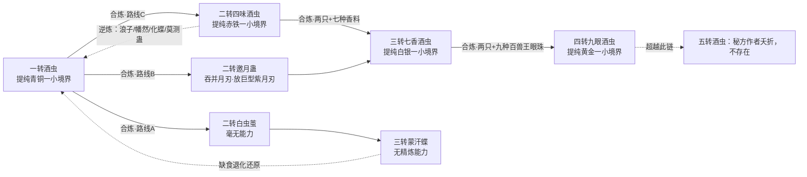
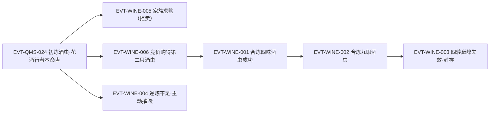

# 酒虫

酒虫一系帮助蛊师提纯**已有**真元的品质，作用受适用转数和本转巅峰限制。真元海的容量仍由空窍与资质约束；提纯和补充真元是不同操作，参见[真元](../world/primeval-essence.md)。

本页是本会话的第二张 Golden Page，结构沿用[月光蛊](moonlight-gu.md)的「主题档案」三层（原著事实 → 合理推导 →《问真》实现）。与月光蛊的根本差异：月光蛊作用于**敌人**，酒虫作用于**持有者自己的真元**，因此本页不设「实战案例」主题，代之以「使用案例与限制」，并另立「修行速度与战斗续航」「获取·稀缺性·经济价值」两块月光蛊不需要的结构。四味酒虫（二转）、七香酒虫（三转）、九眼酒虫（四转）是同一蛊系的后续形态，各自在[蛊虫总表二期](roster-2.md)有独立条目，本页按「同一条线」处理。

本页只登记事实、推导与设计落点，不维护第二份游戏数值；《问真》已实现的数值与行为以游戏仓库为唯一真相源（现状见主题一《问真》实现层）。

## 主题档案

### 一、效果与作用边界

#### 原著事实

- 唯一功用＝凝练（提纯）真元，把蛊师的真元提升一个小境界：「苍绿色真元，是一转中阶蛊师才具备的真元。酒虫的作用，就是凝练真元，将蛊师的真元提升一个小境界！」`E:V1-004672` `[叙事|已核]`
- 「一个小境界」有明确定义：蛊师有九大境界，每一大境界细分初阶、中阶、高阶、巅峰四个小境界 `E:V1-004674`。
- 作用对象是**已有的真元**，须由蛊师主动调动灌注，不是凭空生成 `E:V1-004656`、`E:V1-004658`；一转初阶的方源由此得到「半成的一转中阶的蛊师真元」`E:V1-004676`、`E:V1-002900`。
- 上限＝本转巅峰：「但当他到达四转巅峰，九眼酒虫就失去了作用。酒虫能提炼真元质量，但也只能提升一个小境界。方源到达四转巅峰，本身就有了巅峰期的真金真元，已经到顶了。再往上升，那便是五转初阶的淡紫真元」`E:V3-078626`、`E:V3-078628` `[叙事|已核]`
- 转数必须匹配：一转酒虫只能精炼一转的青铜真元，「而你已经是二转蛊师，对于赤铁真元酒虫是没有办法精炼的」`E:V1-016892` `[对话|已核]`（说话人：古月青书）。
- 不补充真元、不回真元：提纯消耗的是原有真元，且每次操作净损耗体积（见主题二）；元石才是补充渠道——「酒虫精炼，温养空窍，催动白豕蛊增添力量等等，都需要消耗真元。真元消耗之后，单凭丙等资质的恢复速度，必然满足不了他的需求，只好动用元石，汲取其中的天然真元进行补充」`E:V1-012758` `[叙事|已核]`
- 不加速真元恢复：家老评方源「虽然他有酒虫，但是真元的恢复速度，还远远不是甲等、乙等学员的对手」`E:V1-011420` `[对话|已核]`
- 真元耗尽后无救场能力：「酒虫只能精炼真元，在一场激烈的战斗中，蛊师的真元极容易耗尽。剩下来的战斗，蛊师就靠拳脚，就靠自身的力气。这就是黑、白豕蛊体现出来的价值，它比酒虫还要可靠」`E:V1-009698` `[叙事|已核]`
- 属「洗练真元」一类：「他虽然用过酒虫，但是酒虫也只是洗练真元，将真元品质拔生一个小境界」`E:V2-040992` `[叙事|已核]`（「拔生」原样保留，见《待核对》）。
- 提升实战输出（经真元品质间接传导）：中阶真元催动月光蛊，「发出的月刃，也比初阶真元催动出来的更强大」`E:V1-005300` `[对话|已核]`；「他如今已经晋升中阶，用了酒虫精炼真元，月刃就达到了高阶蛊师才有的攻击程度」`E:V1-010444`。
- 精炼所得真元可直接用于温养空窍：方源「先前温养窍壁的真元，并不是初阶真元。而是经过酒虫精炼之后的中阶真元」`E:V1-005284`。
- 能被用来帮助突破障碍（小境界层面的助力）：丙等资质「要冲破晶壁，破而后立，达到二转，也不是没有办法」，酒虫属其中一条路径 `E:V1-014468`。
- 与上位手段的差距：「酒虫不必说了，只能提升一个小境界，和骨肉团圆蛊没法比」`E:V2-041086` `[叙事|已核]`

#### 合理推导

- **依据**：`E:V1-004676`（一转初阶→拥有一转中阶真元）、`E:V1-020084`＋`E:V1-020176`（二转中阶→「高阶真元」「伪高阶」）、`E:V2-064126`（四转初阶→亮金）、`E:V2-067944`（四转中阶→精金）、`E:V3-078628`（四转巅峰失效）。**结论**：可归纳为「**真元品阶 ＝ min(当前修为小境界 + 1，本转巅峰)**」——酒虫抬高的是**真元品质**，不抬高修为本身；原文的「伪高阶」正是这种分离的直接表述 `E:V1-020176`。
- **不确定性**：原文未给「同一小境界内能否叠加两次」的直接反例；`E:V1-004678` 说明操作可重复，但重复只增加高一阶真元的**量**，不越过本转巅峰。
- **可能反例**：若某处出现「用酒虫后真元跨两个小境界」或「用后修为随之晋阶」的原文，本推导必须修订。本页未找到此类原文（属「尚未找到」，不等于「原著没有」）。
- **依据**：`E:V1-009698`＋`E:V1-011420`。**结论**：酒虫的收益是「延迟真元耗尽」，不是「补充真元」；它在消耗战里的价值低于「不耗真元的永久增益型」蛊虫（黑白豕蛊）。
- **可能反例**：`E:V1-018644` 的「连续催发八片月刃」属方源的**预期**（「如果合炼了四味酒虫……我就能」），不是实测，不能当作已证事实。

#### 《问真》实现

- **游戏侧现状（只读核对，2026-09-28）**：设计模型库里已有 `wine-insect-gu` 条目（`docs/design/rank1-9-model/gu-library.json`：rank 1、`poweredAction: null`、效果类型 `essence-quality`，note 明写「改变真元品质，不回复或增加真元数量」），并含 `recipe-four-wine`、`recipe-nine-eye-wine` 两条配方；但**运行数据未实现**——`game/data/gu.json` 的 805 条蛊中没有酒虫（含 `wine` 命中 0）。
- **设计落点**：`poweredAction: null` 与原著「不是战斗回真元动作」一致，说明酒虫在《问真》中天然属于**元进程/成长经济**系统，而不是战斗动作条。若将来实现，最小正确表达是「以真元/资源换真元品质」，且必须带净损耗，否则会丢掉原著的核心权衡。
- **改编边界**：原著真元只有「每转四小境界」（`E:V1-004674`），没有跨转换算公式；若《问真》要做跨转收益，须显式声明为改编。

### 二、真元精炼机制与品阶换算

#### 原著事实

- 单次操作＝**两段投入**：
  1. 调动**一成真元**逆冲灌注酒虫；「酒虫早已经被他炼化，因此来者不拒，把这股真元全数吸收进身体里面」`E:V1-004658`、`E:V1-004658`；元海因此「四成四的海面，就下降了一小截」`E:V1-004660`。
  2. 酒虫「将真元化为动力」，绽放白色毫光、氤出淡白酒雾 `E:V1-004662`；再调动**一成真元**投入酒雾 `E:V1-004666`——「那一成青铜真元，也凭空消失了一般体积，只剩下了半成」，颜色由翠绿（带铜光泽）转苍绿 `E:V1-004668`。
- 总账（原文自述）：「我要凝练出半成中阶真元，就得消耗两成初阶真元。我要将空窍中四成四的元海，都转换成中阶真元，就得耗费近十八成的初阶真元。要想尽快地达成这个目标，就得借助元石了」`E:V1-004678` `[对话|已核]` → **投入两成、产出半成＝4:1 体积比**；其中一成作动力全耗、一成作原料减半。
- 第二次独立复证（同一手法、不同时间）：一成初阶真元投入酒虫「很快被它吸收的涓滴不剩」→ 再调一成投入酒雾 →「原先的一成初阶真元，体积骤然缩小了一半，同时颜色也从翠绿色转变成了苍绿色」`E:V1-005290`、`E:V1-005294`、`E:V1-005296`。
- 全海转换个案：一夜修行后，「四成四的青铜元海，都在刚刚，被酒虫精炼成苍绿色的中阶真元」`E:V1-007844`。
- **产出归属＝本身真元**：「此虫能在一转境界的修行中，帮助蛊师精炼真元，提升一层小境界。如此精炼出来的真元，是你的本身真元，而不是异种真元。用来温养空窍的话，没有丝毫的后遗症，亦没有风险，温养的效果更佳！」`E:V1-007776` `[对话|已核]`（说话人：古月赤练）
- 对照路径（异种真元的代价）：师长帮助灌注「利用异种真元有很大的后遗症，除非今后能寻得净水蛊，将异种气息清洗掉」`E:V1-014468`；并有「若是将来能寻到净水蛊，就能洗练你的窍壁，将空窍元海中的异种气息都化去」`E:V1-007774`。
- 色阶与耐用度：修为越高真元颜色越深、越是耐用；方源的墨绿（巅峰）真元「是在高阶真元的基础上，被酒虫精炼成的」`E:V1-012622`。
- 提纯链总纲（四档形态各提纯对应转数）：一转酒虫→青铜、二转四味酒虫→赤铁、三转七香酒虫→白银、四转九眼酒虫→黄金，均「一个小境界」`E:V2-060664` `[叙事|已核]`。
- 四转真元色阶（原文个案链）：淡金（初阶）→亮金（中阶）→精金（高阶）→真金（巅峰）；文末对照五转初阶为淡紫 `E:V2-066074`、`E:V2-066740`、`E:V2-067944`、`E:V3-078628`。
- 每次精炼净耗真元，故须持续补入元石：方源「为追求修行速度，一直在利用元石补充真元。而后更关键的是，他运用酒虫，来精炼出中阶真元。这就大大加剧了元石的消耗」`E:V1-005322`，一晚上先后消耗三块元石 `E:V1-005326`。
- 精炼效率依赖炼化程度：「只有将酒虫完全炼化，成为我的本命蛊，才能自由地操纵它，然后以最大的效率来精炼我的真元」`E:V1-002902` `[对话|已核]`。
- 精炼后的真元品质提升一个小境界的完整个案：二转高阶修为＋四味酒虫提炼＋元石补充 →「深红真元……全部转换为如今的暗红真元」`E:V1-024616`。

#### 合理推导

- **依据** `E:V1-004668`＋`E:V1-005296`＋`E:V1-004678`。**结论**：「体积减半」是提纯的物理表现（以量换质），4:1 是本例实测比；原文**没有**给出跨转或跨境界的通用换算公式。
- **不确定性**：「一成」是相对方源当时「四成四」元海的计量单位 `E:V1-004660`；元海更大的蛊师是否仍按「两成换半成」折算，原文未给。
- **可能反例**：四味、七香、九眼酒虫的换算比原文均未给（见《待核对》），因此**不得**把 4:1 外推为全链通则。
- **依据** `E:V1-007776`＋`E:V1-014468`。**结论**：酒虫路线的制度性优势不仅是省真元，而是产出「本身真元」、无后遗症；这正是家族愿意把酒虫留在学堂「给新学员轮流使用」的动因之一 `E:V1-017956`。
- **待处理的张力（本页不裁定）**：原文一面说提纯后「体积骤然缩小了一半」，一面说「能让蛊师变相地储备更多真元」`E:V1-015306`、「意味着真元储备的增加」`E:V1-017948`。两层口径可并存——前者是**体积**，后者是**同体积的耐用度/可用度**（`E:V1-012622`）。本页并列登记，不擅自统一为一句。

#### 《问真》实现

- 设计库 `essence-quality` 效果类型与本段机制一致：只改品质、不增数量。若实现，代价侧必须体现「净损耗＋元石补入」，否则原著的权衡（越练越耗）会丢失。
- 本页不复制游戏数值；配方细节以 `docs/design/rank1-9-model/gu-library.json`（`recipe-four-wine`、`recipe-nine-eye-wine`）与运行数据为唯一真相源。

### 三、修行速度与战斗续航的实际影响

#### 原著事实

- 修速量化：「寻常学员，要晋升修为，都是用一转初阶的真元。而我去是用中阶真元，效率比他们要高出至少两倍」`E:V1-005300` `[对话|已核]`
- 累计效应：丙等资质「能吊住这些甲等、乙等资质的同龄人，非常不容易。这其中，酒虫的作用居功至伟」`E:V1-011120`。
- 一转阶段的评价：族人称「他走了狗屎运，有酒虫帮助温养空窍。虽然只是丙等，但和乙等、甲等比起来，仍旧不落下风」`E:V1-012850` `[对话|已核]`
- 二转突破的速度归因：古月冻土评「只是丙等资质，就已经在十六岁突破到二转……这样快的速度，大部分也归功于酒虫吧。可惜酒虫到了二转，就不能使用了」`E:V1-016236` `[叙事|已核]`
- 反向量化：「酒虫是必须要合炼的，没有酒虫，我的进度就会减慢一倍不止」`E:V1-017320` `[对话|已核]`；「除非方源尽快地合炼成四味酒虫，才能在修行的速度上跟得住方正」`E:V1-017334`。
- 失去后的主观评价（酒虫遭主动摧毁之后）：「可惜，若是有一只酒虫在身上，速度会更快。」——「酒虫能令一转蛊师的真元，提升一个小境界。用酒虫来辅助修行，可以达到事半功倍的效果」`E:V2-037010`、`E:V2-037012` `[对话|已核]`
- 一生尺度的比喻：「以前丙等资质的时候，修行若蜗牛爬。用了酒虫之后，能走路了。等甲等资质，又有天元宝莲，仿佛是在奔跑」`E:V2-041028` `[叙事|已核]`
- 代价：丙等资质＋酒虫使元石消耗倍增 `E:V1-005326`；「他只是丙等资质，又要用酒虫精炼真元，元石的消耗是同龄人的数倍。但也因此，他能克服资质上的不足，若算真正的修行进度，他能名列前三」`E:V1-006618`；养七只蛊时「屡次动用酒虫。因此元石的消耗比一般人都要高」`E:V1-015834`。
- 优势的边界：三人优势显露后，「方源利用酒虫，艰难营造出的领先局面，已经几乎不存在了」`E:V1-011130` `[叙事|已核]`；且真元恢复速度始终不如甲乙等 `E:V1-011420`。
- 资质差距仍可压制酒虫收益：方源二转后「虽然他已经能够运用四味酒虫，但白凝冰的学银真元无疑更加出色」`E:V2-042658`（用字疑误，见《待核对》）。
- 战斗续航（预期形态）：「如果合炼了四味酒虫，精炼了真元，我就能连续催发八片月刃」`E:V1-018644` `[对话|已核]`。
- 四味酒虫炼成后的实测定性：可精炼二转真元提升一个小境界，方源「使用了一只赤铁舍利蛊。晋升到中阶。如今用了四味酒虫。就是高阶真元」`E:V1-020084`；「虽然……没有达到二转高阶，但是此刻有四味酒虫精炼出高阶真元，算得是伪高阶，因此战斗力暴涨」`E:V1-020176`；合炼四味酒虫后「战斗力猛地暴涨两倍。同时温养空窍。修行起来事半功倍」`E:V1-020086`。
- 概念定性：「首先有了酒虫，就能精炼真元，能让蛊师变相地储备更多真元」`E:V1-015306` `[叙事|已核]`；「真元精炼，提升一个小境界，这就意味着真元储备的增加，同时对于蛊师的修行进展有很强力的推动作用」`E:V1-017948`。
- 九眼阶段的推进力：「因为有着九眼酒虫的帮助，方源顺利地晋升到四转巅峰」`E:V3-078274`；对照失效后「单靠真金真元洗练空窍，方源的修行进度一下子缓慢下来」`E:V3-078634`。

#### 合理推导

- **依据** `E:V1-005300`（至少两倍）＋`E:V1-017320`（无酒虫进度减半）。**结论**：原文把酒虫的修速收益稳定描述为**约 2 倍级**，且来源是「用更高品阶真元修行」，不是「真元变多」。
- **不确定性**：两倍是方源一转初阶→中阶一档的自述；二转换四味酒虫后是否仍为两倍，原文未给数字。
- **可能反例**：`E:V2-042658` 显示四味酒虫精炼出的赤铁真元仍不如甲等资质的雪银真元——**小境界优势不能抵消大资质差距**。
- **归属**：酒虫只解决「小境界赛跑」，冲刺大境界仍要自己的真元与资质（`E:V2-041038`，见主题四），因此它不能当作「代替资质」的方案。

#### 《问真》实现

- 可复用的设计结论：原著的「续航」来自**真元品质→单位体积可用度**，在《问真》里应表现为「转化率/消耗折扣」，而不是「回复量 +X」。任何把酒虫做成回蓝的实现都与原著冲突（`E:V1-009698`）。
- 修速收益的载体应与月光蛊共用同一套「真元品阶」字段（`E:V1-005300` 是同一条证据同时支撑两页）。

### 四、与修为体系、资质、月光蛊的关联

#### 原著事实

- 破壁方法的层级（原文明确排序）：「最根本的方法，就是寻得能提升自身资质的蛊虫。次等的方法，就是获得类似酒虫等等的辅助蛊虫，也能帮助蛊师突破障碍。再次一等，获得师长的帮助，但利用异种真元有很大的后遗症」`E:V1-014468` `[对话|已核]`；并自承「酒虫这类的蛊虫都很珍稀」`E:V1-014472`。
- 冲刺大境界靠自己：「酒虫只能提升小境界，冲刺大境界时，得靠蛊师自己的真元。因此资质凸显重要」`E:V2-041038` `[叙事|已核]`
- 与舍利蛊的竞合：「就比如说是舍利蛊。此蛊一用，就能升华窍壁，助推修为，升上一阶小境界，是小菜一碟的事情。」……「至于什么酒虫，异种真元等等，自然也被不少人提了出来」`E:V1-008308` `[叙事|已核]`——方源以丙等资质率先晋升中阶后，众人把舍利蛊、酒虫、异种真元并列为可能原因。
- 与月光蛊的接口（关键跨页证据）：「同时用中阶真元催动月光蛊，发出的月刃，也比初阶真元催动出来的更强大」`E:V1-005300` `[对话|已核]`；「用了酒虫精炼真元，月刃就达到了高阶蛊师才有的攻击程度」`E:V1-010444`；「方源如今已经是中阶蛊师，利用酒虫精炼后，得到高阶真元」`E:V1-010982`；墨绿（巅峰）真元由高阶真元经酒虫精炼而成 `E:V1-012622`。
- 高资质者反而不划算：九眼酒虫对白凝冰「却是弊大于利的」——「黄金中阶的真元，对空窍四壁的温养效果更加强大。白凝冰是北冥冰魄体……她如今的资质，已经涨到了九成六」；而方源「当我到达四转初阶，用这九眼酒虫，就有黄金中阶的真元。到那时，我便后来居上，在真元上第一次凌驾于白凝冰了」`E:V2-060724`、`E:V2-060724` `[叙事|已核]`
- 与喂养的耦合：酒虫精炼、温养空窍、催动白豕蛊都要耗真元，丙等资质无法自理，只能动用元石 `E:V1-012758`。
- 用途归类：与四味酒虫、人兽葬生蛊、舍利蛊、天元宝莲同属「修行类」`E:V2-037464`（见《跨页缺口移交》）。

#### 合理推导

- **依据** `E:V1-014468`＋`E:V2-041038`。**结论**：在原著的力量结构里，**酒虫不改变资质、不改变大境界，只在大境界内部给真元品质 +1 小境界**；它把资质焦虑从「能否突破大境界」缩小到「小境界赛跑不落后」。
- **不确定性**：白凝冰「弊大于利」的机理原文只给到「黄金中阶真元温养效果更强 ←→ 她资质已九成六」这一组对照 `E:V2-060722`，未给量化；不能据此断言「高资质一律不需要酒虫」。
- **依赖关系（本页只给指针）**：「真元品阶 vs 修为」属**通用规则**，应在[真元](../world/primeval-essence.md)或[修炼体系](../world/cultivation-system.md)定义；本页只登记「酒虫是该规则的应用实例」，不在此处复述规则。
- **可能反例**：`E:V1-008308` 里公众把酒虫与「异种真元」并列猜测，说明**外部观察者难以区分**「本身真元（酒虫）」与「异种真元（他人灌注）」；这是修行体系的辨识盲区，不是酒虫的特性。

#### 《问真》实现

- 设计含义：酒虫不应被做成「提升等级的药」，而应是「**在资源约束下换小境界品质**」的成长工具，天然与「资质/恢复速率/元石经济」三系统耦合。
- 与月光蛊的耦合必须显式：月光蛊的伤害档位由催动真元品阶决定（见[月光蛊](moonlight-gu.md)），而酒虫是一转内把该品阶抬一档的手段，两页必须共享同一个「真元品阶」字段，不得各写一套。

### 五、喂养与资源链

#### 原著事实

- 食料＝酒：「月光蛊需要吞食月兰花瓣，每天两顿，早晚一顿，每顿两片花瓣。酒虫呢，则需要饮酒。一坛青竹酒，能支撑它四天」`E:V1-003812` `[叙事|已核]`
- 次等酒不划算：「酒虫也可以喝一些浊酒、米酒为生。但是一旦是这种次等酒，喝的量就大了，每天都得要数坛。方源算了下，还不如直接买青竹酒，不仅比买次等酒划算一些，而且也不会惹人怀疑」`E:V1-003822` `[叙事|已核]`
- 日常成本口径：「一块元石，能购买十片花瓣，月光蛊每天消耗四片。一坛青竹酒价值两块元石，能支撑酒虫四天所需。也就是说，单单喂养这两只蛊，每天就要消耗将近一块元石」`E:V1-003834` `[对话|已核]`
- 采购量与后勤量：「这事有些麻烦，方源需要喂养酒虫，按照长远来讲，所需的青竹酒的量是很大的」`E:V1-003864`；「这客栈若是缺货，恐怕将来只能用大量的次等酒，来喂养酒虫了」`E:V1-003866`。
- 一次性采购个案：「每坛两块元石，方源为了酒虫，一下子砸出四十块元石」`E:V1-004626`。
- 早期总账：「自从炼化蛊虫到现在，已经十六天了。单单养蛊方面，就耗费了方源十四块半的元石」`E:V1-003838`。
- 规模上限：「一般的蛊师，都只能喂养同转蛊虫四五只的数量。所以，往往蛊师并非是单人行动，而是形成五人小组，最少也会有三人」`E:V1-010874` `[叙事|已核]`；方源养七只时「经济负担有些大」`E:V1-015834`。
- 卖蛊的算账口径（喂养成本被计入价格谈判）：老者比出「三百一十」时，文中以「酒虫市价五百八十块元石」等作为参照 `E:V2-047246`、`E:V2-047246`。
- 会顺手喝干别人的酒：酒虫在酒杯中打滚，「猴儿酒以肉眼可见的速度，迅速下降。几个呼吸的功夫，酒杯中就干涸见底，涓滴不剩了」`E:V1-006760` `[叙事|已核]`
- 断粮即自我封印：「再例如酒虫，若是它自我封印，就会结成一块白色的蚕茧。它会蜷缩身躯，在蚕茧中沉睡」`E:V1-006186` `[叙事|已核]`；但「这种封印沉睡的情况，并不是在所有蛊虫的身上都会发生。它发生的概率很小，正常情况下，蛊虫都不会沉睡，而是被饿死。只有少数个别的蛊虫，才会在特定的情况下，自我封印」`E:V1-006188`。
- 缺食会**降级**：「花酒行者是五转强者，这酒虫原本也是五转，但是这些年它没有充足的食物，饱一顿饿一顿的，品级也就下降了。如今只剩下一转层次，但是这意志却顽强如磐石！」`E:V1-002936` `[对话|已核]`
- 缺食还会**退化还原**（同源先例）：花酒行者死后「蒙汗蝶没有充足的食物来源，不断退化，最终还原成酒虫」`E:V1-016920` `[叙事|已核]`
- 高阶形态食料更贵：四味酒虫「需要美酒为食。兜率花中有不少酒，但统共算起来，也只能支撑它半年」`E:V2-035056`；「在这半年里，必须寻到新的酒。或者将四味酒虫逆炼，还原成酒虫」`E:V2-035058` `[对话|已核]`。
- 酒兼作逆炼辅料：「酒能消毒，同时也能驱寒。若是逆炼四味酒虫，也需要酒作为辅料。就算逆炼的条件满足不了，充当四味酒虫的食料，也是不错的」`E:V2-037250`。
- 喂养同时承担隐蔽功能：方源以酒肆掩护喂养酒虫——青书当面点出「虽然你现在有了酒肆。可以更方便地喂养酒虫，但是对自己没有用处的东西，白白养着干什么呢？」`E:V1-016892` `[对话|已核]`
- 食源与野生生态：这只酒虫原是靠酒囊花蛊存活，「但是随着酒囊花蛊一根根的枯死，它也丧失了食物来源」`E:V1-002752`；它「被青竹酒浓郁的酒香吸引，来到了方源的面前」`E:V1-002756`。

#### 合理推导

- **依据** `E:V1-003812`＋`E:V1-003834`。**结论**：一转酒虫的**日成本约 0.5 块元石**（一坛两块／四天一坛），与「月光蛊＋酒虫每天将近一块」自洽。
- **结论（经济性）**：酒虫的门槛不是「买得起」而是「养得起」——食料成本与精炼带来的元石消耗叠加，一转阶段就已明显（`E:V1-005326`、`E:V1-015834`）。
- **不确定性**：四味／七香／九眼酒虫的食料**量化**原文未给（只有「美酒」「半年存量」「猴儿酒不错」），无法推算高阶日成本。
- **可能反例**：`E:V1-006188` 明说自我封印是「少数个别蛊虫」的例外，不能把「封印成白色蚕茧」当作酒虫通用的断粮行为。
- **可能反例**：逆炼产物并不总是酒虫（化蝶蛊→幽气蝶、莫测蛊→不定，`E:V2-037034`），故「缺食→还原」与「主动逆炼」是两条不同通道，不能互相证明。

#### 《问真》实现

- 设计落点：酒虫把《问真》牵进**日常资源消耗**与**经济压力曲线**。原著给出了可映射的成本结构（食料＋精炼损耗＋元石补入），适合做成「维护费＋转化损耗」。
- 缺食→降级／退化／封印是原著明确机制（`E:V1-002936`、`E:V1-006186`、`E:V1-016920`），若《问真》的蛊虫系统没有「断粮状态」，本页是最适合登记该缺口的实体页之一（见《跨页缺口移交》）。

### 六、获取、稀缺性与经济价值（含各境界价值变化）

#### 原著事实

- 野生获取＝酒香引来＋醉酒窗口：前世「大约是两个月后，一位因为失恋而醉酒的族内蛊师，烂醉如泥地躺在山寨外，结果四溢的酒香气息，意外地引来了一头酒虫」`E:V1-001416` `[叙事|已核]`；捕捉必须等它喝醉——「只有等到它喝酒喝得醉醺醺，飞行速度慢下来，才有机会捕捉」`E:V1-002418`，「酒虫已经醉醺醺的，飞行速度降低到了往常的一半」`E:V1-002458`，随后「先把酒虫收入怀中，又蹲下去，拨开死根枯藤，便发现一具白骨骷髅」`E:V1-002566`。
- 稀缺度：对三转蛊师「却可有可无了」`E:V1-002760`；「一转蛊虫当中，酒虫、豕蛊、书虫等等这些，都是最珍稀的蛊。一旦在市面上出现，几乎第一时间就被人购走了」`E:V1-007780` `[对话|已核]`
- 市价：「酒虫市价五百八十块元石，书虫有时候略高一点，达到六百。黑白豕蛊也是六百块元石。但以上这些蛊，皆是一转的珍稀蛊，因为数量稀少，所以价格昂贵」`E:V2-047246`；「普通的一转蛊，大约在二百五十块元石左右」`E:V2-047248` `[叙事|已核]`
- 拍卖标价是引流手段：「酒虫的正常市价，是五百八十块元石。这里的标价比市价竟然还要便宜八十块元石」——因「标价之所以这样低。只是贾富想吸引人气」`E:V1-017878`、`E:V1-017882`。
- 价级定位（关键定性）：「以上的价格，只是针对普通蛊虫。一些珍稀蛊，譬如酒虫，虽然是一转蛊，但却是二转蛊的价格」`E:V2-050904` `[叙事|已核]`
- 同期横向对比：玉皮蛊「是此系列中，最为珍稀的蛊虫了。市价仅次于酒虫，有时候价格浮动，也会和酒虫持平」`E:V1-009618`；黄骆天牛蛊「和月光蛊相当，次于玉皮蛊，更次于酒虫」`E:V1-009654`；黑白豕蛊「它们在市场上的售价，比酒虫还要高」`E:V1-009980`、「市价比酒虫还要贵，通常都要卖到六百块元石」`E:V1-006826` `[对话|已核]`；「大众普遍认为，酒虫的价值还要略小于黑、白豕蛊」`E:V1-009696`；书虫「价值，和酒虫，白豕蛊相当，都是一转蛊虫中珍稀品种，市价昂贵，并且一直是脱销状态」`E:V1-011112`。
- 酒虫低于豕蛊的**理由**（重要反例）：「正是因为如此，黑、白豕蛊的价格才会高于酒虫……酒虫只能精炼真元，在一场激烈的战斗中，蛊师的真元极容易耗尽……它比酒虫还要可靠」`E:V1-009694`、`E:V1-009698` `[叙事|已核]`
- 交易形式（树屋竞价）：「你去取一张纸，用笔写上自己购买这酒虫的价钱。然后塞进柜台侧面的洞口里去。如果在所有想要购买的人中，你的价格是最高的，那么这只酒虫就归你所有了」`E:V1-017910` `[对话|已核]`；「库存中有三只酒虫，每一只售卖的地点，贾富大人都是亲自敲定的」`E:V1-018128` `[对话|已核]`。
- 家族级需求：「类似酒虫、黑白豕蛊、九叶生机草这类的珍稀蛊虫，家族高层都希望掌控住，为整个家族服务」`E:V1-017136` `[叙事|已核]`；药姬为孙女买了一只后，「她还需要一只酒虫作为材料，来最终合炼出一只她所需要的三转蛊虫」`E:V1-025092`。
- 家族收购条件（含制度设计）：「可以将酒虫晋升为二转的邀月蛊，三转的七香酒虫。七香酒虫，亦有精炼真元的能力」`E:V1-016922`；「你将酒虫卖给家族，家族若成功地合炼出了七香酒虫，那么你就有五年的使用权。如果失败，家族还会另给你一笔补偿」`E:V1-016924` `[对话|已核]`
- 秘方决定价格（原文明确因果）：「如果方源将他的晋升秘方。暴露出来，那么酒虫的市价必定将要暴涨许多」`E:V1-017958` `[叙事|已核]`
- 缺陷面（发展前景不大）：「唯一的缺陷，就是酒虫的发展前景不大。按照流传最广的晋升秘方。酒虫只是作为一种合炼的材料，合炼出来的新蛊虫，不再具有精炼真元的能力」`E:V1-017950`、`E:V1-017952`；「所以很多家族有了酒虫，并不会将其合炼晋升，而是用于学堂，专门给新学员轮流使用」`E:V1-017956` `[叙事|已核]`
- 值不值得合炼的原文判据：白虫茧「却毫无能力」，「而白虫茧没有任何能力，只是耗费食物喂养，对你来讲没有帮助」`E:V1-016900` `[对话|已核]`
- 价值随境界下降的链条：「酒虫这种一转蛊虫，对于一转蛊师来讲，十分珍贵。但到了二转，就不合用了。因此暴露出去，顶多会引发一些人的重视，无伤大局」`E:V1-006664` `[对话|已核]`；「酒虫只是一转蛊虫，对于一转蛊师意义重大，但是对于二转三转的蛊师，就不能精炼真元了。因此没有人关注，也属正常情况」`E:V1-006794` `[对话|已核]`；青书当面劝说「虽然你现在有了酒肆。可以更方便地喂养酒虫，但是对自己没有用处的东西，白白养着干什么呢？」`E:V1-016892` `[对话|已核]`
- 价值回升（换形态）：四味酒虫对二转有用 `E:V1-020082`、`E:V2-037018`；九眼酒虫对四转有用 `E:V2-060718`、`E:V2-060724`。
- 持有压力：方源证明三次拒绝出售——「九叶生机草绝对是非卖品，酒虫早已经合炼成了四味酒虫，方源想拿也拿不出来」`E:V1-020464`。
- 投入量级：四味酒虫一次合炼「就先消耗了四百多块元石」`E:V1-020094`；九眼酒虫「为了它，方源花费很多，接近二十万元石」`E:V2-060708`。
- 推广性问题：「辅助修行的蛊虫，已经有许多。最典型的，就是酒虫。但是这些蛊虫，大多珍稀无比，难以推广」`E:V2-039828` `[叙事|已核]`
- 后期同类的定位（含口径疑点）：琅琊地灵称「这个世间，已经有很多的酒蛊、茶蛊。就比如很有名的酒虫、大烟茶蛊」`E:V5-202038` `[对话|已核]`；「酒虫不用多说，方源重生之后，就受益于它，初期发展很是迅猛」`E:V5-202040`。

#### 合理推导

- **依据** `E:V2-050904`＋`E:V2-047248`。**结论**：一转酒虫（580）已是普通一转蛊（250）的两倍以上，正对应原文「一转蛊、二转价」的定性；溢价来自**阶段唯一性收益**（一转内唯一能抬真元品质的手段），不是战力。
- **依据** `E:V1-017950`–`E:V1-017958`。**结论**：酒虫的市价被**秘方知识**压在低位——主流秘方会让它降格为材料，因此家族倾向「不合炼、循环租用」；一旦最优秘方公开，需求与价格都会跳升。这是原著里少见的「知识决定价格」个案。
- **价值曲线形状**：一转期极高 → 二转期对本人归零 → 作为**材料/家族资产**仍有价（`E:V1-016924`、`E:V1-025092`）→ 换形态后按当前转数重新获得高位价值（`E:V2-060718`、`E:V2-060724`）。
- **不确定性**：四味／七香酒虫的市价原文未给；「家族掌控珍稀蛊」的执行方式（收购价、是否强制）原文未细化。
- **可能反例**：`E:V1-009696` 是「大众普遍认为」的民间估值，与 `E:V1-009980` 的市价陈述同向；但 `E:V1-016892` 显示「对谁有用」会改变交易意愿——价格不等于效用。

#### 《问真》实现

- 设计落点：酒虫的经济模型＝**一次性获取＋持续维护＋阶段末淘汰/材料化**，天然适配元进程与经济循环；它的「价格随境界变化」不是调参问题，而是**阶段绑定**问题（一转有用、二转无用、四转九眼再有用）。
- 若要复刻「秘方决定价格」，需要《问真》区分「物品价值」与「知识/秘方价值」；当前运行数据未实现酒虫，故只登记为设计缺口。

### 七、炼蛊链：合炼、逆炼与秘方制度

#### 原著事实

- 炼蛊两分：「其中炼蛊，大致分为合炼，逆炼两大方面。合炼，是将低转的蛊虫晋升为高转。逆炼却恰恰相反」`E:V2-037030`、`E:V2-037032` `[叙事|已核]`
- 一蛊一能（合炼通则）：「任何一个蛊虫。都只有一个能力……合炼后的新蛊虫，常常只能留取一只蛊虫的能力，并加以强化」`E:V1-016906`、`E:V1-016910` `[叙事|已核]`
- **路线 A（流传最广，产物无精炼能力）**：酒虫 → 二转白虫茧 → 三转蒙汗蝶。「这个秘方，是流传得最广，也是最实用的秘方。蒙汗蝶也是比较好的蛊虫。但是白虫茧却毫无能力」`E:V1-016900` `[对话|已核]`；「如果按照『白虫茧、蒙汗蝶』的这个路线，得到的蛊虫，都没有精炼真元的能力。的确是可惜」`E:V1-016918` `[叙事|已核]`。花酒行者即走此路：将酒虫晋升为蒙汗蝶后随身携带，「多次将女性迷倒，实施恶行」`E:V1-016920`。
- **路线 B（家族收录，终点保留精炼能力）**：酒虫 → 二转邀月蛊 → 三转七香酒虫，「七香酒虫，亦有精炼真元的能力」`E:V1-016922` `[对话|已核]`。邀月蛊的战例见狼潮：吞并家老月刃、放大成巨型紫月刃 `E:V1-028286`（归属见《跨页缺口移交》）。
- **路线 C（方源记忆中的最优，两步产物都能精炼）**：「先是晋升二转四味酒虫，再晋升三转七香酒虫。不管是四味酒虫，还是七香酒虫，都具有精炼真元的能力」`E:V1-016942` `[叙事|已核]`
- 材料清单：「要合炼四味酒虫，须得有两只一转酒虫，同时要有酸甜苦辣四味美酒。合炼七香酒虫，要用两只四味酒虫，并且有七种香料。到了九眼酒虫，就需两只七香酒虫，要用九种百兽王的眼珠」`E:V2-060688`、`E:V2-060690` `[叙事|已核]`
- 四种味道的取得难点：「辣酒最常见，一般的白酒都是辣酒。酸酒可取杨梅酒。葡萄酒，那都是酸的。甜酒，可取糯米酒。但是苦酒，就要费思量了」`E:V1-016952`；「就方源所知，只有一种绿色的苦酒，用艾草酿造，在艾家寨。可惜这艾家寨，远在十万八千里」`E:V1-016954` `[叙事|已核]`。实际凑到的是「甜的是黄金蜜酒，辣的白粮液，酸的是杨梅酒，苦的是苦贝酒」`E:V1-020024`。
- 四味酒虫的合炼过程（个案）：两虫「一齐钻入到杨梅酒坛当中」尝试融合 `E:V1-020030`、`E:V1-020030`；持续投元石「一直到一百块的时候，光团凝缩成拳头大小」`E:V1-020036`；换第二坛黄金蜜酒，「光团忽然涨大成原状」`E:V1-020040`；「他要一直维持着两只酒虫的意识融合，因此一心多用，极耗心力」`E:V1-020042`；四坛美酒用尽后白光一盛而成 `E:V1-020050`。
- 形态变化：四味酒虫「它的外型并没有太多的变化，只是比酒虫稍大一些」，通体乳白的酒虫变成「四种颜色不断地渐变，代表辣的红色，代表苦的蓝色，代表酸的绿色，代表甜的黄色」`E:V1-020058`、`E:V1-020062`。九眼酒虫「如蚕宝宝，浑身洁白细腻，犹如珍珠。头部已经没有眼睛，九颗眼睛颜色各异，赤橙黄绿青蓝紫等，仿佛是玛瑙、宝石镶嵌着」`E:V2-060704`。
- 失败与代价：「怕就怕失败之后，酒虫受损严重，死掉一只。或者苦贝酒消耗光」`E:V1-020066`；「合炼蛊虫，在修行前期，还算是容易的。到了四转、五转，往往十次未必能成功一次。六转的成功率更是降到百分之一」`E:V1-020076`、`E:V1-020078`；方源合炼九眼时「分别在合炼第三只四味酒虫、七香酒虫的时候，失败了一次。其中消耗的元石，都打了水漂，辅料也得重新购买，不得不重新开始」`E:V2-060700`。
- 九眼个案：两只七香酒虫合炼「结果很顺利。三天之后，方源得到了九眼酒虫」`E:V2-060702`；其失败「集中在合炼四味酒虫、七香酒虫的过程中，处在整个步骤的前半段。在最后收尾关头，一次性成功」`E:V2-060712`。
- 逆炼（还原）条件与方法：「如果将四味酒虫逆炼，就能得到一转的酒虫。可惜逆炼的条件，要求很多，我现在还达不到」`E:V2-037028` `[对话|已核]`；「可以用浪子蛊，这样一来就能得到两只一转酒虫。或者用幡然蛊，这个法子只能得到一只酒虫。用化蝶蛊的话，则会得到幽气蝶。用莫测蛊的话，得到的蛊虫就不定了，甚至有可能会是一种全新的蛊虫」`E:V2-037034`；「但浪子蛊比酒虫还有珍贵得多，入手难度太大。最实际的方案，还是幡然蛊」`E:V2-037038`，代价是「损失一条酒虫」`E:V2-037040`。
- 合炼成本：四味酒虫「先消耗了四百多块元石」`E:V1-020094`；九眼酒虫「接近二十万元石」`E:V2-060708`（另登记为 [REF-023](../rules/refinement.md)）。
- 秘方的资产属性：四味酒虫秘方「也就方源独一份」`E:V1-020500`；「四味酒虫，代表着全新的合炼秘法，意义极其重大。哪怕方源将这推到商队身上，也解释不了。必会受到家族的全面调查」`E:V1-024574` `[叙事|已核]`
- 链条在四转截断：「九眼酒虫之上，五转的酒虫却是没有的。当初研炼酒虫秘方的那个秘方大师，天资卓绝，年纪很轻。却被对手提前斩杀。夭折了」`E:V2-060666` `[叙事|已核]`
- 转数对照：酒虫一转、四味二转、七香三转、九眼四转 `E:V2-060664`；方源三转巅峰时九眼酒虫还用不了，须待四转 `E:V2-060718`。

#### 合理推导

- **依据** `E:V1-016906`＋`E:V1-016918`＋`E:V1-016922`＋`E:V1-016942`。**结论**：酒虫晋升链的**分叉点不在「能否升」，而在「升上去还剩不剩精炼能力」**——三条路线在二转处分道，A 路线所得无精炼能力，B、C 保留。因此「选路线」在原著里是一次**能力取舍**。
- **依据** `E:V2-060666`。**结论**：酒虫链是一条被作者截断的链条（五转缺位，原因是秘方作者被杀），这既解释了为何九眼之上无更高形态，也解释了 `E:V3-078626` 的「功成身退」。
- **不确定性**：七香酒虫与邀月蛊各自精炼哪种真元、倍率多少，原文未给（只有「亦有精炼真元的能力」）；逆炼用浪子蛊为何能得**两只**酒虫，原文未解释。
- **可能反例**：`E:V1-016920` 显示蒙汗蝶（A 路线产物）会因缺食**退化还原成酒虫**，即路线不是单向的；这与「主动逆炼」是两条不同通道，不能混为一谈。

#### 《问真》实现

- 设计落点：酒虫链的「分叉取舍」非常适合《问真》的合炼系统（同一材料三种产物、能力互斥）。设计库已登记 `recipe-four-wine`、`recipe-nine-eye-wine` 两条配方，但运行数据未实现。
- 改编边界：若简化成单线升级，会丢掉原著最关键的取舍点（A 路线无精炼能力），须显式声明为改编。

### 八、使用案例与限制

#### 原著事实

- 炼化极难（一转蛊里的异类）：需元石「至少需十一块，最多需要十六块」`E:V1-002816`；「这酒虫好强的抵抗力……感到真元的消耗速度，竟然比月光蛊还要超出一倍不止」`E:V1-002910` `[对话|已核]`；努力半个晚上，青绿之色「还不足酒虫身躯的百分之一」`E:V1-002932`；「这个酒虫的意志太顽强了，抵抗力十分强大，简直要超出一转蛊虫的界限」`E:V1-002934`。
- 原因：它原是花酒行者的本命蛊。「花酒行者死后，他的强者意志却存在于酒虫之中。方源现在要炼化酒虫，等若是和花酒行者的意志在比拼」`E:V1-002942` `[叙事|已核]`。
- 炼化中的反噬：「眼前，酒虫团成一个圆溜溜的汤圆，猛地绽放出刺眼的白色毫光」`E:V1-003160`；「蛊虫反噬的情况，十分罕见。只有那种意志极为刚强的蛊虫，才会奋尽全力，不成功则成仁」`E:V1-003166` `[叙事|已核]`
- 解决手段与规模依赖：「除非是有强者，动用二转三转蛊的气息，威压这只酒虫，将酒虫体内的意志压制到最低程度」`E:V1-002948`；方源最终以春秋蝉气息完成，并总结「当晚炼化酒虫，前前后后足足消耗了六块元石」`E:V1-003388`。
- 炼化的通则（后期回述）：「炼化蛊虫，靠的是什么？意志！……是用真元作为载体，让蛊师意志不断消磨蛊虫身上的意志，直至蛊虫身上全是蛊师意志」`E:V3-109600`–`E:V3-109604`；且「蛊虫之间，高出二转，就会形成威压。方源利用春秋蝉的气息，逼压低转蛊虫的意志……再用自身真元灌注，其意志长驱直入」`E:V3-109608`。
- 炼成：「就这样，酒虫炼成了！」`E:V1-003354`。
- 反复使用的个案序列：一转初阶首次精炼（`E:V1-004656`–`E:V1-004678`）→ 第二次精炼（`E:V1-005290`–`E:V1-005296`）→ 四成四元海全转中阶（`E:V1-007844`）→ 二转用四味酒虫得高阶真元、伪高阶（`E:V1-020084`、`E:V1-020176`）→ 深红转暗红（`E:V1-024616`）→ 四转用九眼酒虫得亮金、精金（`E:V2-066074`、`E:V2-066740`、`E:V2-067944`）→ 四转巅峰失效、封存（`E:V3-078626`、`E:V3-078630`）。
- 退役（原著给出的结局）：「这只从青茅山开始，就陪伴他一路走来的蛊虫。从一转的酒虫，一路合炼成为如今的四转，现在终于功成身退了」`E:V3-078632` `[叙事|已核]`；此后「单靠真金真元洗练空窍，方源的修行进度一下子缓慢下来」`E:V3-078634`。
- 被替代：四味酒虫因骨肉团圆蛊＋白凝冰的帮助「失去了利用价值」，一度「只是白白养着」`E:V2-060674`、`E:V2-060676`；后因白凝冰将晋升四转、对方帮助减少，才决意合炼九眼酒虫 `E:V2-060680`。
- 主动销毁个案：青茅山上「方源在青茅山上一共收获了三只酒虫。第三只，是杀了古月药乐缴获的战利品」`E:V2-037020`；「他为了防止暴露，忌惮铁血冷的侦破手段，便主动将酒虫和其他一些战利品都摧毁了」`E:V2-037022` `[叙事|已核]`。
- 隐匿与暴露：方源判断「酒虫这种一转蛊虫，对于一转蛊师来讲，十分珍贵。但到了二转，就不合用了。因此暴露出去，顶多会引发一些人的重视，无伤大局」`E:V1-006664` `[对话|已核]`；他在紫金化石上做文章以解释来历 `E:V1-006650`；暴露后族内「各种可能的答案喧嚣尘上。至于什么酒虫，异种真元等等，自然也被不少人提了出来」`E:V1-008308`。
- 用途归类：与四味酒虫、人兽葬生蛊、舍利蛊、天元宝莲同属「修行类」`E:V2-037464`。

#### 合理推导

- **依据** `E:V1-002934`＋`E:V1-002942`＋`E:V3-109604`。**结论**：**炼化难度与蛊虫的「意志年龄/前主人强度」正相关**，而非与转数正相关——这只一转酒虫比同转蛊虫难炼得多；「起手蛊」的隐性成本不只在价格里。
- **不确定性**：本次炼化能快速完成，关键变量是春秋蝉（六转）的气息 `E:V1-002948`、`E:V3-109608`；无同类手段的蛊师，周期可达原文所说「要在一个月之内，炼化这只酒虫，已经不可能了」`E:V1-002948`。
- **可能反例**：`E:V3-078626` 的失效是「到顶」而非「损坏」，封存后的九眼酒虫理论上仍可给四转以下的持有者使用；本页不推定它「废了」。
- **可能反例**：`E:V1-006664` 的「暴露无伤大局」是方源的**策略判断**（针对一转蛊的身份），而 `E:V1-024574` 显示一旦牵出「四味酒虫」这一全新秘法就必须全面调查——同一物品，暴露风险随**形态/秘方**而变，不是恒定的。

#### 《问真》实现

- 设计落点：酒虫的完整生命周期（难炼化 → 高效期 → 阶段失效 → 材料化/退役）本身就是一条完整的成长道具曲线；若实现，**「炼化难度作用于本命蛊」与「阶段失效」**比「数值加成」更值得保留。
- 本页不复制游戏数值；任何具体加成以 `game/data/gu.json` 与设计模型库为唯一真相源。

## 跨页缺口移交（提案区块）

| # | 缺口 | 应归属页 | 现状 | 建议 |
|---|---|---|---|---|
| 1 | 「真元品阶 vs 修为」可分离（伪高阶）作为通则 | [真元](../world/primeval-essence.md)／[修炼体系](../world/cultivation-system.md) | 未登记 | 本页只给实证个案：`E:V1-004676`、`E:V1-020176`、`E:V3-078628` |
| 2 | 「本身真元 vs 异种真元」与净水蛊洗练 | [真元](../world/primeval-essence.md) | 未登记 | 最强证据在本页：`E:V1-007776`、`E:V1-007774`、`E:V1-014468` |
| 3 | 一转珍稀蛊价级表（酒虫 580／书虫 600／黑白豕蛊 600／普通一转 250／「一转蛊二转价」） | 经济与蛊虫总表相关页 | 散见各页 | 建议增设「价级定位」列，引用 `E:V2-047246`、`E:V2-050904` |
| 4 | 酒虫→月光蛊的实战联动锚点 | [蛊虫关系](gu-relations.md) 第 111 行 | 现用行号锚（`5438-5516`）与间接证据 | 建议补入直接论据 `E:V1-005300`（中阶真元催动月光蛊、月刃更强） |
| 5 | 邀月蛊吞并月刃与「月系」能力归属 | [蛊虫总表二期](roster-2.md)（已登概要）＋月系页 | 已登 | 留待「月系能力归属」专题裁定；本页不主张与月光蛊同源 |
| 6 | 白虫茧「毫无能力」与蒙汗蝶「比较好的蛊虫」的判据 | [蛊虫总表二期](roster-2.md) | 已登 | 可补原文判据 `E:V1-016900`（只是耗费食物喂养、价值不大） |
| 7 | 缺食→降级／退化还原／自我封印三条机制 | [蛊的饲养与炼化](../world/gu-care-and-refinement.md) | 未系统登记 | 证据：`E:V1-002936`、`E:V1-016920`、`E:V1-006186` |
| 8 | 家族以「五年使用权」换秘方、家族掌控珍稀蛊 | 家族/组织制度页 | 未登记 | 证据：`E:V1-016924`、`E:V1-017136` |
| 9 | 五转酒虫缺位（秘方作者被杀导致链条截断） | [蛊虫总表三期](roster-3.md) 或炼道路线页 | 散见 | 证据：`E:V2-060666` |
| 10 | 酒虫属「修行类」的分类学位置 | [蛊虫关系](gu-relations.md)／分类页 | 未登记 | 证据：`E:V2-037464`（需回原文逐行核对后落地） |
| 11 | 苦贝/苦酒与四味酒虫材料的关系 | 材料/资源页 | 未整理 | 见《待核对》第 4 条（含口径疑点） |
| 12 | 食料成本的可折算口径（一坛两块／四天） | 经济页 | 未登记 | 证据：`E:V1-003834`、`E:V1-003812` |

## 状态时间线

（下表「状态」列记录：内容。）
| 状态 ID | 阶段 | 状态 | 证据 |
|---|---|---|---|
| ST-WINE-01 | 一转酒虫 | 方源以已有青铜真元提纯出高一小境界的真元 | E:V1-004656（4656–4676 行） |
| ST-WINE-02 | 四味酒虫 | 二转真元可提纯一小境界；三转方源已不能用 | E:V1-020082、E:V2-037018 |
| ST-WINE-03 | 九眼酒虫 | 三转方源不能用；四转巅峰已无可提纯的小境界 | E:V2-060718、E:V3-078626 |
| ST-WINE-04 | 野生·食源约束态 | 靠酒香与酒类食源存活；须醉酒（速度降半）方可捕捉 | E:V1-001416、E:V1-002418、E:V1-002458 |
| ST-WINE-05 | 缺食·降级态 | 供食长期不足，品级由五转降为一转，但意志仍顽强 | E:V1-002936、E:V1-002942 |
| ST-WINE-06 | 缺食·自我封印态 | 结成白色蚕茧、蜷缩沉睡；属少数蛊虫的例外机制 | E:V1-006186、E:V1-006188 |
| ST-WINE-07 | 缺食·退化还原态 | 同源先例：蒙汗蝶因断食不断退化，最终还原成酒虫 | E:V1-016920 |
| ST-WINE-08 | 炼化中·意志对抗态 | 与前主人的强者意志比拼，起手即反噬 | E:V1-002934、E:V1-003160、E:V1-003166 |
| ST-WINE-09 | 已成本命蛊·可精炼态 | 完全炼化后方能以最大效率精炼；每次操作须由蛊师主动灌注 | E:V1-002902、E:V1-004656 |
| ST-WINE-10 | 精炼作业·净损耗态 | 投入两成初阶真元得半成中阶（4:1）；须以元石持续补入 | E:V1-004678、E:V1-005326 |
| ST-WINE-11 | 转数失配态 | 一转酒虫不能精炼二转赤铁真元；二转起对本人无用 | E:V1-016892、E:V1-006664 |
| ST-WINE-12 | 材料化态 | 走流传最广路线合炼后，产物（白虫茧/蒙汗蝶）不再有精炼能力 | E:V1-016900、E:V1-016918 |
| ST-WINE-13 | 逆炼还原态 | 四味酒虫可经浪子/幡然/化蝶/莫测蛊逆炼回酒虫或他蛊 | E:V2-037028、E:V2-037034 |
| ST-WINE-14 | 高资质持有态 | 对资质九成六的白凝冰弊大于利 | E:V2-060722 |
| ST-WINE-15 | 本转巅峰·失效封存态 | 四转巅峰已到顶，封存并「功成身退」 | E:V3-078626、E:V3-078630、E:V3-078632 |
| ST-WINE-16 | 暴露/被索取态 | 家族以五年使用权换秘方；后为防侦破主动摧毁一只 | E:V1-016924、E:V2-037022 |

## 原著明确内容（本批取证窗口登记）

本批以「回完整原文定向取证」为原则，全书扫描 `酒虫|白虫茧|蒙汗蝶|邀月蛊` 得 450 行命中，再逐窗精读。以下窗口的事实已按主题写入上方《主题档案》，此处只登记覆盖范围（避免正文重复）：

| 窗口（原文行） | 覆盖内容 | 落点主题 |
|---|---|---|
| 1416–1534 | 酒香引来酒虫；学堂炼化本命蛊奖励池 | 五、六 |
| 2418–2566 | 醉酒捕捉、入洞得遗藏 | 六 |
| 2752–2762 | 食源枯死、收益归属判断、三转蛊师眼中可有可无 | 五、六 |
| 2816–2950 | 炼化难度与元石量、半个晚上百分之一、意志、缺食降级 | 八、五 |
| 2900–2904 | 精炼授权与「最大效率」前提 | 一、二 |
| 3160–3166 | 炼化反噬 | 八 |
| 3354–3392 | 炼成、耗费六块元石 | 八 |
| 37010–37012 | 「若有酒虫速度会更快」 | 三 |
| 3812–3866 | 青竹酒四天、次等酒不划算、酒量大 | 五 |
| 3838 | 十六天养蛊耗十四块半 | 五 |
| 4626–4678 | 首次精炼全流程与 4:1 总账 | 二 |
| 5290–5300 | 二次精炼；月刃联动；效率至少两倍 | 二、三、四 |
| 5318–5326 | 一晚三块元石 | 二、三 |
| 6186–6188 | 自我封印成白色蚕茧 | 五 |
| 6618–6826 | 修速与代价、暴露策略、豕蛊价高 | 三、六、八 |
| 6760 | 猴儿酒被喝干 | 五 |
| 7776–7780 | 本身真元 vs 异种真元；最珍稀蛊 | 二、六 |
| 7844 | 四成四元海全转中阶 | 二 |
| 8308 | 公众猜测（舍利蛊/酒虫/异种真元） | 四、八 |
| 9618–9980 | 同期价格对比群 | 六 |
| 10050 | 喂养日成本对照 | 五 |
| 10444–10982 | 月刃与真元品阶 | 四 |
| 10874 | 喂养上限四五只 | 五 |
| 11112–11130 | 居功至伟与领先消失 | 三、六 |
| 11420 | 恢复速度不是对手 | 一、三 |
| 12622 | 墨绿真元经酒虫精炼；耐用度 | 二 |
| 12758 | 三重真元消耗 | 四 |
| 12850–12852 | 一转巅峰不落下风；二转失效 | 三、六 |
| 14468–14472 | 破壁方法层级 | 四 |
| 15306 | 「变相地储备更多真元」 | 二、三 |
| 15834–16126 | 七只蛊的经济压力与经济崩溃 | 三、五 |
| 16236 | 十六岁突破二转 | 三 |
| 16892–16960 | 局限、路线分叉、材料难度、收购条件 | 六、七 |
| 16900–16920 | 白虫茧/蒙汗蝶/退化还原 | 七 |
| 17136 | 家族掌控珍稀蛊 | 六 |
| 17320–17334 | 进度取决于酒虫 | 三 |
| 17878–18176 | 市价、竞价机制、库存三只 | 六 |
| 18644 | 八片月刃（预期） | 三 |
| 20024–20094 | 四味酒虫合炼全流程与成本 | 七 |
| 20176 | 伪高阶 | 一、三、四 |
| 20464–20500 | 拒卖；秘方独一份 | 六、七 |
| 24574 | 全新秘法暴露风险 | 七 |
| 25092 | 药姬的材料需求 | 六 |
| 35052–35058 | 后勤压力；四味酒虫半年食料 | 五 |
| 37020–37044 | 三只酒虫的下落、主动摧毁、逆炼方法与条件 | 七、八 |
| 37250 | 酒作逆炼辅料 | 五 |
| 39828 | 辅助修行蛊难以推广 | 六 |
| 40992 | 「洗练真元／拔生一个小境界」（用字存疑） | 一 |
| 41028–41038 | 蜗牛爬/走路/奔跑；冲刺大境界靠自己 | 三、四 |
| 42658 | 四味酒虫 vs 雪银真元（用字疑误） | 三 |
| 47244–47248 | 市价体系 | 六 |
| 50904 | 「一转蛊，但却是二转蛊的价格」 | 六 |
| 60664–60666 | 提纯链总纲；五转缺位 | 二、七 |
| 60688–60712 | 材料清单、九眼合炼个案、成本与失败 | 七 |
| 60718–60724 | 三转用不了；高资质弊大于利；凌驾白凝冰 | 一、六、八 |
| 66074／66740／67944 | 四转初/中阶提纯到亮金、精金 | 二、八 |
| 78626–78636 | 四转巅峰失效、封存、退役、进度放缓 | 一、八 |
| 202038–202040 | 「有名的酒蛊」；重生受益 | 六 |
| 140704、166538、156062 | 三处时序/口径疑点（见《待核对》） | — |

## 事件链

| 事件 ID | 事件 | 主体 | 证据 | 关系 |
|---|---|---|---|---|
| EVT-WINE-001 | 合炼四味酒虫成功：两虫入杨梅酒坛融合，四坛美酒（杨梅/黄金蜜/苦贝/白粮液）依次耗尽 | 方源、两只酒虫 | E:V1-020024、E:V1-020028、E:V1-020050 | causes ST-WINE-02；耗四百多块元石 E:V1-020094 |
| EVT-WINE-002 | 合炼九眼酒虫：两只七香三天成，此前第三只四味与第二只七香各失败一次 | 方源、两只七香酒虫 | E:V2-060696、E:V2-060700、E:V2-060702 | 成本接近二十万元石 E:V2-060708 |
| EVT-WINE-003 | 四转巅峰·九眼酒虫失效并封存 | 方源、九眼酒虫 | E:V3-078626、E:V3-078630 | ends ST-WINE-15 |
| EVT-WINE-004 | 逆炼条件不足 → 为防铁家侦破主动摧毁持有的酒虫 | 方源 | E:V2-037022、E:V2-037028 | 涉及 ST-WINE-16 |
| EVT-WINE-005 | 古月青书代表家族求购：以「售虫换七香酒虫五年使用权＋失败补偿」为条件 | 古月青书、方源 | E:V1-016922、E:V1-016924 | 方源拒卖 E:V1-020464 |
| EVT-WINE-006 | 商家城树屋竞价购得第二只酒虫（为四味酒虫备料） | 方源、古月药姬、管事 | E:V1-017910、E:V1-018176 | enables EVT-WINE-001 |

引用弧一枢纽页已定义事件（本页不重复定义，只引用同一 ID）：`EVT-QMS-021` 山缝秘洞·酒囊花饭袋草与白骨、`EVT-QMS-024` 初炼酒虫·花酒行者本命蛊、`EVT-QMS-037` 不择手段·真元精炼比率、`EVT-QMS-042` 压着你打·窍壁与中阶真元、`EVT-QMS-050` 最后一块紫金石·为酒虫打掩护、`EVT-QMS-051` 猴儿酒·主动暴露酒虫。

## 资料整理

- **本批取证方法**：全书扫描 `酒虫|白虫茧|蒙汗蝶|邀月蛊`（450 行命中，分布 V1 367／V2 68／V3 8／V4 4／V5 3），按 5000 行分桶定位两大密集区（0–4999：121 行；15000–19999：91 行）与两个次密集区（5000–9999：68 行；60000–64999：27 行，即九眼合炼段），再逐窗精读。**所有写入本页的引文均在成稿前逐行回原文复核过一次**，未采信任何二手摘要。
- **E-ID 命中审计**：本页 E-ID 全部落在有字行（脚本逐条比对 `source/蛊真人-clean.txt` 对应行非空）。上一轮月光蛊页曾出现 12 个 E-ID 指空行的系统性缺陷，本页按同一审计口径复核。
- **扫描批自身的错漏（留痕）**：本批中间产物（分桶扫描结果摘要）曾把「酒虫也只是洗练真元，将真元品质拔生一个小境界」记为 41092 行；复核时确认该句实为 `E:V2-040992`，41092 行是另一句话。教训：**扫描稿的行号归属必须回原文复核后才可引用**，本页据此逐条复读。
- **笔记副本的可靠性（交叉校验）**：`game/肉鸽设计-原始数据/` 与 `lore/research/肉鸽设计-原始数据/` 两份副本**并不一致**——后者缺 `10-蛊虫`～`13-气` 四个文件，且同名文件字节数全线不同（如 `01-道痕`：44915 vs 45324）。抽样比对显示这些笔记是**逐行原文摘录**（每行前缀原文行号）：`2816`、`2936`、`6664`、`7780`、`16900` 的摘录文字与本页直读原文完全一致。**结论**：该笔记可作交叉校验的第二通道，但不能替代原文取证，且两副本的分歧本身需要在治理层登记。
- **行号体系漂移**：`gu/roster.md` 用「A2a 2484–2806」「A2b 20082–20084」式笔记行号标注证据，与 `E:V*` 原文行号**不同源**，读者无法直接回原文。本页统一用 `E:V*`，并把 rostert 侧的可升级点写入《跨页缺口移交》。
- **事件编号失配（重要）**：[弧一枢纽页](../events/qing-mao-mountain.md) 已把 `EVT-QMS-001…015` 整体重排为 `EVT-QMS-001…114`，并明确登记「跨页引用同步债务，**不得在本批修改**」，波及 `characters/fang-yuan.md`、`gu/moonlight-gu.md`、`gu/small-light-gu.md`、`gu/spring-autumn-cicada-gu.md` 等页。本页据此**不复用 EVT-QMS 号**：酒虫自身生命周期事件用实体簇号 `EVT-WINE-*`（先例：[月芒蛊](moon-glow-gu.md) 用 `EVT-MGLOW-*`），弧一事件只引用枢纽页已定名的名称（如上表所引 6 条）。附带发现：`gu/moonlight-gu.md` 现用的 `EVT-QMS-007/008` 与枢纽页的「007 开窍大典」「008 赤城作假」**撞号**，属上批（本会话）遗留缺陷，已登记待随 EVT-QMS 缝合批一并修正，本轮不越界改动。
- **跨段张力与疑点**（细则见《待核对》）：`E:V4-140704`、`E:V4-166538` 在「酒虫早已合炼为四味酒虫」之后仍把「酒虫」列入持有物；`E:V4-156062` 把「用苦水炼酒、用苦酒炼成酒虫」说得像因果；`E:V2-042658`「学银真元」（全书仅此一处，疑为「雪银真元」形近误植，`E:V2-040992` 为规范写法）。

## 分析与解读

1. **核心机制回收（本页最大增量）**：酒虫的作用可以用一句话收束——**真元品阶 = min(修为小境界 + 1，本转巅峰)**，而修为本身不动。原文用「伪高阶」直接命名了这个分离（`E:V1-020176`），并给出上限失效的边界个案（`E:V3-078628`）。旧页只写了「提纯一个小境界」，没有写出「修为与真元品阶是两个可分离的量」，因此无法解释为什么三转巅峰的九眼酒虫用不了、也不能解释「伪高阶、战斗力暴涨」这一整类现象。
2. **量化回收**：单次操作是**两段投入**（一成作动力、一成作原料），总账 **两成→半成 = 4:1**（`E:V1-004678`）。旧页把这个数挂在了 4656–4672 行（`E:V1-004656`），而原文的 4:1 出自 4678 行——**锚点偏移 6 行**，属可复核的证据缺陷，本批已修正。
3. **三条边界**（旧页只写了半条）：
   - 不补真元、不增数量（只改品质）——旧页有；
   - **不加速恢复**（`E:V1-011420`）、真元耗尽后无救场能力（`E:V1-009698`）——旧页无，且这是酒虫在实战估值上低于豕蛊的直接原因；
   - **不替代资质**（`E:V2-041038`、`E:V1-014468`）——旧页未提「破壁方法层级」，等于漏掉了酒虫在整个力量体系里的位置。
4. **制度性优势被漏记**：酒虫产出的真元是「**本身真元，而不是异种真元**」，用于温养空窍「没有丝毫的后遗症」（`E:V1-007776`）。这一条把酒虫与「师长灌注／净水蛊洗练」整条对照确立起来，旧页完全没有。
5. **经济结构与「知识定价」**：酒虫是「一转蛊、二转价」（`E:V2-050904`），而它的价格被**秘方知识**压制（主流秘方让它降格为材料 `E:V1-017952`；秘方公开则价格暴涨 `E:V1-017958`）。旧页只有价格缺项，没有任何经济结构描述。
6. **生命周期与退化**：缺食会**降级**（五转→一转，`E:V1-002936`）、会**退化还原**（蒙汗蝶→酒虫，`E:V1-016920`）、会**自我封印成白茧**（`E:V1-006186`）。这三条共同说明：蛊虫的品级与能力**不是单向递增的**，旧页的线性「升级链」表述（酒虫→四味→七香→九眼）因此是不完整的。
7. **与月光蛊的结构对照（模板层收获）**：月光蛊页的七个主题里，「实战案例」与「使用与消耗」在酒虫上完全落空（酒虫不产生动作、不消耗在战场）；反过来，酒虫需要月光蛊不需要的「修行速度」「获取与稀缺/经济」「路线取舍」三块。这说明**当前模板的七个主题并非通用骨架，而是围绕战斗蛊长出来的**。

## 待核对

- `[待取证]` **算法的通用性**：单次精炼「两成→半成」只在方源一转（元海四成四）的两次个案中验证；二转赤铁、三转白银、四转黄金的换算比原文未给，禁止外推。
- `[待取证]` **具体操作时长与频率**：每次精炼可转换的量、能否连续多次、是否有冷却，原文未给（只见「一个晚上先后消耗三块元石」这类间接计量）。
- `[待取证]` **高阶形态的食料量化**：四味酒虫「需要美酒为食」「半年存量」为唯一口径，七香/九眼酒虫的食料消耗原文未给。
- `[待核对]` **苦贝与苦酒的口径**：`E:V4-156062`「曾经方源获得过苦贝，而后撬开苦贝，用苦水炼酒，有用苦酒炼成了酒虫」——与 `E:V1-020024`「苦的是苦贝酒」并存。两种读法：①苦贝酒只是四味酒虫的辅料之一，此句为回溯简写；②苦酒另有独立用途。本页取读法①但不裁定，待回原文逐句核对。
- `[存在冲突]` **体积缩小 vs 储备增加**：`E:V1-004668`（一成缩为半成）／`E:V1-015306`（变相储备更多真元）／`E:V1-017948`（真元储备增加）。来源类型：**原文内部表述不一**。本页并列登记，并给出候选调和（体积 vs 耐用度，`E:V1-012622`），不擅自统一。
- `[存在冲突]` **持有状态的时间线张力**：`E:V4-140704`「三转空窍中，藏着酒虫、全力以赴蛊等等」、`E:V4-166538` 清单中亦单列「酒虫」，均出现于「酒虫早已合炼成四味酒虫」之后（`E:V1-020464`、`E:V2-060674`）。来源类型：**原文跨段张力**（疑为泛称回溯或作者疏漏）。本页按时间线以正文为准，不据此推翻形态链。
- `[存在冲突]` **别字/误植**：`E:V2-042658`「白凝冰的**学银真元**」——全书「学银」仅此 1 处，「雪银真元」另有 5 处（首见 32292 行），判定为形近误植；本页引原句时原样保留并标注。`E:V2-040992`「真元品质**拔生**」同属用字疑误（疑为「拔升」）。来源类型：**原文用字误植**（非剧情矛盾）。
- `[原著未明确]` **酒虫的流派归属**：原文只在琅琊地灵口中称其为「有名的酒蛊」之一（`E:V5-202038`），未见「酒虫属某道/某流派」的定性；与后期「酒中帝皇／三皇五帝酒」一线**是否同源无证据**，本页不作任何关联。
- `[原著未明确]` **五转酒虫**：明确「五转的酒虫却是没有的，因为秘方作者夭折」`E:V2-060666`——这属「原著未给出」，而非「未找到」。
- `[尚未整理]` **各形态市价**：仅有酒虫 580（`E:V2-047246`）与九眼酒虫成本接近二十万元石（`E:V2-060708`）；四味、七香酒虫、邀月蛊、白虫茧、蒙汗蝶均无市价证据。
- `[合理推导]` **真元品阶公式**（`真元品阶 = min(修为+1, 本转巅峰)`）为本页据 5 处个案归纳，原文无此句；若出现「跨两小境界」或「用后修为晋阶」的原文明证，须修订。
- `[合理推导]` **修速两倍的适用范围**：`E:V1-005300` 是一转自述；二转及以后是否仍为 2 倍，原文未给。
- `[合理推导]` **暴露风险的形态依赖性**：`E:V1-006664`（一转暴露无伤大局）与 `E:V1-024574`（四味酒虫暴露必受全面调查）并列，提示风险随形态/秘方而变；此为解读，非原文论断。
- `[待取证]` **「修行类」分类**：`E:V2-037464` 系本批扫描命中，尚需回原文逐行核对上下文后再落地（见《跨页缺口移交》第 10 条）。

## 模板扩展建议（只登记，不改核心模板）

沿用月光蛊页已提交 L1 的 7 条建议（主题档案页型／六态正名词表／游戏层表达边界／「存在冲突」来源三分／跨页缺口移交区块／E-ID 主行命中校验／主题档案反膨胀规则）。本页新增以下观察：

1. **「主题档案」可复用，但主题集必须按蛊的类型选配**。月光蛊的七个主题不通用：酒虫页须把「实战案例」换成「使用案例与限制」，并新增「修行速度与战斗续航」「获取·稀缺性·经济价值」。**建议**：模板只固定「三层结构＋六态词表＋尾部区块」，主题清单按**作用对象**（敌人／自身／世界）选配，不固定为七题。
2. **实体页需要「参数表」与「状态线」分离**。酒虫的 ST-WINE-01/02/03 原写的是**适用转数与能力参数**（「二转真元可提纯；三转不能用」），而 ST-WINE-05～16 写的是**状态**（降级/封印/失效）。两者混在同一张《状态时间线》里，会使「状态」不可判定。**建议**：实体页增加小块「关键参数（品阶/转数/上限）」，状态线只写可进入/可退出的状态。
3. **实体页无法自足表达「依赖规则」**。酒虫的价值几乎完全由「真元品阶 vs 修为」这条**跨实体通则**决定，而该通则属规则页。**建议**：模板允许实体页用一行「依赖规则：<规则页#锚点>」声明依赖；规则页未建时，只登记缺口，**不在实体页复述规则**（避免两处维护同一规则）。
4. **需要「价级定位」字段**。酒虫是「一转蛊、二转价」（`E:V2-050904`）这类特例；建议在蛊虫总表/经济页设「价级定位（同级/越级）」列，实体页引用而不复制。
5. **事件 ID 纪律（血泪条款）**：实体页**不得复用叙事簇在重排后仍会变动的编号**。本页改用实体簇号 `EVT-WINE-*`（先例 `EVT-MGLOW-*`）；引用枢纽页编号前必须回枢纽页核对名称。建议将此条写入 `lore/wiki/AGENTS.md` 的 ID 约定（须 L1 评审）。
6. **形态链与「能力是否保留」应作为一等结构**。酒虫链的三条路线差异**不在转数而在产物能力**（有无精炼能力）。现有模板只能用表格+文字表达；建议为「合炼链」提供可选图式：节点＝形态、边＝材料/秘方、节点徽标＝能力是否保留。
7. **退化机制需要模板位置**。缺食降级/退化还原/自我封印（`E:V1-002936`、`E:V1-016920`、`E:V1-006186`）在现有实体页模板里无处安放（既非「效果」也非「状态时间线」的常规项）。建议在实体页增设「退化/失控」小节，或明确并入「状态时间线」并允许回退型状态。
8. **本页未做体积压缩**：按 L0 表态（不为体积删事实），本页保留全部有效事实、反例与推导边界；重复内容通过「主题档案写一次＋批次窗口登记」去重，未采用删条目式压缩。

## 关联页面

[真元](../world/primeval-essence.md)、[修炼体系](../world/cultivation-system.md)、[蛊的饲养与炼化](../world/gu-care-and-refinement.md)、[蛊虫关系](gu-relations.md)、[炼蛊规则](../rules/refinement.md)、[月光蛊](moonlight-gu.md)、[月芒蛊](moon-glow-gu.md)、[蛊虫总表](roster.md)、[蛊虫总表二期](roster-2.md)、[弧一枢纽事件页](../events/qing-mao-mountain.md)。
