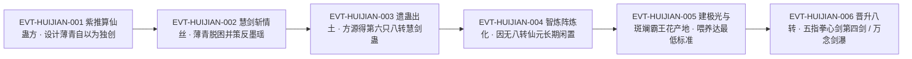

# 慧剑蛊

慧剑蛊是**薄青独创的八转剑道仙蛊**，也是全批里机制最"反直觉"的一只——它明明是飞剑一类的剑道仙蛊，作者给它的定义却是「这只仙蛊不单单是剑道仙蛊，更兼具智道之妙啊。」`E:V4-182518`。它的外形与用途完全不相称：`E:V4-182474` 写它「就像是一个气泡。飘飘荡荡，其貌不扬。」，而它承担的机制是「慧剑斩情丝」`E:V5-200006`——专门斩断爱情蛊留在人身上的智道道痕 `E:V5-200008`。

**本页的口径前置说明（重要）**：`roster-3.md` 给本 id 登记的锚点 `E:V4-182352` 是**章节题名行**——该行为「章节目录 第三百四十七节：八转慧剑蛊」，按本批契约，题名只能证明`该名在全书出现`，**不能作转数与机制的证据**。本页的转数与机制一律另取正文行：转数取证于 `E:V4-182478`、`E:V4-182516`、`E:V5-190076`、`E:V5-275166`，机制取证于 `E:V4-182518`、`E:V4-186806`、`E:V5-200004`、`E:V5-200008`。

全书出现「慧剑」共 **61 行 / 64 次**（含重复块、未去重），按最长匹配分类为：`慧剑仙蛊` 30 行 / 32 次、`慧剑蛊` 22 行 / 23 次、`慧剑斩情丝` 2 行 / 2 次、其余 7 次为列举中的裸称「慧剑」（`E:V5-209682`、`E:V5-240964`、`E:V5-241304`、`E:V5-273790`、`E:V5-292584`、`E:V5-299564`、`E:V5-303616`），四类同指一物，逐条账见《原著明确内容》。本页为 2026-09-28 A 线恢复批**新建页**，引文一律回根原文逐行复核，行号即 `E:V{段}-{6位行号}`（段号由行号机械推导）。

## 主题档案

### 一、本体与来历：为对付智道蛊仙而独创的八转剑道仙蛊

#### 原著事实

- 外形：「这只仙蛊外形很是简单。就像是一个气泡。飘飘荡荡，其貌不扬。」`E:V4-182474`
- 转数（正文首证）：「这竟然是一只八转剑道仙蛊！」`E:V4-182478`；同窗紧接着解释取出它的代价：「难怪把它勾出来，耗费了这么长的时间。」`E:V4-182480`
- 身份确认：「我想起来了！这只八转仙蛊，恐怕就是传闻中的那只慧剑蛊！」`E:V4-182516`
- 创制者与创制动机（说话人：方源）：「这只仙蛊，还是薄青独创。昔年，就算他战力出色。也吃了不少智道蛊仙的苦头，为了专门对付智道蛊仙，他就创造出了慧剑仙蛊。这只仙蛊不单单是剑道仙蛊，更兼具智道之妙啊。」`E:V4-182518`
- 道属（旁白）：「这只仙蛊，和态度蛊一样，同样是八转仙蛊。隶属于剑道，也可算是智道。」`E:V5-200004`；同口径另见 `E:V5-303618`
- 它在薄青手里的战略定位：「此蛊乃是薄青生前，防备智道手段的王牌。」`E:V4-183420`；失去之后的后果：「失去之后，更让仙僵薄青战斗起来，束手束脚，十分被动。」`E:V4-183422`
- 方源取蛊时的取舍：「想到这里，方源立即决定，将来他收服这些仙蛊时，必定首选此蛊！」`E:V4-182520`
- 转数的复述（段5 名单）：「这些剑道仙蛊分别是八转慧剑蛊，七转剑遁蛊，七转浪剑蛊，七转剑眉蛊七转飞剑蛊。」`E:V5-190076`

#### 合理推导

- **依据**：`E:V4-182478`、`E:V4-182516`、`E:V5-190076`、`E:V5-275166`；**结论**：慧剑蛊的**八转**在四个不同场景各有一处正文表述（未识出时的旁白惊叹、识出时的自我确认、段5 名单、段5 末的属性总结），四者一致，属高置信事实；**不确定性**：`E:V4-182352` 的题名行虽也含「八转慧剑蛊」，但按契约不计入证据。
- **依据**：`E:V4-182518`（薄青独创，动机是「吃了不少智道蛊仙的苦头」）＋`E:V4-183420`（「防备智道手段的王牌」）＋`E:V5-200004`（「隶属于剑道，也可算是智道」）；**结论**：慧剑蛊的设计目标是**智道**而不是剑道——它是"以剑道之形行智道之实"的针对性武器；**不确定性**：原文没有说明它面对**非智道**手段时的表现，全书也没有它正面压制某个智道蛊仙的战例（`E:V5-337252` 只是一句上一世的战绩自陈）。
- **依据**：`E:V4-186802`、`E:V4-186820`、`E:V4-187670`；**结论**：全书把慧剑蛊的诞生写成了一条**智道大宗师推算仙蛊方 → 诱导薄青"自以为独创" → 薄青真的炼成**的因果链，即薄青自己是不知道蛊方来源的；`E:V4-182518` 那句「还是薄青独创」是**方源的认知**，不是全知旁白；**不确定性**：`E:V4-182518` 与 `E:V4-186802` 在"谁是创制者"上口径不同，本页按`口径 A／口径 B`并列登记（见《待核对》），不强行统一。

#### 《问真》设计意义

- `本体是剑道、作用在智道`这条**双属**设定适合做成跨流派接口：一只蛊同时满足两种体系的装配条件，但效果只作用于其中一类目标。
- `创制者被设计成以为自己独创`这条因果链是极少见的**叙事型道具**：同一只蛊在"谁发明的"上天然带两套答案，适合做信息不对称的剧情钩子。

### 二、机制「慧剑斩情丝」：斩的是爱情蛊种下的智道道痕

#### 原著事实

- 机制名（独立成句）：`E:V5-200006`
- 机制的作用对象与效果（旁白）：「当初剑仙薄青就是用此仙蛊，斩去了爱情蛊种在他身上的智道道痕，挣脱束缚，重获自由。甚至凭此策反了灵缘斋仙子墨瑶，化为己用。」`E:V5-200008`
- 机制的评价：「这只慧剑仙蛊，可谓是助薄青反败为胜的妙手！」`E:V5-200010`
- 机制的能力边界（说话人：紫）：「不错。所谓慧剑斩情丝，此蛊纵然不敌九转爱情蛊，但实际上，我们只需要斩去青身上的爱情道痕而已。」`E:V4-186806`
- 蛊方来源与设计意图：「我推算出一道仙蛊方，能炼成慧剑仙蛊。」`E:V4-186802`
- 联动设计（把墨瑶一并拿下）：「一旦他动用之后，身上情丝被斩，就能恢复理智，重新归于我方。不仅如此，墨瑶身上情丝仍在，我们正可利用这点，将她纳为己用！」`E:V4-186808`
- 被斩对象的来头（说话人：紫）：「青之所以陷入情网，乃是灵缘斋镇派仙蛊爱情所致。此蛊高达九转，威力难以匹敌，青因此陷落，其实也怪不得他。毕竟他的剑道，并不完善，对付这种攻势，难有抵御之力。」`E:V4-186800`

#### 代价与收益（支付方／受益方／支付时点）

- **支付方**：催动者——八转仙元（`E:V5-200018`）；**受益方**：被"斩情丝"的**解蛊者**，而不一定是催动者本人——`E:V4-186808` 的原始设计里受益方是薄青（恢复理智）与紫一方（策反墨瑶），催动与受益因此分离；**支付时点**：每次催动即时支付，且需以八转仙元为硬性前提（`E:V5-292592`、`E:V5-292594`）。
- **能力的相对上限（原文明写）**：它「纵然不敌九转爱情蛊」`E:V4-186806`——即它并不与爱情蛊正面决胜，只在"斩去已种下的道痕"这一具体目标上有效。

#### 合理推导

- **依据**：`E:V4-186806`、`E:V4-186808`、`E:V5-200008`；**结论**：「慧剑斩情丝」是一条**定向解状态**机制而非攻伐机制——它不追求在法术对抗中压过九转爱情蛊，只完成"移除目标身上的爱情道痕"这一个动作，且这个动作能连带改变目标的立场（薄青回归、墨瑶可被纳为己用）；**不确定性**：原文写出的"情丝"实例只有爱情蛊这一种来源，全书未见它对其他流派种下的道痕是否同样有效；`E:V5-200008` 把它归为连同「挣脱束缚」的复合效果，本页不拆分其权重。另注：被斩对象的道属在原文有两种称谓——`E:V4-186806` 写`爱情道痕`，`E:V5-200008` 写`智道道痕`；本页两说并列、不裁定，详见《待核对》的 `[存在冲突]` 条。
- **依据**：`E:V4-186802`、`E:V4-186806`、`E:V4-186820`、`E:V4-187670`；**结论**：这条机制的存在本身是**一场骗局的一部分**——蛊方由紫推算出并设法让薄青"自以为独创"；**不确定性**：原文末段追述只到「知道了慧剑仙蛊的创始起因」`E:V4-187670`，未明写薄青是否在动用前就已知情。

#### 《问真》设计意义

- `不敌对手本体、但能定向清除对手留下的状态`是一条可独立实现的机制分支：强度上打不过九转爱情蛊，效果上却是它的唯一解。做成系统时宜把它实现为**状态移除器**而非伤害器。
- `受益方不是支付方`在本机制上是最有意思的一条：设计上可让第三方持有慧剑蛊、为他人解蛊，天然支持"持蛊者与受益者分离"的委托玩法。

### 三、催动的硬门槛：非本人的八转仙元不可

#### 原著事实

- 硬性规定（旁白）：「慧剑仙蛊是很正统的八转仙蛊，需要八转仙元催动。」`E:V5-200018`
- 更细的口径（旁白）：「催动慧剑仙蛊，需要本人的八转仙元。这是当初，紫山真君专为薄青设计的仙蛊。可惜方源目前也只有七转红枣仙元。」`E:V5-292592`；紧接着定性：「这是硬性规定，通融不得。」`E:V5-292594`
- 难度类比：「青提仙元若用来催动慧剑仙蛊，举个地球上的例子，就好像是给航空母舰安装一两节五号电池。」`E:V5-200016`
- 因此长期闲置：「可惜的是，慧剑仙蛊催动困难，非得是八转仙元。」`E:V5-275162`；「方源自身没有八转，产出不了八转仙元，只能作罢。」`E:V5-275164`
- 与其他八转仙蛊的对照（关键差异）：态度蛊「可以用心力催动，六转蛊仙就可以自由运用」`E:V5-200022`，而「慧剑仙蛊乃是正常的八转仙蛊，虽然是方源之物，但非得有八转仙元才可以催动。」`E:V5-275166`
- 失效记录：「有八转的慧剑仙蛊，但方源还没有八转仙元呢。」`E:V5-326276`；「数来数去，就只有慧剑仙蛊了。」`E:V5-292588`；「可惜的是，一直都使用不上。」`E:V5-292590`；「慧剑、似水流年，虽然暂时用不上，但高达八转，方源是绝不会拿去换的。」`E:V5-241304`；「有些仙蛊，比如慧剑，他还捉摸不透呢。」`E:V5-209682`
- 门槛解除后的回报：「渡过去，我成就八转，能够利用春、夏、慧剑三大八转仙蛊，战力飙升，光阴长河一战才有希望。」`E:V5-299564`；「还有之前的慧剑仙蛊也能够用上了。」`E:V5-299528`
- 正式的属性总结：`E:V6-377176`

#### 合理推导

- **依据**：`E:V5-200016`、`E:V5-200018`、`E:V5-275166`、`E:V5-292592`、`E:V5-292594`；**结论**：慧剑蛊的门槛是**双重的**——既要求持有者是八转，又要求催动的仙元是"本人的"八转仙元（不得转借）；`E:V5-292592` 还点明它「专为薄青设计」，即门槛带设计者意图，不是通用设置；**不确定性**：原文称其为难点，却未说明为什么"本人的"是硬性条件（是设计约束还是仙蛊性质），本页不代其定义。
- **依据**：`E:V5-200022`、`E:V5-275166`、`E:V5-241304`；**结论**：把态度蛊的"心力可催"与慧剑蛊的"非八转仙元不可"并置，是作者在八转档内部做的一次**规格对照**——同转数的仙蛊催动条件可以天差地别，因此"八转"不等于"同级战力"；**不确定性**：全书只给出态度蛊与慧剑蛊这一组对照，其他八转仙蛊（似水流年、魂兽令、悔蛊、春、夏等）的催动条件散落在不同窗口，未形成系统表。
- **依据**：`E:V5-209682`、`E:V5-292590`、`E:V5-299564`；**结论**：慧剑蛊在方源手中经历了**长约六段书的"闲置期"**（段5 中段得手 → 段5 末初次可用），其间它只有成本、没有产出；**不确定性**：原文给"捉摸不透"的解释很轻（`E:V5-209682` 只是一句自陈），看不出是理解不足还是资源不足。

#### 《问真》设计意义

- `同转数不同催动条件`是一条重要的平衡手段：以"本人八转仙元"这类**持有者绑定**替代单纯的高等级需求，可以让一件高阶道具长期处于"在手不可用"的状态，而不必削弱它的数值。
- `专为某人设计`的口径给产品留了选项：门槛可做成**可被推导／可被改写**的设计品，而不是先天法则。

### 四、喂养负担：斑斓霸王花与七转仙材级的供养

#### 原著事实

- 食料点名：「慧剑仙蛊需要的食料，是斑斓霸王花。」`E:V5-200024`；同一句在段5 后段被复述：「喂养慧剑仙蛊的食料，是斑斓霸王花。」`E:V5-241846`
- 食料规格：「这种花，极其巨大，每一朵成熟的斑斓霸王花，覆盖方圆上千里地。每朵花的成熟，需要大量的光照，浓郁的甜气，以及珍珠土。」`E:V5-200026`
- 与既有食料的量级比较：「流光果不过是六转仙材，但斑斓花却是七转。」`E:V5-200032`
- 种植条件（三要素，两处同口径）：「方源要大规模种植斑斓霸王花，需要三个条件。一个是光照，第二个是甜气，第三个是珍珠土。」`E:V5-200034`；`E:V5-241848`
- 长期未解决：「因为他新添的一些仙蛊，还未完成喂养的需求。态度蛊、慧剑蛊这些八转仙蛊，喂养是个大难题。方源只是制定了计划。初步执行了一部分，还未真正完全解决这些问题呢。」`E:V5-215922`
- `只开了个头`：「可惜，方源的八转仙蛊众多，态度蛊、慧剑蛊的食料，方源至今只是开了一个头，后续建设都未跟上。」`E:V5-217588`
- 拖累整体经营：「尤其是喂养仙蛊方面，慧剑仙蛊、态度仙蛊的喂养问题，仍旧没有解决，仍旧需要继续投入资金。」`E:V5-243306`
- 段5 后段的进展：「只要这两处地方建设好了，按照这种进度发展下去，那就能大概满足态度蛊、慧剑蛊的食料问题了。」`E:V5-273340`；「方源一共有三只八转仙蛊，其中似水流年蛊只是吞食光阴河水，喂养不是问题。态度蛊、慧剑蛊就难了。」`E:V5-273342`；最低标准：「方源算了一下，如此一来，他大概就能满足喂养态度蛊、慧剑蛊的最低标准了。」`E:V5-273524`
- 三只八转的喂养难度排序：「其余的六转、七转仙蛊，已经基本解决。难点在于态度蛊、慧剑蛊这两只八转仙蛊。」`E:V5-240994`；同窗另写爱意蛊与坚持蛊的食料反而好解决：「新得手的坚持蛊，食料是逆流河水，方源完全可以满足。爱意蛊的食物，和爱情蛊一样，都是希望和恐惧，方源也好解决，从宝黄天中收购大量希望蛊、恐惧蛊即可。」`E:V5-240996`

#### 合理推导

- **依据**：`E:V5-200024`、`E:V5-200026`、`E:V5-200032`、`E:V5-200034`；**结论**：慧剑蛊的喂养难点**不在稀有度而在规模与环境**——斑斓霸王花是七转仙材（比六转流光果高一档），单朵覆盖方圆上千里，且需要光照、甜气、珍珠土三项同时到位；**不确定性**：原文未给喂养周期、单次用量与"一朵够喂几次"，也未说明喂不饱的直接后果（对照浪迹天涯仙蛊则有「恐怕就要被饿死」的明文 `E:V4-125774`）。
- **依据**：`E:V5-240994`、`E:V5-240996`、`E:V5-273342`；**结论**：在方源的八转档里，喂养难度与**道属是否与本命流派匹配**正相关——似水流年（吞光阴河水）、坚持蛊（逆流河水）、爱意蛊（希望与恐惧）都可解，唯独态度蛊与慧剑蛊两只长期卡住；**不确定性**：原文把这两只并称难养，但没说它们难养的共同原因（是食料等级、是环境条件，还是八转仙蛊的普遍成本）。
- **依据**：`E:V5-273340`、`E:V5-273524`；**结论**：解决路径是**基建而不是采购**（先建极光、霸王花两处产地）；**不确定性**：`E:V5-273524` 只说到"最低标准"，未写是否最终完全解决。

#### 《问真》设计意义

- 把高阶仙蛊的成本做成**长期基建工程**（先建产地，再谈喂养）比做成一次性材料消耗更贴原文：它天然拉长了高阶道具的可用周期，也让"资源点建设"成为主线内容。
- `同档仙蛊之间喂养难度差三档`这一条支持在设计上给每只八转仙蛊单独配一条供养链，而不是共用一个"八转材料"。

### 五、二次开发：从闲置到五指拳心剑与万念剑瀑的核心

#### 原著事实

- 炼化归方源：「而现在慧剑仙蛊，已经被方源炼化，掌握在自己手中。」`E:V5-200012`；炼化手段：「换魂仙蛊、剑眉仙蛊、飞剑仙蛊、剑遁仙蛊，浪剑仙蛊，以及八转的慧剑仙蛊，都是智炼阵帮助方源炼成的。」`E:V5-199992`
- 突破八转后的第一次可用：「这只仙蛊本来就是五指拳心剑的核心之一，因此方源能够将五指拳心剑推上第四剑。」`E:V5-302288`
- 催动消耗随之抬高：「毕竟慧剑仙蛊乃是八转，催动它需要消耗白荔仙元。」`E:V5-303624`；而成效被评为：「不愧是八转仙蛊慧剑！」`E:V5-303616`；道属在该处被重申：「此蛊虽是剑道仙蛊，但和智道关系极其紧密。」`E:V5-303618`
- 以它为核心的新杀招：「好在方源也早有准备，改良了数个杀招，尤其是以慧剑仙蛊为核心的一招，将成为方源的主要手段。」`E:V5-337250`；「上一世，我单独运用慧剑仙蛊，就效果斐然。这一世有了杀招，掌控天相将会十分神速！」`E:V5-337252`
- 万念剑瀑：「万念剑瀑以慧剑仙蛊为核心，容纳了剑道的奥义，对付僵死意志远比单纯运用慧剑仙蛊要好得多。」`E:V5-338526`
- 解锁的时间点：「若是我能够将八转慧剑仙蛊调用起来，剑道杀招的威能就能晋升到八转层级了。」`E:V5-275160`

#### 合理推导

- **依据**：`E:V5-275160`、`E:V5-302288`、`E:V5-337250`、`E:V5-338526`；**结论**：慧剑蛊的用法是**先有杀招、后有用例**——它在方源手上长期闲置，一旦解锁就立刻接入三套体系（五指拳心剑、控天相的改良杀招、万念剑瀑），说明"以八转仙蛊为核"的杀招可以在蛊不可用时就先造好；**不确定性**：原文没写这些杀招在慧剑蛊解锁前能否以别的核心替代（对照飞剑蛊则有`剑遁取代飞剑`的明文推演）。
- **依据**：`E:V5-303624`、`E:V5-338526`、`E:V5-337252`；**结论**：解锁后的主要代价从"催不动"变成"催得起但很贵"——消耗白荔仙元且"投入就上涨了许多倍数"；**不确定性**：全书未给慧剑蛊单次催动的仙元数值。

#### 《问真》设计意义

- `长期闲置 → 一次性解锁 → 同时接入多套体系`是一条清晰的高阶道具节奏：产品的可预期收益可以在到手时就展示出来（知道它将来能干什么），但兑现被修为卡住。
- 「对付僵死意志」这类**只对特定目标类型高效**的用法（`E:V5-338526`）适合做场景化关卡设计，而不是通用数值提升。

### 六、命名边界与锚点：题名行、仙蛊式全称、裸称与近名同族

#### 原著事实

- **题名行**（必读口径）：`E:V4-182352` 为「章节目录 第三百四十七节：八转慧剑蛊」——按本批契约，题名只能证明该名在全书出现，**不作转数与机制证据**。
- **本名「慧剑蛊」**：22 行 / 23 次，首现 `E:V4-182516`。
- **仙蛊式全称「慧剑仙蛊」**：30 行 / 32 次，首现 `E:V4-182518`。
- **机制的固定词组「慧剑斩情丝」**：2 行 / 2 次——`E:V4-186806`、`E:V5-200006`。
- **裸称「慧剑」**：7 次，全部出现在与其他八转仙蛊并列的列举中（`E:V5-209682`、`E:V5-240964`、`E:V5-241304`、`E:V5-273790`、`E:V5-292584`、`E:V5-299564`、`E:V5-303616`）。
- **近名同族（同在薄青遗蛊名单里，但是不同个体）**：剑遁蛊「它形如金针蜜蜂」`E:V4-182404`、浪剑蛊 `E:V4-182386`、剑眉仙蛊 `E:V4-182356`、飞剑蛊 `E:V4-182394`；`E:V5-190076` 一句话把五只并列。
- **联动实体「爱情蛊」**：`roster-3.md` 的 `human_atk_5_02_gu`（爱情蛊，原文转 9）登记锚正是 **`E:V4-186806`——与本页「慧剑斩情丝」同一行**。该行同时给出两者的关系：「此蛊纵然不敌九转爱情蛊」。
- **同音近名「态度蛊」**：`roster-3.md` 的 `wisdom_atk_5_03_gu`，与慧剑蛊在段5 反复并称（`E:V5-199796`、`E:V5-200004`、`E:V5-209680`、`E:V5-227640`、`E:V5-273342`、`E:V5-292584`），但**催动条件相反**（`E:V5-200022` 对 `E:V5-275166`），是"同档不同规格"的对照实体。
- **游戏侧**：`game/data/gu_names.json` 只收录 `wisdom_atk_5_05_gu`「慧剑蛊」一个 id，无「慧剑仙蛊」条目。

#### 合理推导

- **依据**：`E:V4-182516`、`E:V4-182518`、`E:V5-190076`、`E:V5-275166`；**结论**：「慧剑蛊」与「慧剑仙蛊」是同一实体的两种字面形态（本名／仙蛊式全称），故本页把后者登记为别名；判据是同段交替与同窗共现（`E:V4-182518` 一句之内先写「慧剑仙蛊」再写「这只仙蛊」；`E:V5-275166` 与 `E:V5-273790` 指的是同一批八转蛊）；**不确定性**：原文没有一句显式等式，本判定属强相邻证据。
- **依据**：`E:V5-209682`、`E:V5-240964`、`E:V5-241304`、`E:V5-273790`、`E:V5-292584`、`E:V5-299564`、`E:V5-303616`；**结论**：裸称「慧剑」只在**与态度蛊、似水流年等并列**的语境出现，指本实体无疑；**不确定性**：裸称无法作为检索口径（若无`慧剑蛊``慧剑仙蛊`限定，会与任何含"慧剑"的复合词混淆）。
- **依据**：`E:V4-186806` 同时被 `roster-3.md` 用作爱情蛊的登记锚，且句内含「不敌九转爱情蛊」；**结论**：慧剑蛊与爱情蛊是**相邻但不相同**的两个实体，二者被同一条机制绑在一起（一个种情丝，一个斩情丝）；**不确定性**：爱情蛊的独立口径不属本页范围，本页只登记"同锚同窗"这一事实，两页的解读以各自页面为准。

#### 《问真》设计意义

- 本页是"题名行陷阱"的**实证案例**：`roster-3.md` 的登记锚落在题名行，而该行恰好与本名逐字相同，若不回正文，会得出"转数与机制都有据"的错误结论。建议在生成锚点时对「章节目录」前缀行做硬排除。
- `仙蛊式全称`在本页的频次高于本名（32 对 23），若检索只用本名会漏掉过半证据；别名归并是检索可用性的前置条件。
- 一只蛊与另一只蛊**共用同一行登记锚**（本页与爱情蛊）是批次内少见的形态，宜在校验阶段显式登记，避免被当作重复引用剔除。

## 状态时间线

| 状态 ID | 阶段 | 状态 | 证据 |
|---|---|---|---|
| ST-HUIJIAN-01 | 创制 | 薄青独创，为专对付智道蛊仙而作；兼具剑道与智道之妙 | E:V4-182518、E:V4-183420 |
| ST-HUIJIAN-02 | 外形与转数 | 形如气泡、飘飘荡荡、其貌不扬；八转剑道仙蛊 | E:V4-182474、E:V4-182478、E:V4-182516 |
| ST-HUIJIAN-03 | 机制 | 慧剑斩情丝：斩去爱情蛊种在他身上的智道道痕，挣脱束缚、重获自由，并策反墨瑶 | E:V4-186806、E:V5-200006、E:V5-200008 |
| ST-HUIJIAN-04 | 蛊方来源 | 由紫（智道大宗师）推算出仙蛊方，并设计让薄青自以为独创 | E:V4-186802、E:V4-186806、E:V4-186820、E:V4-187670 |
| ST-HUIJIAN-05 | 丧失与代价 | 仙僵薄青丧失慧剑蛊后战斗束手束脚；它本是薄青防备智道手段的王牌 | E:V4-183420、E:V4-183422 |
| ST-HUIJIAN-06 | 入手与炼化 | 方源取自沉眠薄青的第六只仙蛊，凭智炼阵炼化成自身之物 | E:V4-182472、E:V5-199992、E:V5-200012 |
| ST-HUIJIAN-07 | 催动门槛 | 需本人的八转仙元，属硬性规定；以七转仙元催动形同航母装五号电池 | E:V5-200016、E:V5-200018、E:V5-292592、E:V5-292594 |
| ST-HUIJIAN-08 | 喂养负担 | 食料为七转仙材斑斓霸王花，单朵覆盖方圆上千里，需光照、甜气、珍珠土三条件 | E:V5-200024、E:V5-200026、E:V5-200032、E:V5-200034 |
| ST-HUIJIAN-09 | 长期闲置 | 因无八转仙元长期用不上；与态度、似水流年并列为三大八转，方源不肯拿来换 | E:V5-209682、E:V5-241304、E:V5-292588、E:V5-292590、E:V5-275162 |
| ST-HUIJIAN-10 | 喂养进度 | 段5 前段未解决、只开了个头；段5 后段建成两处产地后可达最低标准 | E:V5-215922、E:V5-217588、E:V5-273340、E:V5-273524、E:V5-243306 |
| ST-HUIJIAN-11 | 解锁启用 | 成就八转得白荔仙元后可运用；接入五指拳心剑（推上第四剑）、万念剑瀑与控天相改良杀招 | E:V5-299564、E:V5-302288、E:V5-337250、E:V5-338526 |
| ST-HUIJIAN-12 | 拍卖场估值 | 单是经宝黄天输送八转慧剑蛊的手续费，即让方源积累的修行资源付之一空且远远不够 | E:V5-191374 |
| ST-HUIJIAN-13 | 登记锚复核 | roster-3 的锚点落在章节题名行，仅证明该名出现；转数与机制另取正文四行 | E:V4-182352、E:V4-182478、E:V5-190076、E:V5-275166 |

## 原著明确内容（本批取证窗口登记）

本批对「慧剑」在根原文全书扫描：**64 次命中 / 61 行**（含重复块，未去重）。分类账（按最长匹配，同一行可计入多项）：`慧剑仙蛊` 32 次 / 30 行；`慧剑蛊` 23 次 / 22 行；`慧剑斩情丝` 2 次 / 2 行；裸称 `慧剑` 7 次（`E:V5-209682`、`E:V5-240964`、`E:V5-241304`、`E:V5-273790`、`E:V5-292584`、`E:V5-299564`、`E:V5-303616`）。**4 类全部指同一实体，无子串误切、无同名异物**。两个高频形态的重复块计数差（32 对 30、23 对 22）来自同一行内出现两次的情形——`E:V5-227640` 与 `E:V5-275166` 各含两次。下表登记本批实际读取的窗口。

| 窗口 | 内容要点 | 用途 |
|---|---|---|
| 182350–182356 | **章节题名行「第三百四十七节：八转慧剑蛊」**（仅定位，不作 E-ID 证据）；同窗为剑眉仙蛊外形 | 主题六（锚点口径） |
| 182470–182480 | 第六只仙蛊外形（气泡）、其貌不扬、八转剑道仙蛊、「难怪把它勾出来，耗费了这么长的时间」 | 主题一 |
| 182514–182522 | 确认即传闻中的慧剑蛊；薄青独创、为对付智道蛊仙、兼具智道之妙；方源决意首选此蛊 | 主题一 |
| 183418–183422 | 薄青丧失慧剑蛊后束手束脚；「防备智道手段的王牌」 | 主题一 |
| 186798–186810 | 爱情蛊高达九转令薄青陷落；紫推算仙蛊方；「慧剑斩情丝」的能力边界；策反墨瑶的联动设计 | 主题二 |
| 186818–186822、187666–187672 | 薄青日后确炼出慧剑仙蛊；方源得知创始起因 | 主题一（蛊方来源） |
| 190074–190086 | 段5 剑道仙蛊名单（八转慧剑蛊等五只）；宝黄天交易 | 主题一、六 |
| 191372–191376 | 宝黄天输送八转慧剑蛊的手续费即付之一空且远远不够 | 主题四（成本旁证） |
| 199790–200036 | 仙蛊清点；智炼阵炼成慧剑仙蛊；喂养打算开始；道属（隶属剑道也可算智道）；慧剑斩情丝机制；催动门槛与航母类比；食料斑斓霸王花与三条件；与态度蛊的规格对照 | 主题二、三、四 |
| 209678–209686 | 三只八转仙蛊并列；「比如慧剑，他还捉摸不透呢」 | 主题三、六 |
| 215918–215924、217584–217590 | 八转仙蛊喂养是大难题、只开了个头 | 主题四 |
| 227636–227644 | 八转三蛊并列；慧剑蛊需八转仙元、似水流年有吸引太古年兽的弊端 | 主题三、六 |
| 240960–240998 | 清点八转（态度、慧剑、似水流年封印中）；难点在态度与慧剑；爱意与坚持食料可解 | 主题四、六 |
| 241300–241308 | 慧剑与似水流年暂时用不上但绝不拿去换 | 主题三 |
| 241840–241848 | 喂养慧剑仙蛊的食料是斑斓霸王花；三条件 | 主题四 |
| 242846–242854 | 卜卦龟背蛊与态度、慧剑、剑遁、飞剑并列比较 | 主题六 |
| 243300–243308 | 慧剑仙蛊、态度仙蛊的喂养问题仍未解决，仍须继续投入资金 | 主题四 |
| 256506–256512 | 紫称「我已想到一个方法，就是炼出慧剑仙蛊」 | 主题一（蛊方来源旁证） |
| 273336–273344 | 两处产地建成后可大概满足态度蛊、慧剑蛊的食料问题；似水流年喂养不是问题 | 主题四 |
| 273518–273528 | 慧剑蛊暂放仙窍外；可达喂养的最低标准 | 主题四 |
| 273788–273792 | 八转三大蛊虫（态度、慧剑、似水流年）与七转清单 | 主题六 |
| 275158–275168 | 剑道杀招威能受限于八转慧剑不可用；催动需八转仙元；八转仙蛊的属性总结 | 主题三、五 |
| 292580–292594 | 八转四蛊；只有慧剑可用却催不动；需要本人的八转仙元（紫山真君专为薄青设计）；硬性规定通融不得 | 主题三 |
| 299524–299566 | 升八转后可动用春、夏、慧剑三大八转仙蛊；光阴长河一战的前提 | 主题三、五 |
| 302284–302292 | 五指拳心剑以慧剑仙蛊为核心之一，推上第四剑 | 主题五 |
| 303614–303626 | 「不愧是八转仙蛊慧剑」；剑道仙蛊但与智道关系紧密；消耗白荔仙元、投入上涨多倍 | 主题五 |
| 309852–309858、323846–323856 | 八转蛊清点（五只含慧剑蛊） | 主题六 |
| 326272–326280 | 有八转慧剑仙蛊但方源还没有八转仙元 | 主题三 |
| 337246–337254 | 以慧剑仙蛊为核心的改良杀招；「上一世，我单独运用慧剑仙蛊，就效果斐然」 | 主题五 |
| 338522–338530 | 万念剑瀑以慧剑仙蛊为核心，对付僵死意志远优于单用 | 主题五 |
| 377170–377180 | 段6 八转仙蛊清单含慧剑蛊 | 主题六（跨段旁证） |

题名行说明：本页命中中的 `E:V4-182352` 是章节目录题名行，本页**只把它当`该名在全书出现`的存在性证据**，不作转数与机制依据；转数与机制全部另取正文行（见 `ST-HUIJIAN-13`）。

## 事件链

| 事件 ID | 事件 | 参与者 | 证据 | 因果 |
|---|---|---|---|---|
| EVT-HUIJIAN-001 | 剑仙薄青因爱情蛊（灵缘斋镇派仙蛊，高达九转）陷入情网；智道大宗师紫推算出一道能炼成慧剑仙蛊的仙蛊方，并设计让薄青自以为独创 | 薄青、紫（紫山真君）、墨瑶 | E:V4-186800、E:V4-186802、E:V4-186806、E:V4-186820 | evidences ST-HUIJIAN-01、ST-HUIJIAN-04 |
| EVT-HUIJIAN-002 | 薄青动用慧剑蛊斩去身上的爱情道痕，挣脱束缚重获自由，并凭此策反灵缘斋仙子墨瑶化为己用 | 薄青、墨瑶 | E:V4-186808、E:V5-200008、E:V5-200010 | evidences ST-HUIJIAN-03 |
| EVT-HUIJIAN-003 | 义天山／智道传承一线：仙僵薄青丧失慧剑蛊后战斗束手束脚；方源自其躯壳逐只钓出遗蛊，第六只即八转慧剑蛊 | 方源、仙僵薄青 | E:V4-182472、E:V4-182478、E:V4-182516、E:V4-183420、E:V4-183422 | evidences ST-HUIJIAN-05、ST-HUIJIAN-06 |
| EVT-HUIJIAN-004 | 方源凭智炼阵炼化慧剑仙蛊为自身之物，随即着手喂养；因只有七转仙元，此蛊长期闲置，喂养成为与态度蛊并列的最大难题 | 方源 | E:V5-199992、E:V5-200002、E:V5-200012、E:V5-200018、E:V5-215922 | evidences ST-HUIJIAN-06、ST-HUIJIAN-07、ST-HUIJIAN-09 |
| EVT-HUIJIAN-005 | 段5 后段建成极光与斑斓霸王花两处产地，喂养问题看到解决希望并达到最低标准 | 方源 | E:V5-273336、E:V5-273340、E:V5-273524 | evidences ST-HUIJIAN-10 |
| EVT-HUIJIAN-006 | 方源晋升八转、得白荔仙元，慧剑仙蛊首次可用：接入五指拳心剑推上第四剑，另创以它为核心的控天相改良杀招与万念剑瀑 | 方源 | E:V5-299564、E:V5-302288、E:V5-303616、E:V5-337250、E:V5-338526 | evidences ST-HUIJIAN-11 |

事件口径：本页沿用实体簇号 `EVT-HUIJIAN-*`（与 `ST-HUIJIAN-*` 同簇）。事件节点 6 个，已达`≥3 节点应配图`的阈值，故配 mermaid 主干。EVT-HUIJIAN-005 与 EVT-HUIJIAN-006 之间**无原文因果**（喂养与晋升互为独立条件），故连线只表示时间先后，不代表前者导致后者。

## 资料整理

本页为**新建页**，没有旧版；本批来源只有根原文，没有 `notes:`／`memory:` 层转述进入本页事实区。相关派生记录的处置登记如下（**本段内容不得当作原著事实**）：

- `lore/wiki/gu/roster-3.md` 的 `wisdom_atk_5_05_gu` 条目记为 `| wisdom_atk_5_05_gu | 慧剑蛊 | 5 | 8 | E:V4-182352 |`。本页复核结论：**登记锚 `E:V4-182352` 是章节题名行**（「章节目录 第三百四十七节：八转慧剑蛊」），只能证明该名出现；原文转 8 与正文一致（`E:V4-182478`、`E:V5-190076`、`E:V5-275166`）。本页只登记，不改该页。
- 同文件 `human_atk_5_02_gu`（爱情蛊）的登记锚为 `E:V4-186806`，**与本页「慧剑斩情丝」同一行**。该行的原文是紫对慧剑蛊机制的说明，句内含「此蛊纵然不敌九转爱情蛊」；两页共用一行锚点不构成冲突，本页只登记该事实。
- 同文件 `wisdom_atk_5_03_gu`（态度蛊）与 `wisdom_gu`／`wisdom_atk_1_01_gu`（智慧蛊）为**不同实体**，与慧剑蛊只有段5 并称的关系；本页不把态度蛊或智慧蛊写入 aliases。
- `game/data/gu_names.json` 只收录 `wisdom_atk_5_05_gu`「慧剑蛊」一个 id，无「慧剑仙蛊」条目；`game/**` 只读，不在本批改动范围。
- 本页不声明桥接层 canon 字段、不新建桥接层 canon 编号（本轮口径：Canon 权威已在本 Wiki，桥接层文件只作消费层，本批不引用）。

## 分析与解读

以下为归纳，不是原文（须与上文`原著事实`区分）：

1. **它是全批唯一"机制与本体流派不一致"的实体**：本体是剑道仙蛊（`E:V5-200004`、`E:V5-303618`），机制作用在情感／智道侧（`E:V5-200008`）。因此任何按流派归类的图鉴都会把它放错位置。
2. **它的强度不体现在战斗，而体现在"解状态 + 改立场"**：`E:V4-186808` 一句同时写了解除与策反，这在书中是罕见的"一只蛊改变两个对手立场"的记录。
3. **它的催动门槛比它的机制更常被提及**：全书 13 行状态里有 5 行专门讲"用不了"（`E:V5-209682`、`E:V5-275162`、`E:V5-292590`、`E:V5-241304`、`E:V5-326276`）。这只蛊在方源手里最长的状态是**闲置**，这本身是该实体的主要叙事特征。
4. **它和爱情蛊互为一组对偶**：爱情蛊种情丝（九转，`E:V4-186800`），慧剑蛊斩情丝（八转，`E:V5-200008`），两者共用 `E:V4-186806` 这一行锚点。做机制对照时必须成对使用，单看一只会漏掉"种—斩"关系。
5. **题名行陷阱在本页最容易被触发**：本名「慧剑蛊」与题名行逐字相同，若不拼音节来源就回正文，会同时得到错的转数依据和错的机制依据。本页因此把 `ST-HUIJIAN-13` 单列一行登记该口径。

## 待核对

- `[存在冲突]` **被斩道痕的道属：口径 A（`爱情道痕`）对口径 B（`智道道痕`）**——口径 A：`E:V4-186806`「我们只需要斩去青身上的爱情道痕而已」（说话人：紫），称`爱情道痕`；口径 B：`E:V5-200008`「斩去了爱情蛊种在他身上的智道道痕，挣脱束缚，重获自由」（旁白），称`智道道痕`。当前状态：原文对同一对象给出两种称谓，二者不见于同一行，本页两说并列、**不裁定**；另见主题二《合理推导》的指针对照。
- `[存在冲突]` **创制者口径：口径 A（方源认知）对口径 B（作者追述）**——口径 A：`E:V4-182518`「这只仙蛊，还是薄青独创。昔年，就算他战力出色。也吃了不少智道蛊仙的苦头，为了专门对付智道蛊仙，他就创造出了慧剑仙蛊。」（说话人：方源，出自他读取智道传承后的推论）；口径 B：`E:V4-186802`（紫「我推算出一道仙蛊方，能炼成慧剑仙蛊。」）、`E:V4-186806`（紫设计让薄青「自以为是自己创造了这个全新的仙蛊方」）、`E:V4-186820`、`E:V4-187670`（方源后来「知道了慧剑仙蛊的创始起因」）。当前状态：两处各对应一种设计选项——口径 A 支持"妖怪独创"的图鉴叙事，口径 B 支持"蛊方是可被第三方推算并栽赃的"这条机制线；本页并列登记，不强行统一。
- `[待取证]` **喂不饱的后果**：慧剑蛊的食料与种植条件都有明文（`E:V5-200024`–`E:V5-200034`），但全书未写"喂不上"会发生什么（对照浪迹天涯仙蛊则有「恐怕就要被饿死」`E:V4-125774`）。属`尚未找到`，**不得写成`原著没有`**。
- `[原著未明确]` **单次催动的仙元数值与「慧剑斩情丝」的生效条件**：机制 [已确认]（须耗白荔仙元，且"需要本人的八转仙元"是硬性规定 `E:V5-292592`、`E:V5-292594`）；具体数值 [待取证]——`E:V5-303624` 只说耗白荔仙元、投入上涨多倍，未给数值；`E:V4-186806` 只说「我们只需要斩去青身上的爱情道痕而已」，未写需要接触、需要多久、是否可对他人施用。
- `[原著未明确]` **对非爱情蛊来源的道痕是否有效**：全书写出的"情丝"只来自爱情蛊（`E:V4-186800`、`E:V5-200008`），未写它对其他流派种下的道痕是否同样可斩。
- `[原著未明确]` **它对非智道目标的表现**：`E:V4-182518` 说它是为对付智道蛊仙而造，但全书没有它与某个智道蛊仙的正面对局实例；`E:V5-337252` 是方源对上一世的战绩自陈，不是战例记录。
- **检索口径结论（非待取证，已在本批查尽）**：**「慧剑」是否另有独立实体**——本批以最长匹配遍历全部 64 次命中，四类（慧剑仙蛊、慧剑蛊、慧剑斩情丝、裸称慧剑）**全部指同一实体**，未发现同名异物。此结论的检索口径为：全文逐行 `in` 判定 + 最长匹配归类，含重复块、未去重。
- `[存在冲突]` **roster-3 锚点为题名行（Wiki 内部，非原文冲突）**：`roster-3.md` 把 `E:V4-182352` 记为本 id 锚点，该行是章节目录题名；本页把题名证据与正文证据分开登记（`ST-HUIJIAN-13`），不改他页。
- **体量登记**：已超 40 KB（落盘实测 42,553 字节；按 1 KB=1000 B 计超 40 KB），按 GOVERNANCE 登记例外；**未为压体积删除任何有效知识**（本页的 64 次命中分类账、13 行状态与 6 个事件节点均保留）。
- 2026-09-28：本页按 id 引用 roster-3，不以其行号定位（行号会随该文件增改位移）。

## 模板扩展建议（只登记，不改核心模板）

1. **`题名行锚点`应在模板层做机械拦截**：契约已规定题名只作存在性证据，但 roster 侧仍会生成这类锚点（本页与已点名的天妒仙蛊、悔蛊、血滴子、古铜皮蛊、星念蛊等同批皆为同一形态）。建议在锚点生成阶段直接剔除前缀为「章节目录」的行。
2. **`同一行服务两个实体`需要登记位**：本页与爱情蛊共用 `E:V4-186806`。现有页面结构没有"共享锚点"的表达位置，只能写进《资料整理》与主题六。
3. **`本体流派／机制流派不一致`需要独立字段**：慧剑蛊是本批唯一双属实体，`tags` 里只能平铺 sword-path 与 wisdom-path，无法表达"作用域在智道、载体在剑道"的差别。建议允许在 description 之外给出"载体属／作用属"两栏（本页已在正文内说明，模板无字段）。
4. **`心理状态强度`需要独立于`状态词`的表达位**：13 行状态里有 5 行是"用不了／闲置"，而现有六态词表没有"实体在手但长期不可用"这一档，本页只能靠 `ST-` 行的文字承载。建议把`持有但不可用`列为可选词（不改本轮词表，只登记需求）。

## 关联页面

[剑道](../world/sword-path.md)、[智道](../world/wisdom-path.md)、[情道](../world/emotion-path.md)、[杀招连招并招体系](../rules/killer-moves.md)、[炼蛊与杀招链](../world/gu-refine-killer-chain.md)、[蛊的饲养与炼化](../world/gu-care-and-refinement.md)、[真元](../world/primeval-essence.md)、[修炼体系](../world/cultivation-system.md)、[道痕](../rules/dao-marks.md)、[蛊虫关系](gu-relations.md)、[蛊虫总表](roster.md)、[蛊虫总表三期](roster-3.md)、[蛊虫与蛊师能力来源](cultivator-effects-and-scouting.md)、[飞剑蛊](sword-atk-5-02-gu.md)、[爱情蛊](human-atk-5-02-gu.md)、[智慧蛊](wisdom-gu.md)、[方源](../characters/fang-yuan.md)、[义天山大战](../events/yitian-mountain.md)、[逆流河](../events/reverse-flow-river.md)
