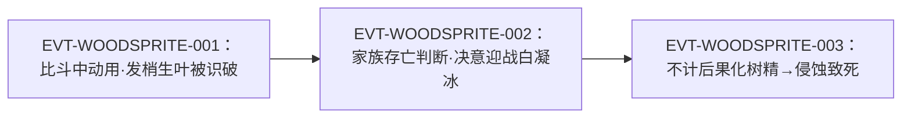

# 木魅蛊

**三转**功能蛊：使用了它就能**化身为树精**（"所谓木魅，就是树精"），而树精「能直接汲取天地中的元气，化为己用」——蛊师由此获得**不需要分心的真元自补**，故"最擅长持久战"，原文给出的量级是**战斗时间能暴涨三倍**。它对**木行蛊**有增幅，但代价同样明确：用久了肌肉木化、意识被侵蚀，**最终变成一株死去的树人**。它的晋升路线与[寿蛊](heaven-atk-5-07-gu.md)强绑定，是原文点名的"天底下最奢侈的晋升路线之一"。

本页为 2026-09-28 A 线恢复批**新建页**。本批把"木魅蛊"在根原文的 25 处出现逐行复核，并把**增幅边界**（木行蛊受益、月旋蛊受损对照）与**代价机制**拆成独立主题。所有引文回根原文 `source/蛊真人-clean.txt`，行号即 `E:V{段}-{6位行号}`；正文按“原著事实 → 合理推导 →《问真》设计意义”三层组织。

## 主题档案

### 一、机制：化身树精、从空气中汲取天地元气自补真元

#### 原著事实

- 定义与用途：「所谓木魅，就是树精」`E:V1-021000`；「使用了木魅蛊，就能化身为树精，进行战斗」`E:V1-021002`。
- 树精与蛊师的差别：「树精是很奇特的生灵。它能直接汲取天地中的元气，化为己用」`E:V1-021004`；「而蛊师是不行的，只能运用空窍中的真元」`E:V1-021006`。
- **自补真元**：「一旦使用了木魅蛊，化身为木魅树精，蛊师就能直接从空气中汲取天地元气，补充自身真元。等若是汲取元石中的天然真元」`E:V1-021008`。
- **关键的"不占心神"**：「寻常蛊师战斗的时候。不可能分出心神来，一边战斗一边汲取元石中的天然真元」`E:V1-021010`；而化树精后「汲取天地元气就是一种本能，根本不需要分心」`E:V1-021012`。
- **量级明文**：「这就意味着，使用木魅蛊的蛊师，最擅长持久战。」`E:V1-021012`；「真元虽然谈不上取之不尽用之不竭，但因为有着不断地补充，导致战斗时间能暴涨三倍！」`E:V1-021012`。
- 实战中的印证：「周围丰富的天然元气，让他有了源源不断的真元可以使用。这就是木魅蛊的厉害之处」`E:V1-023858`；白凝冰亦看出「树精木魅可以直接利用空气中的元气，难怪古月青书的真元如此充沛」`E:V1-023926`。

#### 合理推导

- **依据**：`E:V1-021008`（等同"汲取元石中的天然真元"）＋`E:V1-021010`（正常蛊师做不到边打边吸）；**结论**：木魅蛊的收益不是"真元上限变高"，而是**把"补真元"这个动作从操作层面抹掉**——它的价值在于**不占行动**，这与[酒虫](wine-insect-gu.md)一类的"元进程"收益是两种不同的机制；**不确定性**：原文只说"等若汲取元石"，未给每秒回复速率。
- **依据**：`E:V1-021012`（"暴涨三倍"）；**结论**：这是原文为战斗续航给出的**唯一量化收益**，可直接作为系统参数；**不确定性**："三倍"的基准（相对何种战斗时长）原文未定义。

#### 《问真》设计意义

- 这是一条**"资源再生替身"**路线：把稀缺资源（真元）的再生写在环境上，而不是写在库存上。做系统时表现为"战斗中被动回复，且不消耗行动"——它的强度完全由"回复速率 vs 对手爆发"决定，与"三倍战斗时长"这条原文量级天然对齐。

### 二、化身形态与可见迹象

#### 原著事实

- **早期迹象（尚未变身）**：青书的头发上「已经长出了一两片新鲜翠绿的树叶」`E:V1-020996`，原文注明「这正是使用了木魅蛊的一个迹象」`E:V1-020998`。
- 变身的开端：「三转蛊虫的力量下，青书的双眼变成了翠绿之色」`E:V1-023786`；「他的气息陡变。从活泼的人气，转变成了深幽静谧的森林气息」`E:V1-023788`。
- **外观演变的完整描写**：「古月青书的双耳开始变得修长起来，他的长发变成了翠绿色，一片片绿叶在发梢中生长出来。」`E:V1-023846`；「他的双手，也从正常血肉的鲜活之色。变得黯淡内敛。」`E:V1-023846`；「他的浑身皮肤开始变硬，变成了褐色的树皮。」`E:V1-023846`。
- 伤口的异常愈合：「在衣服破开的洞口中，他可以清晰地看到青书的伤口，显露出树木的纹理，然后以肉眼可见的速度愈合起来。」`E:V1-023844`；「在新长成的肌肤上，形成一个树木的年轮纹路」`E:V1-023844`。
- 完全体：「他已经面目全非，原先清秀柔和的人脸已经完全转变成尖鼻巨眼的树精之脸」`E:V1-023918`；「他高达三米。身躯粗壮无比，褐色的树皮厚重如铠甲，上面覆盖着大片的绿叶和藤蔓」`E:V1-023920`。
- 原文自身对"迹象"的定性：「这还是他第一次如此不计后果地使用木魅蛊」`E:V1-023848`——即前述迹象属**轻度使用**，与"不计后果"的重度使用同属一蛊。

#### 合理推导

- **依据**：`E:V1-020996`、`E:V1-020998`（发梢生叶）与 `E:V1-023846`、`E:V1-023920`（整体树化）；**结论**：木魅蛊的变身是**渐进**的，而且**早期就有可被他人识别的外部迹象**——这意味着它在叙事上是"藏不住的蛊"；**不确定性**：原文未给从生叶到三米树精的时间刻度（`E:V1-023844` 用的是"肉眼可见的速度"，指伤口愈合而非整体变身）。

#### 《问真》设计意义

- "变身有可被观察的早期迹象"是一条现成的**信息博弈**机制：对手可以通过外观判断你是否已经开了木魅蛊，从而决定是否抢先爆发。这比"状态图标只有自己看得见"更贴原文。

### 三、增幅对象与增幅边界：木行蛊受益，且受环境元气浓度限制

#### 原著事实

- **增幅的明文**：「同时一旦化为树精，对青藤蛊、松针蛊之类的蛊虫，也有一种增幅的作用」`E:V1-021014`。
- **反面对照（同句并列）**：「他的身上，月旋蛊没有变化，但是青藤蛊、松针蛊以及生机叶，都传来欣欣向荣之意」`E:V1-023856`；紧随其后「当青书以树精的身份，再催动这些木行蛊虫时，它们的威力也将得到增幅！」`E:V1-023856`。
- **增幅的来源被限定在"能感应元气的生命"**：「这些元气。正常的蛊师都感应不到。唯有树精等等特殊的生命，才能感应，并且吸收运用」`E:V1-023852`。
- **环境上限（增幅会被吸干）**：「不是古月青书不想催动青藤蛊，生长出更多的青藤。而是周围空气中的天然元气，几乎已经被他吸收殆尽了」`E:V1-024054`；「虽然在更外围，空气中的元气正在向此处弥漫，但微薄的元气含量终究满足不了青藤蛊的需求」`E:V1-024056`。
- 对照实例：同一战场上的白凝冰以**北冥冰魄体**获得真元恢复，原文把两者并置比较 `E:V1-023872`、`E:V1-024000`。

#### 合理推导

- **依据**：`E:V1-023856` 把"月旋蛊没有变化"与"青藤蛊、松针蛊以及生机叶欣欣向荣"写在**同一句**里；**结论**：增幅的条件是**木行道属**，月旋蛊被原文用作**反面对照**；**不确定性**：原文未给月旋蛊的道属名称（"月系／光道"是 Wiki 归类用语，不是原文词）。
- **依据**：`E:V1-024054`、`E:V1-024056`；**结论**：木魅蛊的"无限真元"是**局部环境资源**而非个人属性——同一片空域的元气是**有限且可被耗尽**的，补充速度受外围浓度限制；**不确定性**：原文未给元气回复速度，也未写是否与地点（森林／荒原）相关。
- **代价三要素（增幅部分）**：**支付方**＝环境（局部天地元气被抽走，且需要时间回填）；**受益方**＝使用者与其木行蛊；**支付时点／生效条件**＝变身状态下催动木行蛊时即时生效，但**受当前空域元气存量限制**。依据：`E:V1-021014`、`E:V1-023856`、`E:V1-024054`。

#### 《问真》设计意义

- **"增幅只作用于同标签"**是本主题最可直接落地的规则：原文用一句话把"木行蛊受益／月旋蛊不受益"钉死，因此"所有己方蛊一起变强"的写法在原著里是**没有依据**的。
- **"元气是场地资源"**给出了另一条更少见的机制：续航不是无限的，长时间高强度使用会**耗尽局部场地**，迫使玩家转移战场。这条可直接做成地形/资源系统。

### 四、代价与使用纪律：木化、意识侵蚀、"必须搭配"

#### 原著事实

- **缺陷明文**：「木魅蛊虽然强大，但是亦有缺陷。那就是蛊师每一次使用的时间，不能太久。」`E:V1-021030`；「太久了，木魅蛊的力量就会影响蛊师的身躯，使得肌肉木化，最终变成一具树人尸体。」`E:V1-021030`；「前世的古月青书，就是这样死的」`E:V1-021030`。
- **死亡过程的实写**：「木魅蛊的力量侵蚀了他的全身，他即将迈入死亡」`E:V1-024026`；「木魅蛊的力量已经彻底侵蚀了古月青书的身体，并且开始侵蚀他的意识」`E:V1-024058`；「他已经看不到了，木魅蛊的力量早就侵蚀了他的双眼，也听不到了，他的耳朵也形同虚设」`E:V1-024066`。
- **危机感的自陈**：「如果他贪恋这种强大而又舒服的感觉，毫无节制地使用木魅蛊的话，那么他最终他将变成一株死去的树人」`E:V1-023862`。
- **对手的当众点破**：「青书。你如此使用木魅蛊，就不怕化为一株死去的树人吗？就算你战胜了我又如何呢？你也注定了死亡！」`E:V1-023928`。
- **使用纪律（明文通则）**：「就像是僵尸蛊、木魅蛊，必须搭配一些其他的蛊虫一齐使用。否则单个用久了的话，蛊师的身躯就会受到侵蚀，变成真正的僵尸或者树人」`E:V1-021360`；同段通则「一般强大的蛊虫，弊端也会很大，需要和其他的蛊虫搭配起来使用。否则的话，会对蛊师本身产生不利的影响」`E:V1-021034`。
- **青书本人未遵守该纪律**：原文强调这是他「第一次如此不计后果地使用」`E:V1-023848`。

#### 合理推导

- **代价三要素（侵蚀部分）**：**支付方**＝使用者本人（身躯→木化、感官→丧失、意识→被侵蚀）；**受益方**＝使用者本人与其家族（`E:V1-023550`、`E:V1-024662` 两处都把胜负与家族存亡挂钩）；**支付时点／生效条件**＝**持续性代价**，随"每一次使用的时间"累积，且**一旦开始侵蚀不可逆**（`E:V1-024058`、`E:V1-024066` 显示侵蚀从身体推进到意识与感官）。依据：`E:V1-021030`、`E:V1-023862`、`E:V1-024026`。
- **依据**：`E:V1-021360`（"必须搭配"）＋`E:V1-023848`（青书没有搭配）；**结论**：原文给出的**规避途径是"搭配其它蛊虫"**，而青书的死正是**违反该纪律**的结果——这是一组"规则＋反例"的完整证据；**不确定性**：原文未写需要搭配的具体是哪种蛊、搭配后又如何抵消侵蚀。
- **依据**：`E:V1-021030`（"前世的古月青书，就是这样死的"）；**结论**：这条代价在**前世与今生重复发生**，说明它不是偶发意外而是**机制必然**；**不确定性**：无。

#### 《问真》设计意义

- 这是"高收益＋不可逆累积代价"的原著样板，且**代价的扣减项写在感官与意识上**（先失明、再失聪、再意识恍惚），做出来就是一条渐进的失控曲线，而不是单纯的掉血。
- 原文还直接给出了**缓解途径**（搭配其它蛊虫），因此代价不是纯粹的数值惩罚，而是一条可以被构筑回答的约束。

### 五、晋升路线：与百年／千年寿蛊合炼，"天底下最奢侈的晋升路线之一"

#### 原著事实

- **晋升明文**：「它是三转蛊，需要和百年寿蛊合炼，晋升为四转百年木魅。再和千年寿蛊合炼，成为五转千年木魅」`E:V1-021016`。
- **路线的名声与冷门**：「这个合炼的秘方，众所皆知，流传极广，但绝少有蛊师用上这个秘方」`E:V1-021016`；方源对其定性为「木魅蛊的合炼晋升，可以说是天底下最奢侈的晋升路线之一」`E:V1-021016`。
- **冷门的原因**：「皆因寿蛊更加珍贵，寻到了寿蛊，通常蛊师都是直接用了，增长自身的寿命」`E:V1-021016`。
- 寿蛊的稀缺性另见 [寿蛊](heaven-atk-5-07-gu.md)（"寿蛊珍稀无比，为世人所共求"`E:V1-021024`）。

#### 合理推导

- **依据**：`E:V1-021016`（四转／五转的合炼材料分别是百年寿蛊与千年寿蛊）；**结论**：这条路线把"寿命"当作**可消耗的进阶资源**，与"直接吃掉寿蛊延寿"构成**互斥取舍**；**不确定性**：原文未给合炼成功率，也未写"百年木魅／千年木魅"的效果是否随档位增强。
- **代价三要素（晋升部分）**：**支付方**＝使用者（消耗可续命的寿蛊）；**受益方**＝使用者（获得四转／五转的战力）；**支付时点／生效条件**＝**合炼时一次性支付**，且需要先有三转木魅蛊 + 对应档位的寿蛊。依据：`E:V1-021016`。

#### 《问真》设计意义

- 这是一条天然的**"寿命换战力"**构筑轴：同一件材料（寿蛊）既可以是延寿的保命牌，也可以是晋阶的燃料，两者的机会成本由原文直接给出。做数值时这条轴的强度基准就是"你愿意放弃多少年寿命"。

### 六、战例：青书以三转之身越级挑战白凝冰（与霜妖蛊对照）

#### 原著事实

- 出战动机（家族存亡）：「白家寨的崛起，完全是因为白凝冰的缘故。如果把白凝冰杀死，那么我古月一族仍旧将是青茅山的第一家族！」`E:V1-023550`；「但是我有木魅蛊，完全有能力和三转蛊师战斗」`E:V1-023550`。
- **越级能力的明文**：「古月青书如果不计后果地动用木魅蛊，比一般的三转蛊师都要强大得多，有越级挑战的能力」`E:V1-023556`。
- 同级的定性：「古月青书也能做到，是因为有木魅蛊这只强大而又特殊的三转蛊虫」`E:V1-024662`。
- 战况的一个细节：白凝冰的**北冥冰魄体**真元恢复虽快，但「三转修为时的回复速度，比木魅直接提用天然元气的效果，还是稍微差了一筹」`E:V1-024000`。
- **对照组（霜妖蛊）**：「此蛊可以媲美木魅蛊，能令人化身霜妖。但是使用时间过长，也会令蛊师生命之火熄灭。化为一座冰人雕塑」`E:V1-024242`；白凝冰亦当场承认「这种蛊可比我的霜妖蛊难炼多了！」`E:V1-023924`；但白凝冰「从未像古月青书一样，彻底使用过霜妖蛊」`E:V1-024244`。
- 事后评价（方源视角）：「木魅蛊的威力他在前世，也是亲眼所见」`E:V1-024104`。

#### 合理推导

- **依据**：`E:V1-023556`、`E:V1-024662`、`E:V1-024000`；**结论**：木魅蛊的**越级优势来自续航而非爆发**——它让人在三转时就拥有超出三转的真元供给；**不确定性**：原文未给具体的战力折算。
- **依据**：`E:V1-024242` 与 `E:V1-023862` 的对读；**结论**：原文把霜妖蛊设为木魅蛊的**同构对照**（同为变身蛊、同为"用久即死"、同为冰／木两种自然意象），两者的差别在于霜妖蛊的终局是冰人雕塑；**不确定性**：原文未写两者在数值上是否等价，只说"可以媲美"。
- **依据**：`E:V1-024244`（白凝冰从未彻底使用过霜妖蛊）＋`E:V1-023848`（青书第一次不计后果使用）；**结论**：这场战斗的胜负手不是蛊的强弱，而是**使用者是否敢付代价**；**不确定性**：无。

#### 《问真》设计意义

- "同构蛊 + 不同使用决心"是极经济的对照设计：不需要为每个流派另造一套变身系统，只要让**代价曲线**不同，玩家的选择就会分化。原文的霜妖蛊／木魅蛊正是这套思路的现成范例。

## 状态时间线

| 状态 ID | 阶段 | 状态 | 证据 |
|---|---|---|---|
| ST-WOODSPRITE-01 | 机制明文 | 化身为木魅树精，从空气中汲取天地元气补充真元、不需分心，最擅长持久战（战斗时间暴涨三倍） | E:V1-021002、E:V1-021008、E:V1-021012 |
| ST-WOODSPRITE-02 | 形态与迹象 | 轻度使用即发梢生叶；重度使用则双眼转翠绿、皮肤成褐色树皮、高约三米的树精之身 | E:V1-020996、E:V1-020998、E:V1-023786、E:V1-023920 |
| ST-WOODSPRITE-03 | 增幅与边界 | 对青藤蛊、松针蛊、生机叶等木行蛊增幅；月旋蛊无变化；增幅受环境元气存量限制 | E:V1-021014、E:V1-023856、E:V1-024054 |
| ST-WOODSPRITE-04 | 代价 | 用久则肌肉木化、意识与感官被侵蚀，最终变成树人尸体；规避途径是"必须搭配其他蛊虫一齐使用" | E:V1-021030、E:V1-021360、E:V1-024058 |
| ST-WOODSPRITE-05 | 晋升路线 | 三转木魅蛊与百年寿蛊合炼为四转百年木魅，再与千年寿蛊合炼为五转千年木魅；最奢侈路线之一 | E:V1-021016 |
| ST-WOODSPRITE-06 | 实战 | 青书以三转之身动用木魅蛊越级迎战白凝冰，最终被木魅之力侵蚀致死 | E:V1-023556、E:V1-023848、E:V1-024066 |

## 原著明确内容（本批取证窗口登记）

本批对「木魅蛊」在根原文全书扫描：命中 25 行（20994、20998、21002、21008、21012、21016、21030、21360、23550、23556、23780、23848、23850、23858、23862、23924、23928、24000、24026、24058、24066、24104、24242、24662、27716）。下表登记本批实际读取的窗口。

| 窗口 | 内容要点 | 用途 |
|---|---|---|
| 20986–21016 | 青书与熊力比斗；发梢生叶的迹象；木魅＝树精；自补真元与"不需分心"；战斗时间暴涨三倍；对木行蛊的增幅 | 主题一、二、三 |
| 21016–21034 | 晋升路线（百年／千年寿蛊）；寿蛊珍贵故冷门；使用时间不能太久，久则树人尸体；"必须搭配其他蛊虫"通则 | 主题四、五 |
| 21356–21368 | "僵尸蛊、木魅蛊必须搭配一些其他的蛊虫一齐使用"的明文通则 | 主题四 |
| 23540–23556 | 青书决意迎战白凝冰；"有木魅蛊就有能力和三转蛊师战斗"；越级挑战能力 | 主题六 |
| 23778–23790 | "木魅蛊！"；三转蛊虫的力量令双眼变翠绿、气息转森林 | 主题二、六 |
| 23840–23870 | 伤口显树木纹理并愈合；发梢生叶、皮肤成树皮；木行蛊增幅而月旋蛊无变化；树化死亡的恐惧 | 主题二、三、四 |
| 23906–23928 | 完全体树精（三米、褐色树皮如铠甲）；白凝冰认出"木魅蛊"并点破树人结局 | 主题二、四、六 |
| 24000–24070 | 木魅回复速度胜过三转时的北冥冰魄体；元气被吸尽；侵蚀推进到意识与双眼 | 主题一、三、四、六 |
| 24240–24244 | 霜妖蛊可媲美木魅蛊，同有"用久即死"的代价 | 主题六（对照组） |
| 24658–24664 | 青书的越级能力归因于木魅蛊 | 主题六 |
| 27710–27716 | 若时间用于修行，青书早已三转、再用木魅蛊或能杀白凝冰 | 主题六（旁证） |

## 事件链

| 事件 ID | 事件 | 参与者 | 证据 | 因果 |
|---|---|---|---|---|
| EVT-WOODSPRITE-001 | 青书在与熊力的比斗中动用木魅蛊，发梢生出绿叶，被方源识破 | 古月青书、熊力、方源 | E:V1-020994、E:V1-020996、E:V1-020998 | evidences ST-WOODSPRITE-02 |
| EVT-WOODSPRITE-002 | 白家寨崛起，青书判断须以木魅蛊迎战白凝冰并决意出战 | 古月青书、方源 | E:V1-023550、E:V1-023552 | enables EVT-WOODSPRITE-003 |
| EVT-WOODSPRITE-003 | 青书首次不计后果化树精，力量暴增、木行蛊增幅，但木魅之力彻底侵蚀其身体与意识而致其死亡 | 古月青书、白凝冰 | E:V1-023848、E:V1-023858、E:V1-024058、E:V1-024066 | evidences ST-WOODSPRITE-04、ST-WOODSPRITE-06 |

事件口径：本页沿用实体簇号 `EVT-WOODSPRITE-*`。事件节点 3 个，已达"≥3 节点配 mermaid"的阈值，故上图按因果链绘制。

## 资料整理

本页为**新建页**，没有旧版；本批来源只有根原文，没有 `notes:`／`memory:` 层转述进入本页事实区。相关派生记录的处置登记如下（本段内容不得当作原著事实）：

- `roster-3.md` 的「一致」节 `wood_atk_3_01_gu` 条目登记：`wood_atk_3_01_gu | 木魅蛊 | 3 | 3 | E:V1-023550`，状态为**一致**。本页复核：原文明文三处（`E:V1-021016`「它是三转蛊」、`E:V1-023786`「三转蛊虫的力量」、`E:V1-024662`「三转蛊虫」）支持三转，与该页一致。
- `game/data/gu_lore.json` 的 `wood_atk_3_01_gu` 为 `game_rank=3`、`status=match`、`lore_rank=3`、`anchor=E:V1-023550`——投影与原文一致。`game/**` 只读，不在本批改动范围。
- **anchor 与本页首现的差异（只登记）**：`roster-3.md` 与 `gu_lore.json` 用的锚点是 `E:V1-023550`（白家寨对话），而「木魅蛊」一词在原文的**真实首现**是 `E:V1-020994`。两者都落在有字行、都支持"三转木魅蛊"的登记目的，故不构成冲突；本页只登记首现差异，不改 roster。
- 既有月系页 [月旋蛊](light-atk-1-01-gu.md) 主题五记录了同一处"月旋蛊不享木魅增幅"的对照（`E:V1-023856`），与本页主题三互为反证面；本页不复制该页结论，只作交叉。

## 分析与解读

1. **本实体的收益与代价写在同一个窗口里**：`E:V1-021012`（战斗时间暴涨三倍）与 `E:V1-021030`（久用成树人尸体）相隔不到 20 行，原文把"能打多久"和"打完还剩什么"并列给出——这正是这个实体最可用的设计内核。
2. **增幅边界是本页最容易被误用的发现**：`E:V1-023856` 把月旋蛊与三种木行蛊写在**同一句**里作正反对照。任何"环境增益对所有己方蛊生效"的写法都与这条原文冲突。
3. **"元气是场地资源"是原文独有的一条机制**：`E:V1-024054`、`E:V1-024056` 说明即便在变身状态下，可抽取的元气也会**被吸尽**并需要时间回填。这让"持久战"有了上限，也使战场位置成为变量。
4. **代价带明确的缓解途径**：`E:V1-021360` 的"必须搭配一些其他的蛊虫一齐使用"，把不可逆的侵蚀转成一条可由构筑回答的约束；青书的死则作为**违反该纪律的反例**同时存在。
5. **与寿蛊的强绑定是本页与同批页面的接口**：`E:V1-021016` 同时定义了木魅蛊的两级晋升与寿蛊的机会成本，两页之间的互链不是装饰，而是同一件事的两面。
6. **霜妖蛊的对照把"代价"变成了玩家选择**：`E:V1-024242` 与 `E:V1-024244` 说明同构蛊的存在并不决定胜负，**敢不敢用完**才是分水岭。

## 待核对

- `[原著未明确]` **回复速率与"三倍"的基准**：`E:V1-021012` 只给"战斗时间能暴涨三倍"，未给每秒回复量、也未定义基准时长。**不得**据此反推具体数值。
- `[原著未明确]` **需要搭配的具体蛊**：`E:V1-021360` 只说"必须搭配一些其他的蛊虫一齐使用"，未写是哪种、搭配比例如何、是否只降低侵蚀速度。
- `[原著未明确]` **百年木魅／千年木魅的效果差异**：`E:V1-021016` 给出四转／五转的名称与材料，但两级各自的能力变化原文未写。
- `[原著未明确]` **道属名称**：原文用"木行蛊虫"`E:V1-023856` 描述被增幅对象，但从未给木魅蛊自身下道属判定（"木道"是 Wiki／游戏分类用语）。
- `[原著未明确]` **食料、消耗、外形（未变身时）**：25 处命中均未提及其食料与催动消耗；`E:V1-020996` 的"发梢生叶"是使用迹象而非本体外形。
- `[待取证]` **最初始的习得来源**：原文只写"这般的形象。难道你合炼成了木魅蛊"`E:V1-023924`（暗示由合炼得到）与 `E:V1-024662` 的"三转蛊虫"，其**上一位阶来源蛊**未见明写。
- `[存在冲突]` **桥接层：游戏侧 id 归类与原文明文的关系**：id 为 `wood_atk_3_01_gu`（木系·攻击），而原文对木魅蛊的定位是**变身／续航型功能蛊**（主题一），并不直接攻击；`roster-3.md` 的「一致」节登记为"一致"，指的是**转数**一致，不含道属归类。本轮不改 id，按"改编／张力"登记。
- `[待取证]` **"前世的古月青书，就是这样死的"与今生同一结局**：`E:V1-021030` 是方源的回忆，`E:V1-024066` 是本世实写；两世结局一致，但原文未说明这是宿命设定还是机制必然。
- 2026-09-28：本页原按 roster-3 行号引用，因 L0 落地使该文件行号位移，已改为按 id 引用（id 为稳定键，行号不再作为定位依据）。

## 模板扩展建议（只登记，不改核心模板）

1. **"变身蛊"需要一个代价曲线位**。木魅蛊的核心是"使用时长 → 逐步丧失感官与意识"的渐进代价，现有模板的"代价"通常只有一个数值，装不下曲线。
2. **"增幅边界"需要反例位**。`E:V1-023856` 的同句正反对照是本页最有价值的证据形式，但模板没有"反例（不受益者）"的固定位置。
3. **"同构对照蛊"需要互链约定**。木魅蛊与霜妖蛊互为对照（同为变身、同为用久即死），分属不同页面时读者看不到对照；建议在簇内页统一登记"同构蛊"。
4. **"场地资源"需要字段**。`E:V1-024054`、`E:V1-024056` 的"元气可被吸尽"是一条与地形相关的机制，现有骨架只能写进主题正文。

## 关联页面

[寿蛊](heaven-atk-5-07-gu.md)、[月旋蛊](light-atk-1-01-gu.md)、[月影蛊](moon-shadow-gu.md)、[邀月蛊](light-atk-3-02-gu.md)、[月光蛊](moonlight-gu.md)、[酒虫](wine-insect-gu.md)、[蛊的饲养与炼化](../world/gu-care-and-refinement.md)、[炼蛊与杀招链](../world/gu-refine-killer-chain.md)、[真元](../world/primeval-essence.md)、[修行体系](../world/cultivation-system.md)、[蛊虫关系](gu-relations.md)、[蛊虫总表](roster.md)、[蛊虫总表三期](roster-3.md)、[方源](../characters/fang-yuan.md)、[青茅山](../events/qing-mao-mountain.md)、[狼潮](../events/wolf-tide.md)。
