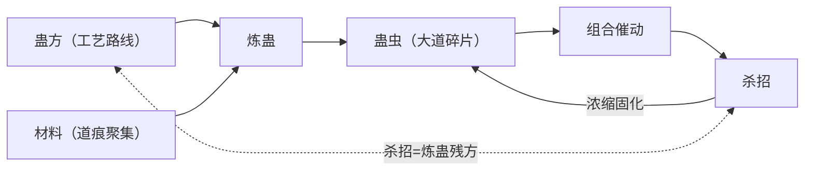

# 蛊虫、蛊方、炼蛊与杀招

本页是"蛊虫↔蛊方↔炼蛊↔杀招"关系链的检索入口总纲：先给关系链与具体炼蛊流程，细则分流到既有规则页（术语归 [炼蛊术语体系](../rules/refinement.md) REF，杀招归 [杀招连招并招体系](../rules/killer-moves.md) KM，饲养归 [蛊的饲养与炼化](gu-care-and-refinement.md)）。本页新增事实均为原文行级核验；跨页引用的结论以目标页的 ID 为准。

## 关系链总览

- 本体论锚点："蛊虫是大道碎片，蛊材则是道痕聚集"（鲁桐兰语，方源独立复述）`蛊真人-clean.txt:401146`、`290910` `[对话|已核]` → REF-019。炼蛊的本质是让道痕/大道碎片形成新的稳定结构（分析层综合，见 REF 页分析与解读）。
- 炼、养、用三分（15724 → REF-001）；"炼化"（收服单蛊、抹意志）≠"炼制"（按方炼成蛊）≠"饲养"（日常供给），三者不可混写（[蛊的饲养与炼化](gu-care-and-refinement.md)）。
- 杀招＝不同蛊虫的组合运用（墨瑶述 105506）；"杀招必须至少两个蛊虫组合形成"（KM-014）。

## 蛊方是什么

- **内容结构**（实例归纳）：蛊方写明基础蛊＋搭配蛊＋炼蛊材料——"四转炎瞳蛊是从三转的火眼蛊，搭配目击蛊，以及相干的一些炼蛊材料，合炼而成的" `蛊真人-clean.txt:100780` `[叙事|已核]`；蛊方可读出难度、产量与主材成本（"需要大量的新鲜兽皮作为炼蛊主材"）`蛊真人-clean.txt:95198` `[叙事|已核]`。
- **主材与替换**："群力蛊蛊方中，最稀缺的就是石猴毫毛这项炼蛊材料。其余的材料……凭借你炼道底蕴，替换掉也行" `蛊真人-clean.txt:125696` `[对话|已核]`（说话人：黎山仙子）；改良蛊方可加料改造（墨瑶以元磁精元为主材改良地魁尸蛊）`蛊真人-clean.txt:104954` `[叙事|已核]`。替代边界与劣化规则归 REF-019。
- **工艺路线可分步**：五窍火塔蛊对应一至五转五张蛊方逐级递进；高明者可改良蛊方省步骤甚至一步登天，但受工序约束（冒进加速＝自找死路）→ REF-018。
- **来源**：传承与家族保管（REF-004/006；真传常"只有仙蛊方、仙道杀招等等，缺乏仙蛊"——蛊喂养难长存，故传方不传蛊 `蛊真人-clean.txt:204184` `[叙事|已核]`；智慧蛊蛊方唯天庭收藏 `蛊真人-clean.txt:291016` `[叙事|已核]`）、拍卖与交易（蛊方价值高于其必须材料——和稀泥个案 `蛊真人-clean.txt:90358` `[叙事|已核]`；残方按完整度计价——见面似相识"有五成的完整度" `蛊真人-clean.txt:151150` `[叙事|已核]`；我意蛊蛊方系与毛六交易所得 `蛊真人-clean.txt:201882` `[叙事|已核]`）、推演（从无到有推算六转仙蛊方"耗费的青提仙元要至少超过一百"、起步"连百分之一都不到" `蛊真人-clean.txt:122006`、`122026` `[对话|已核]`（说话人：方源）；"推演蛊方，一是底蕴。二是灵感"，底蕴深厚也常卡数年数十年上百年 `蛊真人-clean.txt:123492` `[叙事|已核]`；完善他人残方也是生计——方源帮琅琊地灵完善仙蛊方赚仙元石 `蛊真人-clean.txt:153210` `[叙事|已核]`）、梦境（龙人分身凭直觉感应判断"通过这幕梦境，我就能得到挂帅蛊的蛊方" `蛊真人-clean.txt:339638` `[对话|已核]`）。

## 具体怎么炼蛊（流程五步）

1. **前提三件套**：蛊方（合炼须秘方、无方不知如何合炼，15724 → REF-004）＋材料（主材辅材、仙材按可炼转数分级——冰心＝六转仙材 → REF-024；材料可替代但需流派一致且规模对等 → REF-019）＋炼道境界（"炼道相对其他流派，更加难以精深" `蛊真人-clean.txt:152280` `[叙事|已核]`）。
2. **炼前准备**："炼制仙蛊前须调状态至巅峰、心静神清、对仙蛊方研究推演无数遍" `蛊真人-clean.txt:156002` `[叙事|已核]`；炼前在头脑中不断推演正炼/逆炼可能的失败、综合多方案选出风险低时间少的精炼方案 `蛊真人-clean.txt:152834` `[叙事|已核]` → REF-009。
3. **炼制执行**：分步骤推进，存在**雏形阶段**（方源一心二用"将之前的九只鬼火蛊雏形放缓炼制速度" `蛊真人-clean.txt:151314` `[对话|已核]`）；须控火候（"炼制小心蛊须一步步控制火候，冒然用杀招加快步骤根本就是自找死路" → REF-015/E:V4-151696）；有明确时间窗（地藏花蛊"须在三十个呼吸内将上百根草毛编织好，一旦超过……炼蛊的火焰就会将这些草、毛烤焦"）`蛊真人-clean.txt:150658` `[对话|已核]`（说话人：方正）；失败形态如雏形化灰（"其中一只却是化为灰烬"）`蛊真人-clean.txt:151226` `[叙事|已核]`；成蛊有标志（"鬼火哗的一声，骤然散去，十只鬼火蛊齐飞而出"）`蛊真人-clean.txt:151298` `[叙事|已核]`。
4. **手法与辅助**：**炼道手法**是步骤内的操作技术，需无数次练习苦修——复投（"连续投入两只蛊虫，这是炼道手法——复投……如呼吸般自然随意"）`蛊真人-clean.txt:151278`–`151280` `[对话|已核]`；纷纷手（将上百根上游草与禅狮鬃毛在三十个呼吸内绞织在一起）`蛊真人-clean.txt:150658`–`150660` `[对话|已核]`；骤雨（墨瑶所授："加快炼蛊过程至少三成，更能提高两成多的效果"，但耗神、过用则精神恍惚甚至魂魄受伤）`蛊真人-clean.txt:106452` `[对话|已核]`（说话人：墨瑶意志）；高水平者可在炼制中连续切换十多种手法（郑山川个案，心神消耗巨大）`蛊真人-clean.txt:151598`–`151654` `[叙事|已核]`。辅助手段：炼道蛊阵"炼制蛊虫事半功倍"→ REF-026；环境路线＝流派之分（人族隔绝流 vs 毛民自然炼蛊 → REF-025、[炼道](refinement-path.md) 版图节）；智道推衍秘方、魂道/智道功底让多线炼制游刃有余（90188 → [智道](wisdom-path.md)；`蛊真人-clean.txt:151314` 安寒惊疑个案）。
5. **成败与产物**：成功率随转数暴跌（五转蛊"成功概率往往不足千分之一"、春秋蝉合炼不到百分之一 → REF-013；人族隔绝流六转仙蛊不到百分之一 → `蛊真人-clean.txt:195820`）；失败机理＝仙材道痕交融无法人为操纵（→ REF-014）叠加工序/干扰/运气（→ REF-015）；失败代价＝材料全损＋身魂反噬，高转炼制按多次失败做预算（→ REF-016、REF-010；五转炼制失败"伤筋动骨" `蛊真人-clean.txt:151418` `[对话|已核]`（说话人：方源））。产物四类：新蛊（合炼）、升转（升炼）、分解（逆炼）、修复（→ REF-004/005/008/011）；仙蛊转数有大道碎片规模上限（→ REF-020）。

## 蛊⇄杀招双向桥

- **杀招侧结构**：核心仙蛊＋辅助凡蛊＋催动次序三要素（173674 → KM-014）；杀招效果可超越核心蛊转数。定义句："杀招，就是蛊虫的绝妙搭配" `蛊真人-clean.txt:99762` `[叙事|已核]`；"同时催动多只蛊虫，蛊虫的效果相互搭配"（三头六臂需同时催动十八只、三位蛊师合力）`蛊真人-clean.txt:98446`–`98448` `[叙事|已核]`；蛊阵也是杀招的一种（池伤："蛊阵就是杀招的一种……杀招是多只蛊虫一同催用"）`蛊真人-clean.txt:248648` `[对话|已核]`（说话人：池伤）。组合必有弊端与后遗症 `蛊真人-clean.txt:106762` `[对话|已核]`（说话人：墨瑶）。核心蛊地位："一两个蛊虫的配合紊乱，只要不是杀招核心，不算个事儿"，核心被瓦解则全招崩解 `蛊真人-clean.txt:260700` `[叙事|已核]`；核心仙蛊可跨流派（净魂为核心组万我 139582、解谜为核心的梦道杀招 139584 → KM-014）。
- **杀招→蛊（固化）**：炼道流派的最高追求之一是"将种种杀招，统合成一只蛊虫"（290808 该行清洗稿"追求之一"后缺标点，短引取后半）`蛊真人-clean.txt:290808` `[叙事|已核]`。完整实例：凡道杀招我力原需四五十只蛊虫（290816），苏仙儿不断删减增添蛊材完善成我力蛊蛊方，"单单催动这只蛊虫，就能发出力道虚影"，且"蛊虫数量暴降到一只"，催动方便、速度快、真元消耗远比杀招少 `蛊真人-clean.txt:290816`–`290826` `[叙事|已核]`。并非所有杀招都能浓缩成一只——紫血先河阵、燃念飞石等浓缩到极致仍有数只仙蛊 `蛊真人-clean.txt:290856` `[对话|已核]`（说话人：方源）。浓缩升华＝删减蛊虫、增添蛊材、融汇一体 → REF-021/KM-013。利＝省临场步骤与心智消耗（万我蛊使万蛟催动步骤简略、同时间可催动五六次）；弊＝"蛊虫单一之后，就容易被针对"、失变招（万我蛊失去变招大手印/逆流护身印的空间）、单独催动威能未必更强（→ KM-013/018；`蛊真人-clean.txt:290860`–`290868` `[对话|已核]`（说话人：方源））；总评"总体而言，浓缩升华成一只蛊虫，好处更多" `蛊真人-clean.txt:290870` `[对话|已核]`（说话人：方源）。
- **蛊方→杀招（推演反推）**：炼道准无上方源"任何一件仙蛊方，在他的推算之后，就能转变成一记仙道杀招" `蛊真人-clean.txt:291316` `[叙事|已核]`；实例：血神子仙蛊方推算完成后即掌握血神子仙道杀招（291314–291318）、阎罗杀招是成功尝试且"足足进行了一个多月"（魂道境界不足拖后腿）`蛊真人-clean.txt:291070`、`291074` `[叙事|已核]`；有难易分档，个别需数十年上百年 `蛊真人-clean.txt:294306` `[叙事|已核]`；琅琊派所有宙道仙蛊方"在理论上"都能如此推算 `蛊真人-clean.txt:296304` `[叙事|已核]`。反向量级参照：凶雷恶人参考血神子蛊方花数年推出雷神子；正常蛊仙无智道辅助构思杀招平均需五六年，有仙蛊方/传承等参考可缩短但仍以年计 `蛊真人-clean.txt:299506`、`299514` `[叙事|已核]`——蛊方与杀招是同一套"道的运用"的两种形态。
- **同构**："任何一记杀招，不管是凡道杀招，还是仙道杀招，都算得上是一张炼蛊残方" → REF-021（`蛊真人-clean.txt:290800`，方源炼道准无上语境 `[对话|已核]`；290818 叙事复述"都可以算是炼蛊的残方"）。
- 人也是炼蛊对象："以人炼蛊和以蛊炼人，本质互通一致"、人体炼蛊术与版图四块 → [炼道](refinement-path.md) 版图节（412574、412614–412624）。

## 检索指引

| 查什么 | 去哪 |
|---|---|
| 单炼/合炼/逆炼/平炼/升炼/修复定义、失败机理、本命蛊规则、仙材分级 | [炼蛊术语体系](../rules/refinement.md)（REF-001…030） |
| 杀招定义、内部结构、连招并招、固化谱系 | [杀招连招并招体系](../rules/killer-moves.md)（KM-001…023） |
| 饲养消耗、炼化意志对抗、推演要素个案 | [蛊的饲养与炼化](gu-care-and-refinement.md) |
| 具体蛊虫（能不能炼、吃什么、代价） | [蛊虫索引](../gu/index.md) 与 [全书蛊虫总表](../gu/roster.md) |
| 炼道境界/流派层（两大流派、四块版图、境界五级） | [炼道](refinement-path.md)、[流派境界五级](../rules/path-realms.md) |

## 待核对

- 蛊方是否有统一格式模板：原文只见实例（炎瞳蛊 100780、群力蛊 125696、地藏花蛊步骤 150652），无格式总述，不得虚构字段表。
- 炼蛊载体形式多样未总述：有"炼蛊的火焰"（150658）、魂火（151226），也有真元空窍内单炼炼化（1830–1900）；是否存在通用"蛊炉"未核验，不得据其他作品补"炉"设定。
- 定仙游、万我等仙蛊的完整炼制过程未逐段建档（成功率与流派选择已录）；"十三种炼蛊手法"（151346）的完整清单未收集。

关联页面：[炼道](refinement-path.md)、[流派总表](path-roster.md)、[世界操作系统](world-operating-system.md)（炼制飞轮）。
