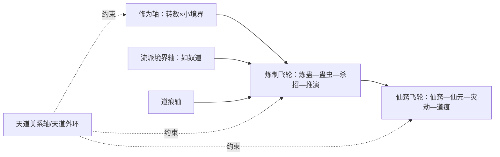

# 世界操作系统

> 本页是 World OS 关系骨架，不是完整世界观百科，也不替代具体实体页和原文核验。

新 AI 只读本页加链接，应能理解《蛊真人》底层力量模型：谁在修、用什么修、修出什么代价、天道如何约束。

## 原著明确内容

以下条目有 `canon-index` 依据，可直接用于检索与校验：

- 蛊师修行有一至九转，每一转又分初阶、中阶、高阶、巅峰（`canon-index:CAN-CULTIVATION-001`）。
- 一转、二转、三转分别使用青铜、赤铁、白银真元；四转为黄金真元，五转为紫晶真元（`canon-index:CAN-CULTIVATION-002`）。详见[修炼体系](cultivation-system.md)、[元海与真元](primeval-essence.md)。
- 六转后已脱离凡体，为蛊仙层次（`canon-index:CAN-IMMORTAL-BOUNDARY-001`）。
- 养蛊、用蛊、炼蛊构成持续压力；一般蛊师通常养四五只同转蛊（`canon-index:CAN-GU-CARE-001`）。详见[养蛊、用蛊与炼蛊](gu-care-and-refinement.md)。
- 相似蛊虫可共用喂养资源并在使用上互补（`canon-index:CAN-GU-SYNERGY-001`）；光虹蛊配合光源蛊是高消耗能力由辅助蛊降低消耗的具体组合例，不等于所有同类组合都成立（`canon-index:CAN-GU-SYNERGY-002`）。
- 凡人成仙涉及天地人三气，天地二气需与人气平衡（`canon-index:CAN-ASCENSION-001`）；升仙含碎窍、纳气等步骤，碎窍不可回头（`canon-index:CAN-ASCENSION-002`）。
- 六转后的福地灾劫、道痕等属于蛊仙阶段机制，不将灾劫、仙窍经营、道痕堆叠做成凡人跑局的常规模块（`canon-index:CAN-IMMORTAL-BOUNDARY-001`）。该 ID 在 canon-index 中的来源栏标为“待原文复核”，故此处改引本批已回读的原文窗口：六转每十年一地灾、按各仙窍内部时间计（136548–136564 行）；渡劫成功增加本道道痕，同流派增幅对应仙蛊、异流派可能冲突（138684–138712 行）。
- 仙窍飞轮的四个节点目前都有逐段原文落点，但仍只到个案例证层级：仙窍形成与青提仙元（112670–112726 行）、经营生态使仙元凝聚更快更多（121986–122000 行）、灾劫按各仙窍内部时间到来（136548–136564 行）、渡劫沉淀道痕并反哺生产环境（138684–138712 行）。逐节点落点见[资质与空窍](aptitude-and-aperture.md)、[修炼体系](cultivation-system.md)、[真元](primeval-essence.md)；本页只记骨架，不重复逐条事实，也不据此升级为全体系公式。
- 本页当前没有可单独升级的逐段原文事实用于“道痕异道排斥的完整机制”“杀招通用合成公式”“天道/人道相反法理的完整层级”。道痕异道冲突已有个案层证据（力道道痕与浪迹天涯水道道痕冲突，见[修炼体系](cultivation-system.md) 138692 行），但完整机制仍属待核对；相关条目见《资料整理》与《待核对》。

## 资料整理

以下条目来自读书笔记与已有 Wiki 页面的整理转述，尚未完成逐段原文核验，不得当作原著原文事实：

- 修为与流派是不同概念：修为指转数与小境界（见[修炼体系](cultivation-system.md)）；流派指如奴道这类修行路径，奴道蛊师以驱役奴仆作战，在对应传承中能发挥超越平常的战力（`canon-index:CAN-CULTIVATOR-002`）。资质与空窍见[资质与空窍](aptitude-and-aperture.md)。
- 炼制飞轮个案：月光蛊加两只小光蛊合炼二转月芒蛊（一次失败、小光蛊消亡，三天后再炼成功）；酸甜苦辣四酒合炼四味酒虫；万我杀招骨架为坚持仙蛊加挽澜仙蛊（F2b 的 240114–240186）。以上均为个案，不得泛化为通用合成公式。详见[养蛊、用蛊与炼蛊](gu-care-and-refinement.md)、[坚持仙蛊](../gu/persistence-gu.md)。
- 宿命修复与成功道痕：天庭曾通过中洲炼蛊大会和成功道痕推进宿命蛊修复；袁琼都等人以寿命和生命为代价参与修复（G 的 313180；H1 的 319672–321654）。详见[中洲炼蛊大会](../events/central-plain-refinement-conference.md)、[天庭](heavenly-court.md)、[宿命蛊](../gu/fate-gu.md)。
- 天道碎片与天意：后期资料把宿命蛊整理为天道碎片（H2 的 346540–346916）；天意被整理为天地的意志，资料记录天意为阻止幽魂逆天炼制曾扶持方源（H2 的 337628–338494）；星宿以身合道并以智道意志影响天意（H1 的 322968–323056）。三者不是同一实体，精确因果待核验。详见[宿命](../themes/fate.md)、[宿命蛊](../gu/fate-gu.md)。
- 界壁两阶段（均为 Run 1，不得并入 Run 2）：缩减在 Run 1 炼蛊大会阶段（原文行 313034、313036）；彻底消弭在 Run 1 宿命大战收尾（原文行 323400）。详见[中洲炼蛊大会](../events/central-plain-refinement-conference.md)、[宿命大战](../events/fate-war.md)。
- 全书弧线入口：13 弧切分见[全书故事骨架总览](../events/story-arc-overview.md)；南疆地域入口见[南疆与山寨](south-jiang.md)。

## 分析与解读

以下为当前归纳模型，不是原著明文；回答世界观问题时必须声明这是分析层：

- 模型性质声明：本页两个飞轮与天道外环均为认知模型/关系模型，不是严格因果公式。节点之间是相互作用与条件依赖关系，有阶段边界，不得读成单向必然链。
- 四轴模型：修为轴（转数×小境界，回答“多强”）、流派境界轴（回答“用什么道理解世界”）、道痕轴（回答“身上沉淀了什么、擅长什么、被什么排斥”）、天道关系轴（回答“天道/天意允许什么、代价是什么”）。四轴并存，一人同一时刻有四个坐标。道痕轴承载增幅、排斥、积累、环境作用等关系，不限于构筑玩法。
- 炼制飞轮：炼蛊—蛊虫—杀招—推演。蛊虫是生产资料，杀招是多蛊组合的用法沉淀，推演决定下一个炼什么。本 Wiki 只记录已建个案，不承诺全量配方表。
- 仙窍飞轮：仙窍—仙元—灾劫—道痕。仙窍产出仙元支撑行动，灾劫考验仙窍经营，渡劫沉淀道痕，道痕回头改变能力与代价。不得读成“仙窍必然→仙元必然→灾劫必然→道痕”的单向线性链；各环节有条件依赖与阶段边界。本环属于蛊仙阶段，凡人页不展开。
- 天道外环：天道/天意/宿命蛊/天庭是四种不同东西——规则碎片、天地意志、制度组织。不得读成“天道→天意→宿命蛊→天庭”的单向线性链；节点之间是相互作用与条件关系。天庭是组织主体，不是天地规则层；天庭解释、维护、利用规则；人物（红莲、方源）走反抗路径。任何“天意安排”表述不得抹掉人物选择。
- M2/M3 用途：M2 多轴模型是 Wiki 认知骨架（本页即 M2 入口）；M3 闭环模型是游戏系统动力（飞轮如何转、代价如何结算，设计细节不在本 Wiki 写数值）；M1 只作新手视图（转数等级感，不承载四轴）。
- 导航用法：先定轴（问的是修为、流派、道痕还是天道关系），再进飞轮（炼制还是仙窍），最后查天道外环是否约束成立。链接只表示导航可达，不代表新增事实主张。

相关页面：[修炼体系](cultivation-system.md)、[资质与空窍](aptitude-and-aperture.md)、[元海与真元](primeval-essence.md)、[养蛊、用蛊与炼蛊](gu-care-and-refinement.md)、[灾劫体系](../rules/tribulation.md)、[道痕体系](../rules/dao-marks.md)、[天庭](heavenly-court.md)、[方源](../characters/fang-yuan.md)、[春秋蝉](../gu/spring-autumn-cicada.md)。

## 待核对

- 五级流派境界的完整能力表未建立；不得把单个流派个案（如奴道驱役）外推为全流派通用规则。
- 尊者资格链的完整条件未建立；九转、无上大宗师、尊者资格及天道拦截的完整关系未完成核验，本页事实层不断言九转等同尊者。
- 天道、人道与其他流派的完整层级关系未建立；天意、宿命蛊、命运蛊、运道之间的精确机制须逐段回原文。
- 炼蛊术语分类已独立成规则页（单炼/合炼/逆炼/平炼/升炼/修复，REF-001…012）：[炼蛊术语体系](../rules/refinement.md)；"正炼"独立定义段与升炼/合炼边界仍在该页待核对。
- 杀招通用合成公式不存在，不得虚构。
- T1 五级境界逐级考证已按决策延期，本页不执行。
